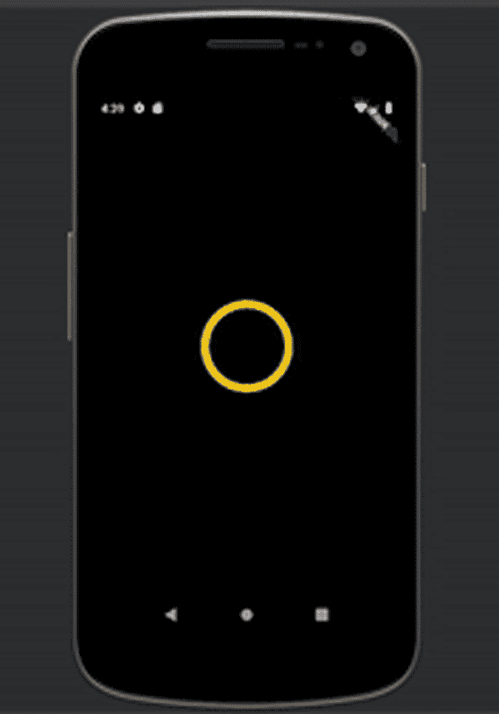
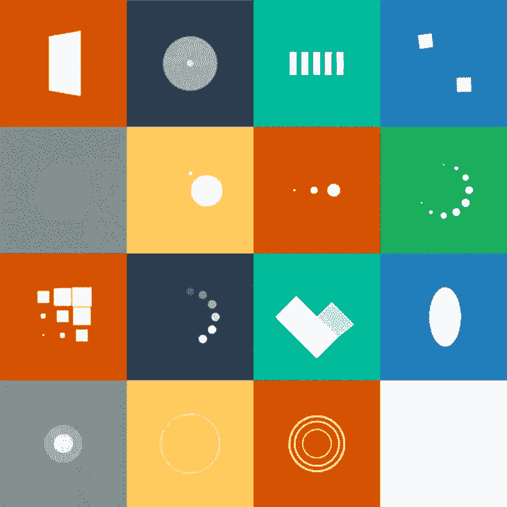
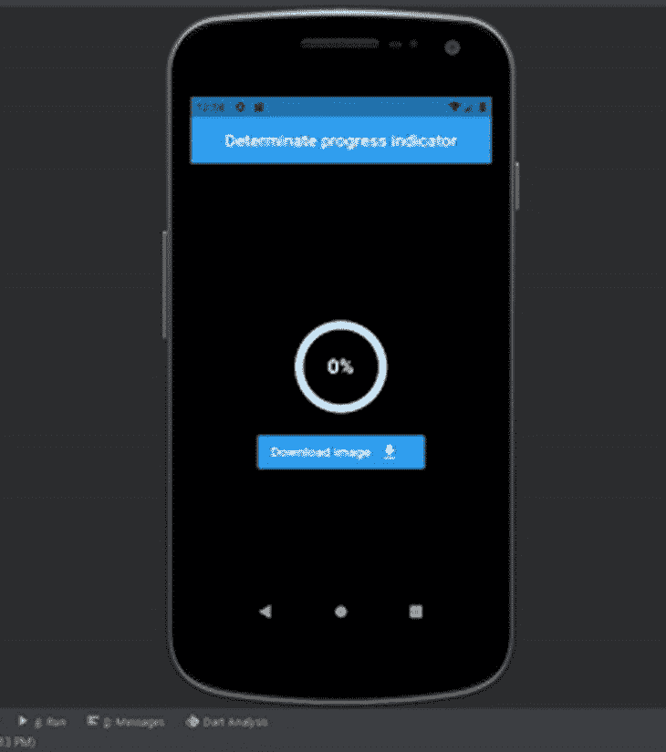
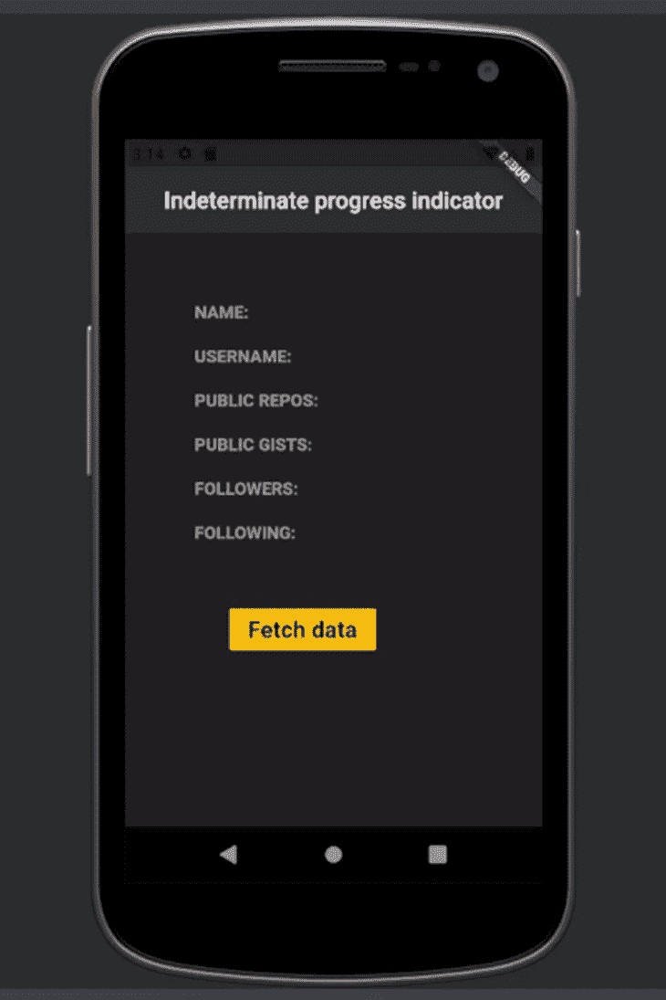

# 为异步颤振应用选择正确的进度指标

> 原文：<https://blog.logrocket.com/choosing-right-progress-indicators-async-flutter-apps/>

## 介绍

您是否曾经在移动应用程序中填写并提交表单，然后看到一个动画或图形弹出窗口，指示您的请求正在处理中？然后，另一个弹出窗口出现，通知您请求是否成功？

这是一个使用图形装饰器向用户传达其动作状态的常见例子。在 Flutter 中，这些装饰器被称为进度指示器。

在本文中，您将了解如何在异步应用程序中实现 Flutter 的内置进度指示器。我们将深入研究每个指标，了解它们是如何工作的，以及如何对它们进行定制。然后，我们将构建两个应用程序，在发出下载和外部 API 请求时向用户显示进度指示器。

### 先决条件

*   省道和扑动的工作知识
*   安装在您机器上的 Dart、Android 和 Flutter SDKs
*   您选择的 Flutter 开发环境

在这个演示中，我将使用 Android Studio 作为我的开发环境。

## 什么是异步应用？

异步应用程序由一个任务或一组任务组成，这些任务处于运行状态，而程序的其余部分继续前一个任务，直到它完成。

理想情况下，您已经决定是否在您的程序中应用异步执行，因为您将知道您正在尝试构建什么样的系统。确定这一点的一个有用的技巧是识别应该独立执行的特定任务和那些依赖于其他过程的完成的任务。

## 颤振进度指示器

顾名思义，进度指示器有助于传达用户请求的状态。需要进度指标的行动包括:

*   下载文件
*   上传文件
*   提交表单
*   在应用程序上加载页面

Flutter 有一个抽象的`ProgressIndicator`类，它的具体进度指示器部件`LinearProgressIndicator`和`CircularProgressIndicator`是这个类的子类。

我们将看看 Flutter 中可用的三个进度指示器。在我写这篇文章的时候，Flutter 中有两个内置的指示器，其余的是必须安装在你的 Flutter 项目中的外部依赖项。

### 线性进度指示器

这是 Flutter 的第一个内置进度指示器，它是`ProgressIndicator`抽象类的子类。它用于在水平栏中传达任务的进度。

### 循环进度指示器

这是 Flutter 的第二个内置进度指示器，也是`ProgressIndicator`抽象类的子类。`CircularProgressIndicator()`旋转以告知任务正在被处理。

一般来说，这些指标的持续时间可以是确定的，也可以是不确定的。

一个确定的进度指标用于传达已完成任务的部分或百分比以及尚未执行的部分。

指标的值随着任务执行过程中取得的每一点进展而变化。每个进度指示器都有一个`value`属性，该属性接受在`0.0`和`1.0`之间的`double`数据类型，以设置指示器的起点和终点。



上图是一个确定的循环进度指示器，使用以下代码段构建:

```
    dart

class DeterminateIndicator extends StatefulWidget {

      @override
      _DeterminateIndicatorState createState() => _DeterminateIndicatorState();
    }

    class _DeterminateIndicatorState extends State<DeterminateIndicator > {

      @override
      Widget build(BuildContext context) {

        return Scaffold(
          backgroundColor: Colors.black,
          body: Center(
            child: Padding(
              padding: const EdgeInsets.all(10.0),
              child: TweenAnimationBuilder(
                tween: Tween(begin: 0.0, end: 1.0),
                duration: Duration(seconds: 3),
                builder: (context, value, _) {
                  return SizedBox(
                    width: 100,
                    height: 100,
                    child: CircularProgressIndicator(
                      value: value as double,
                      backgroundColor: Colors.grey,
                      color: Colors.amber,
                      strokeWidth: 10,
                    ),
                  );
                }
              ),
            )
            )
          );

      }

    }

```

指示器旋转三秒钟，这在`TweenAnimationBuilder()`小部件的持续时间中定义。

不确定进度指示器用于传达没有确定工期的任务的进度。换句话说，当我们不知道任务需要多长时间才能完成时，就使用这个指标。

通过将指示器的`value`属性设置为`null`，可以使指示器变得不确定。


上图是一个不确定的线性进度指示器，使用以下代码段构建:

```
    dart

    class IndeterminateIndicator extends StatefulWidget {

      @override
      _IndeterminateIndicatorState createState() => _IndeterminateIndicatorState();
    }

    class _IndeterminateIndicatorState extends State<IndeterminateIndicator > {

      @override
      Widget build(BuildContext context) {

        return Scaffold(
          backgroundColor: Colors.black,
          body: Center(
            child: Padding(
              padding: const EdgeInsets.all(10.0),
              child: SizedBox(
                     child: LinearProgressIndicator(
                      backgroundColor: Colors.grey,
                      color: Colors.amber,
                      minHeight: 10,
                    ),
              ),
            )
            )
          );

      }

    }

```

## 颤振自旋工具包

`flutter_spinkit`是一个外部包，它包含了一组可以在你的应用程序中实例化的动画指示器。

要在您的项目中安装这个包，请在您的`pubspec.yaml`文件中添加下面的依赖项:

```
dependencies:
  flutter_spinkit: ^5.1.0

```

或者，您可以在终端中运行以下命令:

```
console

$ flutter pub add flutter_spinkit

```

以下是该套件中一些可用指标的预览。



您可以随时参考 [flutter_spinkit 文档](https://pub.dev/packages/flutter_spinkit)，从其他可用选项中选择更适合您应用主题的选项。

## 进度指示器的合适用例

当在应用程序中应用进度指示器时，首先要考虑的是能否获得任务的终点或度量其进度。这使您能够决定应该选择确定的还是不确定的进度指示器。

例如，您可以衡量任务的进度，从而应用确定的进度指标的情况包括:

*   上传文件
*   下载文件
*   实施倒计时

但是，当您无法衡量任务的进度时，不确定的标记是您的最佳选择。这种情况的例子包括:

*   加载应用程序
*   通过 HTTP 连接发送数据
*   请求 API 的服务

由 flutter_spinkit 包提供的指示器通常被归类为加载指示器。因此，当您需要一个不确定的进度指示器时，最适合使用它。

## 实施确定的进度指标

让我们来演示一个确定性指标是如何工作的。我们将通过构建一个点击一下按钮就能从互联网下载文件的应用程序来实现这一点。

您将通过循环进度指示器传达下载进度。我们正在下载的文件的大小是可获得的，所以我们将通过计算已经下载了多少字节来测量它的进度。

本演示所需的依赖项包括:

*   [path_provider](https://pub.dev/packages/path_provider) ，为我们存储下载的文件提供目录访问
*   [http](https://pub.dev/packages/http) ，允许通过互联网请求下载文件

```
dart

class DeterminateIndicator extends StatefulWidget {

  @override
  _DeterminateIndicatorState createState() => _DeterminateIndicatorState();
}

class _DeterminateIndicatorState extends State<DeterminateIndicator> {

  File? imageFile;
  double downloadProgress = 0;

  Future downloadImage() async {
    final url =      'https://images.unsplash.com/photo-1593134257782-e89567b7718a?ixid=MnwxMjA3fDB8MHxwaG90by1wYWdlfHx8fGVufDB8fHx8&ixlib=rb-1.2.1&auto=format&fit=crop&w=375&q=80';

    final request = Request('GET', Uri.parse(url));
    final response = await Client().send(request);
    final contentLength = response.contentLength;
    final fileDirectory = await getApplicationDocumentsDirectory();
    final filePath = '${fileDirectory.path}/image.jfif';

    imageFile = File(filePath);
    final bytes = <int>[];
    response.stream.listen(
          (streamedBytes) {
        bytes.addAll(streamedBytes);

        setState(() {
          downloadProgress = bytes.length / contentLength!;
        });
      },
      onDone: () async {
        setState(() {
          downloadProgress = 1;
        });
      },
      cancelOnError: true,
    );
  }

  @override
  Widget build(BuildContext context) {
    return Scaffold(
      backgroundColor: Colors.black,
      appBar: AppBar(
        title: Text('Determinate progress indicator'),
        centerTitle: true,
      ),
      body: Container(
        alignment: Alignment.center,
        padding: EdgeInsets.all(16),
        child: Column(
          mainAxisAlignment: MainAxisAlignment.center,
          children: [
            downloadProgress == 1 ? Container(
              width: 250,
                height: 250,
                child: Image.file(imageFile!)
            ) : Text('Download in progress'),
            SizedBox(height: 30),

            SizedBox(
              width: 100,
              height: 100,
              child: Stack(
                fit: StackFit.expand,
                children: [
                  CircularProgressIndicator(
                    value: downloadProgress,
                    valueColor: AlwaysStoppedAnimation(Colors.blueAccent),
                    strokeWidth: 10,
                    backgroundColor: Colors.white,
                  ),
                  Center(
                      child: downloadProgress == 1
                          ?
                      Text(
                        'Done',
                        style: TextStyle(
                            color: Colors.white,
                            fontWeight: FontWeight.bold,
                            fontSize: 20
                        ),
                      )
                          :
                      Text(
                        '${(downloadProgress * 100).toStringAsFixed(0)}%',
                        style: TextStyle(
                          fontWeight: FontWeight.bold,
                          color: Colors.white,
                          fontSize: 24,
                        ),
                      )
                  ),
                ],
              ),
            ),

            const SizedBox(height: 32),
            Container(
              width: 200,
              height: 40,
              child: RaisedButton(
                onPressed: downloadImage,
                color: Theme
                    .of(context)
                    .primaryColor,
                child: Row(
                    children: <Widget>[
                      Text(
                        'Download image',
                        style: TextStyle(
                            color: Colors.white,
                            fontSize: 16
                        ),
                      ),
                      SizedBox(width: 10),
                      Icon(
                        Icons.download,
                        color: Colors.white,
                      )
                    ]
                ),
              ),
            )
          ],
        ),
      ),
    );
  }

}

```

在上面的代码中，我们向图像的 URL 发送了一个 HTTP 请求。您可以用自己选择的图像 URL 替换该 URL。来自 HTTP 请求的响应内容被读取为字节。

使用`downloadProgress`变量测量来自响应的每个流字节，并针对其值的每次变化重新构建小部件。

最后，一旦下载过程完成，我们就在屏幕上显示下载的图像，并将`downloadProgress`的值定义为等于 1。下面，您可以在我们的示例应用程序中看到最终结果。



## 实施不确定的进度指标

对于这个演示部分，我们将构建一个简单的应用程序，它向 GitHub Rest API : `[https://api.github.com/users/olu-damilare](https://api.github.com/users/olu-damilare)`发出 HTTP 请求。然后，我们将继续在屏幕上呈现从这个请求中获得的一些数据。

因为我们不知道这个请求需要多长时间，所以我们必须实现一个不确定的进度指示器来通知请求当前正在处理中。

构建此应用程序所需的外部依赖项有:

```
dart
class IndeterminateIndicator extends StatefulWidget {

  @override
  _IndeterminateIndicatorState createState() => _IndeterminateIndicatorState();
}

class _IndeterminateIndicatorState extends State<IndeterminateIndicator> {

  String? name;
  String? username;
  String? publicRepos;
  String? publicGists;
  String? followers;
  String? following;
  bool isLoading = false;

  Future<void> fetchData() async{
    setState(() {
      isLoading = true;
    });

    try {
      Response response = await get(
          Uri.parse('https://api.github.com/users/olu-damilare'));
      Map data = jsonDecode(response.body);

      setState(() {
        name = data['name'];
        username = data['login'];
        publicRepos = data['public_repos'].toString();
        publicGists = data['public_gists'].toString();
        followers = data['followers'].toString();
        following = data['following'].toString();
        isLoading = false;
      });

    }catch(e){
      print('caught error: $e');
    }
  }

  @override
  Widget build(BuildContext context) {
    return Scaffold(
        backgroundColor: Colors.grey[900],
        appBar: AppBar(
        title: Text('Indeterminate progress indicator'),
        backgroundColor: Colors.grey[850],
        centerTitle: true,
        elevation: 0.0,
    ),
        body: isLoading ?
        Center(
            child: SizedBox(
              height: 200,
              width: 200,
              child: SpinKitCircle(
                itemBuilder: (BuildContext context, int index) {
                  return DecoratedBox(
                    decoration: BoxDecoration(
                      color: Colors.amber,
                    ),
                  );
                },
              ),
            )
        )
        :
        Padding(
        padding: EdgeInsets.all(60),
        child: Column(
          crossAxisAlignment: CrossAxisAlignment.start,
          children: <Widget>[

          Row(
            children: [
              buildParam('NAME:'),
              SizedBox(width: 15.0),
              name == null ? Text('') : buildData(name!),
            ],
          ),
          SizedBox(height: 20.0),
            Row(
              children: [
                buildParam('USERNAME:'),
                SizedBox(width: 15.0),
                name == null ? Text('') : buildData('@${username}'),
              ],
            ),
            SizedBox(height: 20.0),
            Row(
              children: [
                buildParam('PUBLIC REPOS:'),
                SizedBox(width: 15.0),
                name == null ? Text('') : buildData(publicRepos!),
              ],
            ),

          SizedBox(height: 20.0),
            Row(
              children: [
                buildParam('PUBLIC GISTS:'),
                SizedBox(width: 15.0),
                name == null ? Text('') : buildData(publicGists!),
              ],
            ),
            SizedBox(height: 20.0),
            Row(
              children: [
                buildParam('FOLLOWERS:'),
                SizedBox(width: 15.0),
                name == null ? Text('') : buildData(followers!),
              ],
            ),

            SizedBox(height: 20.0),
            Row(
              children: [
                buildParam('FOLLOWING:'),
                SizedBox(width: 15.0),
                name == null ? Text('') : buildData(following!),
              ],
            ),

            Padding(
              padding: const EdgeInsets.only(top: 50.0, left: 30),
              child: RaisedButton(
                color: Colors.amber,
                onPressed: fetchData,
                child: Text(
                    'Fetch data',
                  style: TextStyle(
                    fontWeight: FontWeight.bold,
                    fontSize: 20
                  ),
                ),
              ),
            )
          ]
          ),
          ),
          );
      }

      Widget buildParam(String param){
        return Text(
          param,
          style: TextStyle(
            fontSize: 15.0,
            fontWeight: FontWeight.bold,
            color: Colors.grey,
          ),
        );
      }

      Widget buildData(String data){
        return Text(
          data,
          style: TextStyle(
            fontSize: 20.0,
            fontWeight: FontWeight.bold,
            color: Colors.amber[400],
          ),
        );
      }
}

```



## 最后的想法

进度指示器对应用程序的用户体验是无价的。您不想让您的用户在每次执行操作时都怀疑您的应用程序中是否有小故障，并且没有关于他们的请求状态的适当指示。

适当地选择指示器也会影响您的应用程序的用户体验，我希望我能够指导您为您的异步 Flutter 应用程序选择和实现正确的进度指示器。

## 使用 [LogRocket](https://lp.logrocket.com/blg/signup) 消除传统错误报告的干扰

[](https://lp.logrocket.com/blg/signup)

[LogRocket](https://lp.logrocket.com/blg/signup) 是一个数字体验分析解决方案，它可以保护您免受数百个假阳性错误警报的影响，只针对几个真正重要的项目。LogRocket 会告诉您应用程序中实际影响用户的最具影响力的 bug 和 UX 问题。

然后，使用具有深层技术遥测的会话重放来确切地查看用户看到了什么以及是什么导致了问题，就像你在他们身后看一样。

LogRocket 自动聚合客户端错误、JS 异常、前端性能指标和用户交互。然后 LogRocket 使用机器学习来告诉你哪些问题正在影响大多数用户，并提供你需要修复它的上下文。

关注重要的 bug—[今天就试试 LogRocket】。](https://lp.logrocket.com/blg/signup-issue-free)