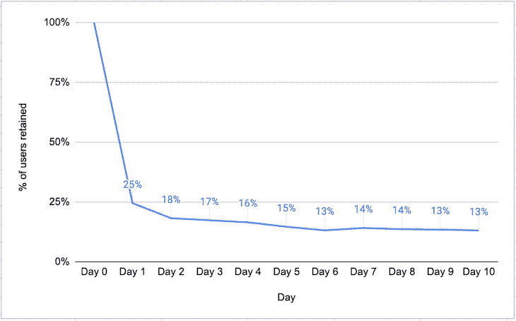
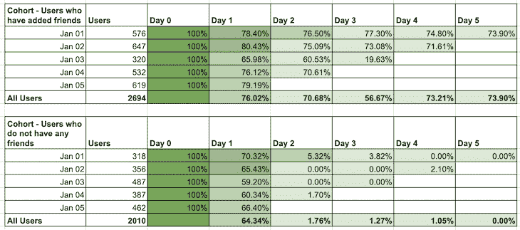

# 群组分析:如何降低流失率并提高保留率

> 原文：<https://blog.logrocket.com/product-management/cohort-analysis-how-to-reduce-churn-improve-retention/>

在本指南中，我们将定义什么是群组分析，概述进行习得和行为群组分析的好处，并通过五个步骤来进行群组分析。

我们还将解释在群组分析中收集的见解如何帮助您确定正确的步骤来减少流失并提高您的保留率。

* * *

## 目录

* * *

## 什么是队列分析？

一个群体是由一个共同的特征或环境结合在一起的一群人。群组分析是一种分析技术，用于了解具有共同特征的一组人的行为，例如，在 11 月注册的用户，在过去 6 个月内续订或变更的订阅用户等。

群组分析有助于产品经理分析特定客户群的用户体验。这些见解使产品团队能够确定正确的步骤和功能来改善产品体验。

## 群组分析示例

为了说明群组分析在实践中是什么样子，我们来看一个例子。假设一个电视频道订阅应用程序推出了一个月的免费试用，作为增加客户获取量的促销活动。这次促销活动是在十月份进行的。

由于这一优惠，10 月份有 1000 名用户订阅了该应用程序。60%的用户(600 个用户)在月底取消了他们的订阅。

第一步是分析这 600 个用户选择取消订阅的原因。让我们看看所有的可能性:

*   他们不喜欢内容
*   他们忘记了订阅
*   月租费太高了

您可能需要从各种来源收集一些定性和定量数据，以查明取消背后的根本原因。例如，您可能会发现这 600 名用户中有 80%认为订阅费太高，而其余的(20%)则完全忘记了他们的订阅。

下一步，您可能会考虑降低每月订阅价格或提供内容较少的低费率订阅。你也可以选择向另外 20%的用户投放重定向广告，提醒他们免费试用订阅，并更频繁地查看内容。

借助定性和定量数据，您可以确定最有效的改进步骤。这就是基本队列分析在实践中的样子。

## 队列分析的类型

群组分析有两种主要类型:

### 获取群组:识别“何时”

收购群组帮助你理解[流失](https://blog.logrocket.com/product-management/what-is-customer-retention-rate-how-to-calculate/#how-to-calculate-churn-rate)的模式——即导致用户变得不活跃的时刻。购买群体每月、每天或每周分配活跃用户，这取决于什么对你的产品最有意义。

例如，假设您的用户每天都在减少，但是您每天都在获取新用户。在这种情况下，您应该通过在特定天数内每天分配用户来进行获取群组分析。您可以选择此分析的时间段，使其与特定的推广期或新功能的[发布相一致。](https://blog.logrocket.com/product-management/how-to-measure-success-after-product-launch/)

下面是一个收购群体的例子。该图表显示了 10 天内每天的活动用户数，以及截至第 10 天每天保留的用户数:

你可以看到，在第一天，只有 33.2%的活跃用户从第 0 天(1 月 1 日注册)被保留。到第 10 天，这个数字下降到 13.11%。这意味着，在第 0 天注册的 2023 名用户中，大约有 265 名用户被保留下来，而其余的用户则流失了。

如果 66.8%的用户在第一天就开始工作，这意味着他们在应用程序中没有得到他们想要的东西:

或者，您可以将该图转换为[保留分析](https://blog.logrocket.com/product-management/how-to-increase-customer-retention-strategies-examples/)曲线，以更简单的方式处理数据。

该图表显示了 10 天内来自群组的活跃用户的保留情况。从上图中，我们可以推断出第一天发生了一些事情，这导致 75%的活跃用户停止使用该应用程序。

随着时间的推移，只有 13%的活跃用户在第 10 天被保留。很明显，你可以使用获取群组来确定“何时”部分，从而推断出大多数活跃用户是在何时进行交易的。

下一步是找出这些用户流失背后的原因。

### 行为队列:哪些行为会导致流失？

为了找出用户离开你的应用程序的根本原因，你可以做一个行为队列分析。这使您能够分析用户在执行某些操作后在应用程序中保持活动状态的时间。

例如，假设您运行一个社交媒体应用程序。您可以看到一些用户通过发送好友请求来添加好友，然后看到他们的提要中填充了他们朋友的活动。这个动作增加了用户的兴趣，迫使他们返回应用程序，看看他们朋友的生活发生了什么。

与此同时，还有一组用户从未发出过任何好友请求，因此当他们登录该应用程序时，没有任何活动提要可供查看。对于有朋友的第一批用户，我们可以看到很大一部分人被保留下来，并回来查看他们的活动提要。

现在让我们来分析第二批在加入后没有添加好友的用户。这些用户确实在第一天访问了应用程序——事实上，第一天保留的用户数量接近第一批。然而，因为他们看不到任何活动源，第二组的用户很快变得无聊，他们很少在第一天后回来。

这种行为表明没有添加好友的用户在应用程序中看不到任何价值，因此在第 1 天:

基于这些数据的下一步可能包括尝试通过在他们的 feed 中提供趋势帖子或提示他们添加新朋友来吸引用户，以便他们可以参与应用程序。

* * *

订阅我们的产品管理简讯
将此类文章发送到您的收件箱

* * *

因此，行为群组分析有助于识别活跃用户流失背后的原因，从而指导企业做出有意义的决策来留住用户。

## 为什么要进行队列分析？

进行群组分析可以在很多方面帮助产品经理。我们将在下面强调几个好处。

群组分析使产品团队能够:

### 验证假设

在产品开发过程中，产品经理会假设客户在应用程序中的行为。例如，当推出新功能时，用户需要遵循特定的步骤来使用该功能。群组分析可以帮助你确认这条路是你的用户要走的正确的路。

举一个真实世界的例子，假设您正在构建一个电子商务应用程序。您最近推出了按月订阅功能，使用户能够以较低的价格定期购买某些产品。

将用户分为两组:选择订阅的用户和没有选择订阅但仍然频繁重复购买同一产品的用户。分析这两个组的行为可以帮助您了解该功能是否成功，有多少用户继续订阅，以及他们在多长时间后取消订阅。

虽然订阅可以为用户节省资金，但是群组分析可能会揭示，一些用户不喜欢以折扣价每月订阅一个产品，因为他们不确定他们是否每个月都需要它。在这种情况下，同一产品在一段时间内的订阅量增加表明该功能是成功的。

### 提高保留率

为了[增加收入](https://blog.logrocket.com/product-management/what-product-management-metrics-matter-most-to-pms/#revenue)，保持现有用户，同时以稳定的速度获取新用户至关重要。用户可能会因为各种各样的原因停止使用你的产品。

您可以使用群组分析来查明用户在一段时间内流失的确切原因，以及某一组用户在一段时间内保留下来的原因。

通过更多地了解不同用户群或细分市场的体验，群组分析可用于提高用户保留率。

### 客户终身价值(LTV)

[客户终身价值(LTV)](https://blog.logrocket.com/product-management/what-customer-lifetime-value-clv-how-calculate/) 是你在一段时间内从每个客户身上获得的利润。这一指标有助于定义某一特定群体在一定时期内可以带来多少利润。

不同的群组可以指示不同的终身价值。这有助于你识别更有价值的群体，以及是什么让他们有价值。

通过更深入的生命周期价值群组分析，你还可以确定哪些营销活动和策略已经取得成功。

### 了解转换漏斗

转换漏斗指的是访问者在成为你的应用程序的用户之前所经历的步骤。

您可以使用群组分析和转化漏斗来分析不同的群组，并了解推动销售线索转化的关键事件。

这是一个漫长的过程，可能需要几个月的时间来整理数据，然后[分析用户行为](https://logrocket.com/customers/cat-person/)以了解什么可行，什么不可行。在分析之后，可以相应地调整营销策略以提高转化率。

## 如何减少客户流失，提高客户保留率

你的产品可以获得数百万的用户，但是如果他们没有坚持很长时间，那么即使是很高的获得率也没有意义，因为收入是不可持续的。

这就是为什么在一段时间内获得新用户的同时保留现有用户是至关重要的。要做到这一点，需要为用户找出导致他们停止使用应用程序的痛点。

现在，要找出用户从应用程序中流失的原因，关键是首先要了解用户保留的对象、内容、时间和原因，即，

*   你的用户是谁？
*   你的留存率是多少？
*   用户什么时候下线？
*   他们为什么要离开你的申请？

群组分析将帮助您了解群组或用户、您当前的留存率、导致用户离开应用程序的特定事件以及这些触发因素的时间段。

获得群组分析和行为群组分析可以提供关于谁、什么、何时以及为什么要保留的数据。分析结果有助于您做出明智的产品决策，最大限度地减少导致客户流失的事件，从而提高用户保留率。

## 如何进行队列分析:5 个步骤

群组分析的目的是测试基于共同特征的一组用户的假设，并分析他们的行为以改进业务目标。任何群组分析都包括五个基本步骤:

1.  [确定你的假设](#determine-your-hypothesis)
2.  [确定要跟踪的指标](#identify-metrics-to-track)
3.  [定义队列](#define-the-cohorts)
4.  [运行报告](#run-the-report)
5.  [分析结果](#analyze-the-results)

### 1.确定你的假设

要做的第一件事是最终确定一个要测试的假设。它可能是关于增加用户参与度、增加转化率或增加保留率/减少流失。

例如，假设一项新功能已经推出，企业需要知道它到目前为止有多成功。你可能会假设推出新功能后用户参与度增加了。

你可以在发布前和发布后将用户群分为同一组。在一段时间内分析这两个群体，看看他们在新功能推出后是否在产品上花费了更多时间，可以表明[用户参与度的增加](https://blog.logrocket.com/product-management/how-to-measure-success-after-product-launch/)。

### 2.确定要跟踪的指标

根据要测试的假设，确定与分析群组数据最相关的指标。

例如，对于用户参与度的假设，使用平均会话持续时间、会话频率、[获取率](https://blog.logrocket.com/product-management/what-is-aarrr-pirate-metrics-framework/#acquisition)等指标。类似地，对于保留的假设，诸如 dau、mau、粘性比率、超过 30 天的保留率等指标。很好衡量。

### 3.定义群组

群组是具有共同特征的用户组，例如相同的注册日期、年龄组、性别、位置等。根据要检验的假设，需要仔细选择群组。

例如，比方说 SaaS 的一家企业在销售季节对服务进行了打折订购。在这种情况下，群组可能包括在销售季节期间订阅的用户和在销售季节之前以常规价格点订阅的用户。

群组分析可以帮助您[计算一段时间内两组的保留率](https://blog.logrocket.com/product-management/what-is-customer-retention-rate-how-to-calculate/#how-to-calculate-retention-rate)，并分析折扣订阅是否成功保留了更多用户。

### 4.运行报告

一旦定义了群组，下一步就是运行报告，要么在电子表格中手动运行，要么使用具有群组分析功能的[软件。这些工具使您能够在几秒钟内查看结果，从而节省了您将数据手动添加到电子表格中所花费的时间。](https://logrocket.com/features/product-analytics)

### 5.分析结果

最后一步是分析报告，并仔细推导出第一步中假设集的答案。随着时间的推移，对报告中数据的分析要么支持假设，要么证明假设是错误的。

## 结论

结合各种群组分析可以释放出关于活跃用户行为的有价值的信息。这些见解在决定[走向市场](https://blog.logrocket.com/product-management/what-is-go-to-market-strategy-examples-guide/)和[产品战略](https://blog.logrocket.com/product-management/product-strategy-frameworks-examples/)时非常宝贵。

*精选图片来源:[icon scout](https://iconscout.com/icon/chart-growth-1913955)*

## [LogRocket](https://lp.logrocket.com/blg/pm-signup) 产生产品见解，从而导致有意义的行动

[LogRocket](https://lp.logrocket.com/blg/pm-signup) 确定用户体验中的摩擦点，以便您能够做出明智的产品和设计变更决策，从而实现您的目标。

使用 LogRocket，您可以[了解影响您产品的问题的范围](https://logrocket.com/for/analytics-for-web-applications)，并优先考虑需要做出的更改。LogRocket 简化了工作流程，允许工程和设计团队使用与您相同的[数据进行工作](https://logrocket.com/for/web-analytics-solutions)，消除了对需要做什么的困惑。

让你的团队步调一致——今天就试试 [LogRocket](https://lp.logrocket.com/blg/pm-signup) 。

[Monica Dhiman Follow](https://blog.logrocket.com/author/monicadhiman/) I am passionate about solving business problems by bringing the team together and removing impediments. I started my career as a business analyst before moving into product management. I am a Certified Scrum Master and I also write my thoughts about product management at [MonicaDhiman.com](http://monicadhiman.com).