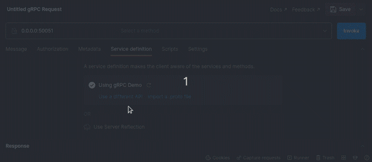
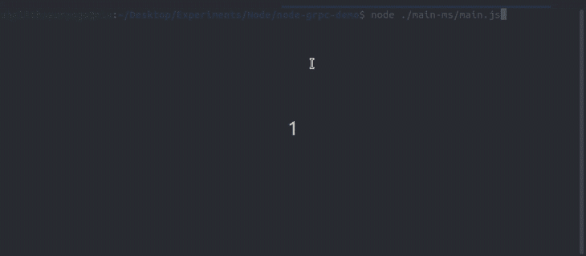

# 使用 gRPC 在 Node.js 微服务之间进行通信

> 原文：<https://blog.logrocket.com/communicating-between-node-js-microservices-with-grpc/>

如今，大多数开发人员选择微服务模式来构建他们的 web 后端，以克服传统整体架构中的问题。在 web 开发中，微服务通常是 web 开发人员通过 API 网关集成的松散耦合的 web 服务。第三方库的可用性、功能全面的内置 API 和有用的开发工具使 Node.js 成为构建微服务的良好候选。

即使微服务通常作为独立的服务工作，它们也可以通过各种通信机制相互通信。对于微服务间的通信，我们可以使用基于请求-响应的同步通信策略，也可以使用基于事件的异步通信策略。

gRPC(又名， [Google RPC](https://grpc.io/) )为开发人员提供了一个功能全面的 RPC 框架，实现了几乎所有流行的编程语言，包括 node . js。gRPC 框架通过 HTTP/2 协议在客户端和服务器之间使用 Protobuf 序列化技术发送二进制消息。

在本教程中，我将通过搭建三个微服务的实际通信系统来说明如何在 Node.js 中使用 gRPC。

*向前跳转:*

## Node.js gRPC 的突出特性

此前，gRPC 团队通过 Node.js 附加系统将 C++ gRPC 实现与 Node.js 绑定，为 Node.js 开发者提供了 [`grpc`包](https://www.npmjs.com/package/grpc)。最近，他们用纯 JavaScript 代码重写了 Node.js 包，没有添加 C++插件。这就产生了 [`@grpc/grpc-js`(节点 gRPC)包](https://www.npmjs.com/package/@grpc/grpc-js)。

在这一节中，我们将重点介绍`@grpc/grpc-js`提供的几个特性。

### Node.js 的完整官方 gRPC 实现

理论上，gRPC 是一个用 HTTP/2 协议和 Protobuf 序列化实现 RPC 框架的概念。Node.js gRPC 实现是一个维护良好的官方项目，它允许您使用 Node.js 中 gRPC 概念的所有功能。例如，您可以使用 Node gRPC 实现以下通信类型:

*   一元 RPC:传统的请求-响应式通信
*   服务器流 RPC:服务器根据客户端的请求发送一个数据流
*   客户端流 RPC:客户端向服务器发送数据流
*   双向流 RPC:用两个独立的流将消息传送到两端

除了这些基本的 gRPC 特性，这个节点包还支持自动重新连接、客户端拦截器等等。

### 开发人员友好的 API

当库开发人员提供最小的、自我解释的 API 时，其他开发人员能够使用该库进行生产。节点 gRPC 包提供了一个友好的 API，支持运行时和静态代码生成。当我们对节点 gRPC 使用 Protobuf 定义时，它会在运行时将可用的过程附加到 RPC 接口。此外，如果您想在运行代码之前看到 RPC 方法，您可以使用静态代码生成(即，在使用 [TypeScript](https://github.com/improbable-eng/ts-protoc-gen) 时)。

此外，节点 gRPC API 具有标准的、基于事件和基于回调的编程风格。所以任何 Node.js 开发者都可以快速上手。

### 一个纯 JavaScript 实现

`@grpc/grpc-js`包是使用内置 Node.js APIs 的纯 JavaScript 实现，就像 [`http2`](https://nodejs.org/api/http2.html) 。所以，这个包不会像遗留的`grpc`包那样触发额外的 Node C++附加安装任务。同样，这个纯 JavaScript 实现使用 TypeScript 来包含类型数据，所以我们可以很容易地将`@grpc/grpc-js`与 TypeScript 一起使用。

## Node.js gRPC 教程:微服务间通信

我们已经介绍了`@grpc/grpc-js`包的突出特性。总的来说，它提供了 gRPC 框架概念的全功能、官方、纯 JavaScript 实现。

现在，让我们通过实现一个实际的系统来学习如何使用它！我们将使用 gRPC 为微服务间通信开发三个 Node.js 微服务:

1.  **主微服务(primary)** :这个微服务通过 RESTful API 端点接受食品订单，然后与我们的两个辅助微服务通信来处理订单。RESTful API 还提供了一个端点来检查订单的状态
2.  **配方选择器微服务(辅助)**:主微服务与该微服务通信并搜索配方
3.  **订单处理器微服务(辅助)**:该微服务接受订单请求，并根据订单状态变化事件提供当前订单状态

### 设计解决方案

我们知道我们的产品需求，所以让我们定义项目架构。请看下面的概要设计图:


Our demo food-ordering system’s high-level architecture. I designed this using [diagrams.net](https://www.diagrams.net/).

如上图所示，我们将基于以下规范构建我们的解决方案:

*   主微服务使用 gRPC 与辅助微服务通信，并为 web 客户端提供以下 RESTful 端点:
    *   `POST /orders`:创建新订单
    *   `GET /orders/{orderId}`:返回订单明细(包括当前订单状态)
*   当配方选择器微服务收到新的 gRPC 消息时，它会选择一个配方并使用一元模式进行传输
*   当订单处理器微服务收到新的 gRPC 消息时，它通过服务器流模式传输订单状态

尽管现实世界中的微服务通常驻留在单独的计算机或容器中，但为了简化本教程，我们将为该解决方案创建一个面向 monorepo 的 Node.js 项目，并使用三个进程演示微服务系统。

## 创建项目并安装依赖项

首先，创建三个目录来逻辑分离我们的微服务:

```
mkdir {main,recipe,processor}-ms 

```

创建一个新的 Node.js 项目，如下所示:

```
npm init 
# --- or ---
yarn init

```

接下来，安装`@grpc/grpc-js`、`@grpc/proto-loader`和`express`依赖项:

```
npm install @grpc/grpc-js @grpc/proto-loader express
# --- or ---
yarn add @grpc/grpc-js @grpc/proto-loader express

```

> 注意:我们使用`express`来实现 RESTful API。`@grpc/proto-loader`包让你加载`.proto`文件。我们很快就会讨论`.proto`文件！

安装 [`concurrently`包](https://www.npmjs.com/package/concurrently)用一个命令运行所有微服务:

```
npm install concurrently -D
# --- or ---
yarn add concurrently -D

```

## 用协议缓冲区定义服务

RPC 框架/库通常让开发人员执行远程过程，所以我们应该首先定义所需的过程。在 gRPC 框架中，我们必须用 Protobuf 定义预定义过程。创建一个新目录来存储 Protobuf 文件:

```
mkdir protos

```

让我们为主微服务和配方选择器之间的通信线路创建一个 Protobuf 文件。将以下内容添加到`./protos/recipes.proto`文件中:

```
syntax = "proto3";

service Recipes {
  rpc Find (ProductId) returns (Recipe) {}
}

message ProductId {
  uint32 id = 1;
}

message Recipe {
  uint32 id = 1;
  string title = 2;
  string notes = 3;
}

```

这里，我们定义了`Find`过程，根据`ProductId`返回一个`Recipe`对象，这是一个食品的唯一标识符。注意，我们通常需要用一个服务定义对所有过程进行分组，比如`Recipes`。

接下来，将以下定义添加到`./protos/processing.proto`:

```
syntax = "proto3";

service Processing {
  rpc Process (OrderRequest) returns (stream OrderStatusUpdate) {}
}

message OrderRequest {
  uint32 recipeId = 1;
  uint32 orderId = 2;
}

enum OrderStatus {
    NEW = 1;
    QUEUED = 2;
    PROCESSING = 3;
    DONE = 4;
}

message OrderStatusUpdate {
  OrderStatus status = 1;
}

```

我们定义了`Process`过程来返回一串`OrderStatusUpdate`消息，以跟踪订单状态变更事件。此外，`Process`过程期望一个`OrderRequest`消息作为参数。

### 开发 gRPC 服务器

现在我们的 Protobuf 定义已经准备好了，我们可以开始开发 gRPC 服务器了。主微服务是一个 gRPC 客户端，它与两个辅助微服务通信。因此，首先，我们需要为二级微服务实现两个 gRPC 服务器。

让我们从配方选择器微服务开始。将以下代码添加到`./recipe-ms/main.js`:

```
const path = require('path');
const grpc = require('@grpc/grpc-js');
const protoLoader = require('@grpc/proto-loader');
const packageDefinition = protoLoader.
                            loadSync(path.join(__dirname, '../protos/recipes.proto'));
const recipesProto = grpc.loadPackageDefinition(packageDefinition);

const RECIPES = [
    {
        id: 100,
        productId: 1000,
        title: 'Pizza',
        notes: 'See video: pizza_recipe.mp4\. Use oven No. 12'
    },
    {
        id: 200,
        productId: 2000,
        title: 'Lasagna',
        notes: 'Ask from John. Use any oven, but make sure to pre-heat it!'
    }
];

function findRecipe(call, callback) {
    let recipe = RECIPES.find((recipe) => recipe.productId == call.request.id);
    if(recipe) {
        callback(null, recipe);
    }
    else {
        callback({
            message: 'Recipe not found',
            code: grpc.status.INVALID_ARGUMENT
        });
    }
}

const server = new grpc.Server();
server.addService(recipesProto.Recipes.service, { find: findRecipe });
server.bindAsync('0.0.0.0:50051', grpc.ServerCredentials.createInsecure(), () => {
    server.start();
});

```

上面的代码在端口`50051`上生成一个 gRPC 服务器实例，并根据`recipes.proto`文件中的服务定义处理 gRPC 消息。每当 gRPC 客户端使用有效的产品标识符执行`find`程序时，服务器就会找到合适的配方，并通过`callback`函数(使用一元模式)将其发送回来。

我们在教程中使用一个服务，但是您可以将多个服务附加到服务器，如下所示:

```
server.addService(recipesProto.Recipes.service, { find: findRecipe });
server.addService(ingredientsProto.Ingredients.service, { find: findIng });

```

您还可以添加多个过程，如下所示:

```
server.addService(recipesProto.Recipes.service, {
    find: findRecipe,
    add: addRecipe,
    update: updateRecipe,
    remove: remove Recipe
});

```

在测试上面的微服务之前，让我们创建另一个辅助微服务。我将在下一节解释如何用 [Postman](https://blog.logrocket.com/how-automate-api-tests-postman/) 测试这两个微服务。

将以下代码添加到`./processor-ms/main.js`中，以创建第二个辅助微服务:

```
const path = require('path');
const grpc = require('@grpc/grpc-js');
const protoLoader = require('@grpc/proto-loader');
const packageDefinition = protoLoader.
                            loadSync(path.join(__dirname, '../protos/processing.proto'));
const processingProto = grpc.loadPackageDefinition(packageDefinition);

function process(call) {
    let orderRequest = call.request;
    let time = orderRequest.orderId * 1000 + orderRequest.recipeId * 10;

    call.write({ status: 2 });
    setTimeout(() => {
        call.write({ status: 3 });
        setTimeout(() => {
            call.write({ status: 4 });
            call.end();
        }, time);
    }, time);
}

const server = new grpc.Server();
server.addService(processingProto.Processing.service, { process });
server.bindAsync('0.0.0.0:50052', grpc.ServerCredentials.createInsecure(), () => {
    server.start();
});

```

在这个 gRPC 服务器中，我们还附加了一个程序；这里我们使用流模式。每当微服务收到新的订单请求要处理时，它就会通过`call.write`函数传输新创建的订单状态。我们使用了`call.end`函数调用来指示流的结束，而不是使用前面一元微服务通信实现中使用的`callback`。

使用以下脚本更新您的`package.json`,以同时运行这两个微服务:

```
"scripts": {
  "start-recipe-ms": "node ./recipe-ms/main.js",
  "start-processor-ms": "node ./processor-ms/main.js",
  "start": "concurrently 'npm run start-recipe-ms' 'npm run start-processor-ms'"
},

```

现在，我们可以使用`npm start`或`yarn start`来启动这两个微服务。

## 用 Postman 测试 gRPC 服务器

Postman app [在 v9.7.1](https://blog.postman.com/postman-now-supports-grpc/) 中增加了 gRPC 客户端支持，所以如果你使用的是较老的 Postman 版本，请先下载最新版本再继续本教程。

使用`start` npm 脚本启动两个辅助微服务。首先，我们可以测试配方选择器微服务。

打开邮差 app，点击**文件**，然后点击**新建**(或者，按 Control+N/Command+N)，为`0.0.0.0:50051`新建一个 gRPC 请求:


Creating a new gRPC request with Postman

当我们使用 Postman 进行 gRPC 测试时，它作为一个客户端，所以它需要知道 Protobuf 服务定义。将`recipes.proto`文件导入到 Postman 客户端，如下所示:


Postman 会自动显示`Find`程序，所以你可以按如下测试:



Testing the `Find` procedure with Postman

这里，我们发送产品标识符来接收配方对象。使用相同的步骤测试订单处理器微服务。它将通过 gRPC 服务器流式传输功能流式传输多个订单状态变更对象。看下面的预告:


Testing gRPC streaming (with the `Process` procedure) with Postman

## 开发 gRPC 客户端并与服务器通信

我们基于 gRPC 的二级微服务在规范准备阶段就按预期工作。在这篇文章的开始，我们计划创建一个带有 gRPC 客户端的主微服务来与辅助微服务通信。主微服务的目标是接受一个食品订单请求，找到一个食谱，处理订单，并更新订单状态。

在实现主微服务的 RESTful 接口之前，我们先把它和其他微服务连接起来，通过终端进行测试。

将以下代码添加到`./main-ms/main.js`:

```
const path = require('path');
const grpc = require('@grpc/grpc-js');
const protoLoader = require('@grpc/proto-loader');

const packageDefinitionReci = protoLoader.
                            loadSync(path.join(__dirname, '../protos/recipes.proto'));
const packageDefinitionProc = protoLoader.
                            loadSync(path.join(__dirname, '../protos/processing.proto'));
const recipesProto = grpc.loadPackageDefinition(packageDefinitionReci);
const processingProto = grpc.loadPackageDefinition(packageDefinitionProc);

const recipesStub = new recipesProto.Recipes('0.0.0.0:50051',
                        grpc.credentials.createInsecure());
const processingStub = new processingProto.Processing('0.0.0.0:50052',
                        grpc.credentials.createInsecure());

let productId = 1000;
let orderId = 1;

console.log(`Searching a recipe for the product: ${productId}`);

recipesStub.find({ id: productId }, (err, recipe) => {
    console.log('Found a recipe:');
    console.log(recipe);
    console.log('Processing...');
    const call = processingStub.process({ orderId, recipeId: recipe.id });
    call.on('data', (statusUpdate) => {
        console.log('Order status changed:');
        console.log(statusUpdate);
    });
    call.on('end', () => {
        console.log('Processing done.');
    });
});

```

首先，上面的代码调用 recipe selector 微服务中的`find`过程来获取基于产品标识符的配方。接下来，它调用订单处理器微服务中的`process`过程来检测订单状态的变化。

看客户端[存根](https://stackoverflow.com/a/69591570/3565513)。对于一元模式，我们通常使用以下模式:

```
recipesStub.find({ id: productId }, (err, recipe) => {

```

对于流，我们可以将事件附加到 RPC 实例，如下所示:

```
 class="language-javascript hljs">call.on('data', (statusUpdate) => {

```

启动两个辅助微服务。运行以下命令启动客户端:

```
node ./main-ms/main.js

```

现在，您将看到示例食品加工系统的日志，如下所示:



Testing the gRPC client in the terminal

## 使用 RESTful 接口完成微服务

早些时候，主微服务通过向终端写入日志来作为控制台程序工作。在 web 开发中，微服务通常使用 web 协议，并让 web 客户端与它们通信。

让我们通过为主微服务实现一个 RESTful API 来完成演示订单处理系统。将以下代码添加到`./main-ms/main.js`文件中:

```
const path = require('path');
const grpc = require('@grpc/grpc-js');
const protoLoader = require('@grpc/proto-loader');
const express = require('express');

const packageDefinitionReci = protoLoader.
                            loadSync(path.join(__dirname, '../protos/recipes.proto'));
const packageDefinitionProc = protoLoader.
                            loadSync(path.join(__dirname, '../protos/processing.proto'));
const recipesProto = grpc.loadPackageDefinition(packageDefinitionReci);
const processingProto = grpc.loadPackageDefinition(packageDefinitionProc);

const recipesStub = new recipesProto.Recipes('0.0.0.0:50051',
                        grpc.credentials.createInsecure());
const processingStub = new processingProto.Processing('0.0.0.0:50052',
                        grpc.credentials.createInsecure());

const app = express();
app.use(express.json());

const restPort = 5000;
let orders = {};

function processAsync(order) {
    recipesStub.find({ id: order.productId }, (err, recipe) => {
        if(err) return;

        orders[order.id].recipe = recipe;
        const call = processingStub.process({
            orderId: order.id,
            recipeId: recipe.id
        });
        call.on('data', (statusUpdate) => {
            orders[order.id].status = statusUpdate.status;
        });
    });
}

app.post('/orders', (req, res) => {
    if(!req.body.productId) {
        res.status(400).send('Product identifier is not set');
        return;
    }
    let orderId = Object.keys(orders).length + 1;
    let order = {
        id: orderId,
        status: 0,
        productId: req.body.productId,
        createdAt : new Date().toLocaleString()
    };
    orders[order.id] = order;
    processAsync(order);
    res.send(order);
});

app.get('/orders/:id', (req, res) => {
    if(!req.params.id || !orders[req.params.id]) {
        res.status(400).send('Order not found');
        return;
    }
    res.send(orders[req.params.id]);
});

app.listen(restPort, () => {
  console.log(`RESTful API is listening on port ${restPort}`)
});

```

我们已经实现了两个 RESTful API 端点。每当微服务收到对具有有效产品标识符的`POST /orders`端点的新请求时，它就创建一个新订单并调用`processAsync`函数。`processAsync`功能通过 gRPC 协议与二级微服务通信，查找配方，并更新订单状态。

`POST /orders`端点返回新生成的订单标识符，我们可以用它和`GET /orders/{orderId}`端点一起获取订单细节。

现在，我们可以通过让它同时运行我们所有的微服务来改进`start` npm 脚本。在您的`package.json`中使用以下脚本定义:

```
"scripts": {
  "start-recipe-ms": "node ./recipe-ms/main.js",
  "start-processor-ms": "node ./processor-ms/main.js",
  "start-main-ms": "node ./main-ms/main.js",
  "start": "concurrently 'npm run start-recipe-ms' 'npm run start-processor-ms' 'npm run start-main-ms'"
},

```

运行`npm start`或`yarn start`启动演示点餐系统。用 Postman 测试 RESTful API，如下所示:

首先，用`POST /orders`创建几个订单:


接下来，用`GET /orders/{orderId}`检查订单状态:


您可以从 [my GitHub repository](https://github.com/codezri/node-grpc-demo) 下载完整的项目源代码。

## 结论

在本教程中，我们通过实现三个实际微服务的通信系统来练习在 Node.js 中使用 gRPC。我们使用了三个本地进程来演示三个微服务，但是您可以在裸机服务器或容器系统上的本地网络端口或远程端口上使用 gRPC，例如 [Docker](https://blog.logrocket.com/tag/docker/) 。

您还可以使用 WebSockets 进行微服务间的通信，但是 gRPC 是一个具有 RPC 定义语言(Protobuf)的全功能框架，与 WebSocket 协议不同。WAMP 在 WebSockets 上提供了一个类似 gRPC 的概念，但是它的实现并不像 gRPC 官方实现那样受欢迎。

## 200 只显示器出现故障，生产中网络请求缓慢

部署基于节点的 web 应用程序或网站是容易的部分。确保您的节点实例继续为您的应用程序提供资源是事情变得更加困难的地方。如果您对确保对后端或第三方服务的请求成功感兴趣，

[try LogRocket](https://lp.logrocket.com/blg/node-signup)

.

[](https://lp.logrocket.com/blg/node-signup)[https://logrocket.com/signup/](https://lp.logrocket.com/blg/node-signup)

LogRocket 就像是网络和移动应用程序的 DVR，记录下用户与你的应用程序交互时发生的一切。您可以汇总并报告有问题的网络请求，以快速了解根本原因，而不是猜测问题发生的原因。

LogRocket 检测您的应用程序以记录基线性能计时，如页面加载时间、到达第一个字节的时间、慢速网络请求，还记录 Redux、NgRx 和 Vuex 操作/状态。

[Start monitoring for free](https://lp.logrocket.com/blg/node-signup)

.