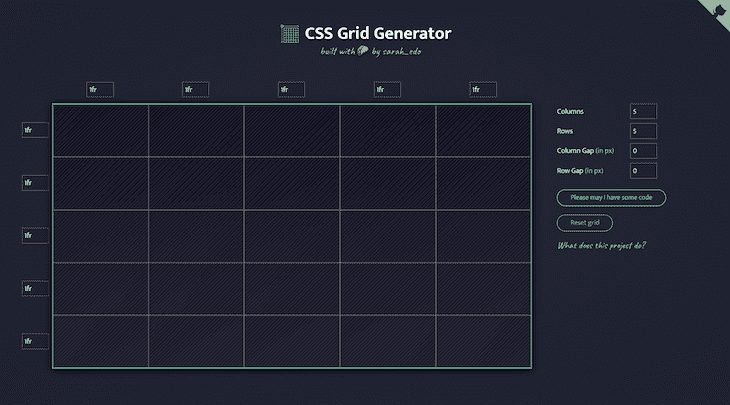
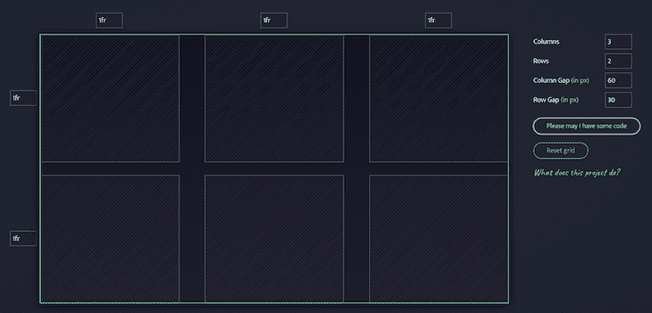
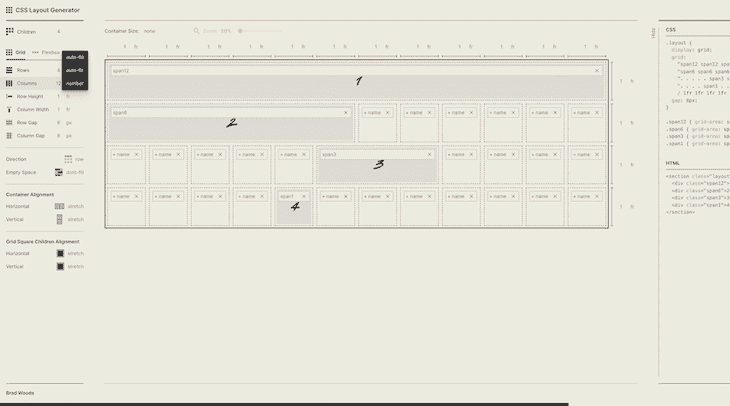
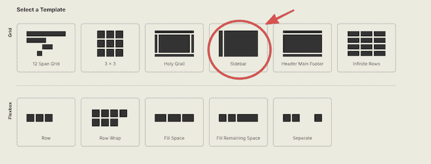
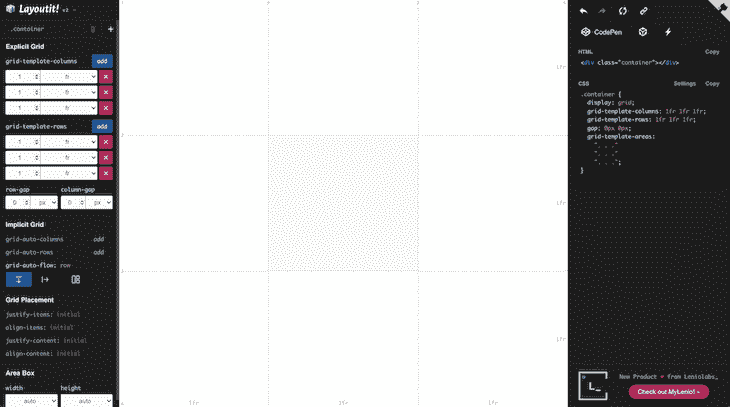
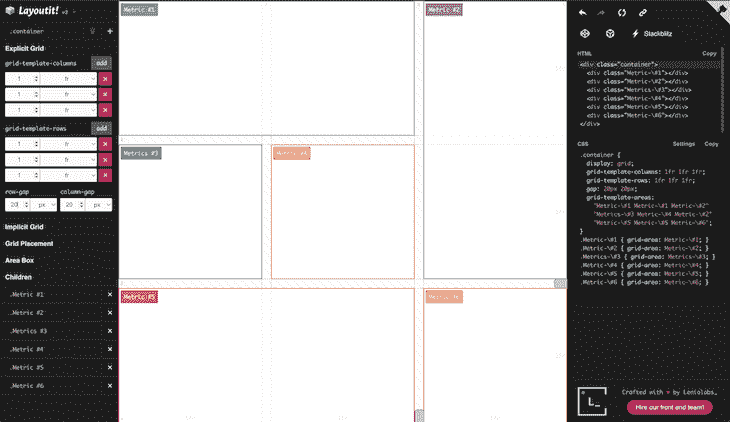
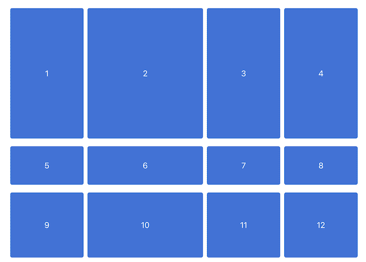
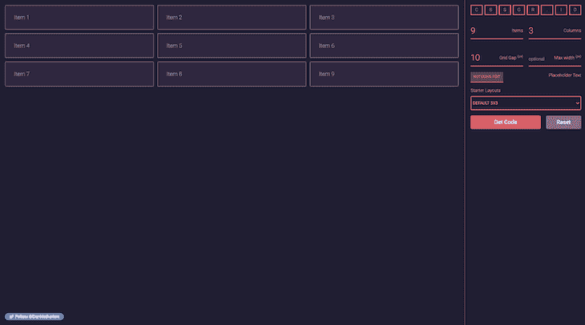
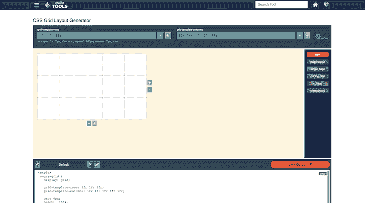
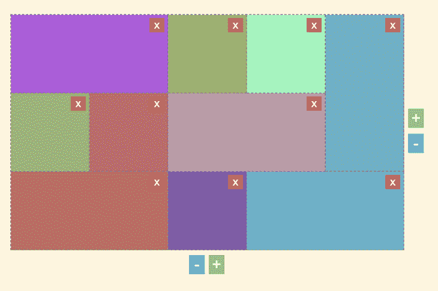

# 比较最好的 CSS 网格生成器

> 原文：<https://blog.logrocket.com/comparing-best-css-grid-generators/>

网格网格网格。我们可以用它们做很多事情。但是，我们必须记住这么多属性。😅

如果你像我一样，在使用网格时总是不得不求助于 Google，那么我们在本指南中介绍的技巧将会使你作为开发人员的生活变得更加容易。

## 什么是 CSS 网格生成器？

网格生成器是一个网站，你可以用它来生成一个网格，只需点击几下。但是你为什么要关心他们呢？就我而言，当我想设计网站的布局或者界面中复杂的响应结构时，我经常使用它们。网格很棒，因为它可以帮助你用几行 CSS 代码完成很多事情，节省很多时间。

在本文中，我们将比较以下 CSS 网格生成器，并列出它们的优缺点，以便您可以标记您最喜欢的一个:

此外，为了节省您的时间，我制作了一个备忘单，其中包含您应该记得的基本 CSS 网格属性。🥳这个备忘单在本文的底部。

## 1.CSS 网格生成器



我将 [CSS 网格生成器](https://cssgrid-generator.netlify.app/)放在列表的第一位，因为我用得最多。这是一个由[莎拉·德拉斯纳](https://twitter.com/sarah_edo)设计的开源项目(如果你想投稿，可以在这里获得项目的代码[)。](https://github.com/sdras/cssgridgenerator)

举个例子，我最近需要生成一个两行三列的简单网格。我不记得如何设置行间距和列间距的具体大小。使用 CSS Grid Generator，我能够轻松地创建我想要的结构，并继续执行更复杂的任务。

```
.parent {
  display: grid;
  grid-template-columns: repeat(3, 1fr);
  grid-template-rows: repeat(2, 1fr);
  grid-column-gap: 60px;
  grid-row-gap: 30px;
}

```

最终的网格看起来像这样:



**优点** **:**

*   界面是用户友好的，颜色也是精心选择的，这使得 CSS 网格生成器成为想要更加熟悉 CSS 网格的初学者的优秀工具
*   CSS 网格生成器可以帮助您获得大多数用例所需的结果，因为您可以指定网格中的列数、行数和间距
*   只需点击一个按钮预览代码，并将其复制到您的剪贴板

**缺点:**

*   没有模板可以选择来节省您的时间
*   您将无法生成复杂的布局

## 2.CSS 布局生成器



我可以把 CSS 布局生成器放在列表的第一位。如果你一直想生成复杂的网格，这可能是你应该收藏的。由[编织设计系统](https://seek-oss.github.io/braid-design-system/)开发的 CSS 布局生成器提供了广泛的选项，可以解决大多数令人头疼的问题。

在我的日常工作中，我经常使用 CSS 布局生成器模板，因为它们可以方便地让你在带有侧边栏/容器或页眉/主/页脚的结构中进行选择。

```
<section class="layout">
  <!-- The left sidebar where you can put your navigation items etc. -->
  <div class="sidebar">1</div>

  <!-- The main content of your website -->
  <div class="body">2</div>
</section>

<style>
.layout {
  width: 1366px;
  height: 768px;
  display: grid;
  /* This is the most important part where we define the size of our sidebar and body  */
  grid:
    "sidebar body" 1fr
    / auto 1fr;
  gap: 8px;
}

.sidebar {
  grid-area: sidebar;
}

.body {
  grid-area: body;
}
</style>

```

侧边栏选项如下所示:



### 优点:

*   CSS 布局生成器允许您在六个标准模板之间进行选择，以便更快地开始
*   有许多选项可以解决几乎所有的用例
*   您可以在网格和 Flexbox 之间切换，这有助于比较两种选项
*   界面非常好，非常人性化

### 缺点:

*   因为它提供了如此多的选项，CSS 布局生成器可能会让初学者感到困惑

## 3.格线配置



Grid LayoutIt 由 [Leniolabs](https://www.leniolabs.com/) 开发，是另一个带有许多选项的网格生成器。如果你有兴趣投稿，可以在 GitHub [上公开获得代码。](https://github.com/Leniolabs/layoutit-grid)

上周，一位客户要求我设计一个界面来显示他的产品的重要指标(有点类似于 [Geckoboard](https://www.geckoboard.com/) )。他想要的布局非常精确，但是多亏了 LayoutIt，我在几秒钟内就生成了代码。

```
<div class="container">
  <div class="metric-1"></div>
  <div class="metric-2"></div>
  <div class="metrics-3"></div>
  <div class="metric-4"></div>
  <div class="metric-5"></div>
  <div class="metric-6"></div>
</div>

<style>
.container {
  display: grid;
  grid-template-columns: 1fr 1fr 1fr;
  grid-template-rows: 1fr 1fr 1fr;
  gap: 20px 20px;
  grid-auto-flow: row;
  grid-template-areas:
    "metric-1 metric-1 metric-2"
    "metrics-3 metric-4 metric-2"
    "metric-5 metric-5 metric-6";
}
.metric-1 {
  grid-area: metric-1;
}
.metric-2 {
  grid-area: metric-2;
}
.metrics-3 {
  grid-area: metrics-3;
}
.metric-4 {
  grid-area: metric-4;
}
.metric-5 {
  grid-area: metric-5;
}
.metric-6 {
  grid-area: metric-6;
}
</style>

```

最终的布局如下所示:



### 优点:

*   网格布局使用起来很直观，它提供了许多选项
*   您可以使用像素(px)、分数(fr)和百分比(%)来设置列和行
*   您的布局可以一键导出到 CodePen、CodeSandbox 或 StackBlitz
*   界面设计得很好，在选项和网格预览之间有适当的对比
*   网格布局它支持网格放置选项

### 缺点:

*   这个生成器不提供模板来节省你的时间，这是我把它放在列表第三位的主要原因

## 4.网格


在我过去的经验中，我花了很多时间使用 [Griddy](https://griddy.io/) 。与 Sarah Drasner 制作的 CSS 网格相比，它不太容易使用，但是它提供了更多的选项。

例如，它允许您轻松地生成一个四列三行的网格:

```
.container {
  display: grid;
  grid-template-columns: 1fr 300px 1fr 1fr;
  grid-template-rows: 2fr 100px 1fr;
  grid-column-gap: 10px
  grid-row-gap: 20px
  justify-items: stretch
  align-items: stretch
}

```

最终的布局如下所示:



### 优点:

*   您可以使用像素(px)、分数(fr)和百分比(%)来设置列和行
*   所提供的选项足以解决大多数用例并测试不同的对齐。简而言之，它完成了工作

### 缺点:

*   这可能是一个品味的问题，但边栏选项对我来说不是最好的界面。你必须滚动一段时间才能找到你要找的东西
*   没有可供选择的模板
*   没有`[minmax()](https://developer.mozilla.org/en-US/docs/Web/CSS/minmax())`功能

## 5.Cssgr.id



如果您正在寻找一个没有太多选项但足以解决大多数用例的网格生成器，Cssgr.id 是另一个很好的选择。

去年我用 Cssgr.id 创建了一个图库，因为我记得它有一个图库模板。只需点击几下，我就能找到非常接近我所需要的东西。

```
<div class="grid">
  <!-- This item will take 3 columns and 2 rows -->
  <div class="span-col-3 span-row-2">Item 1</div>

  <!-- This item will take 1 column and 1 row -->
  <div>Item 2</div>
  <div class="span-row-2">Item 3</div>
  <div class="span-row-3">Item 4</div>

  <!-- This item will take 1 column and 1 row -->
  <div>Item 5</div>

  <!-- This item will take 1 column and 1 row -->
  <div>Item 6</div>

  <!-- This item will take 1 column and 1 row -->
  <div>Item 7</div>

  <!-- This item will take 3 columns and 2 rows -->
  <div class="span-col-3 span-row-2">Item 8</div>

  <!-- This item will take 2 columns and 3 rows -->
  <div class="span-col-2 span-row-2">Item 9</div>

  <!-- This item will take 1 column and 1 row -->
  <div>Item 10</div>

  <!-- This item will take 1 column and 1 row -->
  <div>Item 11</div>

  <!-- This item will take 1 column and 1 row -->
  <div>Item 12</div>

  <!-- This item will take 1 column and 1 row -->
  <div>Item 13</div>

  <!-- This item will take 1 column and 1 row -->
  <div>Item 14</div>
</div>

<style>
.grid {
  display: grid;
  grid-template-columns: repeat(6, 1fr);
  grid-gap: 10px;
}

/* Items with this class will take 3 columns */
.span-col-3 {
  grid-column: span 3 / auto;
}

/* Items with this class will take 2 columns */
.span-col-2 {
  grid-column: span 2 / auto;
}

/* Items with this class will take 2 rows */
.span-row-2 {
  grid-row: span 2 / auto;
}

/* Items with this class will take 3 rows */
.span-row-3 {
  grid-row: span 3 / auto;
}
</style>

```

画廊看起来是这样的:


### 优点:

*   Cssgr.id 提供了五种实用的起始布局可供选择(3×3、足球队形、页眉/页脚、图库和通用网站)
*   您可以添加占位符文本，以查看它如何与一些书写内容一起呈现
*   它有一个设计良好的界面，可以很容易地配置

### 缺点:

*   它不是选项最多的网格生成器



[愤怒的工具 CSS 网格](https://angrytools.com/css-grid/)是我们列表中最后一个 CSS 网格生成器。它可能很方便，尽管可能不如本指南中强调的其他工具用户友好。

愤怒的工具 CSS 网格在生成图库时也很有用。通过点击方块，您可以定义它们的大小和方向(水平或垂直)。

```
<div class="angry-grid">
  <div id="item-0">Item 0</div>
  <div id="item-1">Item 1</div>
  <div id="item-2">Item 2</div>
  <div id="item-3">Item 3</div>
  <div id="item-4">Item 4</div>
  <div id="item-5">Item 5</div>
  <div id="item-6">Item 6</div>
  <div id="item-7">Item 7</div>
  <div id="item-8">Item 8</div>
  <div id="item-9">Item 9</div>
</div>

<style>
.angry-grid {
  display: grid;
  /* Our grid will be displayed using 3 rows */
  grid-template-rows: 1fr 1fr 1fr;
  /* Our grid will be displayed using 4 columns */
  grid-template-columns: 1fr 1fr 1fr 1fr 1fr;
  /* You can define a gap between your columns and your rows if you need to */
  gap: 0px;
  height: 100%;
}

/* This grid item will start at row 1 and column 4 and end at row 2 and column 5 */
#item-0 {
  background-color: #8bf7ba;
  grid-row-start: 1;
  grid-column-start: 4;
  grid-row-end: 2;
  grid-column-end: 5;
}

/* This grid item will start at row 2 and column 3 and end at row 3 and column 5 */
#item-1 {
  background-color: #bf9aa7;
  grid-row-start: 2;
  grid-column-start: 3;
  grid-row-end: 3;
  grid-column-end: 5;
}

/* This grid item will start at row 2 and column 2 and end at row 3 and column 3 */
#item-2 {
  background-color: #c7656e;
  grid-row-start: 2;
  grid-column-start: 2;
  grid-row-end: 3;
  grid-column-end: 3;
}

/* This grid item will start at row 1 and column 1 and end at row 2 and column 3 */
#item-3 {
  background-color: #b659df;
  grid-row-start: 1;
  grid-column-start: 1;
  grid-row-end: 2;
  grid-column-end: 3;
}

/* This grid item will start at row 3 and column 1 and end at row 4 and column 3 */
#item-4 {
  background-color: #be6b5e;
  grid-row-start: 3;
  grid-column-start: 1;
  grid-row-end: 4;
  grid-column-end: 3;
}

/* This grid item will start at row 3 and column 4 and end at row 4 and column 6 */
#item-5 {
  background-color: #5bb9d7;
  grid-row-start: 3;
  grid-column-start: 4;
  grid-row-end: 4;
  grid-column-end: 6;
}

/* This grid item will start at row 1 and column 5 and end at row 3 and column 6 */
#item-6 {
  background-color: #56adba;
  grid-row-start: 1;
  grid-column-start: 5;
  grid-row-end: 3;
  grid-column-end: 6;
}

/* This grid item will start at row 1 and column 3 and end at row 2 and column 4 */
#item-7 {
  background-color: #9cab58;
  grid-row-start: 1;
  grid-column-start: 3;
  grid-row-end: 2;
  grid-column-end: 4;
}

/* This grid item will start at row 3 and column 3 and end at row 4 and column 4 */
#item-8 {
  background-color: #8558ad;
  grid-row-start: 3;
  grid-column-start: 3;
  grid-row-end: 4;
  grid-column-end: 4;
}

/* This grid item will start at row 2 and column 1 and end at row 3 and column 2 */
#item-9 {
  background-color: #96b576;
  grid-row-start: 2;
  grid-column-start: 1;
  grid-row-end: 3;
  grid-column-end: 2;
}
</style>

```

生成的图库如下所示:



### 优点:

*   愤怒的工具 CSS 网格附带了一些模板，你可以从中选择

### 缺点:

*   它没有最好的整体设计。老实说，它很难看，而且很难使用
*   我不会向初学者推荐这个工具。高级开发人员也应该选择 CSS 布局生成器或 Grid LayoutIt
*   你必须滚动才能得到 CSS 输出

## 奖励:CSS 网格备忘单

当您不熟悉 CSS 属性时，CSS 网格生成器非常有用。但是，随着您成为更高级的开发人员，您可能会发现快速备忘单可能更方便。

😇如果它能帮助你，这是我为自己做的一个:

| `gap` | 设置行和列之间的间隙大小。它是以下属性的简写:`row-gap`和`column-gap` |
| `row-gap` | 指定网格行之间的间隙 |
| `column-gap` | 指定列之间的间距 |
| `grid` | 一个简写属性为:`grid-template-rows`、`grid-template-columns`、`grid-template-areas`、`grid-auto-rows`、`grid-auto-columns`、`grid-auto-flow` |
| `grid-area` | 指定网格项目在网格布局中的大小和位置，是以下属性的简写属性:`grid-row-start`、`grid-column-start`、`grid-row-end`、`grid-column-end` |
| `grid-auto-columns` | 设置网格容器中列的大小 |
| `grid-auto-flow` | 控制自动放置的项目插入网格的方式 |
| `grid-auto-rows` | 设置网格容器中行的大小 |
| `grid-column` | 指定网格项目在网格布局中的大小和位置，是以下属性的简写属性:`grid-column-start`，`grid-column-end` |
| `grid-column-end` | 定义项目将跨越多少列，或者项目将在哪个列行结束 |
| `grid-column-gap` | 定义网格布局中各列之间的间隙大小 |
| `grid-column-start` | 定义项目将从哪一列开始 |
| `grid-gap` | 定义网格布局中行和列之间的间距大小，是以下属性的简写属性:`grid-row-gap`、`grid-column-gap` |
| `grid-row` | 指定网格项目在网格布局中的大小和位置，是以下属性的简写属性:`grid-row-start`，`grid-row-end` |
| `grid-row-end` | 定义项目将跨越多少行，或者项目将在哪一行结束 |
| `grid-row-gap` | 定义网格布局中各行之间的间隙大小 |
| `grid-row-start` | 定义项目将从哪一行开始 |
| `grid-template` | 以下属性的简写属性:`grid-template-rows`、`grid-template-columns`、`grid-template-areas` |
| `grid-template-areas` | 网格布局中的指定区域 |
| `grid-template-columns` | 指定网格布局中的列数(和宽度) |
| `grid-template-rows` | 指定网格布局中的行数(和高度) |

我希望这个最好的 CSS 网格生成器的快速比较能帮助你找到你最喜欢的一个。

另外，如果我能给你一个处理 CSS 网格的重要建议:慢慢来。这些生成器是一个很好的选择，因为它们可以帮助你一步一步地得到你需要的布局，避免依赖复杂的解决方案。

我也很高兴阅读你的评论和推特信息。😉如果你对我的作品或我的其他文章感兴趣，[你可以找到那个](https://www.nadarifki.com/)。

感谢您的阅读！

## 你的前端是否占用了用户的 CPU？

随着 web 前端变得越来越复杂，资源贪婪的特性对浏览器的要求越来越高。如果您对监控和跟踪生产环境中所有用户的客户端 CPU 使用情况、内存使用情况等感兴趣，

[try LogRocket](https://lp.logrocket.com/blg/css-signup)

.

[](https://lp.logrocket.com/blg/css-signup)[https://logrocket.com/signup/](https://lp.logrocket.com/blg/css-signup)

LogRocket 就像是网络和移动应用的 DVR，记录你的网络应用或网站上发生的一切。您可以汇总和报告关键的前端性能指标，重放用户会话和应用程序状态，记录网络请求，并自动显示所有错误，而不是猜测问题发生的原因。

现代化您调试 web 和移动应用的方式— [开始免费监控](https://lp.logrocket.com/blg/css-signup)。