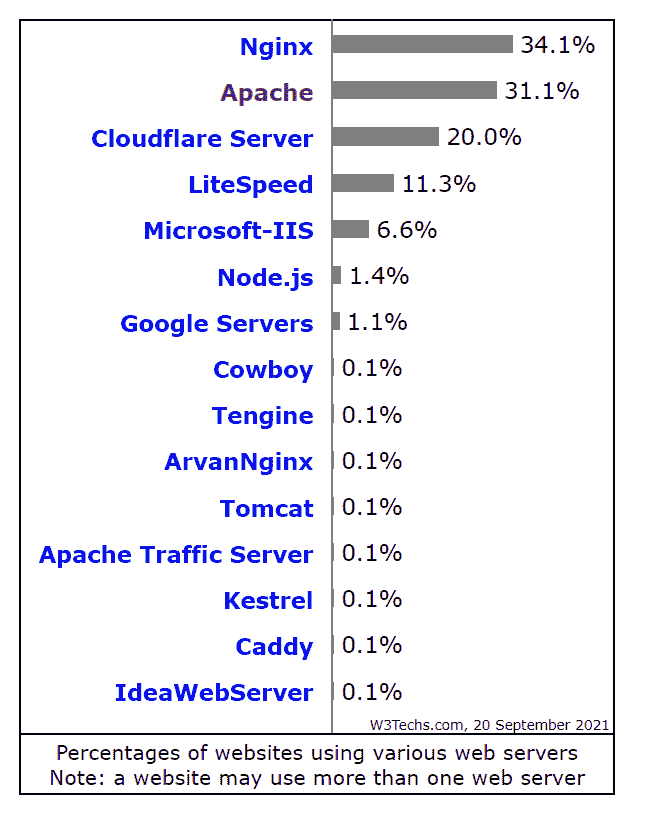

# 比较最好的 web 服务器:Caddy、Apache 和 Nginx 

> 原文：<https://blog.logrocket.com/comparing-best-web-servers-caddy-apache-nginx/>

web 服务器是一种软件，它接受来自用户代理(通常是 web 浏览器)的网络请求，并返回请求的响应或错误消息。目前 HTTP 服务器的两个主流解决方案是 Apache 和 Nginx。然而，这一领域的新玩家 Caddy Web Server 因其易用性而备受青睐。那么，哪个是最适合你的网络服务器呢？

在本文中，我们将研究每个 web 服务器，比较每个服务器的性能、可定制性和架构。在本教程结束时，您应该熟悉每种 web 服务器的优点，并更好地掌握哪种服务器最适合您的项目。

我们开始吧！

## 什么是 Apache HTTP Server？

由 Apache 软件基金会维护的 Apache HTTP 服务器于 1995 年发布，并迅速成为世界上最受欢迎的 web 服务器。Apache 最常被用作 LAMP 堆栈、Linux、Apache、MySQL 和 PHP 的一部分，可用于 Unix 和 Windows 操作系统。

### 表演

Apache 是开源的，用 C 语言编写，基于模块化架构，允许系统管理员选择在编译或运行时应用什么模块，轻松配置服务器应该如何操作。因此，Apache 迎合了广泛的用例，从提供动态内容到充当受支持的协议(如 HTTP 和 WebSockets)的负载平衡器。

Apache 的核心功能包括绑定到机器上的端口以及接受和处理请求。但是，默认情况下，这些任务是通过软件包中包含的一组多处理模块(MPM)隔离的。

MPM 架构根据特定地点的需求和机器的性能提供了更多的定制选项。例如，工作或事件 MPM 可以取代旧的预执行 MPM，后者每个连接使用一个线程，并且在需要并发时伸缩性不好。

除了作为服务器发行版的一部分提供的模块之外，还有大量用于 Apache 的第三方模块，您可以使用它们来扩展其功能。

### 配置 Apache

您可以在一个`.conf`文件中找到 Apache 的主要配置:在基于 Debian 的 Linux 发行版上是`/etc/apache2/apache2.conf`，在 Fedora 和 Red Hat Enterprise Linux 上是`/etc/httpd/httpd.conf`。

然而，要指定一个替代配置文件并实现期望的行为，您可以使用`-f`标志和任何可用的[指令](https://httpd.apache.org/docs/2.4/mod/directives.html)。将服务器配置分成几个`.conf`文件，并使用`Include`指令添加它们。请记住，只有在重新启动之后，Apache 才能识别对主配置文件的更改。

您还可以使用 [`.htaccess`文件](https://httpd.apache.org/docs/2.4/howto/htaccess.html#when)在目录级别更改服务器配置，允许您在不更改主配置的情况下为各个网站定制行为。但是，`.htaccess`文件会增加 TTFB 和 CPU 的使用，降低性能。如果可能的话，避免使用`.htaccess`文件，您可以通过将`AllowOverride`指令设置为`none`来完全禁用它们。

## Nginx

随着起源追溯到 [C10K 问题](https://www.nginx.com/blog/maximizing-python-performance-with-nginx-parti-web-serving-and-caching/)，这是指一个 web 服务器无法支持超过 10，000 个并发用户， [Nginx](https://nginx.org) 是在考虑性能的情况下开发的。它最初的目标之一是关注速度，这是 Apache 被认为缺乏的领域。

Nginx 于 2004 年作为开源软件在 2 条款 BSD 许可下首次公开出现，并于 2011 年扩展为一个名为 Nginx Plus 的商业变种。

Nginx 目前在排名前 10，000 的网站中有超过 40%的网站在使用。当您考虑到 Cloudflare Server 也使用 Nginx 进行内容交付时，这个数字甚至更高:


### 配置 Nginx

推荐的默认配置包括将`worker_processes`指令设置为`auto`。为了有效地使用硬件资源，每个 CPU 创建一个工作进程。

在 Unix 操作系统上，Nginx 的配置文件位于`/etc/nginx/`目录中，其中`nginx.conf`是主配置文件。Nginx 使用指令进行配置，这些指令被分组到块或上下文中。下面是配置文件的框架:

```
user www-data;
worker_processes auto;
pid /run/nginx.pid;
include /etc/nginx/modules-enabled/*.conf;

events {
  . . .
}

http {
  . . .
}

```

### Nginx 中的性能

当高性能和可伸缩性是关键需求时，Nginx 通常是首选的 web 服务器。Nginx 使用异步、事件驱动和非阻塞架构。它遵循多进程模型，在该模型中，一个主进程创建多个工作进程来处理所有网络事件:

```
$ ps aux -P | grep nginx
root     19199  0.0  0.0  55284  1484 ?        Ss   13:02   0:00 nginx: master process /usr/sbin/nginx
www-data 19200  0.0  0.0  55848  5140 ?        S    13:02   0:00 nginx: worker process
www-data 19201  0.0  0.0  55848  5140 ?        S    13:02   0:00 nginx: worker process
www-data 19202  0.0  0.0  55848  5140 ?        S    13:02   0:00 nginx: worker process
www-data 19203  0.0  0.0  55848  5140 ?        S    13:02   0:00 nginx: worker process

```

主进程控制工作进程的行为，并执行特权操作，如绑定到网络端口和应用配置，允许 Nginx 支持每个工作进程数千个传入网络连接。您只需要一个新的文件描述符和少量的额外内存，而不是为每个连接创建新的线程或进程。

## 什么是球童？

Caddy 是一个开源的 web 服务器平台，设计简单，易于使用，安全可靠。Caddy 是用零依赖的 Go 编写的，很容易下载，几乎可以在 Go 编译的所有平台上运行。

默认情况下，Caddy 支持自动 HTTPS，通过[加密](https://letsencrypt.org)来提供和更新证书。在我们评论的三台 web 服务器中，Caddy 是唯一一台提供开箱即用功能的服务器，它还提供了将 HTTP 流量自动重定向到 HTTPS 的功能。

相比 Apache 和 Nginx，Caddy 的配置文件要小很多。此外，Caddy 运行在 TLS 1.3 上，这是传输安全的最新标准。

安装 Caddy 很简单。只需在 [GitHub](https://github.com/caddyserver/caddy/releases) 上下载您首选平台的静态二进制文件，或者按照[安装文档](https://github.com/caddyserver/caddy/releases)上的说明进行操作。要启动 Caddy 服务器守护进程，请在终端中运行`caddy run`。但是，没有配置文件，什么都不会发生。

### 配置

Caddy 使用 JSON 进行配置，但也支持几种配置适配器。设置配置的标准是通过 Caddyfile。这里有一个简单的“Hello World”配置，它绑定到`port 3000`:

```
:3000 {
    respond "Hello, world!"
}

```

为了使更改生效，您需要按下`Ctrl+C`来停止服务器，然后用`caddy run`重新启动它。或者，您可以通过在单独的终端中执行`caddy reload`,将新的配置应用到正在运行的服务器上。为了避免停机，后一种方法更可取。

在浏览器中或通过`curl`访问`[http://localhost:3000](http://localhost:3000)`应该会产生预期的“Hello，world！”消息:

```
$ curl http://localhost:3000
Hello, world!

```

Caddy 提供了以下指令:

*   `file_server`:实现静态文件服务器
*   `php_fastcgi`:将请求代理给 PHP FastCGI
*   `reverse_proxy`:通过负载平衡、健康检查和自动重试将传入流量定向到一个或多个后端

### 表演

在性能方面，Caddy 已经显示出与 Apache 的竞争力，但在每秒处理的请求和负载下的稳定性方面都落后于 Nginx。

如果 Nginx 被用于性能优化，在没有观察到性能下降的情况下，可能无法用 Caddy 替换它。Caddy 的另一个可能的不利之处是它目前的市场份额很小，这可能会限制教育和故障排除的资源:



## 结论

在本文中，我们讨论了 Caddy、Apache 和 Nginx 的一些关键特征，以帮助您选择最适合您项目需求的 web 服务器。

如果您主要关心的是性能，或者您计划提供大量的静态内容，Nginx 可能是您的最佳选择。虽然 Caddy 对于大多数用例来说很容易配置和执行，但是如果您需要灵活性和定制，Apache 是您的最佳选择。

请记住，您也可以将任意两个 web 服务器结合起来，以获得更好的结果。例如，可以用 Nginx 提供静态文件，用 Apache 或 Caddy 处理动态请求。感谢您的阅读，祝您编码愉快！

## 使用 [LogRocket](https://lp.logrocket.com/blg/signup) 消除传统错误报告的干扰

[](https://lp.logrocket.com/blg/signup)

[LogRocket](https://lp.logrocket.com/blg/signup) 是一个数字体验分析解决方案，它可以保护您免受数百个假阳性错误警报的影响，只针对几个真正重要的项目。LogRocket 会告诉您应用程序中实际影响用户的最具影响力的 bug 和 UX 问题。

然后，使用具有深层技术遥测的会话重放来确切地查看用户看到了什么以及是什么导致了问题，就像你在他们身后看一样。

LogRocket 自动聚合客户端错误、JS 异常、前端性能指标和用户交互。然后 LogRocket 使用机器学习来告诉你哪些问题正在影响大多数用户，并提供你需要修复它的上下文。

关注重要的 bug—[今天就试试 LogRocket】。](https://lp.logrocket.com/blg/signup-issue-free)