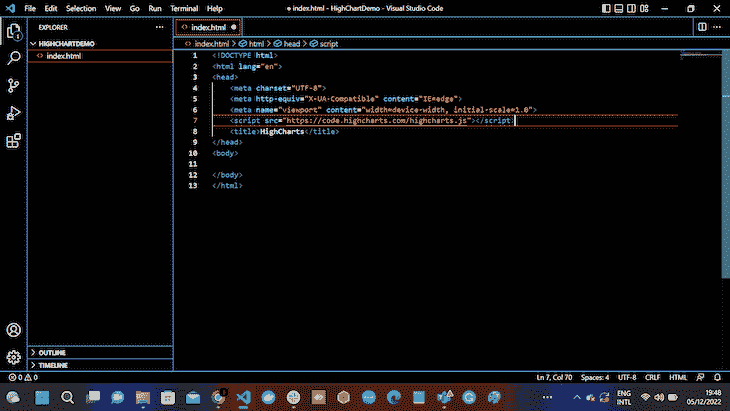
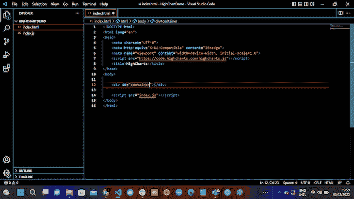
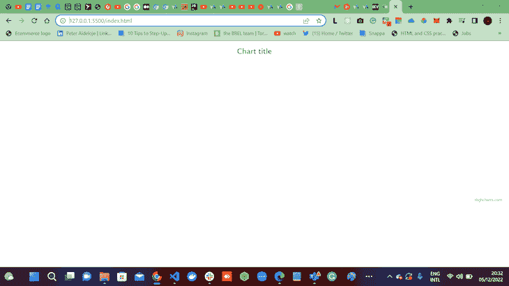
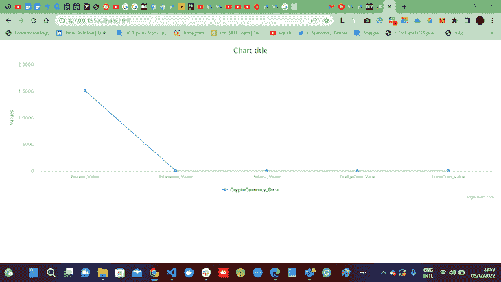

# 比较最流行的 JavaScript 图表库

> 原文：<https://blog.logrocket.com/comparing-most-popular-javascript-charting-libraries/>

***编者按**:本文最后一次更新是在 2023 年 1 月 24 日，以反映提到的几个图表库的更新，包括 Apexcharts。*

随着技术的进步，我们收集相关业务数据的能力也在不断提高。因此，数据可视化在每个组织中都变得越来越重要。在早期的 web 开发中，程序员必须组合不同的数据库记录来生成任何人都可以容易理解的图表和仪表板。然而，图表库的引入解决了这一挑战，如今，有成千上万的图表库可用于 JavaScript。

说到构建图表，人们很容易被漂亮的界面所吸引。但是，在不了解图表库所有特性的情况下开始使用图表库对开发人员的体验非常不利。虽然大多数库对于一般的应用程序来说已经足够了，但是实际上，我们需要一些为我们的用例定制的东西。更重要的是，我们需要一个可靠的图表库来构建。

在本文中，我们将回顾一些最流行的 JavaScript 图表库，包括 HighCharts、Chart.js、C3.js、Chartist、Plotly [、](https://plot.ly/javascript/) ApexCharts 和 NVD3，帮助您在为自己实现图表库时做出明智的决定。我们将考虑技术实力、性能、易于实现、定制、兼容性和美观等方面。此外，我们将考虑一些真实的场景来比较哪一个图表库最适合每一个，讨论每一个的优缺点。我们开始吧！

*向前跳转:*

## 高图表

基于 SVG 技术， [HighCharts](https://www.highcharts.com/) 是一个现代图表库，支持旧浏览器，兼容性很强。作为一个通用的 JavaScript 库，将 HighCharts 与所有主要的 web 框架集成起来非常简单。

HighCharts 非常全面，功能非常全面，我尤其喜欢动态图表，它使最终用户能够与数据进行切实的交互。他们项目网站上的[文档](https://www.highcharts.com/docs)也很彻底。

## Chart.js

自 2016 年 4 月 [Chart.js v2.0](https://www.chartjs.org) 首次发布以来，产品有了明显的提升。Chart.js v2.0 提供了令人愉悦的数据动画和转换、日期和时间、对数功能，以及将不同类型的数据图表混合成一个图表的能力。

[Chart.js v4.1.1](https://www.chartjs.org/docs/3.9.1/) 是撰写本文时的最新版本，提供了秤堆叠等高级功能，使成组堆叠和称重布局框成为可能。Chart.js 是一个比 HighCharts 更轻便的产品，并没有提供太多的选择。然而，它的[文档](http://www.chartjs.org/docs/latest/)却没有什么令人满意的地方。

## C3

C3 是对 T2 D3 . js T3 库的简单包装。通过包装 D3，我们不再需要编写任何 D3 代码。C3 渲染速度快，跨浏览器兼容性强，集成非常简单。

这个库最值得注意的一点是功能性稍有欠缺。它不像其他主流库那样功能齐全，可视化本身也有些简单。用这个库制作的图表永远不会赢得艺术造型奖，但它们是实用和干净的。如果你想找一个没有多余装饰的地方，C3 是一个不错的选择。C3 也为这个本质上简单的库提供了详细的文档。

## 宪章派

另一个完全现代化的基于 SVG 的库 Chartist ，建立在其他库没有提供足够的定制选项的想法之上。

最大的特点可以说是图表中的 SVG 动画。如果您使用现代浏览器，您可以在 SVG 属性上实现 CSS 3 动画，使标准图表更加美观。你也可以用 SMIL 实现更多的动画。

谢天谢地，查特斯特的外表并不肤浅。Chartist 有坚实的技术基础，非常容易实现。几分钟之内，您就可以创建令人难以置信的、富于表现力的图表，可以轻松地与任何后端数据源进行交互。总的来说，图表是一个很好的选择，但可能不如高图表功能全面。你可以去网站查看优秀的[文档](https://gionkunz.github.io/chartist-js/getting-started.html)。

## Plotly

构建于 D3.js 之上的 [Plotly](https://plotly.com) 是最常用的库之一。视觉上，Plotly 没有 Chartist 那么惊艳，但是从技术实力上来说，Plotly 在我看来抢了文章中所有库的头把交椅。

然而，当我包含大量数据时，我注意到 Plotly 难以在我的一台旧机器上运行，实际上设法使 Chrome 崩溃。也就是说，这是一个极其丰富的库，拥有出色的[文档](https://plot.ly/javascript/)，包括每种图表类型的教程。

## Apexcharts

Ap [excharts](https://apexcharts.com) 是另一个使用简单 API 的现代 JavaScript 图表库。Apexcharts 包括一个响应工具提示，许多开发人员参考这个工具来获得 Vue 和 React 的交互式 SVG 图表。

Apexcharts 是免费的商业用途，麻省理工学院许可，它包含额外的预定义的颜色主题。Apexcharts 因其独特的交互式功能而脱颖而出，如在更改数据集和动态数据加载时的平滑交互式动画。它还具有缩放功能，并为 Vue、普通 JavaScript、React 和 Angular 提供了强大的支持。它提供了像 b ar，d onut，饼图，线，面积，注释，气泡，[和更多的](https://apexcharts.com/docs/chart-types/bar-chart/)的图表。

然而，Apexcharts 的一个主要缺点是渲染速度慢。但是，您可以通过在`useEffect`钩子中使用 [set timeout 来更新状态，从而解决这个问题。](https://stackoverflow.com/questions/71841390/how-to-fix-react-apex-chart-initial-mount-delay)

Apexcharts 包括一个非常广泛的用户[文档](https://apexcharts.com/docs/installation/)，其中包含帮助您快速入门的描述性指南。该文档附带了演示和源代码，作为首次用户的参考点。

## NVD3

作为 [C3](http://nvd3.org/) 的直接竞争对手， [NVD3](https://nvd3.org) 基于 [D3.js](http://nvd3.org/) 打造。NVD3 更注重功能而不是形式，有着坚实的技术基础，但在美学方面相当薄弱。

NVD3 的性能相对较好，它确实提供了一些基本的动画，为原本相当简单的界面增加了视觉刺激。您可以直接从`.json`文件中添加数据，这意味着 NVD3 非常容易与现有的数据 API 解决方案集成。

然而，我最大的抱怨是他们的文档几乎不存在，只有样本，没有深入定制选项。

## 技术场景

现在我们已经熟悉了一些 JavaScript 的图表库，我们将回顾一些真实的场景，将这些图表库相互比较以确定哪一个更好。

所有这些场景都是我的同事们慷慨提供的，涵盖了我们将来可能会遇到的图表库的常见用途。

### 财务明细

图表库最常见的用例之一涉及到金融数据。对于我们的第一个场景，我们将讨论一些常见的东西，跟踪股票。跟踪任何财务数据总是一项复杂的任务，尤其是涉及股票、股份和货币时；我们在主要金融网站上看到的图表中使用的数据量是巨大的。

当我在股票跟踪场景中比较图表库时，有一个明显的赢家，HighCharts。

HighCharts 实际上带有一个专门为金融数据创建的内置库，名为 [HighStock](http://api.highcharts.com/highstock/) 。最初，我认为一个具有更简单接口的库会产生更清晰和更好的结果，因为它相对来说比较轻便。

然而，在这个金融股票上下文中，在对照 HighCharts 测试 D3 库之后，我意识到 HighCharts 不仅允许我用最少的努力来映射极大量的数据，而且与较轻的库相比，它还保持了相当高的性能。

下面是我直接从 Google Stocks API 获得的 JSON 映射数据的一个例子。尽管 Google Stocks API 已被弃用，但这是一种非常标准的简单时间戳和数据点的数据格式，因此可以放心地假设我们可以利用它:

```
/* Oct 2017 */
[1506902400000,154.26,154.45,152.72,153.81],
[1506988800000,154.01,155.09,153.91,154.48],
[1507075200000,153.63,153.86,152.46,153.48],
[1507161600000,154.18,155.44,154.05,155.39],
[1507248000000,154.97,155.49,154.56,155.30],
[1507507200000,155.81,156.73,155.48,155.84],
[1507593600000,156.06,158.00,155.10,155.90]
]);

```

当我们将 JSON 数据文件导入到 HighCharts 中时，它以简洁易读的方式显示。无论你是大公司的一员还是小公司的一员，HighCharts 都会给任何看你的数据可视化的人留下深刻印象。然而，如果您在商业环境中使用 HighCharts，则需要获得许可；你可以在这里找到 [HighCharts 许可的详细信息](https://shop.highsoft.com/highstock)。

您可以在 React 应用程序中使用 HighCharts，但是，在本例中，我们将在一个基本的 JavaScript 项目中使用它。要在我们的项目中包含 HighCharts，请将以下代码片段添加到我们的 HTML 文件的 header 部分，如下面的屏幕截图所示:

```
<script src="https://code.highcharts.com/highcharts.js"></script>

```



接下来，我们将创建一个`index.js`文件和一个容器，我们将在其中呈现我们的图表:



然后，我们将通过使用事件侦听器来初始化 HighCharts 库，如下面的代码片段所示:

```
document.addEventListener('DOMContentLoaded', ()=> {
    Highcharts.chart('container', {
    });
});

```

在成功地将上面的代码片段包含在我们的`index.js`文件中之后，我们可以继续在 web 浏览器上运行它，以接收与下面类似的响应:



从上图中，我们可以看到图表标题和 HighCharts.js，它们默认由 HighCharts.js 填充

我们现在可以从我们的`index.js`文件中的 JSON 映射数据填充我们的数据，如下所示:

```
document.addEventListener('DOMContentLoaded', ()=> {
    Highcharts.chart('container', {
xAxis: {
categories: ["Bitcoin_Value", "Ethereum_Value", "Solana_Value", "DodgeCoin_Vaue", "LunoCoin_Value"]
},
series: [{
name: 'CryptoCurrency_Data',   
data: [1506902400000, 154.26, 154.45, 152.72, 153.81]
}]
});
});

```

上面的代码片段有助于在浏览器上可视化我们的`CryptoCurrency_Data`,如下所示:



上面的代码片段也可以复制，以可视化更多的数据。在下面的代码片段中，我们将复制我们的代码来可视化五个数据集:

```
document.addEventListener('DOMContentLoaded', ()=> {
    Highcharts.chart('container', {
xAxis: {
categories: ["Bitcoin_Value", "Ethereum_Value", "Solana_Value", "DodgeCoin_Vaue", "LunoCoin_Value"]
},
series: [{
name: 'CryptoCurrency_Data(January)',   
data: [1506902400000, 154.26, 154.45, 152.72, 153.81]
},
{
    name: 'CryptoCurrency_Data(February)',   
    data: [1506988800000,154.01,155.09,153.91,154.48]

},

{
    name: 'CryptoCurrency_Data(March)',   
    data: [1507075200000,153.63,153.86,152.46,153.48]

},

{
    name: 'CryptoCurrency_Data(April)',   
    data: [1507161600000,154.18,155.44,154.05,155.39]

},

{
    name: 'CryptoCurrency_Data(May)',   
    data: [1507248000000,154.97,155.49,154.56,155.30]

}

]
});
});

```

结果类似于下面的截图:


### 仪表板分析

几乎每个在注册时收集用户数据的初创公司都需要某种仪表板。例如，如果我们假设我们是一家 API 提供商公司，我们需要能够向我们的客户提供可用的、简洁的，最重要的是，关于他们使用我们服务的有用数据。

GitHub 为我们提供了提交历史图表，SendGrid 为我们提供了详细的电子邮件使用统计图表，Auth0 为我们提供了用户的使用图表。它们都有一种简洁和令人愉快的方式向我们呈现这些数据，而不会大幅降低页面速度或造成过多干扰。

在我上一次创业时，我们花了数周时间尝试了每一个主要的 JavaScript 图表库，以找到一个能够以美观的方式可视化我们的数据，同时保持高性能和高度可定制的库。

在这种情况下，我的选择只能是 [Chartist.js](https://gionkunz.github.io/chartist-js/) 。Chartist 不仅是高性能的，即使有大量的数据，但也是最漂亮和视觉愉悦的数据呈现方式。Chartist 的创建者专注于构建一个技术可靠的产品，允许大量的定制。

### 时基跟踪

另一个常见的场景是绘制一段时间内的数据，与上面的财务场景非常相似，但是没有相同数量的数据。

如果我们想使用 HighCharts 来绘制时间序列数据，那就没问题。然而，如果我们想使用一个更轻便、更容易实现、更重要的是免费许可的库，我会非常推荐 Plotly。

Plotly 构建于 Python 和 R 之上，拥有非常坚实的技术基础。它有跨大多数主要语言的 API 库，但是我们将特别关注 [Plotly JavaScript](https://plot.ly/javascript/) 。

Plotly 非常容易实现，无论您只是简单地硬编码少量数据，还是像我一样输入 JSON 数据文件，Plotly.js 都非常高效、干净和简洁。我是你的超级粉丝！

* * *

### 更多来自 LogRocket 的精彩文章:

* * *

## 结论

图表是所有开发人员都需要经常使用的东西，所以有许多优秀的开源图表库可供我们选择也就不足为奇了。

我使用过上面提到的所有库，这些场景直接来源于我自己或同事的经验，反映了我们需要在现实世界中实现图表的一些显而易见的方法。

随着技术的发展，很高兴看到图表通过更高性能的库变得更轻便。几年前，在不合并和降低我们的应用程序的情况下实现数据密集型图表是一场巨大的斗争。我上面提到的每一个库都有非常好的浏览器兼容性，并为使用传统浏览器的人提供了后备。

基于 D3 构建的库有一个坚实的基础，但是就我个人而言，我发现从美学的角度来看它们有点乏味。

上面的库我最喜欢的肯定是 Chartist。我非常喜欢它的美丽和易于实现。我喜欢它的高性能，它绝对是我的最佳用户体验奖。Chartist 具有出色的特性，可以适应几乎任何场景，使其成为满足任何人需求的理想选择，无论他们的数据格式或情况如何。

如果你有任何问题，我很乐意和你聊聊图表库，我也很乐意听听你的实现故事。在 [【邮件保护】](/cdn-cgi/l/email-protection#c7b5a8a5aea987b7a2b5a4bee9b7b0) 给我留言。

## 通过理解上下文，更容易地调试 JavaScript 错误

调试代码总是一项单调乏味的任务。但是你越了解自己的错误，就越容易改正。

LogRocket 让你以新的独特的方式理解这些错误。我们的前端监控解决方案跟踪用户与您的 JavaScript 前端的互动，让您能够准确找出导致错误的用户行为。

[](https://lp.logrocket.com/blg/javascript-signup)

LogRocket 记录控制台日志、页面加载时间、堆栈跟踪、慢速网络请求/响应(带有标题+正文)、浏览器元数据和自定义日志。理解您的 JavaScript 代码的影响从来没有这么简单过！

[Try it for free](https://lp.logrocket.com/blg/javascript-signup)

.