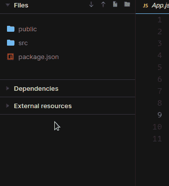
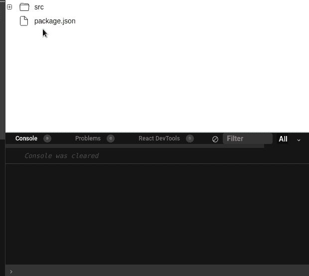
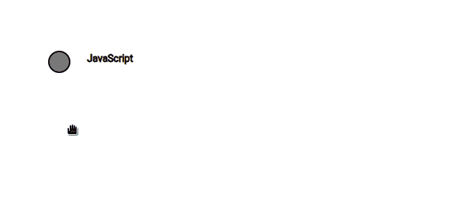
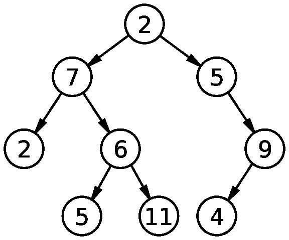
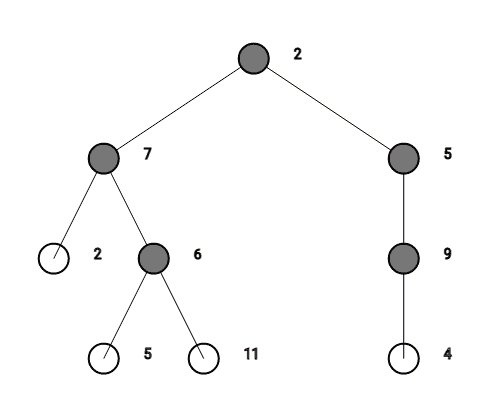

# 比较 React 树组件- LogRocket 博客

> 原文：<https://blog.logrocket.com/comparing-react-tree-components/>

从笔记应用到复杂的数据结构，树形图在我们身边无处不在。它们有助于数据的排列，从而允许用户轻松地浏览他们的项目。树用法的一个显著例子是 [CodeSandbox](https://codesandbox.io/dashboard) 编辑器:



在本文中，您将学习如何在 React 中向用户界面呈现树形图。此外，我们将比较几个带有基本代码示例的库，以帮助您确定最适合您的 web 应用程序的库。我们将介绍以下库:

## 鬼 UI

艾斯特 UI 提供了一套复制 Vercel 设计语言的组件。其中之一是文件树组件，它以树格式呈现文件和文件夹的目录。

要在项目中安装艾斯特 UI 库，请运行以下终端命令:

```
npm i geist-ui/react

```

### 艾斯特用户界面的基本用法

以下代码片段呈现了一个简单的文件树:

```
import {Tree} from "@geist-ui/react"
return (
  <div>
    <Tree>
      <Tree.Folder name="src">
        <Tree.File name="app.js" />
        <Tree.File name="index.js" />
        <Tree.Folder name="Components">
          <Tree.File name="Layout.js" />
        </Tree.Folder>
      </Tree.Folder>
      <Tree.File name="package.json" />
    </Tree>
  </div>
);

```

这里，`Tree`模块表示一个树形视图的开始。`Tree.Folder`和`Tree.File`组件分别代表文件夹和文件。


艾斯特甚至允许开发人员在树形视图中添加事件处理程序。这对于当客户端点击特定元素时应用程序需要执行一些代码的情况非常方便。一个这样的例子可能是，如果用户点击特定的文件名，则打开一个新窗口或获取数据:

```
const eventHandler = (path) => {
    console.log(path); //output the clicked file's path
  };
  return (
    <div>
      <Tree onClick={eventHandler}>
      </Tree>
    </div>
  );

```

在这段代码中，我们将我们的`eventHandler`函数传递给了`onClick`属性。这意味着每当用户点击某个文件时，React 将执行`eventHandler`方法。



### 优势

*   显示文件结构的最简单的方法。艾斯特用户界面不需要样板代码来帮助你开始
*   支持黑暗和光明主题

### 不足之处

*   缺少自定义选项(例如，自定义图标和颜色)
*   正如这个模块的名字所暗示的，它不允许你构建复杂的树结构(例如，一个家谱)。为了缓解这个问题，我们稍后将使用 React D3 树包

## 蚂蚁设计

[蚂蚁设计](https://ant.design)是最知名的 React UI 技术之一。这是因为它易于使用，让开发人员用最少的代码构建丰富的交互式界面。事实上，像阿里巴巴这样的大公司在他们的应用程序中使用它。

就像艾斯特一样，Ant Design 提供了一个树组件来表示层次结构。

要使用 Ant Design 的特性，将`antd`依赖项安装到您的项目中，如下所示:

```
npm install antd 

```

### Ant 设计的示例用法

在呈现树之前，我们需要首先定义我们的数据源:

```
const treeData = [
  {
    title: "Main file structure",
    key: "MainStructure",
    children: [
      {
        title: "Layouts",
        key: "layoutFolder",
        children: [ //child element
          {
            title: "MainLayout.js",
            key: "mainlayout.js"
          }
        ]
      },
      { title: "index.js", key: "index.js" }
    ]
  }
];

```

这里，数组中的每一项都需要有一个`title`和`key`属性。`children`数组告诉 Ant Design 呈现其各自子组下的子元素。

第二步，将这个`treeData`数组传入`Tree`组件，如下所示:

```
import "antd/dist/antd.css";
import { Tree } from "antd";

return <Tree treeData={treeData} />; 

```

在这段代码中，我们将数据传递给了`treeData` prop。这将显示一个包含我们选择的数据的树组件。


Ant 设计还允许定制。例如，要获得复选框，请使用`checkable`属性:

```
return <Tree checkable treeData={treeData} />;

```


### 优势

*   不像艾斯特，蚂蚁设计提供了一个广泛的 API 来扩展你的树的功能
*   简单易用
*   允许一定程度的自定义，例如自定义图标或可拖动列表
*   能够异步加载数据。这意味着 Ant Design 可以让用户通过 API 作为数据源来填充他们的树
*   有大量代码配方的文档

### 不足之处

*   就像艾斯特 UI 一样，它不允许构建复杂的树形图(像二叉树)
*   因为它是一个成熟的组件集，所以它有一个很大的包。如果你的应用以资源最少的设备为目标，避免这个库。为了避免这个问题，您可以使用 [rc-tree](https://tree-react-component.vercel.app) 组件。其用法类似于 Ant Design 的树模块

## 流畅的用户界面

Fluent UI 是微软的组件库，源于这家科技巨头的 Fluent 设计系统。它将用于即将推出的办公产品。
就像所有主要的组件实用程序一样，它也允许开发人员通过 tree 元素呈现简单的树形图。

要安装 Fluent UI React 包，请执行以下 bash 命令:

```
npm i @fluentui/react-northstar

```

### 流畅用户界面的示例用法

第一步，像这样定义您的数据源:

```
const items = [
  {
    id: "concepts",
    title: "Top concepts to learn"
  },
  {
    id: "top-tech",
    title: "Top technologies to learn",
    items: [{ id: "react", title: "React" }] //this item will have children
  },
  {
    id: "best-accessories",
    title: "Best iPad accessories",
    items: [
      {
        id: "screen-protector",
        title: "Screen protectors",
        //child items of this sub group:
        items: [{ id: "paperlike", title: "Paperlike protector" }] 
      }
    ]
  }
];

```

`items`数组中的每个元素表示树中的一个节点。如果一个对象包含一个`items`属性，这将告诉 Fluent UI 呈现一个子节点。

接下来，将这些数据传入`Tree`组件，如下所示:

```
import { Provider, teamsTheme, Tree } from "@fluentui/react-northstar";

export default function FluentTreeComponent() {
  return (
    <Provider theme={teamsTheme}>
      <Tree items={items} aria-label="tree" />
    </Provider>
  );
}

```

这里，我们已经传入了`items`数组。这将基于我们的数据源呈现一棵树。


我们甚至可以通过`selectable`属性启用复选框支持:

```
<Tree items={items} selectable aria-label="tree" />

```


### 优势

*   像 Ant Design 一样，它有一个扩展的 API 来扩展树的功能
*   流畅的 UI 允许开发人员改变他们的节点的外观和感觉。例如，自定义标题渲染器

### 不足之处

*   就像 Ant Design 或艾斯特 UI 一样，如果你想构建复杂的树，请避开这个库
*   大的包大小，从而使您的项目膨胀并导致性能问题

## 反应 D3 树

React D3 Tree 是一个 React 组件，提供了一种构建复杂树类型的方法；比如家谱，二叉树。

要使用该模块，使用以下命令安装`react-d3-tree package`:

```
npm install react-d3-tree

```

### React D3 树的示例用法

首先，定义您的数据结构:

```
const technologies = {
  name: "JavaScript",
  children: [
    {
      name: "React"
    },
    {
      name: "Node.js",
      children: [{ name: "Express" }, { name: "Http" }] //children of this element
    }
  ]
};

```

数组中的每个对象都必须有一个`name`元素。属性将呈现一个子节点。

接下来，将您的`technologies`数组传入组件:

```
return (
  <div id="treeWrapper" style={{ width: "100vh", height: "100vh" }}>
    <Tree
      data={technologies}
    />
  </div>
);

```



### 用 React D3 树创建二叉树

[React D3 树](https://bkrem.github.io/react-d3-tree/docs/)常用于构建二叉树。作为演示，让我们从[维基百科](https://en.wikipedia.org/wiki/Binary_tree)中重现这个树形图:



这将是上图的相应数据结构:

```
const binaryData = {
  name: 2, //root node
  children: [
    {
      name: 7,
      //children of the '7' node.
      children: [
        { name: 2 },
        { name: 6, children: [{ name: 5 }, { name: 11 }] }
      ]
    },
    { name: 5, children: [{ name: 9, children: [{ name: 4 }] }] }
  ]
};
<Tree
  data={binaryData}
  orientation="vertical"
  pathFunc="straight"
  nodeSize={{ x: 100, y: 100 }}
/>;

```

这里，`orientation`道具将图表的方向改为垂直。我们还使用了`pathFunc`属性，它改变了连接每个节点的线条的外观。再者，`nodeSize`控制着每个节点之间的距离。



### 优势

*   有一个 API，允许开发者扩展他们的图表功能
*   非常适合构建复杂的树类型(例如，二叉树、家谱和组织结构图)
*   允许开发人员定制他们的树形图的外观

### 不足之处

*   不支持径向树。这意味着如果屏幕上有许多子节点，您的 UI 可能看起来很混乱

## 您应该使用哪个反应树组件？

如果您的应用程序需要呈现简单的树形图，并且您想要定制选项，请使用 Ant Design。该文档解释得很好，并提供了许多代码配方。除此之外，图书馆也是一个轻松的工作。

但是，如果您想要显示复杂的树形图(例如，决策树或遍历树)，只需看看 React D3 树就可以了。除了简单明了之外，它还具有更小的尺寸，从而降低了性能成本。

## 结论

在本文中，我们探索了一些在 React 中呈现树形图的库。此时，我会选择在我的项目中使用 Ant Design。它不仅易于使用，而且非常耐用。因此，这带来了应用程序的安全性和效率。

非常感谢您的阅读！编码快乐！

本文的源代码位于这个 [CodeSandbox 项目](https://codesandbox.io/s/comparing-tree-components-ze8ez)中。

## [LogRocket](https://lp.logrocket.com/blg/react-signup-general) :全面了解您的生产 React 应用

调试 React 应用程序可能很困难，尤其是当用户遇到难以重现的问题时。如果您对监视和跟踪 Redux 状态、自动显示 JavaScript 错误以及跟踪缓慢的网络请求和组件加载时间感兴趣，

[try LogRocket](https://lp.logrocket.com/blg/react-signup-general)

.

[ ](https://lp.logrocket.com/blg/react-signup-general) [](https://lp.logrocket.com/blg/react-signup-general) 

LogRocket 结合了会话回放、产品分析和错误跟踪，使软件团队能够创建理想的 web 和移动产品体验。这对你来说意味着什么？

LogRocket 不是猜测错误发生的原因，也不是要求用户提供截图和日志转储，而是让您回放问题，就像它们发生在您自己的浏览器中一样，以快速了解哪里出错了。

不再有嘈杂的警报。智能错误跟踪允许您对问题进行分类，然后从中学习。获得有影响的用户问题的通知，而不是误报。警报越少，有用的信号越多。

LogRocket Redux 中间件包为您的用户会话增加了一层额外的可见性。LogRocket 记录 Redux 存储中的所有操作和状态。

现代化您调试 React 应用的方式— [开始免费监控](https://lp.logrocket.com/blg/react-signup-general)。