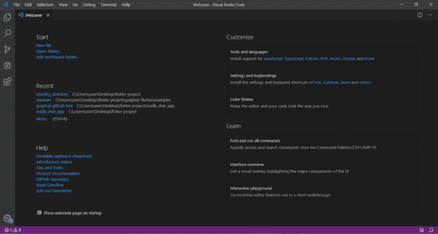
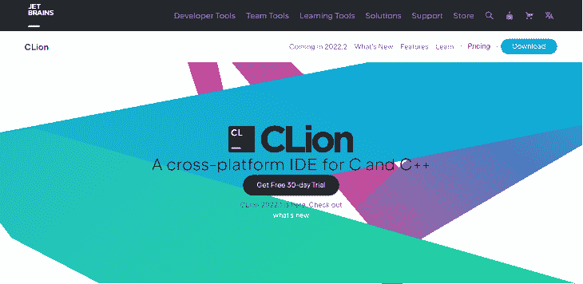
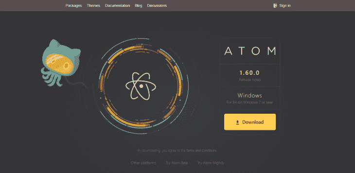
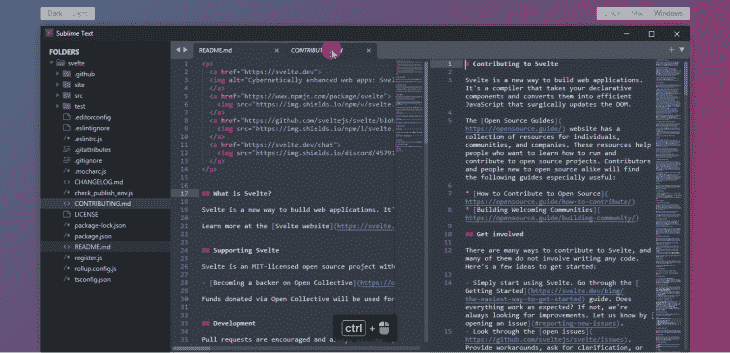
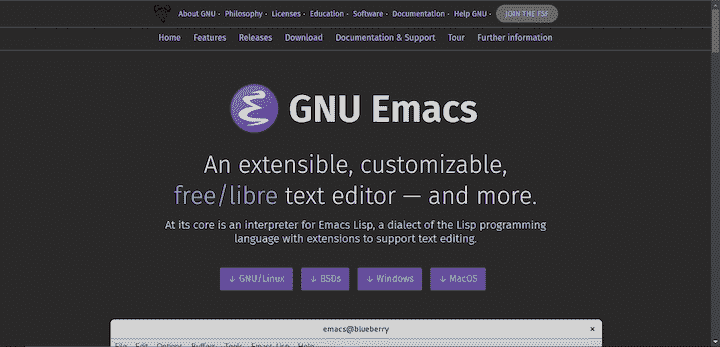
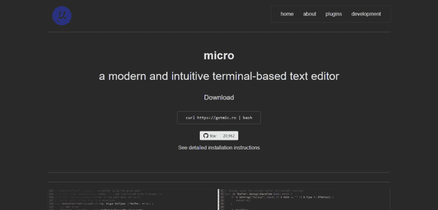

# 比较 Rust ide:IntelliJ IDEA、VS 代码和更多

> 原文：<https://blog.logrocket.com/comparing-rust-ides-intellij-idea-vs-code-more/>

***编者按:**这篇文章于 2023 年 2 月 1 日更新，增加了三种新锈的信息。*

根据 Stack Overflow 的年度开发者调查，Rust 已经连续七年成为最受欢迎的语言，尽管不是最受欢迎的语言之一。由于这种语言的高性能、代码安全特性和令人惊叹的编译器，它吸引了很多 Rustaceans 人。

在相对较短的时间内，Rust 获得了 Mozilla、亚马逊、华为、谷歌和微软等大公司的支持。出于所有这些原因，围绕这种语言产生了很多好奇心，很多人想尝试一下。

在本文中，我将与您分享十个最好的 Rust IDEs 和代码编辑器，以优化您的编码体验，帮助您缩短开发时间，并为您提供工具，使在 Rust 中读写代码的过程变得简单高效。

我们将涵盖的内容:

## 好的防锈剂应该提供什么？

一个好的 IDE 或者代码编辑器是符合人体工程学的，可以帮助你提高生产力。其中一些工具可以帮助你在编写时完成代码，也可以在编译前调试 Rust 应用程序。

对于 Rust 这样的流行语言，你可能期望从一个好的编辑器[中得到的其他特性包括语法高亮、加速工作流程的热键和代码生成。事不宜迟，让我们一起来看看这些最好的 Rust IDEs 吧。](https://blog.logrocket.com/why-is-rust-popular/)

## Visual Studio 代码(VS 代码)

Visual Studio Code 是一个由微软创建的开源免费项目，可用于 macOS、Windows 和 Linux。它支持很多主要的语言，包括 Rust。

目前，VS Code 是最好的代码编辑器之一，[是 Rust 开发中使用最多的编辑器](https://www.jetbrains.com/lp/devecosystem-2021/rust/#Rust_what-ide-editor-do-you-primarily-use-for-rust-development)。在`rust-analyzer` 等[插件的帮助下，VS Code 为 Rust 开发者提供了如下功能:](https://blog.logrocket.com/intro-to-rust-analyzer/)

*   错误突出显示(以及可能的修复建议)
*   [支持调试](https://code.visualstudio.com/docs/editor/debugging)
*   语法突出显示
*   代码完成
*   提高代码质量的代码生成和重构

VS 代码流行的一个主要因素是它是轻量级的。它还配备了[键盘快捷键来帮助提高生产率](https://blog.logrocket.com/learn-these-keyboard-shortcuts-to-become-a-vs-code-ninja/)和[语言智能功能，如代码导航](https://code.visualstudio.com/docs/editor/editingevolved)来帮助您轻松找到文件、定义、实现和符号。

VS 代码还自带 Git 支持，这对于维护项目的不同版本非常有用。其他 VCS 插件也可以在 [VS Code 的扩展市场](https://marketplace.visualstudio.com/vscode)上找到。

虽然在功能上类似于 Atom 等编辑器，但 VS 代码以速度快而著称，在执行搜索和切换文件等活动时很少出现延迟。另一个高性能的编辑器是 Sublime Text，我们将在下面讨论。

与 Vim 和 Emacs 等编辑器相比，VS 代码易于设置和使用。因为它是作为代码编辑器设计的，所以它没有标准 IDE 那么多的特性；尽管如此，它具有高度的可扩展性，并且它的特性集合令人印象深刻。

根据文档显示，VS Code 是目前 Rust 支持最好的编辑器。你可以[下载 VS 代码](https://code.visualstudio.com/Download)自己看看。确保你的[也安装了](https://rust-analyzer.github.io/manual.html#vs-code) `rust-analyzer`！

## 克利翁

CLion 是由 JetBrains 创建的[高级 IDE。虽然是为 C 和 C++创建的，但你可以通过 IntelliJ Rust 插件](https://www.jetbrains.com/clion/)将它与 Rust 一起[使用。它适用于 Linux、Mac 和 Windows。](https://plugins.jetbrains.com/plugin/8182-rust/)

与 Atom、VS Code 和其他开源编辑器不同，组织和个人必须为 CLion 付费。对学生、老师、开源项目、编码学校都是免费的；然而，大多数开发者可能没有资格获得免费许可。

如果你不介意支付少量的月费或年费，CLion 可以成为你的信赖对象。它易于使用，其现代、直观的用户界面不需要学习曲线。你可以马上开始构建你的 Rust 项目。CLion 是一个成熟的集成开发环境，有很多特性，因此它很笨重，占用大量 CPU 和 RAM。与像 VS Code 这样的编辑器相比，它的运行速度更慢。对于中型到大型的项目，您可能会经历延迟和冻结。

在 IntelliJ Rust 的帮助下，CLion 能够为 Rust 开发人员提供以下功能:

CLion 有一个干净的用户界面，并带有许多主题，您可以根据自己的喜好进行定制。[下载 CLion 亲自试用](https://www.jetbrains.com/clion/download/)。

## 智能理念

IntelliJ IDEA，虽然[最初是由 JetBrains](https://www.jetbrains.com/) 为 Java 打造的，但也可以用来编写 Rust。像 CLion 一样，这可以通过 [IntelliJ Rust 插件](https://github.com/intellij-rust/intellij-rust)实现。它适用于 Windows、macOS 和 Linux。

您可以从常规和自定义主题中进行选择，以改善 IntelliJ IDEA 非常漂亮、友好的用户界面的外观。与 CLion 类似，IDEA 对组织和个人收费，而学生、教师、编码学校和开源项目的贡献者可以免费获得。

IntelliJ IDEA 使用 IntelliJ Rust 为 Rust 开发人员提供以下功能:

*   快捷键
*   辅助功能
*   智能编码辅助
*   误差检测
*   代码完成
*   自动重构
*   检验和上下文操作
*   代码突出显示
*   [实时模板](https://www.jetbrains.com/help/idea/using-live-templates.html)
*   调试器

IntelliJ IDEA 为 Rust 开发人员提供了现成的版本控制工具，以及用于与他人实时协作的工具。

在 ide 中，您可以克隆项目、管理分支、合并冲突、提交和推送更改。它还帮助您将 Rust 项目与 Docker 和 Kubernetes 等容器编排系统无缝集成。

IntelliJ IDEA 的一个“缺点”是，既然是 IDE，显然不是轻量级的。它比 VS Code、Atom、Spacemacs、Neovim 和其他代码编辑器消耗更多的 RAM 和 CPU。这可能会使打开大型项目或同时处理多个项目变得非常缓慢。

你可以[下载 IntelliJ IDEA](https://www.jetbrains.com/idea/download/#section=windows) 来看看它所有的功能。

## 原子编辑器

[Atom 代码编辑器](https://atom.io/)支持 Windows、Linux 和 macOS。虽然 Atom 比 VS Code 之类的编辑器更老，但最近它变得不那么受欢迎了。它以缓慢著称，而且比 VS 代码更笨拙。

然而，Atom 具有只有 Spacemacs 才能超越的定制灵活性。几乎每一个特性都以软件包的形式提供，可以很容易地添加或删除。您还可以创建新功能，并根据自己的喜好进行定制。和 VS 代码一样，Atom 也有很棒的设计，你可以在里面创建自定义主题。Atom 背后还有一个巨大的、充满活力的社区，既管理现有插件，也开发新插件。

与 Emacs 和 Vim 等编辑器不同，Atom 的学习曲线很浅。你可以简单地安装它，并立即用它非常直观的界面开始编辑你的 Rust 代码。

在[包的帮助下，比如`ide-rust`](https://atom.io/packages/ide-rust) ，它使用了 [`rust-analyzer`](https://github.com/rust-analyzer/rust-analyzer) ，Atom 能够为 Rust 开发者提供如下特性:

*   自动完成
*   语法突出显示
*   版本控制
*   生锈的语言片段
*   转到定义

[下载 Atom 试一试](https://atom.io/)。

## 崇高的文本

[Sublime Text](https://www.sublimetext.com/) 是一个极简但高效的代码编辑器。它支持几十种语言，包括 Rust。与 VS Code 和 Atom 等编辑器相比，它看起来很简单，但这种简单性使它比其他编辑器快得多。

Sublime 好用；它拥有一个用户友好的界面，完全不需要学习曲线。它可以在 Linux、Windows 和 macOS 上运行。虽然它的用户界面不像 Atom 那样可定制，但它有许多可安装的主题，可以改变 Rust 代码的配色方案。

就尺寸而言，Sublime Text 比它的现代编辑器同行要轻得多，并且它超级容易设置。借助其软件包管理器中的插件，它还具有很强的可扩展性和可定制性。

由于 Sublime Text 不是开源的，与它的同行相比，它背后的团队相当小，使得更新和错误修复相对不频繁。

有许多优秀的插件可以让 Rust 中的编码更快、更简单、更方便。借助< `rust-enhanced` /a >等[包，为 Rust 开发者提供了](https://github.com/rust-lang/rust-enhanced)等功能

*   自动完成
*   定位功能
*   代码折叠
*   托梁
*   蚂蚁
*   颜色选择器
*   降价预览
*   饭桶
*   语法突出显示
*   误差检测

你可以[免费下载 Sublime】，但也有高级版本。Sublime 会提示您升级到付费许可证，但是如果免费版本和插件提供了您需要的所有功能，您可以简单地忽略这些弹出窗口。](https://www.sublimetext.com/)

## 宇宙飞船

如果你喜欢以键盘为中心的工作流程， [Spacemacs 可能是你的编辑器](https://www.spacemacs.org/)。在键绑定的帮助下，您可以使用键盘上的键来执行不同的命令，并使开发过程更快、更有效。

这里的一个缺点是，需要一段时间才能掌握像 Spacemacs 这样的编辑器；它有一个陡峭的学习曲线。除非你已经熟悉了 Emacs 的原理和代码，否则你可能会浪费大量的时间去想如何执行不同的功能。

如果你没有使用 Emacs 或 [Vim 进行 Rust 开发](https://blog.logrocket.com/configuring-vim-rust-development/)的经验，并且你想立即投入 Rust 项目，Spacemacs 不是你的编辑器。

Spacemacs 支持很多语言，包括 Rust。利用 [`rls`](https://github.com/rust-lang/rls) 和< [代码> rust-analyzer](https://github.com/rust-analyzer/rust-analyzer) ，Spacemacs 能够为 rust 开发者提供如下功能:

在定制方面，Spacemacs 领先于 VS Code 和 Sublime Text 这样的编辑器。编辑器的几乎每个部分都可以调整，并且它的功能可以通过包得到极大的增强。虽然 VS Code 的功能也可以通过插件来扩展，但是它有点受限。

如果你喜欢根据自己的喜好定制开发环境，而不是在固执己见的环境中工作，Spacemacs 可能适合你。

虽然这听起来可能微不足道，但一些人实际上发现 Spacemacs 比像 VS Code 和 Atom 这样的编辑器更有趣，更有冒险精神。也有人出于好奇去尝试。因此，如果你喜欢学习，喜欢冒险，那么尝试一下 Spacemacs 可能是值得的。

## Neovim

Neovim 是 Vim(Unix 文本编辑器)的一个版本。它非常轻量级、快速和灵活，但它的灵活性也意味着它需要大量的定制。如果你不介意花费的时间和精力，那么它可能就是适合你的编辑器。如果你喜欢简约的编辑方式，Neovim 也是一个不错的选择，因为你不用离开终端就可以完成所有的编辑工作。Neovim 也非常轻，这使它非常快，反应灵敏。这个免费的开源编辑器背后有一个活跃的社区，它支持很多语言，包括 Rust。

由于 Rust 是一种内存高效的语言，Neovim 实际上可能是一个很好的匹配，因为它也很少占用内存资源。如果您使用的是一台小型廉价的机器，并且管理 CPU 资源的使用是一个高优先级的任务，那么这可能很重要。

借助 [`rust-analyzer`](https://github.com/rust-lang/rust-analyzer) ，Neovim 能够提供如下功能:

*   语法突出显示
*   代码完成
*   Git 集成
*   代码折叠
*   定位定义
*   误差检测
*   代码导航

Neovim 的键绑定允许你用键盘执行各种功能，而不必使用鼠标。如果你能很好地使用它们，这可以成为一种高效的编码体验。Neovim 也是非常可扩展的，因为有各种特性的插件。

由于像 VS Code 和 Atom 这样的现代编辑器倾向于收集用户的个人信息，所以像 Neovim 这样的经典编辑器被认为更安全。

查看此 [GitHub 指南以安装 Neovim](https://github.com/neovim/neovim/wiki/Installing-Neovim) 开始。

## Emacs

Emacs 是一个流行的开源文本编辑器，已经存在了几十年。它以其可扩展性和定制选项而闻名，这使得它成为程序员的热门选择。虽然它不是专门为 Rust 开发设计的，但它确实通过使用插件支持该语言，如 [rust-mode](https://github.com/rust-lang/rust-mode) 。

rust 模式提供如下功能:

*   语法突出显示
*   刻痕
*   与 Cargo、rustfmt 和 clippy 集成
*   代码格式
*   美化

rust-mode 没有提供的一些特性包括特征定义、跳转到函数和自动完成。

Emacs 是高度可定制的，允许您根据您的特定需求和工作流程对其进行定制。它有大量用于 Rust 开发的插件，包括 rust-mode 和 flycheck-rust，这些插件提供了语法高亮和错误检查等功能。因为它有一个文本编辑器，Emacs 是轻量级和快速的。最后，Emacs 有一个庞大而活跃的社区，很容易找到帮助和资源。

在考虑 Emacs 时，有几个事项需要记住。首先，当处理大文件时，用 ELisp 构建的 Emacs 会比像 VS Code 这样的编辑器慢很多，尤其是在 Windows 上。原因之一是它不支持多线程。其次，与列表中的其他 ide(如 VS Code、Atom 和 CLion)相比，Emacs 不太用户友好，可能需要一些时间来学习和设置，尤其是对于初学者。

## 吉亚尼

Geany 是一个轻量级的开源 IDE ,支持多种语言，包括 Rust。它有一个内置的终端，使得运行命令行工具变得容易。

Geany 的主要优势之一是简单易用。它是轻量级的，有一个干净和简单的界面，使它成为初学者的一个好选择。因为它比列表中的其他编辑器有更基本的界面和更少的功能，所以对于喜欢极简风格的用户来说，它是一个可靠的选择。

然而，Geany 缺少本文中讨论的一些功能更全的 ide 所提供的许多功能。与许多其他 ide 相比，它的社区更小，并且不可定制。在撰写本文的时候，Geany 还没有一个官方的或者被广泛支持的 Rust 插件。

## 微观的，具体领域的

Micro 是一个现代化的、直观的基于终端的文本编辑器，它设计得易于使用并且高度可定制。它是用 Go 编写的，提供了对 Rust 开发的内置支持。Micro 为 Rust 开发提供的一些特性包括语法高亮和错误检查。

Micro 是 Vi、Vim 和 Nano 等流行命令行文本编辑器的一个更简单的替代品。Micro 是非常轻量级的，它的一个主要优点是它的快速性能。

与 Vi 和 Vim 相比，Micro 的主要优势是简单。它有一个编辑和导航的单一模式和一个最小的功能集，使它易于学习和使用。Vi 和 Vim 的学习曲线更陡峭，更适合有经验的用户和程序员。

Micro 有自己的一套功能，旨在进一步丰富用户体验，例如常见但可定制的键绑定和完整的鼠标支持，这是大多数命令行文本编辑器所缺乏的。Micro 还具有高度的可定制性，允许您根据自己的特定需求和工作流程进行定制。然而，它不像其他一些 ide 那样功能丰富，如 Visual Studio Code 或 CLion。由于这些原因，它可能不是大型项目的最佳选择。

Micro 是一个基于终端的文本编辑器，所以在这方面，它不如 Atom、CLion、VS Code 或 Sublime Text 那么用户友好。此外，由于它相对较新，还没有像这里提到的其他编辑那样有一个大的支持社区。最后，在撰写本文时，Micro 还没有一个支持 Rust 的插件，但它仍然可以用来编写 Rust 代码。

## 结论

所有的编辑器都有它们的优点、缺点和在开发世界中的位置。最后，这可能取决于你喜欢什么，你以前的编辑经验，你想从事的项目类型，以及其他因素。

如果你习惯用键盘执行大部分任务，并从终端编辑代码，那么像 Neovim、Spacemacs 或 Micro 这样的编辑器可能更适合你。

如果你正在寻找一些更现代的东西，但学习曲线较浅，那么你可以从 VS Code、Atom、Sublime Text、Emacs 或 Geany 中选择。

然而，如果这些感觉不完整，并且您需要一个更复杂的、成熟的开发环境，带有许多内置工具，非常适合编码和调试大型项目，请考虑 CLion 或 IntelliJ IDEA。

你可以和他们一起玩，看看哪一个对你来说是最好的。

## [log rocket](https://lp.logrocket.com/blg/rust-signup):Rust 应用的 web 前端的全面可见性

调试 Rust 应用程序可能很困难，尤其是当用户遇到难以重现的问题时。如果您对监控和跟踪 Rust 应用程序的性能、自动显示错误、跟踪缓慢的网络请求和加载时间感兴趣，

[try LogRocket](https://lp.logrocket.com/blg/rust-signup)

.

LogRocket 就像是网络和移动应用程序的 DVR，记录你的 Rust 应用程序上发生的一切。您可以汇总并报告问题发生时应用程序的状态，而不是猜测问题发生的原因。LogRocket 还可以监控应用的性能，报告客户端 CPU 负载、客户端内存使用等指标。

现代化调试 Rust 应用的方式— [开始免费监控](https://lp.logrocket.com/blg/rust-signup)。