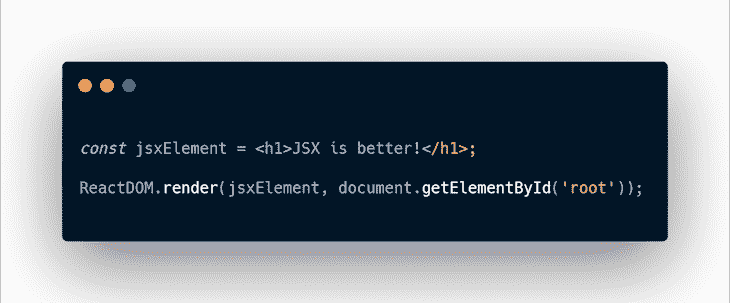
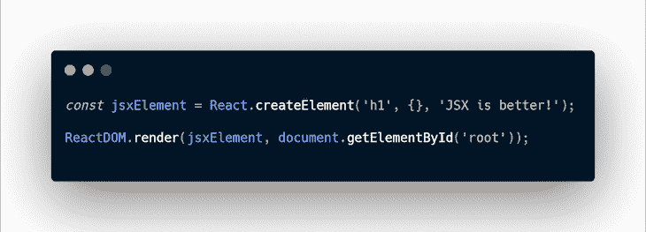
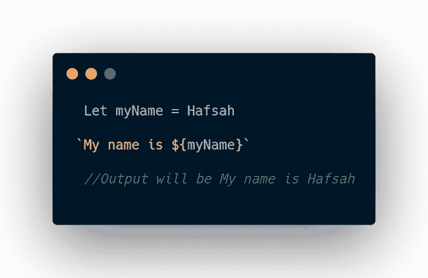

# 将最好的新 JavaScript 框架与 React 进行比较

> 原文：<https://blog.logrocket.com/comparing-the-best-new-javascript-frameworks-to-react/>

JavaScript 是一种动态编程语言，主要用于增加网站和应用程序的交互性。它是一种非常灵活的编程语言，用于前端开发、后端开发、游戏开发以及许多其他用途。虽然它以前主要用于客户端开发，但近年来它在服务器端和本机的使用有所增加。

由于 JavaScript 的广泛使用和流行，已经创建了许多库和框架来帮助 JavaScript 开发人员简化开发过程。React 就是这样一个框架，它是一个开源的 JavaScript 库，旨在帮助开发人员专门为单页面应用程序构建用户界面和 UI 组件。

通常，React 会与其他已建立的框架进行比较，如 Angular 和 Vue。在本文中，我们将关注更新的前端 JavaScript 框架，包括 Aurelia、hyperHTML、Svelte 和 Preact。我们将讨论每个框架是什么，如何使用它，以及在比较 React 时的相似之处和不同之处。

## 什么是反应？

在我们开始比较之前，让我们先回顾一下 React 框架。

React 特别关注用户界面，旨在帮助构建应用程序的前端，包括处理 web 和移动应用程序的视图层。React 是基于组件的，这意味着 React 应用程序的不同部分被分解成更小的组件，然后组织在更高级别的组件中。这些高级组件是应用程序最终结构的定义所在。

React 允许我们创建可重用的组件。这意味着我们可以创建一个组件，并在应用程序的不同部分多次使用它。这些组件有助于减少我们编写的代码行数和编写代码所花费的时间，并帮助开发人员遵循 DRY(不要重复自己)原则。

### JSX 在作出反应

React 的另一个特点是 JSX。JSX 没有将 HTML 从 JavaScript 中分离出来，而是在 React 中提供了一个模板，允许开发人员无需其他方法就可以轻松地将 HTML 添加到 DOM 中。

尽管 JSX 并不是 React 中的一个要求，但它确实使编写 React 应用程序变得更加容易。在 React 中使用`createElement()` or 和/或`appendChild()`方法会导致更长更复杂的代码行。

下面是一个使用 JSX 和`createElement()` 的例子:

或者，这里有一个没有 JSX 的例子:

两者都将返回相同的输出——“JSX 更好！”–但从长远来看，JSX 的简单性赋予了它优势，尤其是在拥有大量代码的情况下。

### React 中的虚拟 DOM

随着 React 的出现，虚拟 DOM 的概念变得更加流行。根据 [React 文档](https://reactjs.org/docs/faq-internals.html)，“虚拟 DOM (VDOM)是一个编程概念，其中 UI 的理想或‘虚拟’表示保存在内存中，并通过 ReactDOM 之类的库与‘真实’DOM 同步。”虚拟 DOM 能够在不使用 DOM APIs 的情况下被频繁地操作和更新。

这种 VDOM 方法支持 React 的声明式 API:您告诉 React 您希望 UI 处于什么状态，它确保 DOM 与该状态匹配。这抽象出了属性操作、事件处理和手动 DOM 更新，否则您将不得不使用它们来构建您的应用程序。

它的工作方式是，每当应用程序中发生变化时，API 都会检查新的变化，并将变化后的更新发送到原始 DOM。React 这样做是为了确保开发过程高效运行。最终，React 是一个框架，旨在使开发过程整体上对开发人员来说更容易。

既然我们已经讨论了 React，那么让我们看看一些新的 JavaScript 框架，以及它们与 React 的比较。

## **奥雷利亚**

Aurelia 可以被认为是一种“下一代框架”,因为它是用 ES6 和 ES7 构建的。用现代 JavaScript 从头开始编写意味着它的用户可以使用本机模块、类等。

Aurelia 使用一个简单的基于 HTML 的模板系统和 API，这使得任何熟悉现代 JavaScript 的人都可以顺利学习。自从发布以来，Aurelia 已经获得了很多认可，并且有超过一千个网站是用它建立的。Aurelia 的一个好处是它允许开发人员用普通的 JavaScript 和 Typescript 构建组件。

让我们来强调一下 Aurelia 的一些关键特性。

*   基于模块的框架:Aurelia 被分解成一系列面向功能的模块。它由更小的模块组成，这些模块可以作为一个成熟的框架一起使用。用户还可以选择他们想要的实际模块，并导入它们来创建定制的解决方案
*   灵活的语言支持:Aurelia 的 API 可以被类型脚本或者 JavaScript 使用，这给了开发者更多的灵活性
*   干净、可读的代码:Aurelia 允许开发人员用普通的 JavaScript 构建组件，随着时间的推移，很容易理解、更改和构建这些组件
*   Web 标准:Aurelia 是最干净的现代 JavaScript 框架之一。它专注于 web 标准，没有不必要的抽象
*   优秀的文档:奥雷利亚的[文档](https://aurelia.io/docs/)非常详细，很容易理解。它极具描述性，维护良好。该文档对初学者、有经验的用户和语言爱好者很有帮助
*   开源:令人惊讶的是，尽管 Aurelia 有这么多特性，但它并不是开源的。相反，它对所有人都是免费使用的，并且它的代码在 MIT 许可下是开源的

### Aurelia vs. React

Aurelia 和 React 都是开源项目，可以用来实现相同的结果。然而，使用不同的方法来获得这些结果。

在 React 中，视图和逻辑结合在一起；在奥雷利亚，他们是分开的。如前所述，在 React 中使用 JSX 将 HTML 和 JavaScript 结合在一起。在 Aurelia 中，HTML 和 JavaScript 存储在不同的文件中。这两种语言都有其方法之外的原因，并以各自的方法蓬勃发展。

另一个不同点是绑定。在 Aurelia 中，双向数据绑定是现成的，(它也有单向数据绑定)，但在 React 中，只有单向数据绑定。双向数据绑定不存在。使用单向数据绑定可以更容易地调试应用程序中的组件，但在某些情况下，选择双向数据绑定也是有利的。

Aurelia 提供了模板和路由等核心功能，因此开发人员不需要使用不同的库来实现这些功能。在 React 中，路由功能是通过使用库来处理的。

Aurelia 很容易学习和掌握，如果您只想使用一些模块来构建您的应用程序，它尤其有用。对 JavaScript 约定有了很好的理解，人们可以很快开始使用 Aurelia，并积累完成更复杂测试所需的知识。一些用户将其比作 Angular，并表示以前的 Angular 经验将使向 Aurelia 的过渡更加容易。

React 需要很好地理解普通的 [JavaScript 和 ES6](https://blog.logrocket.com/practical-use-cases-for-javascript-es6-proxies/) 才能开始。基础知识可以在短时间内学会，但使用 React 的全部功能，包括它的众多库，可能需要一段时间才能习惯。

Aurelia 和 React 有很多相似之处，也有一些不同之处，两者都非常适合特定的用例。如果你想在短时间内让一个项目运行起来，并且只有一些精选的模块，Aurelia 会是一个更好的选择。但是如果您想构建一个具有大量状态管理的应用程序，React 是您的最佳选择。

## **超级 HTML**

对于喜欢使用轻量级和极简的开发人员来说，hyperHTML 是一个完美的库。

根据 [hyperHTML 文档](https://viperhtml.js.org/hyperhtml/documentation/)，它是“一个 DOM & ECMAScript 标准兼容的、零依赖性的、完全跨平台的库，适用于声明式和反应式 Web 应用程序。”

让我们突出一些特点。

*   极其轻量级: hyperHTML 是一个简单而轻量级的 JavaScript 库，重量不到 5kb。它是用纯 JavaScript 编写的，内核很小
*   **简单入门:**要开始使用 hyperHTML，您只需要知道 HTML(显然)、CSS 和普通 JavaScript
*   **快速渲染:** hyperHTML 渲染快速高效，只有被修改过的部分才会被重新渲染。这种快速的性能使它比其他一些框架和库更有优势
*   **关注模板字面量** : hyperHTML 在模板字面量的基础上构建了它的核心特性，模板字面量是简单地用反斜杠包装的字符串。使用模板文字，每一次插值都作为唯一的 DOM 操作处理一次，并在需要时以闪电般的速度更新

当 JS 代码包含在美元符号和花括号中时，模板文字也可以计算 JavaScript，如下所示:

### 超 HTML 与 React

hyperHTML 和 React 都是高效的开源库，用于创建功能良好的应用程序。然而，虽然它们在某些方面相似，但在其他方面却有很大的不同。

尽管 React 在虚拟 DOM 上很重要，但 hyperHTML 有意避免了它。这有助于减少 RAM 和 CPU 的使用，因为没有虚拟 DOM 操作与它一起运行。同样值得注意的是，hyperHTML 非常轻量级，只有 4.5kb，而 React 只有 5.3kb。

如前所述，hyperHTML 使用模板文字进行模板化，而 React 使用 JSX。两者都能完美工作，但是一个是纯 JavaScript 特性，而另一个不是(JSX)。使用模板文字意味着在学习模板如何工作时根本没有学习曲线，特别是如果你已经熟悉普通 JavaScript 的工作方式。

综上所述，对你来说更好的框架取决于你打算用它做什么。如果你想要一些轻量级的，入门时没有压力的东西，你可以选择 hyperHTML。如果你想要一个拥有大量社区支持、各种插件和有组织的编码约定的库，React 可能是你更好的选择。

## 苗条的

Svelte 是用 TypeScript 编写的基于组件的 JavaScript 框架。它于 2016 年首次推出，此后发展迅速。

许多开发人员认为，在传统的 web 应用程序构建方式上，Svelte 是一种急需的改变。使用 Svelte，组件的构建没有样板文件或虚拟 DOM，而是用普通的 HTML、CSS 和 JavaScript。然后，这些代码被编译成小的普通 JavaScript 模块，DOM 随着状态的变化而更新。构建没有样板文件的组件有助于减少编写的总代码量。

以下是人们喜欢苗条身材的一些原因。

*   **容易上手:** Svelte 的学习曲线比较平缓。与其他一些框架相比，它很容易掌握，因为它的很大一部分是普通的 HTML、CSS 和 JavaScript。它不要求额外的 JSX 或打字知识
*   **低束尺寸:**与许多其他框架相比，Svelte 的束尺寸要小得多。这可能是因为 Svelte 没有客户端依赖(只有开发者依赖)
*   减少代码量:Svelte 的目标之一是减少开发人员编写的代码量。编写的代码越少，编写错误代码的几率就越低，就有更多的时间专注于做其他事情
*   **没有虚拟 DOM:** Svelte 没有虚拟 DOM。相反，Svelte 在构建时将代码编译成小的普通 JavaScript 模块，并在状态改变时更新 DOM。正因为如此，苗条不需要高浏览器处理，使苗条的应用程序快速可靠

### 苗条与反应

Svelte 的性能和简单的语言特性使它成为值得关注的顶级框架之一。React 和 Svelte 之间的一些相似之处包括它们基于组件的架构、它们用于构建用户界面的高效工具的可用性以及它们的开源状态。

它们之间的一个显著区别是 Svelte 是一个编译器，而 React 使用虚拟 DOM。Svelte 在构建时将应用程序编译成干净的 JavaScript，而 React 在运行时使用虚拟 DOM 解释应用程序。

与 React 不同，Svelte 没有使用 JSX。相反，它使用类似 HTML 的语法和强大的内置模板引擎。这将有助于初学这门语言的人快速入门，而不用花时间学习 JSX 的工作方式。

不值一提的是，与 React 相比，Svelte 的包大小也非常小。这是因为它没有客户端依赖性，也没有复杂的状态管理库。

当您想要构建快速和轻量级的应用程序时，Svelte 的小包大小和极快的构建时间将始终是一个不错的选择。但是如果你想构建一个具有各种集成的大型应用程序， [React 可能是一个更好的选择](https://blog.logrocket.com/should-you-switch-from-react-to-svelte/)。

## 提前

Preact 是一个 JavaScript 库，或多或少是 react 的一个轻量级版本。Preact 实现了一个快速的虚拟 DOM，并且是最小的库之一(3kB)，使它具有高性能和极快的速度。

*   **易于理解**:与其他许多框架相比，理解 Preact 花费的时间更少，如果你已经理解了 react，那么 Preact 将是一个简单的入门工具
*   轻量级:Preact 的一个显著特点是体积小。它在小型项目和大型项目中都很容易使用
*   **广泛的浏览器支持** : Preact 具有出色的浏览器支持，尽管 IE7 和 IE8 可能需要使用 polyfills
*   **性能** : Preact 运行速度非常快，渲染速度也很快，有助于确保开发过程的顺利进行
*   **文档** : Preact 的[文档](https://preactjs.com/)非常详细，有例子可以帮助用户很快熟悉这个框架

### 预先行动与反应

当您喜欢 react 的工作方式，但想要更轻更快的东西时，Preact 是一个不错的选择。您可以在浏览器中开始使用 Preact，无需构建，这让开发人员有时间关注项目的其他部分。

尽管两者有很多相似之处，但 Preact 并不打算成为 react 的完全重新实现。因此，有一些显著的差异。

与 React 不同，Preact 并不强制使用`className`。而是允许和鼓励使用`class`，不使用 React 的人更熟悉。

Preact 的核心也不包括`propTypes`验证，因为根据官方文档，“不是每个人都使用`propTypes`”但是，`propTypes`受 preact-compat 支持，也可以手动使用。

最后，Preact 不像 react 支持那么多 JavaScript 特性，这是有意义的，因为它强调保持轻量级和专注。

就像许多其他框架一样，Preact 没有 react 拥有的健壮的生态系统。然而，在快速有效地构建各种应用程序时，它确实是一个很好的库。

## 结论

您可能已经注意到，React 的一个主要优势是其广泛的特性和多功能性。也就是说，总是在创造新的框架来改善开发人员的体验。

在本文中，我们讨论了 Aurelia、hyperHTML、Svelte 和 Preact，并比较了每个框架的反应。如果你有兴趣尝试一个新的框架，这里提到的是很好的选择。

尝试最新最炫的框架可能很有诱惑力，但是无论您选择哪个框架，都要确保它是您正在构建的应用程序的最佳解决方案，并且您使用它来最大化它的优势。

## 使用 LogRocket 消除传统反应错误报告的噪音

[LogRocket](https://lp.logrocket.com/blg/react-signup-issue-free)

是一款 React analytics 解决方案，可保护您免受数百个误报错误警报的影响，只针对少数真正重要的项目。LogRocket 告诉您 React 应用程序中实际影响用户的最具影响力的 bug 和 UX 问题。

  [LogRocket](https://lp.logrocket.com/blg/react-signup-issue-free)

自动聚合客户端错误、反应错误边界、还原状态、缓慢的组件加载时间、JS 异常、前端性能指标和用户交互。然后，LogRocket 使用机器学习来通知您影响大多数用户的最具影响力的问题，并提供您修复它所需的上下文。

关注重要的 React bug—[今天就试试 LogRocket】。](https://lp.logrocket.com/blg/react-signup-issue-free)

## 您是否添加了新的 JS 库来提高性能或构建新特性？如果他们反其道而行之呢？

毫无疑问，前端变得越来越复杂。当您向应用程序添加新的 JavaScript 库和其他依赖项时，您将需要更多的可见性，以确保您的用户不会遇到未知的问题。

LogRocket 是一个前端应用程序监控解决方案，可以让您回放 JavaScript 错误，就像它们发生在您自己的浏览器中一样，这样您就可以更有效地对错误做出反应。

[https://logrocket.com/signup/](https://lp.logrocket.com/blg/javascript-signup)

[LogRocket](https://lp.logrocket.com/blg/javascript-signup) 可以与任何应用程序完美配合，不管是什么框架，并且有插件可以记录来自 Redux、Vuex 和@ngrx/store 的额外上下文。您可以汇总并报告问题发生时应用程序的状态，而不是猜测问题发生的原因。LogRocket 还可以监控应用的性能，报告客户端 CPU 负载、客户端内存使用等指标。

自信地构建— [开始免费监控](https://lp.logrocket.com/blg/javascript-signup)。