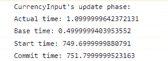
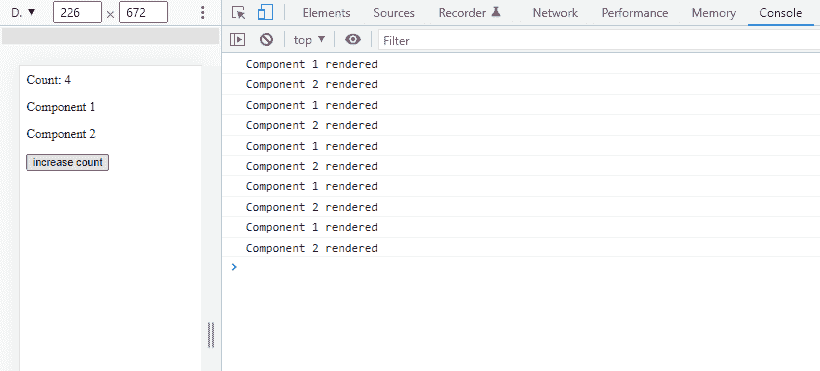
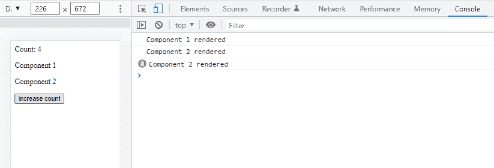
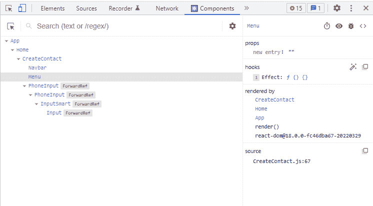
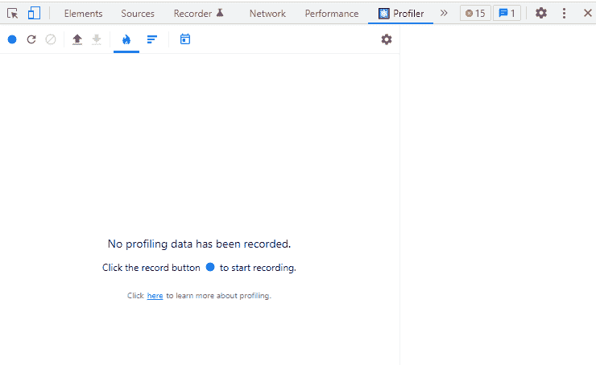
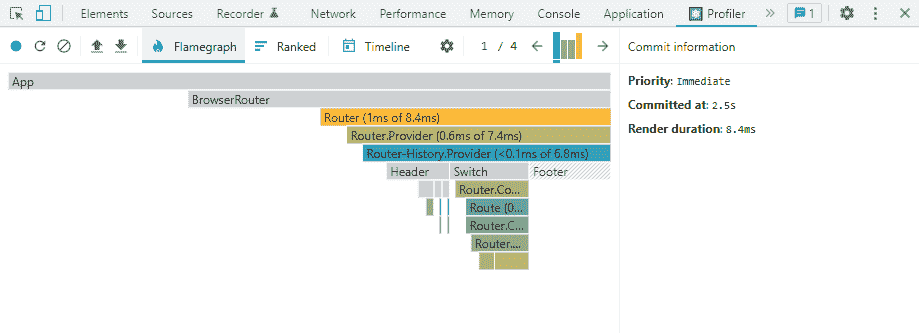
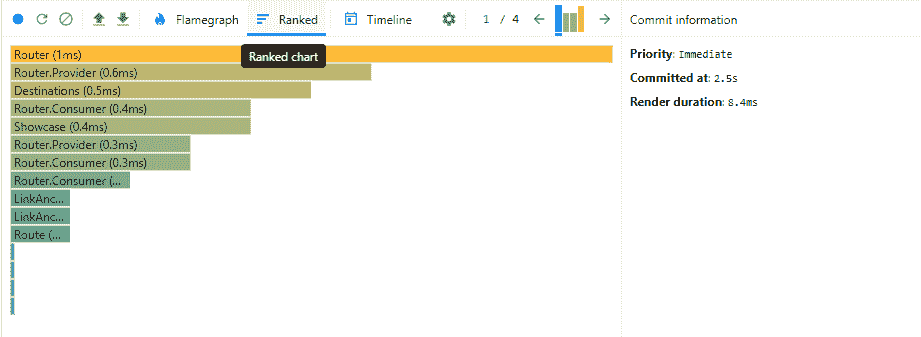
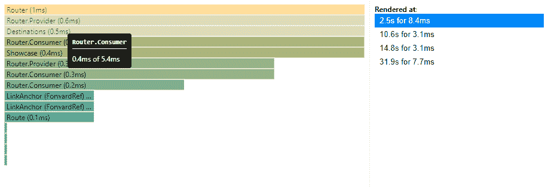

# React 中优化性能的比较工具

> 原文：<https://blog.logrocket.com/comparing-tools-optimizing-performance-react/>

如果不优化应用程序的性能，构建 React 应用程序时可能会遇到网页冻结、UX 缓慢、处理大量组件、渲染缓慢和不必要的重新渲染等常见问题。

本文将重点介绍性能优化工具，这些工具可以帮助您识别 React 应用程序中的潜在问题，以便您可以实现 UX 的完美。这些工具包括 Profiler API、`React.memo()`和 React 开发人员工具。

### 内容

## 探查器 API

Profiler API (不是 Chrome 开发工具中的那个)是由 B. Vaughn 开发的相对较新的 React 组件。它提供了一种方法来跟踪组件被重新渲染的次数和渲染的“成本”，即受重新渲染影响的时间和资源。

有了它，您可以快速识别应用程序中可能需要通过内存化来优化的缓慢和有缺陷的区域。

### 如何使用探查器 API

分析器 API 通常需要两个道具:`id`和一个`onRender`回调函数，该函数在由`<Profiler />`包装的组件被安装或更新时收集时间度量。这是一个非常有效的工具，用于检测 React 应用程序中的滞后组件。

下面的代码片段显示了如何分析一个`Footer`组件:

```
import React, { Profiler } from "react";
return(
  <App>
    <Profiler id="Footer" onRender={callback}>
      <Footer {...props} />
    </Profiler>
    <Main {...props} />
  </App>
);

```

您还可以使用多个`<Profiler/>`组件来跟踪应用程序的不同部分:

```
return(
  <App>
    <Profiler id="Footer" onRender={callback}>
      <Footer {...props} />
    </Profiler>
    <Profiler id="Main" onRender={callback}>
      <Main {...props} />
    </Profiler>
  </App>
);

```

`<Profiler />`组件也可以嵌套在一起，这样您就可以在同一个树中访问不同的组件:

```
return(
  <App>
    <Profiler id="Panel" onRender={callback}>
      <Panel {...props}>
        <Profiler id="Main" onRender={callback}>
          <Main {...props} />
        </Profiler>
        <Profiler id="PreviewPane" onRender={callback}>
          <PreviewPane {...props} />
        </Profiler>
      </Panel>
    </Profiler>
  </App>
);

```

这些只是使用`<Profiler />`跟踪应用程序性能的不同方式。

### `onRender`回调

`<Profiler/>`需要一个`onRender`方法作为道具。当分析树中的组件“提交”更改时，该函数运行。它获取有关渲染内容和花费时间的信息:

```
function callback(id, phase, actualTime, baseTime, startTime, commitTime, interactions) {
  // aggregate or log render timings...
} 

```

现在，让我们来定义道具:

*   `id`属性用于识别分析器报告；如果您正在使用几个分析器，这可以帮助您找出树的哪个部分受到了损害
*   `phase(mount/update)`将报告组件树是第一次安装还是根据道具、状态或钩子的变化重新渲染
*   `actualTime`是探查器装载或更新其子代所花费的时间
*   `baseTime`是每个组件的最新渲染时间的持续时间
*   `startTime`是探查器开始测量其子代的装载/呈现时间的时间戳
*   `commitTime`是提交更新所花费的时间。所有的分析器在提交中共享这个值，如果需要的话，可以对它们进行分组
*   `interactions`是计划更新时跟踪的一组“交互”，例如，当您计划`setState`功能时

> 尽管用于跟踪交互的 API 仍处于试验阶段，但在确定更新原因时，它会变得非常有效。你可以在这里了解更多信息。

```
import React, { Profiler } from "react";
const callback = (id, phase, actualTime, baseTime, startTime, commitTime) => {
  console.log(`${id}'s ${phase} phase:`);
  console.log(`Actual time: ${actualTime}`);
  console.log(`Base time: ${baseTime}`);
  console.log(`Start time: ${startTime}`);
  console.log(`Commit time: ${commitTime}`);
};
return (
    <>
      <Profiler id="CurrencyInput" onRender={callback}>
      <CurrencyInput
         props={props}
         />
        </Profiler>
    </>
);

```

在上面的例子中，`<Profiler/>`被包装在`CurrencyInput`组件周围，使您能够在组件挂载时访问关于该组件的大量有用信息。在这种情况下，您可以在控制台上访问信息:




这些参数将有助于确定哪个组件树降低了应用程序的运行速度，哪个组件树运行良好。

### 探查器 API 的用例

在以下情况下，您可以使用`<Profiler />`:

*   您打算以编程方式检索特定应用程序组件的计时
*   您希望确定是哪个特定的用户操作或后端请求导致渲染速度极慢
*   您希望用更具语义的上下文来提供您的性能发现

### 探查器 API 的缺点

*   它不一定能提供与 React DevTools Profiler 一样多的渲染信息
*   这是有代价的；组件树中的每个探查器实例都会导致微小的性能损失

由于对性能的轻微影响，Profiler API 最近也在生产版本中被禁用。虽然这通常不是一个问题，因为大多数严重的性能问题在生产和开发版本中是显而易见的，但情况并非总是如此。有时，您可能希望在产品包中访问组件的渲染时间。

## `React.memo()`

[`React.memo()`](https://blog.logrocket.com/react-memo-vs-usememo/) 是一个在处理不必要的重渲染时往往会派上用场的函数。如果组件的属性在挂载/更新时没有改变，那么 React 可以跳过组件的重新渲染，这有助于提高功能组件和钩子的渲染效率。`memo`代表记忆化。

### 如何使用`React.memo()`

将函数组件包装在`React.memo()`函数中是最常见的使用方式:

```
const Stone = React.memo(() => {
  return (
    <div className="black-stone">
      <Task />
    </div>
  );
});

```

考虑下面的例子:

```
const Component1 = () => {
  console.log("Component 1 rendered")
  return (
    <>
      <p>Component 1</p>
      </>
  )
}
const Component2 = () => {
  console.log("Component 2 rendered")
  return (
    <div>
      <p>Component 2</p>
      </div>
  )
}
const SampleApp = () => {
  const [counter, setCounter] = React.useState(0)
  return (
    <div>
      <div>Count: {counter}</div>
      <Component1 />
      <Component2 />
      <button onClick={() => setCounter(counter + 1)}>increase count</button>
  </div>
  )
}

```

上面的代码是一个简单的 React 应用程序，包含两个组件:`Component1`和`Component2`，它们由`App`组件提供。无论何时渲染或重新渲染，这两个组件都将向控制台报告。

`App`组件还有一个计数器状态变量，它在点击**增加计数**按钮时动态变化，导致`Component1`和`Component2`重新渲染。



单击按钮四次后(将计数增加到四次)，您可以看到每个组件有五个日志:一个用于初始渲染，另外四个用于每次单击按钮(即每次重新渲染这些组件)。这是一个性能问题，你可能倾向于忽略它，因为它可能在较小的项目中不被注意，但它会在大得多的项目中出现，使你的应用程序变得多余和缓慢。

好消息是您可以使用`React.memo()`快速修复这个问题。例如，如果您不想在单击按钮时重新渲染`Component1`,以下是方法:

```
const Component1 = React.memo(function Component1(props) {
  console.log("Component 1 rendered")
  return (
    <div>
      <p>Component 1</p>
      </div>
  )
});

```

既然我们已经用`React.memo()`包装了`Component1`，让我们回到控制台，看看这对我们的应用程序有什么影响:



如你所见，当计数器增加时，`Component1`不会重新渲染，从而解决了我们的问题。

### `React.memo()`的使用案例

在以下情况下最好使用`React.memo()`:

*   组件渲染时间超过 100 毫秒
*   该组件保持对同一组道具的重新渲染，这通常发生在父组件强制其子组件进行渲染的时候
*   您正在处理具有大量 UI 组件的大型应用程序，重新渲染会给用户带来明显的响应延迟(糟糕的 UX)

### `React.memo()`的弊端

当无法评估性能优势时，避免使用`React.memo()`。如果重新渲染我们的组件(有和没有这个高阶组件)的计算时间很少或不存在，那么利用`React.memo()`是没有意义的。

虽然用`React.memo`包含包装类组件是可行的，但这被认为是不好的做法，所以不鼓励这样做。相反，扩展`PureComponent`类更可取，这是记忆类组件的更干净的方法。

> 根据经验，如果无法衡量性能优势，就不要使用内存化。

React 有一个名为 [React 开发者工具](https://chrome.google.com/webstore/detail/react-developer-tools/fmkadmapgofadopljbjfkapdkoienihi?hl=en)的 Chrome DevTools 扩展。React 开发者工具有两个标签: **⚛️组件**和 **⚛️剖析器**。

通过**组件**选项卡，您可以访问应用的组件层次结构及其状态信息。它显示了根 React 组件和呈现在页面上的子组件。

**Profiler** 选项卡有助于性能优化，因为它为您提供了应用程序结构和组件渲染时间的完美类比。





请注意，您必须使用 React v.16.5 或更高版本来访问 React 开发人员工具。

### 使用分析器

通过对 React 应用程序进行概要分析，您可以很容易地获得说明应用程序全面性能的所有必要数据，这允许您通过使用`React.memo()`进行记忆来优化它。

使用 Profiler 有三个简单的步骤:

1.  点击**剖面仪**选项卡上的**记录**按钮；这使它能够访问您的应用程序的活动和它的一般 UI 行为
2.  像往常一样执行应用程序的常规操作(此时，分析器将收集应用程序重新呈现的数据)
3.  再次点击**记录**按钮停止记录

### 解释结果

通常，React 分两个阶段运行:呈现阶段，决定要做哪些 DOM 更改；提交阶段，实际执行操作。

React 的 Profiler 整理应用程序的性能信息，并以条形图表示的提交形式显示它们，如下图所示。


这些图表有三种不同的形式。

#### 火焰图

该图表示单次提交时组件的当前状态。每个条形代表应用程序中的一个组件，每个条形的长度由其对应组件的渲染时间决定，因此组件的渲染时间越长，条形就越长。



上面的 app 显示的是**路由器。提供者**比**路由器花费了更长的渲染时间。消费者**。您可以单击每个条形来获取每个组件的特定提交信息。

通过观察条形的颜色，您还可以了解每个组件渲染需要多长时间。颜色解释如下:

*   灰色:提交期间组件未能呈现
*   蓝绿色:组件相对来说花费较少的时间来渲染
*   黄绿色:相对来说，组件需要更多的时间来渲染
*   黄色:组件花费了最多的渲染时间

#### 分级图

该图按每个组件渲染或重新渲染时间的排名顺序显示结果。花费时间最长的组件在最上面。

通过这个图表，您可以立即发现哪些组件降低了应用程序的速度，哪些组件对页面重新加载的影响最大。



从上面的示例应用程序来看，**路由器**的渲染时间最长。

#### 组件图

您可以通过双击代表组件的任何条形来访问组件的图表。该图表提供了关于组件在分析期间的生命周期的信息。



正如我前面提到的，分析器提供了有用的信息，如应用程序的运行时间、组件重新呈现时间和提交信息。这些结果是必不可少的，因为它们以不同的方式为您提供了应用程序的概述，使您能够找出哪些组件导致了长时间的渲染，并使用记忆等技术来优化它们，以避免不必要的重新渲染。

在学习如何成功使用这个 Chrome DevTools 插件之后，发现 React 应用程序中的性能问题是小菜一碟。

### React 开发人员工具的用例

在以下情况下，可以使用 React 开发工具:

*   您想要应用程序性能的图形可视化，一个组件接一个组件
*   您希望跟踪每个组件的渲染时间，以及哪个组件可能会导致应用程序延迟或冻结，尤其是对于大得多的组件
*   您希望在控制台中访问组件和状态信息

### React 开发工具的缺点

尽管 Profiler 可以让您访问应用程序的组件信息，但它并不主动解决问题，它只是向您展示这些信息。你仍然需要积极地应用优化技术，比如记忆化，来提高你的应用程序的性能。

> React 术语中的记忆化是一种优化技术，其中只有当父组件重新渲染时属性发生变化，子组件才会重新渲染。如果 props 保持不变，它将跳过`render`方法，返回缓存的结果。

## 对比图表

| React 开发人员工具分析器 | 分析器 API ( <profiler>)</profiler> | React.memo() | 它是做什么的？ |
| --- | --- | --- | --- |
| 分析您的应用程序并返回结果的图形表示。 | 分析您的应用程序并生成结果的程序表示。 | 它用于根据获得的结果在必要时记忆组件。 | 它显示组件渲染时间吗？ |
| 是 | 是 | 不 | 在生产捆绑包上有效吗？ |
| 不 | 不 | 是 | 看看这些工具，React Dev Tools Profiler 对我来说是最重要的，因为它易于使用，有很好的文档记录，并以类似图形的方式提供对组件树结构的完全访问。识别 React 应用程序中的性能“问题”再简单不过了。 |

结论

## 本指南展示了一些可用于分析 React 应用程序和识别性能问题的工具。我们还讨论了记忆化以及如何使用`React.memo()`函数来提高应用程序的整体性能。编码快乐！

使用 LogRocket 消除传统反应错误报告的噪音

## 是一款 React analytics 解决方案，可保护您免受数百个误报错误警报的影响，只针对少数真正重要的项目。LogRocket 告诉您 React 应用程序中实际影响用户的最具影响力的 bug 和 UX 问题。

[LogRocket](https://lp.logrocket.com/blg/react-signup-issue-free)

自动聚合客户端错误、反应错误边界、还原状态、缓慢的组件加载时间、JS 异常、前端性能指标和用户交互。然后，LogRocket 使用机器学习来通知您影响大多数用户的最具影响力的问题，并提供您修复它所需的上下文。

[ ](https://lp.logrocket.com/blg/react-signup-general) [  ](https://lp.logrocket.com/blg/react-signup-general) [LogRocket](https://lp.logrocket.com/blg/react-signup-issue-free)

关注重要的 React bug—[今天就试试 LogRocket】。](https://lp.logrocket.com/blg/react-signup-issue-free)

Focus on the React bugs that matter — [try LogRocket today](https://lp.logrocket.com/blg/react-signup-issue-free).