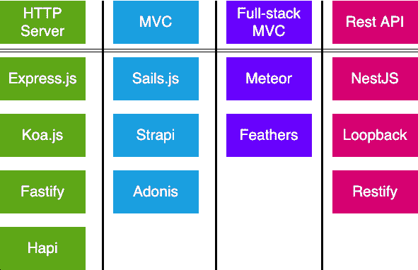
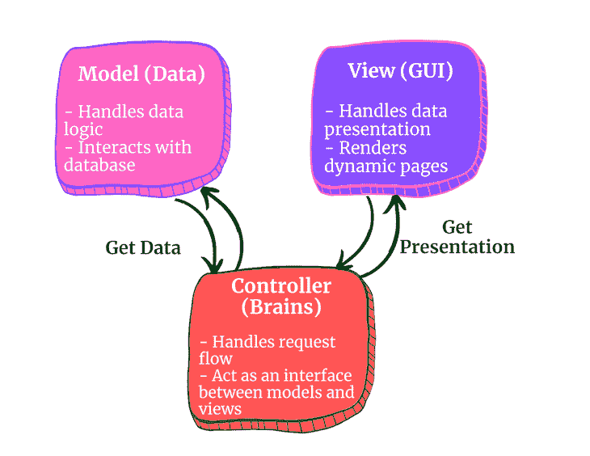
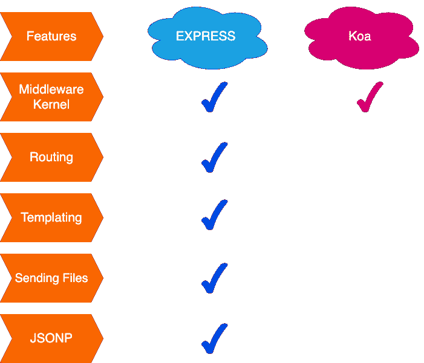
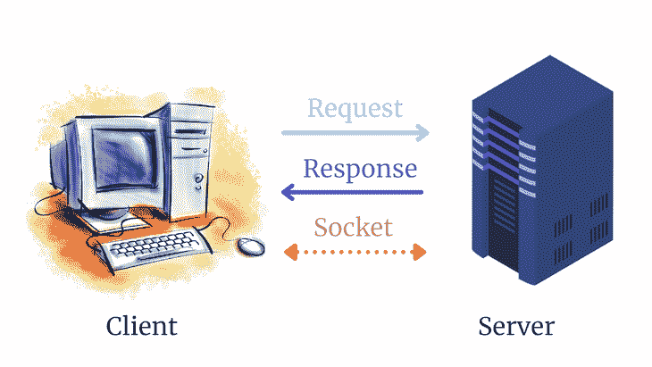

# 比较面向前端开发人员的顶级 Node.js 框架

> 原文：<https://blog.logrocket.com/comparing-top-node-js-frameworks-frontend-developers/>

***编者按**:本文最后一次更新是在 2022 年 12 月 15 日，包含了关于 Express v5.0 的[信息，在撰写本文时，该版本还处于测试阶段。](https://blog.logrocket.com/express-js-5-migration-guide/)*

Node.js 运行时允许开发人员仅使用 JavaScript 构建前端和后端应用程序，这意味着您不再需要在不同语言之间切换上下文，例如后端的 PHP 和前端的 JavaScript。

Node.js 曾被视为业余爱好者的语言，但它真正革新了网络。如果在 Node.js 引入之前你已经是一名开发人员，你必须学习一种完全不同的语言来编写服务器端代码，比如 PHP。然而，由于 Node.js 及其庞大的生态系统，前端开发者现在也能够使用 JavaScript 与后端协同工作。

使用 Node.js，您可以创建生产就绪的应用程序，包括实时聊天应用程序、微服务、命令行工具、web 服务器和 API。由于其事件驱动的模型，Node.js 可以处理大量的并发请求。许多大公司在生产中使用 Node.js，包括网飞、优步、Nasa、PayPal 和沃尔玛等。

在本文中，我们将根据一些流行的 Node.js 框架的用法、特性、缺点、下载等进行比较。我们开始吧！

## 为什么应该使用框架？

编写服务器端逻辑很复杂，从头开始编写整个应用程序非常耗时。开发人员需要关注业务逻辑，而不是浪费时间从头开始创建应用程序。通过提供帮助函数、工具和规则，框架处理繁重的工作，帮助我们构建应用程序并快速编写干净的代码。

许多 web 框架将 web 协议抽象成更高级别的 API，并为构建 web 应用程序提供丰富的接口。通常，这些框架使用 Node.js 的底层内置功能，并为我们提供一个更简单的 API 来在我们的 web 服务器中创建更复杂的功能。当然，框架给我们的代码增加了抽象，但是如果您正在构建一个大型的 web 应用程序，它们可以派上用场。

每个框架都试图解决一个问题，并且每个框架的哲学都不同。然而，所有 Node.js 框架都有一些共性，比如将 URL 映射到内容(称为路由)，以及动态内容的模板化。

## Node.js 框架的类型

虽然你可能对学习一个新的框架感到兴奋，但是大量的可用框架可能会让你不知所措。下图可以帮助您了解哪个框架可能是您独特项目的最佳选择:

对框架进行分组有许多不同的方法，有些框架可以属于多个类别。例如，我已经将 NestJS 包含在 REST API 下，但是您也可以将它用作全栈和 MVC 框架。或者，您可以启动 REST API 服务器。

### HTTP 服务器框架

HTTP 服务器框架基于 Express，帮助您构建基于 HTTP 动词和路由的应用程序。几个流行的 HTTP 服务器框架包括 [Fastify，一个用于后端开发的低开销框架](https://blog.logrocket.com/how-to-build-a-blazingly-fast-api-with-fastify/)，Koa，由 Express 团队的[设计，以及哈比神，一个 NestJS](https://blog.logrocket.com/first-steps-with-koa-js/) 的[替代品。](https://blog.logrocket.com/nestjs-vs-hapi/)

### MVC 框架

MVC 代表模型、视图和控制器，这是一种软件架构设计模式，它将应用程序功能分成三个部分:

模型处理数据逻辑，并表示数据是如何存储的。视图处理向用户呈现信息，控制器处理请求流并在模型和视图之间委托信息。控制器将从模型中获取数据信息，然后将数据传递给视图。

[风帆](https://sailsjs.com/)、[斯特拉皮](https://strapi.io/)、 [AdonisJS](https://adonisjs.com/) 支持 MVC 架构；如果你不想花时间构建你的应用程序，你可以使用这些。此外，拥有 MVC 架构可以让其他开发者更容易理解你的代码。

### 全栈 MVC 框架

[流星](https://www.meteor.com/)和[羽毛](https://feathersjs.com/)是一些在客户端和服务器端使用 JavaScript 的全栈 Node.js 框架，也就是[也称为同构代码](https://blog.logrocket.com/build-an-isomorphic-application-with-nuxt-js-and-node/)。这些框架有很多特性，包括模板引擎、WebSocket 库和 ORM。

### Rest API 框架

[NestJS，Loopback](https://blog.logrocket.com/nestjs-vs-loopback-which-is-best/) ，Restify 都是 REST API 框架。您可以使用这些框架来启动快速 Node.js 服务器，或者只是处理 CRUD 请求。

## 一些统计数据

下面的图表将让您了解该框架在撰写时的受欢迎程度，包括它有多少贡献者，npm 上的每月下载量，以及该框架的年龄:

| GitHub stars | 每月下载量 | 贡献者 | 年龄 | 表达 |
| --- | --- | --- | --- | --- |
| 59.1 千 | 27.8 米 | 295 | 13 年 | 寇阿相思树 |
| 33.4 千 | 1.3 米 | 226 | 9 年 | 哈皮网 |
| 14.1 千 | 66.5 万 | 212 | 11 年了 | 嵌套. js |
| 52.6 千 | 1.9k | 353 | 6 年 | Socket.io |
| 57.2k | 5.3k | 204 | 13 年 | 帆. js |
| 22.3 千 | 36.2k | 238 | 11 年了 | Fastify |
| 25.8 千 | 842.1k | 593 | 6 年 | 回路 |
| 13.3 千 | 45.8 千 | 133 | 9 年 | 阿多尼斯 |
| 13.3 千 | 141 | 70 | 7 年 | 重新定义 |
| 10.5 千 | 129.8k | 206 | 11 年了 | 斯特拉皮 |
| 50.4 千 | 16.3 千 | 827 | 7 年 | 流星 |
| 43.1 千 | 1.4k | 674 | 十年了 | 这些框架大部分都很老了，npm 上下载量最多的领先框架是 Express。继 Express 之后，我们有 Koa，然后是 Fastify。至于在 GitHub 上的人气，Express 和 Socket.io 是领头羊，Meteor、NestJS、Strapi 紧随其后。 |

我们将回顾五个最流行的框架，Express、Koa、Socket.io、NestJS 和 Fastify，探索它们的特性、卖点以及哪些公司正在使用它们。

表达

## 不可否认，Express 是 Node.js 框架之王，在撰写本文时， [npm](https://www.npmjs.com/package/express) 上的周下载量约为 2800 万次。它通常被认为是 Node.js 事实上的 web 服务器框架。

2010 年发布，Express 是用 JavaScript 编写的。在撰写本文时，Express 的最新稳定版本是 [v4.18.1](https://expressjs.com/en/changelog/4x.html) 。然而，随着新特性的引入，Express 正在向 v5.0.0 迁移，在撰写本文时，该版本还处于测试阶段。

由于 Ruby 的效率和可维护性，Express 受到了 Sinatra 框架的启发。设计用于快速构建和运行网络应用，开发者喜欢 [Express，因为它轻量级、快速、极简和非个性化](https://blog.logrocket.com/organizing-express-js-project-structure-better-productivity/)。

Express:特点和优势

### Express 提供了像路由选择和 T2 中间件这样的特性，只需要几行代码就可以加速这个过程。Express 只是 Node.js 的一个薄层，由于 Node 的异步特性，我们可以并发运行多个请求。因此，Express 提供了高性能和快速的开发体验。

Express 健壮且有弹性的路由系统通过从 [Express `app`对象](https://expressjs.com/en/api.html)派生的[路由方法](https://expressjs.com/en/guide/routing.html)处理请求，因此您可以编写对特定端点的响应。

Express 没有提供组织事物的通用方法。没有严格的规则，所以你可以决定如何构建你的应用或者使用什么中间件。例如，你可以自由选择任何设计模式，如 MVC、MVP、MVVM 等。然而，[最常见的是 MVC 模式](https://blog.logrocket.com/building-structuring-node-js-mvc-application/)。

使用 Express，可以轻松集成第三方服务和中间件来完成解析请求、cookie 头、会话、安全头或库等任务。这允许您使用额外的库进行身份验证、数据库访问、会话管理等等。您可以轻松地与 SQL 或 NoSQL 数据库集成。

Express 系统支持超过 20 个模板引擎来简化 HTML 的生成。一些受欢迎的包括[哈巴狗](https://pugjs.org/api/getting-started.html)、[小胡子](https://github.com/janl/mustache.js/)和 [EJS](https://ejs.co/) 。

Express 有一个相当大的社区，详细的文档，和一个浅的学习曲线；如果你熟悉 JavaScript，很容易学会。事实上，大多数框架都是建立在 Express 之上的。Express 也很容易测试，因为它的中间件和路由模块化了项目。

使用快递的缺点

### 另一方面，Express 需要大量劳动密集型任务，比如设置端点和中间件。因为 Express 是非个人化的，所以您需要自己配置库和特性。

在编写快速代码时，您可能会遇到[回调地狱](http://callbackhell.com/)或末日金字塔。你可以通过使用[承诺](https://expressjs.com/en/guide/error-handling.html)来解决这个问题。由于 Express 的体系结构，由一组开发人员管理大型项目可能会很困难。

什么时候应该使用 Express？

### Express 被 Mulesoft、IBM、Yandex、优步和埃森哲等公司使用。Express 非常灵活，您可以构建任何类型的单页面、多页面或任意大小的混合 web 和移动应用程序。您可以从为 JSON APIs 构建简单的静态文件服务器开始。

寇阿相思树

## [Koa](https://blog.logrocket.com/first-steps-with-koa-js/) 是现代版的 Express。它更轻，更有表现力，也更健壮。你可以使用 [Koa](https://koajs.com/) 创建 web 服务，就像 Express 一样。事实上，Koa 框架是由 Express 背后的团队设计的，它有时被称为 Express 的未来。该团队减少了 Express 中的中间件包，用现代 JavaScript 语法对其进行了改进，并给了开发人员更多的自由。

Express.js 和 Koa 的区别

### 

如果我们比较 Koa 和 Express，我们可以看到 Koa 删除了 Express 中的大部分功能。Koa 是非个人化的，它不提供现成的路由、模板引擎或 JSONP。这背后的主要原因是让 Koa 更快，给开发人员更多的自由，并在编写代码时带来更少的复杂性。

Koa 也有更多的定制选项。因此，如果开发人员想要使用中间件，他们可以自己创建或者使用内置的中间件。Koa 提供附加模块，如 [Koa 路由器、](https://www.npmjs.com/package/koa-router) [Koa EJS 模板化](https://www.npmjs.com/package/koa-ejs)、 [Koa 主体解析器](https://www.npmjs.com/package/koa-bodyparser)等等。

Koa 功能

### Koa 更关注 JavaScript ES6 语言的现代特性，比如生成器、异步函数和 Node.js 运行时。Koa 使用基于承诺的流和 async-await 语法来消除回调，使代码更易管理、更干净、更可读。Koa 利用 ES2015 生成器语法来定义中间件，而不是回调。您可以使用`yield`关键字退出，然后重新输入。

Koa 使用一个`context`对象，它将`req/res`对象封装成一个，通过使用几种有用的方法帮助开发人员更有效地构建 API。最后，Koa 使用级联中间件。由于异步功能，中间件将以级联方式运行，直到到达最后一个中间件。

更多来自 LogRocket 的精彩文章:

* * *

### 使用 Koa 的优势

* * *

### 如果你了解 Express，Koa 简单易学，只有 600 行代码，帮助开发者写出更瘦的中间件。与 Express 相比，Koa 每秒处理更多请求的性能更好，对使用`try...catch`的错误处理有更好的控制，并且更加模块化。由于它的模块化，在 Koa 中重构更大的代码库很容易，并且它为开发应用程序和 API 提供了一个最小的接口。

使用 Koa 的缺点

### Koa 与 Express 风格的中间件不兼容，它使用 ES6 生成器，与其他框架的中间件不兼容。生成器使得将来更难移植到其他 Node.js 框架，并且它与框架产生了紧密耦合。最后，Koa 没有内置的中间件，像`req`、`res`和`next`这样的传统中间件不能与 Koa 一起工作。

何时使用 Koa

### Paralect、GAPO 和石墨网站都使用 Koa。Koa 非常适合构建可伸缩的轻量级 web 应用程序、HTTP APIs 和单页面 web 应用程序。

Socket.io

## Socket.io 主要用于构建实时聊天应用程序，如 WhatsApp 和 Facebook Messenger。它在 web 客户端和服务器之间建立双向通信:

为了更好地理解这一点，我们需要理解客户机和服务器通常如何通过 HTTP 进行通信。客户端发出请求，服务器响应客户端的请求。但是，这是单向的交流；服务器无法开始与客户端通信，因为 HTTP 协议是无状态的，并且服务器很难找到访问它的所有不同客户端的 IP 地址。

在某些情况下，服务器需要实时更新客户端。例如，如果我们有一个聊天应用程序，服务器应该立即向所有用户广播新消息。我们需要使用 [WebSockets](https://blog.logrocket.com/websockets-tutorial-how-to-go-real-time-with-node-and-react-8e4693fbf843/) 而不是 HTTP 连接，这允许前端和后端之间的实时双向通信。

Socket.io 有两个部分，一个在浏览器上运行的客户端库和一个 Node.js 的服务器端包。这两个组件都有一个几乎相同的 API，因为我们可以在浏览器和服务器上运行代码。它遵循 Node.js 的`EventEmitter`模型，WebSockets 要工作，客户端打开一个到服务器的持久连接，双方可以互相来回发送消息。

Socket.io 的特性

### Socket.io 为 Node.js 应用程序提供了可靠的 WebSocket 连接。它以更少的代码行提供实时分析，并提供高速支持。

如果服务器和客户端不同意握手，Socket.io 会退回到[长轮询](https://javascript.info/long-polling)并支持替代协议，如 WebSockets、Flash、XHR 和 JSONP。它可以支持多种浏览器。

Socket.io 还支持二进制和多路复用。我们可以从客户端或服务器端发送任何 blob 数据，如图像、音频或视频。

此外，Socket.io 框架提供了自动重新连接支持。如果客户端断开连接，它将不断重试，除非手动停止。最后，Socket.io 具有自动错误检测和纠正功能，即使存在代理和私有防火墙，它也能建立深度连接。

使用 Socket.io 的优势

### Socket.io 内置了对添加中间件的支持，并提供了一种更直接的方式来设置音频和视频流功能。入门很容易，开发应用也很快。最后，Socket.io 有一个很大的社区，所以很容易找到学习资源。

使用 Socket.io 的缺点

### Socket.io 使用回调，它不提供任何消息保证来确认它收到了消息。因此，我们需要在应用程序中编写自定义逻辑来处理这种情况。

何时使用 Socket.io

### 像 Patreon、阿里巴巴旅行、Plaid、Trello、Bepro 和 Barogo 这样的网站和应用程序都使用 Socket.io. Socket.io 对于视频会议应用程序、交互式流媒体、多人游戏和动态更新的社交网站非常有用。

Fastify

## 受哈比神和 Express 的启发， [Fastify](https://blog.logrocket.com/how-to-build-a-blazingly-fast-api-with-fastify/) 号称是目前最快的网络框架，根据其[基准测试](https://www.fastify.io/benchmarks/)，它的速度是 Express 的两倍。Fastify 落后于 Express 的唯一情况是在处理空请求方面。Fastify 专注于通过强大的插件架构来最小化性能开销，同时始终牢记开发人员的体验。

根据 [2021 年 JS 状态调查，](https://2021.stateofjs.com/en-US/libraries/back-end-frameworks) Express 是使用最多的后端框架，占 81%，其次是 Next.js，占 45%。Fastify 排在后面，占 11%。

Fastify 的特点

### Fastify 通过高效渲染自动解析 JSON，并提供快速路由。因此，它具有很高的性能，每秒可以处理 30，000 个请求。

得益于其由 200 个插件、钩子和装饰器组成的生态系统，Fastify 是可扩展的。Fastify 也可以很好地处理 TypeScript，支持 AWS Lambda，有一个 [GraphQL 适配器](https://mercurius.dev/#/)，并带有一个[轻量级 logge](https://www.npmjs.com/package/pino) r

最后，Fastify 优雅地关闭了一个应用程序。它停止接受新的连接，并在退出进程之前关闭所有未完成的“保持活动”连接。

使用伪造的优势

### Fastify 提供了零生产开销、自动安全性和数据验证、对语义版本的长期支持，以及在控制器中编写异步代码的更简洁的语法。有了 Fastify，测试变得很容易，带来了很好的开发者体验。

使用伪造的缺点

### Fastify 没有庞大的社区。因此，如果你被一个 bug 卡住了，你可能需要自己修复它。此外，Fastify 有一个共享所有权原则，这意味着您可以创建一个 PR 并为社区做出贡献。

谁使用 Fastify？

### 微软、Hotstar、Future Foundry 都用 Fastify。

何时使用 Fastify

### 虽然您可以使用 Fastify 创建 web 应用程序，但在构建基于 JSON 的 API 时，它更胜一筹。Fastify 适用于各种大小项目；它伸缩性很好。您可以轻松地迁移到微服务，甚至无服务器，然后再迁移回来。

NestJS

## NestJS 是一个进步的、灵活的、通用的 REST API 框架，以构建高效的、可靠的、可伸缩的服务器端应用程序而闻名。

Nest 使用现代 JavaScript，构建时支持现成的 TypeScript。它结合了面向对象编程、函数式编程和函数式反应编程的元素。

NestJS 建立在 Express 内部的之上，但是你也可以用 Fastify 来配置它。NestJS 的灵感来自 Angular 它使用了依赖注入、模块化和装饰器的概念。您可以构建 MVC 应用程序、REST 和 GraphQL APIs。NestJS 围绕 Apollo GraphQL 提供了一个[内置包装器。](https://blog.logrocket.com/how-to-build-a-graphql-api-with-nestjs/)

NestJS 的特点

### NestJS 提供了一个强大的 CLI 来提高生产率和简化开发过程。它还支持现成的 REST 和 GraphQL APIs，您可以使用它来构建一个全栈应用程序。

NestJS 提供了一个选项来构建开箱即用的基于微服务的应用程序。当您启动一个 NestJS 服务器时，它带有一个清晰的架构，该架构基于一些简单的组件，比如控制器、模块和提供者。这使得将应用拆分成微服务变得很容易。

最后， [NestJS 为应用程序提供了简单的单元测试](https://blog.logrocket.com/unit-testing-nestjs-applications-with-jest/)，包括各种应用程序测试的专用设置。

使用 NestJS 的优势

### 得益于 JavaScript 的灵活性和 TypeScript 的健壮性，NestJS 很容易扩展。它包括详细的和维护良好的文档，具有活跃的代码库开发和维护，并且是开源的，拥有 MIT 许可。

NestJS 代码生成有助于更快地开发应用程序，它遵循严格的设计原则，为开发人员做了许多基本的开发工作。NestJS 的社区正在快速发展。

使用 NestJS 的缺点

### NestJS 使用 Angular 概念，所以对于不熟悉 Angular 的开发人员来说，一开始可能很难掌握 NestJS。与 Express 相比，NestJS 社区规模较小。

谁使用 NestJS？

### 阿迪达斯、欧特克、纽泰克、赛诺菲都用 NestJS。

何时使用 NestJS

### NestJS 非常适合构建复杂的大规模企业应用程序。

选择正确的框架

## 在本文中，我们已经讨论了很多，从为什么应该使用框架、框架的类型以及一些关于不同框架的统计数据开始。然后我们讨论了五个最流行的框架，包括 Express、Koa、Socket.io、Fastify 和 NestJS。希望本文能让您更好地了解每个框架的不同之处。一如既往，正确的选择将取决于你独特的项目。你对这些框架有什么看法？我错过你最喜欢的了吗？请在下面的评论中告诉我。

200 只显示器出现故障，生产中网络请求缓慢

## 部署基于节点的 web 应用程序或网站是容易的部分。确保您的节点实例继续为您的应用程序提供资源是事情变得更加困难的地方。如果您对确保对后端或第三方服务的请求成功感兴趣，

.

[try LogRocket](https://lp.logrocket.com/blg/node-signup)

LogRocket 就像是网络和移动应用程序的 DVR，记录下用户与你的应用程序交互时发生的一切。您可以汇总并报告有问题的网络请求，以快速了解根本原因，而不是猜测问题发生的原因。

[https://logrocket.com/signup/](https://lp.logrocket.com/blg/node-signup)

LogRocket 检测您的应用程序以记录基线性能计时，如页面加载时间、到达第一个字节的时间、慢速网络请求，还记录 Redux、NgRx 和 Vuex 操作/状态。

.

[Start monitoring for free](https://lp.logrocket.com/blg/node-signup)

.