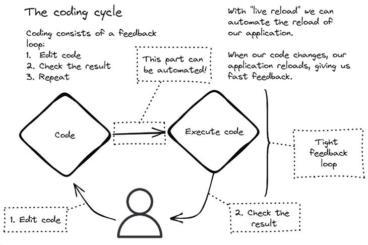
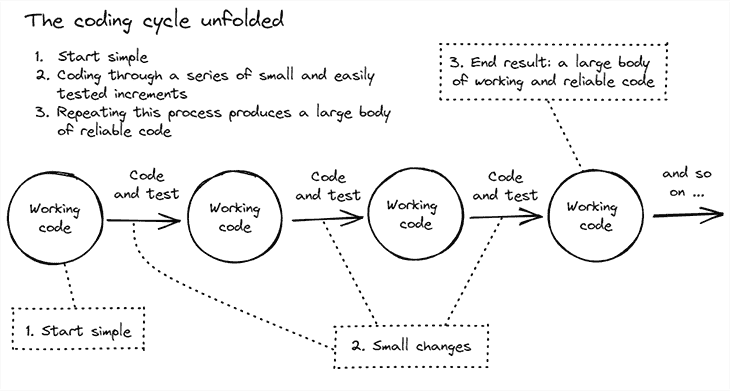
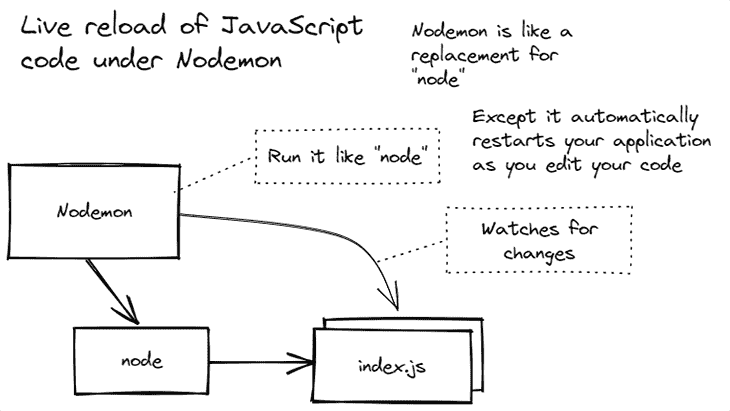
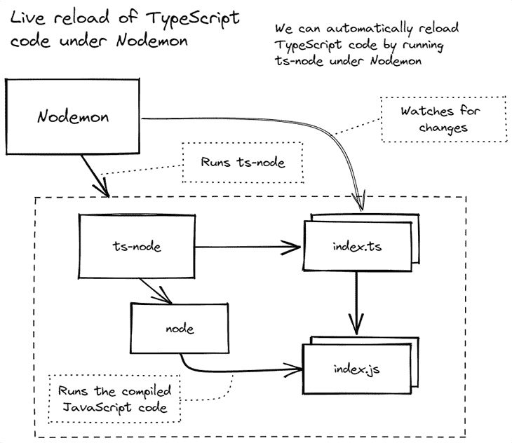
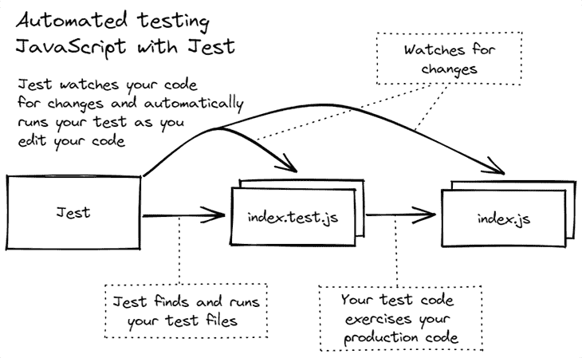
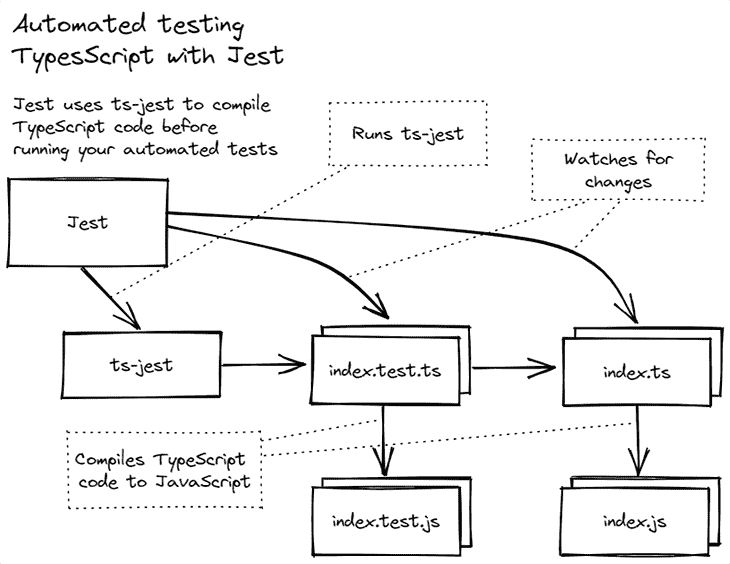
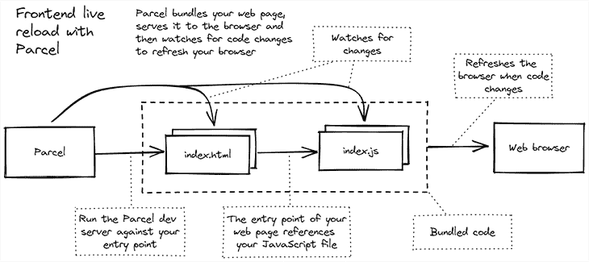
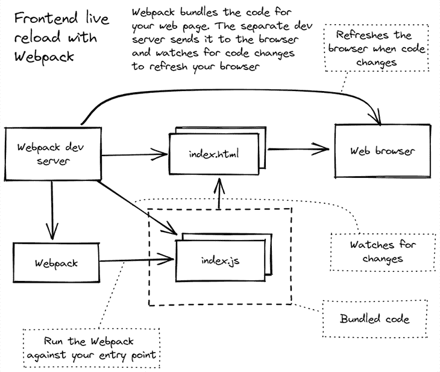
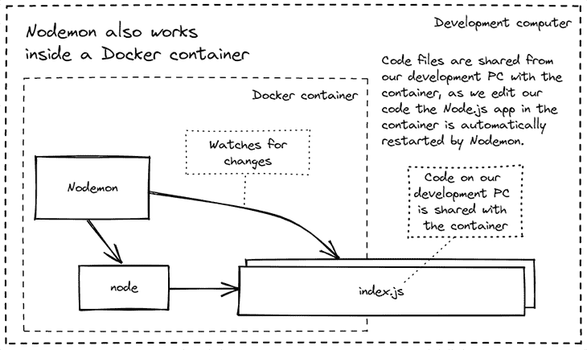

# 全栈实时重装完整指南

> 原文：<https://blog.logrocket.com/complete-guide-full-stack-live-reload/>

作为开发人员，快速编写代码并不是我们唯一关心的事情。快速获得反馈——也就是在你编码的时候——也是保持快速开发的一个基本部分。

我们生产的代码也应该是有价值和可靠的。但是你如何判断你的代码是否有价值呢？只有你(或你的公司)可以决定。你的代码可靠吗？嗯，这是你必须自己测试的东西——为此，你必须经常运行你的代码来检查它的输出和行为。

在开发过程中，我们可以通过让应用程序自动重新加载来创建一个更快、更无缝的工作流，我们称之为实时重新加载。

在这篇博文中，我们将研究各种用于实时重载的全栈技术，以自动化开发管道中的“运行”部分。明智地使用这些技术将有助于您成为更快的开发人员。

请不要觉得有必要阅读整篇博文，你只需要阅读你感兴趣的特定技术。为了简单起见，下面列出了我们将涉及的内容:

这篇文章中的主题随着你的阅读难度增加，我们也将在后端和前端体验之间来回切换。让我们开始吧。

## 什么是直播重装？

Live reload 是一种在开发过程中自动重启应用程序的方法。它使我们的应用程序能够在我们编码的同时自动获取代码变更。启用此功能可以为您节省无数手动和繁琐的重启。

开发人员在创建网页时使用 live reload 是非常典型的，但是我们也可以在整个堆栈中应用这种技术。

下面的图 1 显示了实时重载在我们的编码周期中的位置。请注意图表中“这部分可以自动化”的部分，这正是 live reload 适合的地方。



Figure 1: Where live reload lives in the coding cycle

## 设置实时重新加载

如果你以前没用过 live reload，我给你画个图吧。我打开了我的 IDE(我使用 VS 代码)，我正在为我的应用程序编辑代码。

我还打开了一个终端——比方说，它正在我的后端运行实时重载。(如果我在做前端，我会让它在网络浏览器中打开。)

当我编辑代码并保存文件时，应用程序(后端或前端)会自动重新加载以获取最新的代码更改——每个微小的代码更改都会触发一次重新加载。这种自动化提供了最快的反馈。

通常，作为一名全栈开发人员，我会将这一点发挥到极致。例如，我最近跑了:

*   一个运行微服务应用程序的终端(在 Docker Compose 下)
*   我关注的特定微服务的一个终端
*   我的开发服务器的一个终端
*   前端的浏览器窗口
*   另一个终端(或者两个！)运行自动化测试

只要我修改了代码，我就可以在我的多个终端和浏览器窗口中看到实时重载。

这听起来可能需要打开很多窗口(我主要使用三个屏幕的台式计算机)，但是能够编辑整个堆栈的代码并几乎立即看到结果，而不必手动重启或同步任何东西，这是非常有用的。

下面，图 2 显示了经过多次迭代的编码循环。这是一个正在进行的发展过程的鸟瞰图。

通过这个过程，我们将代码从一个工作状态带到另一个工作状态，积累工作代码并最小化 bug 的累积。我们对每个小的编码迭代所做的任何改进都会对我们的整个开发过程产生放大的影响。



Figure 2: The coding cycle expanded to include multiple iterations

## 扩展实时重新加载以提高性能

实时重新加载可以对我们的性能产生巨大的影响——不仅因为它自动化了枯燥乏味的手动重新加载，还因为它可以扩展。

首先，我们可以在组成我们的应用程序的许多过程中扩展它——然后，它会在我们开发过程的迭代中自动扩展，从而导致一个大的整体改进。Live reload 也有积极的副作用，它鼓励小的变化和频繁的测试，这有助于您生成更可靠的代码。

## 在生产和开发中使用实时重新加载

在我们进入实现细节之前，我想指出这里介绍的实时重载技术仅仅是为了在开发中使用。我们对生产的需求完全不同。

在生产中，我们想要安全、可靠和优化的 Docker 映像，其中代码被嵌入映像中并且不可改变。但是在开发中，我们更喜欢可理解的(例如，未优化的)、可调试的和代码可变的图像，以便我们可以在编辑代码时重新加载代码。

因此，生产与开发有着完全不同的关注点，我们希望区别对待。然而，在这篇博文中，我们将只讨论开发中的实时重载。

## 项目设置

现在我们知道了什么是实时重载，以及它为什么有用，让我们深入到实现中。

以下所有示例的工作代码都可以在[GitHub 库](https://github.com/ashleydavis/live-reload-examples)中找到。你可以使用`git clone`获得代码的副本，或者你可以简单地用[下载代码](https://github.com/ashleydavis/live-reload-examples/archive/refs/heads/main.zip)的 zip 文件。

请获取代码，以便您可以跟随并尝试每个示例。您需要安装 [Node.js](https://nodejs.org/) 来运行这些例子。你需要为最后两个例子安装 [Docker 桌面](https://www.docker.com/products/docker-desktop)。

## 用 Node.js 和 nodemon 实现实时重载

在这个[第一个例子](https://github.com/ashleydavis/live-reload-examples/tree/main/1-nodemon-example)中，我们将使用 nodemon 查看 Node.js 应用程序的实时重载。

[nodemon](https://www.npmjs.com/package/nodemon) 是一个运行在 Node.js 下的包；最好把它看作 Node 的替代物，这意味着我们不调用`node index.js`来启动我们的 Node 应用程序，而是调用`npx nodemon index.js`(其中`index.js`是 Node.js 应用程序相当常见的入口点)。这如图 3 所示。



Figure 3: Running JavaScript code with live reload using nodemon

如果你对 [`npx`命令](https://www.npmjs.com/package/npx)有疑问，它允许我们调用一个本地安装包。

nodemon 有点不同，因为它会观察我们的代码是否有变化。每当我们的代码发生变化时(即，当我们更改`index.js`或任何其他代码文件时), nodemon 会自动重启我们的 Node.js 应用程序，以便它获取我们更新的代码。

就是这样，就这么简单！

但是我们仍然有一些工作要做，因为我们不应该直接调用 nodemon。为了符合 Node.js 约定，我们至少应该在`[package.json configuration file](https://heynode.com/tutorial/what-packagejson/)`中实现`[start script](https://docs.npmjs.com/cli/v7/commands/npm-start)`。

你可以在下面的代码片段中看到，我们将`start`脚本设置为`node index.js`；我们在这里不使用 nodemon，因为使用`npm start`是在生产中启动 Node.js 应用程序的典型方式，我们不应该在生产中使用 nodemon 或 live reload。

```
{
    "main": "index.js",
    "scripts": {
        "start": "node index.js",
        "start:dev": "nodemon index.js"
    },
    "devDependencies": {
        "nodemon": "^2.0.15"
    }
}

```

相反，我添加了另一个名为`start:dev`的脚本，这是我们开发的开始命令。名字`start:dev`只是我个人的习惯，所以你可以随意给它重新命名——只是不要改变`start`脚本的名字，因为那是官方的习惯！

这个脚本使用 nodemon，所以它在开发模式下启动我们的应用程序，并启用实时重载。如果你想进一步了解 package.json 中的脚本条目，我建议你访问 npm 文档。

如果您还没有尝试过，那么您应该在这里亲自尝试一下代码。打开终端，进入代码库的目录[。](https://github.com/ashleydavis/live-reload-examples)

`cd`进入目录例 1:

```
cd 1-nodemon-example

```

安装依赖项；这将安装 nodemon:

```
npm install

```

首先，尝试在生产模式下运行 Node.js 应用程序:

```
npm start

```

您应该看到`Hello, world!` 被打印到您的终端上。

此时，我们已经在生产模式下成功运行了它——我们没有使用 nodemon 或 live reload，这不是我们在生产中想要的。您可以通过编辑`index.js`中的代码并保存文件来证明自己没有启用实时重新加载。什么都没发生。那就好！这是我们希望它在生产中发挥作用的方式。

按几次 Ctrl+C 来停止 Node.js 应用程序。

现在，让我们在开发模式下运行它，这样我们就可以尝试实时重新加载:

```
npm run start:dev

```

尝试更改并保存代码。进入`index.js`，把`console.log`的信息改成别的，比如，“你好电脑”(星际迷航的粉丝们，你们在听吗？).

保存文件并观察您的终端，以查看 nodemon 重新启动您的应用程序。你想玩多久就玩多久。请随意在代码中引入一些错误，看看会发生什么！

### 配置 nodemon

在[第二个例子](https://github.com/ashleydavis/live-reload-examples/tree/main/2-nodemon-example-with-config)中，我们来学习如何配置 nodemon。下面的代码片段显示了一个简单的`nodemon.json`配置文件。

```
{
    "watch": [
        "src/"
    ],
    "ignore": [
        "src/test/"
    ],
    "exec": "node src/index.js"
}

```

这里有几点需要注意。

首先，我们已经告诉 nodemon 观察`src`子目录的变化。这个例子将`index.js`移动到`src`子目录，这是将我们的代码文件从项目中的其他文件中分离出来的一种便捷方式，例如，我们可以更有选择性地选择 nodemon 正在监视的文件。

我们还将 nodemon 配置为忽略`src/test`下的所有文件。这通常是我们在这个项目中保存自动化测试的地方，但是这个项目实际上还没有任何自动化测试。我想展示如何让 nodemon 忽略它们，因为我们将使用不同的实时重新加载系统进行自动化测试(我们将在第四个的[示例中回到这个问题)。](#automated-javascript-testing-jest-watch-mode)

配置文件中最后需要注意的是`exec`字段如何配置 nodemon 来调用`node src/index.js`。这意味着我们可以简单地调用没有参数的`npx nodemon`,它通过查看它的配置文件知道运行什么命令。

在这一点上，您可能还会意识到，我们可以用任何其他命令来替换`exec`字段。这使得 nodemon 非常灵活。我们可以使用它来查看任何类型的文件和运行任何类型的命令(我可能不是第一个使用 nodemon 创建由更新的数据触发的实时重载数据处理管道的人)。

现在是时候亲自尝试一下了。这和运行上面的例子是一样的(别忘了`npm install`)。调用`npm run start:dev`。您可能希望确认对`src/test/test.js`的更改被 nodemon 忽略，并且不会触发应用程序的重启。

在 npm 网页和[上了解更多关于 nodemon 配置的信息](https://github.com/remy/nodemon/blob/master/doc/sample-nodemon.md)[在这里找到一个配置示例](https://www.npmjs.com/package/nodemon)。

## 使用 nodemon 和 TypeScript 实时重新加载

因为我是一个粉丝，所以我不得不在这篇博文中加入一个带有 TypeScript 的例子。

使用 TypeScript 和 nodemon 可能会非常困难。您可能会想到，在重启应用程序之前，我们必须将类型脚本代码编译成 JavaScript。虽然这是可能的，但有点复杂，因为它可能需要并行运行多个命令。

幸运的是，我们有 [ts 节点](https://www.npmjs.com/package/ts-node)。ts-node 是 Node.js 的另一个降代，我们可以使用`npx ts-node src/index.ts`直接运行 TypeScript 代码，而不必先编译代码。这使得在开发过程中使用 TypeScript 变得容易得多，尽管在生产中您并不想使用它。

它还使学习 TypeScript 变得更容易，并且在构建快速原型或试验 TypeScript 时会少很多麻烦。

为了支持 TypeScript 代码的实时重载，我们可以结合使用 ts-node 和 nodemon，如图 4 所示。



Figure 4: Live reload of TypeScript code with ts-node and nodemon

带有 ts-node 的 nodemon 的配置变得有点复杂。下面例子中的`start`和`start:dev`脚本，是从 TypeScript 项目的 [`package.json`文件](https://github.com/ashleydavis/live-reload-examples/blob/main/3-nodemon-example-with-typescript/package.json)中提取的，与我们之前看到的非常相似。

```
{
    "main": "build/index.js",
    "scripts": {
        "start": "node ./build/index.js",
        "start:dev": "nodemon",
        "build": "tsc --incremental",
        "clean": "rm -rf ./build && rm tsconfig.tsbuildinfo"
    },
    "devDependencies": {
        "@types/node": "^17.0.10",
        "nodemon": "^2.0.15",
        "ts-node": "^10.4.0",
        "typescript": "^4.5.5"
    }
}

```

不过，现在我们也有了新的脚本:`build`和`clean`。调用`npm run build`来构建用于生产的类型脚本代码。构建完成后，我们可以调用`npm start`来执行编译好的 JavaScript 代码。

我们也可以调用`npm run clean`来删除编译好的代码。这类似于我的完整生产 TypeScript 项目设置，你可以在[我的 typescript-template repo](https://github.com/ashleydavis/typescript-template) 中看到完整设置。

第三个例子的 [nodemon 配置](https://github.com/ashleydavis/live-reload-examples/blob/main/3-nodemon-example-with-typescript/nodemon.json)如下所示。与之前的版本相比，这里有一些变化:

*   我们已经将 nodemon 配置为只监视扩展名为`ts`的文件的更改
*   在`exec`字段中，注意我们使用 ts-node 直接运行我们的类型脚本代码(`index.ts`)

```
{
    "watch": [
        "src"
    ],
    "ext": "ts",
    "ignore": [
        "src/test/"
    ],
    "exec": "npx ts-node ./src/index.ts"
}

```

又轮到你了。像以前一样运行这个例子，但是不要忘记`npm install`命令。在观察 nodemon 重启应用程序之前，调用`npm run start:dev`并尝试保存对`index.ts`的更改。

## 在观察模式下用 Jest 进行自动化 JavaScript 测试

对于我们的第四个例子，让我们从 TypeScript 返回到 JavaScript 进行一些[自动化测试](https://github.com/ashleydavis/live-reload-examples/tree/main/4-automated-testing-example)，这可能是这个小冒险中最激动人心的部分！

我们还可以在编辑代码的时候使用 live reload 来自动重启我们的自动化测试。我使用 [Jest](https://www.npmjs.com/package/jest) 来演示这一点，但是其他测试框架通常支持实时重载。下面的图 5 展示了 Jest 如何观察我们的代码变化，然后自动重新运行我们的自动化测试。



Figure 5: Automated testing in JavaScript with Jest

Jest 的好处是几乎没有配置。对于这个例子，我使用`npx jest --init`生成了一个[配置](https://github.com/ashleydavis/live-reload-examples/blob/main/4-automated-testing-example/jest.config.js)，并回答了几个问题。含直播重装；我们只需使用`--watch`参数在“观察模式”下运行 Jest:

```
npx jest --watch

```

注意，默认情况下，Jest 只运行在 Git 中更改过的代码，所以您可能需要按下`a`键来强制它运行所有测试。

当然，我们不能就此打住，因为我们希望遵循 Node.js 的约定并拥有一个`test`脚本，如下面从我们的 package.json 中提取的代码[所示。我们可以使用传统的 Node.js 命令](https://github.com/ashleydavis/live-reload-examples/blob/main/4-automated-testing-example/package.json)`[npm test](https://docs.npmjs.com/cli/v7/commands/npm-test)`来运行我们的测试。

下面的例子也有脚本`test:watch`。这是我个人使用 live reload 运行自动化测试的惯例，但是您可以随意将这个脚本重命名为您喜欢的名称。

```
{
    "scripts": {
        "test": "jest",
        "test:watch": "jest --watch"
    },
    "devDependencies": {
        "jest": "^27.4.7"
    }
}

```

现在，是你尝试一下的时候了。以通常的方式运行这个例子，不要忘记`npm install`。调用`npm start`或`npm run start:dev`。不过这一次，您可能想要尝试运行自动化测试！

只运行一次测试:

```
npm test

```

要在启用实时重新加载的情况下运行测试:

```
npm run test:watch

```

同样，您会希望注意到 Jest 默认情况下只运行 Git 中已更改的代码，因此您可能需要按下`a`键来强制它运行所有测试。

尝试编辑代码(`index.js`)或测试(`index.test.js`)。更改并保存这两个文件中的任何一个都将触发自动化测试的重启。

编码并从自动化测试中获得几乎即时的反馈是开发代码的最佳方式之一。

从他们的[入门指南](https://jestjs.io/docs/getting-started)中了解更多关于 Jest 的信息。

## 在观察模式下使用 Jest 对 TypeScript 应用程序进行自动化测试

我的打字稿偏好再次发挥作用，所以对于我们的第五个例子[，让我们来看看用打字稿代码进行自动化测试！](https://github.com/ashleydavis/live-reload-examples/tree/main/5-automated-testing-with-typescript)

以前，我们使用 ts-node 在开发期间直接运行我们的 TypeScript 代码。现在，对于自动化测试，我们将使用`[ts-jest](https://www.npmjs.com/package/ts-jest)`。这是 Jest 的一个插件，可以直接从 TypeScript 代码中运行自动化测试。这非常方便，因为否则我们需要一个更复杂的构建管道来在运行之前将我们的 TypeScript 测试编译成 JavaScript。图 6 展示了 Jest 如何在运行测试之前使用 ts-jest 将我们的 TypeScript 代码自动编译成 JavaScript。



Figure 6: Automated testing in TypeScript using Jest

除了安装 ts-jest，我们不用做太多，除了配置 jest 使用 ts-jest，如下图:

```
export default {

    modulePathIgnorePatterns: [
        "<rootDir>/build"
    ],

    preset: "ts-jest",
};

```

注意，在上面的代码中，`modulePathIgnorePatterns`字段被设置为忽略`build`子目录下的所有文件。编译后的 JavaScript 文件就是在那里生成的。我们必须忽略这个目录——否则，在我们构建我们的项目(使用`npm run build`)之后，Jest 会认为有两组自动化测试(类型脚本代码和编译的 JavaScript 代码)。

Jest 并不关心，它只是运行两组测试，但这可能会让我们非常困惑，因为我们只希望它运行 TypeScript 代码中的测试。

您可以按照与上一个示例相同的方式运行这段代码(不要忘记`npm install`)。要么调用`npm test`运行测试一次，要么调用`npm run test:watch`进行实时重新加载。尝试更改并保存类型脚本代码(`index.ts`或`index.test.ts`)，然后观察 Jest 自动重启测试。

参见 [Jest 配置文档](https://jestjs.io/docs/configuration)了解 Jest 配置的更多信息。ts-jest 也有[好文档](https://kulshekhar.github.io/ts-jest/)。

## 用包裹在前端实时重新加载

有了[这个例子](https://github.com/ashleydavis/live-reload-examples/tree/main/6-frontend-with-parcel)，我们终于到了前端！[包裹](https://parceljs.org/)是一个易于使用的前端捆扎机。它将收集源资源(例如 HTML、CSS 和 JavaScript ),并将它们编译成一个静态网页，该网页可以由简单的 web 服务器提供并在任何浏览器中显示。

我从 package 而不是 webpack 开始，原因如下:

*   包裹更容易使用
*   对于许多用例，它不需要任何配置
*   它自动支持实时重装！

我们将使用 package 的内置开发服务器来构建我们的包，将其作为一个网页，然后在我们编辑代码时自动重新加载。这如图 7 所示。



Figure 7: Frontend live reload with Parcel

我们可以通过调用 Parcel 并将其指向我们网页的入口点来启动 Parcel 的开发服务器:

```
npx parcel src/index.html

```

并构建一个用于生产的静态网页:

```
npx parcel build src/index.html

```

如果您尝试在 Windows 计算机上运行此程序，请确保将所有正斜杠替换为反斜杠，如下所示:

```
npx parcel src\index.html

```

在下面这个例子的[代码中，你会看到`start`和`build`的常用命令。你可能会觉得奇怪，这次没有`start:dev`的剧本！](https://github.com/ashleydavis/live-reload-examples/blob/main/6-frontend-with-parcel/package.json)

相反，我们只让`start`脚本运行 Parcel 的开发服务器，并进行实时重新加载。这里我们只需要一个启动脚本，因为生产根本不需要任何脚本。我们通过构建它并将文件复制到我们的 web 服务器来在生产中运行它。

```
{
    "scripts": {
        "start": "parcel src/index.html",
        "build": "parcel build src/index.html",
        "clean": "rm -rf dist"
    },
    "devDependencies": {
        "live-server": "^1.2.1",
        "parcel": "^2.2.1"
    }
}

```

您可以通过调用`npm start`来尝试一下(但是只能在`npm install`之后)。现在，打开浏览器查看网页。您应该会在终端中看到一个链接，您可以点击它来打开网页，类似于`[http://localhost:1234](http://localhost:1234)`。

查看网页时，尝试更改`index.html`或`index.js`中的代码。当您存储更改时，您会看到网页自动刷新。

### 什么是`live-server`？

您可能已经注意到了上面代码中的开发依赖关系`live-server`。 [Live Server](https://www.npmjs.com/package/live-server) 是一个很棒的小型开发服务器，我们可以用它来测试我们网页的生产版本。你可能想试试这个，因为这是另一个很酷的实时重新加载的例子。

首先，通过调用`npm run build`构建网页。这将在`dist`子目录下创建静态网页。现在，将您的目录更改为`dist`，并从那里运行 Live Server:

```
cd dist
npx live-server

```

这应该会自动打开一个浏览器窗口并加载您的网页。这很有趣，因为 Live Server(从名字就可以看出)包含了 live reload。如果`dist`中的文件发生变化(无论您是重新构建网页还是仅仅修改文件)，那么 Live Server 会重新加载浏览器以显示更新后的网页。

我们可以做一些有趣的事情，比如创建一个实时重新加载管道，我们可以根据更改重建生产网页，然后使用 Live Server 刷新网页。

package build 命令不像 Jest 那样支持监视模式，但是我建议查看 [chokidar 包](https://www.npmjs.com/package/chokidar)以获得一些帮助来构建您自己的实时重载管道。

你可以通过他们的官方指南了解更多关于包裹和[开始](https://en.parceljs.org/getting_started.html)的信息，这也是他们用包裹的打字稿为[写的。](https://en.parceljs.org/typeScript.html)

## 使用 webpack 在前端实时重新加载

你不认为我们会完全跳过 webpack 吗？[例 7](https://github.com/ashleydavis/live-reload-examples/tree/main/7-frontend-with-webpack) 适合你。

webpack 是另一个网页捆绑软件。通常，我们使用它来捆绑 JavaScript 或 TypeScript 代码，将其包含在一个静态网页中。

我不得不包括 [webpack](https://blog.logrocket.com/tag/webpack) ，因为它非常常见，但是我把它保存到 Parcel 之后，因为不幸的是，webpack 比 Parcel 更难设置。事实上，这已经足够困难了，我在这里只给出一个有限的例子，但是在许多项目中使用它仍然是足够好的。

与 package 不同，webpack 不包括开发服务器，所以这是您必须单独安装的东西。图 8 显示了 [webpack 的开发服务器](https://www.npmjs.com/package/webpack-dev-server)如何监视我们代码的变化，然后触发 [webpack CLI](https://www.npmjs.com/package/webpack-cli) 来构建我们的包。然后，它会自动刷新浏览器以显示更新的网页。



Figure 8: Frontend live reload with webpack

webpack 开发服务器使用一个`serve`命令扩展 webpack CLI。运行它可能很简单:

```
npx webpack serve --open

```

`--open`参数自动打开网页浏览器查看网页。

为了构建一个用于生产的静态网页，我们只需单独运行`webpack`命令:

```
npx webpack

```

代码下面的[显示了我们的`start`和`build`脚本，它们被配置为在我们的`package.json`中运行 webpack。](https://github.com/ashleydavis/live-reload-examples/blob/main/7-frontend-with-webpack/package.json)

```
{
    "scripts": {
        "build": "webpack",
        "clean": "rm -rf ./dist",
        "start": "webpack serve --open"
    },
    "devDependencies": {
        "html-webpack-plugin": "^5.5.0",
        "live-server": "^1.2.1",
        "webpack": "^5.67.0",
        "webpack-cli": "^4.9.2",
        "webpack-dev-server": "^4.7.3"
    }
}

```

使 webpack 比 Parcel 更困难的是我们需要一个配置文件，即使是最小的项目。幸运的是，对于这个小项目来说，显示在下面的[配置文件仍然很简单——但是相信我，它们可以变得比这更复杂！](https://github.com/ashleydavis/live-reload-examples/blob/main/7-frontend-with-webpack/webpack.config.js)

```
const path = require('path');
const HtmlWebpackPlugin = require('html-webpack-plugin');

module.exports = {
    entry: './src/index.js',
    output: {
        filename: 'index.js',
        path: path.resolve(__dirname, 'dist'),
    },
    devtool: "source-map",
    mode: "development",
    devServer: {
        static: './dist',
        hot: false,
    },
    plugins: [
        new HtmlWebpackPlugin({
            template: "src/index.html"
        }),
    ],
};

```

在上面的代码中需要指出的最重要的事情是配置我们的开发服务器的`devServer`字段。从这里，您可以告诉开发服务器静态文件是从哪里提供的。

另外，请注意[热区](https://webpack.js.org/configuration/dev-server/#devserverhot)被设置为`false`。如果您将此设置为`true`，[实时重装不起作用](https://webpack.js.org/configuration/dev-server/#devserverlivereload)！

我们必须关闭`hot`来启用实时重载，这看起来可能有点奇怪。但是这里令人困惑的是，实时重装和[热模块替换(HMR)](https://webpack.js.org/concepts/hot-module-replacement/) 是两件不同的事情。默认情况下，在开发服务器中启用实时重新加载，但只有在禁用 HMR 的情况下。

### 直播重装和 HMR 有什么区别？

直播重装和 HMR 的主要区别是 HMR 更有效率。当发生任何变化时，实时重新加载会刷新浏览器中的整个网页。

另一方面，HMR 只会重新加载那些已经改变的代码模块。HMR 更快，因为它不需要刷新整个页面。

有些人会说 HMR 比实弹更好，这在某些情况下是正确的。然而，对于许多项目来说，实时重载已经足够好了——你不必经历正确配置 HMR 的困难。

[webpack 文档](https://webpack.js.org/concepts/)和[入门](https://webpack.js.org/guides/getting-started/)指南是很好的资源——如果你想深入了解的话，还有[他们关于热模块更换的文档](https://webpack.js.org/concepts/hot-module-replacement/)。

## Docker 容器中 JavaScript 代码的实时重新加载

在前端花了一些时间之后，让我们回到后端来看第八个例子！

您可能会惊讶地发现，我们可以利用 Docker 容器中的实时重载。这意味着我们可以将实时重装扩展到更大的微服务应用。

同样，实时重载是我们只希望在开发中使用的东西。让 live reload 在我们的开发计算机上运行微服务应用程序(使用 [Docker Compose](https://docs.docker.com/compose/) )非常有用，因为这样我们就可以编辑任何微服务的代码，并让它在 [Docker 容器](https://en.wikipedia.org/wiki/Docker_(software))中自动重启。这是使用微服务的有效方式，因为当您编辑微服务的代码时，只有该微服务会重新启动，而其他微服务不受影响。

要运行这个例子，你需要安装 [Docker Desktop](https://www.docker.com/products/docker-desktop) 。在 MacOS 上安装和使用很容易(只需下载、运行并按照提示操作)，但是在 Windows 上安装[有点困难。](https://docs.docker.com/desktop/windows/install/)

好消息是，我们已经了解了实现这一目标所需的大多数其他工具。我们将再次使用 nodemon 来重启 Node.js 应用程序，但这次我们是在 Docker 容器中运行它。正如您在图 9 中看到的，这个难题的很大一部分是我们如何从开发计算机到容器共享源代码。



Figure 9: Live reload with nodemon inside a Docker container

下面的代码显示了这个例子的[docker 文件。Dockerfile 就像一个构建 Docker 镜像的脚本，Docker 镜像就像一个快照、服务器或微服务，我们可以从中实例化一个容器。](https://github.com/ashleydavis/live-reload-examples/blob/main/8-docker-example/microservice/Dockerfile-dev)

在这个特定的 docker 文件中，我们使用`npm run start:dev`启动 Node.js 应用程序。如果你还记得我们的第一个例子的话，这会用 nodemon 启动我们的应用程序，并支持实时重载。

```
FROM node:16.13.1

WORKDIR /app
COPY package*.json ./
COPY nodemon.json ./

CMD npm config set cache-min 9999999 \
    && npm install \
    && npm run start:dev

```

这段代码的复杂性是有原因的。您可能对命令`npm config set cache-min 9999999` 和`npm install`感到疑惑。

`npm install`在启动时为我们的应用安装依赖项。对于生产 Docker 映像(把我们的例子想象成开发 Docker 映像)，通常不会以这种方式安装包；但是，在开发过程中，我们在启动时安装依赖项有两个原因。

第一个原因是，在构建映像时安装依赖项(就像我们应该为生产映像所做的那样)可能会非常慢。在启动时这样做要快得多——主要是因为我们可以控制如何缓存依赖关系。

第二个原因是，在开发过程中，我们不断地更改代码和安装新的依赖项。我们希望能够通过重启容器来安装新的依赖项，而不必重新构建映像。这使得在开发过程中，随着代码的发展，添加新的依赖项变得更快。

另一个命令`npm config set cache-min 9999999`将缓存超时设置为一个大得离谱的值。这使得重启容器的速度更快，并强制缓存依赖关系，稍后我们将进一步解释这一点。

剩下的主要问题是，我们如何将更新的代码从我们的开发计算机放到容器中？为此，我们需要配置一个 Docker 卷，将我们的代码共享到运行容器中。

### 配置 Docker 音量

我发现最简单的方法是使用 Docker Compose，这使得配置卷变得更简单——更不用说您可能正在使用 Docker Compose 运行多个微服务。

下面的代码显示了本例中的 [Docker 合成文件](https://github.com/ashleydavis/live-reload-examples/blob/main/8-docker-example/docker-compose.yml)，配置为运行单个微服务。

```
version: '3'
services:

  microservice:
    image: microservice
    build: 
      context: ./microservice
      dockerfile: Dockerfile-dev
    container_name: microservice
    volumes:
     - ./tmp/npm:/root/.npm:z
     - ./microservice/src:/app/src:z
    ports:
     - "4000:80"
    environment:
     - PORT=80
     - NODE_ENV=development
    restart: always

```

关于上面的代码，需要注意的一件重要事情是`volumes`部分中的项目列表。

第一项— `./tmp/npm:/root/.npm:z` —在开发计算机和容器之间共享 npm 缓存。容器的连续重启受益于共享缓存，这使得重启容器更快。

第二项是真正将我们的源代码从开发计算机共享到容器中的内容。当我们编辑代码时，更改会自动共享到容器中，并由 nodemon 获取，这将重新启动 Node.js 应用程序。

您可以像这样自己运行这个示例:

```
cd 8-docker-example
docker compose up ---build

```

`--build`参数强制构建 Docker 映像。

现在，尝试更改代码并保存文件。您应该看到 nodemon 检测到了更改，并重新启动了在容器内部运行的 Node.js 应用程序。

下次启动应用程序时，可以省略–`-build`参数:

```
docker compose up

```

这使得启动更快，因为它不建立图像。

另一件要注意的事情是，您必须手动重启整个系统(使用`docker compose up`)来安装新的依赖项。nodemon 将检测代码变化(包括添加到`package.json`的新依赖项)，但是我们没有配置它来安装更新的依赖项。因此，每当您添加新的依赖项时，完全的手动重启是必要的。

当然，您可以改变这一点，但是我将把它作为一个练习留给您自己去尝试。

## Docker 容器中类型脚本代码的实时重新加载

我们在这里，在我们的[最后一个例子](https://github.com/ashleydavis/live-reload-examples/tree/main/9-docker-example-typescript)！这里，我们将演示如何在 Docker 容器中自动重新加载 TypeScript 代码。

然而这一次，没有任何东西可以展示！你已经从[例三](#live-reload-nodemon-typescript)中知道了 nodemon 和 TypeScript，Docker 配置与[例八](#live-reload-javascript-code-docker-container)相同。

剩下的唯一一件事就是尝试运行它，并对代码进行一些更改:

```
cd 9-docker-example-typescript
docker compose up ---build

```

这个例子展示了如何在 Docker 容器中为 TypeScript 代码使用 live reload，但是和这篇博文一样，它只用于开发。TypeScript 的有效生产使用需要更复杂的构建管道，这一点你可以在我之前的文章[用 Docker](https://blog.logrocket.com/crafting-build-pipelines-with-docker/) 制作构建管道中读到。

## 结论

这篇博客文章展示了如何在您的栈中使用 live reload 来帮助构建一个简化的、快节奏的开发过程。

我们使用 nodemon 为 Node.js 应用程序启用了实时重载。我们在观察模式下使用 Jest 来启用 JavaScript 和 TypeScript 自动化测试的实时重载。我们看到 Parcel 附带了一个包含 live reload 的开发服务器，并将 webpack 配置为对其开发服务器使用 live reload。最后，我们在 Docker 容器中启用了实时重载，这意味着我们可以将实时重载扩展到更大的微服务应用程序。

考虑到所有的好处，显而易见为什么 live reload 是我的哲学基础的一部分，也是我的书《快速全栈开发》的核心技术之一。实时重载是加快开发过程的一个关键因素。

如果你对更多类似的内容感兴趣，请在 Twitter 上关注我。

## [LogRocket](https://lp.logrocket.com/blg/typescript-signup) :全面了解您的网络和移动应用

[](https://lp.logrocket.com/blg/typescript-signup)

LogRocket 是一个前端应用程序监控解决方案，可以让您回放问题，就像问题发生在您自己的浏览器中一样。LogRocket 不需要猜测错误发生的原因，也不需要向用户询问截图和日志转储，而是让您重放会话以快速了解哪里出错了。它可以与任何应用程序完美配合，不管是什么框架，并且有插件可以记录来自 Redux、Vuex 和@ngrx/store 的额外上下文。

除了记录 Redux 操作和状态，LogRocket 还记录控制台日志、JavaScript 错误、堆栈跟踪、带有头+正文的网络请求/响应、浏览器元数据和自定义日志。它还使用 DOM 来记录页面上的 HTML 和 CSS，甚至为最复杂的单页面和移动应用程序重新创建像素级完美视频。

[Try it for free](https://lp.logrocket.com/blg/typescript-signup)

.