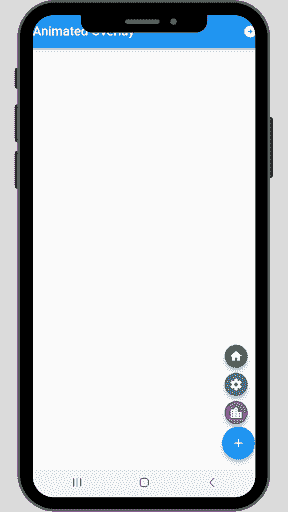
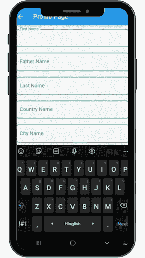

# 在 Flutter 中实现覆盖

> 原文：<https://blog.logrocket.com/complete-guide-implementing-overlays-flutter/>

让我们假设您的应用程序 UI 中有一个小部件，您想在它上面放置另一个浮动小部件。也许这个小部件需要旋转或者进行额外的转换。如何在应用程序中显示小部件并将其信息转换成等效的 UI？

Flutter 中的覆盖层使得在其他小部件上创建可视元素变得容易，只需将它们添加到覆盖层的堆栈中即可。OverlayEntry 用于将一个小部件插入到覆盖图中，然后 Positioned 或 AnimatedPositioned 用于确定它将进入覆盖图中的哪个位置。当您需要一个项目出现在另一个小部件(类似于 Stack 小部件)的顶部，而不需要修改整个代码库时，这很有用。

在 Flutter 中使用覆盖小部件可能看起来有点直观，但有时会很有挑战性。首先，使用回调方法插入覆盖条目。如果你还记得使用引用而不是覆盖的上下文来移除`Entry`，那将是最好的。

我们将看到三个不同的例子，在这些例子中，我们可以使用一个覆盖小部件来使应用程序的 UI 更加用户友好。

## 示例 1:在注册屏幕上显示错误消息

这是一个简单的注册屏幕，你通常会在任何现代应用程序中看到。它包含四个文本表单域，分别表示全名、电子邮件地址、密码和确认密码。

因为它是一个 TextFormField，所以我们为每一个都提供了验证器。全名必须超过两个字符，必须是正确的电子邮件地址，密码应该超过六个字符，并且确认的密码应该与密码字段匹配。

当用户点击**提交**按钮时，它会验证上述所有字段，如果有错误，后缀图标的颜色会变成红色，提醒用户 TextFormField 不符合相关要求。当用户点击红色图标时，一个覆盖小部件会显示大约三秒钟，然后消失。

从视觉上看，覆盖图可能会被误认为是 AlertDialog 或 Snackbar。覆盖小部件的显示方式类似，但是它为开发人员提供了更大的定制能力，可以根据应用程序的 UI 需求对其进行编程。

让我们深入代码，看看当错误发生并且用户点击它时，一个覆盖小部件将如何显示。

我们需要创建一个[有状态小部件](https://blog.logrocket.com/difference-between-stateless-stateful-widgets-flutter/)，因为我们将运行一些动画和覆盖小部件。

我们为姓名、电子邮件、密码和确认密码添加了四个`TextEditingController`:

```
TextEditingController nameController = TextEditingController();

TextEditingController emailController = TextEditingController();

TextEditingController passwordController = TextEditingController();

TextEditingController confirmPassController = TextEditingController();
```

同样，四个`Color`变量用于在红色和灰色之间切换的名称、电子邮件、密码和确认密码:

```
 Color? nameColor, emailColor, passColor, confirmPassColor;
```

接下来，我们有一个`AnimationController`和一个`Animation`对象:

```
AnimationController? animationController;
Animation<double>? animation;
```

我们正在覆盖`initState`并初始化`AnimationController`和我们刚刚创建的`Animation`对象:

```
@override
 void initState() {
   super.initState();
   animationController =
       AnimationController(vsync: this, duration: const Duration(seconds: 1));
   animation =
       CurveTween(curve: Curves.fastOutSlowIn).animate(animationController!);
 }
```

我们需要创建的主要功能将显示覆盖小部件。因此，我们正在创建`_showOverlay`函数，当发生错误时，当用户单击文本字段内的后缀图标时，我们将调用该函数。在`_showOverlay`函数中，我们声明并初始化了`OverlayState`和`OverlayEntry`对象。

### 什么是`OverlayState`？

`OverlayState`是覆盖的当前状态，使用`OverlayEntry`、`Entries`使用插入，或`insertAll`功能插入。

#### `OverlayState`构造器

1.  `debugIsVisible`:返回一个布尔值，检查给定的`OverlayEntry`是否可见
2.  `insert`:在覆盖图内插入给定的`OverlayEntry`
3.  `insertAll`:获取一个`OverlayEntries`列表，并将它们全部插入覆盖图中
4.  `rearrange`:根据`OverlayEntries`列表中给定的顺序删除并重新插入所有条目

### 什么是`OverlayEntry`？

覆盖条目是包含小部件的覆盖中的一个位置。在定位或动画定位小部件的帮助下，`Entry`使用`Stack`布局在覆盖图中定位自己。

#### `OverlayEntry`构造器

1.  `builder`:接受一个构建器小部件
2.  `opaque`:返回一个布尔值，决定`Entry`是否遮挡整个覆盖图
3.  `maintainState`:取一个布尔值。如果是`true`，它会在不透明的`Entry`下面强行构建一个被遮挡的`Entry`

下面是`_showOverlay`函数的代码:

```
void _showOverlay(BuildContext context, {required String text}) async {
   OverlayState? overlayState = Overlay.of(context);
   OverlayEntry overlayEntry;
   overlayEntry = OverlayEntry(builder: (context) {
     return Positioned(
       left: MediaQuery.of(context).size.width * 0.1,
       top: MediaQuery.of(context).size.height * 0.80,
       child: ClipRRect(
         borderRadius: BorderRadius.circular(10),
         child: Material(
           child: FadeTransition(
             opacity: animation!,
             child: Container(
               alignment: Alignment.center,
               color: Colors.grey.shade200,
               padding:
                   EdgeInsets.all(MediaQuery.of(context).size.height * 0.02),
               width: MediaQuery.of(context).size.width * 0.8,
               height: MediaQuery.of(context).size.height * 0.06,
               child: Text(
                 text,
                 style: const TextStyle(color: Colors.black),
               ),
             ),
           ),
         ),
       ),
     );
   });
   animationController!.addListener(() {
     overlayState!.setState(() {});
   });
   // inserting overlay entry
   overlayState!.insert(overlayEntry);
   animationController!.forward();
   await Future.delayed(const Duration(seconds: 3))
       .whenComplete(() => animationController!.reverse())
       // removing overlay entry after stipulated time.
       .whenComplete(() => overlayEntry.remove());
 }
```

在初始化`overlayEntry`之后，我们在`builder`方法中返回一个`Positioned`小部件，以在屏幕上定位`Overlay`小部件。根据应用程序的设计，它可以被放置和显示在手机屏幕上的任何地方。

接下来，我们在`TextFormField`内部添加了一个后缀图标按钮，并在其中调用了`_showOverlay`函数。

`TextFormField`的`validator`属性具有基于后缀图标如何从灰色变为红色的条件，反之亦然，如果有错误:

```
TextFormField(
                 controller: nameController,
                 keyboardType: TextInputType.name,
                 textInputAction: TextInputAction.next,
                 textCapitalization: TextCapitalization.words,
                 validator: (String? value) {
                   if (value == null || value.trim().isEmpty) {
                     nameColor = Colors.red;
                   }
                   if (value.toString().length <= 2) {
                     nameColor = Colors.red;
                   } else {
                     nameColor = Colors.grey;
                   }
                   return null;
                 },
                 onSaved: (String? value) {
                   _name = value;
                 },
                 decoration: kTextInputDecoration.copyWith(
                     labelText: 'Full Name',
                     prefixIcon: const Icon(Icons.person),
                     suffixIcon: IconButton(
                         padding: EdgeInsets.zero,
                         onPressed: () {
                           _showOverlay(context,
                               text:
                                   'Name should have more than 2 characters');
                         },
                         icon: Icon(Icons.info, color: nameColor
                             //change icon color according to form validation
                             ))),
               ),
```

最后，我们创建了一个`submitForm`方法来验证`TextFormField`并保存表单，我们将在`Submit`按钮的`onPressed`函数中调用它:

```
void _submitForm() {
   setState(() {
     _autoValidateMode = AutovalidateMode.always;
   });
   final form = _formKey.currentState;
   if (form == null || !form.validate()) return;

   form.save();

   Fluttertoast.showToast(msg: _name.toString() + _email.toString());
 }
```

调用`ElevatedButton`的`onPressed`内部的`_submitForm`方法，我们得到:

```
ElevatedButton(
                   onPressed: () {
                     _submitForm();
                   },
                   style: ElevatedButton.styleFrom(
                       padding: const EdgeInsets.all(10)),
                   child: const Text(
                     'Submit',
                     style: TextStyle(fontSize: 20),
                   )),
```

完整的代码可以在 [GitHub 库](https://github.com/timelessfusionapps/flutter_Overlay_SignupScreen)上找到。

## 示例 2:一个显示其他三个按钮的浮动操作按钮

首先，创建我们将在本例中使用的所有必需的对象和变量。首先，我们有一个`AnimationController`和一个空的`List`用于动画。然后，我们有一个包含三个图标的图标列表和一个包含与图标相关联的三种不同颜色的颜色列表:

```
 AnimationController? animationController;
 List animation = [];
 List icons = [Icons.home, Icons.settings, Icons.location_city];
 List colors = [Colors.green, Colors.blueGrey, Colors.purple];
 OverlayEntry? overlayEntry;
 GlobalKey globalKey = GlobalKey();
```

接下来，我们有了一个`OverlayEntry`对象，我们还初始化了将附加到`FloatingActionButton`的 key 属性的`GlobalKey`变量。

上面的函数和这里的`_showOverlay`函数的主要区别是`RenderBox`和`Offset`小部件。`RenderBox`和`Offset`小部件和`Positioned`小部件将三个小图标放置在主`[FloatingActionButton](https://blog.logrocket.com/flutter-floatingactionbutton-a-complete-tutorial-with-examples/)`上方。当用户点击主`FloatingActionButton`时，三个小图标向上打开，并在动画中提到的规定时间后以向下的趋势关闭:

```
_showOverLay() async {
   RenderBox? renderBox =
       globalKey.currentContext!.findRenderObject() as RenderBox?;
   Offset offset = renderBox!.localToGlobal(Offset.zero);

   OverlayState? overlayState = Overlay.of(context);
   overlayEntry = OverlayEntry(
     builder: (context) => Positioned(
       left: offset.dx,
       bottom: renderBox.size.height + 16,
       child: Column(
         mainAxisSize: MainAxisSize.min,
         mainAxisAlignment: MainAxisAlignment.center,
         children: [
           for (int i = 0; i < animation.length; i++)
             ScaleTransition(
               scale: animation[i],
               child: FloatingActionButton(
                 onPressed: () {
                   Fluttertoast.showToast(msg: 'Icon Button Pressed');
                 },
                 child: Icon(
                   icons[i],
                 ),
                 backgroundColor: colors[i],
                 mini: true,
               ),
             )
         ],
       ),
     ),
   );
   animationController!.addListener(() {
     overlayState!.setState(() {});
   });
   animationController!.forward();
   overlayState!.insert(overlayEntry!);

   await Future.delayed(const Duration(seconds: 5))
       .whenComplete(() => animationController!.reverse())
       .whenComplete(() => overlayEntry!.remove());
 }
```

在示例 1 中，我们没有附加带有后缀图标的覆盖小部件，而是在方便的位置显示小部件。但是在示例 2 中，我们必须使用 FloatingActionButton 连接到 Overlay 小部件，以服务于它的主要目的，当用户单击 FAB 按钮时提供更多的选项:

```
@override
 Widget build(BuildContext context) {
   return Scaffold(
     appBar: AppBar(
       title: const Text('Animated Overlay'),
     ),
     floatingActionButton: FloatingActionButton(
       key: globalKey,
       onPressed: _showOverLay,
       child: const Icon(Icons.add),
     ),
   );
 }
}
```



完整的代码可以在 [GitHub 库](https://github.com/timelessfusionapps/flutter_Overlay_FAB)上找到。

与前面的例子类似，我们将叠加小部件与 TextFormField 连接起来。当用户点击它来输入文本时，它就会出现；当用户离开它时，它就会消失。更准确地说，当 TextFormField 获得焦点时，Overlay 小部件会显示建议。当它失去焦点时，或者如果用户滚动并且 TextFormField 在屏幕上不可见，覆盖图就会消失。

这里，我们为 country TextFormField 创建了一个单独的有状态小部件，然后在我们的**个人资料页面**中调用它，这是一个无状态小部件。

## 有几点需要记住:

1.  我们将`FocusNode`赋给了`TextFormField`，并在`initState`中添加了一个监听器来检测`TextFormField`何时获得或失去焦点
2.  基于`FocusNode`，我们正在创建并插入`OverlayEntry`小部件
3.  同样，我们使用`RenderBox`来知道小部件所需的确切位置、大小和其他呈现信息
4.  我们还使用`RenderBox`来获得窗口小部件的尺寸和窗口小部件在屏幕上的坐标
5.  我们将这些坐标设置到`Positioned`小部件中
6.  在`Positioned`小部件中，我们使用`ListTile`在`Column`小部件中显示国家列表。(我已经为这个例子硬编码了几个条目):

    ```
    final FocusNode _focusNode = FocusNode();  OverlayEntry? _overlayEntry;  GlobalKey globalKey = GlobalKey();  final LayerLink _layerLink = LayerLink();   @override  void initState() {    super.initState();    OverlayState? overlayState = Overlay.of(context);    WidgetsBinding.instance!.addPostFrameCallback((_) {      globalKey;    });     _focusNode.addListener(() {      if (_focusNode.hasFocus) {              _overlayEntry = _createOverlay();         overlayState!.insert(_overlayEntry!);      } else {       _overlayEntry!.remove();      }    });  }
    ```

现在我们希望我们的覆盖图在用户滚动时跟随 TextFormWidget。

Flutter 提供了两个独特的小部件:

1.  复合转换跟随器
2.  复合转换目标

基本上，我们将跟随者链接到目标，然后跟随者将跟随目标小部件。为此，我们必须为两个小部件提供相同的`LayerLink`。

### 需要记住的要点

1.  用`CompositedTransformFollower`包装`Material`小部件
2.  用`CompositedTransformTarget`包裹`TextFormField`
3.  向`CompositedTransfromFollower`提供偏移量，使其不覆盖`TextFormField`
4.  当用户滚动时`TextFormField`不可见时，将`showWhenUnlinked`属性设置为`false` 以隐藏`Overlay`

现在，`OverlayEntry`将跟随`TextFormField`:

```
OverlayEntry _createOverlay() {
   RenderBox renderBox = context.findRenderObject() as RenderBox;

   var size = renderBox.size;
   return OverlayEntry(
       builder: (context) => Positioned(
             width: size.width,
             child: CompositedTransformFollower(
               link: _layerLink,
               showWhenUnlinked: false,
               offset: Offset(0.0, size.height + 5.0),
               child: Material(
                 elevation: 5.0,
                 child: Column(
                   children: const [
                     ListTile(
                       title: Text('India'),
                     ),
                     ListTile(
                       title: Text('Australia'),
                     ),
                     ListTile(
                       title: Text('USA'),
                     ),
                     ListTile(
                       title: Text('Canada'),
                     ),
                   ],
                 ),
               ),
             ),
           ));
 }

 @override
 Widget build(BuildContext context) {
   return CompositedTransformTarget(
     link: _layerLink,
     child: TextFormField(
       focusNode: _focusNode,
       keyboardType: TextInputType.text,
       textCapitalization: TextCapitalization.words,
       textInputAction: TextInputAction.next,
       decoration: kTextInputDecoration.copyWith(labelText: 'Country Name'),
     ),
   );
 }
}
```



个人资料页面是一个无状态的小部件，你可以在这里找到它的完整代码。

## 结论

这就是本教程的全部内容。我希望我能把新的知识传授给你现有的颤振发展经验。我知道我学到了一些关于 Flutter 及其小部件的新特性，我希望在未来的项目中使用它们。我通常以这句我喜欢的话结尾:“发现需要实验。”

谢谢你！保重，注意安全。

## 使用 [LogRocket](https://lp.logrocket.com/blg/signup) 消除传统错误报告的干扰

[](https://lp.logrocket.com/blg/signup)

[LogRocket](https://lp.logrocket.com/blg/signup) 是一个数字体验分析解决方案，它可以保护您免受数百个假阳性错误警报的影响，只针对几个真正重要的项目。LogRocket 会告诉您应用程序中实际影响用户的最具影响力的 bug 和 UX 问题。

然后，使用具有深层技术遥测的会话重放来确切地查看用户看到了什么以及是什么导致了问题，就像你在他们身后看一样。

LogRocket 自动聚合客户端错误、JS 异常、前端性能指标和用户交互。然后 LogRocket 使用机器学习来告诉你哪些问题正在影响大多数用户，并提供你需要修复它的上下文。

关注重要的 bug—[今天就试试 LogRocket】。](https://lp.logrocket.com/blg/signup-issue-free)