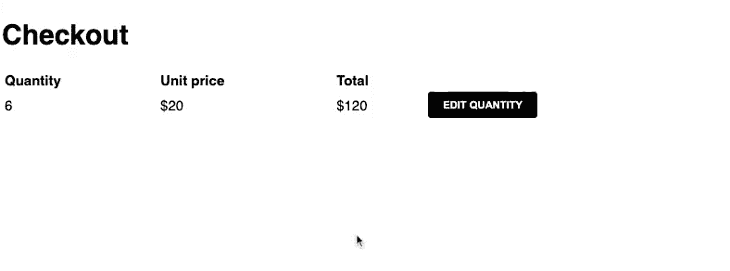
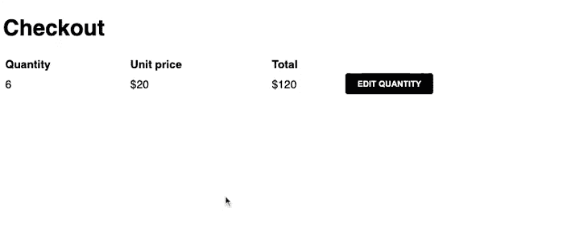

# React refs 完全指南

> 原文：<https://blog.logrocket.com/complete-guide-react-refs/>

***编者按**:本帖于 2023 年 2 月 23 日更新，添加了交互式代码示例，更新了任何过时的信息，并包含了 React 引用的用例。查看我们的 [React Hooks 备忘单](https://blog.logrocket.com/react-hooks-cheat-sheet-solutions-common-problems/)，了解更多关于 React Hooks 的信息。*

与许多其他 UI 库一样，React 提供了一种方式，将视图作为组件状态的结果进行重新思考。这与我们通常构建应用程序的方式有很大的不同。当我们熟悉其中一些概念时，我们会发现在前端世界中解决曾经给我们带来麻烦的简单问题是多么容易。这种好处的一部分来自于创建具有抽象机制的视图，这些抽象机制由 JSX 公开，而不是通过 DOM spec 方法来实现。

尽管如此，React 团队还是做了一些聪明的事情:他们提供了逃生出口。他们对超出他们特别设计的情况和模型可能不工作的情况保持库开放。我们将在本文后面讨论反模式。

这些 escape hatches 是 refs，它允许我们直接访问 DOM 属性。通常，React 通过为我们重新呈现组件来使用状态更新屏幕上的数据。但是，在某些情况下，您需要直接处理 DOM 属性，这就是 refs 发挥作用的地方。

一个例子是当组件呈现时自动聚焦文本框。React 没有提供一种简单的方法来做到这一点，所以我们可以使用 refs 来直接访问 DOM，并在组件呈现在屏幕上时聚焦文本框。

在本文中，我们将研究 React(一个旨在将代码从 DOM 操作中抽象出来的框架)为什么为开发人员打开了访问它的大门。

*向前跳转:*

## 创建参考

过去使用基于类的组件时，我们使用`createRef()`来创建一个 ref。不过，既然 React 推荐了[功能组件](https://blog.logrocket.com/what-are-react-pure-functional-components/)，而且一般的做法是[跟着钩子的方式](https://blog.logrocket.com/refactor-react-components-hooks/)做事，我们就没必要用`createRef()`。相反，我们使用`useRef(null)`在功能组件中创建引用。

正如简介中所说，引用是 React 开发人员的逃生出口，如果可能的话，我们应该尽量避免使用它们。当我们使用`ref`获得一个节点，然后修改它的一些属性或 DOM 结构时，它可能会与 React 的 diff 和 update 方法发生冲突。

首先，让我们从一个简单的组件开始，使用 refs 获取一个节点元素:

```
import React from "react";
const ActionButton = ({ label, action }) => {
  return <button onClick={action}>{label}</button>;
};
export default ActionButton;

```

这里的`<button>`表达式是调用`React.createElement('button')`语句的 JSX 方式，它不是 HTML 按钮元素的表示——它是一个 React 元素。

您可以通过创建一个 React 引用并将其传递给元素本身来访问实际的 [HTML 元素](https://blog.logrocket.com/type-html-faster-react-emmet-vs-code/):

```
import React, { useRef } from "react";
const ActionButton = ({ label, action }) => {
  const buttonRef = useRef(null);
  return (
    <button onClick={action} ref={buttonRef}>
      {label}
    </button>
  );
};
export default ActionButton;

```

这样，在组件生命周期的任何时候，我们都可以在`buttonRef.current`访问实际的 HTML 元素。现在，我们知道了如何访问 React 组件中的 DOM 节点。让我们看看这可能有用的一些情况。

### `useRef`和`createRef`的区别

`useRef`和`createRef`的第一个区别是`createRef`通常用于在类组件中创建引用，而`useRef`用于函数组件中。此外，`createRef`每次被调用都会返回一个新的 ref 对象，而`useRef`每次渲染都会返回相同的 ref 对象。

另一个主要区别是`createRef`不接受初始值，所以 ref 的`current`属性将被初始设置为`null`。另一方面，`useRef`可以接受一个初始值，ref 的`current`属性将被设置为该值。

## 使用反应引用

React 在开发人员中流行的许多概念之一是[声明性视图](https://blog.logrocket.com/solidjs-vs-react/)的概念。在声明式视图出现之前，我们大多数人通过调用显式改变 DOM 的函数来修改它。正如本文介绍中提到的，我们现在基于状态声明视图，并且——尽管我们仍在调用函数来改变这种状态——我们无法控制 DOM 何时会改变或者是否应该改变。

因为这种控制的倒置，如果没有裁判，我们就会失去这种命令性。下面是一些在代码中引入引用可能有意义的用例。

### 聚焦控制

您可以通过调用节点实例上的`focus()`以编程方式在元素中获得焦点。因为 DOM 将此公开为函数调用，所以在 React 中最好的方法是创建一个 ref，并在我们认为合适的时候手动执行，如下所示:

```
import React, { useState } from "react";
const InputModal = ({ initialValue }) => {
  const [value, setValue] = useState(initialValue);
  const onChange = (e) => {
    setValue(e.target.value);
  };
  const onSubmit = (e) => {
    e.preventDefault();
  };
  return (
    <div className="modal--overlay">
      <div className="modal">
        <h1>Insert a new value</h1>
        <form action="?" onSubmit={onSubmit}>
          <input type="text" onChange={onChange} value={value} />
          <button>Save new value</button>
        </form>
      </div>
    </div>
  );
};
export default InputModal;

```

在这种模式下，我们允许用户修改已经在下面的屏幕中设置的值。如果模式打开时输入是焦点，这将是一个更好的 UX T2，这将使两个屏幕之间的键盘平滑过渡。我们需要做的第一件事是为`input`获取一个参考:

```
import React, { useRef, useState } from "react";
const InputModal = ({ initialValue }) => {
  const [value, setValue] = useState(initialValue);
  const inputRef = useRef(null);
  const onChange = (e) => {
    setValue(e.target.value);
  };
  const onSubmit = (e) => {
    e.preventDefault();
  };
  return (
    <div className="modal--overlay">
      <div className="modal">
        <h1>Insert a new value</h1>
        <form action="?" onSubmit={onSubmit}>
          <input ref={inputRef} type="text" onChange={onChange} value={value} />
          <button>Save new value</button>
        </form>
      </div>
    </div>
  );
};
export default InputModal;

```

接下来，当我们的`modal`挂载时，我们必须在`useEffect`内调用`input ref`上的`focus`:

```
import React, { useEffect, useRef, useState } from "react";
const InputModal = ({ initialValue }) => {
  const [value, setValue] = useState(initialValue);
  const inputRef = useRef(null);
  useEffect(() => {
    inputRef.current.focus();
  }, [])
  const onChange = (e) => {
    setValue(e.target.value);
  };
  const onSubmit = (e) => {
    e.preventDefault();
  };
  return (
    <div className="modal--overlay">
      <div className="modal">
        <h1>Insert a new value</h1>
        <form action="?" onSubmit={onSubmit}>
          <input ref={inputRef} type="text" onChange={onChange} value={value} />
          <button>Save new value</button>
        </form>
      </div>
    </div>
  );
};
export default InputModal;

```

因此，当您打开`modal`时，您应该会看到文本框在默认情况下被聚焦:


请记住，您需要通过`current`属性来访问元素。

上面的例子有一个 CodeSandbox:

### 检测是否包含元素

类似地，您想知道是否有任何调度事件的元素应该触发您的应用程序上的一些动作。例如，如果用户在组件外单击，我们的`modal`组件可能会被关闭，如下所示:

```
import React, { useEffect, useRef, useState } from "react";
const InputModal = ({ initialValue, onClose, onSubmit }) => {
  const [value, setValue] = useState(initialValue);
  const inputRef = useRef(null);
  const modalRef = useRef(null);
  useEffect(() => {
    inputRef.current.focus();
    document.body.addEventListener("click", onClickOutside);
    return () => document.removeEventListener("click", onClickOutside);
  }, []);
  const onClickOutside = (e) => {
    const element = e.target;
    if (modalRef.current && !modalRef.current.contains(element)) {
      e.preventDefault();
      e.stopPropagation();
      onClose();
    }
  };
  const onChange = (e) => {
    setValue(e.target.value);
  };
  const onSub = (e) => {
    e.preventDefault();
    onSubmit(value);
    onClose();
  };
  return (
    <div className="modal--overlay">
      <div className="modal" ref={modalRef}>
        <h1>Insert a new value</h1>
        <form action="?" onSubmit={onSub}>
          <input ref={inputRef} type="text" onChange={onChange} value={value} />
          <button>Save new value</button>
        </form>
      </div>
    </div>
  );
};
export default InputModal;

```

这里，我们检查元素`click`是否在`modal`限制之外。它是这样工作的:



如果是，那么我们将阻止进一步的动作并调用`onClose`回调，因为`modal`组件期望由其父组件控制。记得检查 DOM 元素的当前引用是否仍然存在，因为 React 中的状态变化是异步的。为了实现这一点，我们在`body`元素上添加了一个[全局点击监听器](https://blog.logrocket.com/detect-click-outside-react-component-how-to/)。当元件被卸载时，记住清理`listener`是很重要的。

### 与基于 DOM 的库集成

与 React 一样好的是，其生态系统之外的许多实用程序和库已经在 web 上使用了很多年。例如，使用 refs 允许我们将 React 与一个伟大的动画库结合起来。利用他们的稳定性和对一些特定问题的解决是很好的。

GSAP 图书馆是动画示例的热门选择。要使用它，我们需要向它的任何方法发送一个`DOM`元素。让我们回到我们的模式，并添加一些动画，使其外观更花哨:

```
import React, { useEffect, useRef, useState } from "react";
import gsap from "gsap";
const InputModal = ({ initialValue, onClose, onSubmit }) => {
  const [value, setValue] = useState(initialValue);
  const inputRef = useRef(null);
  const modalRef = useRef(null);
  const overlayRef = useRef(null);
  const onComplete = () => {
    inputRef.current.focus();
  };
  const timeline = gsap.timeline({ paused: true, onComplete });
  useEffect(() => {
    timeline
      .from(overlayRef.current, {
        duration: 0.25,
        autoAlpha: 0,
      })
      .from(modalRef.current, {
        duration: 0.25,
        autoAlpha: 0,
        y: 25,
      });
    timeline.play();
    document.body.addEventListener("click", onClickOutside);
    return () => {
      timeline.kill();
      document.removeEventListener("click", onClickOutside);
    };
  }, []);
  const onClickOutside = (e) => {
    const element = e.target;
    if (modalRef.current && !modalRef.current.contains(element)) {
      e.preventDefault();
      e.stopPropagation();
      onClose();
    }
  };
  const onChange = (e) => {
    setValue(e.target.value);
  };
  const onSub = (e) => {
    e.preventDefault();
    onSubmit(value);
    onClose();
  };
  return (
    <div className="modal--overlay" ref={overlayRef}>
      <div className="modal" ref={modalRef}>
        <h1>Insert a new value</h1>
        <form action="?" onSubmit={onSub}>
          <input ref={inputRef} type="text" onChange={onChange} value={value} />
          <button>Save new value</button>
        </form>
      </div>
    </div>
  );
};
export default InputModal;

```



在构造函数级别，我们正在设置初始动画值，这将修改我们的 DOM 引用的样式。时间轴仅在组件安装时播放。当元素被卸载时，我们将通过使用由`Timeline`实例提供的`kill()`方法终止任何正在进行的动画来清理 DOM 状态和动作。

现在，在`timeline`完成后，我们将把注意力转向`input`。

### 什么时候应该使用`useRef`钩子？

在某些情况下，您可能会想要使用`useRef`钩子，包括以下情况:

*   访问 DOM 元素:当需要与组件中的特定 DOM 元素交互时，可以使用`useRef`钩子，比如将焦点设置在输入字段上或者测量元素的大小
*   存储不会触发重新渲染的值:当你有一个频繁变化但不会触发重新渲染的值时，你可以使用`useRef`来存储这个值。例如，如果您的组件中有一个计时器，您可以使用`useRef`来存储当前时间，而无需触发重新渲染
*   缓存昂贵的计算:如果你需要避免在每次渲染时重复昂贵的计算，你可以使用`useRef`来存储计算的结果

## 避免 React ref 反模式

一旦你知道了引用是如何工作的，就很容易在不需要的地方使用它们。在 React 组件中有不止一种方法可以实现同样的事情，所以很容易陷入[反模式](https://blog.logrocket.com/product-management/strategic-roadmap-examples-antipatterns/)。关于引用的使用，我的原则是:只有当你需要强制调用 React 不允许你控制的行为的函数时，才使用引用。

更简单的说法是，当您需要调用一个函数，而该函数与 React 方法或工件没有关联时，使用 ref。让我们探索一个我反复看到的反模式:

```
import React, { useRef } from "react";
const Form = () => {
  const [storedValue, setStoredValue] = useState("");
  const inputRef = useRef(null);
  const onSubmit = (e) => {
    e.preventDefault();
    setStoredValue(inputRef.current.value);
  };
  return (
    <div className="modal">
      <form action="?" onSubmit={onSubmit}>
        <input ref={inputRef} type="text" />
        <button>Submit</button>
      </form>
    </div>
  );
};

```

公平地说，如果你想在`submit`上发送一个`value`，这种方法是可行的，但是这里的问题是，因为我们知道 refs 提供了一个视图模型 React 提供的出口，我们可以很容易地嗅探到 DOM 元素值或属性，我们可以通过 React 的接口访问它们。控制`input`值意味着我们可以随时检查它的值。我们不需要在这里使用 refs 来访问文本框的值。我们可以使用 React 本身提供的值:

```
return (
  <input
    type="text"
    onChange={e => setValue(e.target.value)}
    value={value}
  />
)

```

让我们回到我们的规则:只有当你需要强制调用 React 不允许你控制的行为的函数时，才使用 ref。在我们的 uncontrolled `input`中，我们创建了一个 ref，但没有进行命令式调用。那么，这个函数应该存在，这是不满足的，因为我确实可以控制一个输入的值。

## 使用`forwardRef`

正如我们已经讨论过的，引用对于真正特定的动作是有用的。所示的例子比我们现在通常在 web 应用程序代码库中找到的要简单一些。组件更复杂，我们很少直接使用普通的 HTML 元素。包含多个节点来封装视图行为的更多逻辑是很常见的。这里有一个例子:

```
import React from 'react'

const LabelledInput = (props) => {
  const { id, label, value, onChange } = props

  return (
    <div class="labelled--input">
      <label for={id}>{label}</label>
      <input id={id} onChange={onChange} value={value} />
    </div>
  )
}

export default LabelledInput

```

现在的问题是，传递对这个组件的引用将返回它的实例，一个 React 组件引用，而不是我们想要关注的`input`元素，就像我们的第一个例子一样。幸运的是，React 为此提供了一个名为`[forwardRef](https://blog.logrocket.com/cleaning-up-the-dom-with-forwardref-in-react/)`的内置解决方案，允许您在内部定义`ref`将指向的元素:

```
import React from 'react'

const LabelledInput = (props, ref) => {
  const { id, label, value, onChange } = props

  return (
    <div class="labelled--input">
      <label for={id}>{label}</label>
      <input id={id} onChange={onChange} value={value} ref={ref}/>
    </div>
  )
}

export default React.forwardRef(LabelledInput)

```

请看这个[例子中的动作](https://codesandbox.io/s/input-modal-example-l2wst?module=%2Fsrc%2Flabelled-input.js):

为此，我们将向函数传递第二个参数，并将其放在所需的元素中。现在，当父组件传递一个`ref`值时，它将获得`input`，这有助于避免暴露组件的内部和属性并破坏其封装。我们的形式的例子，我们看到未能实现焦点，现在将按预期工作。

## 结论

我们首先回顾了 React 的基本概念及其用法，为什么我们通常不应该打破框架的模型，以及为什么我们有时可能需要这样做。通过库公开的接口访问 DOM 有助于维护 React 的内部结构(记住`useState`包含的逻辑不仅仅是触发重新渲染循环，比如批处理更新，以及未来的时间片)。

用反模式破坏这种模型会使库中后来的性能改进变得无用，甚至会在应用程序中产生 bug。请记住，只有当 React 无法通过其方法处理隐式函数调用时，才使用 refs。此外，确保它不会改变组件的内部状态。欲了解更多信息，请阅读关于参考文献的官方 React 文档。