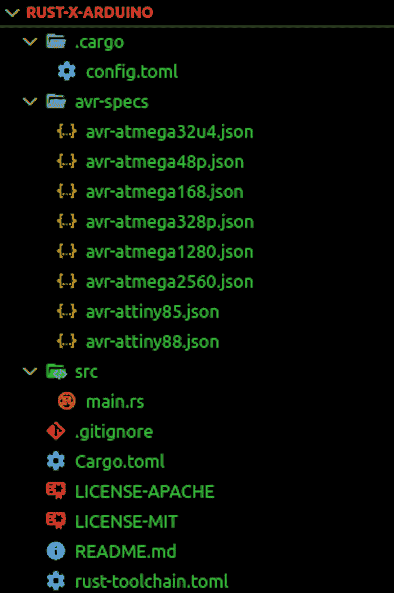
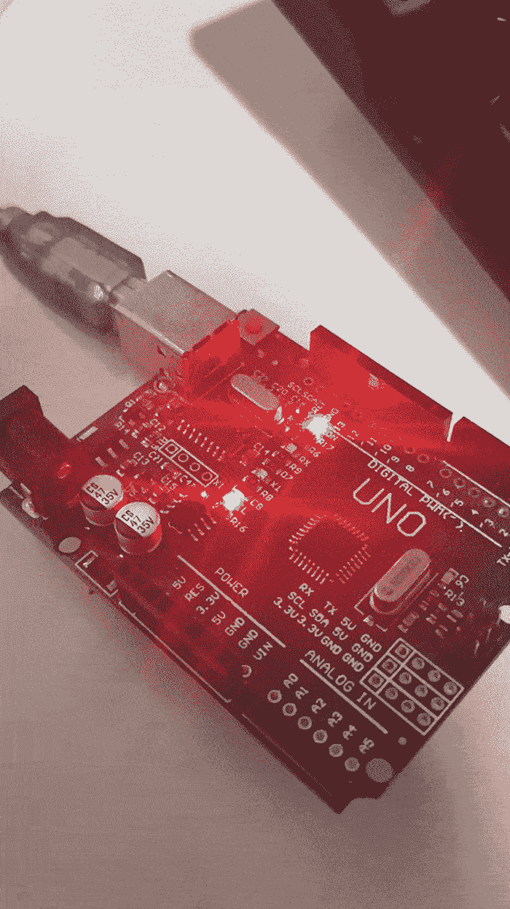

# 在 Arduino 上运行 Rust 的完整指南

> 原文：<https://blog.logrocket.com/complete-guide-running-rust-arduino/>

Arduino 是一款 AVR 微控制器，对于嵌入式系统的初学者来说更加简单。虽然本文中使用的是 Arduino UNO，但对于其他电路板，遵循这里指定的步骤会更容易。

Rust 是一种系统编程语言，非常适合低级系统，并能与硬件系统正确通信。它被设计成 C++的现代替代品，但具有更高的内存安全性和效率，以及更快的速度。

本教程面向初级到中级 Rust 或嵌入式系统开发人员，希望学习如何在微控制器上运行 Rust。阅读本文的先决条件包括:

*   铁锈语言知识
*   Rust 语言的开发环境
*   Arduino 的基本知识
*   Linux 环境的基本用法

*向前跳转:*

## 为什么嵌入式系统会生锈？

几十年来，嵌入式系统技术一直缺乏新意。为闪电般快速的嵌入式设备编程的语言选择是 C/C++已经有很长时间了，但是 Rust 提供了更快的开发支持。

Rust 非常适合嵌入式系统开发，因为它:

*   与 C 代码库高度互操作
*   轻便易携
*   强大的并发模型
*   对不同微控制器的强大支持
*   内存安全，所以不会有任何问题，由于内存

如果你已经用 C++编写了 Arduinos，那么一旦你掌握了基础知识，过渡到 Rust 会相对容易。你可以在这里了解更多关于嵌入式 Rust [的信息。你也可以在这里看到可用的微控制器箱](https://docs.rust-embedded.org/)。

## 什么是 Arduino UNO？

Arduino UNO 基于 Atmel 开发的 AVR 微控制器系列下的 ATMega328P。Arduino 可以使用其编程语言进行编程，该编程语言是使用 Arduino IDE 编辑器从 C++派生的，但是由于它也是一个开放源代码项目，所以也可以使用其他系统兼容的编程语言来对 Arduino 进行编程。

使用 Arduino 开发嵌入式系统的正常程序包括以下步骤:

1.  画出预期电路的电路图
2.  连接电气部件，使其与图表相匹配
3.  编写程序逻辑以根据需要控制电路
4.  通过 USB 线将微控制器连接到计算机
5.  将程序从计算机闪存(或上传)到主板的闪存中

本文主要关注第三步到第五步，但是教程的连接也是可用的。

要阅读本文，您需要安装一些软件和硬件。

### 软件需求

*   一种用于编写、编译程序并将其刷新到电路板上的机器
*   货物安装(见 [https://rustup.rs](https://rustup.rs)
*   安装了 Rust 每夜编译器版本

### 硬件需求

## 安装和设置

### 使用 Avrdude

需要一个硬件抽象层(HAL)来在 AVR 微控制器和其他常见主板上运行 Rust。要做到这一点，您需要每夜 Rust 编译器将 Rust 代码编译到您机器上的 AVR。运行以下命令进行安装:

```
rustup toolchain install nightly

```

### 在 Windows 上

在 Windows 上，您需要使用以下命令通过 Powershell 安装 Scoop:

```
Set-ExecutionPolicy RemoteSigned -Scope CurrentUser # Needed to run a remote script the first time
irm get.scoop.sh | iex 

```

最后的输出应该是:


然后，运行以下命令安装`avr-gcc`和`avrdude`:

```
scoop install avr-gcc
```

```
scoop install avrdude
```

### 在 macOS 上

在 macOS 上，只需设置 [homebrew-avr](https://github.com/osx-cross/homebrew-avr) tap 并运行以下命令:

```
xcode-select --install # for the fist time
brew tap osx-cross/avr
brew install avr-binutils avr-gcc avrdude

```

### 在 Linux 上

如果您使用像 Ubuntu 这样的 Linux 发行版，命令是:

```
sudo apt install avr-libc gcc-avr pkg-config avrdude libudev-dev build-essential

```

这里有一个针对所有操作系统的[安装指南](https://docs.rust-embedded.org/book/intro/install.html)，如果你在遵循上面的指南时遇到了障碍。

完成这些步骤后，下一步是安装 [ravedude](https://github.com/Rahix/avr-hal/blob/main/ravedude) 工具，用于针对`cargo`刷新微控制器板:

```
cargo +stable install ravedude

```

这个工具处理从寻找电路板、闪烁电路板到监听连接的所有事情。您只需运行`cargo run`命令。

## 用`avrdude`开始一个新的 Arduino 项目

有了`cargo-generate`箱，开始一个新项目变得更加简单。只需连续运行以下命令来创建一个新项目:

```
cargo install cargo-generate
cargo generate --git <https://github.com/Rahix/avr-hal-template.git>

```

运行该命令后，您应该会看到一个输入字段，用于指定项目的名称。本文使用`rust-x-arduino`作为项目名称。

输入您喜欢的名字后，点击**进入**。下一个日志显示了在`avrdude`模板下可用的微控制器列表。本文使用 Arduino UNO，这是一个每个人都容易获得的变体。

构建完成后，导航到项目中，并在您首选的代码编辑器中将文件夹作为项目打开。项目结构应该如下图所示:



**注意:**如果在安装`libudev-sys`板条箱时出现错误，您必须将它包含在您的`cargo.toml`文件中的依赖项下:

```
[dependencies]
libudev-sys = "0.1"

```

libudev Rust binding 是一个为 C 库提供声明和链接的箱子。它是特定于 Linux 的，因此不适用于 Windows 或 OSX 操作系统。

或者，您可以运行下面的命令来安装`libudev-sys`板条箱:

```
sudo apt-get install libudev-dev

```

如果`pkg-config`出现更多问题，您可以咨询 [libudev-sys 库](https://github.com/dcuddeback/libudev-sys)。

接下来，您可以使用 build 命令构建项目:

```
cargo build
```

这需要一段时间，因为这是一个 CPU 密集型任务。之后，你会在`target/avr-atmega328p/debug/`下找到一个`.elf`文件。要运行您自己的程序，您可以编辑`main.rs`文件，该文件已经包含了一个基本 LED 闪烁程序的示例代码:

```
#![no_std]
#![no_main]

use panic_halt as _;

#[arduino_hal::entry]
fn main() -> ! {
    let dp = arduino_hal::Peripherals::take().unwrap();
    let pins = arduino_hal::pins!(dp);

    let mut led = pins.d13.into_output();

    loop {
        led.toggle();
        arduino_hal::delay_ms(1000);
    }
}

```

### 理解上面嵌入的 Rust 代码

从前两行代码可以清楚地看出，没有标准库，也没有 main，因为它是一个没有操作系统的嵌入式项目。

行`#[arduino_hal::entry]`指定程序的入口点。线`uses panic_halt as _;`用于处理恐慌。

在主功能中，外设被打开。在嵌入式 Rust 中，外围设备是指能够感知周围环境并与人类交互的组件。它们包括传感器、执行器、电机控制器，以及微控制器的基本部件，如 CPU、RAM 或闪存。你可以在[嵌入式 Rust book](https://docs.rust-embedded.org/book/peripherals/index.html) 中了解更多关于外设的知识。

接下来，我们访问 Arduino 板中的引脚，以便将默认引脚(D13)的数字输出设置为`high`。

每个 Arduino 程序都包含`void setup()`和`void loop()`。我们刚刚完成了设置；代码的另一部分显示了循环。

循环中的`toggle`方法用于打开和关闭 LED，而`delay_ms`方法用于将循环延迟指定的毫秒数。

## 为闪存配置微控制器

在官方 Arduino IDE 中使用 Arduino 微控制器时，您只需用基于 C++的 Arduino 编写程序，并通过 USB 端口将程序源文件上传到主板。

对于 Rust，我们将遵循一个更长但相似的过程。首先用 Linux 命令列出机器中开放的 USB 端口:

```
lsusb

```

如果通过 USB 将 Arduino 板插入设备，您应该会看到连接到 Arduino 板的 USB 的名称，如下图所示:


接下来，我们将使用脚本为`ravedude`设置串行 com 端口:

```
export RAVEDUDE_PORT=/dev/ttyUSB0

```

这告诉`ravedude`Arduino 连接到哪个端口。运行下面的命令会将程序编译并刷新到 Arduino:

```
cargo run

```

### 微控制器上的输出

当程序上传到微控制器时，Arduino 将按照编程运行。在这种情况下，板上的 LED 灯将根据程序中指定的时间间隔闪烁。



## 其他项目

值得一提的是，`avr-hal`机箱/存储库上有一个[示例目录](https://github.com/Rahix/avr-hal/tree/main/examples)，在那里你可以找到 Arduino 项目的示例程序进行测试。例如，如果您正在使用 Arduino UNO，您可以选择它，导航到`src/bin`目录，并找到与 Arduino UNO 板兼容的不同程序。

如果您希望编写自己的项目，您必须像我们在上一节中所做的那样生成 AVR-HAL 模板。

## 进一步支持嵌入式 Rust 开发

嵌入式 Rust 开发的官方文档可以在[这里](https://docs.rust-embedded.org/)获得，书籍[在这里](https://docs.rust-embedded.org/book/)。还有一个 [GitHub 资源库](https://github.com/rust-embedded/awesome-embedded-rust)，里面存储了所有与嵌入式 Rust 相关的资源；它可以作为尝试新事物的有用起点。它基于官方的[嵌入式设备工作组](https://github.com/rust-embedded)。

如果你想进一步了解 Rust 的嵌入式开发，你可以点击这里查看完整的播放列表。

## [log rocket](https://lp.logrocket.com/blg/rust-signup):Rust 应用的 web 前端的全面可见性

调试 Rust 应用程序可能很困难，尤其是当用户遇到难以重现的问题时。如果您对监控和跟踪 Rust 应用程序的性能、自动显示错误、跟踪缓慢的网络请求和加载时间感兴趣，

[try LogRocket](https://lp.logrocket.com/blg/rust-signup)

.

[](https://lp.logrocket.com/blg/rust-signup)

LogRocket 就像是网络和移动应用程序的 DVR，记录你的 Rust 应用程序上发生的一切。您可以汇总并报告问题发生时应用程序的状态，而不是猜测问题发生的原因。LogRocket 还可以监控应用的性能，报告客户端 CPU 负载、客户端内存使用等指标。

现代化调试 Rust 应用的方式— [开始免费监控](https://lp.logrocket.com/blg/rust-signup)。