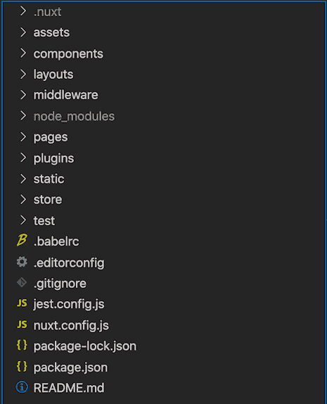

# 用 Jest 在 Nuxt.js 中进行组件测试

> 原文：<https://blog.logrocket.com/component-testing-nuxt-js-jest/>

***编者按**:这篇文章最后一次更新是在 2022 年 11 月 15 日，增加了作为 UI 框架的 [Vuetify。](https://blog.logrocket.com/getting-started-is-vuetify-right-for-you/)*

Vue 在过去几年越来越受欢迎，这引发了人们对 Nuxt.js 的兴趣，这是一个用于使用 Vue 构建健壮的通用应用程序的框架。构建应用程序时，提供清晰的测试路径很重要，这将减少调试和重构代码所花费的时间。

在本文中，我们将学习如何用 Nuxt.js 建立一个游戏商店应用程序，并测试其组件。要理解这篇文章，你应该有关于 Vue 和 Nuxt.js 的基础知识。你也可以在 [GitHub](https://github.com/fullstackmafia/nuxt-store-demo) 上查看完整的资源库。我们开始吧！

## 设置 Nuxt.js 应用程序

要用 Nuxt.js 创建一个新的应用程序，我们首先必须安装它。在终端中，导航到您的项目文件夹并输入以下命令:

```
npm install nuxt

```

仍然使用终端，在我们的项目文件夹中，我们将通过 npx 创建我们的应用程序，npx 是 NPM v 5 . 2 . 0 以后默认提供的:

```
npx create-nuxt-app game-store

```

运行此命令将带我们浏览选项列表，在此过程中，您的选项可能会有所不同。选择 **Vuetify** 作为 UI 框架，选择[Jest 作为测试框架](https://blog.logrocket.com/jest-testing-top-features/)选项。下面的指南详细介绍了我们在创建将要使用的应用程序时所选择的内容:

```
? Project name: game-store
? Programming language: JavaScript
? Package manager: NPM
? UI Framework: Vuetify
? Nuxt.js modules: None
? Linting tools: None
? Testing framework: Jest
? Rendering mode: Single Page App
? Deployment target: Static
? Development tools: jsconfig.json
? Version Control System: Git

```

创建完应用程序后，我们可以通过终端导航到它，并在浏览器中启动它:

```
cd game-stores
npm run dev

```

应该会出现以下窗口:


我们还应该有一个类似于下面的项目文件夹结构:



## 配置我们的商店

为了有效地管理状态，Nuxt.js 利用了 [Vuex](https://vuex.vuejs.org/) 的能力。因此，在`/store`目录[中创建的每个文件都可以被视为一个 Vuex 模块](https://blog.logrocket.com/managing-multiple-store-modules-vuex/)，这意味着它包含其状态、突变、动作和 getters。

我们将使用商店目录作为应用程序的起点。让我们从包括我们需要的数据开始。在现有的`/store`目录下创建一个新的`games/games.js`文件，并将以下代码粘贴到其中:

```
// store/games/games.js

const games = [
  {
    title: "Star Wars Battlefront 2",
    console: "PlayStation 4",
    rating: 7,
    price: 15.3,
    photo:
      "https://res.cloudinary.com/fullstackmafia/image/upload/v1604990005/SWBF2_box_or6x8s.jpg",
  },
  {
    title: "BioShock: The Collection",
    console: "PlayStation 4",
    rating: 9,
    price: 16.0,
    photo:
      "https://res.cloudinary.com/fullstackmafia/image/upload/v1604990078/220px-BioShock-_The_Collection_tix1ol.jpg",
  },
  {
    title: "Call of Duty: Black Ops 4",
    console: "PlayStation 4",
    rating: 9,
    price: 11.7,
    photo:
      "https://res.cloudinary.com/fullstackmafia/image/upload/v1604990123/220px-Call_of_Duty_Black_Ops_4_official_box_art_vvhd7w.jpg",
  },
  {
    title: "Tom Clancy's Rainbow Six: Siege",
    console: "PlayStation 5",
    rating: 9,
    price: 13.9,
    photo:
      "https://res.cloudinary.com/fullstackmafia/image/upload/v1604990231/56c494ad88a7e300458b4d5a_qeyro6.jpg",
  },
];

```

接下来，我们将配置我们的`games`存储的状态、变异、动作和 getters。为了执行这个操作，在我们之前创建的`games.js`文件中，将下面的代码粘贴到前面的代码片段之后:

```
// store/games/games.js

const state = () =&gt; {
  return games;
};

const mutations = {};
const actions = {};
const getters = {
  bestGames(state) {
    return state.filter(({ rating }) =&gt; {
      return rating === 9;
    });
  },
  playstationfour(state) {
    return state.filter(({ console }) =&gt; {
      return console === "PlayStation 4";
    });
  },
  consoleType(state) {
    return (consoleName) =&gt; {
      return state.filter(({ console }) =&gt; {
        return console === consoleName;
      });
    };
  },
  cheapGames(state) {
    return state.filter(({ price }) =&gt; {
      return price === 15.3;
    });
  },
};

export default { state, mutations, actions, getters };

```

让我们通过使用`v-for`指令遍历每个条目[，在主页上显示我们的`games`商店数据。用以下代码替换`pages/index.vue`中的代码:](https://blog.logrocket.com/make-form-elements-dynamic-vue-js/#creating-dynamic-forms-vue-js)

```
<!-- pages/index.vue -->
<template>
  <div>
    <v-container>
      <v-row>
        <v-col xs4 v-for="game in psfourGames" :key="game.title">
          <v-card>
            <v-img :src="game.photo" aspect-ratio="1"></v-img>
            <v-card-title primary-title>
              <div>
                <h3>{{ game.title }}</h3>
                <h4>Rating: {{ game.rating }}</h4>
                <h4>Price: ${{ game.price }}</h4>
              </div>
            </v-card-title>
          </v-card>
        </v-col>
      </v-row>
    </v-container>
  </div>
</template>

```

然后，我们将使用 Vuex 的`MapGetter`助手将之前在`games.js`中定义的 getter 映射到我们的`index.vue`文件中的一个计算属性:

```
<!-- pages/index.vue -->
<script>
import { mapGetters } from "vuex";
export default {
  computed: {
    ...mapGetters({
      consoleType: "games/games/consoleType",
    }),
    psfourGames() {
      return this.consoleType("PlayStation 4");
    },
  },
};
</script>

```

让我们看看这是如何出现在浏览器中的。导航到您的终端并运行`npm run dev`。您的浏览器视图应该类似于下图:


## 配置我们的测试框架

对于我们的应用程序的测试框架，我们使用 Jest，它是我们之前在设置时选择的。正如我们之前提到的，Nuxt.js 将我们商店的所有内容构建到 Vuex 模块中。我们的目标是拥有负责不同功能的各种存储，并以在我们的组件中使用的相同方式测试这些存储，这意味着我们选择我们想要测试的特定存储。

为了实现这一点，我们将配置 Jest 使用它的`[globalSetup](https://jestjs.io/docs/configuration)`模块，该模块导出一个异步函数，在所有测试运行之前触发一次。因此，我们可以选择想要测试的特定商店。要执行此操作，请用以下代码替换`jest.config.js`文件中的代码:

```
// jest.config.js

module.exports = {
  globalSetup: "&lt;rootDir&gt;/jest.setup.js",
  moduleNameMapper: {
    "^@/(.*)$": "&lt;rootDir&gt;/$1",
    "^~/(.*)$": "&lt;rootDir&gt;/$1",
    "^vue$": "vue/dist/vue.common.js",
  },
  moduleFileExtensions: ["js", "vue", "json"],
  transform: {
    "^.+\\.js$": "babel-jest",
    ".*\\.(vue)$": "vue-jest",
  },
  collectCoverage: true,
  collectCoverageFrom: [
    "&lt;rootDir&gt;/components/**/*.vue",
    "&lt;rootDir&gt;/pages/**/*.vue",
  ],
};

```

在上面的 Jest 配置文件中，我们已经将`globalSetup`模块配置为在运行任何测试之前首先运行 Jest 设置文件。

接下来，我们将创建`jest.setup.js`文件，在这里我们将通过一个流程变量公开我们的存储目录:

```
import { Nuxt, Builder } from "nuxt";
import nuxtConfig from "./nuxt.config";

const resetConfig = {
  loading: false,
  loadingIndicator: false,
  fetch: {
    client: false,
    server: false,
  },
  features: {
    store: true,
    layouts: false,
    meta: false,
    middleware: false,
    transitions: false,
    deprecations: false,
    validate: false,
    asyncData: false,
    fetch: false,
    clientOnline: false,
    clientPrefetch: false,
    clientUseUrl: false,
    componentAliases: false,
    componentClientOnly: false,
  },
  build: {
    indicator: false,
    terser: false,
  },
};
const config = Object.assign({}, nuxtConfig, resetConfig, {
  srcDir: nuxtConfig.srcDir,
  ignore: ["**/components/**/*", "**/layouts/**/*", "**/pages/**/*"],
});
const buildNuxt = async () =&gt; {
  const nuxt = new Nuxt(config);
  await new Builder(nuxt).build();
  return nuxt;
};
module.exports = async () =&gt; {
  const nuxt = await buildNuxt();
  process.env.buildDir = nuxt.options.buildDir;
};

```

在上面的设置文件中，`resetConfig`确保在运行构建过程时只构建商店。然后，我们使用`process.env.buildDir`来展示我们商店的路径。

完成后，让我们为我们的商店编写测试。在现有的`/test`目录中创建一个新的`games.test.js`文件，并向其中添加以下代码:

```
// test/games.test.js

import _ from "lodash";
import Vuex from "vuex";
import { createLocalVue } from "@vue/test-utils";

describe("store/games/games", () =&gt; {
  const localVue = createLocalVue();
  localVue.use(Vuex);
  let NuxtStore;
  let store;
  beforeAll(async () =&gt; {
    const storePath = `${process.env.buildDir}/store.js`;
    NuxtStore = await import(storePath);
  });
  beforeEach(async () =&gt; {
    store = await NuxtStore.createStore();
  });
// ...
});

```

在上面的测试中，我们使用 Jest 的`beforeAll`块来导入构建的商店。`beforeEach`块确保每次运行单独的测试时都会创建一个新的存储。

接下来，我们将写出我们的应用程序需要的特定测试。假设我们需要以下一组特定的标准:

*   视频游戏*使命召唤:黑色行动 4* 只出现在 PlayStation 4 游戏中
*   视频游戏《星球大战前线 2》的价格正好是 15.30 美元
*   商店只展示分级为`9`的电子游戏

我们的测试代码如下所示:

```
describe("consoleType", () =&gt; {
  let playstationfour;
  beforeEach(() =&gt; {
    playstationfour = store.getters["games/games/playstationfour"];
  });
  test("Call of Duty: Black Ops 4 should be on only playStation 4", () =&gt; {
    expect(playstationfour).toEqual(
      expect.arrayContaining([
        expect.objectContaining({
          console: "PlayStation 4",
          title: "Call of Duty: Black Ops 4",
        }),
      ])
    );
  });
});

describe("cheapGames", () =&gt; {
  let cheapGames;
  beforeEach(() =&gt; {
    cheapGames = store.getters["games/games/cheapGames"];
  });
  test(`StarWars BattleFront must cost exactly ${15.3}`, () =&gt; {
    expect(cheapGames).toEqual(
      expect.arrayContaining([
        expect.objectContaining({
          price: 15.3,
        }),
      ])
    );
  });
});

describe("bestGames", () =&gt; {
  let bestGames;
  beforeEach(() =&gt; {
    bestGames = store.getters["games/games/bestGames"];
  });
  test("Display only the best titles we have", () =&gt; {
    expect(bestGames).toEqual(
      expect.arrayContaining([
        expect.objectContaining({
          rating: 9,
        }),
      ])
    );
  });
});

```

但是，您必须确保测试代码是紧接在`beforeEach`块之后编写的，这样我们才能继续访问我们的 store 实例。有了这些新的变化，我们的`games.test.js`文件的完整代码将如下所示:

```
// test/games.test.js

import _ from "lodash";
import Vuex from "vuex";
import { createLocalVue } from "@vue/test-utils";

describe("store/games/games", () =&gt; {
  const localVue = createLocalVue();
  localVue.use(Vuex);
  let NuxtStore;
  let store;
  beforeAll(async () =&gt; {
    const storePath = `${process.env.buildDir}/store.js`;
    NuxtStore = await import(storePath);
  });
  beforeEach(async () =&gt; {
    store = await NuxtStore.createStore();
  });

  describe("consoleType", () =&gt; {
    let playstationfour;
    beforeEach(() =&gt; {
      playstationfour = store.getters["games/games/playstationfour"];
    });
    test("Call of Duty: Black Ops 4 should be on only playStation 4", () =&gt; {
      expect(playstationfour).toEqual(
        expect.arrayContaining([
          expect.objectContaining({
            console: "PlayStation 4",
            title: "Call of Duty: Black Ops 4",
          }),
        ])
      );
    });
  });

  describe("cheapGames", () =&gt; {
    let cheapGames;
    beforeEach(() =&gt; {
      cheapGames = store.getters["games/games/cheapGames"];
    });
    test(`StarWars BattleFront must cost exactly ${15.3}`, () =&gt; {
      expect(cheapGames).toEqual(
        expect.arrayContaining([
          expect.objectContaining({
            price: 15.3,
          }),
        ])
      );
    });
  });

  describe("bestGames", () =&gt; {
    let bestGames;
    beforeEach(() =&gt; {
      bestGames = store.getters["games/games/bestGames"];
    });
    test("Display only the best titles we have", () =&gt; {
      expect(bestGames).toEqual(
        expect.arrayContaining([
          expect.objectContaining({
            rating: 9,
          }),
        ])
      );
    });
  });
});

```

让我们试一试。导航到您的终端并运行`npm test`；这将运行所有指定的测试并交付预期的结果，读数为`All default components and routes have been deleted before running this test`:


game.test.js pass

## 结论

为通用应用程序编写测试似乎很麻烦。一个通用的经验法则是总是保持测试简单和简洁。在本文中，我们探索了用 Jest 测试我们的 Nuxt.js 组件。我们还探讨了 Vuetify 和 Vuex。我希望你喜欢这篇文章，如果你有问题，一定要留下评论。编码快乐！

## 使用 [LogRocket](https://lp.logrocket.com/blg/signup) 消除传统错误报告的干扰

[](https://lp.logrocket.com/blg/signup)

[LogRocket](https://lp.logrocket.com/blg/signup) 是一个数字体验分析解决方案，它可以保护您免受数百个假阳性错误警报的影响，只针对几个真正重要的项目。LogRocket 会告诉您应用程序中实际影响用户的最具影响力的 bug 和 UX 问题。

然后，使用具有深层技术遥测的会话重放来确切地查看用户看到了什么以及是什么导致了问题，就像你在他们身后看一样。

LogRocket 自动聚合客户端错误、JS 异常、前端性能指标和用户交互。然后 LogRocket 使用机器学习来告诉你哪些问题正在影响大多数用户，并提供你需要修复它的上下文。

关注重要的 bug—[今天就试试 LogRocket】。](https://lp.logrocket.com/blg/signup-issue-free)

## 像用户一样体验您的 Vue 应用

调试 Vue.js 应用程序可能会很困难，尤其是当用户会话期间有几十个(如果不是几百个)突变时。如果您对监视和跟踪生产中所有用户的 Vue 突变感兴趣，

[try LogRocket](https://lp.logrocket.com/blg/vue-signup)

.

[](https://lp.logrocket.com/blg/vue-signup)[https://logrocket.com/signup/](https://lp.logrocket.com/blg/vue-signup)

LogRocket 就像是网络和移动应用程序的 DVR，记录你的 Vue 应用程序中发生的一切，包括网络请求、JavaScript 错误、性能问题等等。您可以汇总并报告问题发生时应用程序的状态，而不是猜测问题发生的原因。

LogRocket Vuex 插件将 Vuex 突变记录到 LogRocket 控制台，为您提供导致错误的环境，以及出现问题时应用程序的状态。

现代化您调试 Vue 应用的方式- [开始免费监控](https://lp.logrocket.com/blg/vue-signup)。