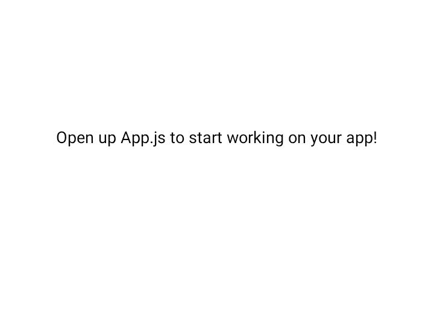
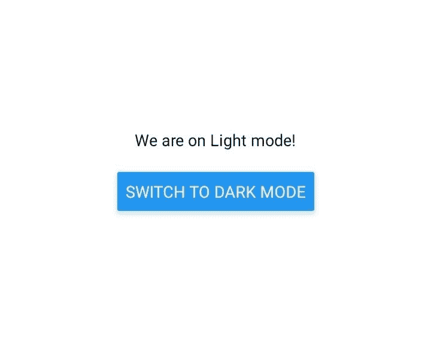
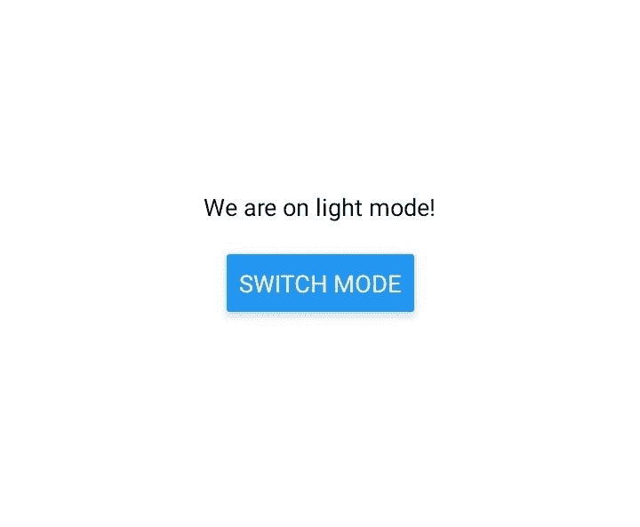
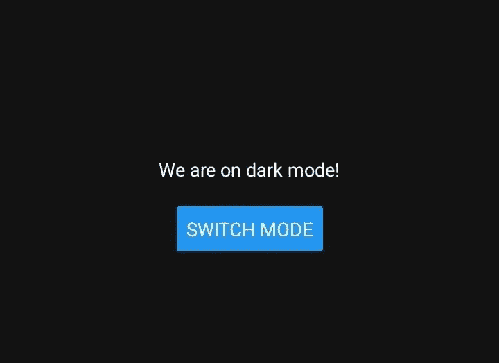
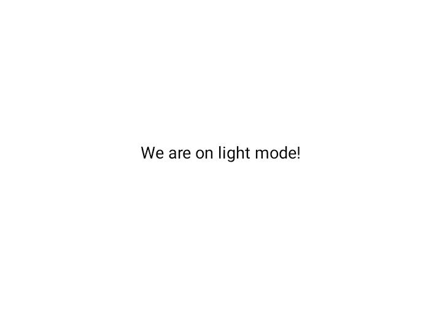

# React Native 中的黑暗模式综合指南

> 原文：<https://blog.logrocket.com/comprehensive-guide-dark-mode-react-native/>

主题的实现是现代应用程序中的一个常见概念；主题用于定制应用程序的外观和样式。

作为一名开发人员，您希望在为每个主题和主机资产构建集成逻辑的同时，用极简主义方法实现这个概念。然后，应该有一个结构化的、端到端的解决方案，让应用程序能够轻松地与这些主题集成。最后，您必须确保它们在您的应用程序组件中快速、一致地工作。

这一点需要牢记在心！但是在 React Native 中，有几种方法可以用来实现主题集成，使这个看似困难的任务变得容易。在本文中，我们将回顾一些可以在 React 本机应用程序中用来实现暗模式和亮模式并在它们之间切换的常用方法。

## 先决条件

要遵循本指南，您应该具备 React Native 和安装在您计算机上的 [Node.js](https://nodejs.org/en/) 的工作知识。

## 目录

## 使用 Expo 设置 React 本机应用程序

有两种方法可以开始一个 React Native 项目:React Native CLI T1 和 Expo CLI T3。在本文中，我们将使用 Expo CLI。

首先，您需要在计算机上安装 Expo CLI。使用以下命令安装它:

```
npm install --global expo-cli

```

创建一个您希望项目所在的文件夹，并使用以下 Expo 命令初始化 React 本地应用程序:

```
expo init dark_mode_switcher

```

选择`blank : a minimal app as clean as an empty canvas`，然后在创建应用程序后导航到创建的`dark_mode_switcher`目录:

```
cd dark_mode_switcher

```

要在 iPhone 上启动开发服务器，请运行:

```
npm run ios

```

打开相机应用程序，扫描终端上的二维码，或者使用将自动启动的 Expo dev 工具网站。

如果您使用的是 Android 设备，运行:

```
npm run android

```

安装`Expo Go`应用，然后在**项目**下，扫描二维码。
在 iPhone 或 Android 上启动应用程序时，您应该能够看到以下内容:



在您的`App.js`文件中，将渲染文本更改为`We are on Light mode`。我们将创建一个按钮，允许我们在模式之间切换。

首先，从`react-native`导入一个按钮组件，如下所示:

```
import {Button} from "react-native"

```

在`Text`组件后实现`Button`:

```
<Button title="Switch to Dark Mode" onPress={() => null} />

```

给`Text`上一堂风格课:

```
<Text style={styles.text}>We are on Light mode!</Text>

```

在样式部分实现样式:

```
text:{
    marginBottom:20
} 

```

现在，我们的应用程序应该是这样的:



接下来，我们将构建使用几种不同方法在模式之间切换的能力，以便您可以为您的用例选择最佳选项。

## 使用 Redux 的 React Native 中的黑暗模式

[Redux](https://blog.logrocket.com/redux-isnt-dead/) 是一个状态管理工具，可以在 React、React Native 等不同的 JavaScript 框架中使用。它存储 IU 元素的状态配置，并允许您存储可预测的状态容器。

我们可以使用 Redux 来存储和控制可预测的行为，例如亮/暗模式控制。在这一节中，我们将使用 Redux 来控制我们是在亮模式屏幕还是暗模式屏幕上的状态配置。

首先，我们需要安装`react-redux`和`redux`库。运行此 npm 命令以安装必要的依赖项:

```
npm i react-redux redux

```

接下来，在项目的根目录下创建一个`redux-store`目录来保存常量、操作、Redux 存储和 reducers。

常量是状态名，使您可以轻松找到要在应用程序中实现的特定功能。要创建`theme`常量，在`redux-store`目录中创建一个`constants.js`文件。该文件将包含以下常量:

```
export const THEME_CHANGE = 'THEME_CHANGE';

```

在这种情况下，我们希望在明暗模式之间切换。因此，我们将创建一个如下所述的`switchMode`动作。

首先，在`redux-store`中创建一个`actions.js`文件，然后添加下面的`switchMode`动作代码块:

```
import { THEME_CHANGE } from "./constants";

// switch mode according to what is specified...
export const switchMode = (mode) => {
    return {
        type: THEME_CHANGE,
        payload: mode,
    };
};

```

reducer 描述了您的操作如何将当前状态转换为下一个状态。每当调用上述动作时，reducer 都会检查您执行了哪个动作。基于此，动作缩减器将基于动作类型修改状态值并改变模式。

要设置减速器，在`redux-store`目录中创建一个`reducers.js`文件，并添加以下内容:

```
import { THEME_CHANGE } from './constants';

// Initially we will have a light mode
const initialState = {
    mode: 'light'
};

// Handle our action of changing the theme
const themeReducer = (state = initialState, action) => {
    switch (action.type) {
        case THEME_CHANGE:
            return {
                ...state,
                mode: action.payload
            }
        default:
            return state;
    }
}

export default themeReducer;

```

Redux store 保存组件的全球化状态。它保存了您可以在应用程序的所有组件中的任何地方访问的所有数据(或状态)。

要配置 Redux 存储，在文件夹`redux-store`中创建一个`store.js`文件，并配置以下内容:

```
import { createStore, combineReducers } from 'redux';
import themeReducer from './reducers';

// Set up a general reducer.
const rootReducer = combineReducers({
    theme: themeReducer
});

// Create a store with the reducer.
const configureStore = () => {
    return createStore(rootReducer);
}

// Export the configured store
export default configureStore;

```

现在，您可以在应用程序中访问商店。要做到这一点，导航到`App.js`文件，用一个`Provider`括起您的组件，它访问如下所示的商店:

```
// Add the necessary imports.
import { Provider } from 'react-redux';
import configureStore from './redux_store/store';

// Initialize the store
const store = configureStore();

// Enclose all of the other components with Provider providing the store
export default function App() {
    return (
        <Provider store={store}>
            ...The rest of the code ...
        </Provider>
    );
}

```

就是这样！我们已经能够配置 Redux 并在我们的应用程序上设置它。现在我们来探讨一下如何用它来实现明暗模式。

### 使用 Redux 和 CSS 控制黑暗模式

现在让我们使用配置的 Redux 来控制黑暗和光明模式。首先，在项目根目录下创建一个目录，并将其命名为`components`。在`components`目录中，创建一个`App.js`文件，并遵循以下步骤:

首先，从导入组件开始，如下所示:

```
// view component
import { StatusBar } from 'expo-status-bar';
// component state management
import { useEffect, useState } from 'react';
// view component
import { StyleSheet, Text, View, Button } from 'react-native'; 
// redux hooks
import { useSelector, useDispatch } from 'react-redux'; 
// actions
import { switchMode } from '../redux_store/actions';s\

```

根据主题模式，使用不同的样式类呈现以下视图:

```
export default function App() {
// get the current theme
const theme = useSelector(state => state.theme);
// initialize action dispatcher
const dispatch = useDispatch();
// define a component mode state
const [mode, setMode] = useState(theme.mode);
```

```
// Handle changing the theme mode
const handleThemeChange = () => { 
    dispatch(switchMode(theme.mode === 'light' ? 'dark' : 'light'));
}

// Update the app Incase the theme mode changes
useEffect(() => { 
    setMode(theme.mode);
}, [theme]);

// Render a view with different style classes depending on the theme mode

return (
    <View style={mode == 'light' ? styles.container_light : styles.container_dark}>
        <Text style={mode == 'light' ? styles.text_light : styles.text_dark}>We are on {theme.mode} mode!</Text>
        <Button title="Switch Mode" onPress={handleThemeChange} />
        <StatusBar style="auto" />
    </View>
);
}

```

然后，将以下样式添加到渲染视图中:

```
const styles = StyleSheet.create({
    container_light: {
        flex: 1,
        backgroundColor: '#fff',
        alignItems: 'center',
        justifyContent: 'center',
    }

    ,
    container_dark: {
        flex: 1,
        backgroundColor: '#121212',
        alignItems: 'center',
        justifyContent: 'center',
    }

    ,
    text_light: {
        marginBottom: 20,
        color: '#000'
    }

    ,
    text_dark: {
        marginBottom: 20,
        color: "#fff"
    }
}

);

```

如上所述，每个元素都有自己的风格，基于黑暗和光明的模式。为了查看我们刚刚创建的组件，我们需要从位于项目根目录的`App.js`文件中呈现它。

因此，我们将如下更新 main `App.js`,以便只呈现我们在上面创建的组件:

```
import { Provider } from 'react-redux';
import configureStore from './redux_store/index';
import MainComponent from './components/App';

const store = configureStore();

export default function App() {
    return (
        <Provider store={store}>
            <MainComponent />
        </Provider>
    );
}

```

现在，我们已经准备好查看应用程序的功能。确保您的开发服务器已经启动并正在运行。否则，根据您正在运行的移动设备，使用命令`npm run ios`和`npm run android`启动服务器。

灯光模式:



黑暗模式:



## 使用上下文 API 的 React Native 中的黑暗模式

[上下文 API](https://reactjs.org/docs/context.html) 是 React 和 React Native 中的另一个状态管理工具。像 Redux 一样，上下文 API 允许您在不同的组件之间传递数据。在我们的例子中，我们想要共享的数据是主题状态。

上下文 API 使用状态来跟踪不同的应用程序值。例如，我们可以使用它来存储主题模式，并使其在整个应用程序中可用。

首先，在项目根目录下创建一个文件夹，并将其命名为`context-store`。在`context-store`目录中，创建一个`context.js`文件，并添加以下内容:

```
// import createContext and useState
import { createContext, useState } from 'react';
// Initiate context
const ThemeContext = createContext();

const ThemeProvider = ({ children }) => {
    // Manage theme state
    const [theme, setTheme] = useState('light');
    return (
        <ThemeContext.Provider
            value={{ theme, setTheme }}>
            {children}
        </ThemeContext.Provider>
    )
}

export {
    ThemeContext,
    ThemeProvider
}

```

这里，我们使用`createContext()`函数创建一个`ThemeContext`。然后我们使用`Provider`包装默认值。在这种情况下，默认值将是灯光主题的状态。

现在我们可以在`MainComponent`中访问这个状态。导航到`App.js`文件并导入我们刚刚设置的`ThemeProvider`，它在应用程序间是全局可用的，并且可以被任何组件访问。

然后，像这样将`MainComponent`包入`ThemeProvider`中:

```
import {ThemeProvider} from './context-store/context';

```

用`ThemeProvider`替换`Redux`提供者:

```
return (
    <ThemeProvider>
        <MainComponent />
    </ThemeProvider>
);

```

### 使用上下文 API 控制黑暗模式

要从上述上下文 API 中获取值集，导航到`components/App.js`文件并添加以下组件:

```
import {useContext} from "react";
import {ThemeContext} from '../context-store/context';

```

然后，从当前上下文中获取主题:

```
const {theme,setTheme} = useContext(ThemeContext);

```

接下来，改变`handleThemeChange`函数在上下文上设置主题:

```
const handleThemeChange = () => {
    setTheme(theme === 'light' ? 'dark' : 'light');
}

```

使用`useEffect`确保应用程序捕捉到任何主题变化:

```
useEffect(() => {
    console.log('theme changed');
}, [theme]);

```

最后，更改视图以符合主题:

```
return (
    <View style={theme == 'light' ? styles.container_light : styles.container_dark}>
        <Text style={theme == 'light' ? styles.text_light : styles.text_dark}>We are on {theme} mode!</Text>
        <Button title="Switch Mode" onPress={handleThemeChange} />
        <StatusBar style="auto" />
    </View>
);

```

在这个阶段，我们的设置已经完成。确保开发服务器正在运行，并检查您的应用程序。尝试切换主题，以测试这是否如预期的那样工作。

## 使用外观的黑暗模式

[外观](https://reactnative.dev/docs/appearance)是一个核心 React 原生模块，用于获取和监听底层设备上的主题变化。

对于这个实现，我们不需要在根`App.js`文件中设置任何提供者。底层设备是在应用程序中显示哪个主题的唯一控件。

在`components/App.js`文件中，我们只需要从`react-native`导入`useColorScheme`钩子，如下所示:

```
import {useColorScheme} from 'react-native';

```

然后，从钩子中获取底层设备的当前主题:

```
const theme = useColorScheme();

```

最后，基于该主题呈现组件。因为主题将由底层设备控制，所以我们不需要按钮来切换:

```
return (
    <View style={theme == 'light' ? styles.container_light : styles.container_dark}>
        <Text style={theme == 'light' ? styles.text_light : styles.text_dark}>We are on {theme} mode!</Text>
        <StatusBar style="auto" />
    </View>
);

```

根据您的设备 UI 设置，您应该会收到类似的主题:



每当您在移动设备的设置上更改主题模式时，这种更改也应该反映在 React 本机应用程序中。

## 使用反应导航的黑暗模式

[React 导航](https://blog.logrocket.com/navigating-react-native-apps-using-react-navigation/)用于编写堆栈、底部标签、抽屉导航等导航器。它主要用于在 React 本地应用程序的不同屏幕之间导航。我们还可以使用 React 导航来切换到不同的屏幕主题。

首先安装软件包，如下所示:

```
npm install @react-navigation/native

```

React 导航使用移动设备的默认主题。这是非常有用的，尤其是在处理多个屏幕的时候。每个屏幕都将加载你手机的默认主题设置。

要进行设置，导航到项目根文件`App.js`并添加以下配置:

```
// color scheme hook
import {useColorScheme} from 'react-native';
// theme components and the navigation container
import {DarkTheme,DefaultTheme,NavigationContainer} from '@react-navigation/native'; 

```

用`NavigationContainer`封装视图，这将为应用程序的`MainComponent`提供主题组件:

```
return (
    <NavigationContainer theme={scheme === 'dark' ? DarkTheme : DefaultTheme}>
        <MainComponent />
    </NavigationContainer>
);

```

上面的配置将根据默认的主题值向我们的组件添加一些样式。因此，在`components/App.js`文件中，进行如下修改:

首先，导入`useTheme`钩子:

```
// useTheme hook
import {useTheme} from '@react-navigation/native'; 

```

接下来，根据当前主题定义要使用的颜色:

```
const colors = useTheme().colors;

```

最后，在视图上应用`colors`。颜色将根据当前主题动态变化:

```
return (
    <View style={{ backgroundColor: colors.card, flex: 1, alignItems: 'center', justifyContent: 'center' }}>
        <Text style={{ color: colors.text }}>We are on {theme} mode!</Text>
        <StatusBar style="auto" />
    </View>
);

```

要测试此功能，请确保开发服务器已启动并正在运行。您的应用程序将加载亮暗模式的默认设置。你必须从你的手机的用户界面设置更新它来改变主题。

## 使用样式组件的黑暗模式

[Styled-components](https://blog.logrocket.com/benefits-using-styled-components-react/) 创建可重用的 React 组件，并允许您在 JavaScript 中编写实际的 CSS 代码，这意味着您可以使用 CSS 拥有的所有组件。我们还可以使用样式化组件在 React Native 中实现黑暗模式。

首先安装软件包:

```
npm i styled-components

```

接下来，导航到根项目文件夹中的`App.js`文件，并从`styled-components`导入`ThemeProvider`:

```
import {ThemeProvider} from 'styled-components';

```

然后，定义`darkTheme`和`lightTheme`属性:

```
const darkTheme = {
    background: "#121212",
    foreground: "#fff",
}

const lightTheme = {
    background: "#fff",
    foreground: "#000",
}

```

用`ThemeProvider`封装组件，定义主题和属性如下:

```
return (
    <ThemeProvider theme={scheme === 'dark' ? darkTheme : lightTheme}>
        <MainComponent />
    </ThemeProvider>
);

```

在`components/App.js`文件中，导入样式化组件，如下所示:

```
import styled from 'styled-components/native';

```

现在，根据主题定义具有动态属性(背景和前景)的样式化组件:

```
const StyledView = styled.View`
    background-color: ${props => props.theme.background};
    flex:1;
    align-items:center;
    justify-content:center;
    `;

const StyledText = styled.Text`
    color: ${props => props.theme.foreground};
    `;

```

最后，返回带有样式化组件的视图:

```
return (
    <StyledView>
        <StyledText>We are on {theme} mode!</StyledText>
        <StatusBar style="auto" />
    </StyledView>
);

```

您的应用程序主题现在应该根据当前设置的主题做出响应。你必须在手机设置中更改主题。

## 结论

主题增强了用户体验和应用程序的可访问性。例如，如果您的应用程序要求用户长时间专注于屏幕，用户可以为了舒适而切换到黑暗模式。它还允许用户决定使用哪种外观和感觉最舒服。

这就是本指南的全部内容，希望对您有所帮助！

## [LogRocket](https://lp.logrocket.com/blg/react-native-signup) :即时重现 React 原生应用中的问题。

[](https://lp.logrocket.com/blg/react-native-signup)

[LogRocket](https://lp.logrocket.com/blg/react-native-signup) 是一款 React 原生监控解决方案，可帮助您即时重现问题、确定 bug 的优先级并了解 React 原生应用的性能。

LogRocket 还可以向你展示用户是如何与你的应用程序互动的，从而帮助你提高转化率和产品使用率。LogRocket 的产品分析功能揭示了用户不完成特定流程或不采用新功能的原因。

开始主动监控您的 React 原生应用— [免费试用 LogRocket】。](https://lp.logrocket.com/blg/react-native-signup)