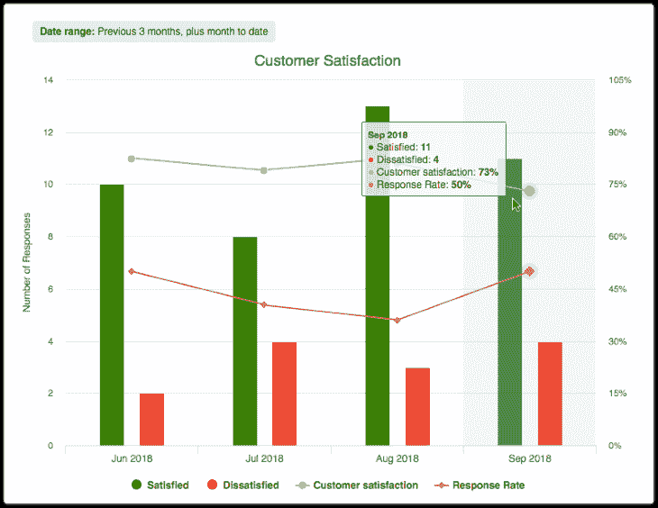

# 逐步进行 UX 基准研究

> 原文：<https://blog.logrocket.com/ux-design/conducting-ux-benchmarking-study/>

UX 标杆管理是根据利益相关者接受的标准或通用标准来评估公司或网站绩效的过程。这一过程通常被推广到 UX 基准研究，一种总结性评估，处理公司内部相对绩效的分析，以衡量其成功。

如果你在这里，你可能正在寻求帮助进行你自己的研究。我将详细解释 UX 标杆管理，以了解一家公司何时需要它，并分解这个复杂的过程，概述其成功适应所需的步骤。

## 目录

## 基准研究

基准研究侧重于以下几点:

*   将从比较分析中收集的具体数据应用到标准中
*   这些数据对您的特定网站和产品的可用性
*   考虑到不断变化的环境，它的相关性
*   你的目标受众
*   您根据这些数据提供所需内容的技术能力
*   贵公司的目标

一般来说，标杆管理侧重于对合理标准的比较评估。我故意用了“合理”这个词，因为公司可能会处理没有通用标准的数据，但可以识别行业内的模式和趋势，作为评估的指南。

## 在 UX 的背景下，标杆管理意味着什么？

UX 基准研究是一项复杂的任务，你应该从不同的角度来解决。

在 UX，我们根据定性和定量数据评估公司或产品的表现。考虑到定性数据是主观的，我们需要考虑公司的最终目标，调查我们观察到的任何行为模式。我们这样做是为了总结公司的成败或公司内部的变化。

## UX 什么时候开始使用标杆管理？

在以下情况下，基准测试是必要的:

*   投资回报率(ROI)低于股东的目标
*   UX 指标表明用户体验不佳
*   在产品发生特定变化后，衡量公司或 UX 团队的绩效
*   市场变化改变了竞争的本质
*   由于创新、法律变化、行业平均表现等原因，行业标准中出现了新的范式。

换句话说，如果公司想展示自己的优势或了解自己的弱点、机会和威胁，它应该进行 UX 基准。

标杆管理始终是公司绩效优化和改进的更大过程的一部分。企业在多变的环境中运营，创新和新的竞争对手不断出现在市场上；因此，一个发展中的公司总是会有一个活跃的 UX 专家团队，他们全职工作来更新公司的设计，并跟踪客户不断变化的行为模式。

## UX 基准研究:分步指南

### 步骤 0:开始基准测试所需的 UX 数据

UX 基准测试过程的复杂性不应该阻止你定期进行。公司规模越大，就越难发现弱点，因为公司业绩涉及的变量越多。

然而，提高 UX 绩效的第一步依赖于对所涉及的定性和定量变量进行广泛的背景研究。

为了一个成功的开端，UX 团队应该通过收集贵公司可用的所有相关 UX 数据来确定他们正在处理的问题。您可以将它分为定性和定量:

*   **定量**:
    *   任务时间—用户参与网站、完成特定任务的平均时间
    *   转换率—转换率占网站访问者总数的百分比
    *   错误率——误导用户或导致网站交互失败的技术障碍
    *   完成率—用户完成的任务占总尝试次数的百分比
    *   参与度——用户在网站上的一系列行为(浏览、点击、分享等)。)
    *   保留率——在与公司第一次互动后，回访用户的百分比
*   **定性**:
    *   客户满意度得分(CSAT) —基于用户满意度的忠诚度指标
    *   系统可用性等级(SUS)——客户对网站可用性的评估
    *   净推广者得分(NPS)——用户推荐他人分享他们从公司获得的经验的意愿
    *   客户努力分数(CES)——衡量用户在与产品互动时所付出的努力
    *   任何其他行为数据，不是用数字来衡量的，但可以在 UX 环境中使用

收集所有数据通常被称为 UX 审计，并不限于我提到的变量。所有的测量都是理解更大图景的一部分:当观众与网站互动时，他们经历了什么。您可以进一步解读原始数据，发现问题和威胁，并通过瞄准薄弱环节创造增长机会。

#### 专业人士如何收集数据？

我提到的定量数据通常是由专业人士使用类似于 [Google Analytics](https://analytics.google.com/) 或 [LogRocket](https://logrocket.com/) 的工具测量的。这些工具提供了网站用户行为的所有统计数据，以及用户行为路线图。路线图意味着工具在网站上显示客户的确切活动。

Source: [Search Engine Journal](https://www.searchenginejournal.com/google-analytics-user-behavior/202964/)

你应该用公司的销售统计数据来进一步支持一些数据；客户端的总数；订购的客户占访问付款页面的所有用户的百分比；与一次性用户相比，多次订购的客户数量等。

这种数据唯一的弱点是，它没有显示客户离开特定页面、在不同页面上花费更少时间、不转换等等的原因。回答这些问题是 UX 和 UI 团队的任务，因为他们分析他们获得的数字之间的相关性。

上述定性数据总是通过使用问卷调查或[用户访谈](https://blog.logrocket.com/ux-design/mastering-ux-user-interviews/)直接联系客户来衡量。虽然 CSAT、单一系统、非标准系统和消费电子产品通常通过问卷形式进行测量，但访谈旨在收集一些更深入、更详细的解释行为数据。例如，客户反馈表可以阐明用户是否喜欢该服务，并给它一个从 1 到 5 的分数。在这种情况下，访谈将帮助你准确理解他们为什么喜欢或不喜欢这项服务，并了解用户在客户旅程的哪个阶段会有不满意的体验。

### 步骤 1:使用 UX 审计确定行为和态度问题

使用上面提到的在 UX 审计期间收集的数据，UX 的专业人员应该努力寻找解释客户行为的模式，并发现改善他们体验的方法。可能对公司业绩构成威胁的[行为和态度](https://blog.logrocket.com/ux-design/using-behavioral-attitudinal-data/)模式可以总结如下:

*   **态度**:
    *   网站内部的技术问题
    *   如果转化率、满意率、流量和保留率低于基准标准，则通过更深入的分析解释定量数据
    *   过时的材料
    *   可访问性和可用性的问题
*   **行为**:
    *   构建客户行动路线图可能会揭示影响其选择的障碍
    *   通过问卷调查和访谈收集的定性数据可能会引起关注并发现弱点

因此，UX 审计的结果可能更具体，但通常属于已确定的一些类别。在采取下一步行动之前，你的 UX 团队应该概述你的所有发现。这样的大纲是下一个基准步骤的基础。

### 第二步:定义你所期待的标准

根据定义，基准测试过程依赖于与预定义标准的比较。然而，可能没有通用的标准让你公司的每个人都遵循，这意味着公司必须自己寻找可靠的标准。有四种类型的标准可用于 UX 基准测试:

*   产品性能数据——在推出新产品或实施变更之前，公司拥有的定性和定量 UX 指标。例如，在对产品进行最新更改之前，满意率为 3.5/5，而在更新之后，满意率增加到 3.75/5
*   竞争对手的表现—可用的行业最佳实践及其结果。例如，你当前的转换率是 1%，而你的主要竞争对手是 5%
*   公司的目标——利益相关者设定的标准。例如，你的平均留存率是 10%，而投资者希望达到 20%
*   行业绩效——一组竞争对手之间的平均比率。例如，您的 SUS 比率是 2.7/5，而十个主要竞争对手的平均比率是 4.1/5

### 第三步:分析比较结果并提出解决方案

确定标准后，下一步是比较您当前的 UX 指标，并找到提高绩效的解决方案。根据不同的标准，试着问自己这些问题:

*   如果您分析了产品性能数据:
    *   是否存在导致问题的技术问题？
    *   产品的变化导致了问题吗？
    *   产品变更解决了它要解决的问题了吗？
    *   如何解决表现不佳/表现更好的问题？
*   竞争对手的表现:
    *   他们在哪些方面做得更好，如何做？
    *   他们的输入数据有何不同(例如，目标受众)？
    *   如果你的结果更好，怎样做才能达到他们的结果/扩大你的结果之间的差距？
*   公司的目标:
    *   我们的目标是什么，为什么？
    *   根据竞争对手的表现，这是可以实现的吗？
    *   改变会带来更高的回报吗？
    *   怎样做才能让利益相关者满意？
*   行业平均表现:
    *   获取的数据可靠吗？
    *   在其他人的表现中可以发现哪些导致更好结果的模式？
    *   怎样做才能提升你的网站？

### 第四步:实施变革

回答为什么别人的表现比你的好或差，是理解可以为公司发展做些什么的关键。如果标准低于你的衡量标准，努力扩大结果之间的差距，追求完美。如果其他人做得更好——分析为什么会发生这种情况，找出要解决的弱点，并找到超越他们的机会。

你的公司必须总是测试新事物，因为市场瞬息万变，保持更新是成为或保持行业第一的关键。

### 步骤 5:收集感兴趣的 UX 度量的变更后结果

如果对标正确，结果的积极变化是不可避免的。您提出的解决方案在实施后将使公司受益，但前提是设计团队正确地进行了因果分析和用户测试。

为了确认所采取的措施是否执行良好，进行变更后的 UX 审计，并发现结果的波动。在实施过程之后，设计团队检查主要的 UX 指标，跟踪它们是否有所改进，并将它们与基准测试标准进行比较。

### 第六步:想象并报告发现

我们做基准研究是为了达到特定的目的。必须对获得的数据进行结构化和进一步分析；这就是为什么使用图表和信息图来可视化数据以吸引利益相关者是很重要的。如果您的标准是基于利益相关者的期望，那么这样的实践尤其相关。最终报告必须包含以下内容:

*   已实现的结果与以前的结果以及设定的标准
*   基于实施后数据对表现不佳的结果(如果有)进行评估
*   为在未来取得更好的结果而进行的额外调整
*   利益相关者可以检查以确认所提交数据的参考资料和数据证明

Source: [4me](https://www.4me.com/blog/customer-satisfaction-reports/)

### 第七步:记录经验教训

任何基于适当基准的结果都是宝贵的经验。分析您的案例并保存它们以供将来参考是成功执行的关键。

如果改变没有提供预期的结果，这种情况可能会防止将来出现类似的错误。如果项目成功，该公司可能会详细说明研究结果，并研究可能的方式来获得更多的利益。

标杆管理不仅仅是衡量成功，因为负面结果也可以用来在其他领域寻找机会，并防止未来在失败的项目上超支。

### 第八步:重新开始循环

完美无止境。考虑到不断变化的环境，甚至考虑到客户概况以及用户行为会随着时间的推移而变化，瞄准不断变化的需求始终是非常重要的。因此，UX 设计团队应该始终致力于新的解决方案，以提高用户满意度，对客户的反馈做出反应，并跟踪他们的行为，以根据转移的数据更新公司。

## [LogRocket](https://lp.logrocket.com/blg/signup) :无需采访即可获得 UX 洞察的分析

[LogRocket](https://lp.logrocket.com/blg/signup) 让您可以回放用户的产品体验，以可视化竞争，了解影响采用的问题，并结合定性和定量数据，以便您可以创建令人惊叹的数字体验。

查看设计选择、交互和问题如何影响您的用户— [立即尝试 LogRocket】。](hhttps://lp.logrocket.com/blg/signup)