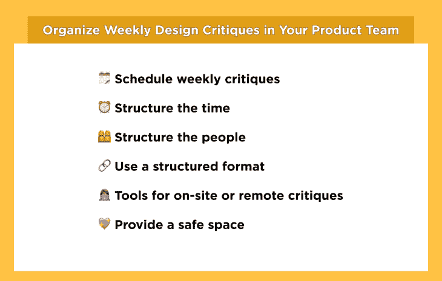
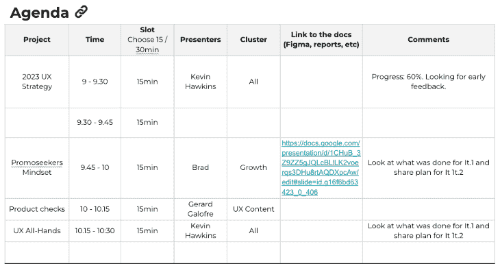
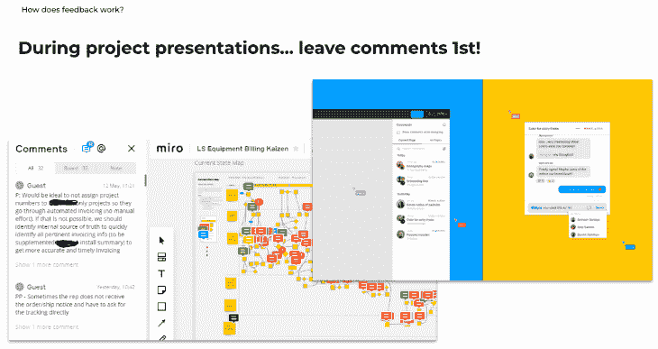
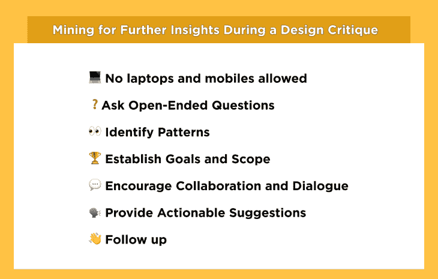

# 进行 UX 设计评论以获得有益的见解

> 原文：<https://blog.logrocket.com/ux-design/conducting-ux-design-critiques-helpful-insights/>

当设计一个问题的解决方案时，有两个重要的方面需要考虑:用户体验和用户界面。前者包括确保提议的流程和交互易于理解，并且任务可以快速完成。后者包括使用适当的视觉语言，使设计对用户友好，在视觉上吸引用户和品牌。

设计评论通常用于处理关于体验和视觉效果的建议。在某些情况下，也可以请求对其他主题的反馈，例如动画或信息架构。然而，这些评论通常是由一小部分人做出的，他们可能会因为对产品的现有知识而产生偏见。

当公司有财力，设计师有时间时，除了设计评论之外，进行用户测试也是很重要的。用户测试包括让大量参与者评估原型或开发的网站或应用程序，这可以为验证概念或进一步改进提供有价值的见解。

总之，在设计解决方案时，牢记用户体验和用户界面是至关重要的。虽然设计评论有助于解决提案的特定方面，但用户测试是在更大范围内验证和改进设计的有用工具。

为我们的用户创造最好的体验可能是具有挑战性的，这就是设计评论、用户测试和其他形式的研究来帮助我们创造用户友好的概念的地方。在本文中，我们将从个人经验和权威资源中探索设计评论中常用的协议。

## 什么是设计评论？

设计评论是一个协作的评审过程，在这个过程中，一群有经验的人，如产品经理、UX 设计师、视觉设计师和开发人员，聚集在一起评估设计的优点和缺点。评论的主要目的是收集可以改进设计的反馈，突出其优势，同时确定进一步发展的潜在领域。

评论可以在设计过程的任何阶段进行，从早期的概念化到最终的产品开发。在过程的早期进行评论可以更容易地根据收到的反馈实施改变。进行设计评论有不同的协议和方法，最佳方法取决于设计团队的具体需求和目标。然而，有一些通用的指导方针可以帮助确保评论是有效的。

## 如何组织每周的设计评论

正如我们提到的，设计评论允许设计师获得对他们工作的反馈，从而相应地改进工作。然而，安排设计评论可能具有挑战性，尤其是在远程和跨不同时区工作时。以下是一些创建有效设计评论的注意事项。

### 安排每周评论

为了给评论留出一个清晰的预定空间，在相关人员的日程表上安排每周或两周一次的设计评论是很重要的。我建议每周花在评论上的时间不要超过三四个小时，因为如果我们让团队过多地接触多个概念，这会让他们精疲力竭。

### 安排时间

在每个评论时段，重要的是指定每个人有时间陈述他们面临的问题，并有足够的时间收集反馈。注意时间，因为每个人都需要时间来陈述。我建议每个人不要花超过三十分钟的时间，只要批评变得重复。

### 组织人民

我们都参加过超过 10 人的评论，我们都认为这是浪费时间，因为人们会分心，而且不是每个人都能参与进来。创建两到八人的小组。没有神奇的数字，但是参与的人多了，分散注意力的机会就多了。

### 使用结构化格式

重要的是，首先要解释你面临的问题，然后解释解决问题的建议方案，最后询问你试图从会议中收集的反馈。将大部分时间留给反馈。有些评论可能需要不同的结构，所以如果你需要一个更具协作性的方法，请注意使用任何格式。

### 现场或远程评论工具

如果你是远程工作还是现场工作，准备好评论会议所需的技术或工具很重要。使用白板、便笺或其他工具进行现场评论，或使用 Miro、FigJam 或 User Zoom 等软件进行远程评论。

### 提供一个安全的空间

对于在一个项目上花费和投入大量精力的设计师来说，评论可能是敏感的。因此，创造一个安全的空间，在那里以良好的方式和建设性的方法提供反馈。这是商业文化可以大放异彩的地方。

设计评论是产品开发过程中必不可少的一部分，定期安排它们对于保持团队一致和确保设计朝着正确的方向发展至关重要。通过设定明确的期望，使用结构化的格式，并为反馈创造一个安全的空间，您可以充分利用您的设计评论会议，并帮助您的团队产生更好的设计。

## 对设计评论的剖析

### 角色

设计评论的基本结构包括两个对话者:演讲者(需要反馈)和批评家(其他团队成员):

1.  演讲者是提出设计问题并提出解决方案的人。提议的解决方案可以采取各种形式，例如设计概念、模型或原型。演讲者的角色是清楚地传达他们的解决方案，并提供足够的背景来帮助批评者理解他们试图解决的问题。演讲者也应该思想开放，愿意接受反馈，而不是针对个人的批评
2.  批评者是评估提议的解决方案并提供反馈的其他团队成员。他们的角色是提供建设性的批评，帮助演讲者完善和改进他们的解决方案。在评论过程中，评论者应该分析设计，找出它的优点和缺点，并提出改进的地方。反馈应该是具体的、可操作的，并且集中在设计的预期目的和它试图解决的问题上

### 导言

#### 演讲者的介绍

设计师应该从介绍问题开始，然后是设计和它的目的。提供与项目相关的任何相关信息至关重要。最后，明确所需的反馈类型是很重要的，比如评估用户界面而不是用户体验。

##### 问题陈述模板

在演示者的介绍之后，重要的是要形成一个问题陈述，强调你正在寻找的反馈。下面是一个在你的介绍中使用的结构化引用的例子。

#### 小组评估时间

团队需要时间来审查概念和评估提案。重要的是要考虑美观，以及设计是否提供了问题的解决方案，是否满足目标受众的需求。

### 反馈

即使反馈是由单个团队成员提供的，所有团队成员之间也有可能进行短暂的辩论和思考。下面是一个典型的反馈示例:

#### 集团的优势评估

确定设计优势，并讨论您认为提案中的优点。具体用真实的例子来说明你的观点。重要的是始终从优势开始，创造一个安全的改进空间。

#### 小组对弱点的评估

在讨论了积极的方面之后，是时候确定需要改进的地方了。解释你认为没有充分发挥作用的东西，以及为什么它没有效果。再次用真实的例子来说明你的观点，并提出可能的解决方案。

#### 小组对改进的评估

最后，小组成员可能已经想到了演讲者可能没有想到的可能的解决方案和替代方案。为了更好地满足项目目标和需求，跳出框框思考是至关重要的。

#### 记录演讲者的反馈

在设计评审期间收集所有反馈以避免遗漏任何要点是很重要的。文档可能包括会议期间收集的笔记、照片、草图和其他视觉材料。

反馈将帮助演示者创建提案和最终设计概念。反馈通常由发言者或演示者捕捉；你可以使用一个真正的或数字记事本，一个录音软件，或任何其他你选择的选项。如果说话者认为他们将会忙于谈话，他可以请第三个人帮忙做笔记。

### 下一步是什么？

批判之后，设计师必须整理笔记，创造图案；然后重要的是创建一个行动点列表来完善概念；如果需要的话，如果还有什么遗漏的地方，演示者可以要求事后反馈。如果设计师需要来自团队的更多反馈，可能会安排第二次设计评论会议。

## 在设计评论中挖掘进一步的见解

### 不允许携带笔记本电脑和手机

在设计评论会议期间，将设备存放在某个地方以避免分心是很重要的；我们都知道很容易分心，所以我们希望将全部注意力放在演讲者身上，而不是浏览社交媒体或其他内容。

### 问开放式的问题

在设计评论期间，鼓励团队成员提供更详细的反馈是至关重要的。要做到这一点，你可以问一些开放式的问题，以便进行深入的讨论。这些问题应该旨在揭示用户可能期望什么，或者可以做哪些不同的事情来改进设计。通过提出开放式问题，您可以从团队成员那里获得更详细的反馈，这有助于确定潜在的改进领域。

### 识别模式

当进行设计评论时，在团队不同成员提供的反馈中寻找模式是很重要的。如果您从不同的人那里识别出模式，这可能意味着有一个明确的痛点需要解决。通过识别模式，您可以更好地理解设计中需要改进的地方。

### 建立目标和范围

为了确保设计评论是有成效的，重要的是要建立评论的目标，并清楚地传达给团队。这有助于确保每个人都理解项目的范围和他们试图解决的具体问题。通过这样做，团队成员可以提供与设计改进相关的反馈。通过了解项目的范围，团队成员可以避免提供与设计改进无关的反馈。

### 鼓励合作和对话

设计评论是不同利益相关者之间开放的双向对话，因此参与对话以揭示问题并获得“打破常规”的想法非常重要。在设计评论期间，应该鼓励团队成员合作并参与对话。这有助于发现问题并产生创新的想法。通过参与对话，团队成员可以更好地理解设计，并提供更深入的反馈。

### 提供可行的建议

设计评论的关键目标之一是提供建设性的反馈，帮助改进设计。反馈应该是具体的、可操作的，旨在帮助设计团队做出改进。提供可行的建议对于提供建设性的反馈至关重要。现实生活中的例子和具体建议可以帮助演示者改进概念。通过提供可行的建议，团队成员可以帮助改进设计，并确保它满足最终用户的需求。

### 追踪

会议结束后，有必要跟进并确保设计师获得所有必要的支持，以便根据需要进行改进。这可能包括提供澄清和进一步的反馈。通过跟进，您可以为设计师提供必要的支持，并确保设计满足最终用户的需求。

## 综上

总之，设计评论是一个有价值的工具，可以帮助提高设计质量，并确保它满足最终用户的需求。通过实现本文中讨论的技巧，团队成员可以提供建设性的反馈，帮助设计团队进行改进。

关键是鼓励协作，提供可行的建议，并为项目建立明确的目标和范围。通过这样做，团队成员可以确定潜在的改进领域，解决棘手问题，并最终创建更好的设计。

评论会议是产品开发过程的一个重要组成部分，它提供了有价值的反馈，有助于确保设计满足用户需求，美观，并符合业务目标。通过安排定期反馈会议，团队可以确保设计保持在正确的轨道上，并与项目的目标保持一致，从而产生更好的设计。重要的是，通过使用结构化的格式，创建安全的反馈空间，并确保每个人都有机会参与，来有效地组织评论会议。

虽然设计评论有助于识别优点和缺点，但是用户测试对于在更大范围内验证和改进设计也是至关重要的。

总之，有效的设计评论会产生快速而有洞察力的反馈，从而改进设计，创造出满足用户需求和期望的产品。

*标题图片来源:* [图标侦察](https://iconscout.com)

## [LogRocket](https://lp.logrocket.com/blg/signup) :无需采访即可获得 UX 洞察的分析

[LogRocket](https://lp.logrocket.com/blg/signup) 让您可以回放用户的产品体验，以可视化竞争，了解影响采用的问题，并结合定性和定量数据，以便您可以创建令人惊叹的数字体验。

查看设计选择、交互和问题如何影响您的用户— [立即尝试 LogRocket】。](hhttps://lp.logrocket.com/blg/signup)