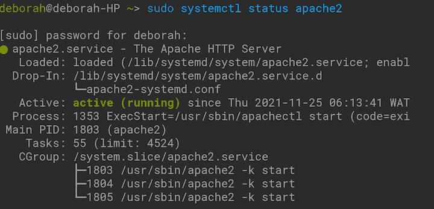
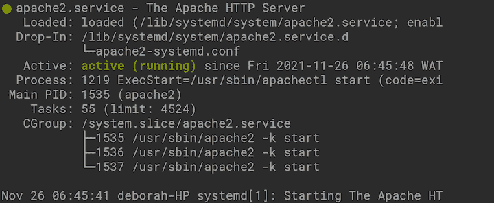
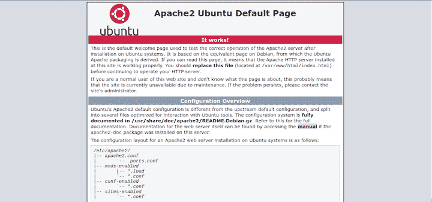
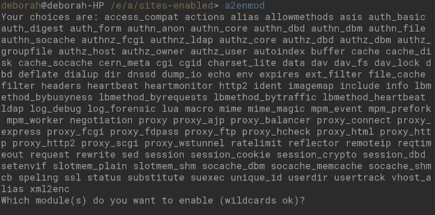
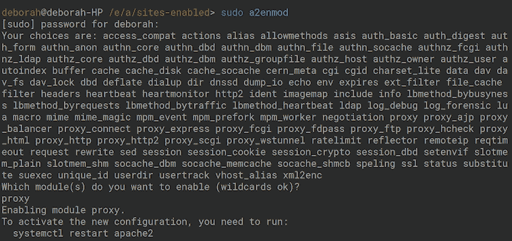
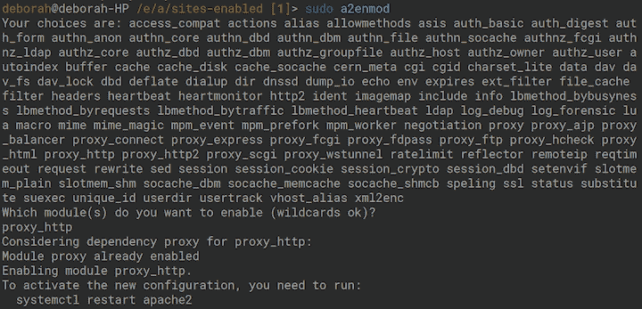
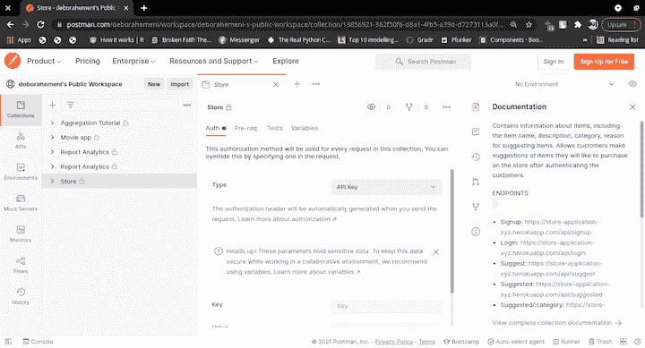

# 为 Node.js 配置 Apache-log rocket 博客

> 原文：<https://blog.logrocket.com/configuring-apache-for-node-js/>

在所有垂直行业中，网站表现和用户参与度之间存在[相关性。拥有一个能够处理高流量、快速响应请求并降低网络风险的服务器解决方案有利于提高客户满意度并留住客户。](https://www.thinkwithgoogle.com/_qs/documents/7353/Mobile_Site_Speed_Playbook.pdf)

Apache 是一种流行的开源服务器，它为提高应用程序的性能和安全性提供了许多好处。超过 30%的网站使用 Apache，包括 T2 的许多知名公司，如 Slack、纽约时报和 LinkedIn。

在本文中，我们将研究 Apache 给 Node.js 应用程序带来的一些好处。我们还将通过一个带有工作代码示例的教程来演示如何为节点应用程序配置 Apache。

## 先决条件

*   Node.js 和 npm 的最新版本
*   用于安装包和测试代码的终端
*   VS 代码，或者你最喜欢的代码编辑器

> ***注意:**，本文的教程部分是使用 Ubuntu 18.04 操作系统和 Node.js v14.17.6 开发的。*

我们开始吧！

## 为 Node.js 配置 Apache 的好处

Apache 为节点应用程序提供了三个核心优势:

让我们探讨一下每项优势的使用案例。

### 贮藏

当一个应用程序的内容加载速度很快时，它更有可能留住用户。缓存通过节省带宽和提高应用程序的速度来提高应用程序的性能。每当节点应用程序同时收到对同一静态内容的多个请求时，缓存是必不可少的。

通过为节点应用程序配置 Apache，我们允许 Apache 服务器安装静态内容。当将来有对相同内容的请求时，响应将直接来自 Apache，而不是来自应用程序的服务器。

### 负载平衡

一个高性能的应用程序必须随时可供用户使用，即使在它扩展时也是如此。负载平衡通过将传入的请求分布在多个服务器上来提高应用程序的响应能力。一个受欢迎的应用程序可能每秒收到数千个请求。通过为节点应用程序配置 Apache，我们允许 Apache 将多个事件分布到应用程序中的所有服务器上。

### 反向代理

确保您的应用程序免受病毒、恶意软件和其他网络风险的侵害非常重要。有了反向代理，Apache 可以被配置为充当防火墙或过滤器来过滤所有传入的请求。[反向代理有助于缓解一些安全威胁](https://blog.logrocket.com/how-a-proxy-server-works-in-node-js/)，比如 DDoS 攻击。反向代理的其他好处是改进用户请求管理和应用程序的 IP 地址和数据加密。

现在我们已经回顾了使用 Apache 服务器的好处，让我们安装并启动 Apache 服务器。

## 安装和启动 Apache 服务器

让我们通过运行以下命令来检查 Apache 是否已经安装在我们的系统上:

```
apache2 -v

```

这将显示当前安装的 Apache 版本:


如果当前没有安装 Apache，而您使用的是 Ubuntu 操作系统，请按照以下四个步骤在您的系统上安装`apache2`包:

1.  使用以下命令更新您的软件包存储库:

```
sudo apt-get update
```

2.  成功更新存储库后，通过运行以下命令安装 Apache:

```
sudo apt-get install apache2
```

3.  通过将 [http://127.0.0.1](http://127.0.0.1) 粘贴到您的浏览器中，检查 Apache 是否已正确安装。如果安装成功，您应该会看到以下默认页面:


接下来，使用以下命令检查您的 IP 地址:

```
ifconfig
```

如果您在浏览器中粘贴您的 IP 地址，您应该会在屏幕上看到相同的默认页面。

4.  Ubuntu 会在安装后自动启动 Apache 服务器。现在，确认`apache2`的状态:

```
sudo systemctl status apache2
```

状态屏幕应该确认 Apache 服务器已经启动并正在运行:



## 查看 Apache 服务器的基本命令

现在我们已经安装了 Apache 服务器(或者确认它已经安装了)，让我们回顾一些重要的命令:

重新启动 Apache 服务器:

```
sudo systemctl restart apache2

```

添加配置后重新加载 Apache 服务器:

```
sudo systemctl reload apache2

```

禁止 Apache 服务器在重新启动时自动启动:

```
sudo systemctl disable apache2

```

禁用 Apache 服务器后启用它:

```
sudo systemctl enable apache2

```

## 查看 Apache 服务器的基本内容和文件结构

让我们回顾一下 Apache 服务器的一些基本内容和文件。我们可以使用以下命令查看可用文件的列表:

```
ls /etc/apache2/

```

以下是输出结果:


`apache2.conf`文件包含 Apache 服务器的配置。

目录是我们可以创建 Apache 将运行的配置文件的地方。

`sites-enabled`目录包含到在`sites-available`目录中定义的配置文件的符号链接。

Apache 服务器将从`sites-enabled`目录加载文件，同时应用在`sites-available`目录中定义的配置。

`sites-enabled`和`sites-available`目录对于配置 Apache for Node 都是至关重要的。安装时，Apache 会自动在这些目录中创建默认文件。

要查看默认文件，`cd`进入`sites-available`目录:

现在，运行`ls`命令:


Terminal showing the default files available in the `sites-available` directory.

我们可以看到在`sites-available`目录中有两个默认的配置文件，`000-default-conf`和`default-ssl.conf`。

现在，让我们从`cd`进入`sites-enabled`目录:

```
cd ../sites-enabled
```

再次运行`ls`命令:


Terminal showing the content of the `sites-enabled` directory.

接下来，让我们设置节点应用程序！

## 设置 Node.js 应用程序

对于本教程，我们将使用一个 [Node.js 演示应用程序](https://github.com/debemenitammy/API_for_a_Store),它构建在带有 MongoDB 数据库的 Express.js 框架上。

以下是需要遵循的步骤:

1.  将[库](https://github.com/debemenitammy/API_for_a_Store)从 GitHub 克隆到您的本地系统。如果你不确定如何克隆一个回购协议，请查看 [GitHub 文档](https://docs.github.com/en/repositories/creating-and-managing-repositories/cloning-a-repository)
2.  用代码编辑器打开节点应用程序
3.  运行`npm install`命令

让我们从查看演示的`app.js`文件开始:

```
require('dotenv').config();
const express = require('express');
const app = express();
const mongoose = require('mongoose');
const cors = require('cors');
const bcrypt = require('bcrypt');
const bodyParser = require('body-parser');
const crypto = require('crypto');
const jwt = require('jsonwebtoken');
const authRoute = require('./routes/auth.route');
const suggestionRoute = require('./routes/suggestion.route');
const documentationRoute = require('./routes/documentation.route');
const port = process.env.PORT || 3000;
const corsOptions = {
    "origin": "*",
    optionsSuccessStatus: 200
}
//middlewares
app.use(cors(corsOptions));
app.use(bodyParser.json());
app.use(express.json());
//routes
app.use('/', documentationRoute);
app.use('/api', authRoute);
app.use('/api', suggestionRoute);
//Connection to mongoose
try {
    mongoose.connect(process.env.DB_CONNECTION, {
        useNewUrlParser: true,
        useUnifiedTopology: true,
        useFindAndModify: false,
        useCreateIndex: true
    }, () => console.log('Connected to DB'));
} catch (error) {
    console.log(`connection failed!! ${error}`)
}

app.listen(port, (() =>; console.log(`server started on port ${port}`)));

```

在`controllers`文件夹中，我们定义了`documentationRoute`。

然后我们在根请求上发送`documentationRoute`。

下面是节点应用程序的文件结构:


现在，让我们导航到`controllers`文件夹中的`documentation.controllers.js`文件并查看其内容:

```
exports.documentation = (request, response) => {
    response.redirect("https://explore.postman.com/templates/15198/store");
}

```

`exports.documentation`函数接受一个请求，并以一个到`postman` 的[节点 API 文档的链接作为响应。](https://www.postman.com/deborahemeni/workspace/deborahemeni-s-public-workspace/collection/13856921-362f50f6-d8a1-4fb5-a39d-d7273113a0fd?ctx=documentation)

这个节点应用程序构建在 MongoDB 上。我们需要创建自己的 MongoDB 集群来生成我们的 URI。

在代码编辑器中，我们创建一个`.env`文本配置文件来为我们的会话设置一个`DB_CONNECTION`字符串:

```
DB_CONNECTION = 

```

接下来，让我们测试应用程序，以确保它成功连接到数据库并且正在运行。

启动节点应用程序:

```
npm start

```

结果如下:


节点应用程序连接到数据库，并在`port 3000`上运行。

接下来，让我们为节点应用程序配置 Apache 服务器！

## 为 Node.js 配置 Apache

我们将重新配置 Apache 服务器监听`port 80`，并将所有请求重定向到运行在`port 3000`上的节点应用程序。

要为节点应用程序配置 Apache 服务器，我们将遵循以下步骤:

### 确认 Apache 服务器正在运行

首先，我们需要启动 Apache 服务器。如果您一直遵循本教程，Apache 服务器应该还在运行。如果是这种情况，只需运行以下命令:

```
sudo systemctl status apache2
```

您应该会看到以下输出:



Terminal showing the Apache server is running.

将`localhost`粘贴到浏览器中。如果 Apache 运行成功，将显示以下内容:



### 创建 Apache 配置文件

接下来，我们需要创建配置文件。首先，打开一个新的选项卡，将`cd`放入`sites-available`目录:

```
cd /etc/apache2/sites-available
```

现在，运行`ls`命令:


Terminal showing the default files available in the `sites-available` directory.

接下来，我们将打开默认配置文件`000-default.conf`进行编辑:

```
sudo nano 000-default.conf
```

下面是打开的默认配置文件:


Terminal showing the `000-default.conf` default configuration file.

`VirtualHost`使 Apache 服务器能够与多个域或主机名共享其资源。对配置的任何编辑必须在`VirtualHost`的开始和结束标签之间进行。参考 [Apache 文档](https://httpd.apache.org/docs/2.4/vhosts/examples.html)获取关于`VirtualHost`的更多信息。

Apache `VirtualHost`在`000-default.conf`文件中定义，并设置为监听`port 80`上的请求。

我们将配置`000-default.conf`文件，以便所有通过`port 80`进入的请求将被代理或转发到运行在`port 3000`上的节点应用程序。

我们使用`ProxyPass`将根 URL 映射到指定地址:`[http://localhost:3000](http://localhost:3000)`。

```
ProxyPass / http://localhost:3000/
```

将以下内容复制到`000-default.conf`文件中:


Terminal showing the `000-default.conf` default configuration file.

接下来，使用`Control+X`命令保存并退出。

### 启用`proxy`和`proxy_http`模块

为了让`ProxyPass`工作，我们必须启用作为网关的`proxy`和`proxy_http`模块，以允许请求的传递。

在`sites-enabled`目录中，运行以下命令:

```
sudo a2enmod
```

`a2enmod`是“Apache2 启用模块”的首字母缩写运行此命令将列出所有可启用的模块。

接下来，系统会提示我们输入想要启用的模块的名称:



`a2enmod` script running in the terminal.

我们在提示符下输入`proxy`来启用`proxy`模块:



`proxy` module enabled.

接下来，我们在提示符下输入`proxy_http`来启用`proxy_http`模块:



`proxy_http` module enabled.

值得注意的是，我们使用了`sudo`命令来运行`a2enmod`脚本。不带`sudo`命令运行`a2enmod`脚本将导致`Permission denied`错误:


Permission denied error.

### 应用配置

因为我们更改了配置文件，所以我们必须重新加载 Apache 服务器以便应用配置。

在`sites-enabled`目录中，使用以下命令重新加载`apache2`服务器:

```
sudo systemctl reload apache2
```

现在，使用这个命令来`stop`服务器:

```
sudo systemctl stop apache2
```

接下来，使用这个命令来`start`服务器:

```
sudo systemctl start apache2
```

### 测试配置

要检查 Apache 配置是否正确，请将`[http://localhost:80](http://localhost:80)`粘贴到浏览器窗口中。

如果配置应用成功，我们将看到显示的节点应用:


## 结论

在本文中，我们回顾了 Apache 服务器的一些优点、基本命令和文件结构。我们还演示了如何为节点应用程序配置 Apache 服务器，以提高性能和安全性。参见 Apache server [文档](https://httpd.apache.org/docs/2.4/)和 [Wiki](https://cwiki.apache.org/confluence/display/httpd/) 获取更多信息、提示和技巧。

## 200 只显示器出现故障，生产中网络请求缓慢

部署基于节点的 web 应用程序或网站是容易的部分。确保您的节点实例继续为您的应用程序提供资源是事情变得更加困难的地方。如果您对确保对后端或第三方服务的请求成功感兴趣，

[try LogRocket](https://lp.logrocket.com/blg/node-signup)

.

[](https://lp.logrocket.com/blg/node-signup)[https://logrocket.com/signup/](https://lp.logrocket.com/blg/node-signup)

LogRocket 就像是网络和移动应用程序的 DVR，记录下用户与你的应用程序交互时发生的一切。您可以汇总并报告有问题的网络请求，以快速了解根本原因，而不是猜测问题发生的原因。

LogRocket 检测您的应用程序以记录基线性能计时，如页面加载时间、到达第一个字节的时间、慢速网络请求，还记录 Redux、NgRx 和 Vuex 操作/状态。

[Start monitoring for free](https://lp.logrocket.com/blg/node-signup)

.