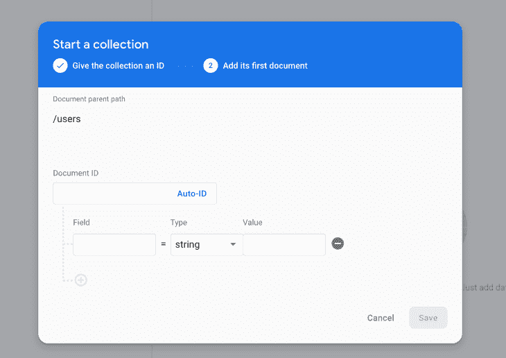
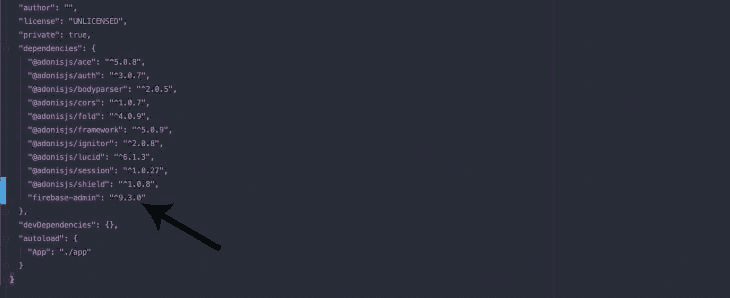
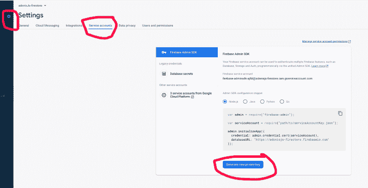
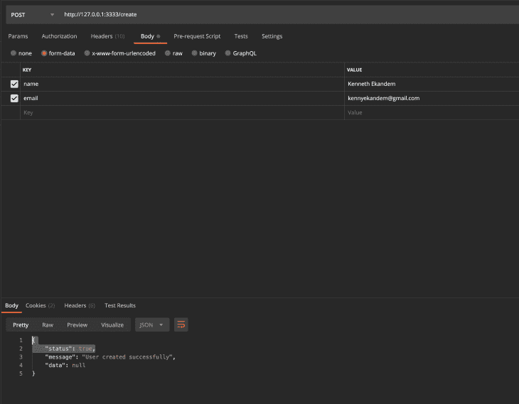
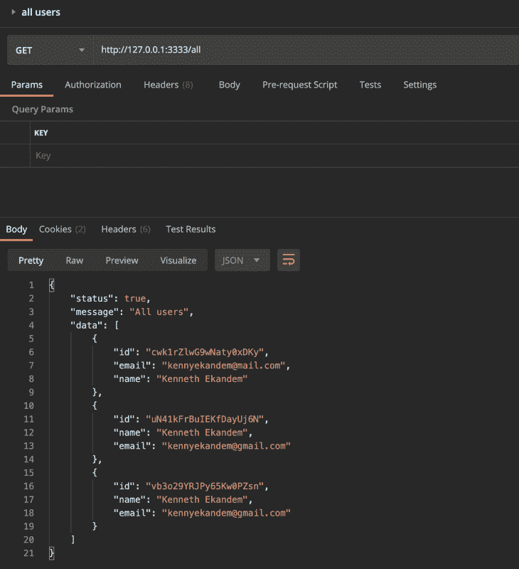
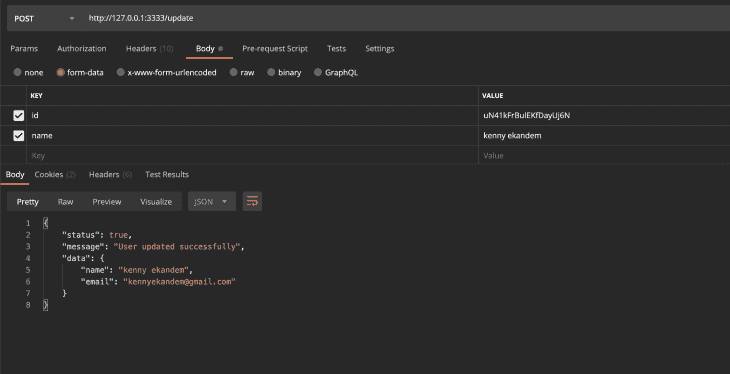
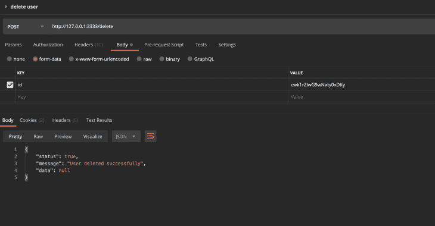

# 在 AdonisJs 中为 CRUD 请求配置云 Firestore

> 原文：<https://blog.logrocket.com/configuring-cloud-firestore-in-adonisjs-for-crud-requests/>

AdonisJs 是专门为编写微服务而构建的 Node.js 框架。对于从 PHP(通过 Laravel)迁移到 JavaScript 的开发人员来说，许多人认为它是最好的 JavaScript 框架。

像大多数 Node.js 框架一样，AdonisJs 有其内置的 CLI，并且默认支持 MVC 模式。AdonisJs 既支持 Postgres 这样的 SQL 数据库，也支持 Firebase 这样的 noSQL 数据库，这将是本教程的重点。

Cloud Firestore 是一个灵活、可扩展的数据库，用于 Firebase 和 Google 云平台的移动、web 和服务器开发。像 Firebase Realtime Database 一样，它通过实时监听器使您的数据在客户端应用程序之间保持同步，并为移动和 web 提供离线支持，因此您可以构建响应迅速的应用程序，无论网络延迟或互联网连接如何，都可以正常工作。

### 简介和先决条件

在本教程中，我们将:

*   创建和配置新的 Google Cloud Firestore
*   安装并设置新的 AdonisJs 应用程序
*   在 adonisjs 中为数据库存储配置 firestorm
*   发出 CRUD API 请求
*   测试我们的应用

为了跟随本教程，掌握 JavaScript 和 MVC 架构的基础知识是很重要的。在我们开始之前，你也可以查看这个项目的回购协议。

## 创建和配置谷歌云 firestorm

要开始，请转到 [Firebase 控制台](https://console.firebase.google.com/u/0/)并创建一个新项目。我将把我的命名为 adonisJs-firestore。

接下来，转到 **Cloud Firestore** 选项卡并创建一个新数据库:


一旦完成，Firestore 将要求我们创建一个新的集合，它只是一个文档列表。例如，我们可以有一个`users`集合来存储所有用户的信息，每个用户用一个文档表示。在我的例子中，我正在创建一个新的`users`收藏，其中字段为**姓名**和**电子邮件**。



## 安装和设置 AdonisJs

AdonisJs 是使用 Node 构建的，所以我们可以使用 npm 来安装和服务它。此处提供了安装指南[。我们将使用以下命令来安装 AdonisJs CLI:](https://adonisjs.com/docs/4.1/installation)

```
npm i -g adonisjs/cli

```

如果您不想全局安装 AdonisJs CLI，请从上面的命令中删除`-g`标志。

接下来，使用以下命令创建一个新的 AdonisJs 应用程序，项目名为 adonisJs-firestore:

```
adonis new adonisJs-firestore

```

当 AdonisJs 应用程序安装完成后，我们可以使用:

```
adonis serve --dev

```

这将在`[http://127.0.0.1:333](http://127.0.0.1:333)`上打开一个本地端口。

## 在 adonisjs 中配置 firestorm

要让 Firestore 在 AdonisJs 中工作，我们需要使用以下命令将 Firebase admin SDK 安装到 AdonisJs 应用程序中:

```
npm install firebase-admin --save

```

如果我们的安装成功，它将被添加到我们的`package.json`文件中，如下所示:



### 创建 firestorm 模型

我们将把 Firestore 数据模型存储在`app/Models/Firestore.js`文件中，所以让我们继续创建模型文件。

```
const Model = use('Model');

const admin = require('firebase-admin');

class Firestore extends Model {

}

module.exports = Firestore;

```

上面，我们创建了一个新模型，并需要我们之前安装的 Firebase admin SDK。下一步是初始化 Firestore 并获取我们的服务帐户凭证。

### 初始化火焰风暴

```
const Model = use('Model');

const admin = require('firebase-admin');

admin.initializeApp({
  credential: admin.credential.applicationDefault()
});

const db = admin.firestore();

class Firestore extends Model {

}

module.exports = Firestore;

```

上面，我们创建了一个名为`db`的常量变量，其值为`admin.firestore()`。我们将在特定的谷歌服务上使用这个调用。

因此，在这一点上，我们初始化了 Firestore，但我们还没有添加 Firestore 的应用程序凭证，以了解它指向哪个服务。我们还必须获得应用程序的用户许可。

现在，我们通过在 Firebase 控制台上的**设置** > **服务帐户**来获取我们的服务帐户凭证。



然后我们点击 **Generate new private key** 按钮来下载一个包含我们的服务帐户凭证的 JSON 文件。将下载的 JSON 文件复制到 AdonisJs 项目文件夹中，并将其放在文件夹根目录下。

完成后，我们需要在我们的 Firestore 模型中下载服务帐户凭证 *JSON 文件，并将凭证添加到我们的 Firestore 初始化中:*

```
const Model = use('Model');

const admin = require('firebase-admin');

const serviceAccount = require("../../adonisjs-firestore-firebase-adminsdk-ajfbl-6a02cfaeb1.json");

admin.initializeApp({
  credential: admin.credential.cert(serviceAccount),
  databaseURL: "https://adonisjs-firestore.firebaseio.com"
});

class Firestore extends Model {

  // call on firestore
  db() {
  return admin.firestore();
  }
}

module.exports = Firestore;

```

有几点需要注意:

1.  `databaseURL`很重要——它必须指向正确的数据库 URL。
2.  确保您的服务帐户正确地指向包含您的凭证的 JSON 文件。

## 发出 CRUD API 请求

我们已经在 AdonisJs 应用程序中完成了 Firestore 的安装和初始化。现在我们将编写一些 CRUD 请求。为此，我们需要:

*   创建一个包含 CRUD 请求的用户控制器
*   在我们的控制器中调用我们的 firestorm 模型
*   为我们的 API 创建链接到控制器的路径

要创建新的用户控制器，我们使用以下命令:

```
adonis make:controller UserController --type http

```

这将创建一个新文件，`UserController.js`:

```
// app/Controllers/Http/UserController.js
'use strict';

class UserController {
}

module.exports = UserController;

```

完成后，我们在控制器中调用我们的 Firestore 模型，使用我们的 admin SDK 进行请求:

```
'use strict';

const Firestore = use('App/Models/Firestore');
const firestore = new Firestore;
const db = firestore.db();

class UserController {
}

module.exports = UserController;

```

上面，我们调用了我们的模型，然后使用`db`函数来定位我们的 Firestore 服务。接下来，我们指向 Firestore 中要从中获取数据的集合:

```
'use strict';

const Firestore = use('App/Models/Firestore');
const firestore = new Firestore;
const db = firestore.db();

// Reference to
const userReference = db.collection('users');

class UserController {
}

module.exports = UserController;

```

指向 Firestore 中您要从中获取数据的特定收藏；在我们的例子中，是`users`。

现在让我们创建我们的 CRUD 函数。

### 1.创造

为了创建一个请求，我们在名为`create`的`UserController`中创建一个`async`函数，然后我们调用内置的`Validator`函数来检查请求参数是否被设置:

```
// app/Controllers/Http/UserController.js
const { validate } = use('Validator');

class UserController {

  async create({ request, response}) {

    const rules = {
      name: 'required',
      email: 'required'
    };

    const data = request.only(['name', 'email']);

    const validation = await validate(request.all(), rules);

    if (validation.fails()) {
      return response.status(206).json({
        status: false,
        message: validation.messages()[0].message,
        data: null
      });
    }
  }
}

```

为了让`Validator`工作，我们需要使用以下命令安装它:

```
adonis install adonisjs/validator

```

接下来，我们需要在`start/app.js`文件中注册提供者:

```
const providers = [
'@adonisjs/validator/providers/ValidatorProvider'
]

```

如果没有填写`rules`字段，`Validator`将抛出错误信息。接下来，我们添加 Firebase `create`功能:

```
let create = await userReference.add({
  name: data.name,
  email: data.email
});

if(create) {
  return response.status(201).json({
    status: true,
    message: 'User created successfully',
    data: null
  });
}

```

上面的代码将在 Firestore 的`users`集合中创建一个新文档，如果成功，则返回一个`201 Created`状态。

### 2.阅读

现在我们将创建我们的读取请求`all`，它将从`users`集合中获取所有用户。

```
async all({ response }) {

  let users = [];

  await userReference.get().then((snapshot) => {
    snapshot.forEach(doc => {
      let id = doc.id;
      let user = doc.data();

      users.push({
        id,
        ...user
      });
    })
  });

  return response.status(201).json({
    status: true,
    message: 'All users',
    data: users
  });
}

```

在上面的代码中，我们创建了一个空数组，我们将把 Firestore 中的数据推送到这个数组中。我们还引用了`users`集合并遍历它，然后将`id`和`data`推入我们的`users`数组。

### 3.更新

现在我们将创建一个函数来编辑`users`集合中的单个文档:

```
async update({ request, response }) {

  const rules = {
    id: 'required',
  };

  const data = request.only(['id', 'name', 'email']);

  const validation = await validate(request.all(), rules);

  if (validation.fails()) {
    return response.status(206).json({
      status: false,
      message: validation.messages()[0].message,
      data: null
    });
  }

  let getUser = await userReference.doc(data.id).get();
  let user = getUser.data();

  let update = await userReference.doc(data.id).update({
    name: data.name ? data.name : user.name,
    email: data.email ? data.email : user.email
  });

  if(update) {
    let getUser = await userReference.doc(data.id).get();
    let user = getUser.data();

    return response.status(201).json({
      status: true,
      message: 'User updated successfully',
      data: user
    });
  }
}

```

在上面的代码中，我们只验证了`id`，这意味着你可以选择不更新`name`或`email`。然后，我们从传递的`id`的`users`集合中获取一个用户文档，之后我们根据添加的内容更新我们的`name`或`email`。

* * *

### 更多来自 LogRocket 的精彩文章:

* * *

### 4.删除

我们已经成功地创建了创建、读取和更新请求函数。现在剩下的就是添加一个`delete`函数来从`users`集合中移除一个文档。

```
async delete({ request, response }) {

  const rules = {
    id: 'required',
  };

  const data = request.only(['id']);

  const validation = await validate(request.all(), rules);

  if (validation.fails()) {
    return response.status(206).json({
      status: false,
      message: validation.messages()[0].message,
      data: null
    });
  }

  await userReference.doc(data.id).delete();

  return response.status(201).json({
    status: true,
    message: 'User deleted successfully',
    data: null
  });
}

```

我们已经完成了 CRUD 请求的创建，所以现在我们创建将 API 链接到控制器函数的路由。为此，我们转到我们的 routes 文件`start/routes.js`:

```
// start/routes.js

'use strict'

const Route = use('Route')

Route.post('/create', 'UserController.create');
Route.get('/all', 'UserController.all');
Route.post('/update', 'UserController.update');
Route.post('/delete', 'UserController.delete');

```

因此，我们在`UserController`中添加了指向 CRUD 函数的路径。

## 测试我们的应用

为了便于测试，我们将使用 [Postman](https://www.postman.com/) 来处理我们的请求。Postman 是一个流行的 API 客户端，它使得开发人员可以轻松地创建、共享、测试和记录 API。

在我们继续之前，我们需要为我们的请求启用 CSRF(跨站点请求伪造)保护。这将通过拒绝未识别的请求来保护我们的应用程序免受 CSRF 攻击。

要启用它，我们只需使用以下命令安装 AdonisJs `shield`中间件:

```
adonis install adonisjs/shield

```

接下来，在`start/app.js`文件中注册提供者:

```
const providers = [
'@adonisjs/shield/providers/ShieldProvider'
]

```

在`start/kernel.js`文件中注册全局中间件:

```
const globalMiddleware = [
  'Adonis/Middleware/Shield'
]

```

最后，更新`config/shield.js`文件并编辑`csrf`对象:

```
csrf: {
  enable: false,
  methods: ['POST', 'PUT', 'DELETE'],
  filterUris: [],
  cookieOptions: {
    httpOnly: false,
    sameSite: true,
    path: '/',
    maxAge: 7200
  }
}

```

现在在 postman 中添加一个新的请求来创建一个新用户，该用户将在`UserController`中调用我们的`create`函数。

创建用户请求:



获取所有用户请求:



更新用户请求(我们将从所有用户请求获取的文档中获得一个`id`):



删除用户请求:



## 结论

我们已经成功构建了一组 API，它们使用 AdonisJs 和 Google Firebase Firestore 来创建、获取、存储和删除数据。我们还学习了在 AdonisJs 框架中将 Google Firestore 设置为数据库的基础知识。

我希望这是有帮助的，并且你现在理解在 AdonisJs 中设置 Firestore 的基础。您可以继续克隆 [repo](https://github.com/Kennethekandem/adonisJs-firestore.git) 并配置它供您自己使用。

## 200 只显示器出现故障，生产中网络请求缓慢

部署基于节点的 web 应用程序或网站是容易的部分。确保您的节点实例继续为您的应用程序提供资源是事情变得更加困难的地方。如果您对确保对后端或第三方服务的请求成功感兴趣，

[try LogRocket](https://lp.logrocket.com/blg/node-signup)

.

[](https://lp.logrocket.com/blg/node-signup)[https://logrocket.com/signup/](https://lp.logrocket.com/blg/node-signup)

LogRocket 就像是网络和移动应用程序的 DVR，记录下用户与你的应用程序交互时发生的一切。您可以汇总并报告有问题的网络请求，以快速了解根本原因，而不是猜测问题发生的原因。

LogRocket 检测您的应用程序以记录基线性能计时，如页面加载时间、到达第一个字节的时间、慢速网络请求，还记录 Redux、NgRx 和 Vuex 操作/状态。

[Start monitoring for free](https://lp.logrocket.com/blg/node-signup)

.*