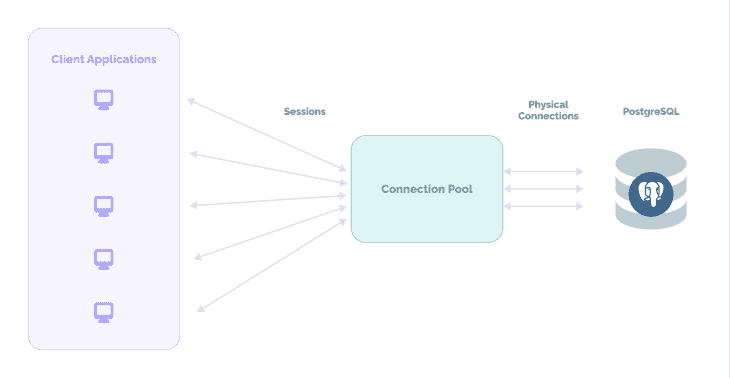
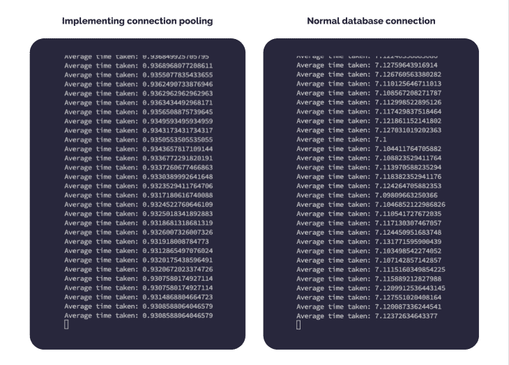

# Jamstack 应用程序中的连接池

> 原文：<https://blog.logrocket.com/connection-pooling-postgresql-jamstack-apps/>

为了构建现代的 web 应用程序，我们需要一个合适的数据库来提供应用程序数据。有许多数据库可供我们选择。在这篇文章中，我们将学习如何使用 PostgreSQL 作为我们的数据库来消费 Jamstack 应用程序所需的数据。

## 什么是 Jamstack？

> 基于客户端 JavaScript、可重用 API 和预建标记的现代 web 开发架构–马蒂亚斯·比尔曼，Netlify 首席执行官兼联合创始人

术语 [Jamstack](https://jamstack.org/) 代表 JavaScript、API 和标记，它是构建我们的应用程序的一种现代方式。Jamstack 应用程序将代码(应用程序)、基础设施(API)和内容(标记)分离在一个解耦的架构中处理，这意味着服务器端和客户端是分离的。

有可能通过 CDN 而不是运行生成动态内容的整体后端来构建统计服务的整个应用。但是这个应用程序是基于 API 的，理想的结果是更快的体验。

我们可以使用几个优秀的性能框架来利用 Jamstack 的优势。其中比较引人注目的有[混音](https://remix.run/)、[塞韦尔特基特](https://kit.svelte.dev/)、 [Nuxt](https://nuxtjs.org/) 、[下一个](https://nextjs.org/)、 [11ty](https://www.11ty.dev/) 、[盖茨比](https://www.gatsbyjs.com/)、[阿斯特罗](https://astro.build/)。

我们将使用 Next.js 构建一个简单的应用程序，然后使用 PostgreSQL 通过连接池提供数据。

## 在 Next.js 中设置项目

我们将使用 CLI 建立一个空白的 Next.js 项目。这将创建一个预配置的应用程序。

```
npx [email protected] --typescript

```

让我们将应用程序命名为`nextjs-pg-connection-pool`，然后添加必要的依赖项来开始查询我们的 Postgres 数据库。

```
npm i pg @types/pg

```

## 连接数据库

我们将连接到本地 Postgres 数据库并查询所需的数据。让我们使用 CLI 并输入以下内容:

```
psql Postgres

```

接下来，创建一个 Postgres 数据库的新实例，与本地机器中的数据库进行交互并列出该数据库。您也可以使用 AWS、Heroku 或 GCP 提供的免费 Postgres 数据库，并使用提供给您的连接字符串进行连接。

```
CREATE DATABASE employeedb
\l

```

我们可以成功地看到我们刚刚创建的数据库的名称。

为了开始通过我们的应用程序查询数据库，我们需要连接我们的应用程序和本地 Postgres 数据库。有多种方法可以做到这一点，比如使用 pgbouncer、pgcat、pgpool 等开源库。

对于本文，我们将使用最流行的 Postgres 连接客户端之一，名为 [node-postgres](https://node-postgres.com/) ，这是一个用纯 JavaScript 编写的 Node.js 的非阻塞 PostgreSQL 客户端。

当客户端连接到 PostgreSQL 数据库时，服务器会派生一个进程来处理该连接。我们的 PostgreSQL 数据库有一个固定的最大连接数，一旦达到上限，其他客户端将无法连接。

每个活动连接消耗大约 10MB 的 RAM。我们可以通过连接池来克服这些潜在的问题。

让我们看看两种方法:

1.  不使用连接池连接到本地 Postgres 数据库
2.  使用连接池，这让我们可以管理集群中每个数据库可以使用多少个进程。通过使用具有不同进程限制的多个连接池，我们可以根据需求对数据库进行优先级排序

## 使用 PostgreSQL 的连接池



连接池是一种创建连接池并缓存这些连接以便可以再次重用的方法。这是在查询请求之前处理数据库连接的最常见方法之一。

我们通常认为数据库连接很快，但是当我们需要连接到大量客户端时，情况并非如此。连接需要 35-50 毫秒，但是如果我们通过连接池方法连接，只需要 1-2 毫秒。通过连接池，我们预先分配数据库连接，并在新客户端连接时回收它们。

## 连接池的选项

连接池有几种主要类型:框架连接池、独立连接池和持久连接。然而，持久连接池实际上只是一种替代方法，充当连接池策略。

### 1.框架连接池

框架连接池发生在应用程序级别。当我们希望服务器脚本启动时，会建立一个连接池来处理稍后到达的查询请求。但是，这可能会受到连接数的限制，因为它可能会占用大量内存。

### 2.独立连接池

当我们分配 5-10MB 的内存来满足请求查询时，我们称之为独立连接池。它是针对 Postgres 会话、语句和事务进行配置的，使用这种方法的主要好处是每个连接大约 2KB 的最小开销。

### 3.持久连接池

这种类型的连接池使初始连接从初始化时就处于活动状态。它提供了一个不错的连续连接，但不完全支持连接池特性。

对于连接开销通常在 25-50 毫秒之间的一小组客户端来说，这是最有帮助的。这种方法的缺点是它限制了数据库连接的数量，通常每个服务器条目只有一个连接。

## 准备用于汇集的数据

至此，我们已经在本地创建了一个新的数据库，并将其命名为`employeedb`。但是我们在里面没有任何数据。让我们编写一个简单的查询来创建一个雇员表:

```
CREATE TABLE IF NOT EXISTS employees(
   id SERIAL PRIMARY KEY,
   name VARCHAR(100) UNIQUE NOT NULL,
   designation VARCHAR(200),
   created_on TIMESTAMP WITH TIME ZONE DEFAULT CURRENT_TIMESTAMP
);

```

我们还需要向我们创建的表中添加数据:

```
 INSERT INTO employees (name, designation)
 VALUES
 ('Ishan Manandhar', 'Designer and Developer'),
 ('Jane Doe', 'JamStack Developer'),
 ('Alfred Marshall', 'Content Writer'),
 ('John Doe', 'Product Designer'),
 ('Dave Howard', 'Security Analyst');

 SELECT * FROM employees;

```

现在，我们可以在下一个项目中创建一个新目录，并将其命名为`employeeold`:

```
../src/pages/api/employeeold

// creating a new connection and closing connection for each request
import type { NextApiRequest, NextApiResponse } from 'next';
import { Client } from "pg";

const employeeOld = async (req: NextApiRequest, res: NextApiResponse) => {
   const client = new Client({
       host: "localhost",
       user: "postgres",
       password: "postgres",
       database: "employeedb",
       port: 5432,
   });
   client.connect();
   const { method } = req;
   if (method === 'GET') {
       try {
           const query = await client.query('SELECT * FROM employees');
           res.status(200).json(query.rows);
           client.end();
           return
       }
       catch (err: any) {
           res.status(404).json({ message: 'Error: ' + err.message });
       }
   }
   else {
       res.status(404).json({ message: 'Method Not Allowed' });
   }
   client.end();
}

export default employeeOld;

```

这里，我们创建了一个新的端点，它可以查询我们数据库中的所有雇员列表。我们实现了一种普通的查询请求方式来建立到数据库的连接，而没有使用池。

* * *

### 更多来自 LogRocket 的精彩文章:

* * *

我们使用 [pg-pool](https://www.npmjs.com/package/pg-pool) 来创建一个新的连接，每次我们点击这个 API 时都会创建一个新的连接。我们还会关闭每次客户端请求数据时打开的连接。

以下是建立连接时涉及的步骤:

1.  打开到数据库的新连接
2.  验证数据库中的用户
3.  打开 TCP 套接字以读取和写入数据
4.  通过套接字读写数据
5.  关闭连接
6.  关闭套接字

每当用户请求数据时，连接到数据库的 web 应用程序将需要几毫秒的滞后响应。但是，当我们发出一个巨大的请求时，可能会花费更长的时间，尤其是当这些请求同时发出的时候。这种连接会消耗服务器的资源，从而导致数据库服务器过载。

最佳实践是预先创建固定数量的数据库连接，并在不同的任务中重用它们。当任务多于连接数时，它们应该被阻塞，直到有空闲的连接。这就是连接池发挥作用的地方。

注意:这可能不是连接池的理想情况。您可以在我们的下一个应用程序中取这个数据作为`getStaticProps`,但是在本文中，我们只想使用 Next.js 演示连接池。

## 使用连接池

通过`pg-pool`模块，[节点-postgres](https://www.npmjs.com/package/node-postgres) 库附带了内置的连接池。在创建新池的过程中，我们需要传入一个可选的`config`对象。当池创建客户机时，它被传递给池(并传递给池中的每个客户机实例)。

我们将仔细检查传入 config 对象的每个字段。你可以在这里找到文档[。](https://node-postgres.com/api/pool)

*   `connectionTimeoutMillis`:连接到新客户端时，超时前等待的毫秒数。默认情况下，超时设置为`0`
*   `max`:池应该包含的最大客户端数量，默认设置为`10`
*   `idleTimeOutMillis`:这是指客户端需要在池中空闲的毫秒时间。在它与后端断开连接并被忽略之前，它不会被检出。默认时间设置为`10`，但是我们可以将它设置为`0`来禁用空闲客户端的自动断开
*   `allowExitOnIdle`:一个布尔属性，当设置为`true,`时，将允许节点事件循环在池中的所有客户端空闲时立即退出，即使它们的套接字仍然打开。当我们不想在进程退出之前等待客户空闲时，这就很方便了

让我们在`api`文件夹中创建一个新文件并命名为`employeenew`，这是我们下一个预配置的安装文件夹`./src/pages/api/employeenew`:

```
import type { NextApiRequest, NextApiResponse } from 'next';
import { Pool } from "pg";
let connection: any;

if (!connection) {
   connection = new Pool({
       host: "localhost",
       user: "postgres",
       password: "postgres",
       database: "employeedb",
       port: 5432,
       max: 20,
       connectionTimeoutMillis: 0,
       idleTimeoutMillis: 0,
       allowExitOnIdle: true
   });
}

const employeeNew = async (req: NextApiRequest, res: NextApiResponse) => {
   const { method } = req;
   if (method === 'GET') {
       try {
           const query = await connection.query('SELECT * FROM employees');
           return res.status(200).json(query.rows);
       }
       catch (err: any) {
           res.status(404).json({ message: 'Error: ' + err.message });
       }
   }
   else {
       res.status(404).json({ message: 'Method Not Allowed' });
   }
}

export default employeeNew;

```

在这里，我们创建了一个新的端点，它可以查询数据库中的所有员工列表，并实现了一个连接池机制。我们已经预先打开了 20 个连接，这样我们可以避免连接打开和关闭的时间延迟问题。

## 性能比较

我们实现了两种连接机制来连接我们的 Postgres 数据库。出于演示的目的，我们实现了独立池，其中我们分配了一些最大连接数，释放了对传入请求的侦听，并预先分配了连接。当我们创建连接池类时，我们应该满足以下提高数据库性能的因素:

*   预先对连接进行预分配
*   监督可用的连接
*   分配新连接
*   等待连接可用
*   紧密联系

注意:在我们一次创建大量并发请求之前，我们可能看不到显著的性能差异。

为了在浏览器内部测试这一点，我们将打开我们的开发人员工具并添加以下代码行:

```
for (let i = 0; i < 2000; i++) fetch(`http://localhost:3000/api/employeesOld`).then(a=>a.json()).then(console.log).catch(console.error);
```

我们还需要用另一条路由测试我们的连接性能。

```
for (let i = 0; i < 2000; i++) fetch(`http://localhost:3000/api/employeesNew`).then(a=>a.json()).then(console.log).catch(console.error);
```

这里有一个快照，展示了这两种方法的性能比较。



## 为什么应该使用连接池

使用连接池有很多好处，尤其是在建立复杂连接时。例如，连接到一个新的客户端可能需要 20-30 毫秒，在此期间，协商密码、建立 SSL，以及与客户端和服务器共享配置信息，所有这些都会大大降低我们的应用程序性能。

您还应该记住，PostgreSQL 在一个连接的客户机上以先进先出的方式一次只能处理一个查询。如果我们有一个使用单个连接客户端的多租户应用程序，来自所有并发请求的所有查询都将在一个队列中，并按顺序逐一执行，这会大大降低性能。

最后，根据可用内存，PostgreSQL 一次只能处理有限数量的客户端。如果我们连接无限数量的客户端，我们的 PostgreSQL 甚至可能会崩溃。

## PostgreSQL 何时使用连接池

如果我们的数据库:

*   处理大量空闲连接
*   由于最大连接限制，断开连接
*   当多个用户需要同时共享连接时
*   高 CPU 使用率导致的性能问题
*   提高连接速度
*   节省资源和资金

## 结论

打开我们的数据库连接是一个昂贵的操作。在我们构建的现代 web 应用程序中，我们倾向于打开许多连接，这会导致资源和内存的浪费。

连接池是一个重要的特性，它确保关闭的连接不是真正关闭的，而是返回到池中，并且打开一个新的连接会返回相同的物理连接，从而减少数据库上的分叉任务。

在连接池的帮助下，我们可以减少数据库在给定时间内必须处理的进程数量。这可以释放连接到我们的数据库所需的资源，并提高连接到数据库的速度。

在这里找到连接池[的代码实现。编码快乐！](https://github.com/ishan-me/nextjs-pg-connection-pool)

## 使用 [LogRocket](https://lp.logrocket.com/blg/signup) 消除传统错误报告的干扰

[](https://lp.logrocket.com/blg/signup)

[LogRocket](https://lp.logrocket.com/blg/signup) 是一个数字体验分析解决方案，它可以保护您免受数百个假阳性错误警报的影响，只针对几个真正重要的项目。LogRocket 会告诉您应用程序中实际影响用户的最具影响力的 bug 和 UX 问题。

然后，使用具有深层技术遥测的会话重放来确切地查看用户看到了什么以及是什么导致了问题，就像你在他们身后看一样。

LogRocket 自动聚合客户端错误、JS 异常、前端性能指标和用户交互。然后 LogRocket 使用机器学习来告诉你哪些问题正在影响大多数用户，并提供你需要修复它的上下文。

关注重要的 bug—[今天就试试 LogRocket】。](https://lp.logrocket.com/blg/signup-issue-free)