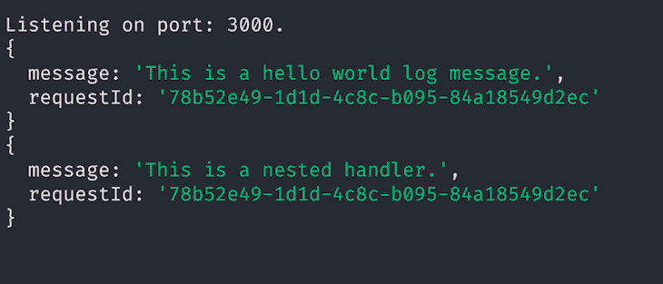

# Node.js - LogRocket 博客中的上下文感知日志记录

> 原文：<https://blog.logrocket.com/context-aware-logging-node-js/>

良好的应用程序监控的一个最基本的要求是拥有健壮的日志记录来跟踪正在发生的一切。然而，日志消息本身只能告诉我们这么多。看到一条日志消息表明一个视频已经被上传是有信息的，但是通常我们也想知道这个“事件”的一些上下文

每个日志消息中应该包含的最基本的上下文信息是请求标识符。能够将单个请求产生的所有日志分组在一起，使我们能够轻松地跟踪其生命周期并监视其在不同阶段的行为。上下文还可以包括当前通过身份验证的用户的 ID 和发送日志的位置，比如`UserService`，等等。

## 跟踪请求的基本方法，以及为什么这些方法还不够

让我们看一下如何将请求标识符附加到由 Express.js 应用程序创建的每个日志中。如果想直接上码，可以[在这里](https://github.com/maciejcieslar/cls)找回购。

最直接的方法是给请求附加一个 ID，并在任何地方使用它，就像这样:

```
req.id = uuid.v4();
```

然后手动将其附加到处理程序中的日志:

```
// handler
logger.log('This is a log from the handler for the request with id:', req.id)
```

乍一看，这似乎是一个好的解决方案，尽管有点乏味和重复。

手动将`req.id`附加到每个日志会是重复的，是的，但是有人会说它最终会被一个对象所取代，然后这个对象可以很容易地被 log 方法格式化:

```
logger.log('This is a log from the handler for the request', { requestId: req.id })
```

通过将这个“context”对象作为第二个参数传递，我们可以将它自动附加到日志消息中。然而，当我们试图记录来自无权访问请求对象的函数的消息时，问题就更加明显了:

```
app.use((req) => createUser())

function createUser() { logger.log('User created!', {}) }
```

`createUser`函数不知道哪个请求导致了它的执行。

这个问题可以通过将“上下文”参数传递给`createUser`函数来解决，但是这解决不了任何问题。如果有另一个函数被`createUser`调用了呢？所有必须记录内容的函数都必须接受这个“上下文”参数，结果导致代码混乱。

相反，更好的解决方案是让日志记录器知道这个传入的日志消息是由一个处理给定 ID 的请求的处理程序调用的。有了这个“上下文感知”记录器，我们就不必担心传递上下文对象，并直接在`logger.log`方法中获得所有必要的信息。该信息可以自动附加到每个传出的日志消息中。

尽管许多开发人员可能不熟悉这一特性，但 Node 允许我们通过使用 Node 8 中引入的一个名为[异步挂钩](https://nodejs.org/api/async_hooks.html)的特性来跟踪函数调用的“链”,包括同步调用和异步调用。

虽然您可能会认为该特性已经成熟，因为它已经存在了很长时间，但实际上从 Node 15 开始，它仍然被认为是试验性的。不过，没必要担心——一个名为 [cls-hooked](https://github.com/Jeff-Lewis/cls-hooked) 的库比异步挂钩存在的时间还要长，它为创建和跟踪通过一系列函数调用传播的异步上下文提供了一致且稳定的 API。

一系列函数调用是一种奇特的说法，即有一个函数`one()`，它调用函数`two()`，然后调用一系列其他函数。所以它就像是同步和异步函数的函数调用栈。

让我们看看如何使用 cls-hooked 创建和管理异步上下文。

## 在节点中使用 cls-hooked 进行上下文感知日志记录

要安装库，请运行:

```
npm install --save cls-hooked
```

### 创建名称空间

名称空间是一个对象，它提供一个 API 来获取和设置当前函数链中可用的异步上下文中的值。

创建名称空间就像编写代码一样简单:

```
const applicationNamespace = createNamespace('APP_NAMESPACE');
```

为了在函数调用链中利用异步上下文，我们必须在上下文感知回调中显式运行“top”函数，如下所示:

```
applicationNamespace.run(contextAwareFunction);
```

通过使用`.run()`方法，我们说名称空间应该创建一个空的上下文，并将其提供给`contextAwareFunction`和所有源自它的函数调用。

命名空间的 get 和 set 方法的用法非常直观，如下例所示:

```
import { createNamespace } from 'cls-hooked';

const applicationNamespace = createNamespace('APP_NAMESPACE');

function deepContextAwareFunction() {
  console.log(applicationNamespace.get('TEST'));
}

function contextAwareFunction() {
  applicationNamespace.set('TEST', 150);

  deepContextAwareFunction();
}

applicationNamespace.run(() => contextAwareFunction());
```

如预期的那样，`console.log`方法将得到 150。

现在我们已经知道了这个库的 API，让我们试着用一个 Express 应用程序将它集成到一个真实的例子中。

### 与 Express.js 应用程序集成

cls 挂钩的库可以很容易地插入 Express 生态系统。这是因为 Express 最强大的特性——中间件——基于与异步上下文相同的概念——函数调用链。

下面是本例中使用的样板 Express 应用程序:

```
const log = (message: string) => {
  console.log(message);
}

const nestedHandler = () => {
  log('This is a nested handler.');
};

const helloWorldHandler: RequestHandler = (req, res) => {
  log('This is a hello world log message.');

  nestedHandler();

  res.send('Hello world');
};

async function bootstrap() {
  const app = express();
  const port = 3000;

  // routes
  app.get('/', helloWorldHandler);

  app.listen(port, () => {
    console.log(`Listening on port: ${port}.`);
  });
}

bootstrap();
```

这是一个非常简单的设置。它创建了一个监听端口 3000 的服务器，并且只有一个路由`/`，它用一个`"hello world"`消息进行响应。

除了名为`helloWorldHandler`的`/`路由处理器，还有一个名为`nestedHandler`的功能由路由处理器执行。这两个功能都使用`log`功能向控制台记录一条消息。我们这里的目标是让两个日志消息都附加上上下文信息。

每个中间件负责调用`next()`函数，以便允许 Express 继续处理请求。通过将`next()`函数包装在`.run()`方法中，我们可以让所有的中间件——以及路由处理程序——感知上下文。让我们就这么做吧:

```
const attachContext: RequestHandler = (req, res, next) => {
  applicationNamespace.run(() => next());
}
```

通过调用提供给`run`方法的回调函数中的`next`函数，我们可以确保下面所有的中间件都将使用相同的异步上下文。它必须放在任何利用上下文的函数之前；通常，将它作为第一个中间件是一个好主意。

现在我们知道我们的中间件可以使用名称空间来获取和设置值，让我们创建一个中间件函数，它在上下文中设置请求的 ID。

```
const setRequestId: RequestHandler = (req, res, next) => {
  applicationNamespace.set('REQUEST_ID', v4());

  next();
}
```

这里，我们利用 uuid 库为请求生成一个随机的 UUID v4 ID。ID 保存在`REQUEST_ID`键下。

创建了这两个中间件后，让我们将它们附加到应用程序中:

```
async function bootstrap() {
  const app = express();
  const port = 3000;

  // context middleware
  app.use(attachContext, setRequestId);

  // routes
  app.get('/', helloWorldHandler);

  app.listen(port, () => {
    console.log(`Listening on port: ${port}.`);
  });
}
```

因为`setRequestId`使用名称空间，所以`attachContext`中间件必须是第一个。

最后要做的是重写`log`函数，以利用上下文值并将它们附加到每个记录的消息:

```
export const log  = (message: string) => {
  const requestId = applicationNamespace.get('REQUEST_ID');

  console.log({
    message,
    requestId,
  });
};
```

现在，每次在`localhost:3000/`向我们的服务器发出请求时，我们都会在控制台中看到以下内容:



正如所料，请求的 ID 在上下文中被正确设置，然后由`log`函数检索。

## 超越伐木

异步上下文不必仅限于日志记录。异步钩子如何帮助我们简化代码的最令人兴奋的例子之一是一个名为[type ORM-transactional-cls-hooked](https://github.com/odavid/typeorm-transactional-cls-hooked)的包，它允许开发人员通过使用一个简单的`@Transactional()`装饰器来处理数据库事务管理。我鼓励你看看它的代码库，以及它是如何使用 cls 的。

## 结论

应用程序创建的每个日志都应该附带上下文信息，以便在监控和调试过程中帮助开发人员。通过使用异步上下文，我们可以大大简化我们的代码库，不必将上下文信息传递给每个记录内容的函数，而是将它保存在上下文中。

尽管异步钩子在 Node 15 中还没有被宣布为稳定的，但是感谢像 cls-hooked 这样的库，我们不必担心底层的 API。

需要记住的一点是，异步钩子可能会带来[性能损失](https://github.com/bmeurer/async-hooks-performance-impact/blob/master/README.md)，因为 Node 必须跟踪所有的函数和它们生命周期的各个阶段。但是，一旦特性变得稳定，性能影响就不那么明显了。

## 200 只显示器出现故障，生产中网络请求缓慢

部署基于节点的 web 应用程序或网站是容易的部分。确保您的节点实例继续为您的应用程序提供资源是事情变得更加困难的地方。如果您对确保对后端或第三方服务的请求成功感兴趣，

[try LogRocket](https://lp.logrocket.com/blg/node-signup)

.

[](https://lp.logrocket.com/blg/node-signup)[https://logrocket.com/signup/](https://lp.logrocket.com/blg/node-signup)

LogRocket 就像是网络和移动应用程序的 DVR，记录下用户与你的应用程序交互时发生的一切。您可以汇总并报告有问题的网络请求，以快速了解根本原因，而不是猜测问题发生的原因。

LogRocket 检测您的应用程序以记录基线性能计时，如页面加载时间、到达第一个字节的时间、慢速网络请求，还记录 Redux、NgRx 和 Vuex 操作/状态。

[Start monitoring for free](https://lp.logrocket.com/blg/node-signup)

.