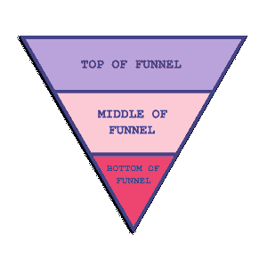
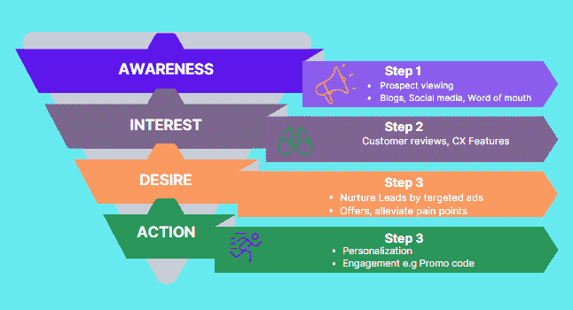
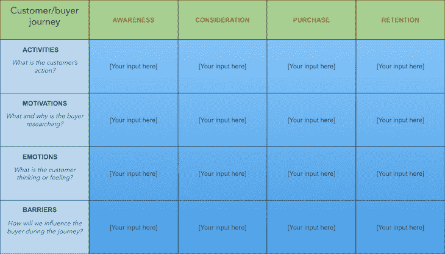

# 转换漏斗分析:如何优化您的客户之旅

> 原文：<https://blog.logrocket.com/product-management/conversion-funnel-analyze-optimize-customer-journey/>

在本指南中，我们将定义什么是转化漏斗，概述其三个主要级别和四个阶段，并逐步分析客户旅程和优化转化。

我们还将回顾如何计算漏斗转化率，以及通过漏斗跟踪客户行动和行为的重要指标。

* * *

## 目录

* * *

## 转化漏斗是什么？

转换漏斗是客户旅程的可视化视图，引导他们购买、订阅或注册使用产品或服务。视觉上，转换漏斗通常被描述为顶部较宽、底部较窄的漏斗。

当客户从漏斗的顶部移动到底部时，他们就会被转化。从上到下的漏斗旅程显示了客户阶段的逐渐减少，通常称为潜在客户、[获得](https://blog.logrocket.com/product-management/what-is-customer-acquisition-cost-how-to-reduce/)和[保持](https://blog.logrocket.com/product-management/what-is-customer-retention-rate-how-to-calculate/)。

通常，潜在客户比客户的最终购买和保留数量要高。因此，漏斗的上部通常看起来更宽。

## 转换漏斗的 3 个级别是什么？

概括地说，转换漏斗分为三个级别:

1.  [漏斗顶部(豆腐)](#top-of-funnel-tofu)
2.  [漏斗中间(墨符)](#middle-of-funnel-mofu)
3.  [漏斗底部(富博)](#bottom-of-funnel-bofu)

所有这些术语都是指消费者在做出购买决定的不同阶段对产品的偏好程度:

让我们更仔细地回顾一下这些术语的含义:

### 1.漏斗顶部(豆腐)

漏斗顶部代表销售线索落地的阶段，无论是通过互联网搜索、在线广告还是其他方式，并导航到您的应用程序或网站，但可能不确定要求或确切需求。

在这个阶段，客户花时间查看各种在线产品和网站，以决定最适合他们需求的产品。

### 2.漏斗中部(MOFU)

在漏斗中间阶段，销售线索倾听品牌，通过试用和电子邮件订阅与他们保持联系，并在一定程度上了解产品。

漏斗的中间也称为考虑阶段。顾客知道他们的期望，所以如果他们不能认同品牌/网站/产品的价值和质量，他们很可能会反弹。

### 3.漏斗底部(富博)

漏斗的底部是最窄的部分，包含最有资格接近最终购买决策的销售线索。因此，漏斗的底部也被称为培育线索的阶段。

## 转换漏斗的 4 个阶段是什么？

转换漏斗的阶段通常取决于业务类型。通常，它分为四个级别:

1.  [意识](#awareness)
2.  [利息](#interest)
3.  [欲望](#desire)
4.  [动作](#action)

每个阶段都有其目的，但它们都有一个单一的目标:吸引客户最终转化。因此，每个阶段都变得非常重要，需要良好的客户体验来提高粘性和会话时间，直到销售线索转化。

### 意识

认知阶段通过提高对你的产品、服务和网站的认知来吸引访问者。

首先，确定给你的网站带来流量的来源是很重要的。下一步是制定策略，从这些和其他来源吸引更多的客户。

例如，一个家庭面包师可以在她的网站、Instagram 和脸书页面上发布广告、客户故事、策划图像和折扣，以此在 D2C 经营一家小企业，从而获得销售线索和品牌知名度。

### 兴趣

一旦线索被带到你的网站或者让你的产品和品牌为人所知，兴趣是让他们进入下一个漏斗阶段的关键。

如果销售线索不觉得这个品牌有吸引力，他们会很快从这个阶段反弹。

让我们来看一个例子，一家销售健康和美容产品的印度电子商务品牌 [Smytten](https://smytten.com/) 如何通过试用点提供各种产品样品来不断培养销售线索，以引发他们的兴趣。

Smytten 联合创始人 [Swagat Sarangi](https://www.exchange4media.com/marketing-news/how-smytten-is-riding-on-the-untapped-targeted-sampling-ad-market-in-india-102191.html) 在漏斗转换的背景下解释了这个样本策略:“如果你看到漏斗，我们关注的是漏斗的上部，即意识、意图和考虑，交易是它的副产品。”

兴趣和意向最终转化为 10-20%的转化率。在这里，Smytten 的抽样战略是基于漏斗顶端战略，以提高所有三个:获取，保留和客户终身价值(LTV)。

### 欲望

欲望的背景围绕着利益、价值、地位和与你的品牌相关的自豪感，这是用户可以信赖的。

一旦欲望被激活，品牌就必须培养这些高质量的潜在客户，让他们沿着漏斗向下移动并转化。工作流活动、样本策略和个性化内容露营是让这些合格的线索经常回到你的产品/网站/品牌的一些技巧。

### 行动

行动是最后一个阶段，转化率和篮子大小很重要。在这一阶段，你直接向客户定位你的品牌/优惠/价值，这样他们不仅会购买，而且可能会购买更多(追加销售)和你的产品组合中的其他产品(交叉销售)。

* * *

订阅我们的产品管理简讯
将此类文章发送到您的收件箱

* * *

当正确的战略在这个阶段或以后没有到位时，就会发生流失。

例如，一家营养和医疗保健初创公司推出了一个网站，在印度一线城市提供各种新鲜烹饪的饭菜。在疫情期间，它引起了很多好奇。

这种划算的服务对那些喜欢低碳水化合物、高蛋白或生酮食物来减肥的减肥者和健身谨慎者来说是个福音。然而，几个月后，所有城市的流失率都很高。

原因是所有的饭菜都是早上送来的，而且要求顾客在用餐前将饭菜冷藏和加热。注重健康的顾客希望食物有一种令人感觉良好的新鲜度，并且更喜欢在指定时间单独配送的每一餐。我们可以想象，如果不激活和培养转化的潜在客户，公司会付出多大的代价。

您可以通过[免费试用](https://blog.logrocket.com/product-management/freemium-model-how-to-know-right-for-your-business/)、电子邮件优惠、忠诚度计划和免费样品等策略吸引合格的销售线索。 [Myntra Insider](https://www.myntra.com/myntrainsider) 是另一个吸引现有客户或新客户坚持使用的例子。

## 通过转换漏斗了解客户之旅

客户旅程和转化漏斗是两回事。基本区别在于，漏斗转化是一个线性视图，而客户旅程图显示了客户使用你的产品/品牌/网站完成目标的个人选择。

[客户之旅](https://blog.logrocket.com/product-management/what-is-customer-experience-definition-examples-strategies/)补充了转化漏斗，并帮助[成长团队](https://blog.logrocket.com/product-management/what-is-a-growth-product-manager-job-description-skills/)了解客户与产品互动的不同方式。如果你能优化他们的接触点，他们可能会成为潜在客户。

下面的客户旅程图模板将帮助您跟踪漏斗路径四个阶段的客户旅程:

[Download this customer journey map template](https://docs.google.com/presentation/d/1_2SkM_Yu6WwaPFI0_9-XLQoZbyg5VNoLUsZhoGb9tYw/edit#slide=id.p2)

*您可以[免费下载这个客户旅行地图模板](https://docs.google.com/presentation/d/1_2SkM_Yu6WwaPFI0_9-XLQoZbyg5VNoLUsZhoGb9tYw/edit#slide=id.p2)。要定制和使用它，从顶部的菜单栏中选择**文件>制作副本**。*

## 如何分析转换漏斗:6 个重要指标

为了理解漏斗优化的好处，您应该衡量六个重要的漏斗指标。这些指标让我们深入了解购买者的漏斗之旅:

1.  **每次获取成本(CPA)** —获取新客户的成本
2.  **客户终身价值(LTV)** —该指标跟踪单个客户的收入。客户在公司保留和购买的时间越长，他们的[终身价值](https://blog.logrocket.com/product-management/what-customer-lifetime-value-clv-how-calculate/)就越大。优化漏斗阶段以激活客户非常重要；LTV 应该大于 CPA
3.  **转化率** —最终采取行动并购买产品的高质量销售线索的百分比。这是漏斗底部阶段的目标
4.  **点击率(CTR)** —电子邮件收件人点击发送给他们的宣传产品(优惠、时事通讯等)的电子邮件的百分比。)
5.  **参与度** —销售线索花时间使用您的产品或服务的热情和积极程度。参与度进一步通过平均会话持续时间、跳出率、点击、评论和分享等来衡量
6.  **平均订单价值(AOV)** —这些指标有助于增加销售和交叉销售机会，向即将购买的客户推广其他相关产品

## 如何在 3 个步骤中优化转换漏斗

优化漏斗的真正目的是最大化转化。你可以通过深入产品分析和试验客户接触点来实现这一点。

要优化漏斗，请遵循以下三个步骤:

1.  [设定目标](#set-goals)
2.  [验证重要接触点](#validate-important-touchpoints)
3.  [测试、跟踪和优化](#test-track-and-refine)

### 设定目标

设定目标是建立良好转化漏斗的第一步。

对于这一步，你可以使用一个最广为人知的工具，谷歌分析，来设置你的漏斗优化。谷歌分析帮助产品和营销团队了解用户在哪个阶段离开转换漏斗。

首先，产品营销或发展团队为目标指定一个名称，例如，“下载应用程序”、“免费试用订阅”等。

下一步也是最重要的一步是定义漏斗，它允许你识别用户从哪里落下。

最后，你可以让与每个阶段[相关联的目标变得智能](https://corporatefinanceinstitute.com/resources/management/smart-goal/)以使你的目标可执行。

### 验证重要的接触点

下一步是通过彻底分析您的注册和登录页面来测试和验证重要的接触点。

为了验证，运行几轮 [A/B 和可用性测试](https://blog.logrocket.com/product-management/what-is-a-b-testing-optimizely-demo-examples/)作为实验来找出哪个客户旅程是最有效的是有用的。这些测试应紧紧围绕转换最重要的漏斗阶段 st。

此外，将可用性和 A/B 测试的效果结合起来可以帮助你缩小和优化你在页面上给客户的选择。\

最后，你应该分析点击率和打开率，并测试产品页面上的行动号召(CTA ),看看是什么驱动了你网站的最大流量。

### 测试、跟踪和改进

最后但同样重要的是，跟踪这些测试结果和可操作的数据对于提高转化率至关重要。测试客户接触点的每个元素和属性是漏斗优化的关键。

## 如何计算漏斗转化率

漏斗转化率是完成转化目标并推进到漏斗末端的销售线索的百分比。

要计算漏斗转化率，将通过漏斗的销售线索数除以漏斗阶段的销售线索数，然后乘以 100。

漏斗转化率的计算公式如下:

*漏斗转化率=(转化率/销售线索)* 100*

构成“良好”漏斗转化率的因素因产品、市场和策略而异。然而，平均漏斗转换率在 3%到 7%之间。

## 为什么转化很重要？

[产品经理的职责是](https://blog.logrocket.com/product-management/what-does-a-product-manager-do-role-responsibilities/)通过比较基本特性变化前后的不同漏斗阶段来[测试和验证假设。](https://blog.logrocket.com/product-management/how-to-validate-product-ideas-before-shipping/)

例如，假设您正在为一家零售电子商务公司工作，您构建了一个新功能，可以对购物车中的商品进行部分结帐。这一改变是基于[用户反馈](https://blog.logrocket.com/product-management/customer-feedback-why-you-should-seek-how-to-obtain/)和提高购物车放弃率*做出的。*

但是，新的变化不会在一夜之间创造奇迹，除非你明白新功能的采用率将如何影响每个漏斗阶段。

假设您在发布后查看了您的漏斗指标，发现使用新的部分结账选项的客户并不多。在使用[可用性测试、热图和 A/B 测试工具](https://logrocket.com/solutions/optimize-conversion-adoption)来调查新功能的问题之后，你可能会意识到部分结账体验很难使用，并且一眼看上去对客户没有吸引力。

使用漏斗阶段的另一个简单方法是[对用户群组](https://blog.logrocket.com/product-management/cohort-analysis-how-to-reduce-churn-improve-retention/)的会话进行分组，然后比较它们之间的转化率，以了解哪里出了问题。了解用户的行为和行动有助于项目经理优先考虑需要改进的地方。

*精选图片来源:[icon scout](https://iconscout.com/icon/funnel-178)*

## [LogRocket](https://lp.logrocket.com/blg/pm-signup) 产生产品见解，从而导致有意义的行动

[LogRocket](https://lp.logrocket.com/blg/pm-signup) 确定用户体验中的摩擦点，以便您能够做出明智的产品和设计变更决策，从而实现您的目标。

使用 LogRocket，您可以[了解影响您产品的问题的范围](https://logrocket.com/for/analytics-for-web-applications)，并优先考虑需要做出的更改。LogRocket 简化了工作流程，允许工程和设计团队使用与您相同的[数据进行工作](https://logrocket.com/for/web-analytics-solutions)，消除了对需要做什么的困惑。

让你的团队步调一致——今天就试试 [LogRocket](https://lp.logrocket.com/blg/pm-signup) 。