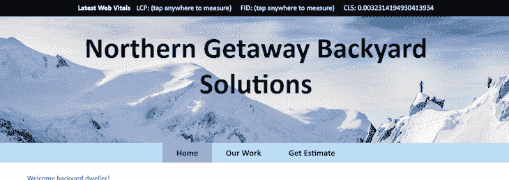
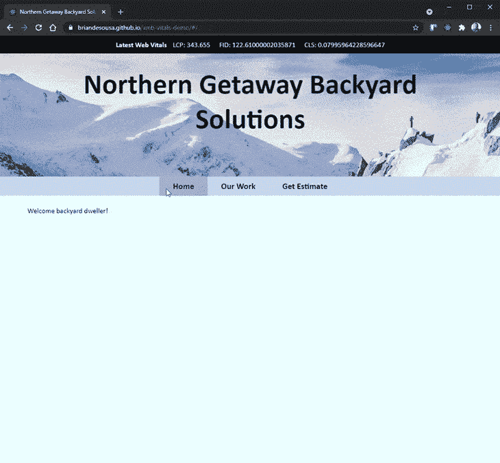
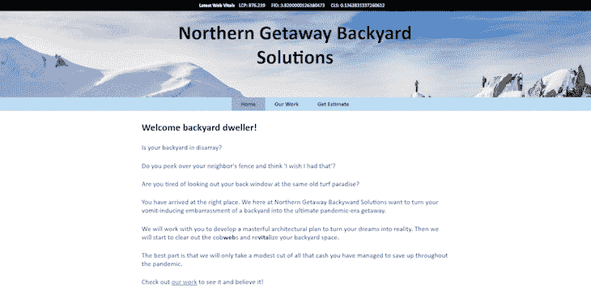
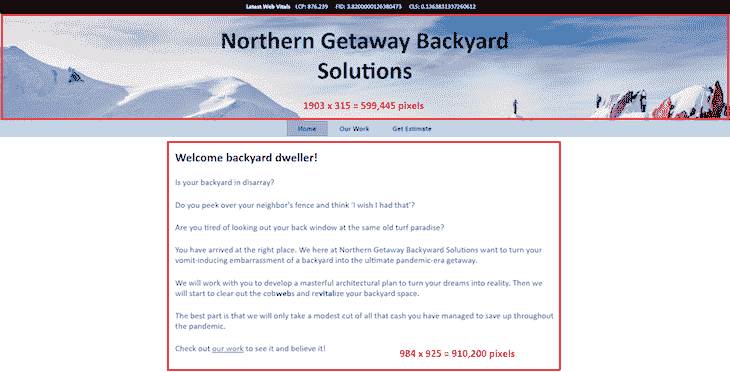
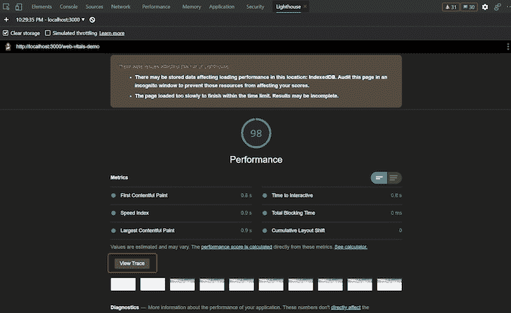
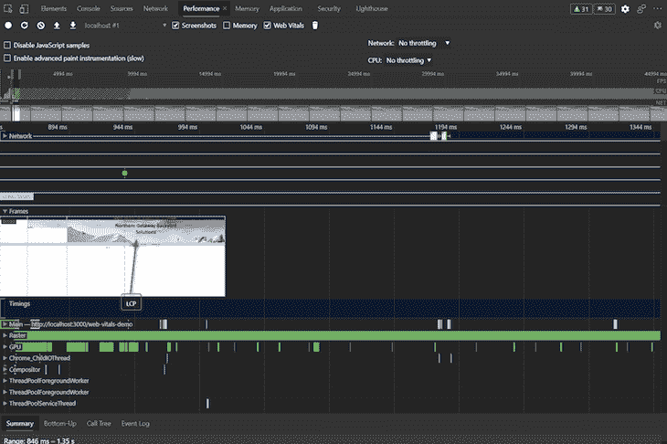
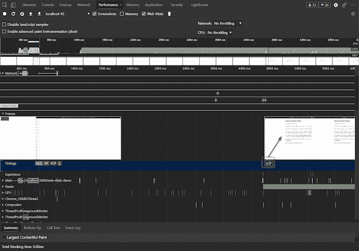
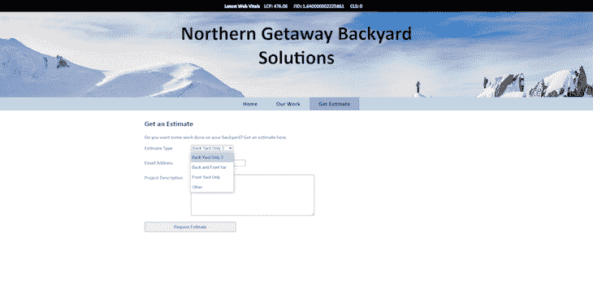
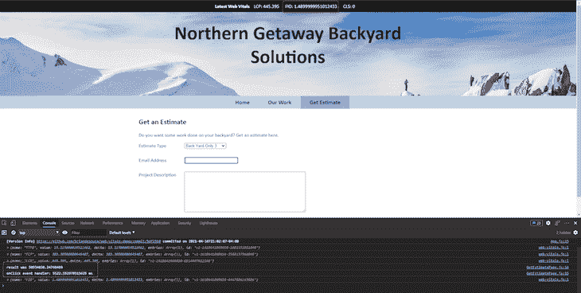

# 水疗中心的核心网站关键最佳实践

> 原文：<https://blog.logrocket.com/core-web-vitals-best-practices-spas/>

Web Vitals 是谷歌的一项倡议，旨在定义一套通用的质量信号来衡量整个网络的用户体验。该倡议的目标之一是让网站所有者更容易测量网站性能，而无需在性能工程方面有丰富的经验。

在这里，我们来看看谷歌的 Web Vitals 计划，深入探索核心 Web Vitals，并看看我们如何在单页应用程序(spa)中测量和优化核心 Web Vitals。

*向前跳转:*

## 什么是网络生命倡议？

Google 的 Web Vitals 计划包括:

*   一套关于如何衡量网站性能和用户体验的指南
*   一系列被称为 Web 生命的指标，用于衡量经常影响用户体验的特定事件和交互
*   一套工具和库，简化了测量网络生命周期的过程
*   致力于通过谷歌最受欢迎的工具展现网络活力

目前有五个重要的网络:

1.  累积布局偏移(CLS)
2.  第一输入延迟(FID)
3.  最大含量涂料(LCP)
4.  第一幅令人满意的画(FCP)
5.  首字节时间(TTFB)

CLS、FID 和 LCP 被认为是核心网络要素。核心 Web Vital 适用于所有网页，不管这些网页是如何构建的。考虑到所有不同类型的网页，这是一个雄心勃勃的目标。我们将仔细看看每个核心 Web 要素如何应用于单页应用程序(spa)。

尽管它们的生命周期相对较短，但各种各样的工具和软件包已经可以用来测量核心网络生命——而且这个列表还在不断增长。以下是一些比较常用的工具:

*   [Chrome 用户体验报告](https://developers.google.com/web/tools/chrome-user-experience-report):这份报告可以用来根据真实用户的现场数据来衡量核心网络生命指标，这些真实用户选择允许 Chrome 收集和分享这些数据
*   [PageSpeed Insights](https://developers.google.com/speed/pagespeed/insights/) :该工具可用于测量核心网络生命周期，使用来自 Chrome 用户体验报告的现场数据以及谷歌在受控环境下收集和分析的实验室数据
*   [谷歌搜索控制台上的核心网络生命周期报告](https://support.google.com/webmasters/answer/9205520):谷歌搜索控制台为您注册的每个网络资产提供核心网络生命周期报告
*   Chrome DevTools :从 Chrome 88 开始，DevTools **性能**标签包括一个显示一些核心网页生命分数的网页生命通道
*   light house:light house 6.0(Chrome DevTools 中也有)可以生成包含网络生命指标的报告
*   这是一个 JavaScript 库，可以集成到你的网络应用中。它包括一组简单的函数，用于捕获核心 Web 重要事件和数据
*   LogRocket : LogRocket 将 Web 生命指标与业务影响相关联。除了监控 Web 生命周期，LogRocket 还监控页面加载时间、CPU/内存使用、浏览器崩溃和 React 组件渲染

### 将 web-vitals 库添加到单页应用程序中

web-vitals npm 包最近被默认添加到一些 web 应用程序支架中。例如，如果您有一个 React 应用程序，它是用最近版本的 [Create React 应用程序](https://reactjs.org/docs/create-a-new-react-app.html)制作的，那么 web-vitals 包已经包含在您的解决方案中。

否则，请访问 npm 上的 [web-vitals 软件包页面，那里有关于如何在您的应用中安装和配置软件包的详细说明。](https://www.npmjs.com/package/web-vitals)

## 衡量和改善水疗中心的核心网站生命体征评分

当我们更仔细地观察每一个核心网络要素时，我们也将实际使用其中的一些工具。我们将使用 [Northern 逃逸后院解决方案](https://github.com/briandesousa/web-vitals-demo/tree/main)样本 SPA 来模拟导致网络生命体征不佳的情况。示例应用程序的源代码是 GitHub 上的[。](https://github.com/briandesousa/web-vitals-demo)

使用 Create React 应用程序生成 Northern shortage 后院解决方案演示应用程序，因此不需要额外的 web-vitals 软件包设置。为方便起见，核心网络生命体征分数在可用时会显示在应用程序的顶部:



Web Vitals scores displayed at the top of the demo app.

请记住，由于网络连接速度、设备类型、屏幕分辨率、浏览器窗口大小等变量，不同用户的网络生命体征评分会有所不同。如果你跟随你的设备上打开的演示应用程序，你应该期待网络生命体征分数不同，但结果应该是相似的。

### 累积布局偏移(CLS)

累积布局偏移量化了网页的视觉稳定性。也许最相关的布局变化的例子包括页面广告。大多数用户发现自己在阅读网页上的内容时，随着广告被加载和插入到页面中，文本向下移动，有时甚至离开屏幕。这种不舒服的用户体验正是 CLS 试图衡量的。

[布局稳定性 API](https://github.com/WICG/layout-instability) 是一个规范，定义了如何测量 CLS 以及什么被认为是布局偏移。根据该规范，并不是所有的布局移动都计入 CLS 分数。例如，CSS 变换或用户滚动页面不会影响 CLS 分数。

CLS 的分数从 0 开始。最初的 CLS 评分算法随着元素在视口中的移动而增加 CLS，直到下一个页面加载事件。这种算法可能会导致像单页应用程序这样的长寿页面获得不合理的高 CLS 分数。想象一个带有客户端路由的单页应用程序。每一次路由更改都会显示新的内容，这是意料之中的行为，但是 CLS 分数会持续增加。

作为回应，2021 年 4 月 7 日，谷歌[宣布修改](https://web.dev/evolving-cls/)CLS 评分算法，为长期页面提供更好的评分。通过这种修改，布局偏移将被分组为 5s(最大值)个窗口，每个窗口之间有 1s 的间隔。根据布局稳定性 API 测量每个布局移位窗口。在随后的页面加载事件中，具有最高 CLS 分数的窗口成为前一页面的 CLS 分数。

让我们看一个布局转换的例子。导航至北部度假后院解决方案演示应用程序的[我们的工作](https://briandesousa.github.io/web-vitals-demo/#/ourwork)页面。页面完全加载后，重新加载页面查看 CLS 分数。请记住，CLS 只能在下一个页面加载事件发生后测量。您现在看到的 CLS 分数反映了上一页发生的布局变化。



Images on the Our Work page moving as they load.

我们的工作页面模拟在慢速互联网连接上异步加载图像。代码中未指定图像尺寸。随着每个图像的加载，先前加载的图像在视口内四处移动，这可以归类为布局偏移。请记住，CLS 分数将根据页面在视窗中的可见程度而变化。

由此得出的 CLS 分数约为 1.06，这并不好——事实上，根据谷歌的 CLS 评分标准，任何超过 0.25 的分数都被认为是差的。

那么如何提高我们工作页面的 CLS 分数呢？在这种情况下，解决方案非常简单。如果你定义了每张图片的宽度和高度，浏览器就会知道该为图片分配多少空间。浏览器能够在加载之前准确确定每个图像在屏幕上的位置。

#### 布局偏移的常见来源

在前一个例子中，我们只看了一个布局偏移的例子，但是还有许多其他的布局偏移的来源。以下是一些常见的来源和解决方案。

| 布局偏移的来源 | 解决方法 |
| --- | --- |
| 尺寸未知的图像或视频 | 

*   定义图像或视频元素的宽度和高度，以便浏览器可以在视窗中保留空间并避免布局偏移

 |
| 呈现得比后备字体大或小的字体 | 

*   使用`font-display`样式告诉浏览器在呈现文本元素时主字体不可用的情况下使用备用字体
*   使用字体链接元素上的`rel="preload"`、`as="font"`和`type=font/woff2`属性预先加载所需的字体，告诉浏览器预先加载字体并确定字体下载的优先级

 |
| 动态调整自身大小的第三方广告或小部件 | 

*   如果广告或小工具不提供尺寸，这可能很难解决。一些广告有意引起布局的变化。尽可能预留空间
*   在启用和禁用广告的情况下测试您的 CLS 分数，以了解您的广告对您的 CLS 分数的影响程度。在这个测试中，你可能需要使用实验室数据而不是现场数据，但是它仍然可以给你一个最糟糕的布局变化发生在你的页面上的粗略概念

 |

### 最大含量涂料(LCP)

最大内容绘画衡量一个页面的主要内容的加载时间。这个想法是，用户通过网页的主要内容变得可见的速度来感知网页加载的速度。一旦主要内容可见，用户会感觉页面已经加载，即使较小的外围元素可能仍在加载。

页面的主要内容是通过识别浏览器视窗中可见的最大图像或文本块来确定的。块可以是图像、视频、包含文本的块元素，甚至是通过 CSS 加载的背景图像。

[最大内容丰富的画图 API](https://wicg.github.io/largest-contentful-paint/) 定义了允许元素的完整列表。这个列表有意简短，以保持指标的简单性。API 还指定如何计算元素的大小，考虑在视口中仅部分可见的元素和其他类似的细微差别。

让我们看一个 LCP 示例。导航至北部度假后院解决方案演示应用程序的[主页](https://briandesousa.github.io/web-vitals-demo)。大约 4s 后，页面应该完全加载。点击或单击屏幕上的任意位置，强制浏览器报告 LCP。在与页面的第一次交互之后，继续跟踪和报告 LCP 不再有意义，因为后续的交互可能会有意改变页面上的可见内容。



LCP 分数约为 0.9 秒。请记住，LCP 分数会因网络速度和浏览器视窗的大小而异。在这种情况下，浏览器在 1920×1080 分辨率的笔记本电脑屏幕上完全展开。

这里有些不对劲！主页专门设计为在 4 秒后加载主要文本块，但 LCP 得分为 0.9 秒。从表面上看，该文本块似乎是屏幕上最大的块，因此，LCP 得分应为 4，000(4 秒)或更高。严格根据测量，主文本块肯定比标题大:



Comparing the sizes of the text block and header block on the Home page.

我们可以使用 Chrome DevTools 中的 Lighthouse 来查看 LCP 报告时屏幕上显示的内容。在 Chrome 中打开演示应用和 DevTools。按照以下步骤生成包含网络重要信息的灯塔报告:

1.  切换到**灯塔**标签
2.  禁用**模拟节流**选项，以便 Lighthouse 报告的指标与页面上显示的指标相当
3.  选择**性能**类别
4.  Click the **Generate report** button

    Chrome DevTools 中的

    

    灯塔。

报告生成后，点击**查看跟踪**按钮。



Lighthouse report.

水平滚动**计时**泳道，直到找到 LCP 标记。展开**框架**泳道，查看报告 LCP 时的页面截图。



LCP marker on Lighthouse report.

LCP 标记前后的屏幕截图表明，标题块是驱动 LCP 得分的因素。我们可以通过临时更新应用程序的源代码来隐藏标题，然后重新运行灯塔报告来证明这一点。



LCP marker on Lighthouse report after hiding the header.

LCP 分数现在大约是 4.5 秒，或者说大约是主文本块出现在屏幕上的时间。让我们看看主文本块的源代码:

```
<div className={`${contentLoaded ? '' : 'hidden'}`}>
  <h2>Welcome backyard dweller!</h2>
  <p>Is your backyard in disarray?</p>
  <p>Do you peek over your neighbor's fence and think 'I wish I had that'?</p>
  <p>Are you tired of looking out your back window at the same old turf paradise?</p>
  <p>You have arrived at the right place. We here at Northern Getaway Backyard Solutions want to turn your vomit-inducing embarrassment of a backyard into the ultimate pandemic-era getaway.</p>
  <p>We will work with you to develop a masterful architectural plan to turn your dreams into reality. Then we will start to clear out the cob<strong>web</strong>s and re<strong>vital</strong>ize your backyard space.</p>
  <p>The best part is that we will only take a modest cut of all that cash you have managed to save up throughout the pandemic.</p>
  <p>Check out <a href="/#/ourwork">our work</a> to see it and believe it!</p>
</div>

```

如果您还记得，LCP 是基于在视口中渲染最大的块级元素所需的时间。在示例源代码中，每个段落元素都是块级元素。LCP 实际上是由于那些段落元素之一的渲染而被报告的，无论哪个最大。还需要注意的是，LCP API 在计算中不包括填充或边距。

#### LCP 对单页应用程序的适用性

就像其他 Web 生命周期一样，LCP 仅在页面加载时进行初始测量。考虑一个具有客户端路由和异步内容加载的单页面应用程序。应用程序中的第一条路线可能会很快加载。

一旦用户与网页交互，例如导航到不同的路线，就会报告 LCP 分数。在这一点上，Web Vitals 将不会为随后的客户端路由更改跟踪 LCP。根据应用程序的设计方式，LCP 可能在衡量用户体验方面提供有限的价值。

#### 修正糟糕的 LCP 分数

主页示例模拟了缓慢加载的内容。在真实的场景中，这些内容可能来自一个后端 API，该 API 经常处于高负载状态，无法在合理的时间内做出响应。对于这种情况，有许多可能的修复方法，包括:

1.  扩大 API 的容量，使其能够处理预期的容量
2.  确保 API 返回带有适当 HTTP 缓存头的响应，以便可以从浏览器缓存提供后续响应
3.  如果从 API 返回的内容是相对静态的，那么在 API 前面添加一个 CDN 服务，以提供来自离用户更近的服务器的缓存响应

### 第一输入延迟(FID)

首次输入延迟衡量页面对用户首次交互的响应速度。其他的 Web 重要指标倾向于关注用户在屏幕上看到东西的速度，但是这个指标关注的是与页面的初始交互以及用户感知到的东西。如果您的页面加载和呈现速度极快，这很好，但是如果用户不能立即与页面交互，UX 可能仍然很差。

FID 一开始可能很难理解。它测量用户第一次点击或轻触页面到浏览器实际能够开始处理结果事件之间的时间，而不是当事件被引发时应用程序完成它必须做的事情所需的时间。

例如，让我们假设用户与网页的第一次交互是点击按钮。浏览器无法在 100 毫秒内响应 click 事件，因为其主线程正忙于执行页面加载时启动的 JavaScript。一旦浏览器能够响应，点击事件还需要 200 毫秒才能完成。报告的 FID 将是 100 毫秒。

让我们来看看北部度假后院解决方案演示应用程序上的一些样本 FID 分数。导航至[获取评估](https://briandesousa.github.io/web-vitals-demo/#/getestimate)页面。点击**评估类型**下拉菜单，强制报告 FID。



Measuring FID on the Get Estimate page.

FID 分数约为 1.6ms，远低于谷歌认为差的≥100ms 分数。这已经是最好的了。“获取估价”页面在幕后并没有发生太多事情；一旦表单在浏览器中可见，用户几乎可以立即与表单进行交互。

让我们将下面的 CPU 密集型事件处理程序添加到**电子邮件地址**字段的 click 事件中。你认为 FID 分数会受到影响吗？

```
  function doSomethingSlow() {
    console.time('onClick event handler');
    const baseNumber = 12;   
    let result = 0; 
    for (var i = Math.pow(baseNumber, 7); i >= 0; i--) {    
      result += Math.atan(i) * Math.tan(i);
    };
    console.log(`result was ${result}`);
    console.timeEnd('onClick event handler');
  };

```

重新加载[获取评估](https://briandesousa.github.io/web-vitals-demo/#/getestimate)页面。在点击页面之前，打开 Chrome DevTools，这样控制台就可见了。点击**邮箱地址**文本框。当 CPU 密集型功能执行时，浏览器将锁定 4-5 秒。一旦函数完成，FID 分数将出现在屏幕顶部，函数结果将出现在 DevTools 控制台中。



Measuring FID on the Get Estimate page with a CPU-intensive function.

这一次，FID 分数约为 1.49 毫秒，甚至低于上一个示例中的 1.6 毫秒。这表明 FID 不包括执行事件处理程序本身所需的时间。

#### 测量 FID

您衡量 FID 分数的方式不同于衡量其他核心网络生命指标的方式。LCP 和 CLS 可以在实验室环境中使用各种工具进行测量，但 FID 只能在有真实用户的现场进行测量。

要在测试时间测量 FID，Google 建议您查看总阻塞时间(TBT) Web Vital。尽管 TBT 与 FID 不同，但它确实提供了一些关于长任务的见解，这些任务在页面准备好供用户交互之前阻塞主线程超过 50 毫秒。这些长时间的任务中的任何一个都可能导致现场的 FID 分数很低。

要实地测量 FID，您需要使用能够访问从与页面交互的真实用户处收集的数据的工具。Page Speed Insights 可以从 Chrome 用户体验报告中提取数据，提供页面的整体 FID 分数。这是假设有足够多的用户访问该页面，并选择向 Chrome 用户体验报告提供他们的数据。

#### FID 对单页应用程序的适用性

就像其他网站的重要指标一样，FID 只在与页面的第一次交互时进行衡量。在使用客户端路由的单页面应用中，FID 不会识别页面上的后续交互或后续路由上的交互的不良用户体验。

无法与屏幕上的元素交互会让用户非常沮丧，尤其是因为用户可能无法确定锁定是由于页面本身还是他们的浏览器或系统锁定。根据您的情况，对所有客户端路由更改实施自定义 FID 监控可能是有意义的。

#### 修复较差的 FID 分数

第一次输入延迟和主线程阻塞可能由多种原因引起。以下是一些示例和潜在的解决方案:

*   如果您下载了复杂和/或大量的 JavaScript 并在第一次页面加载时运行，请考虑将其分解，延迟加载组件，并尽可能简化您的解决方案。请记住，所有 JavaScript 都是在主线程上解析、编译和执行的
*   如果您的网页正在加载第三方脚本，请分析 FID 分数，并考虑这些脚本是否可能导致分数较低
*   浏览器中大量的数据处理和存储会导致大量的主线程使用。考虑在初始页面加载和一般情况下减少加载到内存中的数据量
*   考虑使用 Web Worker 在单独的后台线程上运行长时间的任务。这可以释放容量，以便主线程可以更快地响应用户交互事件

## 核心网站重要信息汇总

下表总结了每个核心网络要素。

| 核心网站至关重要 | 定义 | 它是如何测量的 |
| --- | --- | --- |
| 累积布局偏移(CLS) | 网页的视觉稳定性由页面最初加载时的布局偏移量决定 | 

*   CLS 是从加载一个页面的时间开始计算的，直到触发下一个页面加载
*   CLS 分数从 0(可能的最佳分数)开始，随着元素在屏幕上的移动而增加
*   CLS 分数≥0.25 被认为是差的
*   只有可见的布局偏移才会导致 CLS 分数增加
*   CSS 变换和用户滚动不会影响 CLS 分数
*   2021 年 4 月 9 日之后，计算 CLS 的工具将开始采用谷歌修改后的 CLS 算法，该算法将布局转换分组到基于时间的窗口中，从而为单页应用提供更合理的 CLS 评分方法

 |
| 最大含量涂料(LCP) | 在屏幕上加载最大元素所花费的时间 | 

*   LCP 以秒为单位，从页面开始加载到呈现最大的元素
*   LCP 得分≥4s 被视为较差
*   计算 LCP 时只考虑元素的子集，包括图像、CSS 背景图像和块级文本元素
*   一旦用户与页面交互，就会报告 LCP，即使页面尚未完全加载

 |
| 第一输入延迟(FID) | 用户第一次与页面交互和浏览器对该交互做出响应之间的时间 | 

*   FID 是从用户单击或点击页面到浏览器触发结果事件处理程序之间的时间。事件处理程序完成所需的时间不会影响 FID 分数
*   FID 分数≥100 毫秒被视为较差
*   滚动或缩放页面不会触发 FID 分数
*   即使交互没有触发事件处理程序，FID 仍然被测量；FID 分数在仅分析实验室数据的工具中不可用(如 Lighthouse)
*   FID 分数可在能够访问现场数据的工具中获得(例如，页面速度洞察)

 |

## 网络生命的下一步是什么？

谷歌 Chrome 团队和 SPA 开发者正在积极讨论核心网页生命要素对单页应用的适用性。其中一些讨论已经导致了变化，特别是 CLS T3 的[演变。谷歌还表示，核心网络要素预计会随着时间的推移而演变。我们可能会看到新的网络活力日益突出，并增加或取代现有的核心网络活力。](https://web.dev/evolving-cls/)

对谷歌工具之外的网络生命的支持继续增长。在撰写本文时，在 npm [上快速搜索与网络生命相关的包得到了 27 个结果](https://www.npmjs.com/search?q=web-vitals&page=1&perPage=20)。这些搜索结果包括集成了一些当今最流行的前端库和框架的包，包括 React、Vue.js、Nuxt.js 和 Gatsby。

也许最大的暗示是，网络活力将会一直存在，因为谷歌将在页面体验信号中加入网络活力指标，这有助于谷歌对搜索结果进行排名。谷歌似乎全力以赴于网络要害；这几乎保证了这种测量用户体验的方法的长久性。

## 希望提高您的核心网络活力？使用 [LogRocket](https://logrocket.com/signup/) 查看到底是什么影响了您在生产环境中所有用户的分数

[](https://logrocket.com/signup/)

LogRocket 帮助软件团队解决问题，提高转化率，并推动产品参与度。使用 LogRocket，您可以监控页面加载时间、CPU/内存使用、浏览器崩溃和 React 组件呈现。您还可以看到绩效如何影响转化率和参与度。

LogRocket 会自动监控所有核心 Web 生命指标，并向您展示这些指标如何影响用户体验。

现代化您的前端性能监控— [免费试用 LogRocket】。](https://logrocket.com/signup/)