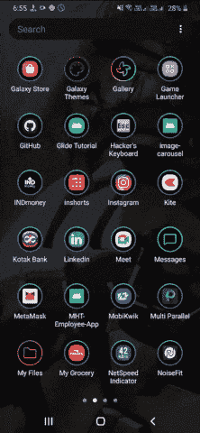
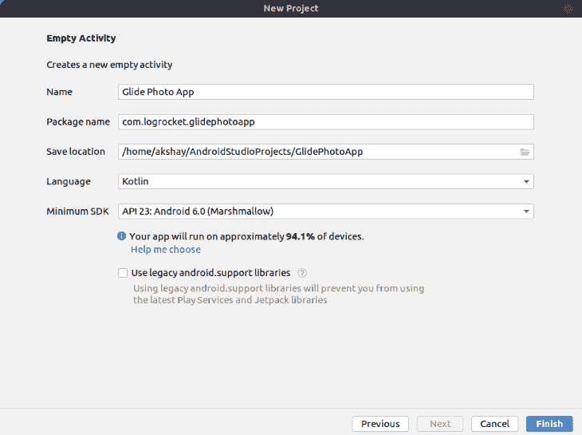
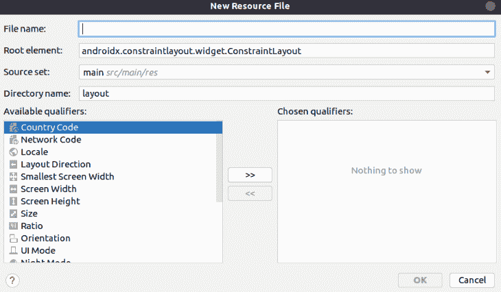
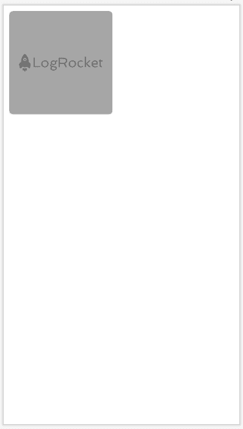
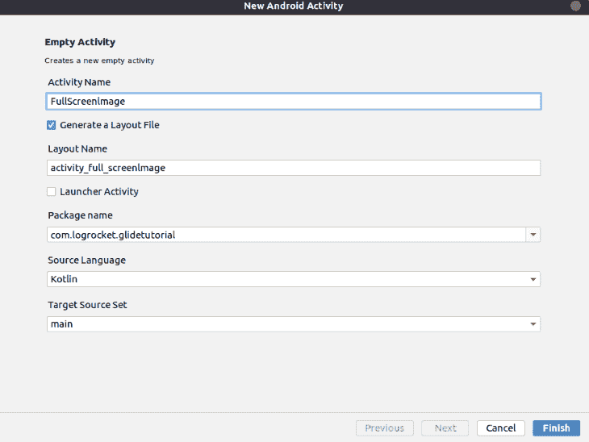

# 使用 Glide 创建一个 Android 照片应用程序

> 原文：<https://blog.logrocket.com/create-android-photo-app-using-glide/>

在本教程中，我们将向您介绍 Glide，并演示如何构建一个简单的照片应用程序。我们将概述 Glide 的基础知识，包括它为什么存在以及它旨在解决什么问题。然后，我们将检查一些实际的代码示例，看看 Glide 的运行情况。

本教程结束时，你将知道如何使用 Kotlin 在你的 Android 应用程序中从头开始实现 Glide。完成后的应用程序将如下所示:



## 什么是滑翔？

[Glide](https://github.com/bumptech/glide) 是一个 Android 图像加载和缓存库。它旨在简化从服务器或互联网上的其他地方加载图像的过程。只需一行代码，嘣！您的图像是从服务器加载的。

如果没有 Glide，手动处理与从服务器加载和缓存图像相关的所有操作将是一场噩梦。Glide 使您能够专注于为用户构建高质量的 Android 应用程序。

## 在 Android Studio 中建立一个新项目

要开始使用 Glide 构建我们的 Android 照片应用程序，我们必须首先在 Android Studio 中创建一个新项目。

启动 Android Studio 并创建一个新项目。选择**清空活动**。


之后，选择您的应用程序名称。



此外，根据您的需要选择您的 Android 最低 SDK。

## 添加必需的依赖项

现在我们已经在 Android Studio 中创建了一个新项目，是时候添加我们的依赖项了。

打开您的`build.gradle`文件(模块级)并在您的`dependencies`块中添加以下依赖项:

```
implementation 'com.github.bumptech.glide:glide:4.12.0'
annotationProcessor 'com.github.bumptech.glide:compiler:4.12.0'
implementation 'com.amitshekhar.android:android-networking:1.0.2'

```

前两行用于 Glide 库，最后一行用于网络。我们将使用 [Unsplash Image API](https://unsplash.com/developers) 进行 API 调用，以获取图像链接。

## 为图像创建布局

我们将制作一个网格布局来显示图像缩略图。为了创建网格布局，我们将在应用程序中使用`RecyclerView`。

要创建一个`RecyclerView`项目布局文件，右击布局文件夹并选择**新建**，然后选择**布局资源文件**。

之后，填写文件的名称。



创建文件后，我们将使用`CardView`创建项目布局。

```
<?xml version="1.0" encoding="utf-8"?>
<androidx.constraintlayout.widget.ConstraintLayout xmlns:android="http://schemas.android.com/apk/res/android"
    android:layout_width="wrap_content"
    android:layout_height="wrap_content"
    xmlns:app="http://schemas.android.com/apk/res-auto"
    android:padding="10dp"
    >

    <androidx.cardview.widget.CardView
        android:layout_width="180dp"
        android:layout_height="180dp"
        app:cardCornerRadius="7dp"
        android:elevation="4dp"
        android:id="@+id/image_card">
        <ImageView
            android:layout_width="match_parent"
            android:layout_height="match_parent"
            android:scaleType="centerCrop"
            android:id="@+id/image_view"
            android:src="@drawable/logrocket"
            />
    </androidx.cardview.widget.CardView>

</androidx.constraintlayout.widget.ConstraintLayout>

```



现在我们需要创建数据类来存储图像 URL。我们将只存储两个 URL 链接:一个用于缩略图 URL，另一个用于高分辨率图像的 URL。这样，我们只需要存储两个字符串。

## 创建一个数据类来存储图像链接

右键单击您的包文件夹并选择**新建**。然后，点击**新建科特林类/文件**。

之后，点击**数据类**并输入你的类名。


在该文件中，我们将创建一个如下所示的结构:

```
package com.logrocket.glidetutorial

data class ImageLinks(var thumbnailUrl: String, var fullImageUrl: String)

```

在上面的代码中，我们接受两个字符串:一个用于缩略图 URL，另一个用于完整图像 URL。

## 执行`RecyclerView`和`Adapter`

现在是时候将`RecyclerView`添加到您的主活动布局中，并为其创建一个`Adatper`类。

首先，在主活动中添加`RecyclerView`。打开主活动布局文件，并运行以下代码:

```
<?xml version="1.0" encoding="utf-8"?>
<androidx.constraintlayout.widget.ConstraintLayout xmlns:android="http://schemas.android.com/apk/res/android"
    xmlns:app="http://schemas.android.com/apk/res-auto"
    xmlns:tools="http://schemas.android.com/tools"
    android:layout_width="match_parent"
    android:layout_height="match_parent"
    tools:context=".MainActivity">

    <androidx.recyclerview.widget.RecyclerView
        android:layout_width="match_parent"
        android:layout_height="match_parent"
        android:id="@+id/recycler_view"
        />

</androidx.constraintlayout.widget.ConstraintLayout>

```

我们已经给出了`recycler_view id`和`recyclerview`元素。

现在，为`Adapter`类创建一个新的 Kotlin 类。

右键点击**包**文件夹，选择**新建**，然后选择**科特林文件/类**。给它起名叫`ImageAdapter`。

* * *

### 更多来自 LogRocket 的精彩文章:

* * *

在创建了`Adapter`类之后，我们需要扩展 RecyclerView。适配器类，并将自定义视图容器类作为泛型进行传递。

您的代码应该如下所示:

```
class ImageAdapter(): RecyclerView.Adapter<ImageAdapter.ViewHolder>() {
....
}

```

此时，您将看到一个错误，提示您实现适配器的成员。所以让我们实现成员。

`Adapter`类有三个方法:

*   `onCreateViewHolder`
*   `onBindViewHolder`
*   `getItemCount`

在实现这些方法之前，让我们创建一个从主活动中获取数据的构造。

我们需要活动的图像链接和上下文。我们需要像这样修改我们的代码:

```
class ImageAdapter(private var context: Context, private var imageURLList : ArrayList<ImageLinks>): RecyclerView.Adapter<ImageAdapter.ViewHolder>() {
....
} 

```

第一个参数接受上下文，第二个参数接受数据类的数组列表，我们将在其中存储链接数据。

现在让我们实现`Adapter`方法并创建一个定制的`ViewHolder`类。

```
class ImageAdapter(private var context: Context, private var imageURLList : ArrayList<ImageLinks>): RecyclerView.Adapter<ImageAdapter.ViewHolder>() {

    override fun onCreateViewHolder(parent: ViewGroup, viewType: Int): ViewHolder {

    }

    override fun onBindViewHolder(holder: ViewHolder, position: Int) {

    }

    override fun getItemCount(): Int {
    }

    class ViewHolder(itemView: View): RecyclerView.ViewHolder(itemView) {
    }
}

```

如你所见，在自定义的`ViewHolder`类中，我们用`RecyclerView`及其构造函数扩展了该类，并传递了`itemView`。

我们的定制`ViewHolder`将接受一个布局，它是我们之前作为`RecyclerView`项创建的。

现在让我们完成适配器代码:

```
class ImageAdapter(private var context: Context, private var imageURLList : ArrayList<ImageLinks>): RecyclerView.Adapter<ImageAdapter.ViewHolder>() {

    override fun onCreateViewHolder(parent: ViewGroup, viewType: Int): ViewHolder {
        val itemView = LayoutInflater.from(parent.context).inflate(R.layout.image_list_item, parent, false);
        return  ViewHolder(itemView);
    }

    override fun onBindViewHolder(holder: ViewHolder, position: Int) {
        val imageUrls = imageURLList[position]
        val imageView = holder.imageView
        Glide.with(context)
            .load(imageUrls.thumbnailUrl)
            .into(imageView)
        imageView.setOnClickListener {
            run {
                val intent = Intent(context, FullScreenImage().javaClass)
                intent.putExtra("fullImageUrl", imageUrls.fullImageUrl)
                context.startActivity(intent)
            }
        }
    }

    override fun getItemCount(): Int {
        return imageURLList.size
    }

    class ViewHolder(itemView: View): RecyclerView.ViewHolder(itemView) {
        var imageView: ImageView = itemView.findViewById(R.id.image_view)
    }
}

```

在上面的代码中，`onCreateViewHolder`方法使我们能够膨胀一个视图来加载`RecyclerView`项目布局并返回`ViewHolder`。

在`ViewHolder`中，我们使用`itemView`并使用它的 ID 找到`imageView`。

在`onBindViewHolder`方法中，我们将数据与视图持有者的视图`imageview`绑定在一起。这是我们使用 Glide 库从 url 加载图像并在图像视图中显示它们的主要逻辑。

行`Glide.with(context).load(imageUrls.thumbnailUrl).into(imageView)`使我们能够加载图像。第一个函数`with`获取活动的上下文，`load`函数获取图像的 URL，最后，`into`函数传递我们的图像视图。

此外，我们还在 image view 上添加了一个 click listener 来打开一个新的活动，我们将在其中全屏显示图像。我们使用 putExtra 方法传递全屏图像链接。

完成这些后，不要忘记在`getItemCount`方法中返回图像的数量。

`RecyclerView`适配器到此为止。现在我们需要将这个适配器与我们的主活动的`RecyclerView`连接起来。

## 将`Adapter`连接到`RecyclerView`

在主活动中，我们必须做两件事:

1.  从 Unsplash API 获取图像 URL
2.  用我们的图像链接数据将`Adapter`连接到`RecyclerView`

为了进行 API 请求调用，我们将使用 [Fast Android Networking](https://github.com/amitshekhariitbhu/Fast-Android-Networking) 库，我们将把它添加为一个依赖项。

```
class MainActivity : AppCompatActivity() {
    private lateinit var  recyclerView: RecyclerView
    private var imageList: ArrayList<ImageLinks> = arrayListOf()
    var RANDOM_IMAGE_URL: String = "https://api.unsplash.com/photos"
    var ACCESS_ID = "UNSPLASH_ACCESS_ID"
    val context: Context = this;

    override fun onCreate(savedInstanceState: Bundle?) {
        super.onCreate(savedInstanceState)
        setContentView(R.layout.activity_main)
        AndroidNetworking.initialize(applicationContext)

        AndroidNetworking.get(RANDOM_IMAGE_URL)
            .addHeaders("Authorization", "Client-ID $ACCESS_ID")
            .build()
            .getAsJSONArray(object : JSONArrayRequestListener{
                override fun onResponse(response: JSONArray?) {
                // handle response here
                }
                override fun onError(anError: ANError?) {
                    // handle error here
                }
            })
    }
}

```

在上面的代码片段中，我们首先使用`AndroidNetworking.initialize(applicationContext)`初始化 Android 网络库。我们还需要传递应用程序上下文。

初始化后，我们可以使用网络库的 get 函数。在参数中，我们需要传递 API URL。要添加请求头，我们可以使用`addHeaders`并传递您想要在请求头中设置的任何内容。在我们的例子中，我们设置授权并传递我们的访问 ID。

现在我们可以调用 build 函数来调用 URL 并使用`getAsJSONArray`获得响应。

我们需要传递一个覆盖两个方法的接口:

1.  `onResponse`，当我们成功接收到来自服务器的响应时被调用
2.  `onError`，当服务器返回错误时调用

我们将重点关注`onResponse`方法。在这个方法中，我们将获得我们的数据并将其传递给`Adapter`，就像这样:

```
        AndroidNetworking.get(RANDOM_IMAGE_URL)
            .addHeaders("Authorization", "Client-ID $ACCESS_ID")
            .build()
            .getAsJSONArray(object : JSONArrayRequestListener{
                override fun onResponse(response: JSONArray?) {

                    val length: Int? = response?.length()
                    for (i in 0 until length!!){
                        val jsonObject: JSONObject = response.getJSONObject(i)
                        val urlJson: JSONObject = jsonObject.getJSONObject("urls")
                        val thumbnailUrl = urlJson.getString("thumb")
                        val fullImageUrl = urlJson.getString("regular")
                        val imageLinks = ImageLinks(thumbnailUrl, fullImageUrl)
                        imageList.add(imageLinks)
                    }

                    recyclerView = findViewById(R.id.recycler_view)
                    recyclerView.layoutManager = GridLayoutManager(applicationContext, 2)
                    recyclerView.adapter = ImageAdapter(context, imageList)

                }
                override fun onError(anError: ANError?) {
                    // handle error here
                }
            })
    }
}

```

在`onResponse`方法中，我们循环到响应，并存储来自响应的缩略图和完整图像 URL。这就是我们从 Unsplash API 得到的回应:

```
[
    {
        ...
        "urls": {
            "regular": "https://images.unsplash.com/photo-1524758631624-e2822e304c36?crop=entropy\u0026cs=tinysrgb\u0026fit=max\u0026fm=jpg\u0026ixid=MnwyNzU1MjN8MXwxfGFsbHwxfHx8fHx8Mnx8MTYzNjg4NjU4OA\u0026ixlib=rb-1.2.1\u0026q=80\u0026w=1080",
            "thumb": "https://images.unsplash.com/photo-1524758631624-e2822e304c36?crop=entropy\u0026cs=tinysrgb\u0026fit=max\u0026fm=jpg\u0026ixid=MnwyNzU1MjN8MXwxfGFsbHwxfHx8fHx8Mnx8MTYzNjg4NjU4OA\u0026ixlib=rb-1.2.1\u0026q=80\u0026w=200"
        }
      ...        
    }
....
]

```

在获取图像链接并将它们存储在数组列表中之后，下一步是将`Adapter`附加到`RecyclerView`并传递图像链接的数组列表。

但是在附加`Adapter`之前，我们需要为我们的`RecyclerView`指定我们想要的布局类型。我们有两种选择:

1.  线性布局管理器，它生成一个垂直的单列列表
2.  网格布局管理器，产生一个网格状的系统

对于我们的应用程序设计，我们需要使用 Grid Layout Manager 来设置列数。

最后，我们需要附加`Adapter`，设置`RecyclerView`的`Adapter`属性，设置`ImageAdapter`对象。在调用适配器构造函数时，我们必须传递所需的参数——即活动上下文和图像数组列表。

现在，如果我们运行我们的应用程序，我们可以看到我们的图像列表。但是当点击任何图像时，我们需要打开我们的全屏活动。

为此，首先我们需要在项目中创建一个新的活动。

右键点击 app 文件夹，选择**新建**、**活动**，然后选择**清空活动**。

之后，我们需要设置活动名称。我们将把这个活动名设置为“FullScreenImage”



打开这个活动的布局文件，在整个屏幕上添加一个`ImageView`，就像这样:

```
<?xml version="1.0" encoding="utf-8"?>
<androidx.constraintlayout.widget.ConstraintLayout xmlns:android="http://schemas.android.com/apk/res/android"
    xmlns:app="http://schemas.android.com/apk/res-auto"
    xmlns:tools="http://schemas.android.com/tools"
    android:layout_width="match_parent"
    android:layout_height="match_parent"
    tools:context=".FullScreenImage">

    <ImageView
        android:layout_width="match_parent"
        android:layout_height="match_parent"
        android:id="@+id/fullImageView"
        android:scaleType="centerCrop"
        />

</androidx.constraintlayout.widget.ConstraintLayout>

```

添加`ImageView`后，设置该活动中点击的图像。

打开类文件并添加以下代码:

```
class FullScreenImage : AppCompatActivity() {
    override fun onCreate(savedInstanceState: Bundle?) {
        super.onCreate(savedInstanceState)
        setContentView(R.layout.activity_full_screen_image)

        val fullImageUrl = intent.getStringExtra("fullImageUrl")
        val fullImageView: ImageView = findViewById(R.id.fullImageView)

        Glide.with(this)
            .load(fullImageUrl)
            .into(fullImageView)

    }
}

```

这很简单。首先，我们从 intent 的`getStringExtra`中获得完整的图像 URL(记住，我们传递的是完整的图像 URL)。

获得图像 URL 后，我们访问我们的图像视图，并使用 Glide 从 URL 加载图像，并在图像视图中显示它，就像我们在前面的定制适配器代码中所做的那样。

至此，我们使用 Glide 构建的照片应用程序就完成了！

## 结论

在本教程中，我们演示了如何将`RecyclerView`与`CardView`一起使用。我们还向您展示了如何使用 Glide 图像库，只用一行代码就构建了一个 Android 照片应用程序。

## 使用 [LogRocket](https://lp.logrocket.com/blg/signup) 消除传统错误报告的干扰

[](https://lp.logrocket.com/blg/signup)

[LogRocket](https://lp.logrocket.com/blg/signup) 是一个数字体验分析解决方案，它可以保护您免受数百个假阳性错误警报的影响，只针对几个真正重要的项目。LogRocket 会告诉您应用程序中实际影响用户的最具影响力的 bug 和 UX 问题。

然后，使用具有深层技术遥测的会话重放来确切地查看用户看到了什么以及是什么导致了问题，就像你在他们身后看一样。

LogRocket 自动聚合客户端错误、JS 异常、前端性能指标和用户交互。然后 LogRocket 使用机器学习来告诉你哪些问题正在影响大多数用户，并提供你需要修复它的上下文。

关注重要的 bug—[今天就试试 LogRocket】。](https://lp.logrocket.com/blg/signup-issue-free)

## LogRocket :即时重现你的安卓应用中的问题。

[](https://lp.logrocket.com/blg/kotlin-signup)

[LogRocket](https://lp.logrocket.com/blg/kotlin-signup) 是一款 Android 监控解决方案，可以帮助您即时重现问题，确定 bug 的优先级，并了解您的 Android 应用程序的性能。

LogRocket 还可以向你展示用户是如何与你的应用程序互动的，从而帮助你提高转化率和产品使用率。LogRocket 的产品分析功能揭示了用户不完成特定流程或不采用新功能的原因。

开始主动监控您的 Android 应用程序— [免费试用 LogRocket】。](hhttps://lp.logrocket.com/blg/kotlin-signup)