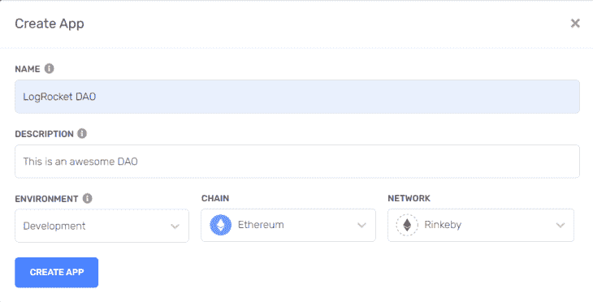
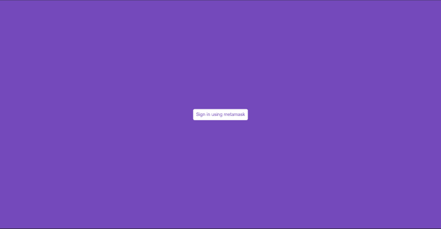
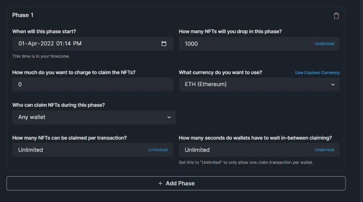
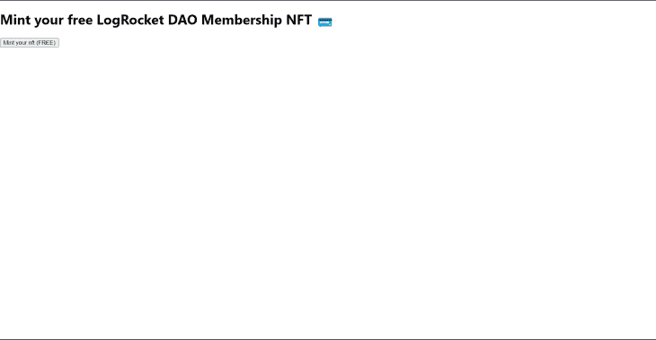
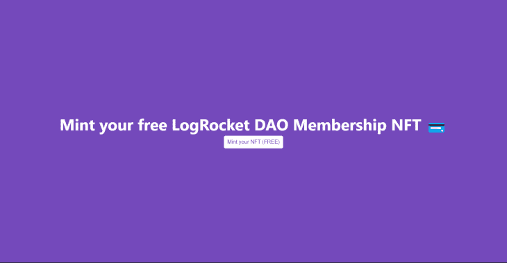
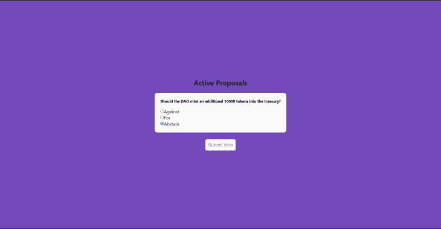
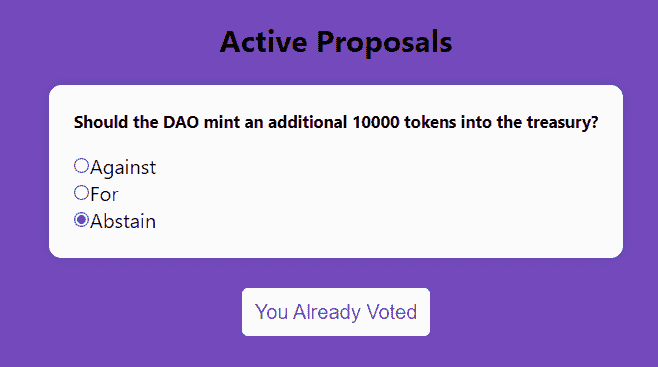

# 如何用 Next.js 和 thirdweb - LogRocket 博客创建 DAO

> 原文：<https://blog.logrocket.com/create-dao-next-js-thirdweb/>

***编者按:*** *本文更新于 2022 年 4 月 11 日，以配合*[*third web v2*](https://blog.thirdweb.com/thirdweb-v2)*的发布。*

## 什么是刀？

DAO 代表分散的自治组织。顾名思义，道是没有单一领袖的组织；相反，规则被编码在区块链中。正因为如此，一刀是完全透明的，每个参与的人都有股份。大型决策是通过拥有 DAO 不可替代令牌(NFT)的用户投票做出的，这些令牌授予会员资格。

今天，我们将使用 Next.js、thirdweb、MetaMask 和 Alchemy 来构建我们自己的 DAO。它将允许用户铸造你的道的 NFT，通过空投接收加密货币，并参与道的民意调查。本教程将只使用 JavaScript 编写，因此您不需要了解任何可靠性。

## 先决条件

要理解并遵循本教程，您应该具备以下条件:

*   JavaScript、Next.js 和[区块链](https://blog.logrocket.com/tag/web3/)的工作知识
*   MetaMask 钱包
*   用[炼金术](https://www.alchemy.com/)算一笔账

## 内容

## 设置

我们将从使用以下命令设置 Next.js 应用程序开始:

```
npx create-next-app my-dao

```

### 创建炼金术应用程序

接下来，前往 Alchemy，登录，点击**创建应用**，并提供所需的详细信息。确保使用与您在 thirdweb 中使用的链相同的链——在我们的例子中，它是以太坊链和 Rinkeby 网络。



创建应用程序后，复制 HTTP API 密钥。

### 获取钱包的私钥

为了[创建 NFT](https://blog.logrocket.com/create-nft-minter-moralis-solidity-next-js/)并执行某些脚本，我们将需要钱包的私钥。

要访问它，打开 MetaMask 浏览器扩展并点击**账户详情**。您应该在这里看到您的私钥；导出并复制到安全的地方。

### 添加`.env`变量

让我们将这些变量添加到一个`.env`文件中，这样我们可以在以后访问它们:

```
PRIVATE_KEY=<wallet_private_key>
ALCHEMY_API_URL=<alchemy_http_key>
WALLET_ADDRESS=<public_wallet_address>

```

因为我们不想把这些推送到 GitHub，所以一定要在`gitignore`里添加

在 DApps 中，MetaMask 是最常用的钱包，因此我们将使用 thirdweb 添加 MetaMask 登录。

我们需要安装两个软件包:

```
npm i @thirdweb-dev/react @thirdweb-dev/sdk ethers # npm

yarn add @thirdweb-dev/react @thirdweb-dev/sdk ethers # yarn
```

### 添加第三方 web 提供程序

我们需要将整个应用程序包装在第三方 web 提供者中，以便访问组件所需的登录详细信息和其他信息:

```
import "../styles/globals.css";
import {ThirdwebProvider } from "@thirdweb-dev/react";

function MyApp({ Component, pageProps }) {
  return (
    <ThirdwebProvider desiredChainId={activeChainId}>
      <Component {...pageProps} />
    </ThirdwebProvider>
  );
}
export default MyApp;

```

出于身份验证的目的，我们还必须指定身份验证的类型和支持的链 id。我们使用元掩码和 Rinkeby 链，所以也添加以下内容:

```
import { ChainId, ThirdwebProvider } from "@thirdweb-dev/react";
const activeChainId = ChainId.Rinkeby;

```

最后，像这样在提供者中传递这些作为道具:

```
 <ThirdwebProvider desiredChainId={activeChainId}>
      <Component {...pageProps} />
  </ThirdwebProvider>

```

### 添加登录组件

在项目的根目录下创建一个名为`components`的新文件夹，并向其中添加一个`Login.js`文件:

```
import { useMetamask } from "@thirdweb-dev/react";
const Login = () => {
  const connectWithMetamask = useMetamask();
  return (
    <div>
      <button onClick={connectWithMetamask}>Sign in using MetaMask</button>
    </div>
  );
};
export default Login;

```

幸运的是，thirdweb 提供了一个`connectWallet`函数，我们可以用它来添加身份验证！

### 呈现登录组件

在`index.js`中，如果没有地址(如果用户没有登录)，则呈现登录屏幕:

```
const address = useAddress();
if (!address) {
  return ;
}

```

这将允许我们的用户登录，但之后它只是显示一个空白屏幕。因此，在另一个返回块中，让我们向用户显示她的地址:

```
export default function Home() {
  const { address } = useWeb3();
  if (!address) {
    return <Login />;
  }
  return (
    <div className={styles.container}>
      <h2>You are signed in as {address}</h2>
    </div>
  );
}

```

登录工作，但它现在看起来不太好。因此，在`styles`文件夹中创建一个新文件`Login.module.css`，并添加以下内容:

```
.container {
  min-height: 100vh;
  display: flex;
  flex-direction: column;
  justify-content: center;
  align-items: center;
  background-color: #7449bb;
}
.button {
  color: #7449bb;
  background-color: white;
  border: none;
  border-radius: 5px;
  padding: 10px;
  font-size: 16px;
  margin: 4px 2px;
  cursor: pointer;
  font-weight: 500;
}

```

接下来，将以下类添加到`Login.js`:

```
<div className={styles.container}>
  <button className={styles.button} onClick={() => connectWallet("injected")}>
    Sign in using MetaMask
  </button>
</div>

```

最后，导入样式:

```
import styles from "../styles/Login.module.css";

```

这将给我们一个简单但好看的登录屏幕。



### 初始化 thirdweb SDK

现在我们需要为将要运行的各种脚本初始化 thirdweb SDK。首先创建一个名为`scripts`的新文件夹，其中包含一个`initialize-sdk.js`文件。

将以下代码添加到文件中:

```
import { ThirdwebSDK } from "@thirdweb-dev/sdk";
import ethers from "ethers";
import dotenv from "dotenv";
dotenv.config();
if (!process.env.PRIVATE_KEY || process.env.PRIVATE_KEY === "") {
  console.log("🛑 Private key not found.");
}
if (!process.env.ALCHEMY_API_URL || process.env.ALCHEMY_API_URL === "") {
  console.log("🛑 Alchemy API URL not found.");
}
if (!process.env.WALLET_ADDRESS || process.env.WALLET_ADDRESS === "") {
  console.log("🛑 Wallet Address not found.");
}
const sdk = new ThirdwebSDK(
  new ethers.Wallet(
    process.env.PRIVATE_KEY,
    ethers.getDefaultProvider(process.env.ALCHEMY_API_URL)
  )
);
(async () => {
  try {
    const address = await sdk.getSigner().getAddress();
    console.log("SDK initialized by address:", address);
  } catch (err) {
    console.error("Failed to get the address", err);
    process.exit(1);
  }
})();
export default sdk;

```

这将初始化 thirdweb SDK，如您所见，我们需要安装一些包:

```
npm i dotenv # npm

yarn add dotenv # yarn

```

我们在这里使用模块化导入，所以在`scripts`文件夹中创建一个新的`package.json`文件，并简单地添加以下内容:

```
{
  "name": "scripts",
  "type": "module"
}

```

最后，运行脚本:

```
node scripts/initialize-sdk.js

```

该脚本可能需要一些时间来运行，但一段时间后，你会得到你的应用程序地址。


我们将在接下来的步骤中用到它，所以请将其存放在安全的地方。

## 添加功能以打造 NFT

对于这一步，我们将需要一些测试 ETH，所以去像[这样的水龙头](https://faucets.chain.link/rinkeby)拿一些。

### 创建和配置 NFT

在`scripts`文件夹中创建一个名为`deploy-drop.js`的新文件。在这里，添加以下脚本:

```
import { ethers } from "ethers";
import sdk from "./initialize-sdk.js";

(async () => {
  try {
    const editionDropAddress = await sdk.deployer.deployEditionDrop({
      name: "LogRocket DAO", // Name of NFT Collection for DAO
      description: "A DAO for all the LogRocket readers.", // Description
      image: "image_Address", // PFP for NFT collection
      primary_sale_recipient: ethers.constants.AddressZero,
    });
    const editionDrop = sdk.getEditionDrop(editionDropAddress);
    const metadata = await editionDrop.metadata.get();
    console.log(
      "✅ Successfully deployed editionDrop contract, address:",
      editionDropAddress
    );
    console.log("✅ editionDrop metadata:", metadata);
  } catch (error) {
    console.log("failed to deploy editionDrop contract", error);
  }
})();

```

您需要在这里更新一些内容:

*   使用通过运行前面的脚本获得的新应用程序地址更新应用程序地址
*   更新 DAO 的 NFT 放置的名称及其描述
*   通过创建一个名为`assets`的新文件夹，为 NFT 拖放添加一个图像，并在那里添加您的 NFT 的图像

更新详细信息后，运行以下脚本:

```
node scripts/deploy-drop.js

```

等待脚本运行，您应该会得到一个地址和元数据。


这将为我们创建一个新版本的 drop 合同！你甚至可以在 [Rinkeby Etherscan](https://rinkeby.etherscan.io/) 上查看交易。

让我们现在配置我们的 NFT！在`scripts`文件夹中创建一个新的`config-nft.js`文件，并添加以下内容:

```
import sdk from "./initialize-sdk.js";

const editionDrop = sdk.getEditionDrop("EDITION_DROP_ADDDRESS");

(async () => {
  try {
    await editionDrop.createBatch([
      {
        name: "LogRocket DAO", // Name of NFT Collection for DAO
        description: "A DAO for all the LogRocket readers.", // Description
        image: "image_address", // Image for NFT
      },
    ]);
    console.log("✅ Successfully created a new NFT in the drop!");
  } catch (error) {
    console.error("failed to create the new NFT", error);
  }
})();

```

您需要更新包放置地址和`createBatch`中对象的详细信息。这些细节将用于 NFT！

一旦您更新了所有文件，请运行以下脚本:

```
node scripts/config-nft.js

```

它应该会给出这样的输出。


如果您在第三个 web 仪表板中看到该模块，您将看到已经创建了一个 NFT！🥳


最后，让我们为 NFT 添加一个索赔条件。

设置索赔条件将允许我们为 NFTs 设置一个限额，并允许每笔交易有一个特定的最大限额。我们将从仪表板本身设置索赔条件，因此单击**设置**按钮并创建一个新的索赔阶段。



完成更新后，点击 **更新索赔阶段 a** 并确认小额交易。

### 检查用户是否有 NFT

在创建允许用户铸造 NFT 的铸造按钮之前，让我们检查用户是否已经有了 NFT。我们不希望用户铸造多个 NFT！

首先添加两个新变量，`sdk`和`bundleDropModule`，像这样放在我们的函数组件之前:

```
  const editionDrop = useEditionDrop(
    "0x2f66A5A2BCB272FFC9EB873E3482A539BEB6f02a"
  );

```

您还需要导入`useEditionDrop`:

```
import { useAddress, useEditionDrop } from "@thirdweb-dev/react";

```

现在，让我们为`hasClaimedNFT`创建一个状态:

```
const [hasClaimedNFT, setHasClaimedNFT] = useState(false);

```

我们还需要创建一个`useEffect`钩子来检查用户是否有 NFT:

```
useEffect(() => {
    if (!address) {
      return;
    }
    const checkBalance = async () => {
      try {
        const balance = await editionDrop.balanceOf(address, 0);
        if (balance.gt(0)) {
          setHasClaimedNFT(true);
          console.log("🎉 You have an NFT!");
        } else {
          setHasClaimedNFT(false);
          console.log("🤷‍♂️ You don't have an NFT.");
        }
      } catch (error) {
        setHasClaimedNFT(false);
        console.error("Failed to get nft balance", error);
      }
    };
    checkBalance();
  }, [address, editionDrop]);

```

首先，它将检查用户是否登录。如果用户没有登录，它将不会返回任何内容。然后，检查用户是否拥有我们在顶部导入的 drop contract 中带有令牌 ID `0`的 NFT。

如果你，在网站中打开控制台，它应该显示你没有 NFT。


### 创建一个按钮来铸造 NFT

让我们创建按钮来铸造 NFTs！像这样创建一个名为`mintNft`的新函数:

```
const mintNft = async () => {
  setIsClaiming(true);
  try {
    await bundleDropModule.claim("0", 1);
    setHasClaimedNFT(true);
    console.log("🌊 Successfully Minted the NFT!");
  } catch (error) {
    console.error("failed to claim", error);
  } finally {
    setIsClaiming(false);
  }
};

```

当点击一个按钮将 NFT 存入用户的钱包时，我们将调用这个函数。但是首先，让我们添加`isClaiming`状态:

```
const [isClaiming, setIsClaiming] = useState(false);

```

让我们现在创建按钮！在最后一个返回块中添加以下内容:

```
<div>
  <h1>Mint your free LogRocket DAO Membership NFT 💳</h1>
  <button disabled={isClaiming} onClick={() => mintNft()}>
    {isClaiming ? "Minting..." : "Mint your nft (FREE)"}
  </button>
</div>

```

现在，在我们登录后，它应该会向我们显示这样一个屏幕。



如果您尝试按 **Mint your nft (FREE)** 按钮，它应该会弹出您的 MetaMask 屏幕来完成交易。在控制台中，应该会看到以下内容。


最后，在最后一个返回块的上面，添加这个检查来查看用户是否已经声明了 NFT:

```
if (hasClaimedNFT) {
  return (
    <div>
      <h1>You have the DAO Membership NFT!</h1>
    </div>
  );
}

```

### 添加样式

我们已经完成了铸造 NFT 的功能，但它看起来很丑，所以让我们添加一些基本的样式。在`Home.module.css`内添加以下内容:

```
.container {
  min-height: 100vh;
  display: flex;
  flex-direction: column;
  justify-content: center;
  align-items: center;
  background-color: #7449bb;
}
.container > h1 {
  font-size: 3rem;
  color: #fff;
  font-weight: bold;
}
.button {
  color: #7449bb;
  background-color: white;
  border: none;
  border-radius: 5px;
  padding: 10px;
  font-size: 16px;
  margin: 4px 2px;
  cursor: pointer;
  font-weight: 500;
}

```

我们还需要添加`classNames`:

```
  if (hasClaimedNFT) {
    return (
      <div className={styles.container}>
        <h1>You have the DAO Membership NFT!</h1>
      </div>
    );
  }
  return (
    <div className={styles.container}>
      <h1>Mint your free LogRocket DAO Membership NFT 💳</h1>
      <button
        className={styles.button}
        disabled={isClaiming}
        onClick={() => mintNft()}
      >
        {isClaiming ? "Minting..." : "Mint your NFT (FREE)"}
      </button>
    </div>
  );
};

```

这给了我们一个更好的薄荷屏幕。



## 创建和部署治理令牌

在`scripts`文件夹中创建一个名为`deploy-token.js`的新文件。添加以下内容:

```
import { AddressZero } from "@ethersproject/constants";
import sdk from "./initialize-sdk.js";
(async () => {
  try {
    const tokenAddress = await sdk.deployer.deployToken({
      name: "LogRocket Token", // name of the token
      symbol: "LR", // symbol
      primary_sale_recipient: AddressZero, // 0x0000000000000000000000000000000000000000
    });
    console.log(
      "✅ Successfully deployed token module, address:",
      tokenAddress
    );
  } catch (error) {
    console.error("failed to deploy token module", error);
  }
})();

```

这个脚本将创建一个带有名称和符号的新令牌模块。您需要自己手动更新应用程序地址、令牌名称和符号。

更新后，运行脚本。

您可以通过 Rinkeby Etherscan 上的地址检查该令牌，也可以通过单击**导入令牌**将其添加到您的 MetaMask 钱包中。


导入后，您应该会在资产下看到令牌。


目前是零，所以让我们铸造一些代币！

### 铸造代币

在`scripts`文件夹中创建一个名为`mint-token.js`的新文件，并添加以下内容:

```
import { ethers } from "ethers";
import sdk from "./initialize-sdk.js";
const tokenModule = sdk.getTokenModule(
  "TOKEN_MODULE_ADDRESS"
);

(async () => {
  try {
    const amount = 1_000_000;
    const amountWith18Decimals = ethers.utils.parseUnits(amount.toString(), 18);
    await tokenModule.mint(amountWith18Decimals);
    const totalSupply = await tokenModule.totalSupply();
    console.log(
      "✅ There now is",
      ethers.utils.formatUnits(totalSupply, 18),
      "$LR in circulation"
    );
  } catch (error) {
    console.error("Failed to mint tokens", error);
  }
})();

```

用您在最后一个脚本中获得的地址更新令牌模块地址，您就可以更新您想要铸造的数量。

准备好创建之后，运行脚本:

```
node scripts/mint-token.js

```

现在，您应该可以看到您在 MetaMask 钱包中铸造的代币数量了！🎉


### 空投代币

我们可能希望向我们的 NFT 持有者空投代币，因此让我们为此创建一个脚本。在`scripts`中创建一个新的`airdrop.js`文件，并添加以下内容:

```
import sdk from "./initialize-sdk.js";
const editionDrop = sdk.getEditionDrop(
  "EDITION_ADDRESS"
);
const token = sdk.getToken("TOKEN_ADDRESS");
(async () => {
  try {
    const walletAddresses = await editionDrop.history.getAllClaimerAddresses(0);
    if (walletAddresses.length === 0) {
      console.log(
        "No NFTs have been claimed yet, ask yourfriends to claim some free NFTs!"
      );
      process.exit(0);
    }
    const airdropTargets = walletAddresses.map((address) => {
      const randomAmount = Math.floor(
        Math.random() * (10000 - 1000 + 1) + 1000
      );
      console.log("✅ Going to airdrop", randomAmount, "tokens to", address);
      const airdropTarget = {
        toAddress: address,
        amount: randomAmount,
      };
      return airdropTarget;
    });
    console.log("🌈 Starting airdrop...");
    await token.transferBatch(airdropTargets);
    console.log(
      "✅ Successfully airdropped tokens to all the holders of the NFT!"
    );
  } catch (err) {
    console.error("Failed to airdrop tokens", err);
  }
})();

```

运行脚本后，您应该会得到类似这样的结果。


目前，只有你铸造了一个 NFT，所以它不会发送令牌给别人。但这可以用来发送给其他 NFT 持有者。

## 允许用户投票

在`scripts`文件夹中创建一个新的`deploy-vote.js`文件，并添加以下内容:

```
import sdk from "./initialize-sdk.js";
(async () => {
  try {
    const voteContractAddress = await sdk.deployer.deployVote({
      name: "LR Dao's Proposals",
      voting_token_address: "TOKEN_ADDRESS",
      voting_delay_in_blocks: 0,
      voting_period_in_blocks: 6570,
      voting_quorum_fraction: 0,
      proposal_token_threshold: 0,
    });
    console.log(
      "✅ Successfully deployed vote contract, address:",
      voteContractAddress
    );
  } catch (err) {
    console.error("Failed to deploy vote contract", err);
  }
})();

```

更新应用程序地址、名称和投票令牌地址，然后运行脚本:

```
node scripts/deploy-vote.js

```

我们还需要设置一个投票模块，因此创建一个名为`setup-vote.js`的新脚本并添加以下内容:

```
import sdk from "./initialize-sdk.js";
const vote = sdk.getVote("VOTE_ADDRESS");
const token = sdk.getToken("TOKEN_ADDRESS");

(async () => {
  try {
    await token.roles.grant("minter", vote.getAddress());
    console.log(
      "Successfully gave vote contract permissions to act on token contract"
    );
  } catch (error) {
    console.error(
      "failed to grant vote contract permissions on token contract",
      error
    );
    process.exit(1);
  }
  try {
    const ownedTokenBalance = await token.balanceOf(process.env.WALLET_ADDRESS);
    const ownedAmount = ownedTokenBalance.displayValue;
    const percent90 = (Number(ownedAmount) / 100) * 90;
    await token.transfer(vote.getAddress(), percent90);
    console.log(
      "✅ Successfully transferred " + percent90 + " tokens to vote contract"
    );
  } catch (err) {
    console.error("failed to transfer tokens to vote contract", err);
  }
})();

```

您需要运行这个脚本来完成它:

```
node scripts/setup-vote.js

```

现在我们已经准备好了投票模块，让我们创建一些提案！

在`scripts`文件夹中创建一个名为`vote-proposals.js`的新文件，并添加以下内容:

```
import sdk from "./initialize-sdk.js";
import { ethers } from "ethers";
const vote = sdk.getVote("0x31c5840b31A1F97745bDCbB1E46954b686828E0F");
const token = sdk.getToken("0x6eefd78C9C73505AA71A13FeE31D9718775c9086");
(async () => {
  try {
    const amount = 420_000;
    const description =
      "Should the DAO mint an additional " +
      amount +
      " tokens into the treasury?";
    const executions = [
      {
        toAddress: token.getAddress(),
        nativeTokenValue: 0,
        transactionData: token.encoder.encode("mintTo", [
          vote.getAddress(),
          ethers.utils.parseUnits(amount.toString(), 18),
        ]),
      },
    ];
    await vote.propose(description, executions);
    console.log("✅ Successfully created proposal to mint tokens");
  } catch (error) {
    console.error("failed to create first proposal", error);
    process.exit(1);
  }
})();

```

您需要更新模块地址，并且如果您想要更新提议的消息，您也可以更新它。

最后，运行脚本。它应该给你这样的东西。


如果您现在检查第三个 web 仪表板，则建议已经创建。🎉


### 在网站上显示提案

首先，导入令牌和投票模块:

```
const token = useToken("TOKEN_ADDRESS");
const vote = useVote("VOTE_ADDRESS");

```

我们需要三个`useState`像这样:

```
const [proposals, setProposals] = useState([]);
const [isVoting, setIsVoting] = useState(false);
const [hasVoted, setHasVoted] = useState(false); 

```

#### 获取提案

我们需要将建议显示在屏幕上，所以创建这个`useEffect`:

```
useEffect(() => {
    if (!hasClaimedNFT) {
      return;
    }
    const getAllProposals = async () => {
      try {
        const proposals = await vote.getAll();
        setProposals(proposals);
        console.log("📋 Proposals:", proposals);
      } catch (error) {
        console.log("failed to get proposals", error);
      }
    };
    getAllProposals();
  }, [hasClaimedNFT, vote]);

```

然后，创建一个新的`handleFormSubmit`函数:

```
const handleFormSubmit = async (e) => {
    e.preventDefault();
    e.stopPropagation();
    setIsVoting(true);
    const votes = proposals.map((proposal) => {
      const voteResult = {
        proposalId: proposal.proposalId,
        vote: 2,
      };
      proposal.votes.forEach((vote) => {
        const elem = document.getElementById(
          proposal.proposalId + "-" + vote.type
        );
        if (elem.checked) {
          voteResult.vote = vote.type;
          return;
        }
      });
      return voteResult;
    });
    try {
      const delegation = await token.getDelegationOf(address);
      if (delegation === AddressZero) {
        await token.delegateTo(address);
      }
      try {
        await Promise.all(
          votes.map(async ({ proposalId, vote: _vote }) => {
            const proposal = await vote.get(proposalId);
            if (proposal.state === 1) {
              return vote.vote(proposalId, _vote);
            }
            return;
          })
        );
        try {
          await Promise.all(
            votes.map(async ({ proposalId }) => {
              const proposal = await vote.get(proposalId);
              if (proposal.state === 4) {
                return vote.execute(proposalId);
              }
            })
          );
          setHasVoted(true);
          console.log("successfully voted");
        } catch (err) {
          console.error("failed to execute votes", err);
        }
      } catch (err) {
        console.error("failed to vote", err);
      }
    } catch (err) {
      console.error("failed to delegate tokens");
    } finally {
      setIsVoting(false);
    }
  };

```

这个函数将收集投票。

#### 提出建议

将`if (hasClaimedNFT)`块替换为:

```
if (hasClaimedNFT) {
    return (
      <div className={styles.container}>
          <h2>Active Proposals</h2>
          <form onSubmit={handleFormSubmit}>
            {proposals.map((proposal) => (
              <Proposal
                key={proposal.proposalId}
                votes={proposal.votes}
                description={proposal.description}
                proposalId={proposal.proposalId}
              />
            ))}
            <button
              onClick={handleFormSubmit}
              type="submit"
              className={styles.button}
            >
              {isVoting
                ? "Voting..."
                "Submit Votes"}
            </button>
          </form>
        </div>
    );
  }
```

我们正在为提案创建一个单独的组件，以保持整洁。因此，在`components`文件夹中创建一个名为`Proposal.js`的新文件，并添加以下内容:

```
import styles from "../styles/Proposal.module.css";

const Proposal = ({ description, votes, proposalId }) => {
  return (
    <div className={styles.proposal}>
      <h5 className={styles.description}>{description}</h5>
      <div className={styles.options}>
        {votes.map((vote) => (
          <div key={vote.type}>
            <input
              type="radio"
              id={proposalId + "-" + vote.type}
              name={proposalId}
              value={vote.type}
              defaultChecked={vote.type === 2}
            />
            <label htmlFor={proposalId + "-" + vote.type}>{vote.label}</label>
          </div>
        ))}
      </div>
    </div>
  );
};
export default Proposal;

```

我还添加了基本的样式，所以在`styles`文件夹中创建一个新的`Proposal.module.css`文件:

```
.proposal {
  display: flex;
  flex-direction: column;
  align-items: center;
  justify-content: center;
  background-color: #fafafa;
  border-radius: 10px;
  box-shadow: 0px 0px 10px rgba(0, 0, 0, 0.1);
  padding: 20px;
  margin: 20px;
}
.options {
  display: flex;
  flex-direction: column;
  justify-content: space-between;
  align-items: flex-start;
  width: 100%;
  margin-top: 1rem;
}

```

为了使项目居中，我也在`Home.module.css`中添加了以下样式:

```
.container > form {
  display: flex;
  flex-direction: column;
  align-items: center;
}

```

您将进入这个屏幕，在这里您可以提交您的投票。🎉



最后，让我们做一个函数来检查这个人是否已经投票了。

首先，创建一个新的`useEffect`:

```
useEffect(() => {
    if (!hasClaimedNFT) {
      return;
    }
    if (!proposals.length) {
      return;
    }
    const checkIfUserHasVoted = async () => {
      try {
        const hasVoted = await vote.hasVoted(proposals[0].proposalId, address);
        setHasVoted(hasVoted);
      } catch (error) {
        console.error("Failed to check if wallet has voted", error);
      }
    };
    checkIfUserHasVoted();
  }, [hasClaimedNFT, proposals, address, vote]);

```

将按钮替换为:

```
 <button
  onClick={handleFormSubmit}
  type="submit"
  disabled={isVoting || hasVoted}
  className={styles.button}
>
  {isVoting ? "Voting..." : hasVoted ? "You Already Voted" : "Submit Votes"}
</button>

```

在您投票后，它应该显示消息**您已经投票了**:



## 结论

这是这个教程，希望你喜欢它，可以用它来制作自己的刀！如果您愿意，您可以随时更新 DAO 并添加更多特性。✌️

你可以在这里找到该项目的 [GitHub repo。](https://github.com/avneesh0612/DAO-tutorial)

## [LogRocket](https://lp.logrocket.com/blg/nextjs-signup) :全面了解生产 Next.js 应用

调试下一个应用程序可能会很困难，尤其是当用户遇到难以重现的问题时。如果您对监视和跟踪状态、自动显示 JavaScript 错误、跟踪缓慢的网络请求和组件加载时间感兴趣，

[try LogRocket](https://lp.logrocket.com/blg/nextjs-signup)

.

[](https://lp.logrocket.com/blg/nextjs-signup)[](https://lp.logrocket.com/blg/nextjs-signup)

LogRocket 就像是网络和移动应用的 DVR，记录下你的 Next.js 应用上发生的一切。您可以汇总并报告问题发生时应用程序的状态，而不是猜测问题发生的原因。LogRocket 还可以监控应用程序的性能，报告客户端 CPU 负载、客户端内存使用等指标。

LogRocket Redux 中间件包为您的用户会话增加了一层额外的可见性。LogRocket 记录 Redux 存储中的所有操作和状态。

让您调试 Next.js 应用的方式现代化— [开始免费监控](https://lp.logrocket.com/blg/nextjs-signup)。