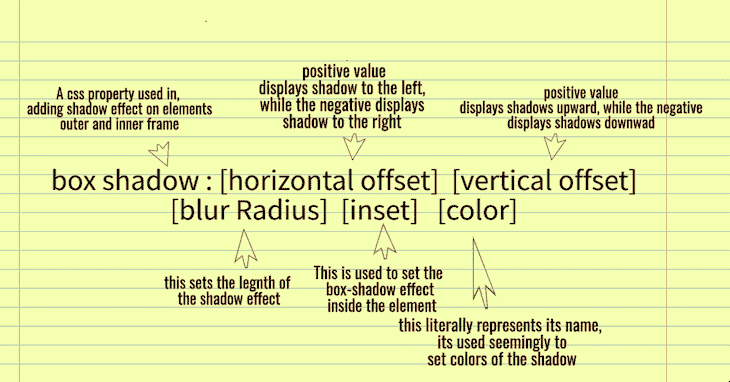
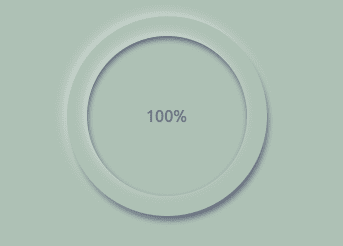
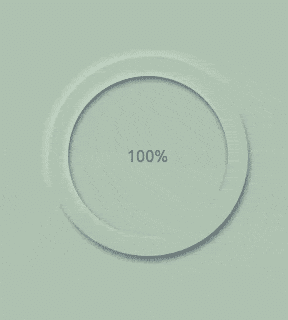
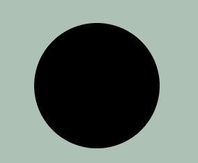
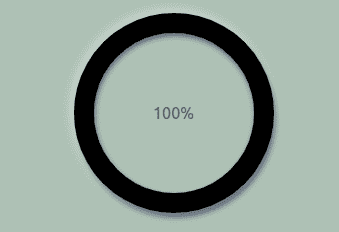
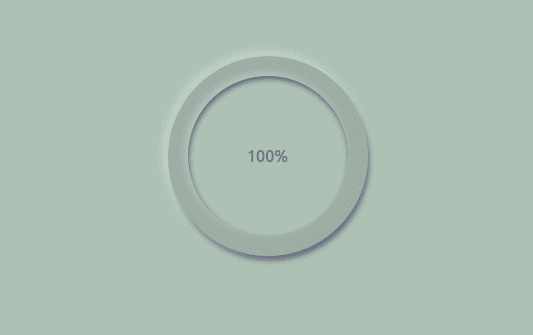

# 在 React 中创建一个新的进度条

> 原文：<https://blog.logrocket.com/create-neumorphic-progress-bar-react/>

## 介绍

我们都至少在移动设备上遇到过一次进度条，比如在安装谷歌的任何东西时。

我们在这篇文章中的目标是使用 React 和 CSS 构建一个动画的、新形态的进度条。进度条图形将伴随着进度的文本表示，以百分比格式表示，范围从 1 到 100。

在本教程结束时，我们应该有:


在本文中，我们将通过以下几个部分来学习如何在 React 中构建和样式化一个 neumorphic 进度条:

## 什么是神经形态？

Neumorphism，也称为软 UI 或 skeuomorphism 的改进，使用 CSS 中的高光和`box-shadow`属性使元素看起来好像浮在 UI 上。

如果你知道 skeuomorphism，那么，neumorphism 是它的新版本。它是平面和 skeuomorphic 设计的产品。根据许多资料显示， [Alexander Plyuto](https://dribbble.com/alexplyuto) 是这种设计之父，因为他是 2019 年第一个在运球上使用这种风格的设计的人。

## 设置开发区域

### 先决条件

读者应该预先知道在 React 中使用 SVG，并且还应该安装:

*   反应 18
*   Node.js ≥ v16.14.0

让我们的项目运行的第一步是为项目创建一个文件夹。我给我的取名`progress-bar`。

安装 React。我将通过在我的代码编辑器中运行以下代码来实现这一点:

```
npx create-react-app progress-bar @version 18

```

切换到`progress-bar`文件夹并运行:

```
npm start

```

我们的 React 应用程序应该会出现在您的浏览器中。最后，要设置好一切，删除 JSX 中不需要的文件和所有返回的内容。

## 核态的性质

这一引人注目的设计之所以成为可能，要感谢在其开发中使用的一个主要 CSS 属性:`box-shadow`。明智的做法是[熟悉 CSS 中的](https://blog.logrocket.com/three-ways-style-css-box-shadow-effects/) `[box-shadow](https://blog.logrocket.com/three-ways-style-css-box-shadow-effects/)` [属性](https://blog.logrocket.com/three-ways-style-css-box-shadow-effects/)，因为没有这个属性，实际上就没有办法实现 neumorphism。

如果你需要的话，这里有一个快速复习:



## 创建一个`progress-bar`组件

实现我们的目标有三个主要步骤:

1.  创造一个新的圆形
2.  创建一个 SVG 圆
3.  添加 JavaScript 功能

### 创造一个新的圆形

我们将需要一个新的组件来开始；我们可以将其命名为`Neumorphism.js`。这个组件将有两个`div`,它们有`classNames`连接到他们的样式。

让我们将这些导入到我们的 main `App.js`中，使它能够在浏览器中以`localhost:3000`呈现。

```
//IMPORT COMPONENT
import React from 'react';
import Neumorphism from './Neumorphism';
import './App.css';

function App() {
 return (
   <main>
     <Neumorphism />
   </main>

 );
}

export default App;

```

我们的组件文件应该如下所示:

```
//NEUMORPHISM.JS

import React from 'react';
import './App.css';

function App() {
 return (
   <main className='container'>
     <div className="outside-progress-bar">
    <div className='inside-progress-bar'>
      <p> Neurmophism</p>
    </div>
   </div>
   </main>
 );
}

```

随着`div`的结束，我们需要这个应用程序的样式和动画。

### 使用 CSS 设置样式

我们项目的第一步是在我们的`neumorphism.js`组件中创建一个神经圆形。因为我们正在创建一个进度条，所以将我们的`div`居中是明智的。让我们完成它。

```
.container {
   height: 100Vh;
   display: flex;
   align-items: center;
   justify-content: center;
   background-color: rgb(178, 190, 181);
}

//you can also add 30px of padding to center the container

```

## 添加神经变形效果

对于我们的新形效果，我们需要创建两个分别为 160 像素和 140 像素的圆来显示渐变效果。让我们通过向我们的`classNames`添加基本样式来完成这项工作:

```
.circle1 {
   height: 160px;
   width: 160px;
   border: 1px solid black;
   border-radius: 50%;
   padding: 3%;
}

.circle2 {
   height: 140px;
   width: 140x;
   border: 1px solid black;
   border-radius: 50%;
   height: 100%;
}

```

这是我们添加一个`box-shadow`在我们的圆上创建神经变形的效果的地方:

```
.circle1 {
   height: 160px;
   width: 160px;
   border-radius: 50%;
   padding: 3%;
   box-shadow: -3px -3px 10px #ffffff73, 
               2px 5px 5px rgba(94, 104, 121, 288);
}

.circle2 {
   height: 140px;
   width: 140x;
   border-radius: 50%;
   height: 100%;
   box-shadow: -3px -3px 10px #ffffff73, 
               inset 1px 3px 5px rgba(94, 104, 121, 288);
}

```


毫无疑问，这看起来真的很棒。

## 实现进度条

我们需要显示一个数字，我们可以添加功能，所以它可以显示我们的应用程序进度的百分比。要做到这一点，需要风格。

```
<div>
   <p>100%</p>
</div>

```

```
//center the paragraph

display: flex;
align-items: center;
justify-content: center;

```



### 使用 SVG

现在，我们将在 React 中使用 [SVG](https://developer.mozilla.org/en-US/docs/Web/SVG) 标签来适应我们的新生态圈并显示我们的进展。

我们怎样才能做出一个圆来适应我们的新形圆呢？获得圆的大小是合乎逻辑的，这可以使用浏览器中的`ctrl+shift+i`命令从浏览器的控制台获得。



在我们的例子中，`200px`将`outer-circle`设置为`200px`，将`inner-circle`设置为`160px` x `160px`，填充为`20px`。这给了我们一个关于 SVG 圈应该有多大的概念。

让我们把这件事做完。以下是步骤:

1.  首先，我们为 SVG 创建一个组件
2.  然后，在我们的 JSX 中获取 SVG 标签
3.  最后，我们输入圆的尺寸`[cx](https://developer.mozilla.org/en-US/docs/Web/SVG/Attribute/cx)`、`[cy](https://developer.mozilla.org/en-US/docs/Web/SVG/Attribute/cy)`和`[r](https://developer.mozilla.org/en-US/docs/Web/SVG/Attribute/r)` CSS 属性

```
import React from 'react';
import './progress.css';

function Progress(){
 return(
   <main className='container'>
       <div>
       <svg  className='circle'>
         <circle cx="100px" cy="100px" r="90px"  />
       </svg>
     </div>
   </main>
)
}

export default Progress

```

我们需要将这个组件导入到我们的 main `app.js`中，这样我们就可以像前面一样在浏览器中呈现它。

```
import React from 'react';
import Neumorphism from './Neumorphism';
import Progress from './Progress';
import './App.css';

function App() {
 return (
   <main>
     <Neumorphism />
     <Progress />
   </main>

 );
}

export default App;

```

下面是它现在在我们的浏览器中的样子:



在这一点上，我们需要使我们的 SVG 圆适合我们上面的新形圆。毫无疑问，`position-absolute` CSS 属性将最快地完成这项工作。

```
 .circle {
       height: 300px;
       width: 300px;
       position: absolute;
       bottom: 20%;
       right: 34.3%;
   }

```


我减小了圆圈的高度和宽度，以展示`position-absolute`如何完成工作。

显然，我们不能让 SVG 显示过程停留在填充的新形圆上，这将带我们进入下一步。

将填充设置为`none`并添加一个笔画`20px`以完全适应:

```
stroke-width: 20px;
fill: none;
stroke: black;

```



现在，让我们添加一个模糊的笔画，只是因为它使它更有吸引力:

```
stroke: rgba(0, 0, 0, 0.1);

```



我们的下一步是动画我们的中风。使用一个 [](https://developer.mozilla.org/en-US/docs/Web/SVG/Attribute/stroke-dasharray) ``[stroke-dasharray](https://developer.mozilla.org/en-US/docs/Web/SVG/Attribute/stroke-dasharray)`来描绘出我们的圆中使用的虚线图案，我们将更容易地勾勒出这个形状的动画。在我们这里是`565px`。`

 `We tried 400 and we got this.

565 is the perfect match.

我们还将使用一个`[stroke-dashoffset](https://developer.mozilla.org/en-US/docs/Web/SVG/Attribute/stroke-dashoffset)`来移除`stroke-dasharray`渲染的任何东西。我们需要`stroke-dasharray`,因为当`stroke-dasharray`渲染圆的完整形状时，偏移会去掉渲染的 stroke-dasharray，这样它就可以被动画重新填充。我们将把它设置为 565 像素，以允许动画执行填充过程。

我们的最后一步是将`animation`属性添加到 SVG 循环中。在我的例子中，我把它命名为`progression`，并把它命名为`1s`。我们还需要将`@keyframes`设置为`100%`，将`stroke-dashoffset`设置为`0`，以使其动画化。

以下是添加的样式:

```
// Styles
{ 
stroke-dasharray: 565px;
   stroke-dashoffset: 565px;
   animation: progress 1s linear forwards;
}

@keyframes progress {
   100% {
       stroke-dashoffset: 0;
   }
}

```

现在，每当我们刷新，我们有我们的进度条动画。


## 用`useState`和`useEffect`反应钩显示数字进度

您可能已经注意到，尽管创建了动画，我们的进度条显示的是静态的数字`100%`。为了得到正确的进度数字显示，我们需要使用`useState`和`useEffect`钩子来显示我们的进度百分比。这些钩子将被导入到我们的`neumorphism.js`组件中。

```
import React, { useState,useEffect } from 'react';

```

使用`useState`钩子，我们的状态将是一个数字，最好从`0`开始。

```
const [progress, setprogress] = useState(0);

```

接下来，我们需要一个没有依赖关系的`useEffect`钩子，所以我们创建一个间隔来运行每个`2ms`。这个区间的基本工作就是设定我们的进度。为了有更好的控制，我们使用回调的形式从设置的进度增加`1`。

为了清除这个间隔并避免无限循环，我们使用了一个`if`语句，所以当它到达`98`或等于`100`时，它停止运行，我们返回值，应该是`100%`。

最后，我们需要在 JSX 中传递我们的进度，这样我们就可以看到它的增加。让我们看看这一切都完成了。

```
import React, { useState,useEffect } from 'react'; 
import './App.css';
function Neumorphism() {
 const [progress, setprogress] = useState(0);

useEffect(()=>{
 const interval= setInterval(()=>{
   setprogress((oldvalue)=>{

     let newValue=oldvalue + 1;

     if(newValue>98){
       clearInterval(interval);
     }

     return newValue;

   })
 },20)
 },[]);

 return (
   <main className='container'>
     <div className="circle1">
       <div className='circle2'>
         <div>
           <p className='text'>{progress}%</p>
         </div>
       </div>
     </div>
   </main>
 )
}

export default Neumorphism;

```

这是我们最终拥有的:


## 结论

我们已经能够建立一个具有神经形态效果的进度条。在我们的例子中，我们用它来设计一个进度条来显示下载的文件。在你的应用程序中使用这种神经形态的设计会让你的 UI 更有吸引力，而且考虑到在你现有的 React 应用程序中实现它是多么容易，我希望你尽快尝试一下。

## [LogRocket](https://lp.logrocket.com/blg/react-signup-general) :全面了解您的生产 React 应用

调试 React 应用程序可能很困难，尤其是当用户遇到难以重现的问题时。如果您对监视和跟踪 Redux 状态、自动显示 JavaScript 错误以及跟踪缓慢的网络请求和组件加载时间感兴趣，

[try LogRocket](https://lp.logrocket.com/blg/react-signup-general)

.

[ ](https://lp.logrocket.com/blg/react-signup-general) [](https://lp.logrocket.com/blg/react-signup-general) 

LogRocket 结合了会话回放、产品分析和错误跟踪，使软件团队能够创建理想的 web 和移动产品体验。这对你来说意味着什么？

LogRocket 不是猜测错误发生的原因，也不是要求用户提供截图和日志转储，而是让您回放问题，就像它们发生在您自己的浏览器中一样，以快速了解哪里出错了。

不再有嘈杂的警报。智能错误跟踪允许您对问题进行分类，然后从中学习。获得有影响的用户问题的通知，而不是误报。警报越少，有用的信号越多。

LogRocket Redux 中间件包为您的用户会话增加了一层额外的可见性。LogRocket 记录 Redux 存储中的所有操作和状态。

现代化您调试 React 应用的方式— [开始免费监控](https://lp.logrocket.com/blg/react-signup-general)。`