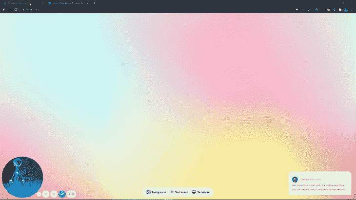
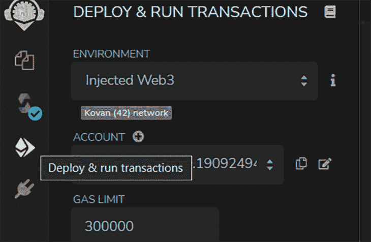
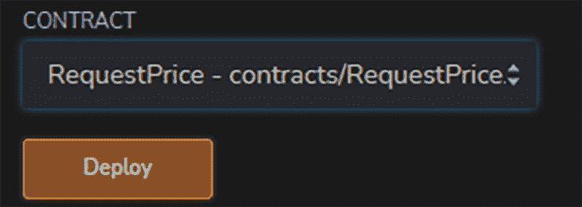
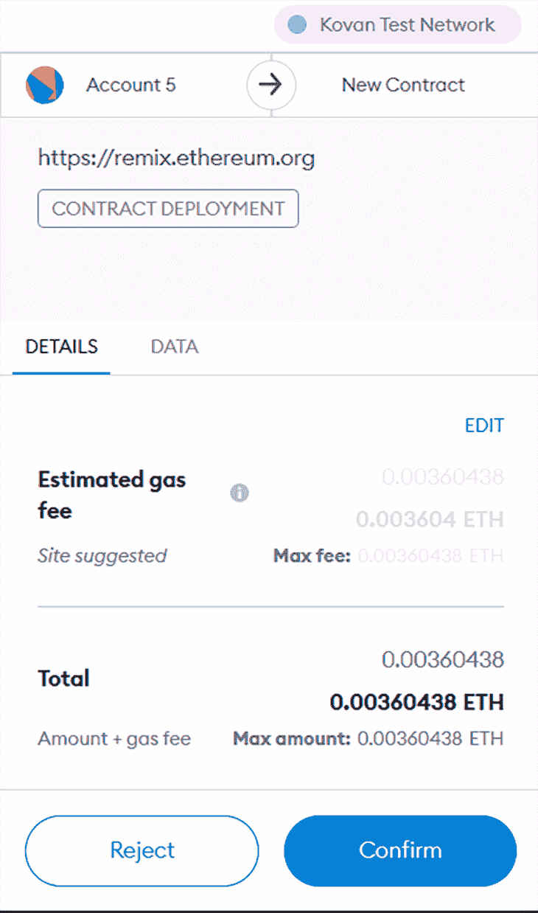
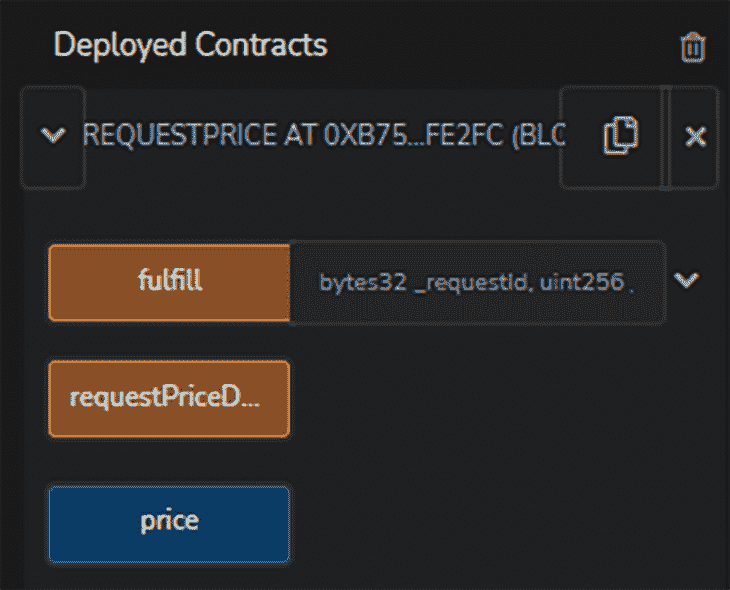
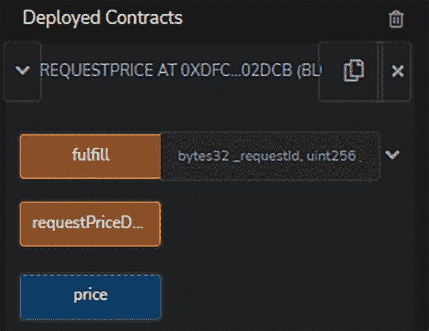

# 使用以太坊智能合约创建您自己的甲骨文

> 原文：<https://blog.logrocket.com/create-oracle-ethereum-smart-contract/>

在本文中，我们将了解如何使用以太坊智能合约开发 oracle。下面是我们将使用的技术的简要概述，以及进一步学习的链接。

### 知识要求

在我们深入研究之前，让我们回答一些关于我们将要研究的技术的基本问题。

### 什么是区块链？

区块链可以被描述为一种计算基础设施，旨在促进高度可信的协作。这是一个公共数据库，在网络中的许多计算机之间更新和共享。这种值得信赖的协作为参与者提供了对协作可靠性的坚定信念。

### 以太坊是什么？

以太坊创始人维塔利·布特林(Vitaly Buterin)认识到，最受欢迎的区块链网络比特币(Bitcoin)存在局限性，原因是其基于堆栈的脚本、缺乏功能以及除了加密货币所有权转移之外的应用开发能力低下。

以太坊与比特币的不同之处在于，它拥有一种内置的图灵完整编程语言，建立了一个智能合约，并提供了一个去中心化的应用平台，允许任何人定义、创建和交易加密货币和加密资产。

### 什么是智能合同？

智能合同是在区块链的协作过程中建立信任的一种方式。这通过将契约的执行和监管机制转移到软件逻辑，用基于密码的信任取代了基于品牌的信任，而软件逻辑是在一个分散的网络上运行的。借助智能合约，开发人员可以构建和部署面向用户的应用程序(游戏、市场等)。)，而这些通常被称为[去中心化应用(DApps)](https://ethereum.org/en/developers/docs/dapps/) 。

### 神谕是什么？

神谕诞生于在区块链扩展可能的合作类型的愿望。它们将区块链连接到外部系统，并允许访问来自链外系统的数据，充当区块链的真实来源。因此，它们为区块链提供了通往离线系统的安全网关，允许智能合约应用程序验证外部事件，并触发对外部服务的操作。

因此，oracles 充当了两种环境之间的桥梁:链上指的是区块链网络，链外指的是外部世界的系统。

有不同类型的 oracles 涉及获取、验证和交付数据的某种组合:

1.  **Input Oracle**:这些从链外来源获取数据，并将其交付给区块链网络用于智能合约消费
2.  **输出预言**:启用智能合约来触发链外系统上的动作
3.  **跨链 Oracle**:实现区块链之间的互操作，允许不同区块链之间的信息读写
4.  支持计算的甲骨文(Compute-enabled Oracle):它们变得越来越流行，因为它们提供了一个非常有用、安全、离线的计算解决方案来对一组输入执行计算；这是以太网上相对昂贵的计算成本的替代方案

## 安装

多个区块链团队正在积极开发可能的 oracle 解决方案:

Chainlink 被认为是领跑者，所以我们将在本文中探讨它。Chainlink 提供了一种开箱即用的能力，将我们的智能合约连接到大多数 API，包括来自链外 API 的 API。

Chainlink 还运营一个 [Chainlink Market](https://market.link/search/nodes) ，这是一个经过认证的节点运营商列表，这些运营商利用 Chainlink 网络，通过他们自己的 Chainlink 节点直接在链上访问他们的数据。

我们的开发将使用 [Remix](https://remix.ethereum.org/) 完成，这是一个用于在浏览器中创建、运行和调试智能合同的 web IDE。有了 Remix，我们不需要开发机器，因为一切都包含在 web 界面中。

Metamask 允许任何人与兼容以太坊的区块链交互，允许创建地址。它也很容易与混音集成。

## 项目概述

在本文中，我们将探索利用 Chainlink 客户端从链外系统检索比特币当前价格的过程，以创建 oracle 智能合约。我们还将使用来自 Chainlink 的经过验证的链上数据源来检索以太坊的最新价格。

为了探索在智能合约中检索数据的这两种不同方法，我们将创建两个单独的智能合约，并将它们部署到区块链。

1.  我们的第一个智能契约将利用 ChainlinkClient，我们可以连接到任何 URL 来检索数据，并允许创建链上 oracles
2.  我们的第二个智能合同使用 Chainlink 数据馈送，它提供了一个值得信赖的独立数据提供者列表，供分散式 oracle 网络使用

## 设置 MetaMask 钱包

要开始我们的开发过程，设置 MetaMask wallet 是关键。安装[元掩码扩展](https://metamask.io/download)。安装成功后，打开浏览器扩展列表并单击元掩码图标。


按照 MetaMask 中的说明创建新的 wallet。确保将你的 12 个单词的助记短语安全地存放在一个只有你能访问的安全位置。

设置 MetaMask 以使用 [Kovan 测试网络](https://kovan-testnet.github.io/website/)。


下一步是资助 MetaMask 钱包。[科万测试网](https://kovan-testnet.github.io/website/)提供科万醚(KEth)，它没有市场价值，允许我们访问科万测试网。

Chainlink 提供了一个[龙头](https://faucets.chain.link/kovan)，用于获取 Chainlink 的加密货币链接进行测试。我们将使用此链接来确保智能合同的成功执行，因为它依赖于 Chainlink 网络。

按照下面 gif 中记录的步骤将 0.1 测试 ETH 和 10 测试链接发送到您在 Kovan testnet 上的 MetaMask 钱包。


## 创建我们的`RequestPrice`甲骨文

Chainlink 使智能合约能够访问任何外部数据源。依靠 Chainlink 契约库，我们可以使用一组工具来创建智能契约，这些契约可以消费数据并充当 oracles。

在 Remix 中，创建一个名为`RequestPrice.sol`的新文件，它将保存我们的智能合约代码。

Chainlink 的[请求和接收数据周期](https://docs.chain.link/docs/request-and-receive-data/)允许消费 API 响应，我们的契约需要从`[ChainlinkClient](https://docs.chain.link/docs/chainlink-framework/)`继承。

为了在我们的智能契约中构建 API 请求，我们依赖于 struct `Chainlink.Request`。该请求应该包括 oracle、作业 ID、费用和回调函数签名。

`oracle`关键字指的是契约进行 API 调用的特定链接节点，而`jobId` 指的是该节点运行的特定作业。`RequestPrice`足够灵活，可以调用任何公共 URL。

选择 oracle 节点非常重要。我们的智能契约需要发出 HTTP `GET`请求，因此正确的节点选择应该是支持 HTTP `GET`适配器的节点。您可以[在 Chainlink 网站上查看各种可用 oracle 节点的列表](https://docs.chain.link/docs/data-provider-nodes/#data-provider-nodes-list)。

在我们的`RequestPrice.sol`文件中，定义了我们的智能契约，我们已经将数据源设置为公共 API [CryptoCompare](https://min-api.cryptocompare.com/) 。我们合同中定义的函数`requestPriceData`允许检索以美元表示的 BTC 当前价格。

```
// SPDX-License-Identifier: GPL-3.0

pragma solidity >=0.7.0 <0.9.0;

import "@chainlink/contracts/src/v0.8/ChainlinkClient.sol";

contract RequestPrice is ChainlinkClient {
    using Chainlink for Chainlink.Request;

    uint256 public price;

    address private oracle;
    bytes32 private jobId;
    uint256 private fee;

    constructor() {
        setPublicChainlinkToken();
        oracle = 0xc57B33452b4F7BB189bB5AfaE9cc4aBa1f7a4FD8;
        jobId = "d5270d1c311941d0b08bead21fea7747";
        fee = 0.1 * 10 ** 18; 
    }

    /**
     * Create a Chainlink request to retrieve API response, find the target
     * data.
     */
    function requestPriceData() public returns (bytes32 requestId)
    {
        Chainlink.Request memory request = buildChainlinkRequest(jobId, address(this), this.fulfill.selector);

        // Set the URL to perform the GET request on
        request.add("get", "https://min-api.cryptocompare.com/data/generateAvg?fsym=BTC&tsym=USD&e=Kraken");

        // Specify the path for retrieving the data
        request.add("path", "RAW.PRICE");
        // Sends the request
        return sendChainlinkRequestTo(oracle, request, fee);
    }

      /**
     * Callback Function
     */
    function fulfill(bytes32 _requestId, uint256 _price) public recordChainlinkFulfillment(_requestId)
    {
        price = _price;
    }
}

```

在`RequestPrice`契约中指定的响应类型是一个无符号整数(`uint256`)，但是可以指定多种数据类型，例如:

*   `bytes32`:字符串和字节值
*   `bool`:真值或假值
*   `int256`:有符号整数
*   `uint256`:无符号整数

## 编译智能合同

在 Remix IDE 中，点击 **Solidity 编译器**查看编译器设置。


我们将使用默认的编译器设置，但要确保你的 Solidity 版本与编译器中使用的版本相同。点击**编译 RequestPrice.sol** 编译我们刚刚创建的智能合同。


编译合同后，导航到**部署和运行**选项卡。在下拉列表中选择**注入 Web3** 环境，将合同部署到区块链。


在部署之前，仔细查看协定名称，因为可能有其他名称相似的协定。



This is a passable contract name, so we’re good to go.

点击**部署**按钮。MetaMask 将打开并提示您付款以部署合同。

返回我们的 MetaMask 钱包，确认设置为 Kovan 网络后再接受交易。



交易完成后，您的合同应该出现在 Remix 中的**已部署合同**列表下。点击**合同**下拉菜单查看其变量和功能。



## 运行`RequestPrice`智能合约中的功能

为了运行合同中的功能，我们需要为合同提供资金。我们将为我们的 Solidity 合同提供资金，这是我们使用他们的水龙头获得的链式网络的本地令牌 link。

在**已部署合同**部分，使用合同标题附近的**复制**按钮复制合同地址。然后，按照以下步骤操作:

1.  Open MetaMask
2.  选择 Kovan 测试网
3.  点击 MetaMask 中的**发送**按钮，发起交易
4.  粘贴复制的合同地址
5.  从“资产”菜单中，选择“链接”或“ETH”以发送至合同。 [Chainlink 提供了接收 testnet 链接的指南](https://docs.chain.link/docs/acquire-link/) 
6.  点击**下一步**查看交易
7.  如果满意，点击**确认**

回到我们的 Remix IDE，在 **Deploy and Run Transactions** 选项卡下，导航到 Deploy Contract 部分并单击 **requestPriceData** 按钮。


您应该会收到来自 MetaMask 的提示，要求确认交易。点击**确认**按钮。


最后，点击价格变量按钮，查看比特币的当前美元价格。


如果您已经做到了这一步，那么您已经成功地在以太坊区块链上创建并部署了 oracle 智能合约。

## 使用链接数据馈送检索数据

在智能合约的下一个实现中，我们将使用 [Chainlink 数据馈送](https://docs.chain.link/docs/using-chainlink-reference-contracts/)来查看更深入的实现。

前面我提到过，除了通过 HTTP 请求之外，还有不同的方法可以在我们的智能契约中检索数据。构建智能合同时要考虑的一个关键方面是将数据输入 oracle 的数据源的质量。

为了帮助实现这一点，Chainlink 策划了一系列分散式数据馈送，为我们的分散式应用提供安全的数据源。我们所需要做的就是从另一个链上智能合同中提取数据到我们的智能合同中。

您可以[在 Chainlink 网站上访问由 Chainlink](https://docs.chain.link/docs/ethereum-addresses/) 管理的以太坊数据。

让我们来测试一下。在 Remix 中创建另一个名为`EthPrice.sol`的文件。

```
// SPDX-License-Identifier: GPL-3.0

pragma solidity >=0.7.0 <0.9.0;

import "@chainlink/contracts/src/v0.8/interfaces/AggregatorV3Interface.sol";

contract EthPrice {

     AggregatorV3Interface internal ethFeed;

     // Precomputing hash of strings
       bytes32 ethHash = keccak256(abi.encodePacked("ETH"));

    /**
     * Network: Kovan
        0x9326BFA02ADD2366b30bacB125260Af641031331
     * Address: 0x169e633a2d1e6c10dd91238ba11c4a708dfef37c
     */
    constructor() {
        ethFeed = AggregatorV3Interface(0x9326BFA02ADD2366b30bacB125260Af641031331);
    }

    /**
     * Returns the latest price
     */
    function getEthPrice() public view returns (int) {
        (
            uint80 roundID,
            int price,
            uint startedAt,
            uint timeStamp,
            uint80 answeredInRound
        ) = ethFeed.latestRoundData();
        return price;
    }

}

```

从 Remix 中的**部署**选项卡部署合同并运行该功能。


## 结论

本教程非常令人兴奋，因为我们看到了如何通过为我们的分散式应用程序提供准确的数据，将区块链和智能合约的功能扩展到现实世界的应用程序中。

创建安全可信的神谕是区块链革命的一个关键方面，因为它使得链外世界系统能够迁移到链上系统。在我们的第二个智能合同实施中，我们研究了 Chainlink 如何通过提供经过审查的单一来源数据提供商和分散数据提供商的列表来帮助确保 DApps 中使用的数据的可靠性。

## 加入像 Bitso 和 Coinsquare 这样的组织，他们使用 LogRocket 主动监控他们的 Web3 应用

影响用户在您的应用中激活和交易的能力的客户端问题会极大地影响您的底线。如果您对监控 UX 问题、自动显示 JavaScript 错误、跟踪缓慢的网络请求和组件加载时间感兴趣，

[try LogRocket](https://lp.logrocket.com/blg/web3-signup)

.

[](https://lp.logrocket.com/blg/web3-signup)[https://logrocket.com/signup/](https://lp.logrocket.com/blg/web3-signup)

LogRocket 就像是网络和移动应用的 DVR，记录你的网络应用或网站上发生的一切。您可以汇总和报告关键的前端性能指标，重放用户会话和应用程序状态，记录网络请求，并自动显示所有错误，而不是猜测问题发生的原因。

现代化您调试 web 和移动应用的方式— [开始免费监控](https://lp.logrocket.com/blg/web3-signup)。