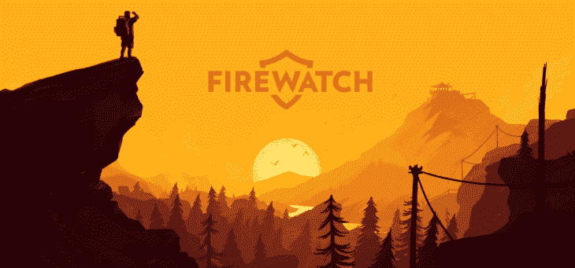
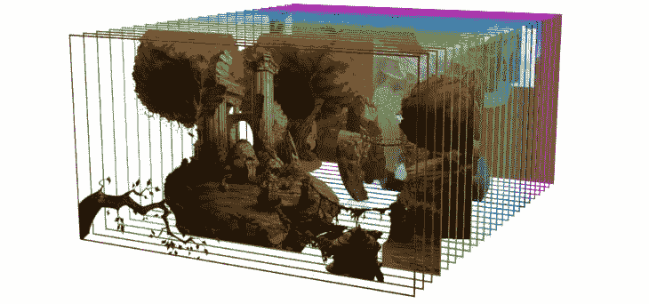
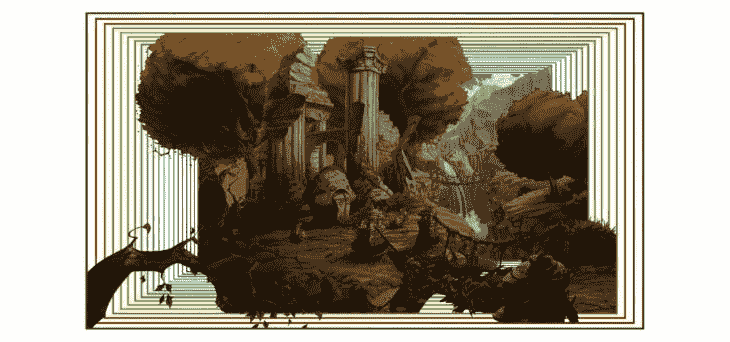
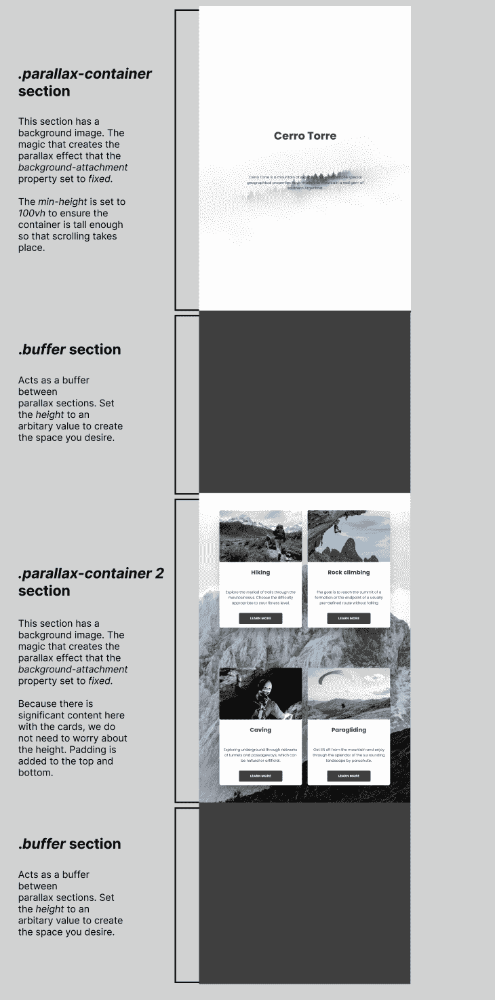
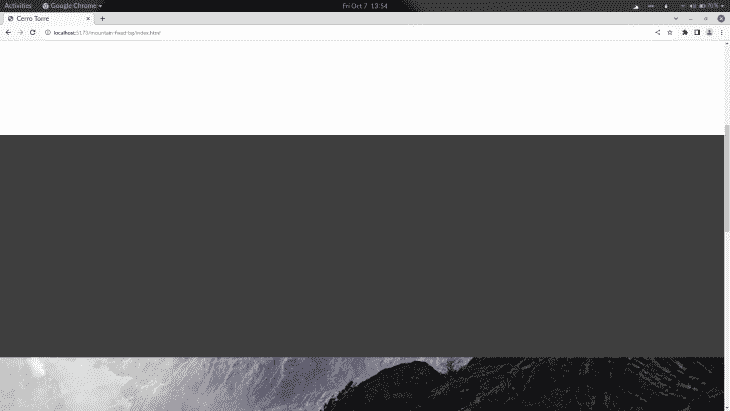
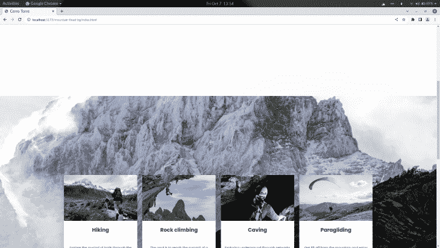
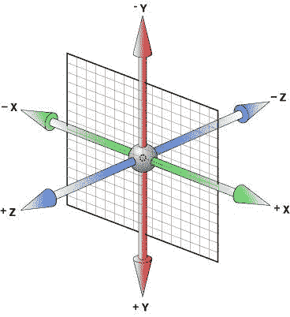
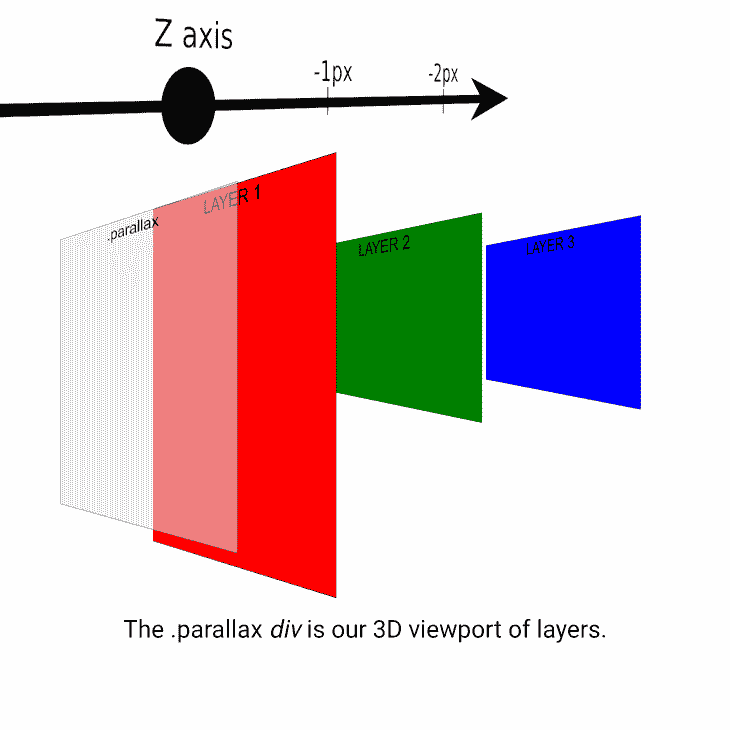
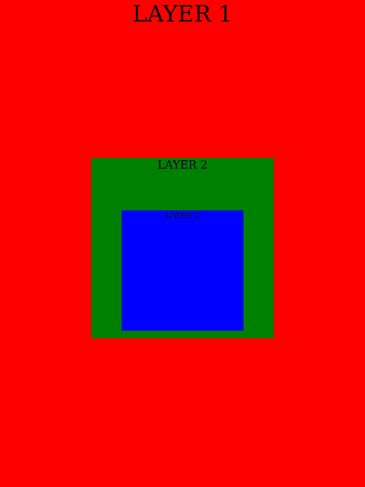
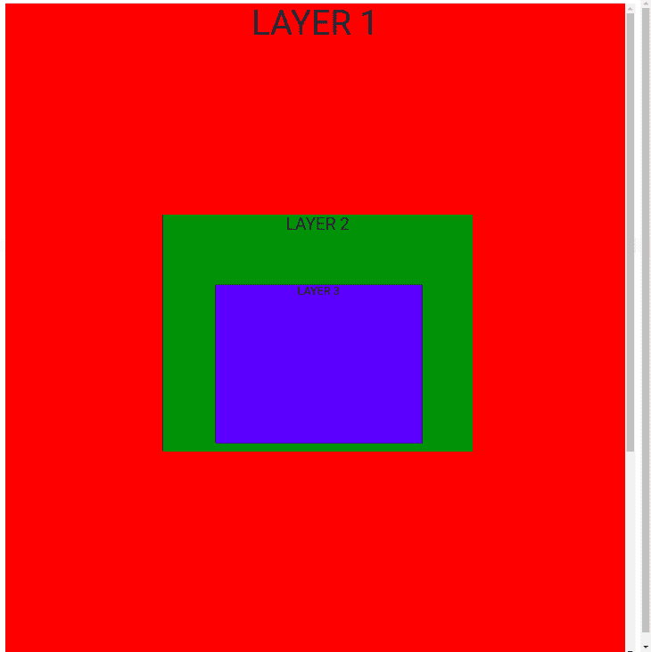

# 用 CSS 创建视差滚动

> 原文：<https://blog.logrocket.com/create-parallax-scrolling-css/>

视差滚动可以通过使网站更加动态和身临其境来改善网站的浏览体验。用最简单的术语来说，视差滚动是一种[三维](https://en.wikipedia.org/wiki/Three-dimensional_space_(mathematics))效果，用于增加网页的深度。这其中有一些细微的差别，我们稍后会澄清。

在本文中，我们将讨论考虑使用视差滚动的原因。我们将演示如何用 CSS 实现视差滚动效果，并且我们将分享使用 CSS 而不是 JavaScript 来创建视差效果的一些好处。在整个教程中，我们将分享几个 CSS 视差效果的例子和用例。

视差滚动的一个著名且执行良好的例子是 [Firewatch 电脑游戏网站](http://www.firewatchgame.com)。英雄部分包含了一个乡村场景，一个徒步旅行者穿过山谷凝视着一个小山站。当用户向下滚动时，视差效果会使场景消失以显示下面的内容:



Parallax scrolling effect example from the [Firewatch](http://www.firewatchgame.com/); Firewatch is a trademark of Campo Santo.

看起来像魔术，对吧？🪄🎩

让我们去后台看看奇迹是如何发生的！🧐⚙️

*向前跳转:*

视差滚动是一种计算机图形技术，其中背景图像比前景图像移动得更慢，从而在 2D 场景中产生深度错觉。这项技术起源于 20 世纪 30 年代[传统动画](https://en.wikipedia.org/wiki/Traditional_animation)中使用的[多平面摄像机](https://en.wikipedia.org/wiki/Multiplane_camera)技术；

模拟 3D 场景外观的 2.5D 滚动示例。[由维基百科用户 Janke](https://en.wikipedia.org/wiki/File:MultiplaneDemo.webm) 制作。公共领域，通过维基百科。

上述示例通常被称为 2.5D(二维半)或伪 3D 透视图，因为它模拟了三维场景的外观。

视差滚动在 [2D 计算机图形学](https://en.wikipedia.org/wiki/2D_computer_graphics)中得到普及，并从 20 世纪 80 年代初开始包含在[视频游戏](https://en.wikipedia.org/wiki/Video_games)中。许多人认为街机游戏[月球巡逻](https://en.wikipedia.org/wiki/Moon_Patrol)是这种效果在侧滚游戏中的首次应用。视差滚动使其成为 80 年代和 90 年代许多流行的平台游戏，如[刺猬索尼克](https://en.wikipedia.org/wiki/Sonic_the_Hedgehog)。

游戏[耳语世界](https://en.wikipedia.org/wiki/The_Whispered_World)通过图层的合成实现了视差效果。下面是游戏各层的等轴视图，每一层都用一个彩色框架来区分:



A side view of the layers used for parallax scrolling in [The Whispered World](https://en.wikipedia.org/wiki/The_Whispered_World). [Claas Paletta, PR & New Business Manager of Daedalic Entertainment GmbH (rights owner)](https://en.wikipedia.org/wiki/Parallax_scrolling#/media/File:The_Whispered_World_parallax_scrolling_sample_1.jpg). Free use, via Wikimedia Commons.

从正面看，这些层构成了一个完整的场景:



A front view of the layers used for parallax scrolling in [The Whispered World](https://en.wikipedia.org/wiki/The_Whispered_World). [Claas Paletta, PR & New Business Manager of Daedalic Entertainment GmbH (rights owner)](https://en.wikipedia.org/wiki/Parallax_scrolling#/media/File:The_Whispered_World_parallax_scrolling_sample_1.jpg). Free use, via Wikimedia Commons.

这种技术被整合到网页设计中，但直到 2011 年推出 [HTML5](https://en.wikipedia.org/wiki/HTML5) 和 [CSS 3](https://en.wikipedia.org/wiki/Cascading_Style_Sheets#CSS_3) 才开始流行。随着 CSS 的成熟，不使用 JavaScript 和黑客技术实现这一效果变得越来越容易。

一个不幸的结果是，许多人将视差效应视为一个笼统的术语；它已经成为“免费滚动效果”的同义词。但实际上，视差效果不需要任何动画或滚动触发的事件。它纯粹基于以不同速度移动的元素来给出深度感。

在网页设计中，这是通过将元素分组为“层”，并控制每层移动的速度来实现的。在典型的网页中，元素是垂直布局的，移动是用户滚动页面的结果。

在你把它放到一个网站上之前，考虑一下你为什么想要使用视差滚动效果是很重要的！这里有几个原因。

### 提高用户参与度

视差图形可以抓住用户的注意力，提高参与度。这可以减少用户在浏览完网站的一页后点击后退按钮或关闭标签的比例。如果你的网站的成功依赖于用户浏览一个以上的页面，那么提高(或降低)跳出率是有益的。

### 作为讲故事的辅助工具

好的设计会对用户产生影响。视差图形可以帮助用户进行身临其境的旅行。您可以使用视差滚动来制作一个单页网站，访问者可以阅读关于您的产品或品牌的整个故事，而无需导航到多个页面。查看 Netlify 制作的 [Matterday，获得一个很好的例子；这个网站讲述了一个关于网络生活如何节省时间的令人信服的故事，并提供了如何利用额外时间的建议！](https://matterday.netlify.com/)

## 如何在 CSS 中实现视差效果

一般来说，用 CSS 实现视差效果有两种方法。让我们来探讨和比较这两种方法。

### 方法 1:固定背景的位置

固定背景的位置是用 CSS 创建视差效果的最早方法。你可以把它想象成 2.5D 视差实现。

这种方法的秘密是为一个部分使用背景图像并固定其位置，通常使用`[background-attachment:fixed](https://developer.mozilla.org/en-US/docs/Web/CSS/background-attachment)`。当用户滚动特定部分时，背景不会滚动，但其他元素会滚动。然而，一旦用户滚动到该部分之外，就会出现不同的背景。通过让元素以不同的速度移动，我们创造了一个视差效果！

使用这种方法需要记住的一点是，[手机浏览器对](https://caniuse.com/background-attachmenthttps://caniuse.com/background-attachment) `[background-attachment:fixed](https://caniuse.com/background-attachmenthttps://caniuse.com/background-attachment)` [的支持似乎仍有问题](https://caniuse.com/background-attachmenthttps://caniuse.com/background-attachment)！我们将在本文后面讨论这个问题的解决方法。

让我们探索一个具体的例子来更好地理解这种方法是如何工作的。这里有一个完整的例子，展示了阿根廷塞罗托雷山的活动:

#### 设计布局

当提到视差例子时，许多开发者似乎更喜欢那些有山的场景。我想这是因为当你看到一些东西从山上升起的时候看起来很酷，但是不要让这限制了你对这种技术的应用！

以下是网页设计的概述。我们创建了一种带状设计，其中我们将视差部分与非视差部分交错(我称之为“缓冲”部分):



“缓冲”部分不是视差效果工作所必需的，但是，它可以作为视差部分之间的空白。此外，它可以提供对随后的视差部分的背景的起点的更多控制。

例如，在 1920px 的屏幕上，如果我们向下滚动第一个视差部分的大部分，我们会在第二个视差部分看到山区背景的中间:



如果没有第一个“缓冲”部分，下面是我们将在页面的相同位置看到的内容。你会注意到第二个视差部分的山地背景的初始视图更高:



最终，“缓冲”部分是一个设计决策；这不是实现要求。

以下是上述示例的代码笔:

见笔 [固定背景视差卷轴](https://codepen.io/robatronbobby/pen/KKRrKNz)by rob 2([@ robatronbobby](https://codepen.io/robatronbobby))
on[code Pen](https://codepen.io)。

创建视差容器的关键是用您选择的图像设置`[background-image](https://developer.mozilla.org/en-US/docs/Web/CSS/background-image)`属性，然后将`[background-attachment](https://developer.mozilla.org/en-US/docs/Web/CSS/background-attachment)`属性设置为`fixed`。`fixed`值确定背景图像相对于视窗的位置。

#### 缩放设计

使用`background-size: cover;`将图像缩放到尽可能小的尺寸以填充容器，同时保持其纵横比，这是可选的，但通常是可取的。在下面的代码中，我还使用`background-position: center`将背景图像的位置居中:

```
.parallax-container {
  /*  this is where the magic happens:  */
  background-image: url("https://images.unsplash.com/photo-1519120944692-1a8d8cfc107f?ixlib=rb-1.2.1&ixid=MnwxMjA3fDB8MHxwaG90by1wYWdlfHx8fGVufDB8fHx8&auto=format&fit=crop&w=872&q=80");
  background-attachment: fixed;
  background-position: center;
  background-size: cover;

  /* dimensions are important, ensure it is tall enough to scroll */ 
  min-height: 100vh;

  /* you are free to lay out the container items with flexbox or whatever means you wish */
  display: flex;
  flex-direction: column;
  align-items: center;
  justify-content: center;
}

```

此外，你必须注意视差容器的尺寸。容器应该足够高，需要大量的滚动！保证这一点的一个简单方法是在视差容器上设置`min-height: 100vh`,这样它将至少与屏幕的高度一样高，而不管它包含的元素。

#### 处理移动浏览器兼容性问题

遗憾的是，在移动浏览器上，`background-attachment:` `fixed`仍然存在挥之不去的问题。如果你想更好地理解这些问题，[阅读这个文档](https://caniuse.com/background-attachment)。

幸运的是，我们有一些选项来克服任何移动浏览器的不兼容性。

例如，我们可以采用核方法，使用媒体查询在移动设备(较小的屏幕)上完全消除视差。CSS 大概是这样的:

```
 /* Turn off parallax scrolling for all tablets and phones. Increase/decrease the pixels if needed */
@media only screen and (max-device-width: 1366px) {
  .parallax-container {
    background-attachment: scroll;
  }
} 

```

Murtuzaali Surti 写了一篇关于[固定后台黑客](https://css-tricks.com/the-fixed-background-attachment-hack/)的文章，并展示了当使用`background-attachment:` `fixed`时，手机浏览器中的漏洞是如何显现的。简而言之，Murtuzaali 建议使用`position: fixed`创建一个带有背景图像的元素，将内容放入一个单独的元素中，然后将其完全放置在背景元素之上(堆叠在背景元素之上)。

类似地，我们可以为固定的背景图像使用一个伪元素，它的工作原理应该是一样的。我自己没有试过，所以我个人不能保证这种方法！

#### 固定背景位置的利弊

通过固定背景的位置来实现视差滚动既有优点也有缺点。

优点:

*   相对容易理解
*   易于实施

缺点:

*   移动浏览器支持仍然有问题，但是解决方法是可用的
*   只能有两层
*   无法控制图层的速度

### 方法 2:使用 3D 翻译

在 CSS 中，我们可以在三维空间中定位元素。我们可以沿 z 轴定位元素，以增加或减少用户和元素之间的可感知距离:



由于 3D 翻译模拟现实，所以在我们的数字世界中，当我们移动东西时，会有类似的物理效果。更远的东西(即 z 轴上的负平移)将移动得更慢。相反，越近的东西(即 z 轴上的正平移)移动得越快。我们可以劫持 z 轴来控制滚动速度！

另一个物理效应是规模。如果我们把某物移得更远，它就会显得更小。如果更近，就会显得更大。如果你想对抗这种调整，你需要自己放大或缩小它。

为了实现视差效果，我们将利用三个 CSS 属性:`[position](https://developer.mozilla.org/en-US/docs/Web/CSS/position)`、`[perspective](https://developer.mozilla.org/en-US/docs/Web/CSS/perspective)`和`[transform](https://developer.mozilla.org/en-US/docs/Web/CSS/transform)`来布局元素并将其分组到层中。然后，我们将使用`translateZ()`和`scale()`转换函数来控制相对于父元素上设置的`perspective`的滚动速度和层的大小。

在我们继续之前，请记住这是一个棘手的话题，因为它违背了典型的事物。因此，让我们列出一个你应该熟悉的小清单，以便真正掌握这种方法:

*   CSS 转换:[转换属性是 CSS](https://blog.logrocket.com/deep-dive-css-individual-transform-properties/) 的核心；理解 3D 方面尤其重要
*   z-index:通过`position`和`transform`属性堆叠元素可能会导致层没有像您预期的那样堆叠。这通常是因为`transform`创造了一个新的堆叠环境。你可能需要干预和[管理](https://blog.logrocket.com/best-practices-stacking-elements-css/) `[z-index](https://blog.logrocket.com/best-practices-stacking-elements-css/)` [层](https://blog.logrocket.com/best-practices-stacking-elements-css/)取决于你的设计。如果你想提高你的理解水平，我可以推荐 Ahmad Shadeed 的文章
*   溢出:在 3D 中使用重叠元素时，必须注意溢出。如果您不太了解溢出，[这里有一个资源](https://blog.logrocket.com/how-to-prevent-overflow-scrolling-css/)可能会对您有所帮助

基思·克拉克在 2014 年写了关于 3D 翻译方法的开创性教程。本教程是对这种方法的一个很好的阐述，尽管它在实际的例子上有点轻，这可能使这种方法更容易掌握。

我不会在这里重复相同的信息，我将通过一个视差滚动的例子，并分享一些在那篇文章中没有涉及的细节。我推荐你读一读基思的文章；你可以忽略任何关于浏览器漏洞的讨论，因为这些已经不是问题了。

### 视差滚动演示

让我们创建一个基本的视差滚动例子，有三层，有一些文字和不同的背景颜色。

这是 HTML:

```
<div class="parallax">
  <!--layer 1 will be the bottom layer, layer 3 will be the top layer-->
  <div class="parallax-layer layer1">LAYER 1</div>
  <div class="parallax-layer layer2">LAYER 2</div>
  <div class="parallax-layer layer3">LAYER 3</div>
</div>

```

下面是我们可以重用的基本 CSS:

```
/* if you do not remove the margin, you will see a vertical scrollbar on the .parallax div */
body {
  margin: 0;
}

/* parallax "viewport" */
.parallax {
  height: 100vh;

  overflow-x: hidden;
  overflow-y: auto;

  perspective: 1px;
}

.parallax-layer {
  position: absolute;
  top: 0;
  right: 0;
  bottom: 0;
  left: 0;
}

.layer1 {
  transform: translateZ(0);
}

.layer2 {
  transform: translateZ(-1px);
}

.layer3 {
  transform: translateZ(-2px);
}

```

关于这段 CSS 代码，有一些事情需要注意。

首先，`parallax`类是魔法发生的地方。定义元素的`height`和`perspective`样式属性会创建一个固定原点的 3D 视口。

`perspective`属性定义了对象离用户有多远。我为`parallax`类的`perspective`属性选择了 1px 的值，这意味着我们非常非常接近 div。如果想要更明显的视差效果，可以增加该值。

效果的速度由为`perspective`和`translateZ()`提供的值的组合控制。减少`translateZ()`的值会将元素推得更远，并且该元素会滚动得更慢。该值离零越远，视差效应越明显，即`translateZ(-5px)`的滚动速度将比`translateZ(-1px)`慢。

除了基本的 CSS，你应该总是考虑层的`height`。如果一个层没有太多的内容，它可能太小，无法创建适当高的滚动上下文。有些人喜欢在`.parallax-layer`中设置默认大小。这取决于你！

我们可以使用属性:`top`、`right`、`left`和`bottom`来改变层的位置，以实现我们的设计。或者，我们也可以使用`[translate3d()](https://developer.mozilla.org/en-US/docs/Web/CSS/transform-function/translate3d)`沿着 x 轴和 y 轴移动一个元素。

现在，让我们调整大小，位置，并添加一个背景颜色到每一层，以证明这一切都适合在一起。

这是我们在 z 轴上所做工作的大概数字:



接下来，我们将使层 2 和层 3 的高度为层 1 的一半，这样我们就可以清楚地看到每一层。

然后，我们将使用`top`将第 2 层放置在 y 轴的下方，这样它就从第 1 层的下方开始。接下来，我们将对第 3 层进行同样的操作，使其从第 2 层开始:

```
.parallax-layer.layer1 {
  width: 100%;
  height: 100rem;

  background-color: red;
}

.parallax-layer.layer2 {
  top: 10rem;

  width: 100%;
  height: 50rem;

  background-color: green;
}

.parallax-layer.layer3 {
  top: 20rem;

  width: 100%;
  height: 50rem;

  background-color: blue;
}

div{
  font-size: 50px;
  text-align: center;
}

```

这是密码笔:

参见笔 [基本视差滚动示例](https://codepen.io/robatronbobby/pen/BaxGyKQ)by rob 2([@ robatronbobby](https://codepen.io/robatronbobby))
on[code Pen](https://codepen.io)。

这是它全屏显示的样子；这有点像俄罗斯套娃:



你觉得这种出现有什么出乎意料的地方吗？😕

您是否注意到，即使第 2 层和第 3 层有相同的`height`，第 3 层看起来比第 2 层短？

这是因为我们之前讨论过的 3D 转换。第三层更远，所以显得更小！如果想让它们看起来大小相等，可以使用`scale()`功能。

想知道为什么第一层是底层？

在 HTML 中，第 1 层`div`在第 3 层`div`之前。这些`div`是绝对定位的，这意味着第 3 层应该是顶层，因为它在 DOM 中排在最后。嗯，一个`transform`创建了一个新的堆栈上下文。这促使每一个`div`坐在它之前的事物之上！因此层的顺序与 DOM 中的顺序相反。😯

要点是记住“视差”容器或部分中的第一个元素将成为底层。

此外，如果您在主体上有一个`margin`(默认设置)，我们的“parallax”`div`将会有一个可见的滚动条，这可能是意料之外的，如下所示。这是因为层比容器高，所以会溢出:



这就是碎片如何组合在一起！

如果你想创建一个有独立视差段的设计，可以参考 Keith 文章的[这一段。](https://keithclark.co.uk/articles/pure-css-parallax-websites/#parallax-sections)

如果这一切感觉有点难以承受，不要担心！一旦你像我们一样探索了核心机制，你可以通过探索一些好的例子来填补你理解中缺失的部分。让我们收集一些！

### 使用 3D 翻译的好例子

如果你想要一个关于如何创建视差英雄部分的引导式演练，请观看这个[视频教程](https://www.youtube.com/watch?v=mxHoPYFsTuk)。下面是讨论的示例的代码笔:

看笔 [CSS](https://codepen.io/robatronbobby/pen/vYjQZNa)by rob 2([@ robatronbobby](https://codepen.io/robatronbobby))
上 [CodePen](https://codepen.io) 。

如果你想复制 Firewatch 网站，这里有一个相当不错的 CSS 重建代码笔(代码由 [lemmin](https://codepen.io/lemmin) 编写):

见笔 [CSS Only Parallax 示例:Firewatch 发射场](https://codepen.io/robatronbobby/pen/dyeQWvN)by rob 2([@ robatronbobby](https://codepen.io/robatronbobby))
on[code Pen](https://codepen.io)。

如果你想看到一个使用 Firewatch 原创作品的版本，Sam Beckham 在 [上就这个话题](https://sam.beckham.io/wrote/css-parallax-effect/)写了一篇[短博文。这是这个例子的代码:](https://sam.beckham.io/wrote/css-parallax-effect/)

参见 [CodePen](https://codepen.io) 上 Sam Beckham([@ samdbeckham](https://codepen.io/samdbeckham))
的 CSS 中的 Pen[fire watch Parallax。](https://codepen.io/samdbeckham/pen/OPXPNp)

Lynn 的 Fisher 在 Matterday 微型网站上的作品进一步阐述了这一技术。很好玩，很独特。我认为让每个背景在其他内容下通过的粘性迷你“窗口”真的很新颖。

林恩写了一篇关于她如何创造这种效果的精彩博文。我需要更详细地挑选它来解开她使用的所有诡计！该代码可在 [GitHub](https://github.com/netlify/matterday.netlify.com) 上获得。

#### 使用 3D 翻译的利弊

优点:

*   可以使用多层
*   可以控制图层的速度
*   跨浏览器支持非常好

缺点:

*   比方法 1 更难理解
*   实施可能会很棘手

如果你正在寻找在哪里使用视差滚动的灵感，有几个资源。Adobe 写了一篇文章 [10 个最好的视差网站设计实例](https://xd.adobe.com/ideas/principles/web-design/best-practices-for-parallax-websites/)里面有一些优秀的设计。[运球](https://dribbble.com/)是另一个很好的资源。你可以搜索运球来找到来自有创意的人的设计。

## 为什么要用 CSS 而不是 JavaScript？

如果你能用 CSS 而不是 JavaScript 完成一些事情，你通常会得到一个更好的结果。作为一个行业，一度似乎有些人想用 JavaScript 做所有的事情，但我认为现在围绕这个话题有了更多的启示。

[Sketch](https://www.sketch.com/) 在他们的设计博客上写了关于[视差的文章，并讲述了他们如何在其网站主页上实现一种微妙的视差滚动效果。他们选择使用一个叫做](https://www.sketch.com/blog/2022/07/22/what-is-a-parallax-effect/)[刺激](https://stimulus.hotwired.dev/)的 JS 框架:

> Richárd 解释说，从发展的角度来看，这也很简单。“我们使用一个叫做[刺激](https://stimulus.hotwired.dev/)的超级小 JS 框架。它让我们可以创建由 HTML 数据属性控制的小型 JavaScript 组件，”他继续说道。只需几个额外的 HTML 数据参数，团队就可以根据滚动速度控制水平和垂直速度。“因此，在虚拟空间中，较大的物体和元素可以移动得较慢，而较小的物体和元素可以移动得较快，”Richárd 总结道。

我认为重要的是要明白不需要框架或 JavaScript！如果这篇博文是我第一次介绍视差效果，我可能会认为我也应该用 JavaScript 框架来实现它。

开发团队可能会选择 JavaScript，因为他们已经在使用一个框架，只需要一点额外的 JavaScript 就可以达到同样的效果。我不想告诫任何人那样做，也许是情有可原的。然而，随着时间的推移，当您添加独立的特性时，很容易养成发布越来越多的 JavaScript 的习惯。

此外，请记住，这不是一个互斥的选择，您可以使用大部分 CSS 和一些 JavaScript。[关键帧制作者](https://twitter.com/keyframers)在[的编码流](https://youtu.be/vatBdNK-OiQ)中做了一个有趣的例子。下面是附带的代码笔:

见笔 [动山⛰️| @ key framers 1 . 12 . 0](https://codepen.io/shshaw/pen/PaRJWm)by shaw([@ shshaw](https://codepen.io/shshaw))
on[code pen](https://codepen.io)。

像这样一个平衡的方法是很重要的。你不应该感到两极分化，觉得这是 CSS 和 JavaScript 的事情。

有时候你需要接触 JavaScript。如果你想要一个动画滚动体验，这就是 JavaScript 将被调用的地方。 [GreenSock](https://greensock.com/) 是最好的网页动画 JavaScript 库。

## 结论

一个精心制作的视差滚动网站可以帮助你脱颖而出，给访问者留下持久的印象。但是，我建议使用视差滚动时要小心。您必须注意设计和实现，以确保滚动不会受到影响，并且在各种大小的设备上都有良好的用户体验！

我希望这篇文章为你揭开了视差滚动技术的神秘面纱，并提供了关于如何用 CSS 实现它的见解。别忘了从中得到乐趣；创造一些令人敬畏的东西！

## 你的前端是否占用了用户的 CPU？

随着 web 前端变得越来越复杂，资源贪婪的特性对浏览器的要求越来越高。如果您对监控和跟踪生产环境中所有用户的客户端 CPU 使用、内存使用等感兴趣，

[try LogRocket](https://lp.logrocket.com/blg/css-signup)

.

[](https://lp.logrocket.com/blg/css-signup)[https://logrocket.com/signup/](https://lp.logrocket.com/blg/css-signup)

LogRocket 就像是网络和移动应用的 DVR，记录你的网络应用或网站上发生的一切。您可以汇总和报告关键的前端性能指标，重放用户会话和应用程序状态，记录网络请求，并自动显示所有错误，而不是猜测问题发生的原因。

现代化您调试 web 和移动应用的方式— [开始免费监控](https://lp.logrocket.com/blg/css-signup)。