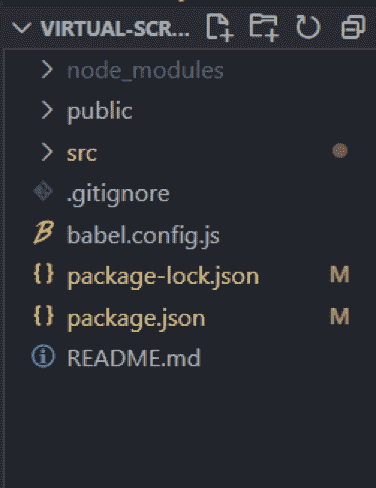
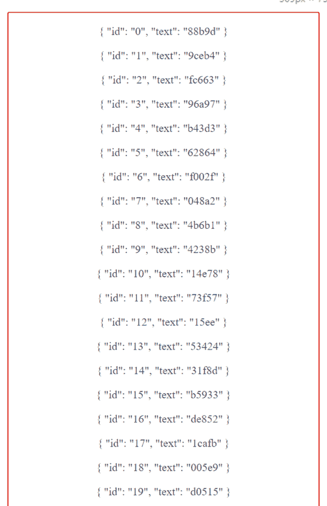
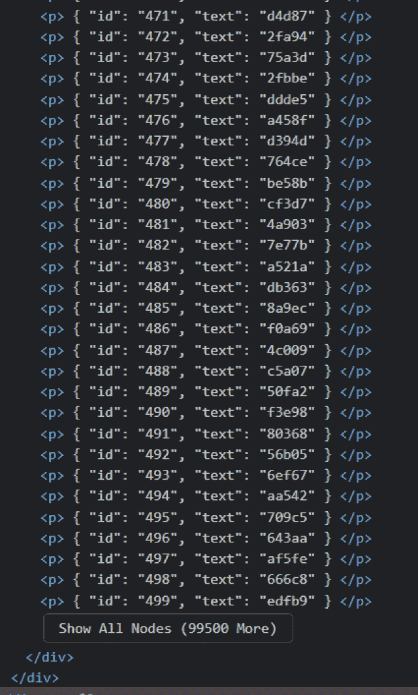
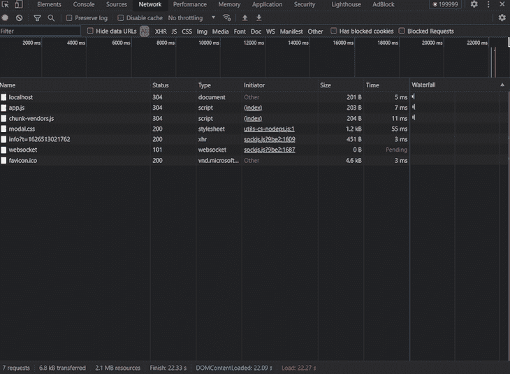
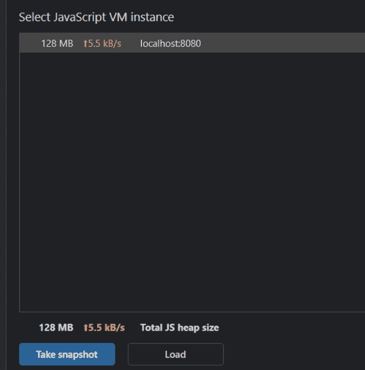
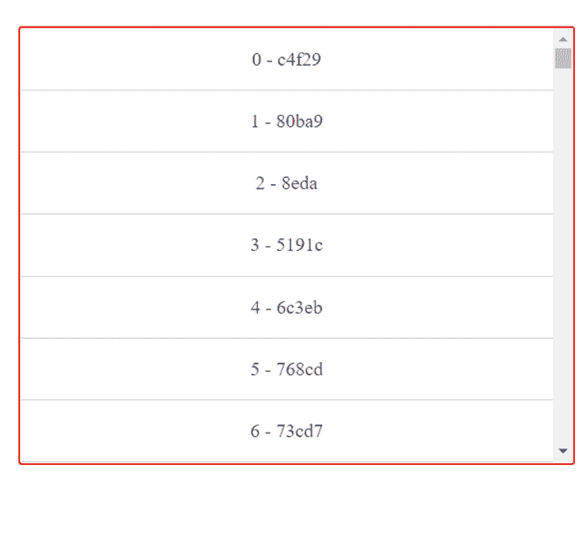
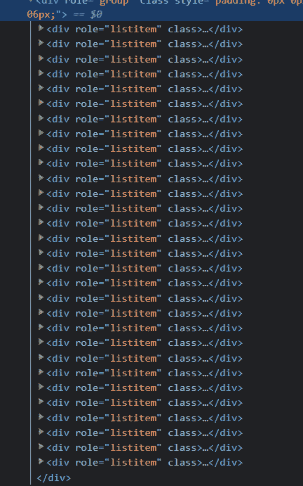
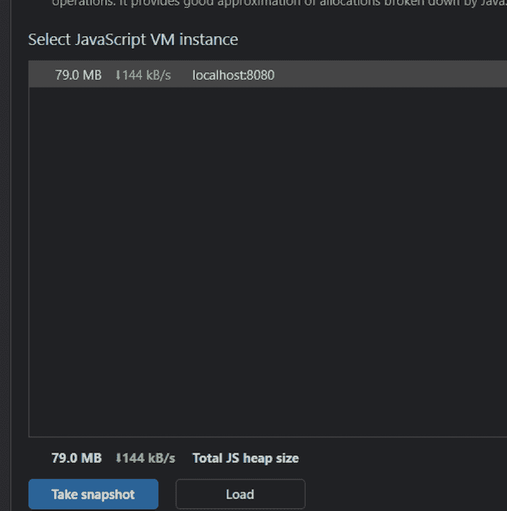
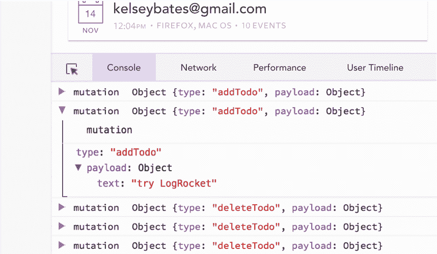

# 在 Vue.js 中创建一个高性能的虚拟滚动列表

> 原文：<https://blog.logrocket.com/create-performant-virtual-scrolling-list-vuejs/>

在 DOM 上单独呈现项目会给用户带来很大的性能延迟，尤其是当他们滚动浏览大型列表时。为了使滚动更有效，我们应该使用虚拟滚动列表，这可以提高页面加载速度，防止 web 应用程序不连贯。

虚拟滚动列表类似于标准滚动列表，但是，在任何时候都只呈现用户当前视图中的数据。当用户向下滚动页面时，新项目随着旧项目的移除而呈现。

在本文中，我们将探索 [`vue-virtual-scroll-list`](https://github.com/tangbc/vue-virtual-scroll-list) ，这是一个在 Vue.js 中创建虚拟滚动列表的神奇库。让我们开始吧！

## 在`vue-virtual-scroll-list`中渲染内容

`vue-virtual-scroll-list`库有两种主要的方法将网页内容呈现到列表中，`item`模式和`v-for`模式。

模式是呈现静态内容的理想方式。一旦内容被附加到 DOM 上，`item`模式就会释放正在使用的内存。如果你改变数据，你需要给`forceRender()`打电话，重新开始这个过程。

要渲染动态内容，比较好的选择是`v-for`模式。在`v-for`模式下，提供给列表的数据在存储器内被引用。因此，当数据改变时，列表项被重新呈现，并且上下文被保持。

让我们通过比较使用和不使用虚拟滚动列表时`item`模式的性能，来进一步了解一下`vue-virtual-scroll-list`库。

首先，我们将建立一个新的 Vue.js 项目并安装`vue-virtual-scroll-list`。然后，我们将使用随机生成的数据创建一个列表。最后，我们将在有和没有虚拟滚动的情况下呈现我们的列表，比较每种情况的性能。

## 设置 Vue.js 项目

首先，确保你的机器上安装了 Vue.js。使用以下命令创建一个新的 Vue.js 项目:

```
vue create virtual-scroll-demo

```

一旦项目建立，安装`vue-virtual-scroll-list`库:

```
npm install vue-virtual-scroll-list --save

```

现在，我们的项目有以下结构:



## 生成列表

现在我们已经为我们的项目建立了基础，让我们开始创建我们两个列表的基础。

导航到您的`/src`文件夹并创建一个名为`data.js`的文件。让我们给`data.js`添加下面这个生成随机数据的简单函数:

```
let idCounter = 0;

export function getData(count) {
  const data = [];
  for (let index = 0; index < count; index++) {
    data.push({
      id: String(idCounter++),
      text: Math.random()
        .toString(16)
        .substr(10),
    });
  }
  return data;
}

```

接下来，我们将创建一个名为`Item.vue`的新文件，这是我们将要呈现的`item`组件。在`Item.vue`中，我们将包含下面的代码块，它为我们的列表创建一个模板和样式，以及检索和显示上面生成的数据的道具:

```
<template>
  <div class="item">
    <div class="id">{{ source.id }} - {{ source.text }}</div>
  </div>
</template>

<script>
export default {
  name: 'item',
  props: {
    source: {
      type: Object,
      default() {
        return {}
      }
    }
  }
}
</script>

<style scoped>
.item {
  display: flex;
  flex-direction: column;
  border-bottom: 1px solid lightgrey;
  padding: 1em;
}
</style>

```

### 呈现不带虚拟滚动的列表

现在我们已经创建了一个列表，让我们在不使用`vue-virtual-scroll-list`的情况下在 DOM 上呈现列表项。将下面的代码添加到 *`App.vue`:*

```
<template>
  <div id="app">
    <div class="wrapper">
    <div class="list">
      <p  v-for="item in items" :key="item">
    {{item}}
  </p>
      </div>

    </div>
  </div>
</template>

<script>
import Item from './Item'
import { getData } from './data'

export default {
  name: 'App',
  data() {
    return {
      item: Item,
      items: getData(100000)
    }
  }
}
</script>

<style>
#app {
  text-align: center;
  color: #2c3e50;
  margin-top: 1em;
  padding: 1em;
}
.list {
  border: 2px solid red;
  border-radius: 3px;
}
</style>

```

在上面的代码块中，我们在 DOM 中呈现了 100，000 个项目。让我们看看在没有虚拟滚动的情况下，我们的列表会有怎样的表现。使用以下 npm 命令启动项目:

```
npm run serve

```

我们将得到以下输出:



当我们检查浏览器中的`inspect`元素时，我们会看到所有的 HTML 元素都被追加到了[浏览器 DOM](https://blog.logrocket.com/how-the-virtual-dom-works-in-vue-js/) 中，如下图所示:



在浏览器 DOM 中添加元素会增加 DOM 的大小。因此，浏览器将需要更多的时间来将每个项目附加到 DOM，这可能会导致显著的性能延迟。让我们仔细看看浏览器将我们的列表附加到 DOM 所花费的时间:



事件`DOMContentLoaded`在 22 秒后触发，这意味着在显示最终呈现的列表之前，浏览器选项卡需要 22 秒才能加载。类似地，如下图所示，呈现我们的列表消耗了 128 MB 内存:



### 用虚拟滚动呈现列表

现在，让我们尝试使用虚拟滚动来呈现我们的列表。在`main.js`中导入`vue-virtual-scroll-list`包:

```
import Vue from "vue";
import App from "./App.vue";

Vue.config.productionTip = false;

import VirtualList from "vue-virtual-scroll-list";

Vue.component("virtual-list", VirtualList);
new Vue({
  render: (h) => h(App),
}).$mount("#app");

```

接下来，我们将呈现`virtual-list`组件中项目的数据。让我们将我们的`App.js`文件修改成如下代码块:

```
<template>
  <div id="app">
    <div class="wrapper">

       <virtual-list
        class="list"
        style="height: 360px; overflow-y: auto;"
        :data-key="'id'"
        :data-sources="items"
        :data-component="item"
        :estimate-size="50"
      />
    </div>
  </div>
</template>

<script>
import Item from './Item'
import { getData } from './data'

export default {
  name: 'App',
  data() {
    return {
      item: Item,
      items: getData(100000)
    }
  }
}
</script>

<style>
#app {
  text-align: center;
  color: #2c3e50;
  margin-top: 1em;
  padding: 1em;
}
.list {
  border: 2px solid red;
  border-radius: 3px;
}
</style>

```

请注意，虚拟列表需要数据属性来呈现项目。运行上面的代码块将得到以下输出:



我们可以在下图中看到，一次只能渲染几个项目。当用户向下滚动时，会呈现较新的项目:



现在，我们的 DOM 树比以前小多了！当我们渲染我们的虚拟滚动列表时，`DOMContentLoaded`将会比以前启动得更快！


如上图所示，该事件仅在 563 毫秒内触发。同样，我们的操作只消耗了 79 MB 的内存，这比我们不使用虚拟卷轴时少得多。



## 结论

现在你知道如何使用`vue-virtual-scroll-list`库在 Vue.js 中创建虚拟滚动列表了！

在本教程中，我们创建了一个使用随机生成数据的静态列表，然后在我们的 Vue.js 应用程序中实现了它，比较了使用和不使用虚拟滚动时的性能。

虚拟滚动列表具有很高的性能，尤其是当你的网页上有一个很大的项目列表时。使用虚拟滚动列表可以提高页面加载速度，改善整体用户体验！

## 像用户一样体验您的 Vue 应用

调试 Vue.js 应用程序可能会很困难，尤其是当用户会话期间有几十个(如果不是几百个)突变时。如果您对监视和跟踪生产中所有用户的 Vue 突变感兴趣，

[try LogRocket](https://lp.logrocket.com/blg/vue-signup)

.

[](https://lp.logrocket.com/blg/vue-signup)[https://logrocket.com/signup/](https://lp.logrocket.com/blg/vue-signup)

LogRocket 就像是网络和移动应用程序的 DVR，记录你的 Vue 应用程序中发生的一切，包括网络请求、JavaScript 错误、性能问题等等。您可以汇总并报告问题发生时应用程序的状态，而不是猜测问题发生的原因。

LogRocket Vuex 插件将 Vuex 突变记录到 LogRocket 控制台，为您提供导致错误的环境，以及出现问题时应用程序的状态。

现代化您调试 Vue 应用的方式- [开始免费监控](https://lp.logrocket.com/blg/vue-signup)。*