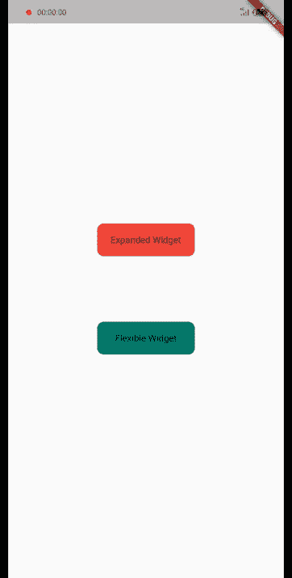
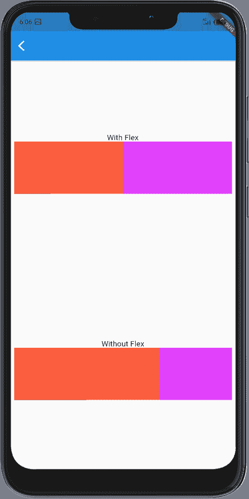
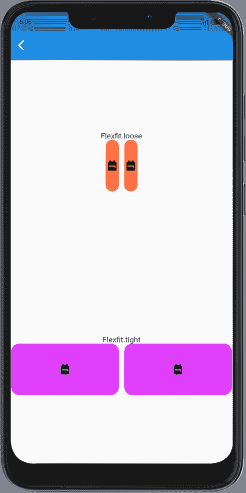

# 在 Flutter - LogRocket 博客中使用灵活和扩展的小部件创建响应性布局

> 原文：<https://blog.logrocket.com/create-responsive-layouts-flexible-expanded-widgets-flutter/>

构建响应式屏幕布局意味着编写一段代码来响应设备布局的各种变化，因此应用程序会根据设备的屏幕大小和形状显示其 UI。

在本文中，我们将探索 Flutter 中用于屏幕响应的扩展和灵活的小部件。

由于 Flutter 的跨平台、单代码库能力，理解屏幕管理以防止像 flex 溢出错误或糟糕的用户界面设计这样的问题是非常重要的。

我们还将设计一个扩展和灵活的窗口小部件的演示，并描述它们的属性以及如何在 Flutter 应用程序中使用它们。

## 先决条件

要理解并遵循本教程，您应该具备以下条件:

*   安装在本地机器上的 Flutter
*   颤振和飞镖的工作知识

## 使用容器的问题

在 Flutter 中，容器是包含多个子部件的父部件。它通过宽度、高度、背景颜色和填充等描述符来管理它们。基本上，容器是一个我们可以传递内容的盒子。

有两个原因可以解释为什么在 Flutter 中使用容器来创建响应式屏幕布局是不可取的。

首先是 RenderFlex 溢出**。**这是最常遇到的颤振框架误差之一；发生这种情况时，除了调试控制台中的错误消息之外，您还会在应用程序 UI 中看到指示溢出区域的黄色和黑色条纹。

“对于大屏幕来说内容过小”只是一个 UI 错误，由于 Flutters 的灵活性，内容对于特定的屏幕来说太小或太大。

这两个问题都可以使用灵活或扩展的小部件来解决，从而提供更好的 UI 和开发体验。

## 扩展小部件简介

扩展的小部件是一个单独的子小部件，这意味着只能给它分配一个子部件。为了更好地优化，它被用于一行或多列。

展开的小部件的属性包括`child`小部件和`flex`小部件。

`child`小部件放在一个扩展的小部件中，它可以接受行和列。`Flex`用于不均匀分布`child`小部件的内容。

在下面的代码中，我们使用了将`flex`设置为`1`的扩展小部件，以及一个显示扩展小部件的效果及其属性的常规容器:

```
Expanded(
 flex: 1,
 child: Container(
 color: Colors.red,
 ),
),

```

## 灵活小部件简介

灵活的小部件与扩展的小部件非常相似，但是显著的区别在于它们的属性。灵活的小部件用于调整孩子在屏幕中的内容位置。

柔性控件的属性包括`fit`和`flex`。

`Fit`控制属性填充可用空间的方式。它有两个选项:`FlexFit.Tight`，设置它填充可用空间，和`FlexFit.loose`，填充子小部件的剩余可用空间。

像在扩展的小部件中一样，`flex`用于不均匀地分布子小部件的内容。

下面的代码使用了一个灵活的小部件，其`flex`被设置为`1`，适合作为`FlexFit.loose`，以及一个具有常规特性的子容器:

```
Flexible(
   flex: 1,
   fit: FlexFit.loose,
   child: Container(
   height: 100,
    decoration: BoxDecoration(
      borderRadius: BorderRadius.circular(15),
      color: Colors.deepOrange[400],
      ),
    child:Icon(Icons.backpack),
 ),
),

```

## 设置示例应用程序

在这个演示中，我们将创建一个样例 Flutter 应用程序，它的内容以行和列的形式显示。

这里有一个 gif 展示了我们将在本文中构建的演示应用程序:



让我们从创建一个 Flutter 项目目录开始；在终端中输入以下命令:

```
mkdir FlutterApps 
```

接下来，创建一个颤振项目:

```
flutter create sample_app 
```

现在，在您选择的任何代码编辑器中打开 Flutter 项目。

## 代码实现

将以下代码粘贴到`main.dart`文件中。我们首先创建一个名为`homepage`的有状态小部件。

在`homepage`中，我们将创建两个按钮，将我们导向两个不同的屏幕，以查看在屏幕布局中使用扩展和灵活的小部件的区别:

```
Scaffold(
  body: Center(
    child:
      Column(mainAxisAlignment: MainAxisAlignment.center, children: [
 GestureDetector(
  onTap: () {
   Navigator.push(
    context,
    MaterialPageRoute(
     builder: (context) => ExpandedWidget(),
    ),
   );
  },
  child: Container(
    height: 50,
    width: 150,
    decoration: BoxDecoration(
      borderRadius: BorderRadius.circular(10), color: Colors.red),
    child: Center(child: Text("Expanded Widget"))),
 ),
 SizedBox(height: 100),
 GestureDetector(
  onTap: () {
   Navigator.push(
    context,
    MaterialPageRoute(
     builder: (context) => FlexibleWidget(),
    ),
   );
  },
  child: Container(
    height: 50,
    width: 150,
    decoration: BoxDecoration(
      borderRadius: BorderRadius.circular(10),
      color: Colors.teal[700]),
    child: Center(child: Text("Flexible Widget"))),
 )
])));

```

创建的按钮是简单的容器，其中一些`decoration`、`color`和`text`小部件用手势检测器包装，使我们能够使用`onTap`属性路由到`ExpandedWidget()`和`FlexibleWidget()`屏幕。

### 扩展小部件示例

首先创建一个名为`expanded.dart`的文件:

```
touch expanded.dart

```

接下来，将以下代码粘贴到文件中。在代码中，我们使用`flex`属性创建了一个无状态小部件来编写示例:

```
class ExpandedWidget extends StatelessWidget {
 const ExpandedWidget({Key? key}) : super(key: key);
 @override
 Widget build(BuildContext context) {
  return Scaffold(
    appBar: AppBar(
     leading: GestureDetector(
       onTap: () {
        Navigator.pop(context);
       },
       child: Icon(Icons.arrow_back_ios_new)),
    ),
    body: Padding(
     padding: const EdgeInsets.symmetric(horizontal: 15),
     child: Column(
      mainAxisAlignment: MainAxisAlignment.spaceAround,
      children: [
       Column(
        children: [
         Text("With Flex"),
         Container(
          height: 100,
          child: Row(
           children: [
            Expanded(
             flex: 1,
             child: Container(
              color: Colors.red,
             ),
            ),
            Expanded(
             flex: 2,
             child: Container(
              color: Colors.deepOrange[400],
             ),
            ),
            Expanded(
             flex: 3,
             child: Container(
              color: Colors.purpleAccent,
             ),
            )
           ],
          ),
         ),
        ],
       ),
       Column(
        children: [
         Text("Without Flex"),
         Container(
          height: 100,
          child: Row(
           children: [
            Expanded(
             child: Container(
              color: Colors.red,
             ),
            ),
            Expanded(
             child: Container(
              color: Colors.deepOrange[400],
             ),
            ),
            Expanded(
             child: Container(
              color: Colors.purpleAccent,
             ),
            )
           ],
          ),
         ),
        ],
       ),
      ],
     ),
    ));
 }
}

```

首先，我们返回一个 scaffold，这样我们就可以使用`appbar`和`body`属性。接下来，在`appbar`中，我们创建了一个后退按钮，这样我们就可以返回到上一个屏幕。

移动到主体，我们使用两列，一列在顶部，另一列在按钮处，将它们隔开；在每一列中，我们都有一段文字描述它是否带有`flex`。在它下面，我们使用三个带有或不带有`flex`的扩展小部件和一个分配不同颜色的容器创建了一行。

下图显示了应用和未应用`flex`的布局:



### 灵活的小部件示例

首先创建一个名为`flexible.dart`的文件:

```
touch flexible.dart

```

接下来，将以下代码粘贴到文件中:

```
class FlexibleWidget extends StatelessWidget {
 const FlexibleWidget({Key? key}) : super(key: key);
 @override
 Widget build(BuildContext context) {
  return Scaffold(
   appBar: AppBar(
    leading: GestureDetector(
      onTap: () {
       Navigator.pop(context);
      },
      child: Icon(Icons.arrow_back_ios_new)),
   ),
   body: Padding(
    padding: const EdgeInsets.symmetric(horizontal: 10),
    child: Column(
     mainAxisAlignment: MainAxisAlignment.spaceAround,
     children: [
      Column(
       children: [
        Text("Flexfit.loose"),
        Row(
         mainAxisAlignment:MainAxisAlignment.center,
         children: [
          Flexible(
           flex: 1,
           fit: FlexFit.loose,
           child: Container(
            height: 100,
            decoration: BoxDecoration(
             borderRadius: BorderRadius.circular(15),
             color: Colors.deepOrange[400],
            ),
            child:Icon(Icons.backpack),
           ),
          ),
          SizedBox(
           width: 10,
          ),
          Flexible(
           flex: 1,
           fit: FlexFit.loose,
           child: Container(
            height: 100,
            decoration: BoxDecoration(
             borderRadius: BorderRadius.circular(15),
             color: Colors.deepOrange[400],
            ),
            child:Icon(Icons.backpack),
           ),
          )
         ],
        )
       ],
      ),
      Column(
       children: [
        Text("Flexfit.tight"),
        Row(
         children: [
          Flexible(
           flex: 1,
           fit: FlexFit.tight,
           child: Container(
             height: 100,
           decoration: BoxDecoration(
            borderRadius: BorderRadius.circular(15),
              color: Colors.purpleAccent,
           ),
           child:Icon(Icons.backpack),
           ),
          ),
          SizedBox(
           width: 10,
          ),
          Flexible(
           flex: 1,
           fit: FlexFit.tight,
           child: Container(
             height: 100,
            decoration: BoxDecoration(
             borderRadius: BorderRadius.circular(15),
             color: Colors.purpleAccent,
            ),
            child:Icon(Icons.backpack),
           ),
          )
         ],
        )
       ],
      )
     ],
    ),
   ),
  );
 }
}

```

在代码中，我们创建了一个无状态小部件`FlexibleWidget`。在其中，我们创建了两行灵活的小部件内容。在第一行，我们使用`flexfit.loose`，在第二行，我们使用`flexfit.tight`。这样，图标将填充孩子提供的可用空间。

下图显示了布局，其中`flexfit.loose`使用子节点提供的最小空白空间，`flexfit.tight`填充子节点提供的可用空间。



## 扩展小部件和灵活小部件的区别

正如我前面指出的，这些小部件之间的主要区别在于它们的属性。扩展的小部件只有`child`和`flex`属性，如果误用，这可能是一个限制。相比之下，Flexible widget 的属性更多；这使得用法灵活，因此得名。

## 结论

在本文中，我们学习了使用扩展和灵活的小部件的响应式屏幕布局。我们首先介绍了使用容器创建响应式屏幕布局时必然会出现的潜在问题，然后介绍了解决方案:扩展和灵活的小部件。我们讨论了它们的属性、相似性、差异，最重要的是，一个实际操作的例子。我希望这篇文章是有帮助的。注意:没有实践就没有学习，所以一定要坚持实践。

## 使用 [LogRocket](https://lp.logrocket.com/blg/signup) 消除传统错误报告的干扰

[](https://lp.logrocket.com/blg/signup)

[LogRocket](https://lp.logrocket.com/blg/signup) 是一个数字体验分析解决方案，它可以保护您免受数百个假阳性错误警报的影响，只针对几个真正重要的项目。LogRocket 会告诉您应用程序中实际影响用户的最具影响力的 bug 和 UX 问题。

然后，使用具有深层技术遥测的会话重放来确切地查看用户看到了什么以及是什么导致了问题，就像你在他们身后看一样。

LogRocket 自动聚合客户端错误、JS 异常、前端性能指标和用户交互。然后 LogRocket 使用机器学习来告诉你哪些问题正在影响大多数用户，并提供你需要修复它的上下文。

关注重要的 bug—[今天就试试 LogRocket】。](https://lp.logrocket.com/blg/signup-issue-free)