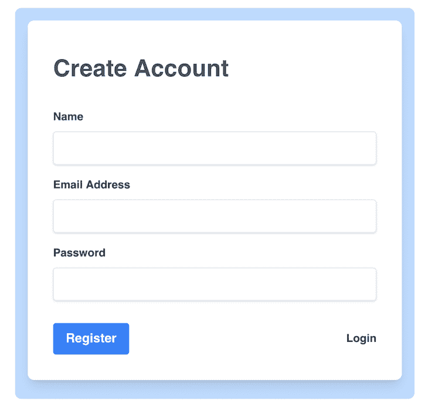
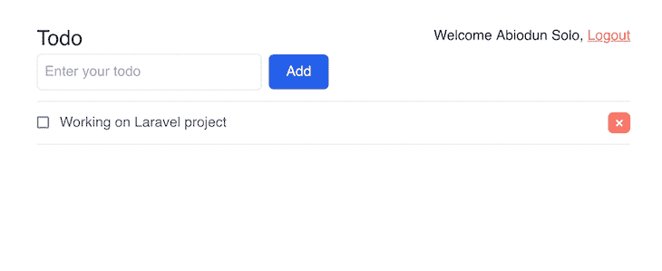
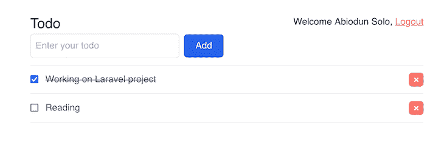
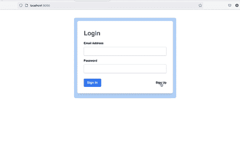

# 用 Laravel 和 Vue 创建单页应用程序

> 原文：<https://blog.logrocket.com/create-single-page-app-laravel-and-vue/>

凭借其清晰的语法和表达能力，以及许多其他品质，Laravel 是开发人员使用的最流行的 PHP 框架之一。

在 Laravel UI 推出之前，它的一个关键特性就是默认支持从 Laravel v5.3 到 v6 的 Vue.js。Vue 是一个现代的 JavaScript 前端框架，用于创建用户界面。

在本文中，我们将演示如何使用 Laravel 和 Vue 构建单页面应用程序。

## 为什么 Laravel 和 Vue 在一起很好？

以下是使用 Laravel 和 Vue 为您的项目创建全栈工作流的一些主要优势:

*   源代码被合并到一个项目中，而不是后端和前端有单独的项目
*   设置和配置很简单
*   一个部署可以同时处理两个框架

## 什么是 SPA？(单页应用程序)

单页应用程序(简称 SPA)从 web 服务器动态地将新数据加载到网页，而不需要刷新整个页面。

使用 SPA 的热门网站包括 gmail.com 和 youtube.com——换句话说，SPA 在很大程度上无处不在。您可能日常使用的大多数管理控制面板都是使用 SPAs 创建的。

水疗的好处:

*   用户体验更加灵活
*   在浏览器中缓存数据
*   快速加载时间

水疗的缺点:

*   会损害 SEO(搜索引擎优化)
*   潜在的安全问题
*   消耗大量浏览器资源

## 项目设置

这篇文章将演示如何开发一个允许用户注册账户和添加任务的待办应用。

本教程使用的是 Laravel 9，调用了 PHP 8.1 和 Vue 3；我们还需要安装 PHP 和 NGINX。

让我们从下面的命令开始:

```
composer create-project --prefer-dist laravel/laravel laravel-vue-demo

```

接下来，我们将安装 JavaScript 依赖项。

```
npm install

```

在将 Vue 添加到我们的项目之前，我们必须安装一些软件包。

此外，必须安装 plugin-vue，因为 Laravel 9 附带 Vite，而不是 webpack-mix，后者是以前的 Laravel bundler for JavaScript。让我们现在就开始吧:

```
npm install [email protected] [email protected] @vitejs/plugin-vue

```

打开名为`vite.config.js`的文件，并将`vue()`添加到配置中:

```
import { defineConfig } from 'vite';
import laravel from 'laravel-vite-plugin';
import vue from '@vitejs/plugin-vue'

export default defineConfig({
    plugins: [
        vue(),
        laravel([
            'resources/css/app.css',
            'resources/js/app.js',
        ]),
    ],
});

```

编辑 Vue 3 应用程序引导程序的`app.js`文件和代码片段:

```
require('./bootstrap');

import {createApp} from 'vue'

import App from './App.vue'

createApp(App).mount("#app")

```

创建一个名为`App.vue`的文件，并添加以下内容:

```
<template>
  <h1> Hello, Vuejs with Laravel </h1>
</template>
<script>
export default {
  setup() {

   }
}
</script>

```

最后，打开位于`resources/views`文件夹中的`welcome.blade.php`文件，并添加以下内容:

```
<!DOCTYPE html>
<html>
<head>
 ....
        @vite('resources/css/app.css')
</head>
<body>
  <div id="app"></div>
  @vite('resources/js/app.js')
</body>
</html>

```

为了预览我们的应用程序，我们需要在两个不同的终端/命令行上启动我们的 Vue 应用程序和 Laravel 服务器:

```
npm run dev

php artisan serve

```


为了构建我们的待办事项应用程序，我们需要创建更多的文件。Vue 将创建多个页面，主要包括:

*   登录页面
*   注册页面
*   主页

为了与 Laravel 端点通信，我们需要安装 Axios:

```
npm install axios

```

## 路由检视

使用 [vue-router](https://router.vuejs.org) 包，可以在 vue 中使用各种路由策略；这些策略也被称为[历史模式](https://router.vuejs.org/guide/essentials/history-mode.html#hash-mode)。

当用户请求像`[http://localhost:8000/home](http://localhost:8000/home)`这样的路由时——当页面刷新时会返回 404 错误——我们可以依靠 Laravel 来检测任何备用路由，然后提供包含我们应用程序的刀片文件。

为此，我们将使用 HTML5 模式:

```
Route::get('/{vue_capture?}', function() {
    return view('welcome');
})->where('vue_capture', '[\/\w\.-]*');

```

```
import {createRouter, createWebHistory} from 'vue-router';

const router = createRouter({
    history: createWebHistory(),
    routes: [
        {
            path: '/',
            component: () => import('./pages/Login.vue')
        },
        {
            path: '/register',
            component: () => import('./pages/Register.vue')
        },
        {
            path: '/home',
            component: () => import('./pages/Home.vue')
        }
    ],
})

```

由于项目的简单性，我们本质上是使用 [Laravel Sanctum](https://laravel.com/docs/9.x/sanctum) 来处理登录页面的认证，然后我们将令牌保存在本地存储中。

对于其他成功的请求，令牌被连接到头部，这将允许 Laravel 识别发出请求的用户。

这是我们的登录页面的外观:


这是我们注册页面的外观:



最后，以下是两者的相关代码块:

```
<!--Login.vue-->
<template>
    <div class="mx-auto w-4/12 mt-10 bg-blue-200 p-4 rounded-lg">
        <div
            class="bg-white shadow-lg rounded-lg px-8 pt-6 pb-8 mb-2 flex flex-col"
        >
            <h1 class="text-gray-600 py-5 font-bold text-3xl"> Login </h1>
            <ul class="list-disc text-red-400" v-for="(value, index) in errors" :key="index" v-if="typeof errors === 'object'">
                <li>{{value[0]}}</li>
            </ul>
            <p class="list-disc text-red-400" v-if="typeof errors === 'string'">{{errors}}</p>
            <form method="post" @submit.prevent="handleLogin">
            <div class="mb-4">
                <label
                    class="block text-grey-darker text-sm font-bold mb-2"
                    for="username"
                >
                    Email Address
                </label>
                <input
                    class="shadow appearance-none border rounded w-full py-2 px-3 text-grey-darker"
                    id="username"
                    type="text"
                    v-model="form.email"
                    required
                />
            </div>
            <div class="mb-4">
                <label
                    class="block text-grey-darker text-sm font-bold mb-2"
                    for="password"
                >
                    Password
                </label>
                <input
                    class="shadow appearance-none border border-red rounded w-full py-2 px-3 text-grey-darker mb-3"
                    id="password"
                    type="password"
                    v-model="form.password"
                    required
                />
            </div>
            <div class="flex items-center justify-between">
                <button
                    class="bg-blue-500 hover:bg-blue-900 text-white font-bold py-2 px-4 rounded"
                    type="submit"
                >
                    Sign In
                </button>
                <router-link
                    class="inline-block align-baseline font-bold text-sm text-blue hover:text-blue-darker"
                    to="register"
                >
                    Sign Up
                </router-link>
            </div>
            </form>
        </div>
    </div>
</template>

```

```
export default {
    setup() {
        const errors = ref()
        const router = useRouter();
        const form = reactive({
            email: '',
            password: '',
        })
        const handleLogin = async () => {
            try {
                const result = await axios.post('/api/auth/login', form)
                if (result.status === 200 && result.data && result.data.token) {
                    localStorage.setItem('APP_DEMO_USER_TOKEN', result.data.token)
                    await router.push('home')
                }
            } catch (e) {
                if(e && e.response.data && e.response.data.errors) {
                    errors.value = Object.values(e.response.data.errors)
                } else {
                    errors.value = e.response.data.message || ""
                }
            }
        }

        return {
            form,
            errors,
            handleLogin,
        }
    }
}

```

Vue `Home`视图/页面处理所有的待办事项，比如创建、删除、更新和列出待办事项。所有操作都使用用户令牌通过 Axios 向端点发出授权请求。

让我们看看它们会是什么样子，然后是相关的片段:





```
<!-- Home -->
<template>
    <div class="w-6/12 p-10 mx-auto">
        <div class="flex justify-between">
            <h1 class="text-2xl"> Todo </h1>
            <span class="capitalize">Welcome {{ user && user.name }}, <button
                class="text-orange-500 underline hover:no-underline rounded-md"
                @click="handleLogout">Logout</button></span>
        </div>
        <input type="text" class="p-2 w-64 border rounded-md" v-model="todo" placeholder="Enter your todo"/>
        <button class="bg-blue-600 text-white px-5 py-2 rounded-md ml-2 hover:bg-blue-400" @click="addTodo">Add</button>
        <Loader v-if="isLoading"/>
        <ul class="border-t mt-3 cursor-pointer">
            <li :class="`py-3 border-b text-gray-600 ${val.has_completed ? 'line-through' : ''}`"
                v-for="(val, idx) in todos" :key="idx">
                <input type="checkbox" :checked="val.has_completed" @click="checked(idx)"/>
                <span @click="checked(val, idx)" class="pl-3">{{ val.title }} </span>
                <button class="float-right bg-red-400 px-2 text-white font-bold rounded-md hover:bg-red-600"
                        @click="deleteTodo(val, idx)">&times;
                </button>
            </li>
        </ul>
    </div>
</template>

```

```
setup() {
    const todo = ref('')
    const todos = ref([])
    const user = ref()
    const isLoading = ref()

    let router = useRouter();
    onMounted(() => {
        authentication()
        handleTodos()
    });

    const authentication = async () => {
        isLoading.value = true
        try {
            const req = await request('get', '/api/user')
            user.value = req.data
        } catch (e) {
            await router.push('/')
        }
    }

    const handleTodos = async () => {
        try {
            const req = await request('get', '/api/todos')
            todos.value = req.data.data
        } catch (e) {
            await router.push('/')
        }
        isLoading.value = false
    }

    const handleNewTodo = async (title) => {
        try {
            const data = {title: title}
            const req = await request('post', '/api/todos', data)
            if (req.data.message) {
                isLoading.value = false
                return alert(req.data.message)
            }
            todos.value.push(req.data.data)
        } catch (e) {
            await router.push('/')
        }
        isLoading.value = false
    }

    const handleLogout = () => {
        localStorage.removeItem('APP_DEMO_USER_TOKEN')
        router.push('/')
    }

    const addTodo = () => {
        if (todo.value === "") {
            return alert("Todo cannot be empty");
        }
        isLoading.value = true
        handleNewTodo(todo.value)
        todo.value = ""
    }

    const checked = async (val, index) => {
        try {
            const data = {has_completed: !val.has_completed}
            const req = await request('put', `/api/todos/${val.id}`, data)
            if (req.data.message) {
                isLoading.value = false
                return alert(req.data.message)
            }
            todos.value[index].has_completed = !val.has_completed
        } catch (e) {
            await router.push('/')
        }
        isLoading.value = false
    }

    const deleteTodo = async (val, index) => {
        if (window.confirm("Are you sure")) {
            try {
                const req = await request('delete', `/api/todos/${val.id}`)
                if (req.data.message) {
                    isLoading.value = false
                    todos.value.splice(index, 1)
                }
            } catch (e) {
                await router.push('/')
            }
            isLoading.value = false
        }
    }

```

对于 Laravel，我们将创建以下内容:

*   控制器(`AuthController`、`TodoController`)
*   型号(`Todo`、`User`)
*   路线(`api`)
*   中间件(`auth:sanctum`)。

我们的路由在`api.php`中，它处理 Vue 消耗的所有端点。

```
Route::post('/auth/register', [AuthController::class, 'register']);
Route::post('/auth/login', [AuthController::class, 'login']);

Route::apiResource('todos', TodoController::class)->middleware('auth:sanctum');

Route::middleware('auth:sanctum')->get('/user', function (Request $request) {
    return $request->user();
});

```

`AuthController`中的寄存器逻辑注册用户并创建令牌。

```
public function register(Request $request): \Illuminate\Http\JsonResponse
{
    try {
        //Validated
        $validateUser = Validator::make($request->all(),
        [
            'name' => 'required',
            'email' => 'required|email|unique:users,email',
            'password' => 'required'
        ]);

        if($validateUser->fails()){
            return response()->json([
                'status' => false,
                'message' => 'validation error',
                'errors' => $validateUser->errors()
            ], 401);
        }

        $user = User::create([
            'name' => $request->name,
            'email' => $request->email,
            'password' => Hash::make($request->password)
        ], 201);

        return response()->json([
            'status' => true,
            'message' => 'User Created Successfully',
            'token' => $user->createToken("API_TOKEN")->plainTextToken
        ], 200);

    } catch (\Throwable $e) {
        return response()->json([
            'status' => false,
            'message' => $e->getMessage()
        ], 500);
    }
}

```

登录验证请求，检查用户是否存在，然后创建一个令牌:

```
public function login(Request $request): \Illuminate\Http\JsonResponse
{
    try {
        //Validated
        $validateUser = Validator::make($request->all(),
            [
                'email' => 'required',
                'password' => 'required'
            ]);

        if($validateUser->fails()){
            return response()->json([
                'status' => false,
                'message' => 'validation error',
                'errors' => $validateUser->errors()
            ], 401);
        }

        if(!Auth::attempt($request->only(['email', 'password']))){
            return response()->json([
                'status' => false,
                'message' => 'Email & Password does not exist.',
            ], 401);
        }

        $user = User::where('email', $request->email)->first();

        return response()->json([
            'status' => true,
            'message' => 'Logged In Successfully',
            'token' => $user->createToken("API_TOKEN")->plainTextToken
        ], 200);

    } catch (\Throwable $e) {
        return response()->json([
            'status' => false,
            'message' => $e->getMessage()
        ], 500);
    }
}

```

添加新待办事项的 POST 端点由待办事项控制器— `/api/todos`中的`store`方法管理。

```
public function store(Request $request): \Illuminate\Http\JsonResponse
{
    $data = Todo::where('user_id', $request->user()->id)->where('title', $request->title);
    if ($data->first()) {
        return response()->json(['status' => false, 'message' => 'Already exist']);
    }
    $req = $request->all();
    $req['user_id'] = $request->user()->id;
    $data = Todo::create($req);
    return response()->json(['status' => true, 'data' => $data], 201);
}

```

它管理`Todo`更新端点，该端点在用户完成一个待办事项后被调用，位于`/api/todos/id`。

```
public function update(Request $request, $id): \Illuminate\Http\JsonResponse
{
    $validateUser = Validator::make($request->all(),
        [
            'has_completed' => 'required',
        ]);

    if ($validateUser->fails()) {
        return response()->json([
            'status' => false,
            'message' => 'validation error',
            'errors' => $validateUser->errors()
        ], 401);
    }

    $data = Todo::find($id);
    $data->has_completed = $request->has_completed;
    $data->update();
    return response()->json(['status' => true, 'data' => $data], 202);
}

```

当一个用户删除一个`Todo`时，端点`/api/todos/id`被调用，它负责处理:

```
public function destroy(int $id): \Illuminate\Http\JsonResponse
{
    throw_if(!$id, 'todo Id is missing');
    Todo::findOrFail($id)->delete();
    return response()->json(['status' => true, 'message' => 'todo deleted']);
}

```

干得好，我们已经使用 Laravel 和 Vue 创建了一个单页应用程序！🎉这是我们的待办事项应用程序的最终结果和一个到源代码的[链接:](https://github.com/iamhabbeboy/laravel-vue-demo)



## 结论

我们能够确定，与传统的 PHP/Vue 组合相比，使用 Vue 和 Laravel 创建一个简单的用户认证和待办事项应用程序要简单得多——传统的 PHP/Vue 组合需要更多的设置工作。

在我看来，Vue 和 Laravel 的结合使得开发单页面应用程序变得容易，因为不需要担心路由、中间件或处理 CORS。请在下面的评论区告诉我你发展水疗的经历。

感谢阅读！✌️

## 像用户一样体验您的 Vue 应用

调试 Vue.js 应用程序可能会很困难，尤其是当用户会话期间有几十个(如果不是几百个)突变时。如果您对监视和跟踪生产中所有用户的 Vue 突变感兴趣，

[try LogRocket](https://lp.logrocket.com/blg/vue-signup)

.

[](https://lp.logrocket.com/blg/vue-signup)[https://logrocket.com/signup/](https://lp.logrocket.com/blg/vue-signup)

LogRocket 就像是网络和移动应用程序的 DVR，记录你的 Vue 应用程序中发生的一切，包括网络请求、JavaScript 错误、性能问题等等。您可以汇总并报告问题发生时应用程序的状态，而不是猜测问题发生的原因。

LogRocket Vuex 插件将 Vuex 突变记录到 LogRocket 控制台，为您提供导致错误的环境，以及出现问题时应用程序的状态。

现代化您调试 Vue 应用的方式- [开始免费监控](https://lp.logrocket.com/blg/vue-signup)。