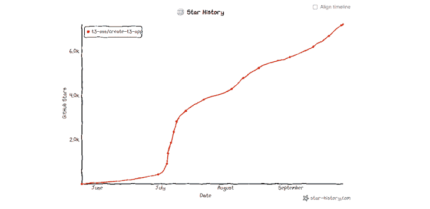
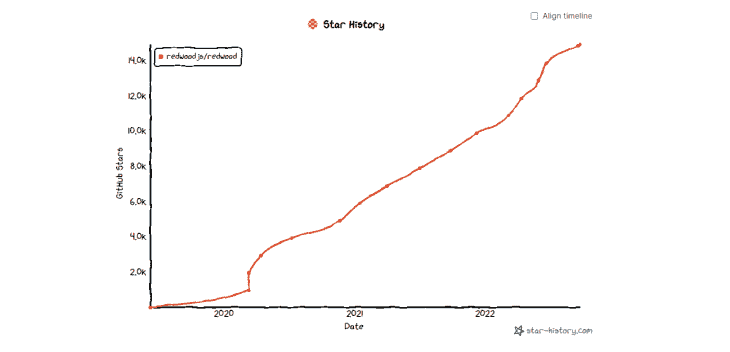
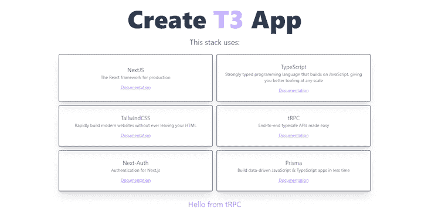
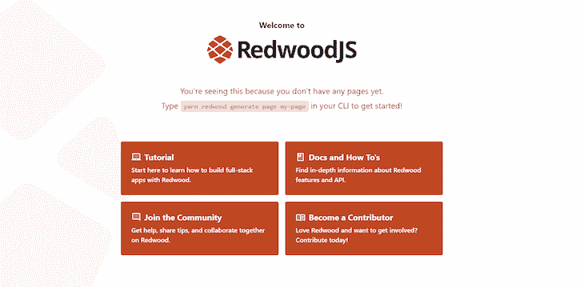
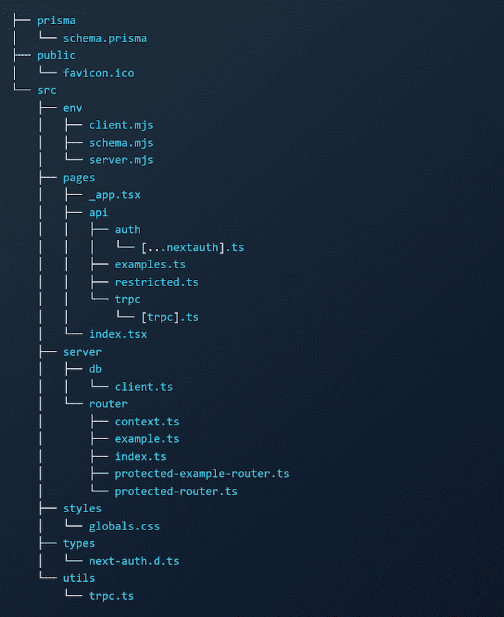
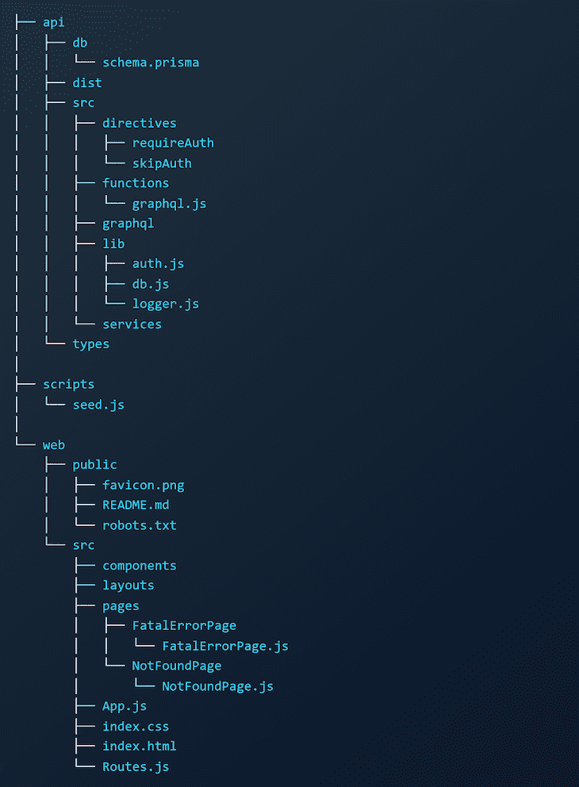
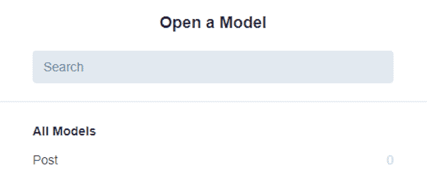

# create-t3-app 与 RedwoodJS:比较全栈 React 框架

> 原文：<https://blog.logrocket.com/create-t3-app-vs-redwoodjs-comparing-full-stack-react-frameworks/>

如今，速度和生产力是在应用程序和 web 开发中击败竞争对手的关键因素。这就是为什么全栈框架越来越受欢迎的原因，它为开发人员提供了一个坚实的基础来有效地实现需要前端和后端开发的项目。

在本文中，我们将比较两个全栈 React 框架:`[create-t3-app](https://create.t3.gg/)`和 [RedwoodJS](https://redwoodjs.com/) 。

前者是针对[全栈 Next.js 项目](https://blog.logrocket.com/build-full-stack-app-next-js-supabase/)的 CLI，后者是集成了 CLI 的全栈 React 框架。两者都在 GitHub 上有开源代码库，这意味着任何人都可以探索代码并做出贡献。

我们将看看它们所基于的主要技术，学习如何设置它们，探索两者的内部构建结构，了解如何处理前端和后端开发，并回顾它们支持哪些 API 解决方案。

让我们开始吧。

*向前跳转:*

## 概观

### `create-t3-app`

T3 堆栈的主要基石之一——除了简单性和模块化——是类型安全。因此，该项目要求用户使用 TypeScript。该项目建立在 Next.js 之上，所以如果你熟悉它的文件结构和特性，那么使用`create-t3-app`会更容易上手。

推荐的样式解决方案是 Tailwind CSS，它是一个[实用优先的 CSS 框架](https://blog.logrocket.com/top-utility-first-css-frameworks/)，基于可以直接在标记中有效组合的简洁类。Prisma 被建议作为数据库客户端，而 [tRPC](https://trpc.io/) 被提供作为 API 调用的核心解决方案。用户也可以使用 [NextAuth.js](https://blog.logrocket.com/nextauth-js-for-next-js-client-side-authentication/) 来加速项目的认证。

T3 栈本身最初的创建者是[西奥](https://twitter.com/t3dotgg)，`create-t3-app` CLI 工具是由[nexeln](https://github.com/nexxeln)做的。如果你想知道这个项目的受欢迎程度，只要看看它在 2022 年底的 GitHub star 历史就知道了:



印象深刻吧。

### 雷德伍德

RedwoodJS 的类型化语法是可选的。通过在安装命令中添加`--ts`标志，用户有机会用普通 JS 或 TypeScript 引导项目。RedwoodJS 遵循 React 的模式，并且没有进一步基于任何其他框架；可以选择使用单个终端命令添加样式库。

RedwoodJS 没有使用 tRPC，而是使用 GraphQL 作为其 API 解决方案。同样，Prisma 是推荐的数据库客户机。最重要的是，用户可以利用[故事书](https://storybook.js.org/)作为 UI 组件目录，用 [Jest](https://jestjs.io/) 测试所有代码路径，用 [Pino](https://getpino.io/) 做日志。

RedwoodJS 由[汤姆·普雷斯顿-沃纳](http://tom.preston-werner.com/)、[彼得·皮斯托瑞斯](http://peterp.org/)、[罗布·卡梅隆](http://ridingtheclutch.com/)和[大卫·普莱斯](http://thedavidprice.com/)创立。自 2020 年以来，它一直在稳步增长，在大约三年的时间里达到了超过 14K 颗恒星:



## 设置

### `create-t3-app`

要设置一个`create-t3-app`项目，用户可以通过在终端中分别运行以下命令来使用 npx、Yarn 或 pnpm:

```
//npx
npx [email protected]

//yarn
yarn create t3-app

//pnpm
pnpm dlx [email protected]
```

出于本文的目的，我们将使用 npx。在您的终端中运行`npx [[email protected]](/cdn-cgi/l/email-protection) t3app`。

这将带您通过一个简单的终端向导，要求您配置项目。我们将在向导中选择所有可用的技术，包括 Prisma、tRCP、NextAuth 和 Tailwind。


设置完成后，用`cd t3app`将工作目录更改为新创建的项目文件夹，然后通过`npx prisma db push`推送 Prisma 数据库实例，运行`npm run dev`启动开发服务器。

要预览应用程序，请打开浏览器，将`[http://localhost:3000](http://localhost:3000)`粘贴到地址栏中，然后执行。您应该看到以下内容:



### 红杉

设置 RedwoodJS 同样简单，尽管有一些细微差别。对于 RedwoodJS，yarn 是一个需求，没有交互式终端向导，默认情况下应用程序运行在不同的端口上。

运行`yarn create redwood-app --ts ./redwoodapp`开始设置:


安装完成后，通过`cd ./redwoodapp`将工作目录更改为新创建的文件夹，并运行`yarn rw dev`来启动开发服务器。

它应该会打开您的默认浏览器，并向您呈现 RedwoodJS 欢迎页面。如果没有出现这种情况，请在浏览器 URL 中输入`[http://localhost:8910](http://localhost:8910)`并执行:



## 文件结构

### `create-t3-app`

在根级别，前端和后端都位于`src`文件夹中。唯一分开的是`prisma`文件夹中的数据库模式和`public`资产，如图标、图像、音频和相关文件。

`src`文件夹又分为六个子文件夹:`env`、`pages`、`server`、`styles`、`types`和`utils`。

*   `env`包含确保应用程序使用有效环境变量构建的代码
*   `pages`用于创建新的页面和 API 端点
*   `server`保存关于数据库客户端和路由器配置的信息
*   `styles`用于外部样式表文件
*   `types`用于 NextAuth 类型定义
*   `utils`用于附加 tRCP 配置

文件系统的整体模式应该如下所示:



### 红杉

在 RedwoodJS 中，前端和后端是完全分离的。所有的前端代码都存储在`web`文件夹中，而后端代码则存储在`api`文件夹中。

然后，前端被进一步分为`public`文件夹和`src`文件夹，前者保存应用程序的所有公共资产，后者被进一步分为`components`、`layouts`和`pages`，允许用户创建单独的组件和公共布局，并将它们导入页面。

在`src`文件夹中的其余单个文件是为了实现应用程序的根级逻辑，样式化它，并提供页面之间的路由。

后端进一步分为:

*   数据库模式的 `db`文件夹
*   用于编译代码的`dist`文件夹
*   用于编译的 GraphQL 类型的`types`文件夹
*   `src`文件夹

对于 GraphQL 模式指令，`src`文件夹被进一步分为`directives`:

*   `functions`对于 RedwoodJS 生成的 lambda 函数
*   `graphql`对于 GraphQL 模式
*   `lib`用于配置身份验证、数据库和日志记录
*   `services`与您的数据相关的业务逻辑

文件系统的整体模式如下所示:



## 前端

### `create-t3-app`

由于`create-t3-app`是基于 Next.js 文件结构，所以所有页面都作为一个单独的文件存储在`pages`文件夹中。给文件命名后，它会自动成为一个路径。为了在页面间导航，你可以使用内置的`Link`组件。

要创建一个链接回主页的新页面`test`，您可以在`src`文件夹中创建`test.tsx`，并包含以下代码:

```
import type { NextPage } from "next";
import Link from "next/link";

const Test: NextPage = () => {
  return (
    <>
      <ul className="flex">
        <li className="mr-6">
          <Link href="/">
            <a>Back to home</a>
          </Link>
        </li>
        <li className="mr-6">
          <Link href="/test">
            <a>Test</a>
          </Link>
        </li>
      </ul>
      <p>This is a test page</p>
    </>
  );
};

export default Test;
```

我们选择在设置向导中安装 Tailwind，并且已经在上面的代码片段中使用它来配置 flex 的导航布局。

为了预览结果，打开浏览器并导航至`[http://localhost:3000/test](http://localhost:3000/test)`。


### 红杉

要在 RedwoodJS 中创建新页面，您应该使用 scaffold 命令`yarn redwood generate page test`，其中`test`是您想要的页面标题和路径。

它将自动创建一个新文件`web/src/pages/Testpage/Testpage.tsx`，代码如下:

```
import { Link, routes } from '@redwoodjs/router'
import { MetaTags } from '@redwoodjs/web'

const TestPage = () => {
  return (
    <>
      <MetaTags title="Test" description="Test page" />
      <p>
        Find me in <code>./web/src/pages/TestPage/TestPage.tsx</code>
      </p>
      <p>
        This route is named <code>test</code>, link to me via `
        <Link to={routes.test()}>Test</Link>`
      </p>
      <p>
        The link to home `<Link to={routes.home()}>Back to Home</Link>`
      </p>
    </>
  )
}

export default TestPage
```

注意，路由是从`@redwoodjs/router`导入的，然后路径名被用作路由上的方法。对于`home`路径，您将首先通过`yarn redwood generate page home /`创建一个新页面，然后使用`routes.home()`方法。

scaffold 命令还会用另外两个文件填充`web/src/pages/TestPage`:`TestPage.test.tsx`用于测试目的，`TestPage.stories.tsx`用于允许你使用故事书。

如果你想用 Tailwind 设计页面，你首先需要运行`yarn rw setup ui tailwind`，然后像在任何其他 React 应用程序中一样使用它。

要预览结果，请打开浏览器并导航至`[http://localhost:8910/test](http://localhost:8910/test)`。


## 数据库ˌ资料库

### `create-t3-app`

处理应用程序和数据库之间通信的建议方式是通过 Prisma 客户端。

为此，`create-t3-app`已经有了一个自举方案，在`prisma/schema.prisma`中可以使用。出于本教程的目的，打开它并包含代码:

```
generator client {
    provider = "prisma-client-js"
}

datasource db {
    provider = "sqlite"
    url      = env("DATABASE_URL")
}

model Post {
    id    Int   @id @default(autoincrement())
    title String?
}
```

要保存 Prisma 模式中的任何更改，请使用命令`npx prisma migrate dev --name init`运行迁移。`--name`标志允许您从终端命令分配迁移名称。

这将在`prisma`目录中创建`migrations`文件夹，包括带有更新数据库的 SQL 命令的迁移文件。迁移完成后，通过`npx prisma generate`生成 Prisma 客户端。

您现在可以在 Prisma studio 中查看数据库。您可以通过运行`npx prisma studio`来访问它，这将在`[http://localhost:5555](http://localhost:5555)`启动它。


### 红杉

Redwood 也使用 Prisma 作为 ORM，因此它在方案中遵循类似的结构。唯一不同的是，在 RedwoodJS 中，它位于`api/db/schema.prisma`。

出于本教程的目的，打开它并包含代码:

```
datasource db {
  provider = "sqlite"
  url      = env("DATABASE_URL")
}

generator client {
  provider      = "prisma-client-js"
  binaryTargets = "native"
}

model Post {
  id    Int   @id @default(autoincrement())
  title  String?
}
```

要迁移模式中的更改，您必须运行`yarn rw prisma migrate dev --name init`。它将创建一个新路径`api/db/migrations`,并包含带有查询的 SQL 文件，以根据模式更新数据库。

同样，您应该可以访问 Prisma 工作室。运行`yarn rw prisma studio`，如果端口可用，它应该在`[http://localhost:5555](http://localhost:5555)`启动。



## 服务器端

### `create-t3-app`

通过 tRPC 提供与`create-t3-app`中后端的通信。为了让您了解它是如何工作的，我们将为数据库中的文章创建一个简单的读取功能。

首先，打开 Prima studio 并在`Post`表中创建一些记录，这样我们就有了一些样本数据来处理:


然后，创建一个新的文件`/src/server/router/post.ts`，初始化一个新的`postRouter`实例，使用`query()`方法给路由器添加一个`all`端点，通过 Prisma 的`findMany()`方法查询所有帖子:

```
import { prisma } from "../db/client";
import { createRouter } from "./context";

export const postRouter = createRouter().query("all", {
  async resolve() {
    return prisma.post.findMany();
  },
});
```

之后，导入`/src/server/router/index.ts`中的`postRouter`，通过`merge()`的方法将所有路由器合并成一个`appRouter`:

```
lang=typescript
import { createRouter } from "./context";
import superjson from "superjson";

import { postRouter } from "./post";

export const appRouter = createRouter()
  .transformer(superjson)
  .merge("post.", postRouter);

export type AppRouter = typeof appRouter;
```

要显示帖子，使用`useQuery()`方法并访问帖子的`all`端点，然后映射接收到的数据。为此，将`/src/pages/index.tsx`更改为以下代码:

```
import type { NextPage } from "next";
import { trpc } from "../utils/trpc";

const Home: NextPage = () => {
  const { data, isLoading } = trpc.useQuery(["post.all"]);

  if (isLoading) {
    return <p>Loading...</p>;
  }

  return (
    <div>
      {data?.map((post, index: number) => {
        return <p key={index}>{post.title}</p>;
      })}
    </div>
  );
};

export default Home;
```

为了预览结果，打开浏览器并导航至`[http://localhost:3000](http://localhost:3000)`。


我们也可以使用`pages`目录中的`api`文件夹。

创建一个新文件`/src/pages/api/posts.ts`并包含以下代码，这将在`posts`上创建一个 API 端点并获取所有的帖子:

```
import type { NextApiRequest, NextApiResponse } from "next";
import { prisma } from "../../server/db/client";

const posts = async (req: NextApiRequest, res: NextApiResponse) => {
  const posts = await prisma.post.findMany();
  res.status(200).json(posts);
};

export default posts;
```

现在，打开浏览器并导航到`[http://localhost:3000/api/posts](http://localhost:3000/api/posts)`，您应该能够检索 JSON 格式的数据:


### 雷德伍德

RedwoodJS 提供了一个 scaffold 命令来创建一个带有专用路径的基本 CRUD 操作样板文件。为此，运行`yarn rw g scaffold post`。`post`是路线的名称；确保在 Prisma 模式文件中有同名的相应模型。

之后，导航到`[http://localhost:8910/posts](http://localhost:8910/posts)`，您应该会看到一个具有 CRUD 功能的页面。


确保添加一些记录，然后单独查看第一个条目。你应该被带到`[http://localhost:8910/posts/1](http://localhost:8910/posts/1)`。


为了理解后端是如何工作的，我们将仔细看看数据是如何从数据库中获取的。

首先，通过一开始运行 scaffold 命令，创建了一个新文件`web/src/components/PostCell/PostCell.tsx`,它使用 GraphQL 来获取数据:

```
import type { FindPostById } from 'types/graphql'
import type { CellSuccessProps, CellFailureProps } from '@redwoodjs/web'
import Post from 'src/components/Post/Post'

export const QUERY = gql`
  query FindPostById($id: Int!) {
    post: post(id: $id) {
      id
      title
    }
  }
`

export const Loading = () => <div>Loading...</div>

export const Empty = () => <div>Post not found</div>

export const Failure = ({ error }: CellFailureProps) => (
  <div className="rw-cell-error">{error?.message}</div>
)

export const Success = ({ post }: CellSuccessProps<FindPostById>) => {
  return <Post post={post} />
}
```

然后组件被导入到`web/src/pages/post/PostPage/PostPage.tsx`中，来自 URL 的特定文章 ID 被传递给 GraphQL 作为查询特定文章的道具:

```
import PostCell from 'src/components/Post/PostCell'

type PostPageProps = {
  id: number
}

const PostPage = ({ id }: PostPageProps) => {
  return <PostCell id={id} />
}

export default PostPage
```

为了进行测试，尝试在`[http://localhost:8910/posts/1](http://localhost:8910/posts/1)`和`[http://localhost:8910/posts/2](http://localhost:8910/posts/2)`之间切换，并注意变化。


## 结论

建立在 Next.js 之上，这意味着开发人员可以获得一个高度优化的工作环境。通过将 TypeScript 设置为一项要求，`create-t3-app`还确保了在应用程序中检测错误将变得更加容易。相比之下，在 RedwoodJS 中，类型化语法是可选的。

两者都很容易设置，尽管`create-t3-app`提供了更多的灵活性来配置你想通过设置向导包含的技术。另一方面，在 RedwoodJS 中，用户需要使用 GraphQL，而 Storybook 已经被集成。

如果你是脚手架的爱好者，当有大量的页面、布局、组件和路径需要创建时，RedwoodJS 可以帮助加速开发过程。它允许您快速创建基本的 CRUD 功能。

总的来说，我会向那些强烈支持 TypeScript、喜欢使用 Next.js 并希望有更多灵活性的人推荐`create-t3-app`。对于那些寻求可选的普通 JS 支持、喜欢使用 GraphQL、需要快速搭建的人来说，RedwoodJS 可能是一个很好的选择。

## 使用 LogRocket 消除传统反应错误报告的噪音

[LogRocket](https://lp.logrocket.com/blg/react-signup-issue-free)

是一款 React analytics 解决方案，可保护您免受数百个误报错误警报的影响，只针对少数真正重要的项目。LogRocket 告诉您 React 应用程序中实际影响用户的最具影响力的 bug 和 UX 问题。

[ ](https://lp.logrocket.com/blg/react-signup-general) [  ](https://lp.logrocket.com/blg/react-signup-general) [LogRocket](https://lp.logrocket.com/blg/react-signup-issue-free)

自动聚合客户端错误、反应错误边界、还原状态、缓慢的组件加载时间、JS 异常、前端性能指标和用户交互。然后，LogRocket 使用机器学习来通知您影响大多数用户的最具影响力的问题，并提供您修复它所需的上下文。

关注重要的 React bug—[今天就试试 LogRocket】。](https://lp.logrocket.com/blg/react-signup-issue-free)