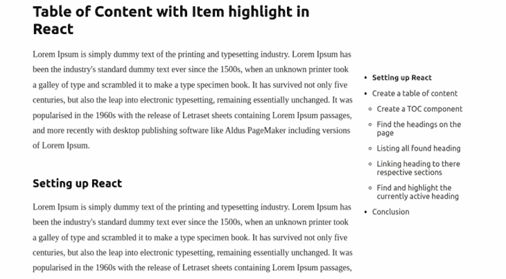
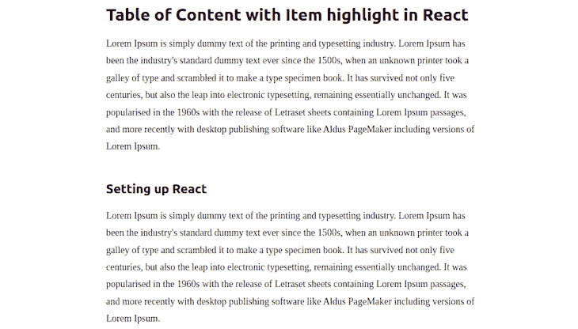
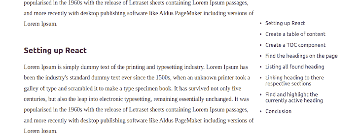

# 在 React - LogRocket 博客中创建一个突出显示的目录

> 原文：<https://blog.logrocket.com/create-table-contents-highlighting-react/>

目录为站点查看者提供了页面内容的摘要，允许他们通过单击所需的标题快速导航到页面的各个部分。通常，目录是在文档和博客中实现的。

在本教程中，我们将学习如何创建一个粘滞的目录，它将动态地列出页面上可用的标题，突出显示活动的标题。当我们浏览文章时，当标题出现在屏幕上时，它会在目录中高亮显示，如下图所示:



要学习本教程，您应该熟悉 React 和 React 钩子。您还应该在系统上安装 Node.js。本教程的完整代码可在 GitHub 上获得。我们开始吧！

## 设置 React

对于本教程，我创建了一个 starter repo，其中包含了我们将用来创建目录的代码。首先，我们需要克隆回购协议。为此，请在终端中运行以下命令:

```
$ git clone -b starter https://github.com/Tammibriggs/table-of-content.git

$ cd table-of-content

$ npm install

```

当我们用`$ npm start`命令启动应用程序时，我们应该看到以下页面:



## 创建一个目录组件

让我们从创建 TOC 组件开始，它将是粘性的，位于屏幕的右侧。

在我们之前克隆的应用程序中，在`src`目录下创建一个`TableOfContent.js`文件和一个`tableOfContent.css`文件。将以下代码行添加到`TableOfContent.js`文件中:

```
// src/TableOfContent.js
import './tableOfContent.css'

function TableOfContent() {
  return (
    <nav>
      <ul>
        <li>
          <a href='#'>A heading</a>
        </li>
      </ul>
    </nav>
  )
}
export default TableOfContent

```

在上面的代码中，注意我们将文本放在锚标记`<a></a>`中。在我们的目录中，我们将添加一些功能，这样当我们点击一个标题时，它将把我们带到页面上相应的部分。

通过在`href`属性中传递我们想要导航到的部分的 ID，我们可以很容易地用锚标记做到这一点。因此，我们页面上的所有部分都必须包含一个 ID，我已经将它包含在了`Content.js`文件中。

接下来，在`tableOfContent.css`文件中添加以下代码行:

```
// src/tableOfContent.css
nav {
  width: 220px;
  min-width: 220px;
  padding: 16px;
  align-self: flex-start;
  position: -webkit-sticky;
  position: sticky;
  top: 48px;
  max-height: calc(100vh - 70px);
  overflow: auto;
  margin-top: 150px;
}

nav ul li {
  margin-bottom: 15px;
}

```

现在，为了显示这个组件，转到`App.js`文件并添加以下导入:

```
import TableOfContent from './TableOfContent';

```

接下来，修改`App`组件，如下所示:

```
// src/App.js
function App() {
  return (
    <div className="wrapper">
      <Content />
      <TableOfContent />
    </div>
  );
}

```

通过上面的代码，我们将在应用程序的右侧看到一个粘性组件。

## 找到页面上的标题

为了找到页面上的所有标题，我们可以使用`querySelectorAll` document 方法，该方法返回一个`[NodeList](https://developer.mozilla.org/en-US/docs/Web/API/NodeList)`，表示与指定的选择器组匹配的元素列表。

下面的例子显示了我们将如何使用`querySelectorAll`方法:

```
const headings = document.querySelectorAll(h2, h3, h4)

```

我们已经指定了`h2`、`h3`和`h4`作为选择器，它们是一篇文章中可能使用的标题。我们没有包括`h1`,因为它主要用于页面的标题，我们希望我们的 TOC 只包含页面的子部分。

现在要找到标题，在`TableOfContent.js`文件中添加以下导入:

```
import { useEffect, useState } from 'react';

```

接下来，在组件中，在 return 语句前添加以下代码行:

```
// src/TableOfContent.js
const [headings, setHeadings] = useState([])

useEffect(() => {
  const elements = Array.from(document.querySelectorAll("h2, h3, h4"))
    .map((elem) => ({
      text: elem.innerText,
    }))
  setHeadings(elements)
}, [])

```

上面的代码将找到页面上所有指定的标题元素，然后将文本内容存储在状态中。

在上面的代码中，我们使用`[Array.from](https://developer.mozilla.org/en-US/docs/Web/JavaScript/Reference/Global_Objects/Array/from)`方法从`querySelectorAll`返回的`NodeList`中创建一个数组。我们这样做是因为有些功能，比如我们上面使用的`map`，在`NodeList`上没有实现。为了方便地处理找到的标题元素，我们将它们转换为一个数组。

现在，要显示 TOC 中的标题，请修改组件的 return 语句，使其看起来像下面的代码:

```
// src/TableOfContent.js
return (
  <nav>
    <ul>
      {headings.map(heading => (
        <li key={heading.text}>
          <a href='#'>{heading.text}</a>
        &lt;/li>
      ))}
    </ul>
  </nav>
)

```

现在，当我们在浏览器中打开应用程序时，我们会看到以下内容:



## 层次结构中的链接和列表标题

现在，当我们点击目录中的标题时，它不会把我们带到正确的部分。你会注意到它们都在同一行，没有标明哪个是主标题或者副标题。让我们解决这个问题。

在`TableOfContent`组件中，将`useEffect`挂钩修改成如下代码所示:

```
// src/TableOfContent.js
useEffect(() => {
  const elements = Array.from(document.querySelectorAll("h2, h3, h4"))
    .map((elem) => ({
      id: elem.id,
      text: elem.innerText,
      level: Number(elem.nodeName.charAt(1))
    }))
  setHeadings(elements)
}, [])

```

除了我们找到的标题文本，我们还向 state 添加了一个 ID 和一个`level`属性。我们将把 ID 传递给 TOC 文本的锚标记，这样当我们点击它时，我们将被带到页面的相应部分。然后，我们将使用`level`属性在 TOC 中创建一个层次结构。

修改`TableOfContent`组件的 return 语句中的`ul`元素，如下所示:

```
// src/TableOfContent.js
<ul>
  {headings.map(heading => (
    <li
      key={heading.id}
      className={getClassName(heading.level)}
      >
      <a
        href={`#${heading.id}`}
        onClick={(e) => {
          e.preventDefault()
          document.querySelector(`#${heading.id}`).scrollIntoView({
            behavior: "smooth"
          })}}
        >
        {heading.text}
      </a>
    </li>
  ))}
</ul>

```

在上面的代码中，除了将 ID 添加到锚标签`<a></a>`的`href`属性中，我们还添加了一个`onClick`事件，当该事件被触发时，将调用`scrollIntoView`使浏览器平滑地滚动到相应的部分。

在`li`元素中，我们在`className`属性中调用`getClassName(heading.level)`。我们将使用这个我们很快就会创建的特性，根据`level`属性的值设置不同的类名。因此，我们可以给目录中的副标题不同于主标题的样式。

接下来，为了创建`getClassName`函数，在`TableOfContent`组件之外添加以下代码:

```
// src/TableOfContent.js
const getClassName = (level) => {
  switch (level) {
    case 2:
      return 'head2'
    case 3:
      return 'head3'
    case 4:
      return 'head4'
    default:
      return null
  }
}

```

现在，在 in `tableOfContent.css`文件中添加以下代码行:

```
// src/tableOfContent.css
.head3{
  margin-left: 10px;
  list-style-type: circle;
}
.head4{
  margin-left: 20px;
  list-style-type: square;
}

```

使用上面的代码，当我们点击目录中的标题或副标题时，我们将被带到相应的部分。现在，我们的目录中有一个标题层次结构:


## 查找并突出显示当前活动的标题

当标题在我们的页面上可见时，我们希望在目录中突出显示相应的文本。

为了检测标题的可见性，我们将使用[交叉点观察器 API](https://developer.mozilla.org/en-US/docs/Web/API/Intersection_Observer_API) ，它提供了一种监视目标元素的方法，当元素到达预定义的位置时执行一个函数。

### 使用交叉点观察器 API 观察活动标题

使用交叉点观察器 API，我们将创建一个自定义挂钩，它将返回活动标题的 ID。然后，我们将使用返回的 ID 来突出显示 TOC 中相应的文本。

为此，在`src`目录中，创建一个`hook.js`文件，并添加以下代码行:

```
// src/hooks.js
import { useEffect, useState, useRef } from 'react';

export function useHeadsObserver() {
  const observer = useRef()
  const [activeId, setActiveId] = useState('')

  useEffect(() => {
    const handleObsever = (entries) => {}

    observer.current = new IntersectionObserver(handleObsever, {
      rootMargin: "-20% 0% -35% 0px"}
    )

    return () => observer.current?.disconnect()
  }, [])

  return {activeId}
}

```

在上面的代码中，我们创建了一个交叉点观察器的新实例。我们传递了一个`handleObsever`回调和一个`options`对象，其中我们指定了观察者回调的执行环境。

在使用`rootMargin`属性的`object`中，我们将根元素的顶部缩小了 20 %,这是我们当前的整个页面，底部缩小了 35%。因此，当页眉位于页面的顶部 20%和底部 35%时，它不会被视为可见。

* * *

### 更多来自 LogRocket 的精彩文章:

* * *

让我们通过将标题传递给交叉点观察器的`observe`方法来指定我们想要观察的标题。我们还将修改`handleObsever`回调函数来设置 state 中相交标题的 ID。

为此，修改`useEffect`钩子，使其看起来像下面的代码:

```
// src/hooks.js
useEffect(() => {
  const handleObsever = (entries) => {
    entries.forEach((entry) => {
      if (entry?.isIntersecting) {
        setActiveId(entry.target.id)
      }
    })
  }

  observer.current = new IntersectionObserver(handleObsever, {
    rootMargin: "-20% 0% -35% 0px"}
  )

  const elements = document.querySelectorAll("h2, h3", "h4")
  elements.forEach((elem) => observer.current.observe(elem))
  return () => observer.current?.disconnect()
}, [])

```

在`TableOfContent.js`文件中，用以下代码导入创建的钩子:

```
// src/TableOfContent.js
import { useHeadsObserver } from './hooks'

```

现在，在`TableOfContent`组件中的`headings`状态之后调用钩子:

```
// src/TableOfContent.js
const {activeId} = useHeadsObserver()

```

有了上面的代码，当一个 heading 元素相交时，就可以用`activeId`了。

### 突出显示活动标题

为了突出显示 TOC 中的活动标题，通过添加以下样式属性来修改`TableOfContent`组件的返回语句中的`li`元素的锚标记`<a></a>`:

```
style={{
  fontWeight: activeId === heading.id ? "bold" : "normal" 
}}

```

现在，我们的锚标记将如下所示:

```
// src/TableOfContent.js
<a
  href={`#${heading.id}`} 
  onClick={(e) => {
    e.preventDefault()
    document.querySelector(`#${heading.id}`).scrollIntoView({
      behavior: "smooth"
    })}}
    style={{
      fontWeight: activeId === heading.id ? "bold" : "normal" 
    }}
  >
  {heading.text}
</a>

```

现在，当一个标题被激活时，它会变成粗体。这样，我们就完成了标题高亮的目录创建。

### 突出显示目录项目的缺点

在 TOC 中添加项目突出显示时，需要注意一些事项。首先，没有标准的方法将这个特性添加到 TOC 中。因此，在不同的网站上，实现是不同的，这意味着我们网站的用户必须了解我们的 TOC 是如何工作的。

此外，由于每个目录的每个标题之间的间距根据其下的文本而有所不同，因此我们对突出显示功能的实现可能不会对所有标题都准确。

## 结论

将目录添加到您的博客或文章中可以为网站访问者创造更好的体验。在本教程中，我们学习了如何创建一个带有项目高亮显示的目录，以指示每个活动标题，帮助您的用户浏览您的站点并提高您的整体 UX。

## [LogRocket](https://lp.logrocket.com/blg/react-signup-general) :全面了解您的生产 React 应用

调试 React 应用程序可能很困难，尤其是当用户遇到难以重现的问题时。如果您对监视和跟踪 Redux 状态、自动显示 JavaScript 错误以及跟踪缓慢的网络请求和组件加载时间感兴趣，

[try LogRocket](https://lp.logrocket.com/blg/react-signup-general)

.

[ ](https://lp.logrocket.com/blg/react-signup-general) [](https://lp.logrocket.com/blg/react-signup-general) 

LogRocket 结合了会话回放、产品分析和错误跟踪，使软件团队能够创建理想的 web 和移动产品体验。这对你来说意味着什么？

LogRocket 不是猜测错误发生的原因，也不是要求用户提供截图和日志转储，而是让您回放问题，就像它们发生在您自己的浏览器中一样，以快速了解哪里出错了。

不再有嘈杂的警报。智能错误跟踪允许您对问题进行分类，然后从中学习。获得有影响的用户问题的通知，而不是误报。警报越少，有用的信号越多。

LogRocket Redux 中间件包为您的用户会话增加了一层额外的可见性。LogRocket 记录 Redux 存储中的所有操作和状态。

现代化您调试 React 应用的方式— [开始免费监控](https://lp.logrocket.com/blg/react-signup-general)。