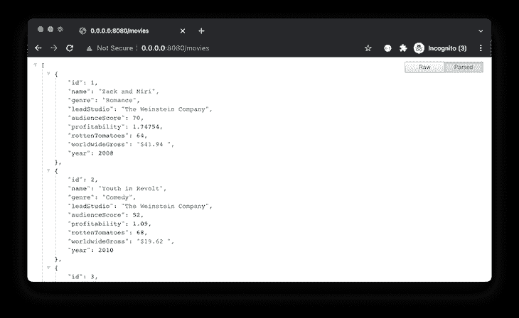
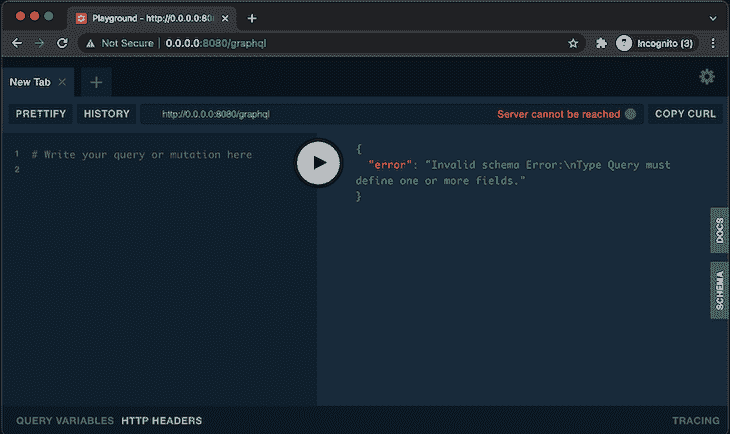
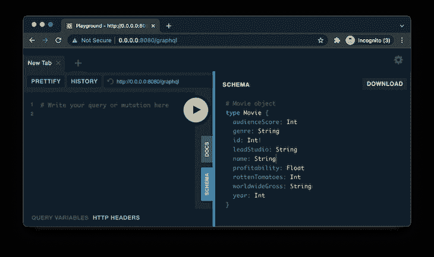
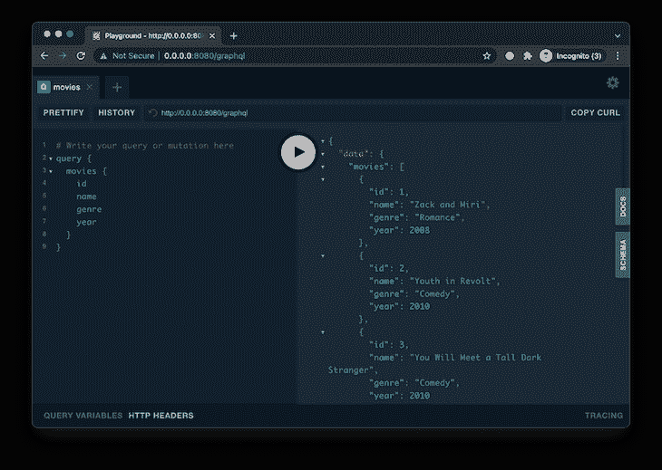
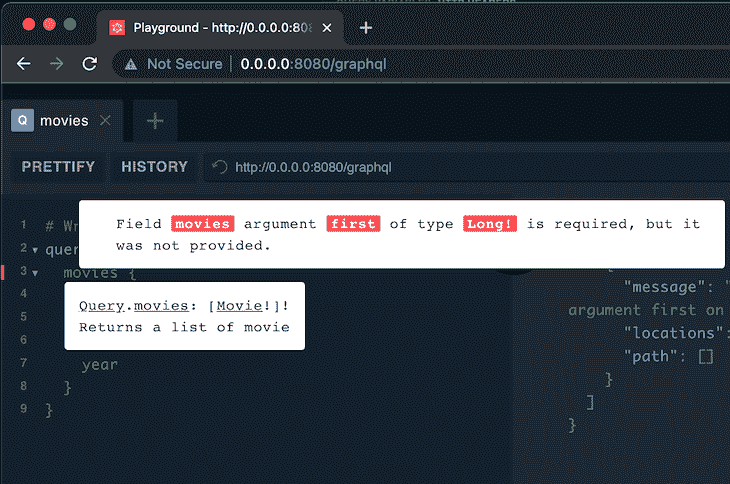
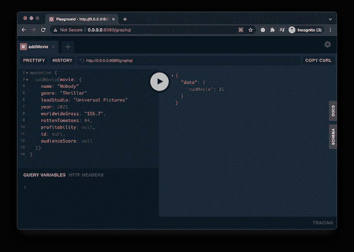
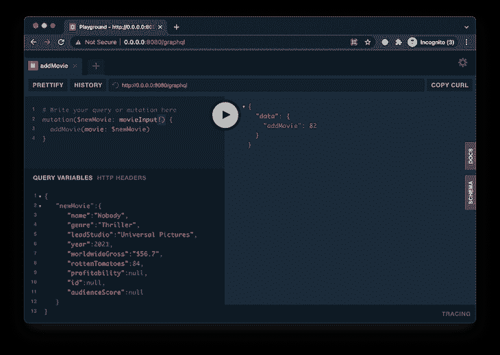
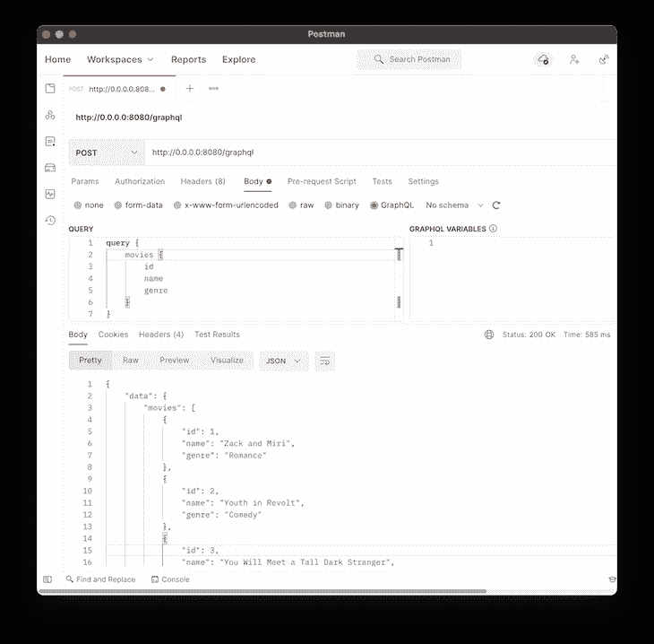

# 用 Ktor - LogRocket 博客创建 GraphQL 服务器

> 原文：<https://blog.logrocket.com/creating-a-graphql-server-with-ktor/>

直到最近，REST 还是创建后端 API 的实际设计。在过去的几年里，GraphQL 作为 REST 的替代品越来越受欢迎。

类似地，在移动开发领域，Kotlin 作为 Java 的替代品，已经开始获得 Android 开发者的认可。Kotlin 的流行使其被用于其他技术，如后端和跨平台应用程序开发。

在本文中，我们将看看如何在`Ktor`中设置`GraphQL`,并将现有的数据源作为`GraphQL` API 公开。

## 关于 Ktor 和 GraphQL 应该知道什么

在我们进入细节之前，这里有一个我们将在本文中讨论的解决方案的纲要。

### **Ktor 是什么？**

Ktor 是一个异步框架，用于创建 web 应用程序。它允许开发人员轻松地为移动或 web 客户端创建 Kotlin 后端 API。

### **什么是 GraphQL？**

GraphQL 是一种查询数据的语言，它通过公开底层数据源中的数据来查询数据。GraphQL 不查询表或数据库；它不知道实际数据驻留在哪里(SQL/NoSQL 数据库、文件、微服务、REST APIs 等)。)

GraphQL 有三个主要操作:

*   `Query`:取数据
*   `Mutation`:用于写入数据
*   `Subscription`:用于数据变化时获取更新。(想想 RxJava `Observables`)

(注意:这些只是规范而不是规则——后端服务器可以选择在`query`操作中改变它的数据。)

### **kot Lin 和 GraphQL 的相似之处**

可空性作为一个特性内置在`Kotlin`和`GraphQL`中。在 Kotlin 中，可空字段用`?`表示，在 GraphQL 中，不可空字段显示为`!`。

```
// Kotlin

val name: String? // -> nullable
val age: String   // -> non-nullable

```

```
// GraphQL

name: String // -> nullable
age: String! // -> non nullable

```

## 创建 GraphQL API

我们可以从这里的[创建一个初学者 Ktor 项目，或者使用 IntelliJ 插件(用于 IDEA Ultimate Edition)。](https://start.ktor.io/)

我们将使用`KGraphQL`库将数据公开为 GraphQL API。我将使用现有的`MySQL`数据库和以前项目中的`[[SQLDelight]](https://blog.logrocket.com/intro-sqldelight/)`作为底层数据源。

该数据库包含一个电影列表，在`/movies`端点中显示为一个`GET`查询。

```
val moviesRepository by inject<MovieRepository>()

routing {
    get("/movies") {
        call.respond(moviesRepository.getAllTheMovies(Long.MAX_VALUE))
    }
}

```



`Movie`模型类如下所示:

```
@Serializable
data class Movie(
    val id: Int,
    val name: String?,
    val genre: String?,
    val leadStudio: String?,
    val audienceScore: Int?,
    val profitability: Double?,
    val rottenTomatoes: Int?,
    val worldwideGross: String?,
    val year: Int?
)

```

## 设置 KGraphQL

向`build.gradle`或`build.gradle.kts`文件添加`KGraphQL`依赖项:

```
implementation("com.apurebase:kgraphql:0.17.14")
implementation("com.apurebase:kgraphql-ktor:0.17.14")

```

创建一个名为`KGraphQL.kt`的文件:

```
import com.apurebase.kgraphql.GraphQL
import io.ktor.application.Application
import io.ktor.application.install

fun Application.configureGraphQL() { 
  install(GraphQL) {
    playground = true
    schema {
     // TODO: next section
    }
  }
}

```

然后，将上述扩展函数添加到 Ktor 的`Application.kt`文件中:

```
fun main() {
    embeddedServer(Netty, port = 8080, host = "0.0.0.0") {
        configureKoin()
        configureHTTP()
        configureSerialization()
        configureRouting()
        configureGraphQL() // <- Here
    }.start(wait = true)
}

```

## 图形游乐场

现在，当我们运行应用程序并到达`/graphql`端点时，我们会看到一个 graphic QL(读作“graphical”)平台。这允许我们在开发过程中测试我们的`GraphQL`查询。



## 查询和类型

我们可以将我们的`Movie`数据类注册为`GraphQL`输出类型，方法是将它添加到`KGraphQL.kt`文件的`schema`块中。

```
schema {
    type<Movie>() {
        description = "Movie object"
    }
}

```

现在，在我们的 GraphiQL playground 中，我们可以在“SCHEMA”选项卡中看到详细信息。



为了创建一个返回电影列表的简单查询，我们将在`schema`块中添加以下代码:

```
query("movies") {
    description = "Returns a list of movie"
    resolver { -> movieRepository.getAllTheMovies(Long.MAX_VALUE) }
}

```

(注:这里，`movieRepository.getAllTheMovies()`内部查询 MySql 数据库。您可以将其更改为您喜欢的任何数据源。)

现在，让我们在操场上编写第一个`GraphQL`查询，并单击“Run ”(显示为“Play”符号)按钮。

```
query {
  movies {
    id
    name
    genre
    year
  }
}

```



## 争论

为了给`movies`查询添加一个参数，我们可以修改我们的解析器。我们将添加参数`first`来限制返回的电影数量。

```
resolver { first: Long -> movieRepository.getAllTheMovies(first) }

```

要运行前面的查询，我们需要为`first`提供一个值:

```
query {
  movies(first: 2) { 
    id
    name
    genre
    year
  }
}

```

这是一个必需的参数，如果没有这个参数，`GraphQL`将抛出如下错误:



为了使参数可选，我们可以使用`withArgs`闭包为解析器提供一个默认值，如下所示:

```
resolver { first: Long -> movieRepository.getAllTheMovies(first) }.withArgs {
    arg<Long> { name = "first"; defaultValue = 10L }
}

```

现在，如果我们运行不带`first`参数的`movies`查询，它将使用默认值 10。

类似地，我们可以创建另一个查询来获取与`id`匹配的单个电影。

```
query("movie") {
    description = "Returns a movie matched by id or null if id is invalid"
    resolver { id: Int -> movieRepository.getMovieById(id) }
}

```

## 变化

我们可以创建一个类似于查询操作的变异操作:

```
schema {
 //...
  mutation("addMovie") {
    description = "Adds a new movie and return"
    resolver { movie: Movie -> movieRepository.createMovie(movie) }
  }
}

```

运行上述模式会引发以下错误:

```
"error": "Introspection must provide output type for fields, but received: [Movie!]!."

```

要使用自定义类作为解析器参数的类型，我们需要将其注册为`inputType`。这与我们之前做的`type<movie>{..}`注册不同。

```
inputType<Movie> {
    name = "movieInput"
}

mutation("addMovie") {
    description = "Adds a new movie and returns the id"
    resolver { movie: Movie -> movieRepository.createMovie(movie) }
}

```

运行以下查询会向我们的数据库添加一个新行:

```
mutation {
  addMovie(movie: {
    name: "Nobody"
    genre: "Thriller"
    leadStudio: "Universal Pictures"
    year: 2021
    worldwideGross: "$56.7",
    rottenTomatoes: 84,
    profitability: null,
    id: null,
    audienceScore: null
  })
}

```



我们还可以使用 GraphiQL Playground 中的“查询变量”选项卡，并将`movie`对象作为 JSON 编码的变量传递:



类似地，为了更新现有的电影，我们可以创建另一个变体——这一次，我们返回的不是一个`id`,而是电影对象。


(注意:在变异操作中，由我们来决定是返回一个`id`还是一个完整的`movie`对象，或者根据需求返回其他任何东西。)

在撰写本文时，`KGraphQL`不支持`Subscription`操作。

## 无操场跑步

开发时使用操场；当我们部署后端应用程序时，我们需要关闭它。

```
fun Application.configureGraphQL() {
    val movieRepository by inject<MovieRepository>()
    install(GraphQL) {
        playground = false
        schema {..}
    }
}

```

重启应用程序后，如果我们试图在浏览器上访问`http:0.0.0.0:8080/graphql`，我们会得到一个`404 Not Found`错误。

为了访问我们的 GraphQL API，我们需要发送一个`POST`请求。



我使用`Postman`应用程序来测试端点。在`Body`中，我们可以传递查询，如前所述，(因为 Postman 支持`GraphQL`)或者像下面这样的 JSON 格式的请求。

```
{
    "query": "query {\n movies {\n id\n name\n genre\n  }\n}",
    "variables": {}
}

```

我们还可以在`install`块中将默认的`/graphql`端点改为自定义的，比如`/movies-graphql`，然后重启我们的应用程序。

```
install(GraphQL) {
  playground = false
  endpoint = "/movies-graphql"
  schema {..}
}

```

现在我们的 GraphQL API 将在这个端点:`https:0.0.0.0/movies-graphql`提供服务。

这个项目的完整源代码可以在[这里](https://github.com/jobinlawrance/ktor-graphql)找到。

## 结论

本文向您展示了如何在 Ktor 中创建 GraphQL 服务器，以及如何将底层数据源公开为 GraphQL API 端点。

我们还研究了如何在开发过程中设置 GraphQL Playground 来测试和调试查询和变化，以及如何在产品的最终展示中禁用 Playground。

## 监控生产中失败和缓慢的 GraphQL 请求

虽然 GraphQL 有一些调试请求和响应的特性，但确保 GraphQL 可靠地为您的生产应用程序提供资源是一件比较困难的事情。如果您对确保对后端或第三方服务的网络请求成功感兴趣，

[try LogRocket](https://lp.logrocket.com/blg/graphql-signup)

.

[](https://lp.logrocket.com/blg/graphql-signup)[https://logrocket.com/signup/](https://lp.logrocket.com/blg/graphql-signup)

LogRocket 就像是网络和移动应用的 DVR，记录下你网站上发生的每一件事。您可以汇总并报告有问题的 GraphQL 请求，以快速了解根本原因，而不是猜测问题发生的原因。此外，您可以跟踪 Apollo 客户机状态并检查 GraphQL 查询的键值对。

## LogRocket :即时重现你的安卓应用中的问题。

[](https://lp.logrocket.com/blg/kotlin-signup)

[LogRocket](https://lp.logrocket.com/blg/kotlin-signup) 是一款 Android 监控解决方案，可以帮助您即时重现问题，确定 bug 的优先级，并了解您的 Android 应用程序的性能。

LogRocket 还可以向你展示用户是如何与你的应用程序互动的，从而帮助你提高转化率和产品使用率。LogRocket 的产品分析功能揭示了用户不完成特定流程或不采用新功能的原因。

开始主动监控您的 Android 应用程序— [免费试用 LogRocket】。](hhttps://lp.logrocket.com/blg/kotlin-signup)

LogRocket 检测您的应用程序以记录基线性能计时，如页面加载时间、到达第一个字节的时间、慢速网络请求，还记录 Redux、NgRx 和 Vuex 操作/状态。

[Start monitoring for free](https://lp.logrocket.com/blg/graphql-signup)

.