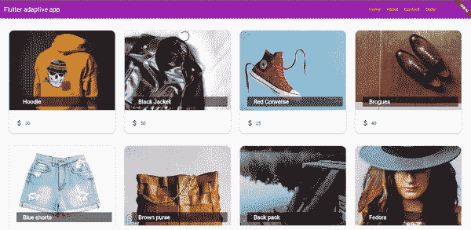
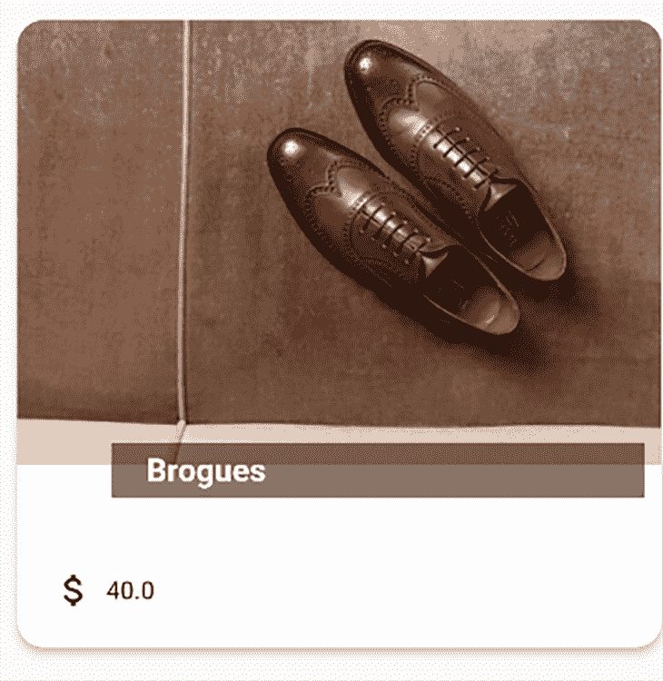
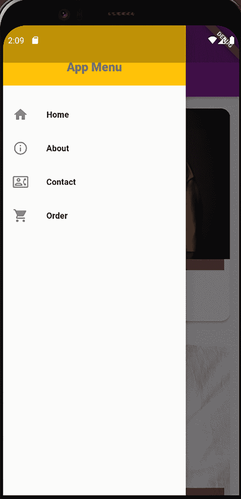
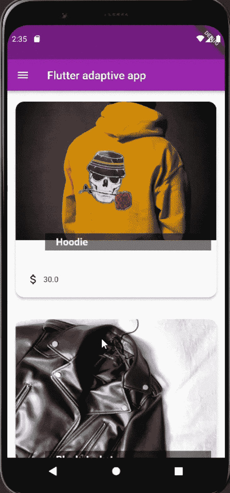
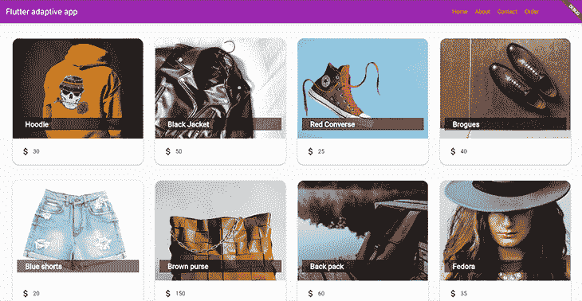

# 用 Flutter 创建自适应应用程序

> 原文：<https://blog.logrocket.com/creating-adaptive-app-flutter/>

Flutter 之所以被广泛采用，是因为它可以用一个代码库灵活地构建在 Android、iOS、macOS 和 Windows 机器上运行的应用程序。在大多数情况下，这些设备有不同的大小，尽管 Flutter 具有跨平台的能力，但您不能保证您的应用程序的界面在默认情况下会在这些设备上按预期呈现。这是您在开发过程中必须考虑的一个特性。

这篇文章将演示如何创建一个带有 Flutter 的自适应应用程序。您将了解如何构建一个适应给定设备大小的基本电子商务应用程序，而不必随着屏幕大小的变化而重新构建应用程序。我们将涵盖:

## 什么是适应性应用？

当一个应用程序被设计为在运行时根据特定的参数改变其属性值以响应不同的输入或条件时，它被认为是自适应的。例如，自适应应用程序使用相同的代码库在移动和桌面视图上呈现不同的界面。

值得注意的是，适应性设计不应与[响应式设计](https://blog.logrocket.com/achieving-responsive-design-flutter/)相混淆。响应式应用程序根据可用的屏幕大小动态地改变其界面布局，但保持布局设计。应用程序的内容只是重新排列以适应屏幕大小。

另一方面，自适应设计要求您创建特定于平台的设计、内容和模板。也就是说，移动设备上的应用程序设计在更大的屏幕(如桌面设备)上会有所不同。

## 构建自适应应用时需要考虑什么

为了改善用户体验，您应该设计您的应用程序来适应具有不同设计、大小、形状和操作系统的不同设备(手机、可折叠设备、平板电脑、智能手表和个人电脑)。您的用户应该能够在这些不同的设备上探索您的应用程序，并且仍然能够享受设备和操作系统带来的体验。

在设计或开发阶段，您必须做出的一个重要决定是确定应用程序切换布局的阈值。在 Android 文档的[部分有一组推荐值，可以帮助你决定应用在不同屏幕尺寸上的布局。](https://developer.android.com/guide/topics/large-screens/support-different-screen-sizes)

在大多数情况下，由于垂直滚动的影响，屏幕的可用宽度可能比其可用高度更重要。您还需要考虑鼠标、键盘、触摸输入和其他特定于每个平台的特征。您应该定制应用程序的体验和界面，以适应主机设备。

## 使用 Flutter `LayoutBuilder`创建自适应应用程序

Flutter 提供了许多小部件，你可以在构建自适应应用时使用。还有一些外部包，如[颤振自适应 UI](https://pub.dev/packages/flutter_adaptive_ui) 和[自适应布局](https://pub.dev/packages/adaptive_layout)，您可以将它们集成到您的应用程序中。在本文中，我们将重点关注使用 Flutter 提供的`[LayoutBuilder widget](https://api.flutter.dev/flutter/widgets/LayoutBuilder-class.html)`来构建一个自适应的应用程序。

`LayoutBuilder`类对于构建响应性和适应性的应用程序很有用，因为它有一个在布局时调用的构建器函数。这个函数返回一个小部件，接收应用程序上下文和约束，并根据约束的值执行特定的操作。例如，当设备宽度满足通过`constraints.maxWidth`属性指定的条件时，您可以选择呈现不同的设计:

```
LayoutBuilder(
        builder: (ctx, constraints) {
          if (constraints.maxWidth < 600) {
              return widget;
          }else{
            return anotherWidget;
          }
        }
    );
```

## 项目概述

本教程的演示应用程序是一个电子商务应用程序，在一个可滚动的视图中显示其产品。在移动设备上，每个产品占用可用的宽度，用户可以垂直滚动屏幕来查看每个可用的产品。移动视图还将包含一个带有导航按钮的应用抽屉。

在较大的屏幕上，例如在桌面设备上，产品分布在屏幕的宽度和高度上。桌面视图还将在屏幕顶部包含一个导航栏，以取代移动视图中的应用程序抽屉。

如前所述，应用程序将使用 Flutter `[LayoutBuilder class](https://api.flutter.dev/flutter/widgets/LayoutBuilder-class.html)`来确保它在运行时根据可用的屏幕大小呈现指定的界面，而不必重新构建应用程序。

以下是应用程序在不同屏幕尺寸下的预期输出:



### 先决条件

## 教程:使用 Flutter 创建自适应电子商务应用程序

### 安装

打开您的终端并运行以下命令来创建引导 Flutter 项目，然后在您的首选 IDE 中打开该项目。

```
flutter create shop_app
```

在`lib`文件夹中，创建两个包——`widgets`和`screens`——分别包含应用程序小部件和屏幕的 Dart 文件。

在`lib`文件夹中创建一个`dummy_data.dart`文件，然后从 GitHub repo 中为这个教程复制[内容到这个文件中。您将使用该文件在后续部分中生成`Product`小部件。](https://github.com/olu-damilare/flutter_adaptive_app/blob/main/lib/dummy_data.dart)

`Product`小部件代表应用程序上每个产品项目的模板。在`widgets`包中，创建一个`product.dart`文件，并添加以下代码:

```
import 'package:flutter/material.dart';

class Product extends StatelessWidget {
  final String id;
  final String name;
  final Color color;
  final String imageUrl;
  final double price;

  const Product({
    required this.id,
    required this.name,
    this.color = Colors.amberAccent,
    required this.imageUrl,
    required this.price
  });
}
```

下面是小部件的`build`方法:

```
 @override
  Widget build(BuildContext context) {
    return InkWell(
      onTap: () => (){},
      child: Card(
        shape: RoundedRectangleBorder(
            borderRadius: BorderRadius.circular(15)
        ),
        elevation: 4,
        margin: EdgeInsets.fromLTRB(15, 20, 15, 20),
        child: Column(
          children: [
            Expanded(
              child: Stack(
                children: [
                  ClipRRect(
                    borderRadius: const BorderRadius.only(
                        topLeft: Radius.circular(15),
                        topRight: Radius.circular(15)),
                    child: Image.network(
                      imageUrl,
                      height: 250,
                      width: double.infinity,
                      fit: BoxFit.cover,
                    ),
                  ),
                  Positioned(
                    bottom: 20,
                    right: 10,
                    child: Container(
                      color:  Colors.black54,
                      width: 300,
                      padding: const EdgeInsets.symmetric(vertical: 5, horizontal: 20),
                      child: Text(name,
                        style: const TextStyle(
                          fontSize: 18,
                          color: Colors.white,
                          fontWeight: FontWeight.bold
                        ),
                        softWrap: true,
                        overflow: TextOverflow.fade,
                      ),
                    ),
                  )
                ],
              ),
            ),
            Padding(
              padding: const EdgeInsets.all(20.0),
              child:
                  Row(
                    children: [
                      const Icon(Icons.attach_money),
                      const SizedBox(width: 6),
                      Text('$price')
                    ],
                  ),
              ),
          ],
        ),
      ),
    );
  }
```

上面的小部件使用了 Flutter 类和小部件的组合，包括:

*   用于增强应用程序用户体验的 [InkWell 类](https://blog.logrocket.com/implementing-inkwell-class-flutter/)
*   堆栈将小部件一个放在另一个上面
*   将产品名称放在特定位置的[定位的](https://api.flutter.dev/flutter/widgets/Positioned-class.html)小部件

下面是`Product`小部件的输出:



### 构建导航抽屉

[导航抽屉](https://blog.logrocket.com/how-to-add-navigation-drawer-flutter/)将专门用于应用程序的移动视图中；也就是说，当在移动设备上打开时，应用程序将呈现抽屉。在`widgets`包中，创建一个名为`navigation_drawer`的 Dart 文件，并在文件中包含以下代码:

```
import 'package:flutter/material.dart';

class NavigationDrawer extends StatelessWidget {
  const NavigationDrawer({Key? key}) : super(key: key);

  Widget buildListTile(String title, IconData icon){
    return ListTile(
      leading: Icon(icon,
        size: 26,),
      title: Text(
        title,
        style: const TextStyle(
            fontSize: 14,
            fontWeight: FontWeight.bold
        ),
      ),
      onTap: () {},
    );
  }

  @override
  Widget build(BuildContext context) {
    return Drawer(
      child: Column(
        children: [
          Container(
            height: 100,
              padding: EdgeInsets.all(20),
          alignment: Alignment.bottomCenter,
            color: Theme.of(context).accentColor,
            child: Text('App Menu',
                style: TextStyle(
                  fontWeight: FontWeight.w900,
                  fontSize: 20,
                  color: Theme.of(context).primaryColor,
                ),
            ),
          ),
          const SizedBox(height: 20),
          buildListTile('Home', Icons.home),
          buildListTile('About', Icons.info_outline),
          buildListTile('Contact', Icons.contact_phone_outlined),
          buildListTile('Order', Icons.shopping_cart),
        ],
      ),
    );
  }
}
```

从上面的代码中，`buildListTile`方法为抽屉中的特定项目构建了一个 [ListTile 小部件](https://api.flutter.dev/flutter/material/ListTile-class.html)，在本例中为`Home`、`About`、`Contact`和`Order`。



### 呈现移动屏幕

接下来，创建屏幕来呈现应用程序的移动视图。在`screens`包中，创建一个名为`mobile_product_view`的 Dart 文件，并在文件中包含以下代码片段:

```
import 'package:flutter/material.dart';
import 'package:shop_app/widgets/product.dart';

import '../dummy_data.dart';
import '../widgets/navigation_drawer.dart';

class MobileProductView extends StatelessWidget {
  final String title;

  const MobileProductView({Key? key, required this.title}) : super(key: key);

  @override
  Widget build(BuildContext context) {
   return Scaffold(
        appBar: AppBar(
          title: Text(title),
        ),
        drawer: NavigationDrawer(),
     body:  GridView.count(
       crossAxisCount: 1,
    children: DUMMY_DATA.map((product) =>
    Product(id: product.id, name: product.name, imageUrl: product.imageUrl, color: product.color, price: product.price)).toList(),
    )
    );
  }
}
```

上面的代码显示了应用程序使用来自`dummy_data.dart`文件的数据来构建一个被呈现为 [GridView](https://blog.logrocket.com/how-to-create-a-grid-list-in-flutter-using-gridview/) 的`Product`小部件列表。



### 渲染桌面屏幕

本节将包含应用程序桌面视图的实现。在`screens`包中创建一个名为`desktop_product_view`的 Dart 文件。将以下代码添加到文件中:

```
import 'package:flutter/material.dart';
import 'package:shop_app/widgets/product.dart';

import '../dummy_data.dart';

class DesktopProductView extends StatelessWidget {
  final String title;
  final int crossAxisCount;

  const DesktopProductView({Key? key, required this.title, required this.crossAxisCount}) : super(key: key);

  @override
  Widget build(BuildContext context) {

    Widget getAction(String actionName){
      return TextButton(
        onPressed: () {},
        child: Text(
          actionName,
          style: TextStyle(
              color: Theme.of(context).accentColor,
            fontWeight: FontWeight.w500
          ),
        ),
      );
    }

    return Scaffold(
      appBar: AppBar(
        title: Text(title),
        actions: [
          Padding(
            padding: const EdgeInsets.only(right: 100.0),
            child: Row(
              mainAxisAlignment: MainAxisAlignment.spaceBetween,
              children: [
                getAction('Home'),
                getAction('About'),
                getAction('Contact'),
                getAction('Order'),
              ],
            ),
          )
        ],
      ),
      body: Padding(
        padding: const EdgeInsets.all(18.0),
        child: GridView.count(
         crossAxisCount: crossAxisCount,
          children: DUMMY_DATA.map((product) =>
              Product(
                  id: product.id,
                  name: product.name,
                  imageUrl: product.imageUrl,
                  color: product.color,
                  price: product.price)
          ).toList(),
        ),
      ),
    );
  }
}
```

从上面的代码中，小部件通过其构造函数接收`crossAxisCount`值。通过这个值，它指定了运行时在`GridView`中呈现的`Product`小部件的数量。

`AppBar`小部件中的操作将替换您为移动视图创建的抽屉。使用`getAction`方法，您可以为`AppBar`创建特定的动作部件。



### 实现`LayoutBuilder`类

`LayoutBuilder`类的实现将在`main.dart`文件中完成。这是因为我们将应用程序的整个屏幕设计为自适应的。因此，`LayoutBuilder`应该从窗口小部件的最外层构建接口，在本例中，它放在`main.dart`文件中。

下面是您应该添加到`main.dart`文件中的代码:

```
import 'package:flutter/material.dart';
import 'package:shop_app/screens/mobile_product_view.dart';

import 'screens/desktop_product_view.dart';

void main() {
  runApp(const MyApp());
}

class MyApp extends StatelessWidget {
  const MyApp({super.key});

  @override
  Widget build(BuildContext context) {
    return MaterialApp(
      title: 'Flutter Demo',
      theme: ThemeData(
        primarySwatch: Colors.purple,
        accentColor: Colors.amber
      ),
      home: const MyHomePage(title: 'Flutter adaptive app'),
    );
  }
}

class MyHomePage extends StatefulWidget {
  const MyHomePage({super.key, required this.title});
  final String title;

  @override
  State<MyHomePage> createState() => _MyHomePageState();
}

class _MyHomePageState extends State<MyHomePage> {

  @override
  Widget build(BuildContext context) {
    return LayoutBuilder(
      builder: (ctx, constraints){
        if(constraints.maxWidth < 600){
          return MobileProductView(title: widget.title);
        }
        int crossAxisCount = 0;
        if(constraints.maxWidth > 1400) {
          crossAxisCount = 4;
        } else if(constraints.maxWidth > 900) {
          crossAxisCount = 3;
        } else if (constraints.maxWidth >= 600) {
          crossAxisCount = 2;
        }
        return DesktopProductView(title: widget.title, crossAxisCount: crossAxisCount);
      }
    );
  }
}
```

`MyHomePage`小部件的`build`方法使用基于以下约束的`LayoutBuilder`构建屏幕:

*   如果设备屏幕的宽度小于 600 像素，它将构建`MobileProductView`，它代表您在上一节中为移动设备创建的界面
*   如果设备屏幕的宽度大于 600 像素，它会根据设备宽度构建`DesktopProductView`和指定的`crossAxisCount`，如代码所示

如果你想让你的应用程序的一个特定部分自适应，而不是像上面演示的那样让整个屏幕自适应，你必须在小部件的期望部分实现`LayoutBuilder`。

## 结论

让您的应用程序适应不同的操作系统和设备屏幕大小是改善用户体验的好方法。本教程演示了如何使用 Flutter `LayoutBuilder`类使你的应用程序具有适应性。正如文章开头提到的，在构建自适应应用程序时，您可以采用其他选项，如[自适应布局包](https://pub.dev/packages/adaptive_layout)。

本教程中构建的项目可以在 [GitHub](https://github.com/olu-damilare/flutter_adaptive_app/) 上获得。我还建议您研究一下 Flutter 文档，以便更全面地了解如何在应用程序的不同部分构建适应性布局。