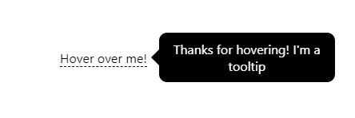
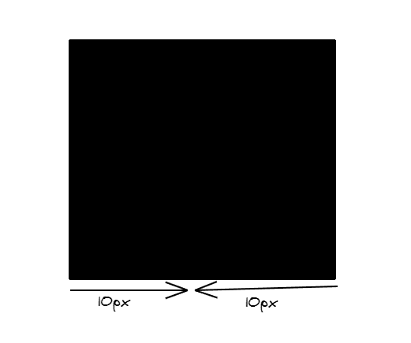
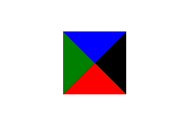
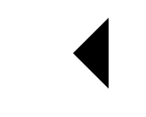
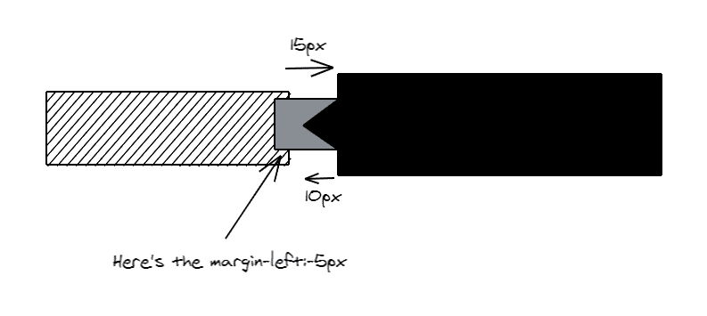

# 仅用 CSS 创建漂亮的工具提示

> 原文：<https://blog.logrocket.com/creating-beautiful-tooltips-with-only-css/>

当你悬停在文本上时，你见过那些带有额外描述的方框吗？

那些是工具提示！即使开始创建你的第一个工具提示看起来有点吓人，你实际上只需要知道基本的 CSS。

这篇文章将向你展示如何只用 CSS 创建漂亮的工具提示。



A tooltip.

首先，让我们从一个带有`tooltip`类的`<span>`元素开始，并添加一个锚文本。

```
<span class="tooltip">Hover over me!</span>
```

## 创建工具提示

我承诺只使用 CSS——没有额外的 HTML 元素。

我们怎样才能用那种方式创建工具提示呢？如果您的猜测是`:before`或`:after`伪元素，那么您是正确的。

在哪里定义工具提示文本？有人可能会说直接在伪元素的`content`属性中定义。

然而，这会使事情更难处理。

例如，如果你需要添加几个工具提示，你总是需要添加更多的 CSS 规则和定义内容。因此，这里我们将使用 [HTML 自定义数据属性](https://www.sitepoint.com/how-why-use-html5-custom-data-attributes/)来定义文本。

让我们将工具提示文本作为`data-text`属性添加到工具提示范围中。(你可以使用任何以`data-`为前缀的名字。此外，在某些情况下你甚至可以去掉前缀。)

```
<span 
  data-text="Thanks for hovering! I'm a tooltip" 
  class="tooltip"
>Hover over me!</span>
```

现在，我们可以添加 CSS 规则来设置容器的样式:

```
.tooltip {
  position:relative; /* making the .tooltip span a container for the tooltip text */
  border-bottom:1px dashed #000; /* little indicater to indicate it's hoverable */
}
```

最后，我们将创建位于右侧的工具提示文本:

```
.tooltip:before {
  content: attr(data-text); /* here's the magic */
  position:absolute;

  /* vertically center */
  top:50%;
  transform:translateY(-50%);

  /* move to right */
  left:100%;
  margin-left:15px; /* and add a small left margin */

  /* basic styles */
  width:200px;
  padding:10px;
  border-radius:10px;
  background:#000;
  color: #fff;
  text-align:center;

  display:none; /* hide by default */
}
```

`content: attr(data-text)`是这里的魔力。这将获取父元素的`data-text`属性，并将其用作内容。

工具提示文本被放置在`absolute`位置，它相对于`.tooltip`元素。

最终规则:悬停时显示工具提示文本:

```
.tooltip:hover:before {
  display:block;
}
```

您刚刚创建了您的第一个工具提示！接下来，让我们看看如何改进这一点。

## 定位工具提示

在上面的例子中，我们把工具提示放在右边。但是如果我们想把工具提示放在不同的地方呢？我们可以使用附加类来定义其他位置。

```
<span 
      data-text="Thanks for hovering! I'm a tooltip"
      class="tooltip left"
>Hover over me!</span>
```

新类的 CSS:

```
.tooltip.left:before {
  /* reset defaults */
  left:initial;
  margin:initial;

  /* set new values */
  right:100%;
  margin-right:15px;
}
```

您可以使用相同的方法为底部和顶部位置创建类。此外，您需要重置`top`值，并相应地覆盖`transform`值。

## 添加箭头

通常，CSS 工具提示有指向锚文本的箭头。

谢天谢地，我们还有另一个伪元素可以用来制作箭头。

以下是右对齐工具提示上箭头的代码:

```
.tooltip:after {
  content: "";
  position:absolute;

  /* position tooltip correctly */
  left:100%;
  margin-left:-5px;

  /* vertically center */
  top:50%;
  transform:translateY(-50%);

  /* the arrow */
  border:10px solid #000;
  border-color: transparent black transparent transparent;

  display:none;
}
.tooltip:hover:before, .tooltip:hover:after {
  display:block;
}
```

这里的技巧是设置一个边界。`border: 10px solid #000;`创建宽度为 10px 的边框。

由于我们还没有定义`.tooltip:after`的宽度和高度，宽度和高度等于边框宽度的两倍:



如果我们把每一面的边框颜色设置成不同的颜色会怎么样？

```
border-color: blue black red green;
```



你猜怎么着？设置所有颜色为透明，除了一边，这就是我们需要的箭头。

```
border-color: transparent black transparent transparent;
```



我们为什么要用`margin-left:-5px`？



当我们将边框宽度设为`10px`时，总宽度变为`20px`。我们使用`margin-left`来正确定位箭头(注意我们在工具提示中使用了`margin-left:15px`)。

我们如何摆脱这种恼人的保证金？轻松点。

将边框宽度设置为工具提示左边距的一半(在我们的例子中为`7.5px`)。我故意做成了`10px`给你看怎么处理上面的情况。现在你对两者都很熟悉了。

为其他位置(左侧、顶部和底部)创建箭头的方式相同。定位它们需要我们在`.tooltip.left:before`中使用的相同方法。

## 制作工具提示动画

工具提示常用的动画是淡入。

你也可以使用其他动画，比如放大或反弹，但我个人认为它们对于工具提示来说太多了。

让我们看看如何将淡入动画添加到 CSS 工具提示中。

最好的方法是使用`opacity`和`transition`。使用这些动画代替 CSS 动画有几个好处。

首先，它们很容易实现。其次，你不必担心淡出动画— `opacity`和`transition`为我们做了。

我们将使用`opacity:0`，而不是默认在工具提示上设置`display:none`。我们将设置所需的过渡时间:

```
.tooltip:before {
  /* other styles */

  /*  display:none; */

  opacity:0;
  transition:.3s opacity;   
}
```

使工具提示透明。另外，`transition: .3s opacity`告诉 CSS 引擎在不透明度改变时制作一个 0.3 秒的过渡效果。

```
.tooltip:hover:before {
  opacity:1;
}
```

当鼠标悬停在工具提示上时，不透明度设置为 1(完全可见)。浏览器将自动为您创建淡入和淡出动画，因为我们已经设置了不透明过渡。

您可以向工具提示箭头添加相同的动画:

```
.tooltip:after {
  opacity:0;
  transition:.3s;
}
.tooltip:hover:after {
  opacity:1;
}
```

## 结论

在本文中，我们只用 CSS 创建了一个工具提示(没有额外的 HTML 元素)。

我们使用`:before`作为工具提示文本，使用`:after`作为箭头。现在你明白了没有必要为简单的工具提示编写嵌套的 HTML 元素。

```
<span class="tooltip">
  Hover over me
  <span class="tooltip-text">
    Some tooltip text
  </span>
</span>
```

然而，我们的方法有一个缺点:如果我们需要添加一个链接到工具提示文本呢？

`data-text`属性中的`<a>`标签不会显示为链接，而是显示为文本。因此，如果你需要在工具提示中包含 HTML，你需要像上面代码一样的 HTML 标签。

定位、添加箭头和动画这些 HTML 标签与我们在本文中所做的类似。唯一的变化是:

*   `.tooltip:before`变成了`.tooltip-text`
*   `tooltip:after`变成了`.tooltip-text:before`或者`.tooltip-text:after`。

总之，我们主要使用伪元素和`content:attr()`来创建 CSS 工具提示。为了添加箭头，我们使用了一个带有`border`的技巧。为了制作动画，我们使用了`opacity`和`transition`。

最终的结果是一个只有 CSS 的工具提示。

## 你的前端是否占用了用户的 CPU？

随着 web 前端变得越来越复杂，资源贪婪的特性对浏览器的要求越来越高。如果您对监控和跟踪生产环境中所有用户的客户端 CPU 使用、内存使用等感兴趣，

[try LogRocket](https://lp.logrocket.com/blg/css-signup)

.

[](https://lp.logrocket.com/blg/css-signup)[https://logrocket.com/signup/](https://lp.logrocket.com/blg/css-signup)

LogRocket 就像是网络和移动应用的 DVR，记录你的网络应用或网站上发生的一切。您可以汇总和报告关键的前端性能指标，重放用户会话和应用程序状态，记录网络请求，并自动显示所有错误，而不是猜测问题发生的原因。

现代化您调试 web 和移动应用的方式— [开始免费监控](https://lp.logrocket.com/blg/css-signup)。