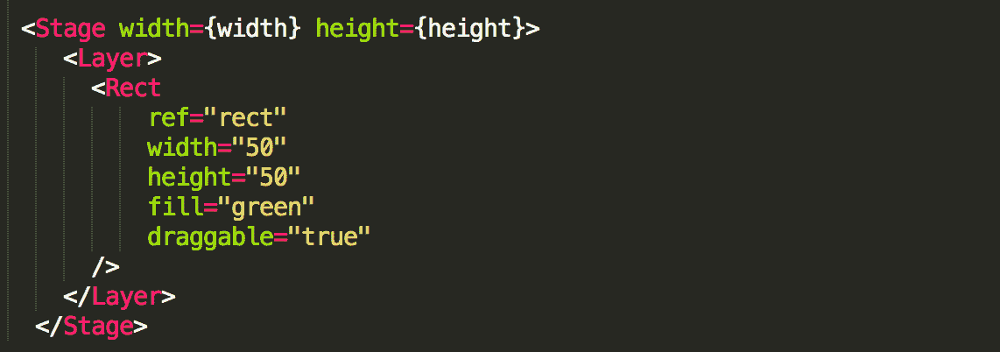
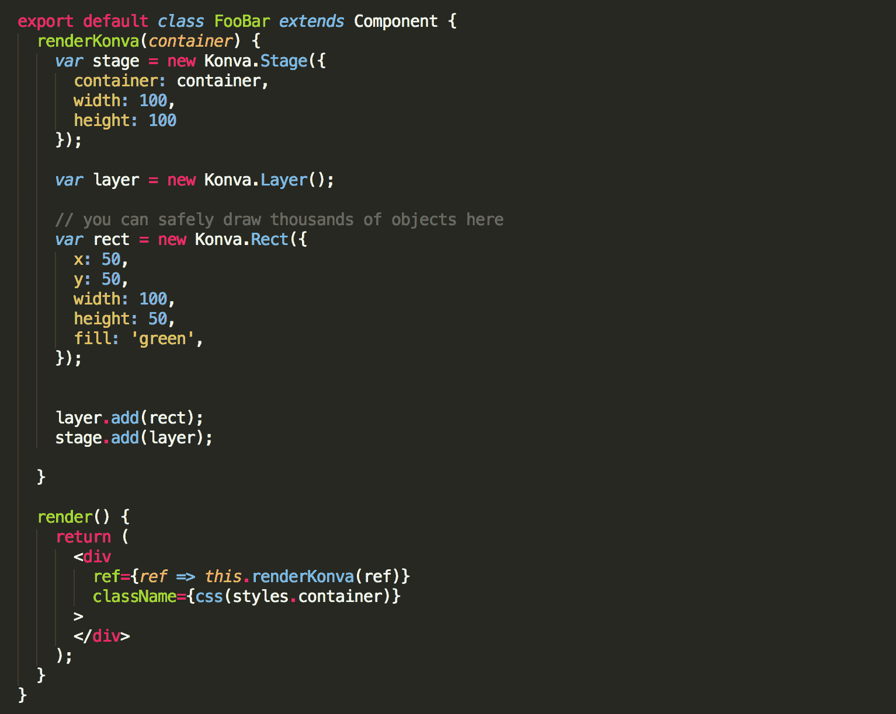

# 在 React 中创建画布图形

> 原文：<https://blog.logrocket.com/creating-canvas-graphics-in-react-cad70cd5b210/>

# 在 React 中创建画布图形

## 

2017 年 7 月 5 日 1 分钟阅读 462

HTML5 Canvas 是在 web 应用程序中嵌入高性能、交互式图形的强大工具。它拥有广泛的浏览器支持和用于绘制形状、图像和文本的内置 API。还有许多构建在 Canvas 之上的助手库，如 [Konva](https://konvajs.github.io/) 帮助处理事件和动画。

然而，Canvas API 是完全必要的。它使用了像`ctx.fillRect(10, 10, 100, 100)`和`ctx.fillStyle = ‘green’`这样的方法，对于一个被 reactive DOM 的魔力宠坏的 React 开发人员来说，这些方法感觉相当过时。当构建复杂的插图时，很容易看到复杂性快速增长。

### 反应车队

`react-konva`是一个使用 React 创建画布插图的库。它是作为 Konva Canvas 库的 React 包装器构建的，允许您通过 React 组件接口与 Konva API 进行交互。

让我们直接进入代码，感受一下它是如何工作的。

不要太担心舞台和图层，它们是 Konva 布局的基本组成部分。重要的部分是`<Rect />`组件。用`react-konva`形状表示为组件。您使用道具来描述每个形状的颜色、大小和其他属性。当道具改变时，`react-konva`更新底层画布图形。这就像使用 DOM 节点一样，只是元素被渲染到画布上！

#### 事件处理/互动

`react-konva`支持类似于 DOM 中的事件处理 API。您可以为形状附加处理程序，用于单击、拖动和其他交互事件。它内置了许多图形组件，如圆形、椭圆形、楔形、直线、箭头、正多边形等等。您还可以使用预构建的组件将图像和文本呈现到画布上。

### 警告

使用 Canvas 的一个原因是，您可以绘制数千个对象而不会导致内存损失，因为当您“绘制”某个对象时，它不会在内存中创建一个实际的对象，而只是改变画布上的像素。这是`react-konva`的一个限制，因为库创建 React 组件来管理每个形状的生命周期。如果在画布上绘制数百个形状，那么在 React 中创建许多 DOM 节点会有类似的内存开销。因此，`react-konva`不太适合需要在画布上呈现大量元素的应用程序。

如果您需要这样做，您可以像这样直接使用 Konva API(没有 React 包装):

### 演示！

在这里，我用 JSBin 构建了一个简单的演示，这样你就可以感受一下如何使用`react-konva`。尝试更改<星形/ >的参数，或者在插图中添加其他形状/交互。

> 一个用于 HTML、CSS & JavaScript 和一系列处理器的实时 pastebin，包括 SCSS、CoffeeScript、Jade 等等…

资源

### 反应+画布=爱情。使用 React 绘制复杂画布图形的 JavaScript 库。–GitHub–konva js/React-konva:React+Canvas = Love。使用 React 绘制复杂画布图形的 JavaScript 库。

> React + Canvas = Love. JavaScript library for drawing complex canvas graphics using React. – GitHub – konvajs/react-konva: React + Canvas = Love. JavaScript library for drawing complex canvas graphics using React.

要用 Konva 创建矩形，我们可以实例化一个 Konva。Rect()对象。有关属性和方法的完整列表，请查看 Konva。Rect 文档。您可以为 Konva.Rect 定义拐角半径。它可以是简单的数字或数字数组[topLeft，topRight，bottomRight，bottomLeft]。

> To create a rectangle with Konva, we can instantiate a Konva.Rect() object. For a full list of attributes and methods, check out the Konva.Rect documentation. You can define corner radius for Konva.Rect. It can be simple number or array of numbers [topLeft, topRight, bottomRight, bottomLeft].

[LogRocket](https://lp.logrocket.com/blg/react-signup-general) :全面了解您的生产 React 应用

## 调试 React 应用程序可能很困难，尤其是当用户遇到难以重现的问题时。如果您对监视和跟踪 Redux 状态、自动显示 JavaScript 错误以及跟踪缓慢的网络请求和组件加载时间感兴趣，

.

[try LogRocket](https://lp.logrocket.com/blg/react-signup-general)

LogRocket 结合了会话回放、产品分析和错误跟踪，使软件团队能够创建理想的 web 和移动产品体验。这对你来说意味着什么？

  

LogRocket 不是猜测错误发生的原因，也不是要求用户提供截图和日志转储，而是让您回放问题，就像它们发生在您自己的浏览器中一样，以快速了解哪里出错了。

不再有嘈杂的警报。智能错误跟踪允许您对问题进行分类，然后从中学习。获得有影响的用户问题的通知，而不是误报。警报越少，有用的信号越多。

LogRocket Redux 中间件包为您的用户会话增加了一层额外的可见性。LogRocket 记录 Redux 存储中的所有操作和状态。

现代化您调试 React 应用的方式— [开始免费监控](https://lp.logrocket.com/blg/react-signup-general)。

Modernize how you debug your React apps — [start monitoring for free](https://lp.logrocket.com/blg/react-signup-general).