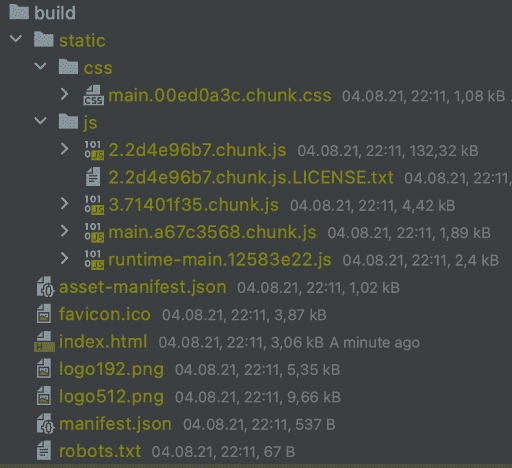
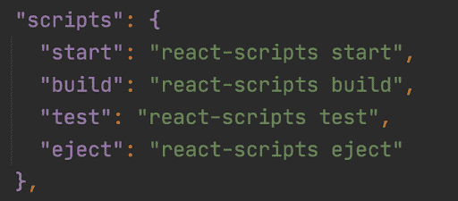
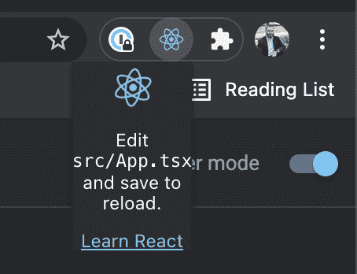
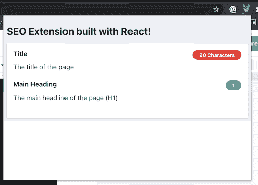
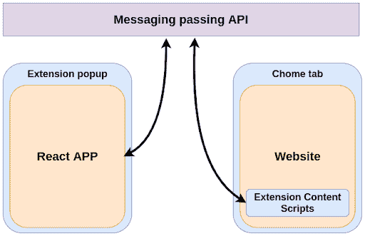
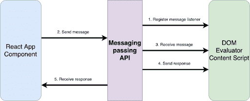

# 用 React 和 TypeScript 创建 Chrome 扩展

> 原文：<https://blog.logrocket.com/creating-chrome-extension-react-typescript/>

多年来，浏览器扩展使我们能够定制我们的网络体验。起初，扩展由小部件和通知徽章组成，但随着技术的发展，扩展变得与网站深度集成。现在甚至有了完全成熟的应用程序扩展。

随着扩展变得越来越复杂，开发人员创建了一些解决方案，使现有的工具能够扩展和适应。例如，像 React 这样的框架改进了 web 开发，甚至被用来——而不是普通的 JavaScript——构建 web 扩展。

## 什么是 Chrome 扩展？

要了解更多关于浏览器扩展的信息，我们来看看谷歌 Chrome。一个 [Chrome 扩展](https://developer.chrome.com/docs/extensions/)是一个由不同模块(或组件)组成的系统，其中每个模块提供与浏览器和用户不同的交互类型。模块的例子包括[后台脚本](https://developer.chrome.com/docs/extensions/mv3/background_pages/)、[内容脚本](https://developer.chrome.com/docs/extensions/mv3/content_scripts/)、一个[选项页面](https://developer.chrome.com/docs/extensions/mv3/options/)和 [UI 元素](https://developer.chrome.com/docs/extensions/mv3/user_interface/)。

在本教程中，我们将使用 Chrome 和 React 构建一个浏览器扩展。这篇博文将涵盖:

*   如何使用 React 构建 UI 元素
*   如何创建与网站交互的内容脚本
*   如何在整个解决方案中使用 TypeScript

## 构建 Chrome 扩展

在我们开始实现之前，让我们先介绍一下我们的 Chrome 扩展:SEO validator 扩展。该扩展分析网站，以检测 SEO 元数据的实现和网站结构中的常见技术问题。


我们的扩展将在当前页面 DOM 上运行一组预定义的检查，并揭示任何检测到的问题。

构建扩展的第一步是创建一个 React 应用程序。你可以在这个 [GitHub](https://github.com/bajcmartinez/chrome-react-seo-extension) repo 中查看代码。

## 使用 Create React App 创建 React 应用程序(CRA)

使用 [CRA](https://create-react-app.dev/) 可以轻松创建一个支持类型脚本的 React 应用程序。

```
npx create-react-app chrome-react-seo-extension --template typescript

```

现在，随着我们的框架应用程序的启动和运行，我们可以将它转换成一个扩展。

## 将 React 应用程序转换为 Chrome 扩展

因为 Chrome 扩展是一个 web 应用程序，所以我们不需要调整应用程序代码。然而，我们确实需要确保 Chrome 能够加载我们的应用程序。

### 扩展配置

扩展的所有配置都属于`manifest.js`文件，该文件目前位于我们的`public`文件夹中。

该文件由 CRA 自动生成。但是，要使延期有效，必须遵循[延期指南](https://developer.chrome.com/docs/extensions/mv3/manifest/)。Chrome v2 和 v3 目前支持两个版本的清单文件，但在本指南中，我们将使用 v3。

让我们首先用下面的代码更新文件`public/manifest.json`:

```
{
   "name": "Chrome React SEO Extension",
   "description": "The power of React and TypeScript for building interactive Chrome extensions",
   "version": "1.0",
   "manifest_version": 3,
   "action": {
       "default_popup": "index.html",
       "default_title": "Open the popup"
   },
   "icons": {
       "16": "logo192.png",
       "48": "logo192.png",
       "128": "logo192.png"
   }
}

```

接下来，让我们细分每个字段:

*   `name`:这是扩展的名称
*   `description`:扩展描述
*   `version`:扩展的当前版本
*   `manifest_version`:我们希望在项目中使用的清单格式的版本
*   `action` : [动作](https://developer.chrome.com/docs/extensions/reference/action/)允许你定制出现在 Chrome 工具栏上的按钮，这些按钮通常会触发一个带有扩展 UI 的弹出窗口。在我们的例子中，我们定义我们希望我们的按钮用我们的`index.html`的内容启动一个弹出窗口，它承载我们的应用程序
*   `icons`:扩展图标集

### 构建应用程序

要构建 React 应用程序，只需运行:

```
npm run build

```

这个命令调用`react-scripts`来构建我们的应用程序，在`build`文件夹中生成输出。但是那里到底发生了什么？

当 React 构建我们的应用程序时，它会为我们生成一系列文件。让我们来看一个例子:



正如我们所见，CRA 将应用程序代码压缩成了几个 JavaScript 文件，分别用于程序块、main 和运行时。此外，它生成了一个文件，其中包含我们所有的样式、我们的`index.html`，以及我们公共文件夹中的所有资产，包括`manifest.json`。

这看起来很棒，但如果我们在 Chrome 中尝试，我们会开始收到[内容安全策略](https://developers.google.com/web/fundamentals/security/csp/#inline_code_is_considered_harmful) (CSP)错误。这是因为当 CRA 构建应用程序时，它试图提高效率，为了避免添加更多的 JavaScript 文件，它将一些内联 JavaScript 代码直接放在 HTML 页面上。在一个网站上，这不是一个问题——但它不会在扩展中运行。

所以，我们需要告诉 CRA，通过设置一个名为`INLINE_RUNTIME_CHUNK`的[环境变量](https://create-react-app.dev/docs/advanced-configuration/)，把额外的代码放到一个单独的文件中。

因为这个环境变量是特殊的，并且只适用于构建，所以我们不会将它添加到`.env`文件中。相反，我们将在`package.json`文件上更新我们的`build`命令。

您的`package.json`脚本部分目前如下所示:



编辑构建命令，如下所示:

```
“build”: “INLINE_RUNTIME_CHUNK=false react-scripts build”,

```

如果您重新构建您的项目，生成的`index.html`将不包含对内联 JavaScript 代码的引用。

### 将扩展加载到浏览器中

我们现在准备将扩展加载到 Chrome 中。这个过程相对简单。首先，在你的 Chrome 浏览器上访问`chrome://extensions/`并启用开发者模式切换:


然后，点击**载入解压后的**，选择你的`build`文件夹。您的扩展现在已加载，并在扩展页面上列出。它应该是这样的:


此外，一个新的按钮应该出现在您的扩展工具栏上。如果你点击它，你会看到一个弹出的 React 演示应用程序。



### 构建弹出窗口

动作图标是我们扩展的主要入口点。按下时，它会弹出一个包含`index.html`的弹出窗口。

在我们当前的实现中，我看到了两个主要问题:弹出窗口太小，并且它正在呈现 React 演示页面。

第一步是将弹出窗口的大小调整到更大，这样它就可以包含我们想要呈现给用户的信息。我们需要做的就是调整`body`元素的宽度和高度。

打开 React 生成的文件`index.css`，将`body`元素改为包含宽度和高度。

```
body {
 width: 600px;
 height: 400px;
 ...
}

```

现在，回到 Chrome。您在这里看不到任何区别，因为我们的扩展只对编译后的代码起作用，这意味着要看到扩展本身的任何变化，我们必须重新构建代码。这是一个相当大的缺点。为了使工作最小化，我通常将扩展作为 web 应用程序运行，并且只作为测试扩展运行。

重建后，Chrome 会自动注意到变化，并为你刷新扩展。它现在应该是这样的:


如果您有任何问题，并且您的更改没有应用，请查看 Chrome 扩展页面，查看您的扩展是否有任何错误，或者手动强制重新加载。

### 设计用户界面

UI 的设计完全在 React 应用程序上进行，使用您熟悉和喜爱的组件、功能和样式，我们不会专注于创建屏幕本身。

让我们用更新后的代码直接进入我们的`App.tsx`:

```
import React from 'react';
import './App.css';

function App() {
 return (
   <div className="App">
     <h1>SEO Extension built with React!</h1>

     <ul className="SEOForm">
       <li className="SEOValidation">
         <div className="SEOValidationField">
           <span className="SEOValidationFieldTitle">Title</span>
           <span className="SEOValidationFieldStatus Error">
             90 Characters
           </span>
         </div>
         <div className="SEOVAlidationFieldValue">
           The title of the page
         </div>
       </li>

       <li className="SEOValidation">
         <div className="SEOValidationField">
           <span className="SEOValidationFieldTitle">Main Heading</span>
           <span className="SEOValidationFieldStatus Ok">
             1
           </span>
         </div>
         <div className="SEOVAlidationFieldValue">
           The main headline of the page (H1)
         </div>
       </li>
     </ul>
   </div>
 );
}

export default App;

```

添加一些样式，使它看起来像这样:



它看起来更好，但是它还没有完全到位。在组件代码中，我们硬编码了页面标题、主标题和验证。

就目前情况而言，我们的扩展作为一个纯粹的 React 应用程序独立工作得很好。但是，如果我们想与用户正在访问的页面进行交互，会发生什么呢？我们现在需要让扩展与浏览器交互。

## 访问网站内容

我们的 React 代码在弹出窗口中独立运行，不了解任何关于浏览器信息、选项卡和用户正在访问的站点的信息。React 应用程序不能直接改变浏览器内容、标签或网站。但是，它可以通过名为`chrome`的注入全局对象访问浏览器 API。

Chrome API 允许我们的扩展与浏览器中的几乎任何东西进行交互，包括访问和更改标签以及它们托管的网站，尽管这样的任务需要额外的 T2 权限。

然而，如果你研究 API，你不会发现任何从一个网站的 DOM 中提取信息的方法，那么，我们如何访问一个网站的标题或标题数量等属性呢？答案在内容脚本中。

[内容脚本](https://developer.chrome.com/docs/extensions/mv3/content_scripts/)是在网页环境中运行的特殊 JavaScript 文件，可以完全访问 DOM 元素、对象和方法。这使得它们非常适合我们的用例。

但剩下的问题是，我们的 React 应用程序如何与这些内容脚本进行交互？

### 使用消息传递

[消息传递](https://developer.chrome.com/docs/extensions/mv3/messaging/)是一种允许在不同上下文中运行的不同脚本相互通信的技术。Chrome 中的消息不限于内容脚本和弹出脚本，消息传递还支持跨扩展消息传递、常规的网站到扩展消息传递和原生应用消息传递。

如您所料，消息在两个部分之间建立连接，其中一部分发送请求，另一部分可以发送响应，这也称为一次性请求。还有其他类型的消息，您可以在[官方文档](https://developer.chrome.com/docs/extensions/mv3/messaging/#connect)中读到。



让我们通过在扩展中构建消息传递系统来实践消息传递 API。

### 设置项目

为了满足我们的需求，与消息传递 API 进行交互需要三件事情:

*   访问 Chrome API
*   许可
*   内容脚本

通过 React 应用程序中全局可用的`chrome`对象可以访问 [Chrome API](https://developer.chrome.com/docs/extensions/reference/) 。例如，我们可以通过 API 调用`chrome.tabs.query`直接使用它来查询关于浏览器标签的信息。

尝试这样做会在我们的项目中引发类型错误，因为我们的项目对这个`chrome`对象一无所知。因此，我们需要做的第一件事是安装正确的类型:

```
npm install @types/chrome --save-dev

```

接下来，我们需要通知 Chrome 扩展所需的[权限](https://developer.chrome.com/docs/extensions/mv3/declare_permissions/)。我们通过`permissions`属性在`manifest`文件中完成这项工作。

因为我们的扩展只需要访问当前选项卡，所以我们只需要一个权限:`activeTab`。

请更新您的清单以包含新的`permissions`密钥:

```
"permissions": [
   "activeTab"
],

```

最后，我们需要构建内容脚本来收集我们需要的关于网站的所有信息。

### 在单独的 JavaScript 文件中构建内容脚本

我们已经了解到，内容脚本是在 web 页面环境中运行的特殊 JavaScript 文件，这些脚本与 React 应用程序不同且相互隔离。

然而，当我们解释 CRA 如何构建我们的代码时，我们了解到 React 将只生成一个包含应用程序代码的文件。那么我们如何生成两个文件，一个用于 React 应用程序，另一个用于内容脚本呢？

我知道两种方法。第一种方法是直接在`public`文件夹中创建一个 JavaScript 文件，因此它被排除在构建过程之外，并按原样复制到输出中。然而，我们不能在这里使用 TypeScript，这是非常不幸的。

谢天谢地，还有第二种方法:我们可以从 CRA 更新构建设置，并要求它为我们生成两个文件。这可以在一个名为 [Craco](https://github.com/gsoft-inc/craco) 的附加库的帮助下完成。

CRA 执行运行和构建 React 应用程序所需的所有魔法，但它将所有配置、构建设置和其他文件封装到它们的库中。Craco 允许我们覆盖其中的一些配置文件，而不必[退出项目](https://create-react-app.dev/docs/available-scripts/#npm-run-eject)。

要安装 Craco，只需运行:

```
npm install @craco/craco --save

```

接下来，在项目的根目录下创建一个`craco.config.js`文件。在这个文件中，我们将覆盖我们需要的构建设置。

让我们看看文件应该是什么样子:

```
module.exports = {
   webpack: {
       configure: (webpackConfig, {env, paths}) => {
           return {
               ...webpackConfig,
               entry: {
                   main: [env === 'development' && require.resolve('react-dev-utils/webpackHotDevClient'),paths.appIndexJs].filter(Boolean),
                   content: './src/chromeServices/DOMEvaluator.ts',
               },
               output: {
                   ...webpackConfig.output,
                   filename: 'static/js/[name].js',
               },
               optimization: {
                   ...webpackConfig.optimization,
                   runtimeChunk: false,
               }
           }
       },
   }
}

```

CRA 利用`webpack`来构建应用程序。在这个文件中，我们用一个新条目覆盖现有的设置。这个条目将从`./src/chromeServices/DOMEvaluator.ts`中获取内容，并将其与其余内容分开构建到输出文件`static/js/[name].js`中，输出文件的名称是`content`，这是我们提供源文件的关键字。

此时，Craco 已安装和配置，但尚未使用。在您的`package.json`中，有必要将您的`build`脚本再次编辑为:

```
"build": "INLINE_RUNTIME_CHUNK=false craco build",

```

我们所做的唯一改变是用`craco`代替`react-scripts`。我们现在几乎完成了。我们要求`craco`为我们建立一个新的文件，但我们从来没有创建它。我们稍后将回到这一点。现在，我们知道有一个关键文件丢失了，与此同时，构建是不可能的。

### 告诉 Chrome 在哪里可以找到内容脚本

作为构建项目的一部分，我们做了所有这些工作来生成一个名为`content.js`的新文件，但 Chrome 不知道如何处理它，甚至不知道它是否存在。

我们需要配置我们的扩展，使浏览器知道这个文件，并且它应该作为内容脚本注入。很自然，我们在`manifest`文件上这样做。

在`manifest`规范中，有一个关于`content_scripts` 的[部分。这是一个脚本数组，每个脚本必须包含文件位置和应该注入的网站。](https://developer.chrome.com/docs/extensions/mv3/content_scripts/)

让我们在`manifest.json`文件中添加一个新的部分:

```
"content_scripts": [
   {
       "matches": ["http://*/*", "https://*/*"],
       "js": ["./static/js/content.js"]
   }
],

```

通过这些设置，Chrome 将把`content.js`文件注入任何使用 HTTP 或 HTTPS 协议的网站。

### 开发 DOMEvaluator 内容脚本

随着配置、库和设置的进行，我们准备好了。唯一缺少的是创建我们的 DOMEvaluator 内容脚本，并利用消息传递 API 接收请求并将信息传递给 React 组件。

我们的项目将会是这样的:



首先，让我们创建丢失的文件。在文件夹`src`中，创建一个名为`chromeServices`的文件夹和一个名为`DOMEvaluator.ts`的文件

基本内容脚本文件如下所示:

```
import { DOMMessage, DOMMessageResponse } from '../types';

// Function called when a new message is received
const messagesFromReactAppListener = (
   msg: DOMMessage,
   sender: chrome.runtime.MessageSender,
   sendResponse: (response: DOMMessageResponse) => void) => {

   console.log('[content.js]. Message received', msg);

   const headlines = Array.from(document.getElementsByTagName<"h1">("h1"))
                       .map(h1 => h1.innerText);

    // Prepare the response object with information about the site
   const response: DOMMessageResponse = {
       title: document.title,
       headlines
   };

   sendResponse(response);
}

/**
* Fired when a message is sent from either an extension process or a content script.
*/
chrome.runtime.onMessage.addListener(messagesFromReactAppListener);

```

有三行关键代码:

*   [注册消息监听器](https://developer.chrome.com/docs/extensions/reference/runtime/#event-onMessage)
*   监听器函数声明(`messagesFromReactAppListener`)
*   `sendResponse`(定义为监听器函数的参数)

现在，我们的函数可以接收消息并发送响应，让我们接下来看看 React 方面。

### React 应用组件

我们的应用程序现在已经准备好与 Chrome API 进行交互，并向我们的内容脚本发送消息。

因为这里的代码更复杂，所以让我们把它分成几个部分，我们可以在最后把它们放在一起。

向内容脚本发送消息需要我们确定哪个网站将接收它。如果您还记得在上一节中，我们只授予扩展对当前选项卡的访问权限，所以让我们获取对该选项卡的引用。

获取当前标签很容易，并且有很好的[文档](https://developer.chrome.com/docs/extensions/reference/tabs/#get-the-current-tab)。我们只需用某些参数查询 tabs 集合，并得到一个包含所有找到的引用的回调。

```
chrome.tabs && chrome.tabs.query({
   active: true,
   currentWindow: true
}, (tabs) => {
   // Callback function
});

```

通过引用该选项卡，我们可以发送一条消息，该消息可以被该站点上运行的内容脚本自动选取。

```
chrome.tabs.sendMessage(
   // Current tab ID
   tabs[0].id || 0,

   // Message type
   { type: 'GET_DOM' } as DOMMessage,

   // Callback executed when the content script sends a response
   (response: DOMMessageResponse) => {
       ...
   });

```

这里发生了一些重要的事情:当我们发送消息时，我们提供消息对象，在该消息对象中，我设置了一个名为`type`的属性。该属性可用于分离不同的消息，这些消息将在另一端执行不同的代码和响应。在处理状态时，可以将其视为调度和减少。

此外，请注意，在内容脚本中，我目前没有验证它接收的消息类型。如果你想获得完整的代码，请查看 chrome-react-SEO-extension GitHub。

## 结论

今天，我们介绍了许多新的概念和想法，从扩展如何工作，它们的不同模块，以及它们如何通信。我们还构建了一个奇妙的扩展，充分利用了 React 和 TypeScript 的强大功能。感谢阅读！

## 使用 LogRocket 消除传统反应错误报告的噪音

[LogRocket](https://lp.logrocket.com/blg/react-signup-issue-free)

是一款 React analytics 解决方案，可保护您免受数百个误报错误警报的影响，只针对少数真正重要的项目。LogRocket 告诉您 React 应用程序中实际影响用户的最具影响力的 bug 和 UX 问题。

[ ](https://lp.logrocket.com/blg/react-signup-general) [  ](https://lp.logrocket.com/blg/react-signup-general) [LogRocket](https://lp.logrocket.com/blg/react-signup-issue-free)

自动聚合客户端错误、反应错误边界、还原状态、缓慢的组件加载时间、JS 异常、前端性能指标和用户交互。然后，LogRocket 使用机器学习来通知您影响大多数用户的最具影响力的问题，并提供您修复它所需的上下文。

关注重要的 React bug—[今天就试试 LogRocket】。](https://lp.logrocket.com/blg/react-signup-issue-free)

## [LogRocket](https://lp.logrocket.com/blg/typescript-signup) :全面了解您的网络和移动应用

[](https://lp.logrocket.com/blg/typescript-signup)

LogRocket 是一个前端应用程序监控解决方案，可以让您回放问题，就像问题发生在您自己的浏览器中一样。LogRocket 不需要猜测错误发生的原因，也不需要向用户询问截图和日志转储，而是让您重放会话以快速了解哪里出错了。它可以与任何应用程序完美配合，不管是什么框架，并且有插件可以记录来自 Redux、Vuex 和@ngrx/store 的额外上下文。

除了记录 Redux 操作和状态，LogRocket 还记录控制台日志、JavaScript 错误、堆栈跟踪、带有头+正文的网络请求/响应、浏览器元数据和自定义日志。它还使用 DOM 来记录页面上的 HTML 和 CSS，甚至为最复杂的单页面和移动应用程序重新创建像素级完美视频。

[Try it for free](https://lp.logrocket.com/blg/typescript-signup)

.