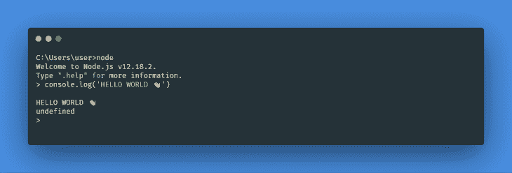
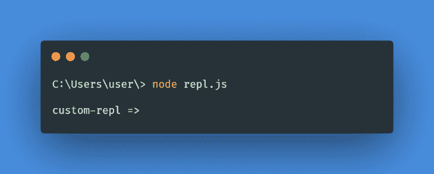

# 为 Node.js - LogRocket 博客创建自定义 REPL

> 原文：<https://blog.logrocket.com/creating-custom-repl-node-js/>

## 介绍

REPL(read-eval-print loop)是一个术语，指的是一种交互式计算机环境，它接收用户输入，执行输入，然后返回输出。即用户输入一个或多个表达式，对这些表达式进行评估，并显示结果。

事实是，作为一名开发人员，您可能以前使用过 REPL 环境，但不知道它叫什么。REPL 的常见例子包括:

*   CLI/终端
*   外壳环境(例如，Python 外壳、MySQL 外壳)
*   浏览器开发工具控制台

在本文中，我们将学习 REPL 如何在内部工作，如何使用 Node.js 内置的 REPL，以及如何在 Node.js 中设置一个定制的 REPL 环境

## REPL 是如何运作的

REPL 的工作原理非常简单。首先，它读取用户输入的一段或一组代码，然后评估这段代码。在评估过程完成之后，结果输出被打印给用户，并且这个过程被重复(循环)直到用户发出退出信号。


## REPL 节点

Node.js 捆绑了一个 REPL 环境，允许您快速测试和探索 JavaScript 代码，而不必将其存储在文件中。

在运行之前，您需要在开发机器上安装 Node.js 您可以按照这里的说明来[安装 Node.js。](https://nodejs.org/en/)

如果已经安装了 Node.js，则不需要安装任何其他软件，并且可以通过在终端中输入以下命令来启动 REPL 环境:

```
node

```

根据您安装的节点版本，您应该会看到类似下面的输出:



控制台中显示的 **`>`** 符号表示 REPL 现在是活动的，您可以输入任何 JavaScript 代码来立即进行评估。

让我们通过使用全局`console.log`方法打印“Hello world”来尝试一下。在节点 REPL 中输入以下代码:

```
console.log("Hello World 👋");

```

您应该会看到以下输出:


## 在 Node.js 中创建自定义 REPL

Node.js 还允许开发者通过 [`repl`模块](https://nodejs.org/api/repl.html)创建和使用自定义 REPL。这是用于创建 Node.js 附带的默认 REPL 的同一个包，因此它确实提供了我们可能需要的所有可定制选项。

此外，这是一个内置模块。也就是说，我们可以使用它而无需任何进一步的安装。

要在我们的程序中导入模块:

```
const repl = require('repl');

```

### 开始一个 REPL

我们可以用`repl.start()`方法创建一个新的 repl 实例。这个方法接受两个参数——第一个是用于 REPL 提示的字符串(默认为 **`>`** )，第二个是 REPL 监听的流(用户输入)。

为了进行试验，创建一个新文件(`app.js`)，并粘贴以下代码:

```
const repl = require("repl");
repl.start("custom-repl => ");

```

保存文件，并从您的 [CLI](https://blog.logrocket.com/creating-a-cli-tool-with-node-js/) 中运行代码:

```
node app.js

```

您应该会看到以下输出:



是的，这与默认节点 REPL 的工作方式相同。您可以尝试在您的 REPL 中输入基本的 JavaScript 代码——比如`console.log("Hello world")`——您应该会看到显示的输出。

### 全球和本地范围

默认情况下，新的 REPL 实例可以访问 Node.js 全局作用域中声明的所有变量，也可以通过显式地将局部变量赋给`context`对象来将局部变量暴露给 REPL:

```
const repl = require("repl");

/* this can be accessed directly from repl without exposing it to repl context */
global.globalVariable = "This can be accessed anywhere!";

const name = "John Doe";

// exposing local variable to repl context
repl.start("custom-repl => ").context.name = name;

```

另外，暴露于`repl`上下文的变量在默认情况下不是只读的，它们可以直接从 REPL 环境中修改。我们可以通过定义如下的上下文属性来改变这一点:

```
const repl = require("repl");
const name = "John Doe";

const r = repl.start("custom-repl => ");

Object.defineProperty(r.context, "name", {
  configurable: false,
  enumerable: true,
  value: name,
});

```

### 自定义评估函数

REPL 模块还允许您创建自定义评估函数；即当评估每个给定的输入行时要使用的函数。当您试图构建完全定制的 REPL 应用程序时，这可能会很方便。

下面是一个示例，它检查用户输入是偶数还是奇数，并根据输入打印相应的输出:

```
const repl = require("repl");

function isEven(uInput, context, filename, callback) {
  callback(null, uInput % 2 == 0 ? "Even number" : "odd number");
}

repl.start({ prompt: "custom-repl => ", eval: isEven });

```

### 定制 REPL 输出

我们还可以定制从我们的 REPL 返回的输出，方法是在创建一个新的`repl`实例时，为 **`writer`** 选项传递一个新的函数。

下面的代码将上一个示例返回的输出变成大写，并使用 npm [colors.js 模块](https://www.npmjs.com/package/colors)，它还将文本颜色改为红色:

```
const repl = require("repl");
const colors = require("colors");

const r = repl.start({ prompt: "custom-repl =>  ", eval: isEven, writer: modifyOutput });

function isEven(uInput, context, filename, callback) {
  callback(null, uInput % 2 == 0 ? "Even number" : "odd number");
}

function modifyOutput(output) {
  return output.toUpperCase().red;
}

```

这是输出的样子:


### 关闭 REPL

虽然您可以通过按下`Ctrl+C`键或直接输入`.exit`命令来停止 REPL 环境的运行，但是您也可以通过使用`repl.close()`方法以编程方式来实现这一点:

以下是五秒钟后自动关闭 REPL 的示例:

```
const repl = require("repl");

const r = repl.start("custom-repl => ");

setTimeout(() => {
  r.close();
}, 5000);

```

## 结论

REPL 是一个交互式计算机环境，它接受用户输入，执行它，并返回一个输出。如果您希望探索代码示例而不必将它们存储在文件中，REPL 也是文本编辑器的一个很好的替代选择。

在本文中，我们了解了 REPL 的内部工作方式，如何使用内置 REPL 环境中的节点，以及如何在 Node.js 中创建自定义 REPL

## 200 只显示器出现故障，生产中网络请求缓慢

部署基于节点的 web 应用程序或网站是容易的部分。确保您的节点实例继续为您的应用程序提供资源是事情变得更加困难的地方。如果您对确保对后端或第三方服务的请求成功感兴趣，

[try LogRocket](https://lp.logrocket.com/blg/node-signup)

.

[](https://lp.logrocket.com/blg/node-signup)[https://logrocket.com/signup/](https://lp.logrocket.com/blg/node-signup)

LogRocket 就像是网络和移动应用程序的 DVR，记录下用户与你的应用程序交互时发生的一切。您可以汇总并报告有问题的网络请求，以快速了解根本原因，而不是猜测问题发生的原因。

LogRocket 检测您的应用程序以记录基线性能计时，如页面加载时间、到达第一个字节的时间、慢速网络请求，还记录 Redux、NgRx 和 Vuex 操作/状态。

[Start monitoring for free](https://lp.logrocket.com/blg/node-signup)

.