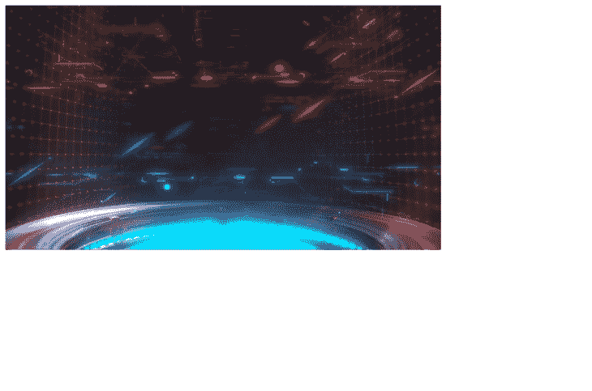

# 用 CSS 创建和定制 HTML5 视频播放器

> 原文：<https://blog.logrocket.com/creating-customizing-html5-video-player-css/>

HTML5 提供了用于呈现视频资源的默认视频播放器。然而，使用 CSS 我们可以调整和定制视频播放器的风格，以适应我们的口味或匹配我们的网站主题或风格。

在本文中，我将向您展示如何使用 CSS 定制 HTML5 视频播放器，以便您可以创建一个无缝融入下一个应用程序设计的视频播放器。

为了理解本文，除了对 DOM 操作和事件监听有一定的理解之外，您还应该掌握 HTML、CSS 和 JavaScript 的工作知识。

我还建议您使用最新版本的浏览器或 Chrome 浏览器，以获得最佳性能。

## 什么是 HTML5 视频播放器？

HTML5 视频播放器是一种 HTML5 流媒体技术，是作为 Adobe Flash Player 的一种更兼容的替代技术而创建的。它允许广播公司通过 HLS ( [HTTPS](https://en.wikipedia.org/wiki/HTTP_Live_Streaming) 直播流)协议在网络平台上流式传输视频资产，以从 cdn([内容交付网络](https://en.wikipedia.org/wiki/Content_delivery_network))获取内容。

所有主流浏览器和操作系统都支持 HTML5 视频播放器。

## 定制一个 HTML5 视频播放器是什么意思？

自定义 HTML5 视频播放器意味着根据您的喜好更改默认外观或样式。这是通过为呈现所选视频播放器的 DOM 元素编写新的样式表来实现的。

## 定制的 HTML5 视频播放器的使用案例和真实例子

你可以在 YouTube 上找到定制 HTML5 视频播放器的真实例子， [Cloudinary 视频播放器](https://demo.cloudinary.com/video-player/)、[jwp Player](https://www.jwplayer.com/)和 [Video JS](https://videojs.com/) 。这些网站或框架中的每一个都利用 CSS 的力量来定制他们的视频或允许他们的用户做同样的事情。

正如你所看到的，定制视频播放器有很多用例，尤其是在视频是主要功能的应用程序中(比如 YouTube)。通过下面的教程，你将学习如何创建自己的 HTML5 视频播放器，并将其定制为看起来像你的应用程序的一部分。

## 如何创建一个新的 HTML5 视频播放器

要创建一个新的 HTML5 视频播放器，我们需要创建一个新的项目文件夹。在文件夹中创建一个名为`index.html`的 HTML 文件。

在`index.html`文件中键入以下代码:

```
<!DOCTYPE html>
<html lang="en">
<body>
    <video src="https://res.cloudinary.com/codelife/video/upload/v1637805738/intro_l5ul1k.mp4"></video>
</body>
</html>

```

在上面的代码中，我们有一个 HTML 文档，文档体中有一个`video`标签。我们还传入了一个视频 url 作为源。

如果您在浏览器中预览此网页，您应该会看到以下内容:



在上图中，HTML5 视频播放器呈现了一个我们无法与之交互的视频，因为我们没有设置必要的参数来使视频播放器正常工作。

为了解决这个问题，让我们继续向`video`标签添加更多的属性。将 HTML 文档中的`video`标记替换为以下内容:

```
<video 
  src="https://res.cloudinary.com/codelife/video/upload/v1637805738/intro_l5ul1k.mp4" controls autoplay loop muted width="400px" height="300px" ></video>

```

在上面的代码中，我们添加了`controls`来显示视频播放器的默认控件。默认设置为`true`(这意味着`controls`与`controls="true"`相同)。它只接受`true`或`false`作为它的值。

`autoplay`用于决定视频加载后是否立即开始播放。每个新的视频元素都有一个默认的自动播放值`false`，直到您将`autoplay`作为属性包含进来。

`loop`用于决定视频结束时是否应该重新开始。每个新的视频元素都有一个默认的循环值`false`。

`muted`用于决定视频是否应该和音频一起播放。每个新的视频元素都有一个默认的静音值`false`。

最后，`width`和`height`设置视频的水平和垂直尺寸。

如果在浏览器中预览新代码，应该会看到以下内容:


# 自定义 HTML5 视频播放器

为了定制播放器，我们需要创建另外两个文件:`script.js`和`style.css`。

`Script.js`是为视频控件编写功能的地方，而`style.css`是为视频编写样式表的地方。我们可以把两个文件的内容写在`index.html`里面，但是那会使我们的代码冗长而混乱。

用下面的代码替换`index.html`的内容。这将是自定义前的视频结构:

```
<!DOCTYPE html>
<html lang="en">
<head>
    <link rel="stylesheet" href="style.css">
    <link rel="stylesheet" href="https://cdnjs.cloudflare.com/ajax/libs/font-awesome/6.0.0-beta3/css/all.min.css" integrity="sha512-Fo3rlrZj/k7ujTnHg4CGR2D7kSs0v4LLanw2qksYuRlEzO+tcaEPQogQ0KaoGN26/zrn20ImR1DfuLWnOo7aBA==" crossorigin="anonymous" referrerpolicy="no-referrer" />
</head>
<body>
    <div class="container">
        <video onclick="play(event)" src="https://res.cloudinary.com/codelife/video/upload/v1637805738/intro_l5ul1k.mp4" id="video"></video>
        <div class="controls">
            <button onclick="play(event)"><i class="fa fa-play"></i><i class="fa fa-pause"></i></button>
            <button onclick="rewind(event)"><i class="fa fa-fast-backward"></i></button>
            <div class="timeline">
                <div class="bar">
                    <div class="inner"></div>
                </div>
            </div>
            <button onclick="forward(event)"><i class="fa fa-fast-forward"></i></button>
            <button onclick="fullScreen(event)"><i class="fa fa-expand"></i></button>
            <button onclick="download(event)"><i class="fa fa-cloud-download"></i></button>
        </div>
    </div>
    <script src="script.js"></script>
</body>
</html>

```

在上面的代码中，我们包含了自定义样式表(`style.css`)和一个字体很棒的 CDN 链接。然后我们创建了一个容器 div，其中包含了视频和之前添加的所有控件。

在控件 div 中，我们有一个切换视频播放状态的按钮，还有一个反转和前进视频当前时间的按钮，一个全屏预览视频的按钮，一个将视频作为可下载文件打开的按钮，以及一个显示视频时间轴当前位置的 div。

接下来，我们编写样式表。使用样式表，我们可以通过使用选择器引用某些对象来改变视频播放器的默认样式，然后为我们想要定制的每个属性分配一个新的属性。

为此，在`style.css`文件中键入以下代码:

```
.container {
    position: relative;
    display: flex;
    width: max-content;
    height: max-content;
    justify-content: center;
    align-items: center;
}
.container #video {
    width: 600px;
    height: 400px;
    border-radius: 20px;
}
.container .controls {
    position: absolute;
    bottom: 40px;
    width: 100%;
    display: flex;
    justify-content: space-around;
    opacity: 0.2;
    transition: opacity 0.4s;
}
.container:hover .controls {
    opacity: 1;
}
.container .controls button {
    background: transparent;
    color: #fff;
    font-weight: bolder;
    text-shadow: 2px 1px 2px #000;
    border: none;
    cursor: pointer;
}
.container .controls .timeline {
    flex: 1;
    display: flex;
    align-items: center;
    border: none;
    border-right: 3px solid #ccc;
    border-left: 3px solid #ccc;
}
.container .controls .timeline .bar{
    background: rgb(1, 1, 65);
    height: 4px;
    flex: 1;
}
.container .controls .timeline .bar .inner{
    background: #ccc;
    width: 0%;
    height: 100%;
}
.fa {
    font-size: 20px !important;
}

```

在这个文件中，您会注意到容器的位置是`relative`。这是为了控制内部其他元素的位置。

我们用`controls`类设置 div 的位置为`position: absolute`和`bottom: 40px`。这将从视频容器的底部放置`controls` div 40px。我们还为图标指定了一个`!important`字体大小。

接下来，我们的视频播放器需要功能，比如播放、暂停和全屏按钮，加上用户下载、倒带和前进的能力。这些功能将使我们的视频播放器具有交互性。

在`script.js`中输入以下代码:

```
// Select the HTML5 video
const video = document.querySelector("#video")
// set the pause button to display:none by default
document.querySelector(".fa-pause").style.display = "none"
// update the progress bar
video.addEventListener("timeupdate", () => {
    let curr = (video.currentTime / video.duration) * 100
    if(video.ended){
        document.querySelector(".fa-play").style.display = "block"
        document.querySelector(".fa-pause").style.display = "none"
    }
    document.querySelector('.inner').style.width = `${curr}%`
})
// pause or play the video
const play = (e) => {
    // Condition when to play a video
    if(video.paused){
        document.querySelector(".fa-play").style.display = "none"
        document.querySelector(".fa-pause").style.display = "block"
        video.play()
    }
    else{
        document.querySelector(".fa-play").style.display = "block"
        document.querySelector(".fa-pause").style.display = "none"
        video.pause()
    }
}
// trigger fullscreen
const fullScreen = (e) => {
    e.preventDefault()
    video.requestFullscreen()
}
// download the video
const download = (e) => {
    e.preventDefault()
    let a = document.createElement('a')
    a.href = video.src 
    a.target = "_blank"
    a.download = ""
    document.body.appendChild(a)
    a.click()
    document.body.removeChild(a)
}
// rewind the current time
const rewind = (e) => {
    video.currentTime = video.currentTime - ((video.duration/100) * 5)
}
// forward the current time
const forward = (e) => {
    video.currentTime = video.currentTime + ((video.duration/100) * 5)
}

```

在上面的代码片段中，我们创建了一个常量`video`，用于在脚本文件的各种函数中标识视频。

默认情况下，`pause`图标被设置为`display: none`。然后，我们在视频上运行了一个事件监听器，以检查`timeupdate`。对于每次更新，我们使用以下公式将内部进度条的宽度更新为视频总持续时间的当前时间百分比:

```
let curr = (video.currentTime / video.duration) * 100

```

然后我们创建了一个名为`play`的函数，用于切换视频的播放状态，并决定显示哪些按钮。为此，我们编写了一些逻辑，如果当`video.paused`是`true`时点击播放按钮，我们隐藏暂停按钮，显示播放按钮，并播放视频，否则我们对每个项目进行相反的操作。

对于全屏功能，我们只需在视频元素上触发一个`requestFullscreen()`功能。在下载函数中，我们创建了一个新的`a`标签，并将视频 URL 指定为`href`属性。

接下来，我们将`target`设置为`_blank`,以便在新标签中打开可下载的视频。然后我们通过编程点击了使用`click()`函数创建的新链接。

我们还需要创建倒带或快进视频的功能。我们可以通过使用以下逻辑来做到这一点:

对于倒带:

```
video.currentTime = video.currentTime - ((video.duration/100) * 5)

```

对于转发:

```
video.currentTime = video.currentTime + ((video.duration/100) * 5)

```

如果我们一切都做对了，我们应该会有以下结果:


# 结论

在这篇文章中，我们已经了解了定制 HTML5 视频播放器的含义，以及如何使用 CSS 自己完成它。然而，你可以不断挑战自己，添加更多的功能，让你的视频更好地融入你自己的用户界面。

如果你有任何问题，欢迎在下面的评论区提出。

## 你的前端是否占用了用户的 CPU？

随着 web 前端变得越来越复杂，资源贪婪的特性对浏览器的要求越来越高。如果您对监控和跟踪生产环境中所有用户的客户端 CPU 使用、内存使用等感兴趣，

[try LogRocket](https://lp.logrocket.com/blg/css-signup)

.

[](https://lp.logrocket.com/blg/css-signup)[https://logrocket.com/signup/](https://lp.logrocket.com/blg/css-signup)

LogRocket 就像是网络和移动应用的 DVR，记录你的网络应用或网站上发生的一切。您可以汇总和报告关键的前端性能指标，重放用户会话和应用程序状态，记录网络请求，并自动显示所有错误，而不是猜测问题发生的原因。

现代化您调试 web 和移动应用的方式— [开始免费监控](https://lp.logrocket.com/blg/css-signup)。