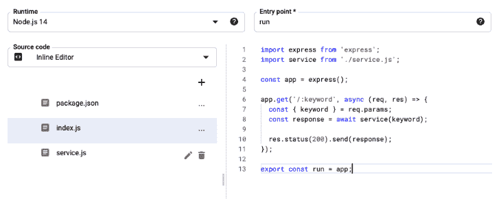
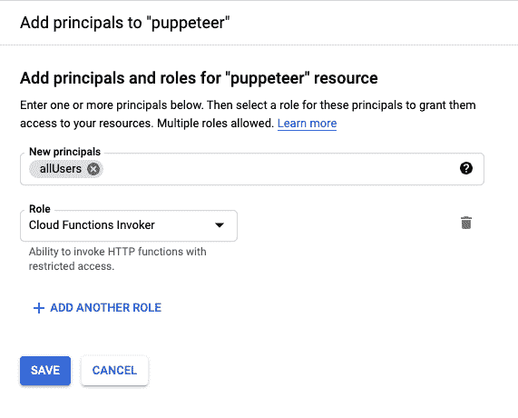

# 创建一个木偶师微服务部署到谷歌云功能

> 原文：<https://blog.logrocket.com/creating-puppeteer-microservice-deploy-google-cloud-functions/>

木偶师是一个无头 Chrome 的高级抽象，拥有丰富的 API。这使得自动化与网页的交互变得非常方便。

本文将带您浏览一个用例，我们将在 GitHub 上搜索一个关键字，并获取第一个结果的标题。

这是一个纯粹为了演示的基本例子，甚至没有木偶师也能做到。因为关键字可以位于 GitHub 页面的 URL 和页面列表中，所以您可以直接导航到结果。

但是，假设您在 web 页面上的交互没有反映在页面 URL 中，并且没有公共 API 来获取数据，那么通过 Puppeteer 实现自动化就很方便了。

## 设置木偶师和 Node.js

让我们在一个文件夹中初始化一个 Node.js 项目。在您的系统终端上，导航到您希望包含项目的文件夹，并运行以下命令:

```
npm init -y

```

这将生成一个`package.json`文件。接下来，安装木偶师 npm 包。

```
npm install --save puppeteer

```

现在，创建一个名为`service.mjs`的文件。这种文件格式允许我们使用 ES 模块，并通过使用 Puppeteer 来负责抓取页面。让我们用木偶师完成一个快速测试，看看它是否有效。

首先，我们启动一个 Chrome 实例，并传递`headless: false`参数来显示它，而不是在没有 GUI 的情况下无头运行它。现在使用`newPage`方法创建一个页面，并使用`goto`方法导航到作为参数传递的网址:

```
import puppeteer from 'puppeteer';

const browser = await puppeteer.launch({
  headless: false
});

const page = await browser.newPage();
await page.goto('https://www.github.com');

```

当您运行这段代码时，应该会弹出一个 Chrome 窗口，并在一个新的选项卡中导航到该 URL。

## 使用木偶师自动化

为了让 Puppeteer 与页面交互，我们需要手动检查页面并指定目标 DOM 元素。

我们需要确定选择器，即类名、id、元素类型或其中几个的组合。如果我们需要高水平的特异性，我们可以将这些选择器与各种木偶方法一起使用。

现在，让我们用浏览器检查一下[www.github.com](https://www.github.com)。我们需要能够将焦点放在页面顶部的搜索输入字段，然后键入我们想要搜索的关键字。然后我们需要 Git 键盘上的`Enter`按钮。

在你喜欢的浏览器上打开[www.github.com](https://www.github.com)——我用 Chrome，但任何浏览器都可以——在页面上点击右键，然后点击**检查**。然后，在**元素**标签下，你可以看到 DOM 树。使用检查窗格左上角的检查工具，您可以单击元素以在 DOM 树中突出显示它们:


我们感兴趣的输入字段元素有几个类名，但只针对`.header-search-input`就足够了。为了确保我们引用了正确的元素，我们可以在浏览器控制台上快速测试它。点击**控制台**选项卡，对`Document`对象使用`querySelector`方法:

```
document.querySelector('.header-search-input')

```

如果这返回了正确的元素，那么我们知道它将与木偶师一起工作。

注意，可能有几个元素匹配同一个选择器。在这种情况下，`querySelector`返回第一个匹配的元素。要引用正确的元素，您需要使用`querySelectorAll`，然后从返回的元素的`NodeList`中选择正确的索引。

这里有一点要注意。如果您调整 GitHub 网页的大小，输入栏将变得不可见，并在汉堡菜单中可用。

因为它是不可见的，除非汉堡包的菜单是打开的，我们不能关注它。为了确保输入字段可见，我们可以通过将`defaultViewport`对象传递给设置来显式设置浏览器窗口的大小。

```
const browser = await puppeteer.launch({
  headless: false,
  defaultViewport: {
    width: 1920,
    height: 1080
  }
});

```

现在是时候使用查询来定位元素了。在尝试与元素交互之前，我们必须确保它已经呈现在页面上并准备好了。木偶戏就是因为这个原因才有了`waitForSelector`的方法。

它将选择器字符串作为第一个参数，将 options 对象作为第二个参数。因为我们要与元素交互，即聚焦，然后在输入字段中输入，我们需要让它在页面上可见，因此有了`visible: true`选项。

```
const inputField = '.header-search-input';
await page.waitForSelector(inputField, { visible: true });

```

如前所述，我们需要关注输入字段元素，然后模拟输入。出于这些目的，木偶师有以下方法:

```
const keyword = 'react';

await page.focus(inputField);
await page.keyboard.type(keyword);

```

到目前为止`service.mjs`看起来如下:

```
import puppeteer from 'puppeteer';

const browser = await puppeteer.launch({
  headless: false,
  defaultViewport: {
    width: 1920,
    height: 1080
  }
});

const page = await browser.newPage();
await page.goto('https://www.github.com');

const inputField = '.header-search-input';
const keyword = 'react'

await page.waitForSelector(inputField);
await page.focus(inputField);
await page.keyboard.type(keyword);

```

当您运行代码时，您应该看到搜索字段被聚焦，并且键入了关键字`react`。

现在，模拟键盘上的`Enter`按键。

```
await page.keyboard.press('Enter');

```

在我们按下 **Enter** 键后，Chrome 将导航到一个新的页面。如果我们手动搜索一个关键字并检查我们被导航到的页面，我们会发现我们感兴趣的元素的选择器是`.repo-list`。

此时，我们需要确保导航到新页面是完整的。为此，有一个`page.waitForNavigation`方法。导航之后，我们再次需要使用`page.waitForSelector`方法等待元素。

* * *

### 更多来自 LogRocket 的精彩文章:

* * *

然而，如果我们只对从元素中抓取一些数据感兴趣，我们不需要等到它在视觉上可见。所以，这一次，我们可以省略`{ visible: true }`选项，默认设置为`false`。

```
const repoList = '.repo-list';

await page.waitForNavigation();
await page.waitForSelector(repoList);

```

一旦我们知道了`.repo-list`选择器在 DOM 树中，那么我们就可以通过使用`page.evaluate`方法来抓取标题。

首先，我们通过将`repoList`变量传递给`querySelector`来选择`.repo-list`。然后我们级联`querySelectorAll`来获得所有的`li`元素，并从元素的`NodeList`中选择第一个元素。

最后，我们添加了另一个针对`.f4.text-normal`查询的`querySelector`，它的标题是我们通过`innerText`访问的。

```
const title = await page.evaluate((repoList) => (
  document
    .querySelector(repoList)
    .querySelectorAll('li')[0]
    .querySelector('.f4.text-normal')
    .innerText
), repoList);

```

现在，我们可以将所有内容包装在一个函数中，并将其导出到另一个文件中使用，在该文件中，我们将设置带有端点的 Express 服务器来提供数据。

`service.mjs`的最终版本返回一个异步函数，该函数将关键字作为输入。在函数内部，我们使用一个`try…catch`块来捕捉并返回任何错误。最后，我们调用`browser.close`来关闭我们已经启动的浏览器。

```
import puppeteer from 'puppeteer';

const service = async (keyword) => {
  const browser = await puppeteer.launch({
    headless: true,
    defaultViewport: {
      width: 1920,
      height: 1080
    }
  });

  const inputField = '.header-search-input';
  const repoList = '.repo-list';

  try {
    const page = await browser.newPage();
    await page.goto('https://www.github.com');

    await page.waitForSelector(inputField);
    await page.focus(inputField);
    await page.keyboard.type(keyword);

    await page.keyboard.press('Enter');

    await page.waitForNavigation();
    await page.waitForSelector(repoList);

    const title = await page.evaluate((repoList) => (
      document
        .querySelector(repoList)
        .querySelectorAll('li')[0]
        .querySelector('.f4.text-normal')
        .innerText
    ), repoList);

    await browser.close();
    return title;
  } catch (e) {
    throw e;
  }
}

export default service;

```

## 创建 Express 服务器

我们需要一个端点来提供数据，在这里我们捕获要搜索的关键字作为路由参数。因为我们将路由路径定义为`/:keyword`，所以它在`req.params`对象中用`keyword`的键暴露出来。接下来，我们调用`service`函数并传递这个关键字作为输入参数来运行 Puppeteer。

`server.mjs`的内容如下:

```
import express from 'express';
import service from './service.mjs';

const app = express();
app.listen(5000);

app.get('/:keyword', async (req, res) => {
  const { keyword } = req.params;
  try {
    const response = await service(keyword);
    res.status(200).send(response);
  } catch (e) {
    res.status(500).send(e);
  }
});

```

在终端中，运行`node server.mjs`启动服务器。在另一个终端窗口中，使用`curl`向端点发送请求。这将从条目标题中返回字符串值。

```
curl localhost:5000/react

```

请注意，该服务器是最低要求。在生产中，您应该保护您的端点并设置 CORS，以防您需要从浏览器而不是服务器发送请求。

## 部署到 Google 云功能

现在，我们将把这个服务部署到一个无服务器的云功能中。云功能和服务器之间的主要区别在于，云功能可以根据请求快速调用，并保持一段时间以响应后续请求，而服务器始终处于运行状态。

部署到[谷歌云功能](https://developers.google.com/learn/topics/functions)非常简单。但是，为了成功运行 Puppeteer，您应该了解一些设置。

首先，给你的云功能分配足够的内存。根据我的测试，512MB 对于木偶师来说已经足够了，但是如果你遇到了与内存相关的问题，请分配更多的内存。

`package.json`内容应该如下:

```
{
  "name": "puppeteer-example",
  "version": "0.0.1",
  "type": "module",
  "dependencies": {
    "puppeteer": "^10.2.0",
    "express": "^4.17.1"
  }
}

```

我们添加了`puppeteer`和`express`作为依赖项，并设置了“type”:“module”以便使用 ES6 语法。

现在创建一个名为`service.js`的文件，并用我们在`service.mjs`中使用的相同内容填充它。

`index.js`的内容如下:

```
import express from 'express';
import service from './service.js';

const app = express();

app.get('/:keyword', async (req, res) => {
  const { keyword } = req.params;
  try {
    const response = await service(keyword);
    res.status(200).send(response);
  } catch (e) {
    res.status(500).send(e);
  }
});

export const run = app;

```

这里，我们从`server.js`导入了`express`包和我们的函数。

与我们在本地主机上测试的服务器代码不同，我们不需要监听端口，因为这是自动处理的。

而且，与本地主机不同，我们需要在云函数中导出`app`对象。将**入口点**设置为`run`或您正在导出的任何变量名，如下所示。默认设置为`helloWorld`。



为了方便测试我们的云功能，我们将其公开。选择**云功能** ( *注:旁边有复选框*)，点击顶部栏菜单中的**权限**按钮。这将显示一个侧面板，您可以在其中添加主体。点击**添加负责人**，在**新负责人**字段中搜索`allUsers`。最后，选择`Cloud Function Invoker`作为**角色**。

注意，一旦添加了这个主体，任何拥有触发器链接的人都可以调用这个函数。对于测试来说，这很好，但是要确保为您的云功能实现身份验证，以避免不希望的调用，这将反映在账单中。



现在单击您的函数来查看函数的详细信息。导航到**触发器**选项卡，在这里您将找到触发器 URL。单击此链接调用函数，该函数返回列表中第一个存储库的标题。现在，您可以在应用程序中使用该链接来获取数据。

## 结论

我们已经介绍了如何使用 Puppeteer 来自动化与网页的基本交互，并抓取内容以在节点服务器上使用 Express framework 提供服务。然后，我们将它部署在 Google Cloud Functions 上，以使它成为一个微服务，然后可以集成到另一个应用程序中使用。