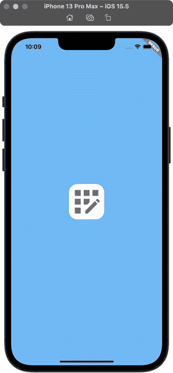

# 在 Flutter 中创建反应式表单

> 原文：<https://blog.logrocket.com/creating-reactive-forms-flutter/>

几乎在你开发的每一个应用程序中，迟早会出现捕捉用户输入的需求。幸运的是，在 Flutter 中捕获文本输入相当简单。但是，随着更多的字段和输入类型被添加到表单中，获取这些信息的复杂性会迅速增加。

通常，这些输入字段，无论是文本字段、日期字段还是任何其他类型的输入，都被称为“控件”验证也可能成为一个问题，因为即使是对某些字段的简单验证也可能需要编写冗长的自定义验证器。

在本文中，我们将创建一个带有输入验证和根据其他字段的值而变化的字段的注册表单。我们将首先在不使用反应式表单的情况下实现这一点，然后使用反应式表单重新实现相同的表单，以理解反应式表单在 Flutter 中的好处。

我们将涵盖的内容:

## 颤振反应形式项目概述

我们将创建的应用程序是一个为宠物注册“宠物酒店”的应用程序，宠物酒店是人们度假时可以放下宠物的地方。

为了让这个应用程序工作，人们需要提供详细信息，如他们的姓名和电话号码，他们有什么样的宠物，以及他们的宠物的喜欢和不喜欢。最终结果将如下所示:



这种形式有一些要求。

首先，三个后续问题必须根据用户选择的宠物类型而改变。

接下来，这三个问题的答案是必需的，因此我们必须添加 [Flutter 表单验证逻辑](https://blog.logrocket.com/flutter-form-validation-complete-guide/)以确保它们被填写。

最后，电话号码必须只包含数字，所以如果它包含非数字值，那么表单应该拒绝输入并通知用户。

## 使没有反应形式的形式在颤动

在第一种方法中，我们自己手动创建表单，我们还希望捕获这些单独字段中的文本输入。

因此，我们负责创建可以关联到`TextFormField`小部件的单个`TextControllers`。我们还负责创建一个变量来存放选中的宠物。

现在让我们创建这些变量:

```
final _formKey = GlobalKey<FormState>();
PetType? _petType;
final firstName = TextEditingController();
final lastName = TextEditingController();
final questionResponses = List.generate(3, (index) => TextEditingController());

```

为了将文本写入这些字段，我们将创建`TextFormField`小部件并将它们绑定到适当的控制器:

```
TextFormField(
  decoration: InputDecoration(hintText: 'First Name'),
  controller: firstName,
),
TextFormField(
  decoration: InputDecoration(hintText: 'Last Name'),
  controller: lastName,
),

```

电话号码输入字段略有不同，因为我们需要验证它是否包含有效的电话号码，并在检测到无效输入时提示用户:

```
TextFormField(
  decoration: InputDecoration(hintText: 'Phone number'),
  autovalidateMode: AutovalidateMode.always,
  validator: (val) {
    if (val == null || val == "") {
      return 'Please enter a phone number';
    }
    if (int.tryParse(val) == null) {
      return 'Only enter numbers in the phone number field';
    }
    return null;
  },
),

```

接下来，我们指定宠物选择器。这是一个`RadioListTile`按钮，让用户选择他们要带的宠物种类:猫、狗或鼹鼠。

当用户选择一种类型的宠物时，我们还希望遍历之前对这些问题给出的答案并清除它们，以便一次只选择一个选项。

```
RadioListTile<PetType>(
  value: PetType.cat,
  groupValue: _petType,
  onChanged: (val) => setState(() {
    for (final controller in questionResponses) {
      controller.clear();
    }
    _petType = val;
  }),
  title: Text('Cat'),
),

```

最后，我们想改变我们根据选择的宠物类型提出的问题。

我们可以通过使用一个`Builder`来实现，它将根据给定变量的值来更新窗口小部件树。因此，如果选择的动物类型是“猫”，表单将显示该动物类型的问题，对于狗或鼹鼠类型的动物也是如此。

```
Builder(
  builder: (context) {
    switch (_petType) {
      case PetType.cat:
        return Column(
          children: [
            Text("Aw, it's a cat!"),
            PetQuestionField(question: 'Can we pat the cat?', controller: questionResponses[0]),
            PetQuestionField(question: 'Can we put a little outfit on it?', controller: questionResponses[1]),
            PetQuestionField(question: 'Does it like to jump in boxes?', controller: questionResponses[2]),
          ],
        );

      case PetType.dog:
        return Column(
          children: [
            Text("Yay, a puppy! What's its details?"),
            PetQuestionField(question: 'Can we wash your dog?', controller: questionResponses[0]),
            PetQuestionField(question: 'What is your dog\'s favourite treat?', controller: questionResponses[1]),
            PetQuestionField(question: 'Is your dog okay with other dog\'s?', controller: questionResponses[2]),
          ],
        );

      case PetType.echidna:
        return Column(
          children: [
            Text("It's a small spiky boi. Can you fill us in on some of the details?"),
            PetQuestionField(question: 'How spikey is the echidna?', controller: questionResponses[0]),
            PetQuestionField(question: 'Can we read the echidna a story?', controller: questionResponses[1]),
            PetQuestionField(question: 'Does it like leafy greens?', controller: questionResponses[2]),
          ],
        );
      case null:
        {
          return Text('Please choose your pet type from above');
        }
    }
  },
),

```

创建了单个表单控件后，就该为用户创建一个按钮来注册他们的宠物了。该按钮应该只允许用户在所提供的输入有效的情况下继续操作，并且应该提示用户纠正任何无法验证的输入。

```
ElevatedButton(
    onPressed: () {
      // Form is valid if the form controls are reporting that 
      // they are valid, and a pet type has been specified.
      final valid = (_formKey.currentState?.validate() ?? false) && _petType != null;
      if (!valid) {
      // If it's not valid, prompt the user to fix the form
        showDialog(
            context: context,
            builder: (context) => SimpleDialog(
                  contentPadding: EdgeInsets.all(20),
                  title: Text('Please check the form'),
                  children: [Text('Some details are missing or incorrect. Please check the details and try again.')],
                ));
      } else {
      // If it is valid, show the received values
        showDialog(
          context: context,
          builder: (context) => SimpleDialog(
            contentPadding: EdgeInsets.all(20),
            title: Text("All done!"),
            children: [
              Text(
                "Thanks for all the details! We're going to check your pet in with the following details.",
                style: Theme.of(context).textTheme.caption,
              ),
              Card(
                child: Column(
                  children: [
                    Text('First name: ${firstName.text}'),
                    Text('Last name: ${lastName.text}\r\n'),
                    Text('Pet type: ${_petType}'),
                    Text('Response 1: ${questionResponses[0].text}'),
                    Text('Response 2: ${questionResponses[1].text}'),
                    Text('Response 3: ${questionResponses[2].text}'),
                  ],
                ),
              )
            ],
          ),
        );
      }
    },
    child: Text('REGISTER'))

```

## 在 Flutter 中手动创建表单的问题

在 Flutter 中使用表单并不难，但是手工制作我们自己的表单可能会有点费力。我们来分解一下为什么会这样。

首先，如果您希望能够从一个字段中获取文本或者清除该字段的输入，您必须为每个字段创建自己的`TextEditingController`。很容易理解你是如何得到这些东西的，你必须自己跟踪它们。

其次，您必须为简单的事情编写自己的验证逻辑，比如检查数字是否正确。

最后，这种方法会产生大量样板代码。对于一两个文本字段来说，这还不算太糟，但是很容易看出它的伸缩性有多差。

* * *

### 更多来自 LogRocket 的精彩文章:

* * *

## 要考虑的两种反应式颤振封装方案

如果我们开始寻找一个能让这个过程变得更容易的包，并且我们头脑中有“反应形式”，我们可能会很快遇到`[reactive_forms](https://pub.dev/packages/reactive_forms)` [Flutter 包](https://pub.dev/packages/reactive_forms)。然而，我不会用它来在我的应用程序中创建反应式表单。

为什么不呢？

嗯，pub.dev 上的第一句话告诉我们，反应式表单是“…一种模型驱动的处理表单输入和验证的方法，很大程度上受到了 [Angular 的反应式表单](https://angular.io/guide/reactive-forms)的启发。”

因此，我们可以确定在`reactive_forms`包中使用的心态与我们在 Angular 中发现的心态相似。

如果我们已经知道了 Angular，这可能是使用`reactive_forms`的更多理由。但是，如果我们不知道角度，我们更感兴趣的是在我们的形式中实现反应的最简单的方式。

根据我的经验，我发现使用包`flutter_form_builder`是一种更容易、更可扩展的创建表单的方式。

当然，我鼓励您研究这两个软件包，并选择您喜欢的那个，因为一个软件包不一定比另一个“更好”，但它们确实代表了实现类似结果的两种不同方式。

## 使用`flutter_form_builder`创建反应式表单

现在让我们使用包`flutter_form_builder`来创建我们的表单。这可以减少我们必须编写的代码量，使理解我们编写的代码变得更容易，也使我们不必编写自己的验证逻辑。

首先，我们将向我们的`pubspec.yaml`文件中的`flutter_form_builder`包添加一个依赖项:

```
flutter_form_builder: ^7.4.0

```

设置好之后，让我们重新实现表单以利用`flutter_form_builder`。

我们需要为我们打算在表单中使用的字段添加一些名称。我们应该将它们设置为一个对我们来说符合逻辑的变量名，因为我们稍后需要将我们的`FormBuilderTextField`绑定到它们。

```
final String FIRST_NAME = 'FirstName';
final String LAST_NAME = 'LastName';
final String PHONE_NUMBER = 'PhoneNumber';
final String PET_CHOICE = 'PetChoice';
final String QUESTION_ANSWER_1 = 'QuestionAnswer1';
final String QUESTION_ANSWER_2 = 'QuestionAnswer2';
final String QUESTION_ANSWER_3 = 'QuestionAnswer3';

```

我们还需要指定一个`GlobalKey<FormBuilderState>`，来存储表单捕获的细节。

```
final _fbKey = GlobalKey<FormBuilderState>();

```

下一个大的变化是我们的表单不再包装在一个`Form`中，而是包装在一个`FormBuilder`中，并为`FormBuilder`指定一个键。

```
FormBuilder(
  key: _fbKey,
  child: Column(children: [...children widgets here])
)

```

这意味着`FormBuilder`将把表单中的值存储在这个键中，所以我们以后可以很容易地检索它们。

### 设置基本表单输入

通常，我们会负责手动[指定应该使用什么](https://blog.logrocket.com/the-ultimate-guide-to-text-fields-in-flutter/)`[TextEditingController](https://blog.logrocket.com/the-ultimate-guide-to-text-fields-in-flutter/)`，以及手动设置验证之类的事情。但是有了`flutter_form_builder`，这两件事就变得微不足道了。

对于一个文本输入字段，我们指定字段的`name`参数，如果我们想要标记字段，还要指定修饰。我们也可以从现有的一组验证器中选择，而不是自己编写。这意味着我们的名字和姓氏输入字段如下所示:

```
FormBuilderTextField(
  name: FIRST_NAME,
  decoration: InputDecoration(labelText: 'First Name'),
  validator: FormBuilderValidators.required(),
),

```

对于我们的电话号码字段，不用编写我们自己的验证器，我们只需利用`FormBuilderValidators.numeric()`验证器:

```
FormBuilderTextField(
  name: PHONE_NUMBER,
  validator: FormBuilderValidators.numeric(),
  decoration: InputDecoration(labelText: 'Phone number'),
  autovalidateMode: AutovalidateMode.always,
),

```

### 设置宠物类型选择器

现在，我们希望通过选择我们的 Flutter 应用程序中适当的[单选按钮，为用户提供一个宠物类型选项列表。我们可以通过编程从我们提供的枚举集生成这个列表。](https://blog.logrocket.com/create-and-customize-flutter-radio-buttons/)

这意味着，如果我们在程序中从枚举中添加或删除选项，选项也会在表单中改变。这将比我们自己手动维护列表更容易。

```
FormBuilderRadioGroup<PetType>(
  onChanged: (val) {
    print(val);
    setState(() {
      _petType = val;
    });
  },
  name: PET_CHOICE,
  validator: FormBuilderValidators.required(),
  orientation: OptionsOrientation.vertical, // Lay out the options vertically
  options: [
    // Retrieve all options from the PetType enum and show them as options
    // Capitalize the first letters of the options as well
    ...PetType.values.map(
      (e) => FormBuilderFieldOption(
        value: e,
        child: Text(
          describeEnum(e).replaceFirst(
            describeEnum(e)[0],
            describeEnum(e)[0].toUpperCase(),
          ),
        ),
      ),
    ),
  ],
),

```

### 最后设置三个问题

我们的构建器方法在很大程度上与我们的 Flutter 表单的这一部分是相同的，有几个重要的区别:我们现在使用`FormBuilderTextField`类作为我们的输入，并且我们通过`name`参数将它们关联到表单中适当的条目。

```
case PetType.cat:
  return Column(
    children: [
      Text("Aw, it's a cat!"),
      FormBuilderTextField(
        name: QUESTION_ANSWER_1,
        decoration: InputDecoration(labelText: 'Can we pat the cat?'),
      ),
      FormBuilderTextField(
        name: QUESTION_ANSWER_2,
        decoration: InputDecoration(labelText: 'Can we put a little outfit on it?'),
      ),
      FormBuilderTextField(
        name: QUESTION_ANSWER_3,
        decoration: InputDecoration(labelText: 'Does it like to jump in boxes?'),
      ),
    ],
  );

```

## 从表单中验证和检索值

设置好反应性颤动表单后，我们现在需要做最后两件事:验证表单中有可用的数据，并从表单中检索这些值。

幸运的是，因为我们已经在每个字段中设置了验证要求，所以我们的验证变得非常简单:

```
final valid = _fbKey.currentState?.saveAndValidate() ?? false;

```

该操作的结果是，如果我们的表单的当前状态不是`null`，并且它当前被认为是`valid`——也就是说，所有的表单字段都通过了验证——那么，该表单被认为是有效的。如果`currentState`是`null`，或者表格是`invalid`，这个变量将返回`false`。

如果结果成功，这些值将显示给用户。通过访问`_fbKey`对象中的`currentState`对象，我们可以很容易地访问表单中的值。

```
showDialog(
  context: context,
  builder: (context) => SimpleDialog(
    contentPadding: EdgeInsets.all(20),
    title: Text("All done!"),
    children: [
      Text(
        "Thanks for all the details! We're going to check your pet in with the following details.",
        style: Theme.of(context).textTheme.caption,
      ),
      Card(
        child: Column(
          children: [
            // It's okay to use the ! operator with currentState, because we
            // already checked that it wasn't null when we did the form
            // validation
            Text('First name: ${_fbKey.currentState!.value[FIRST_NAME]}'),
            Text('Last name: ${_fbKey.currentState!.value[LAST_NAME]}'),
            Text('Number: ${_fbKey.currentState!.value[PHONE_NUMBER]}'),
            Text('Pet type: ${_fbKey.currentState!.value[PET_CHOICE]}'),
            Text('Response 1: ${_fbKey.currentState!.value[QUESTION_ANSWER_1]}'),
            Text('Response 2: ${_fbKey.currentState!.value[QUESTION_ANSWER_2]}'),
            Text('Response 3: ${_fbKey.currentState!.value[QUESTION_ANSWER_3]}'),
          ],
        ),
      )
    ],
  ),
);

```

## 包扎

正如我们所见，使用`flutter_form_builder`在 Flutter 中创建反应式表单可以为我们这些开发人员带来许多改进。和往常一样，你可以[在 Github](https://github.com/flutterfromscratch/flutter-reactive-forms) 中浏览这个项目的代码，看看如何在你的项目中使用`flutter_form_builder`。

您还可以使用下面的链接来比较两次提交，以查看项目究竟是如何变化的:

有相当多不同类型的字段是`flutter_form_builder`提供的，所以你应该总是能够根据你的需要使用正确的字段类型。

玩得开心，享受构建这些表单的过程吧！

## 使用 [LogRocket](https://lp.logrocket.com/blg/signup) 消除传统错误报告的干扰

[](https://lp.logrocket.com/blg/signup)

[LogRocket](https://lp.logrocket.com/blg/signup) 是一个数字体验分析解决方案，它可以保护您免受数百个假阳性错误警报的影响，只针对几个真正重要的项目。LogRocket 会告诉您应用程序中实际影响用户的最具影响力的 bug 和 UX 问题。

然后，使用具有深层技术遥测的会话重放来确切地查看用户看到了什么以及是什么导致了问题，就像你在他们身后看一样。

LogRocket 自动聚合客户端错误、JS 异常、前端性能指标和用户交互。然后 LogRocket 使用机器学习来告诉你哪些问题正在影响大多数用户，并提供你需要修复它的上下文。

关注重要的 bug—[今天就试试 LogRocket】。](https://lp.logrocket.com/blg/signup-issue-free)