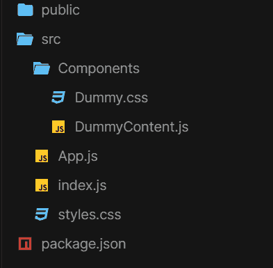
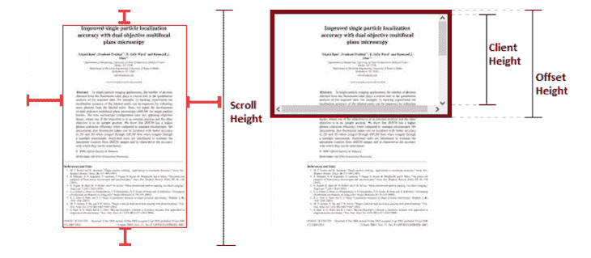

# 用 React 创建阅读进度条

> 原文：<https://blog.logrocket.com/creating-reading-progress-bar-react/>

阅读进度条在博客和在线社交阅读平台中相当常见，比如 Wattpad。进度条让读者知道他们已经读了多少，增加了整体用户体验，让读者着迷。

好消息是，这是一个非常简单的功能，可以添加到您的网站或博客。在本文中，我们将在 React 中创建一个阅读进度条。可以看到最终应用的现场[演示。我们开始吧！](https://i0k8e8.csb.app/)

### 目录

## 创建新的 React 应用程序

首先，我们需要为我们的项目创建一个新的 React 应用程序。使用以下命令从头开始创建 React 应用程序:

```
npx create-react-app my-app
cd my-app
npm start

```

接下来，删除`App.js`文件中的所有内容，使其为空。我们将在`App.js`中添加所有组件。

## 创建虚拟博客帖子

因为我们的主要目标是创建一个阅读进度条，而不是一个博客，我们将使用现有的模板创建一个虚拟的博客帖子。我正在使用一个免费的博客模板，名为[哲学](https://media.themeslab.org/preview/html/philosophy/single-standard.html)，这是我在网上找到的，然而，你可以使用任何模板或虚拟内容。

通过下面的步骤，我们将创建一个虚拟的`content`组件，并将其导入到我们的`App.js`文件中:

1.  在您的`Src`文件夹中创建一个`Components`文件夹
2.  在这个文件夹中创建一个名为`DummyContent.js`的新文件
3.  接下来，在`DummyContent.js`中添加博客文章的 HTML
4.  在`DummyContent.js`中，创建一个名为`Dummy.css`的新 CSS 文件，它将包含博客文章的样式

您的目录应该类似于下图:



现在，在您的`App.js`文件中导入并渲染`DummyContent.js`文件。现在，您有了一个简单的博客布局，您的`App.js`文件将类似于下面的代码:

```
import React from "react";
import DummyContent from "./Components/DummyContent";
function App() {
  return (
    <div className="main">
      <DummyContent />
    </div>
  );
}
export default App;

```

## 创建阅读进度条

对于我们的主要目标，我们首先需要创建阅读栏组件。在同一个`Components`文件夹中，创建名为`ReadingBar.js`的新文件。通过键入`rfce`，在 VS 代码中添加基本标记。

## 样式组件

为了创建阅读进度条的样式，我们将使用样式化组件轻松地在 JavaScript 中添加 CSS。我们将创建一个名为`Bar`的`styled.div`，它将包含我们的阅读栏的样式。

确保在我们的主`ReadingBar`函数之外创建`Bar`。通过在 React 组件的 render 方法中声明 styled-component，将在每次渲染时创建一个新组件，从而导致性能问题和不可预测的行为:

```
import { React } from "react";
import styled from "styled-components";
// Bar Styled Component
const Bar = styled.div`
  position: fixed;
  height: 6px;
  border-radius: 0px 2px 0px 0px;
  background: linear-gradient(
    90deg,
    rgba(109, 227, 219, 1) 0%,
    rgba(132, 115, 177, 1) 100%,
    rgba(3, 9, 112, 1) 100%
  );
`;
function ReadingBar() {
  return <Bar style={{ width: "0%" }}></Bar>;
}
export default ReadingBar;

```

正如你在上面看到的，样式非常简单。酒吧是固定在顶部，我们还增加了背景颜色渐变。在`return`函数中，`width`作为一个样式。它目前被设置为`0%`，但是我们稍后会用一个州来替换它。

计算精确的滚动百分比有时会很棘手。这是大多数开发人员陷入困境的地方。

在大多数情况下，精确的百分比并不重要，比如粘性标题和滚动到顶部按钮。然而，在我们的例子中，我们需要使用精确的滚动条滚动百分比。即使是一点点不准确也会导致进度条要么过早完成，要么最后没有完成。

幸运的是，我们有一个简单的方法来解决这个问题:

```
var el = document.documentElement,
  ScrollTop = el.scrollTop || document.body.scrollTop,
  ScrollHeight = el.scrollHeight || document.body.scrollHeight;
var percent = (ScrollTop / (ScrollHeight - el.clientHeight)) * 100;

```

`document.documentElement`返回文档的根元素。我们在这里使用这个元素是因为我们想看看`page`还剩多少可以滚动。

`Scroll top`是在元素内容中垂直滚动的像素数。`Scroll Height`是元素内容高度的完整度量，也包括因溢出而在屏幕上不可见的内容。最后，`Client Height`是一个元素的内部高度，在我们的例子中是`page`。

为了计算百分比，我们将`Scroll top`除以剩余的滚动量。要计算还剩多少可以滚动，用可见的`Height`减去完整的`Scroll Height`:



如你所见，`Scroll Height`是元素的完整高度，甚至是由于溢出而不可见的部分。`Client Height`为内部高度。因此，我们可以通过用`Height`减去完整的`Scroll Height`来得到尚未滚动的区域。

## 使用状态

现在，我们需要存储这个百分比值。我们将使用一个简单的状态来存储它，然后我们将在`Bar`组件的内联样式中使用状态，如下所示:

```
import { React, useState } from "react";
import styled from "styled-components";
// Bar Styled Component
const Bar = styled.div`
  position: fixed;
  height: 6px;
  border-radius: 0px 2px 0px 0px;
  background: linear-gradient(
    90deg,
    rgba(109, 227, 219, 1) 0%,
    rgba(132, 115, 177, 1) 100%,
    rgba(3, 9, 112, 1) 100%);
`;
function ReadingBar() {
  //Width State
  const [width, setWidth] = useState(0);
  // scroll function
  const scrollHeight = () => {
    var el = document.documentElement,
      ScrollTop = el.scrollTop || document.body.scrollTop,
      ScrollHeight = el.scrollHeight || document.body.scrollHeight;
    var percent = (ScrollTop / (ScrollHeight - el.clientHeight)) * 100;
    // store percentage in state
    setWidth(percent);
  };
  return <Bar style={{ width: width + "%" }}></Bar>;
}
export default ReadingBar;
```

> 注意:当使用百分比符号时，也需要将其附加到值上。

## 为什么我们需要`useEffect`钩子

我们的进度条的逻辑是完整的，但是缺少一个重要的功能，组件生命周期。你可以把`useEffect`钩子想象成`componentDidMount`、`componentDidUpdate`和`componentWillUnmount`的组合。

我们将如下使用`useEffect`钩子:

```
//useEffect to control the component lifecycle
useEffect(() => {
  window.addEventListener("scroll", scrollHeight);
  return () => window.removeEventListener("scroll", scrollHeight);
});

```

`useEffect`钩子用于副作用，在我们的例子中是用于 DOM 操作的。`useEffect`钩子基本上告诉 React 你的组件在渲染后需要做一些事情，在我们的例子中，在 scroll 上运行`scrollHeight`函数。

在我们的例子中，`useEffect`钩子做了以下事情:

1.  它检查组件是否已安装
2.  如果组件已安装，它将运行回调函数
3.  如果对状态或滚动位置进行了任何更改，它会更新

当组件被卸载时，我们的`useEffect`钩子中的返回函数删除事件监听器。

## 包扎

最后，在您的`App.js`文件中导入`Bar`组件并运行它:

```
import React from "react";
import DummyContent from "./Components/DummyContent";
import ReadingBar from "./Components/ReadingBar";
function App() {
  return (
    <div className="main">
      <ReadingBar />
      <DummyContent />
    </div>
  );
}
export default App;

```

现在，你的阅读进度条应该功能齐全了。我希望你喜欢这个教程。如果您有任何问题或顾虑，请务必留下评论。编码快乐！

## 使用 LogRocket 消除传统反应错误报告的噪音

[LogRocket](https://lp.logrocket.com/blg/react-signup-issue-free)

是一款 React analytics 解决方案，可保护您免受数百个误报错误警报的影响，只针对少数真正重要的项目。LogRocket 告诉您 React 应用程序中实际影响用户的最具影响力的 bug 和 UX 问题。

[ ](https://lp.logrocket.com/blg/react-signup-general) [  ](https://lp.logrocket.com/blg/react-signup-general) [LogRocket](https://lp.logrocket.com/blg/react-signup-issue-free)

自动聚合客户端错误、反应错误边界、还原状态、缓慢的组件加载时间、JS 异常、前端性能指标和用户交互。然后，LogRocket 使用机器学习来通知您影响大多数用户的最具影响力的问题，并提供您修复它所需的上下文。

关注重要的 React bug—[今天就试试 LogRocket】。](https://lp.logrocket.com/blg/react-signup-issue-free)