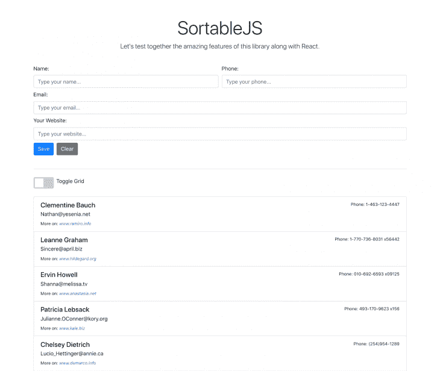
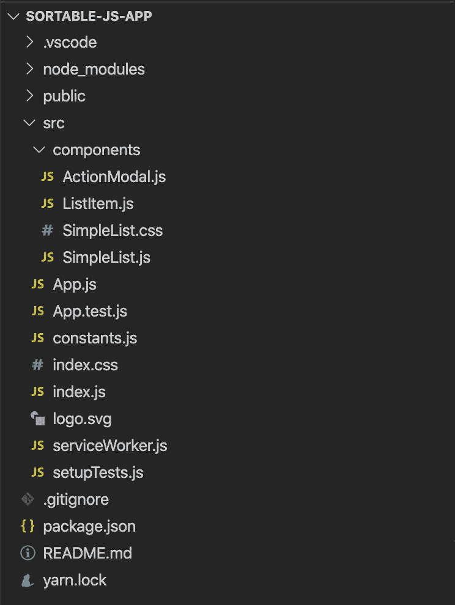
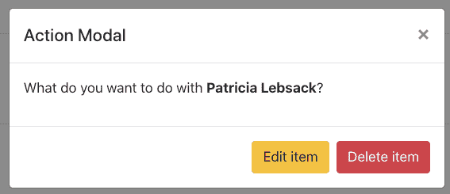

# 用 Sortable.js 和 React - LogRocket 博客创建重新排序的列表

> 原文：<https://blog.logrocket.com/creating-reordered-lists-with-sortable-js-and-react/>

今天有许多库处理拖放、列表排序和重新排序。在 jQuery widgets 时代，许多插件可以轻松地将简单的静态列表转换成深度交互的动态结构。

在普通 JavaScript 的世界里，我们有著名的 [Sortable.js](https://sortablejs.github.io/Sortable/) 。在撰写本文时，其 [GitHub repo](https://github.com/SortableJS/Sortable) 上有超过 20.5k 颗星星，库背后的社区已经建立了一个坚实的环境，遍布许多支持:jQuery、Meteor.js、AngularJS、React、Polymer、Vue、Ember、Knockout 和任何 CSS 库，例如 Bootstrap。

大多数[现代浏览器](https://caniuse.com/#search=drag)也支持它，包括在 API 中为非 HTML5 浏览器提供的回退选项，使我们能够在旧浏览器中测试行为，或者使桌面、移动和旧浏览器之间的拖放感觉更加一致。

在本教程中，我们将通过 [react-sortablejs](https://github.com/SortableJS/react-sortablejs) 包装组件探索 React 的官方支持。让我们分析 Sortable.js 是如何通过创建、编辑和删除一些条目来组织条目列表的。最后，我们将允许用户在项目列表和网格部署之间切换。

在本教程的最后，我们的示例将是这样的:



List of Sortable users.

## 设置

在进一步操作之前，请确保您已经安装了 Node.js 和 npm 的最新版本。为了利用[创建-反应-应用](https://reactjs.org/docs/create-a-new-react-app.html)工具链，我们还需要 [npx](https://www.npmjs.com/package/npx) 包。

在您喜欢的文件夹中，运行以下命令来初始化纱线管理工具，然后创建我们的 React 项目:

```
yarn init
npx create-react-app sortable-js-app
```

这将足以用我们目前需要的 React 文件初始化项目。接下来，安装以下依赖项:

```
yarn add axios jquery bootstrap popper.js react-sortablejs styled-components
```

Axios 依赖项将用于从名为 [json 占位符](https://jsonplaceholder.typicode.com/)的公共虚假 web 服务中检索一个预先获取的用户列表。它对于 CRUD 或其他类型的 web 应用程序测试非常有用。它提供了带有 JSON 数据的假端点，我们可以用这些数据来检查我们的应用程序结构是否正常工作。

需要 Bootstrap、jquery 和 Popper.js 来使 [Bootstrap](https://getbootstrap.com/) 框架工作。我们不会为这个例子创建任何开箱即用的设计，所以让我们把这个工作留给 Bootstrap。

最后两个依赖项是`react-sortablejs` lib 本身，以及 [styled-components](https://styled-components.com/) ，我们将使用它们来推断组件的内联样式。

最后，您需要将文件和文件夹的结构复制到您的本地示例中。项目结构如下所示:



Sortable.js files and folder structure.

在组件文件夹中，您可以找到`ActionModal.js`组件。它负责保存动作模式的逻辑，在单击列表或网格项目之一后，它将显示编辑和删除选项。

在这个例子中，我们将为用户列表提供一个完整的 CRUD。它让我们可以实时编辑和删除列表中的项目，并在之后立即刷新。

`ListItem.js`将为列表中的每一项托管结构，而`SimpleList.js`是我们的主要组件。它将存储其他函数和主要函数之间的集成，以支持示例运行。

## 构建示例

现在，让我们进入示例实现，从位于应用程序核心的`index.js`文件开始。

打开它，将其内容更改为以下内容:

```
import React from "react";
import ReactDOM from "react-dom";
import "./index.css";
import App from "./App";
import * as serviceWorker from "./serviceWorker";

import $ from "jquery";
import Popper from "popper.js";
import "bootstrap/dist/js/bootstrap.bundle.min";
import "bootstrap/dist/css/bootstrap.min.css";

ReactDOM.render(
  <React.StrictMode>
    <App />
  </React.StrictMode>,
  document.getElementById("root")
);

// If you want your app to work offline and load faster, you can change
// unregister() to register() below. Note this comes with some pitfalls.
// Learn more about service workers: https://bit.ly/CRA-PWA
serviceWorker.unregister();
```

在这里，我们只是导入引导 CSS 和 JavaScript 依赖项，这样当我们在后面的文件中使用它们时就可以看到它们。

您可能还注意到，jQuery 和 Popper 依赖项“没有被使用”，正如 VS 代码所声明的那样。然而，这里需要他们。否则，我们不能使用 Bootstrap 动态特性，就像 modal 一样。

让其余部分保持原样，并向前移动到`ActionModal`组件。打开该文件，并将以下代码放入其中:

```
import React from "react";

const ActionModal = ({ item, handleDelete }) => {
  return (
    <div className="modal fade" tabIndex="-1" id="actionModal" role="dialog">
      <div className="modal-dialog" role="document">
        <div className="modal-content">
          <div className="modal-header">
            <h5 className="modal-title">Action Modal</h5>
            <button
              type="button"
              className="close"
              data-dismiss="modal"
              aria-label="Close"
            >
              <span aria-hidden="true">&times;</span>
            </button>
          </div>
          <div className="modal-body">
            <p>
              What do you want to do with <b>{item.name}</b>?
            </p>
          </div>
          <div className="modal-footer">
            <button
              type="button"
              data-dismiss="modal"
              className="btn btn-warning"
            >
              Edit item
            </button>
            <button
              type="button"
              className="btn btn-danger"
              data-dismiss="modal"
              onClick={() => handleDelete(item.id)}
            >
              Delete item
            </button>
          </div>
        </div>
      </div>
    </div>
  );
};

export default ActionModal;
```

这里，我们接收两个属性作为参数:要编辑或删除的项目，以及处理删除的函数(`handleDelete`)。这些操作将由主组件执行。

例如，我们不会接收任何`handleEdit`函数，因为这个逻辑也将由根组件维护，正如您将看到的。

组件本身非常简单。它由几个 div 和它们各自的引导类组成，以及接收适当删除功能的删除按钮。模态应该是这样的:



Action modal in action.

现在，让我们来看看`ListItem`组件。这应该是它的内容:

```
import React from "react";
import styled from "styled-components";

const Item = styled.div`
  background-color: #fff6;
  cursor: pointer;
`;

const ListItem = ({ item, prepareAction, isGrid }) => {
  return (
    <Item
      className={isGrid ? "col-md-3 grid-group-item" : "list-group-item"}
      data-toggle="modal"
      data-target="#actionModal"
      id={`person-${item.id}`}
      key={item.id}
      onClick={() => prepareAction(item)}
    >
      <div className="d-flex w-100 justify-content-between">
        <h5 className="mb-1">{item.name}</h5>
        <small>Phone: {item.phone}</small>
      </div>
      <p className="mb-1">{item.email}</p>
      <small>
        More on:{" "}
        <i>
          <a href={`https://${item.website}`}>www.{item.website}</a>
        </i>
      </small>
    </Item>
  );
};

export default ListItem;
```

这是我们第一次使用`styled-components`。这只是为每个列表项添加背景颜色和光标样式的一小段代码。

反过来，该组件将接收三个道具:要显示的同一项、负责准备一个动作的函数(即，获取选中的项并将其放入相应的状态值中)，以及一个布尔值(`isGrid`)来确定用户是否将视图配置从列表更改为网格。

最新的布尔参数非常重要，因为它帮助组件的其余部分在关于样式类的列表和网格之间切换。这些类是 Bootstrap 查看列表和网格的方式。我们还将添加一些我们自己的 CSS 来增强整体风格。

还要注意，这部分代码与 Sortable.js 组件没有直接关系。但是，它很重要，因为最终，它表示将被放置在可排序组件中的单个项目。

请特别注意`Item`组件的关键属性。在`react-sortablejs`文档中有一个[警告](https://github.com/SortableJS/react-sortablejs#caveats--gotchas)，声明用户不要使用`index`作为列表项的键，因为排序将不起作用。相反，你应该使用对象的`id`。

剩下的代码只是将项目的属性连接到引导元素。

最后，我们有`SimpleList`组件。因为它有点长，我们将把它分成小块，这样更容易理解。

打开文件，在顶部添加以下内容:

```
import React, { useEffect, useState } from "react";
import { ReactSortable, Swap, Sortable } from "react-sortablejs";
import axios from "axios";

import ListItem from "./ListItem";
import { BASE_URL } from "../constants";
import ActionModal from "./ActionModal";

import "./SimpleList.css";

const initialState = {
  id: "",
  name: "",
  phone: "",
  email: "",
  website: "",
};

Sortable.mount(new Swap());

const SimpleList = () => {
  const [list, setList] = useState([]);
  const [user, setUser] = useState(initialState);
  const [isGrid, setIsGrid] = useState(false);

  const [isEdit, setIsEdit] = useState(false);
  const [isSuccess, setSuccess] = useState(false);
  const [actionItem, setActionItem] = useState(initialState);

};

export default SimpleList;
```

目前，我们只是在初始化必要的东西，比如`react-sortablejs`组件和 Axios。我们正在创建`initialState`对象，它将在必要时帮助重置状态。

可排序对象有助于一些辅助功能，如交换。默认情况下，Sortable.js 堆叠它的列表项，并将拖动的项放在您放下它的确切位置，相应地重新定位堆的其余部分。

当你声明它应该`swap`的时候，它会把被拖动的项目的位置切换到同一个项目被放下的位置。

剩下的代码只是一堆我们在 CRUD 工作中需要的状态变量。您还可以看到一个`constants.js`文件的导入，该文件也应该被创建并具有以下代码:

```
export const BASE_URL = `http://jsonplaceholder.typicode.com/users`;
```

这基本上是用用户端点来初始化我们的列表的常量。

* * *

### 更多来自 LogRocket 的精彩文章:

* * *

现在，让我们跳到组件函数，反过来，这些函数将帮助我们理解组件逻辑。您必须将以下代码放在状态变量声明之后:

```
const handleChange = (event) => {
    if (isEdit) {
      setActionItem({
        ...actionItem,
        [event.target.name]: event.target.value,
      });
    } else {
      setUser({
        ...user,
        [event.target.name]: event.target.value,
      });
    }
  };

  const prepareAction = (item) => {
    setIsEdit(true);
    setActionItem(item);
  };

  const handleSubmit = (event) => {
    event.preventDefault();

    if (isEdit) {
      const copyList = [...list];
      let index = copyList.findIndex((item) => item.id === actionItem.id);

      copyList[index] = actionItem;
      setList(copyList);
    } else {
      setList([...list, user]);
    }

    setSuccess(true);

    reset();
  };

  const handleDelete = (id) => {
    setList(list.filter((item) => item.id !== id));
    reset();
  };

  const handleLayoutChange = () => {
    setIsGrid(!isGrid);
  };

  const reset = () => {
    document.getElementById("list-form").reset();
    setIsEdit(false);
    setUser(initialState);
    setActionItem(initialState);

    setTimeout(function () {
      setSuccess(false);
    }, 5000);
  };

  useEffect(() => {
    axios.get(BASE_URL).then((res) => {
      setList(res.data);
    });
  }, []);
```

这里有几个要点。

首先，`handleChange`是一个函数，每当用户在相应的表单域中输入内容时，它将确保更新用户(如果是编辑过程，则更新`actionItem`)。每当用户点击一个项目，我们会认为这是一个编辑/删除它的意图。这就是为什么我们需要两个不同的对象来保存用户创建和编辑的值。

还有其他方法可以做到。例如，您可以在模态中显示编辑表单，但是为了简单起见，我们将坚持使用相同的表单。

`prepareAction`函数将把`isEdit`布尔值设置为真，因为这是一个编辑动作。它还会将当前项目(作为参数发送)设置为`actionItem`状态。这个对象将有助于在表单字段中显示正确的值。

`handleSubmit`负责表单提交流程。如果他们想编辑，创建一个当前用户列表的副本(我们不想弄乱他们的值)，找到当前选定项目的索引，并用当前的`actionItem`替换它的元素。因为通过`handleChange`功能的保证，它将会被正确地更新。

但是，如果它是一个正在创建的新用户，我们只需将它添加到列表中。确保每次创建/编辑后总是重置对象状态，因为新的动作可能会进一步发生。

reset 函数反过来调用表单重置特性，并重新初始化所有 React 状态的值。在这里，要特别注意 success 属性，该属性包含用于确定警报部分是否可见的布尔值。这个部分将在一个操作完成后显示一个成功消息，让用户知道应用程序中正在发生什么。

`handleDelete`只是删除用户列表，然后再次重置状态值。同时，`handleLayoutChange`函数切换定义布局应该是列表还是网格的布尔变量。

最后，我们有一个`useEffect`钩子，它将在 React 组件渲染后执行。它的工作是调用用户的外部端点，并在展示之前向我们的列表提供一些数据。

让我们用`return`内容来完成代码:

```
return (
  <>
    {isSuccess ? (
      <div
        className="alert alert-success alert-dismissible fade show"
        role="alert"
      >
        <strong>Success!</strong>
        <button
          type="button"
          className="close"
          data-dismiss="alert"
          aria-label="Close"
        >
          <span aria-hidden="true">&times;</span>
        </button>
      </div>
    ) : (
      ""
    )}

    <form onSubmit={handleSubmit} id="list-form">
      <div className="form-row">
        <div className="col">
          <label htmlFor="name">Name:</label>
          <input
            type="text"
            required
            className="form-control"
            id="name"
            name="name"
            defaultValue={actionItem.name}
            placeholder="Type your name..."
            onChange={handleChange}
          />
        </div>
        <div className="col">
          <label htmlFor="phone">Phone:</label>
          <input
            type="text"
            required
            className="form-control"
            id="phone"
            name="phone"
            defaultValue={actionItem.phone}
            placeholder="Type your phone..."
            onChange={handleChange}
          />
        </div>
      </div>

      <div className="form-row mt-2">
        <div className="col">
          <label htmlFor="email">Email:</label>
          <input
            type="text"
            required
            className="form-control"
            id="email"
            name="email"
            defaultValue={actionItem.email}
            placeholder="Type your email..."
            onChange={handleChange}
          />
        </div>
      </div>

      <div className="form-row mt-2">
        <div className="col">
          <label htmlFor="website">Your Website:</label>
          <input
            type="text"
            required
            className="form-control"
            id="website"
            name="website"
            defaultValue={actionItem.website}
            placeholder="Type your website..."
            onChange={handleChange}
          />
        </div>
      </div>

      <button type="submit" className="btn btn-primary mb-4 mt-2">
        Save
      </button>

      <button
        type="button"
        className="btn btn-secondary mb-4 ml-2 mt-2"
        onClick={reset}
      >
        Clear
      </button>
    </form>

    <hr className="mb-4" />

    <div className="mb-3">
      <label className="switch ">
        <input type="checkbox" onChange={handleLayoutChange} />
        <span className="slider"></span>
      </label>
      <span className="ml-2">Toggle Grid</span>
    </div>

    <ReactSortable
      swap
      id={isGrid ? "people-grid" : "people-list"}
      className={isGrid ? "row" : "list-group"}
      chosenClass="chosen-list"
      list={list}
      setList={setList}
      animation={150}
    >
      {isGrid
        ? parseToGrid(list).map((array) =>
            array.map((item) => (
              <ListItem
                isGrid={isGrid}
                prepareAction={prepareAction}
                item={item}
                key={item.id}
              />
            ))
          )
        : list.map((item) => (
            <ListItem
              isGrid={isGrid}
              prepareAction={prepareAction}
              item={item}
              key={item.id}
            />
          ))}
    </ReactSortable>

    <ActionModal item={actionItem} handleDelete={handleDelete} />
  </>
);
```

如您所见，这是一个很长的代码清单，因为页面中显示了许多组件。很明显，你可以把它分成更多的部分，并根据你的感觉进行改变。

开头显示了警报部分，当用户成功完成某项操作时，我们将在这里显示引导警告消息。

就在下面，有一个表单，表单的末尾有一个输入字段和一个提交按钮。请注意，每个字段的默认值直接与`actionItem`属性相关。

然后，我们得到一个切换开关，允许用户选择其项目的列表配置。它是手工制作的，所以我们需要一些 CSS 来使它的风格工作。

`ReactSortable`组件为主。它负责包装整个拖放列表。当它是一个网格或者一个列表时，我们也应该应用不同的规则，并且提供列表和`setList`值来填充它。

列表的布局与网格有点不同。网格由数组的数组组成——在我们的例子中，是用户数组的数组。同时，这个列表只是一个单独的数组。

这就是为什么我们首先检查处置是否是网格，以便我们可以调用适当的逻辑。`parseToGrid`函数有助于这一点，它根据参数将项目数组转换成一个独立的数组列表。

下面是它的内容，必须放在代码的末尾:

```
function parseToGrid(array, cols = 4) {
  let [...arr] = array;
  var res = [];
  while (arr.length) {
    res.push(arr.splice(0, cols));
  }
  return res;
}
```

最后，我们将调用`ActionModal`组件。重要的是要记住，它不会提前显示，因为按钮点击是触发这种行为的原因。

为了推断我们之前提到的定制样式，这是`SimpleList.css`文件的内容:

```
.chosen-list {
  background-color: teal !important;
  color: white;
}

.grid-group-item {
  padding: 0.75rem 1.25rem;
  border: 1px solid rgba(0, 0, 0, 0.125);
}

.switch {
  position: relative;
  display: inline-block;
  width: 60px;
  height: 34px;
}

.switch input {
  opacity: 0;
  width: 0;
  height: 0;
}

.slider {
  position: absolute;
  cursor: pointer;
  top: 0;
  left: 0;
  right: 0;
  bottom: 0;
  background-color: #ccc;
  -webkit-transition: 0.4s;
  transition: 0.4s;
  border-radius: 4px;
}

.slider:before {
  position: absolute;
  content: "";
  height: 26px;
  width: 26px;
  left: 4px;
  bottom: 4px;
  background-color: white;
  -webkit-transition: 0.4s;
  transition: 0.4s;
}

input:checked + .slider {
  background-color: #2196f3;
}

input:focus + .slider {
  box-shadow: 0 0 1px #2196f3;
}

input:checked + .slider:before {
  -webkit-transform: translateX(26px);
  -ms-transform: translateX(26px);
  transform: translateX(26px);
}
```

列表拼图的最后一小块属于 App 组件。在那里，您必须像这样导入`SimpleList`组件:

```
import React from "react";
import SimpleList from "./components/SimpleList";

const App = () => {
  return (
    <div className="container">
      <div className="px-3 py-3 pt-md-5 pb-md-4 mx-auto text-center">
        <h1 className="display-4">SortableJS</h1>
        <p className="lead">
          Let's test together the amazing features of this library along with
          React.
        </p>
      </div>
      <SimpleList />
    </div>
  );
};

export default App;
```

该代码内容的大部分与静态引导内容相关。列表组件被直接导入到底部。

## 结论

现在，是测试一切的时候了。继续玩 CRUD 操作、拖放和在一个视图处理和另一个视图处理之间切换的开关。

一个很好的练习就是通过改变样式或者向网格中添加新的级别来定制自己的配置。您甚至可以允许用户决定在网格系统中显示多少列。

我再怎么强调浏览 [SortableJS](https://github.com/SortableJS/Sortable) 和 [react-sortablejs](https://github.com/SortableJS/react-sortablejs) 的官方文件的必要性也不为过。如果你正在寻找其他库和框架的支持，在 Sortable.js 文档的末尾，你可以找到参考链接，以及社区制作的一些比较视频。

你也可以在这里找到这个例子的源代码。

## [LogRocket](https://lp.logrocket.com/blg/react-signup-general) :全面了解您的生产 React 应用

调试 React 应用程序可能很困难，尤其是当用户遇到难以重现的问题时。如果您对监视和跟踪 Redux 状态、自动显示 JavaScript 错误以及跟踪缓慢的网络请求和组件加载时间感兴趣，

[try LogRocket](https://lp.logrocket.com/blg/react-signup-general)

.

[ ](https://lp.logrocket.com/blg/react-signup-general) [](https://lp.logrocket.com/blg/react-signup-general) 

LogRocket 结合了会话回放、产品分析和错误跟踪，使软件团队能够创建理想的 web 和移动产品体验。这对你来说意味着什么？

LogRocket 不是猜测错误发生的原因，也不是要求用户提供截图和日志转储，而是让您回放问题，就像它们发生在您自己的浏览器中一样，以快速了解哪里出错了。

不再有嘈杂的警报。智能错误跟踪允许您对问题进行分类，然后从中学习。获得有影响的用户问题的通知，而不是误报。警报越少，有用的信号越多。

LogRocket Redux 中间件包为您的用户会话增加了一层额外的可见性。LogRocket 记录 Redux 存储中的所有操作和状态。

现代化您调试 React 应用的方式— [开始免费监控](https://lp.logrocket.com/blg/react-signup-general)。