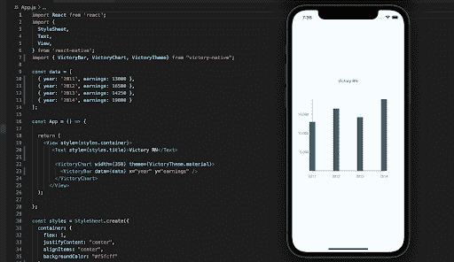
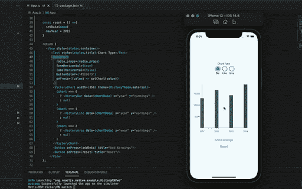
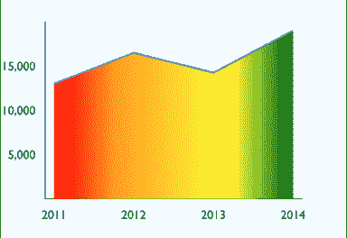
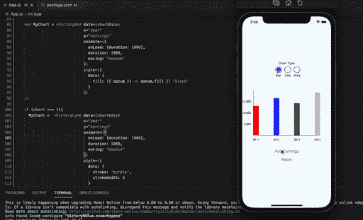

# 在 React Native - LogRocket 博客中创建胜利图表

> 原文：<https://blog.logrocket.com/creating-victory-charts-react-native/>

在构建应用程序时，有效的数据可视化通过使数据易于阅读和理解来吸引用户。

在本帖中，我们将介绍如何使用 [Victory](https://formidable.com/open-source/victory/about) 在 React Native 中实现数据可视化。

## 什么是胜利？

Victory 是 React 的数据可视化库。它包含各种基于组件的数据可视化工具，这些工具是交互式的、自以为是的，并且是完全可覆盖的。用 React 和 React 本机应用程序实现它是健壮且相对简单的。

这篇文章假设你有 React Native 的工作知识。如果你没有，这里有如何开始。

## 在 React Native 中创建胜利图表

现在，让我们创建您的第一个图表！首先，初始化一个 React 本地项目。

```
npx react-native init VictoryRN
```

接下来可以安装[胜利-原生](https://formidable.com/open-source/victory/docs/native)。

```
npm install victory-native
```

您还应该安装 [react-native-svg](https://www.npmjs.com/package/react-native-svg) ，以便将 React Native SVG 的本机依赖项链接到 iOS 和 Android 项目:

```
react-native install react-native-svg
```

现在，您已经初始化了 React 本机应用程序并安装了依赖项，让我们开始添加一些图表。首先，让我们导入一些 victory-native 模块，我们将在下面的代码中使用这些模块:

```
import { VictoryBar, VictoryChart, VictoryTheme } from "victory-native";
```

我们需要一些虚拟数据来填充我们的图表。这些数据由一个对象数组表示。

```
const data = [
 { year: '2011', earnings: 13000 },
 { year: '2012', earnings: 16500 },
 { year: '2013', earnings: 14250 },
 { year: '2014', earnings: 19000 }
];
```

最后，让我们添加第一个胜利图表组件，如下所示:

```
<VictoryChart width={350} theme={VictoryTheme.material}>
 <VictoryBar data={data} x="quarter" y="earnings" />
</VictoryChart>
```

在网站上，它说`VictoryChart`是一个包装器组件，在一组笛卡尔或极轴上呈现一组给定的孩子。`VictoryBar`是胜利提供的条形图组件。添加上述代码后，我们的应用程序应该是这样的:



维奥拉，你的第一张胜利图表！现在我们已经有了基本的图表实现，让我们来试验一下动态图表。我们希望图表能够随着数据的更新而实时更新。我们还可以添加单选按钮来更改正在使用的图表类型。

## 在 React Native 中动态制作胜利图表

胜利图表的一大优点是它们可以动态地更新状态值。“它们可以响应状态变化，并显示任何新数据的动画。与 D3.js 等其他库不同，它不需要直接控制 DOM。

这很重要，因为使用 React，直接与 DOM 交互是一种反模式。决定是 React 还是您的第三方库应该更新图表可能会有点模糊。

现在，让我们来看看这种活力的表现吧！首先，让我们使用 React 钩子将数据移入组件的状态，并将其存储为`chartData`。

```
const [chartData, setData] = useState(data)
```

接下来，让我们添加一个按钮，当单击该按钮时，会将另一个数据对象添加到我们的`chartData`中。

```
const addData = () => {
 var d = [...chartData]
 var obj = {year: `${maxYear}`, earnings: Math.random() * (20000 - 10000) + 10000}
 d.push(obj)
 setData(d)
 maxYear++
}
```

在这个函数中，我们将创建一个新对象添加到`chartData`中，年份是`maxYear`，这是一个全局变量，是最近使用的一个变量之后的年份。对于收入，我正在利用`Math.random()`生成一个介于 10，000 和 20，000 之间的随机数。

一旦我们构造好了对象，我们可以将它添加到`d`(使用这个变量是为了避免直接改变`chartData`)，然后将其设置为新的`chartData`。我们需要做的最后一件事是将`maxYear`加 1。现在，我们可以将新函数应用于 React 本机按钮组件。见下文。

```
<Button onPress={addData} title="Add Earnings"/>
```

为了整理，我们可以包括另一个按钮，将我们的图表重置为其原始状态。`onPress`将调用我们的重置函数，该函数简单地将`chartData`重置为`data`，将`maxYear`重置回 2015 年。

现在，我们的应用程序可以动态地向图表添加数据，让我们更进一步，允许用户更改用于可视化可用数据的图表类型。为此，我们可以在组件状态中存储图表类型的值。

```
const [chart, setChart] = useState(0)
```

我们现在可以安装[react-native-simple-radio-button](https://www.npmjs.com/package/react-native-simple-radio-button)，然后添加该库中提供的组件`RadioForm`。

```
<RadioForm
 radio_props={radio_props}
 formHorizontal={true}
 labelHorizontal={false}
 buttonColor={'#2196f3'}
 onPress={(value) => setChart(value)}
/>
```

我们的`radio_props`是一个对象数组。每个对象都有一个标签和值，对应于我们的`RadioForm`组件中的单选按钮。

```
const radio_props = [
 {label: 'Bar', value: 0}, 
 {label: 'Line', value: 1}, 
 {label: 'Area', value: 2}
]
```

既然我们可以更改图表类型，我们可以根据所选内容从不同的导入图表类型中进行选择。

```
<VictoryChart width={350}>
 {chart === 0
   ? <VictoryBar data={chartData} x="year" y="earnings" />
   : null
 }
 {chart === 1
   ? <VictoryLine data={chartData} x="year" y="earnings" />
   : null
 }
 {chart === 2
   ? <VictoryArea data={chartData} x="year" y="earnings" />
   : null
 }
</VictoryChart>
```

让我们看看添加了一些新功能的应用程序是什么样子的。



完美！现在，我们有了一个动态的应用程序，有多个可视化选项。这工作得很好，但是[条件渲染](https://reactjs.org/docs/conditional-rendering.html)有点重复。让我们试着提炼一下。

## 干式条件渲染

上面的条件渲染不是很干(不要重复自己)。我发现最好的解决方案是初始化一个变量，然后在 return 语句之前有条件地决定哪个图表应用于我们的变量。

```
var MyChart = <VictoryBar data={chartData} x="year" y="earnings" alignment="start"/>

if (chart === 1){
  MyChart =  <VictoryLine data={chartData} x="year" y="earnings" />
} else if (chart === 2){
  MyChart = <VictoryArea data={chartData} x="year" y="earnings" />
}
```

### 一旦我们有了我们的图表改变逻辑，让我们看看它如何与我们的图表包装器，`VictoryChart`。

```
<VictoryChart width={350} domainPadding={10}>
         {MyChart}
 </VictoryChart>
```

完美。`VictoryChart`需要注意的一个道具是`domainPadding`。这很简单，但我发现这很重要，因为如果不将它设置为 10，横条就不会被正确放置。注意下面的第一个例子没有`domainPadding`，第二个例子的`domainPadding`为 10。


现在我们来看看`data`道具。在我们的例子中，我们的[数据](https://formidable.com/open-source/victory/docs/common-props/#data)对象相当简单，但是如果您想从中获得更多，您可以向数据对象添加更多的键/值对。

```
{ x: 1, y: 1, label: "first", symbol: "star", opacity: 0.5, fill: "blue" }
```

这里我们的`x`和`y`属性指向一个数字而不是一个字符串。图表可以逐字呈现`x`和`y`的值(就像上面的例子)，或者它们可以基于指定的键找到值(就像在我们的例子中，使用了`earnings`和`year`)。

这对定制数据来说很好，因为我们不必转换键值对来遵循字面上的`x`和`y`解释。我们所要做的就是指定哪些键对应于 x 轴和 y 轴，这可以在有条件呈现的图表组件上声明。

还可以包含数据对象的样式和符号。但是，在最新版本的 Victory 中，这些样式不会自动应用，因此您需要向您的图表添加一个样式道具，这是一个在功能上呈现样式的对象。

见下文。

```
style={{
    data: {
      fill: ({ datum }) => datum.fill,
      opacity: ({ datum }) => datum.opacity
    }
  }}
```

需要注意的是，对于将数据呈现为一个数据集的图表(如`VictoryArea`和`VictoryLine` ), `datum`不是有效的道具。相反，你应该这样写样式。

```
style={{ data: { fill: "#c43a31" } }}
```

如果您想更好地定制颜色并为您的`VictoryArea`使用渐变而不是单一颜色，您可以使用 react-native-svg 提供的一些组件。

```
import {Defs, LinearGradient, Stop} from "react-native-svg";
```

将成为我们的说唱歌手。该组件“用于嵌入可在 SVG 图像中重用的定义”。`LinearGradient`嵌套在`Defs`组件中，用于生成应用程序中呈现的实际`LinearGradient`。在`LinearGradient`内部，我们将拥有多个`Stop`组件。一个`[<stop>](https://developer.mozilla.org/en-US/docs/Web/SVG/Element/stop)`元素“定义一种颜色和它在渐变中的位置。”

下面是我们为`VictoryArea`图表加入线性渐变的代码。它将被放置在`VictoryChart`内`{MyChart}`的正上方。

```
<Defs>
   <LinearGradient id="gradientStroke" >
     <Stop offset="0%" stopColor="red"/>
     <Stop offset="25%" stopColor="orange"/>
     <Stop offset="50%" stopColor="gold"/>
     <Stop offset="75%" stopColor="yellow"/>
     <Stop offset="100%" stopColor="green"/>
  </LinearGradient>
</Defs>
```

现在，为了让它与我们的面积图一起工作，我们需要为`VictoryArea`组件添加一些东西到我们的样式道具中。

```
style={{
  data: {
    fill: 'url(#gradientStroke)',
    ...  
  }
}}
```

`url(#gradientStroke)`是将我们的面积图的填充样式与我们的`LinearGradient`组件(ID 为`gradientStroke`)中定义的各种色标连接起来的东西。下面是我们实现当前线性渐变 UI 时的`VictoryArea`图表。



现在，梯度不符合我们的特定类别。它只是以 25%的增量将颜色渲染为整个图形的一部分。如果您希望它选择一种颜色并响应每个类别的大小(比如如果您动态添加更多数据)，您可以使用下面的代码，以及预定义的颜色列表。

```
const genStops = () => {
    var percentage = 100 / chartData.length
    //initialize at 0%
    var stops = [<Stop offset="0%" stopColor={colorArray[0]}/>]
    chartData.forEach((x, i)=>{
      console.log(pickColor(i))
      var stop = <Stop offset={`${percentage * (i + 1)}%`}
                       stopColor={pickColor(i)}
                 />
      stops.push(stop)
    })
    return stops
  }

  const pickColor = (i) => {
    var index = indexHelper(i, colorArray.length)
    return colorArray[index]
  }

  const indexHelper = (a, b) => {
    //start from beginning of color array when chartData gets too long
    return a >= b ? indexHelper(a - b, b) : a
  }

  const stops = genStops()
```

然后在你的`LinearGradient`组件中，不包括单独的`Stop`组件，你可以只包括`{stops}`。现在，渐变图表的颜色与类别相对应，而不是硬编码并作为一个整体应用于图表。

我想介绍的最后一个特性是动画。这是您可以传递给图表的道具，用于控制图表呈现的动画样式(而不是让它们立即呈现)。

为了给你的图表添加动画，`[animate](https://formidable.com/open-source/victory/docs/common-props/#animate)`道具是一个很好的起点。这个道具是一个接受一些属性的对象，其中我们将使用`duration`、`easing`和`onLoad`。

`Duration`指的是动画需要多长时间(毫秒)，`easing`是动画风格，`onLoad`是一个也可以指定`animate`属性的对象。这些属性应用于加载或更新的数据。

```
animate={{
  onLoad: {duration: 1000},
  duration: 1000,
  easing: "bounce"
}}
```

您可以将`animate`属性应用于`VictoryChart`或子图表。就我个人而言，当我将动画应用到`VictoryChart`时，我发现在图表类型之间转换时有问题，而如果我将它们直接添加到子图表，我没有问题。参见下图中的`animate`属性。



关于动画的更多信息，请查看胜利图表的[动画指南](https://formidable.com/open-source/victory/guides/animations)。

## 结论

Victory 是一个健壮而有效的数据可视化库，它的组成并不太死板。它固执己见，但也提供了足够的灵活性，使开发人员能够从内置功能之外的图表中获得更多。

Victory 也很有优势，因为它不像其他库那样直接与 DOM 交互。这允许更好的运行时间，更少的 UI 冲突，并且对于 React Native 是最佳的。

这个项目的所有源代码都可以在 GitHub 上找到。

## [LogRocket](https://lp.logrocket.com/blg/react-native-signup) :即时重现 React 原生应用中的问题。

[](https://lp.logrocket.com/blg/react-native-signup)

[LogRocket](https://lp.logrocket.com/blg/react-native-signup) 是一款 React 原生监控解决方案，可帮助您即时重现问题、确定 bug 的优先级并了解 React 原生应用的性能。

LogRocket 还可以向你展示用户是如何与你的应用程序互动的，从而帮助你提高转化率和产品使用率。LogRocket 的产品分析功能揭示了用户不完成特定流程或不采用新功能的原因。

开始主动监控您的 React 原生应用— [免费试用 LogRocket】。](https://lp.logrocket.com/blg/react-native-signup)