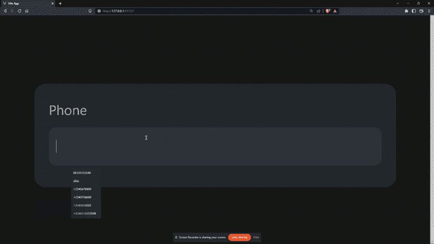
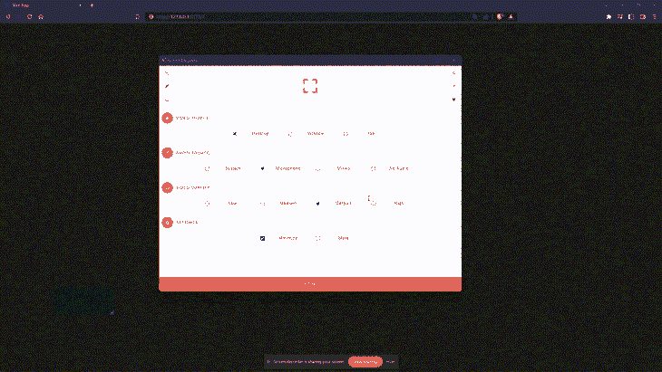
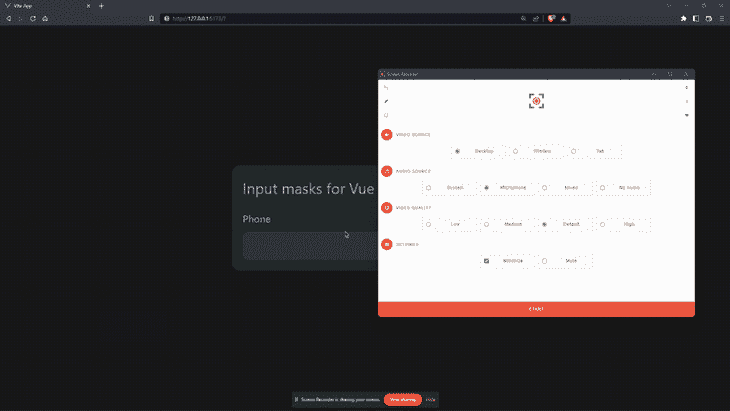
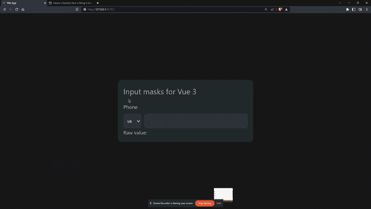
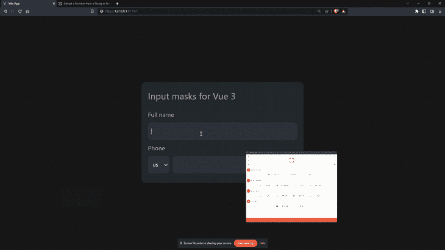
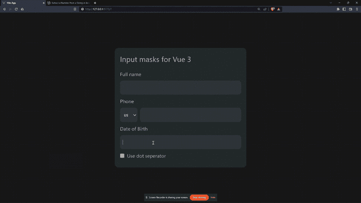
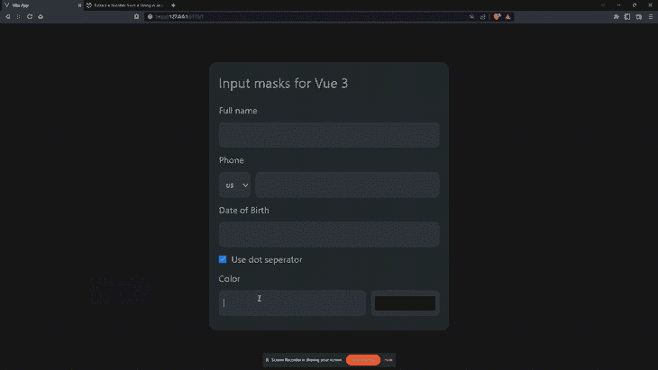

# 创建 Vue.js 屏蔽输入字段

> 原文：<https://blog.logrocket.com/creating-vue-masked-input-fields/>

输入掩码用于约束用户可以在输入字段中提供或输入的数据格式。输入掩码有助于提高数据的可读性，并告知用户所需的数据类型，从而有助于减少输入错误的几率。这是一个重要的概念，旨在保持用户提供的数据的一致性，保持用户界面的一致性，并减少接受来自用户的错误或不正确数据的机会。

这在电话号码输入字段中得到了最好的说明，它将用户输入到输入字段中的原始值`3453454634`格式化为`+1 (345) 345-4634`。



电话号码输入字段应用了一些限制，包括只能输入数字和最多 10 个字符。

另一件事是，在输入值时，输入也会自动格式化。当用户在输入中输入一些值时，会发生以下情况:

*   在本例中，国家代码`+1`被添加到值的前面
*   圆括号和连字符会添加到数字中

在这篇文章中，我们将介绍如何使用 Maska 库在 Vue.js 应用程序中使用输入掩码。

*向前跳转:*

## 将 Maska 用于 Vue 遮罩

现在我们已经看到了输入掩码的作用，让我们将它们添加到 Vue 应用程序中。在本文中，我们将使用 Vue.js 的 [Maska](https://github.com/beholdr/maska) 包。

Maska 是众多软件包中的一个，我们可以用它来为我们的应用程序添加输入掩码，而不必自己编写代码。Maska 的一些功能包括:

*   定义自定义令牌的能力
*   支持重复符号和动态遮罩
*   可用于任何输入，自定义或本地输入

要阅读本文，您应该对 JavaScript 和 Vue.js 有一个基本的了解，并且在您的机器上安装了最新版本的 [Node.js](https://nodejs.org/) 。

## 设置 Vue.js 应用程序

导航到您选择的目录并运行命令:

```
npm init [email protected]

```

这个命令将安装并执行官方的 vue 项目搭建工具 [create-vue](https://github.com/vuejs/create-vue) 。我们将看到几个可选特性的提示，比如类型脚本和测试支持:

```
√ Project name: ... vue-mask
√ Add TypeScript? ... No / Yes
√ Add JSX Support? ... No / Yes
√ Add Vue Router for Single Page Application development? ... No / Yes
√ Add Pinia for state management? ... No / Yes
√ Add Vitest for Unit Testing? ... No / Yes
√ Add an End-to-End Testing Solution? » No
√ Add ESLint for code quality? ... No / Yes

Scaffolding project in C:\Users\Mirac\Documents\writing\Using-input-masks-with-Vue\vue-mask...

Done.

```

现在运行:

```
cd vue-mask
npm install

```

一旦创建了应用程序，我们就安装 Maska 包:

```
npm install maska 

```

接下来，我们需要明确地将 Maska `plugin`添加到我们的应用程序中:

```
// ./src/main.js
import { createApp } from 'vue'
import App from './App.vue'
import Maska from 'maska'
import './assets/main.css'

createApp(App).use(Maska).mount('#app')

```

马斯卡已经在全球设立了！我们继续吧。

## 理解输入掩码语法

在我们构建屏蔽输入字段之前，让我们看一下输入屏蔽的常用语法。在 Maska 中，我们有几个缺省标记来表示由正则表达式`pattern`和其他几个选项定义的某些字符或字符组合，包括`uppercase`、`lowercase`等。

使用这些标记，我们可以指定允许用户在输入字段中输入的字符。您可以在下面看到默认令牌及其功能:

```
{
    // # represents numbers 0 - 9
    '#': { pattern: /[0-9]/ },

    // X represents alphanumeric characters 0 - 9, a - z and A - Z
    'X': { pattern: /[0-9a-zA-Z]/ },

    // S represents alphabets a - z and A - Z
    'S': { pattern: /[a-zA-Z]/ },

    // A represents alphabets a - z and A - Z transformed to uppercase
    'A': { pattern: /[a-zA-Z]/, uppercase: true },

    // a represents alphabets a - z and A - Z transformed to lowercase
    'a': { pattern: /[a-zA-Z]/, lowercase: true },

    // ! escapes next token (mask !# will render #)
    '!': { escape: true },

    // * is a repeat symbol that allows repeating current token until it’s valid (e.g. mask #* for all digits or A* A* A* A* for ALLOW FOUR WORDS ONLY)
    '*': { repeat: true }
}

```

## 使用输入掩码构建 Vue 表单

为了更好地演示如何在应用程序中使用输入掩码，让我们创建一个包含使用输入掩码的输入的表单。

将`./src/App.vue`中的模板代码替换为:

```
<!-- ./src/App.vue -->
<template>
  <section>
    <form class="form">
      <header>
        <h1>Input masks for Vue 3</h1>
      </header>
      <div class="wrapper">
        <div class="form-control">
          <label for="phone">Phone</label>
          <input v-maska="'###'" id="phone" type="text" />
        </div>
      </div>
    </form>
  </section>
</template>
<style>
section {
  width: 100%;
}
.form {
  background: rgb(36, 39, 44);
  padding: 1rem;
  border-radius: 0.75rem;
  width: 400px;
  margin: 0 auto;
}
.form > header {
  padding: 0 0 1rem 0;
}
.form > .wrapper {
}
.form-control {
  display: flex;
  flex-direction: column;
  gap: 0.5rem;
}
.form-control > input {
  padding: 0.85rem 0.5rem;
  border-radius: 0.5rem;
  border: none;
  outline: none;
  background: rgb(48, 52, 59);
  color: rgb(255, 255, 255);
}
</style>

```

这里，我们有一个带有输入字段和一些简单样式的表单。注意，在输入字段中，我们有一个值为`'``###``'`的指令`v-mask`:

```
<input v-maska="'###'" id="phone" type="text" />

```

`#`代表一个数字令牌；`###`代表三个数字记号。这意味着只能在输入字段中输入三位数字。



### 创建电话号码输入掩码

添加电话号码输入掩码很容易。我们只需要将`v-maska`指令更新为`['+1 (###) ##-##-##', '+1 (###) ###-##-##']`，这是一个[动态掩码](https://github.com/beholdr/maska#dynamic-masks)，通过传递一个数组而不是一个字符串作为掩码值，允许我们在单个输入上使用多个掩码。

```
<input
  v-maska="['+1 (###) ##-##-##', '+1 (###) ###-##-##']"
  id="phone"
  type="text"
/>

```

我们应该有这样的东西:



### 获取未屏蔽的原始值

Maska 允许我们使用`@maska`事件获得输入的原始值。这有助于了解和跟踪该值何时更新:

```
@maska="rawValue = $event.target.dataset.maskRawValue"

```

为了看到这一点，让我们添加一个`<s``elec``t>`标签，它允许我们为我们的电话号码选择一个国家代码。

```
<!-- ./src/App.vue -->
<script setup>
import { ref, watch } from "vue";

const selected = ref("+1");
const phoneValue = ref("");
const rawValue = ref("");
const options = ref([
  { text: "🇺🇸", value: "+1" },
  { text: "🇳🇬", value: "+234" },
]);

watch(selected, (value) => {
  phoneValue.value = rawValue.value;
});
</script>
<template>
  <section>
    <form class="form">
      <header>
        <h1>Input masks for Vue 3</h1>
      </header>
      <div class="wrapper">
        <div class="form-control">
          <label for="phone">Phone</label>
          <div class="input-group">
            <select v-model="selected">
              <option v-for="option in options" :value="option.value">
                {{ option.text }}
              </option>
            </select>
            <input
              v-maska="['+1 (###) ##-##-##', '+1 (###) ###-##-##']"
              v-model="phoneValue"
              id="phone"
              type="text"
              @maska="rawValue = $event.target.dataset.maskRawValue"
            />
          </div>
        </div>
        <p>Raw value: {{ rawValue }}</p>
      </div>
    </form>
  </section>
</template>

```

这里，我们设置了几个反应变量:

*   `selected`
*   `phoneValue`
*   `rawValue`
*   `options`

我们使用`v-model`将`selected`值绑定到我们的`<select>`标签，这允许`<options>`标签更新`selected`值。

我们还绑定到我们的`phoneValue`，它将包含被屏蔽的值。使用`@maska`，当用户输入数字时，我们将输入的原始值分配给`rawValue`。然后，我们设置了一个`watch`来监视`selected`，以便将输入的屏蔽值替换为原始值，从而防止它在电话号码中重复国家代码。



### 创建姓名输入字段

在典型的姓名字段中，我们只需要名字和姓氏。使用输入掩码，我们希望:

*   仅接受字母:使用`S`标记
*   最多只接受两个单词:重复`S`标记，直到在两个地方有效，`S* S*`

这样，我们的输入字段将如下所示:

```
<div class="form-control">
  <label for="full-name">Full name</label>
  <input
    type="text"
    name="full name"
    id="full-name"
    v-maska="'S* S*'"
  />
</div>

```

我们最多只能输入两个词:



### 创建日期输入掩码

对于我们的日期输入，我们将添加使用计算属性定制日期分隔符(或者是`.`或者是`/`)的能力。

在脚本部分，创建一个新的反应属性`useDot`，并将其分配给`false`。然后，创建一个根据`useDot`返回`##.##.###`或`##/##/####`的计算属性:

```
<!-- ./src/App.vue -->
<script setup>
// ...

const useDot = ref(true);
const dateMask = computed(() => (useDot.value ? "##.##.####" : "##/##/####"));
</script>

```

然后在模板中，创建新的输入，并将计算出的属性`dateMask`分配给`v-maska`:

```
<template>
  <section>
    <form class="form">
      <!-- ... -->
      <div class="wrapper">
      <!-- ... -->
        <div class="form-control">
          <label for="dob">Date of Birth</label>
          <input type="text" name="dob" id="dob" v-maska="dateMask" />
        </div>
        <div class="form-control checkbox">
          <input v-model="useDot" type="checkbox" name="use-dot" id="use-dot"  />
          <label for="use-dot">Use dot seperator</label>
        </div>
      </div>
    </form>
  </section>
</template>

```

看看这个:



### 使用颜色输入创建自定义颜色图案

对于这个输入，我们将创建我们的自定义模式。这是因为十六进制颜色有一个从`0`–`9`和`A`–`F`的取值范围，还有一个`#`。

让我们来看看如何使用自定义的令牌的[转换函数来满足所有这些条件。回到`./src/app.vue`，创建一个反应值`color`，并将其绑定到文本输入和颜色输入。我们还将创建一个`colorMask`计算属性，其中我们将定义一个十六进制模式并将其分配给自定义令牌`"``````H``````"`:](https://github.com/beholdr/maska#transform-function-for-tokens)

```
<!-- ./src/App.vue -->
<script setup>
import { computed, ref, watch } from "vue";
// ...

const color = ref("#000000");
const colorMask = computed(() => {
  const HEXPattern = { pattern: /[0-9a-fA-F]/, uppercase: true };
  return {
    mask: "!#HHHHHH",
    tokens: { H: HEXPattern },
  };
});
</script>
<template>
  <section>
    <form class="form">
      <!-- ... -->
      <div class="wrapper">
        <!-- ... -->
        <div class="form-control">
          <label for="color">Color</label>
          <div class="input-group">
            <input v-model="color" v-maska="colorMask" type="text" />
            <input v-model="color" type="color" name="color" id="color" />
          </div>
        </div>
      </div>
    </form>
  </section>
</template>

```

这是我们的实际颜色输入:



## 结论

到目前为止，我们已经了解了什么是输入掩码，它们的作用和好处，以及如何使用 maska(Vue . js 的输入掩码库)将它们添加到我们的 Vue 应用程序中。

要了解更多关于 Vue 中输入掩码的信息，请访问 [Maska 文档](https://github.com/beholdr/maska#readme)。你还可以[在 Netlify 上找到我们应用程序](https://vue-input-mask-form.netlify.app/)的实例。

## 像用户一样体验您的 Vue 应用

调试 Vue.js 应用程序可能会很困难，尤其是当用户会话期间有几十个(如果不是几百个)突变时。如果您对监视和跟踪生产中所有用户的 Vue 突变感兴趣，

[try LogRocket](https://lp.logrocket.com/blg/vue-signup)

.

[](https://lp.logrocket.com/blg/vue-signup)[https://logrocket.com/signup/](https://lp.logrocket.com/blg/vue-signup)

LogRocket 就像是网络和移动应用程序的 DVR，记录你的 Vue 应用程序中发生的一切，包括网络请求、JavaScript 错误、性能问题等等。您可以汇总并报告问题发生时应用程序的状态，而不是猜测问题发生的原因。

LogRocket Vuex 插件将 Vuex 突变记录到 LogRocket 控制台，为您提供导致错误的环境，以及出现问题时应用程序的状态。

现代化您调试 Vue 应用的方式- [开始免费监控](https://lp.logrocket.com/blg/vue-signup)。