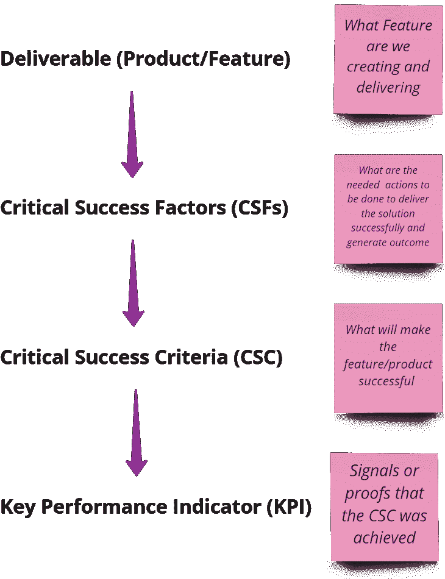

# 什么是关键的成功因素？示例、定义、概述

> 原文：<https://blog.logrocket.com/product-management/critical-success-factors-examples-definition/>

今天广泛使用的许多技术、框架、过程和工具都是在 20 世纪 90 年代后期项目管理的黄金时代发明的。随着这些新方法的出现，项目涉众需要确定项目成功所需的关键领域和行动。

这就是关键成功因素——产品或项目需要执行或考虑项目/产品成功的关键领域——出现的地方。

* * *

## 目录

* * *

## 什么是关键的成功因素？

关键成功因素(CSF)是一个特定的元素或活动，被认为是一个组织实现其使命或目标的关键。在产品管理中，关键成功因素是产品团队为交付解决用户问题的成功产品而采取的关键行动。

关键成功因素不同于关键成功标准和[关键绩效指标(KPI)](https://blog.logrocket.com/product-management/what-metrics-kpis-product-managers-track/)。关键成功因素是可以分配给所有者的基于行动的陈述。将 CSF 想象成一项任务，为了产品的成功，需要执行这项任务。

罗纳德·丹尼尔在 1961 年的《哈佛商业评论》上发表了一篇名为“[管理信息危机](https://clutejournals.com/index.php/JABR/article/view/6320)”的文章，首次提出了“关键成功因素”这个术语 CSF 在 90 年代后期进一步发展，以帮助项目经理确定需要做什么来更大规模地实现产品和业务目标。

## 谁设定关键的成功因素？

关键的成功因素通常是由产品负责人建立的，例如产品副总裁或首席产品官(CPO)，他们在组织中拥有产品开发流程。

在以产品为中心的组织中，CSF 被嵌入到产品开发过程中，有时产品经理甚至没有注意到它。

## 什么是结果层级？

CSF 是结果层次结构的第二层。[结果层级](https://www.betterevaluation.org/methods-approaches/methods/outcomes-hierarchy#:~:text=An%20outcomes%20hierarchy%20shows%20all,activities%20linked%20to%20these%20outcomes.)流程如下:

1.  [可交付物](#deliverable)
2.  [关键成功因素(CSF)](#criticalsuccessfactorscsfs)
3.  [关键成功标准(CSC)](#criticalsuccesscriteriacsc)
4.  [关键绩效指标](#keyperformanceindicatorskpis)

### 可交付的

可交付成果可以是您正在构建的任何产品、功能或增强功能。对于一个产品团队来说，要构建一个有效的特性，还应该有三个层次:关键成功因素(CSF)、关键成功标准(CSC)和关键性能指标(KPI)。

### 关键成功因素

如前所述，关键的成功因素是构建一个成功的产品需要做些什么。但是，在不了解成功的基线的情况下，有行动步骤是没有意义的。这就是 CSC 和 KPI 的用武之地。

### 关键成功标准(CSC)

关键成功标准是衡量您所追求的特性或计划是否成功的基准。把它当成你想要达到的最终结果。

关键成功标准的例子是增加每月注册用户的数量，减少从搜索到订购电子商务产品的时间等。

### 关键绩效指标(KPI)

KPI 是一种定量跟踪 CSC 的方法。那么，什么样的信号可能会告诉我们，我们实现了我们的 CSC？

回到我们之前的例子，如果只有一个新客户注册，我们能说我们成功了吗？当然不是。

将您的 CSC 与可量化的业务目标相结合将产生一个 KPI，例如，将每月注册用户的数量增加 30 %,或者将从搜索到下单的时间减少 3 分钟。

## 使用关键成功因素的好处

设置 CSF 可以帮助您:

当整个公司——而不仅仅是产品团队——都接受 CSF 时，跨职能团队可以更好地合作，摩擦最小。CSF 列表可以作为指南针，帮助这些不同的团队在实现产品目标所需的更广泛的活动路线图中导航。

### 简化产品和项目管理流程

通过将 CSF 嵌入到开发过程中，公司可以在任何计划中建立成功的模板——例如，构建特性，引入增强。源自过去经验的 CSF 将增加产品成功和实现目标的可能性。

### 协调利益相关方

建立取得成功的步骤将显著提高利益相关方的一致性。这将有助于产品团队减少来自外部部门的干扰，并允许外部部门和分部更清楚地了解整体成功流程，以最大限度地提高功能成功的机会。

## 如何识别关键的成功因素

识别关键的成功因素不是一次性的任务；这是一项持续的举措。虽然没有放之四海而皆准的方法，但建立关键成功因素的一般流程如下:

1.  [从产品战略开始](#1startwiththeproductstrategy)
2.  [分析旧项目](#2analyzeoldprojects)
3.  [与产品负责人合作](#3collaboratewithproductleaders)
4.  [迭代](#4iterate)

### 1.从产品策略开始

关键的成功因素因组织和产品而异。你的产品策略会回答你的大部分问题。

[产品战略](https://blog.logrocket.com/product-management/product-strategy-frameworks-examples/)应该概述你的产品愿望和目标。在构建您的第一个 CSF 时，牢记您的产品战略至关重要。这将有助于你和你的产品团队保持一致。

### 2.分析旧项目

你有没有开发出对你的所有成功指标都有积极影响的功能或产品？如果是，那就从那里开始。

在研讨会中，与您的利益相关者一起确定哪些因素影响了成功，哪些方面做对了，哪些方面做错了。此外，您还可以从其他利益相关者那里收集任何其他见解和意见。

* * *

订阅我们的产品管理简讯
将此类文章发送到您的收件箱

* * *

### 3.与产品负责人合作

既然你已经综合了利益相关者的观点，你就可以开始与产品负责人合作，制定你的关键成功因素的初稿。该草案应该包括为您的产品团队定制的步骤或重点领域，以提供完美的功能或增强。

### 4.重复

根据您的流程和 CSF 开始执行。验证这些成功因素的有效性，并衡量所交付的特性或增强是否产生了预期的结果。

根据结果，您应该始终调整您的 CSF，以适应新的见解和不断变化的条件。将您的 CSF 视为一个正在进行的项目，您将[与您的利益相关者以及最重要的是您的产品团队一起不断完善和改进](https://blog.logrocket.com/product-management/what-is-iterative-incremental-development-process-examples/)。

## 关键成功因素:示例

有许多产品开发过程组件可以作为一个关键的成功因素。以下是我在创业公司和产品组织中常见的四个成功因素:

### 建立清晰的产品战略

明确的产品策略是任何产品的第一步。您的战略将指导产品团队，帮助他们识别客户，引入增强功能和特性，更重要的是，根据战略目标对它们进行优先排序。

### 了解客户的棘手问题

构建不能解决客户问题的闪亮新功能对企业来说是无利可图的。它所做的只是消耗资源，而没有真正的业务投资回报(ROI)。

然而，[通过调查、客户访谈、观察、背景调查和焦点小组了解客户痛点](https://blog.logrocket.com/product-management/customer-feedback-why-you-should-seek-how-to-obtain/)将增加您向用户交付真正价值的机会，从而对[保持率](https://blog.logrocket.com/product-management/what-is-customer-retention-rate-how-to-calculate/)和激活率等指标产生积极影响。

### 定期分析产品性能

使用[产品分析工具](https://logrocket.com/features/product-analytics)或通过访谈等定性方法分析你的表现，将帮助你和你的团队创造出一流的产品。分析产品性能使产品团队能够为客户简化关键流程，帮助他们高效地完成任务和解决问题。

### 持续创造价值

以持续的方式创造价值并取悦用户将有助于你的产品在市场上立足。通过解决用户面临的越来越多的问题，你增加了他们留下来的机会。

## 最后的想法

关键成功因素(CSF)——也称为关键成果领域(KRAs)——对于任何产品团队取得成功都是至关重要的。CSF 帮助产品团队定义取得成功绝对必要的领域、行动和步骤。

CSF 还帮助产品团队评估他们擅长的领域和需要改进的领域。通过全面检测有缺陷的关键成功领域，他们可以对流程进行调整，并在后续阶段制造更好的产品。

*精选图片来源:[icon scout](https://iconscout.com/icon/checklist-1627460)*

## [LogRocket](https://lp.logrocket.com/blg/pm-signup) 产生产品见解，从而导致有意义的行动

[LogRocket](https://lp.logrocket.com/blg/pm-signup) 确定用户体验中的摩擦点，以便您能够做出明智的产品和设计变更决策，从而实现您的目标。

使用 LogRocket，您可以[了解影响您产品的问题的范围](https://logrocket.com/for/analytics-for-web-applications)，并优先考虑需要做出的更改。LogRocket 简化了工作流程，允许工程和设计团队使用与您相同的[数据进行工作](https://logrocket.com/for/web-analytics-solutions)，消除了对需要做什么的困惑。

让你的团队步调一致——今天就试试 [LogRocket](https://lp.logrocket.com/blg/pm-signup) 。

[Shehab Beram Follow](https://blog.logrocket.com/author/shehabberam/) A purpose-driven technologist, product manager, and consultant. I write essays that help you get smarter at your product management game.