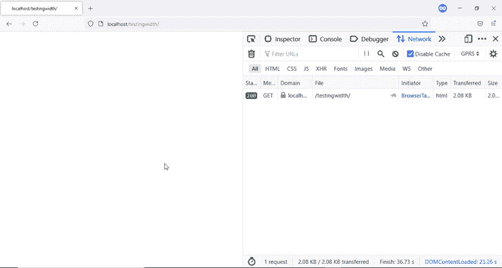
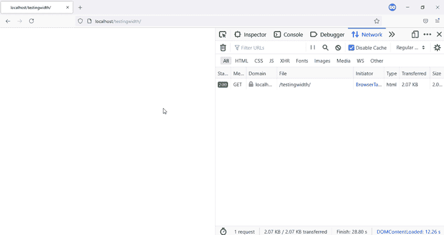
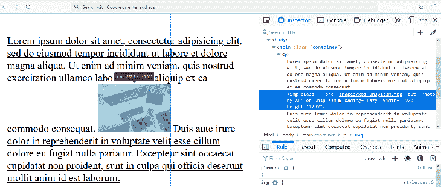
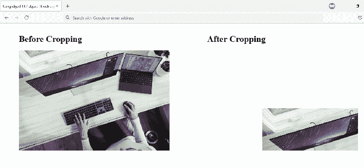
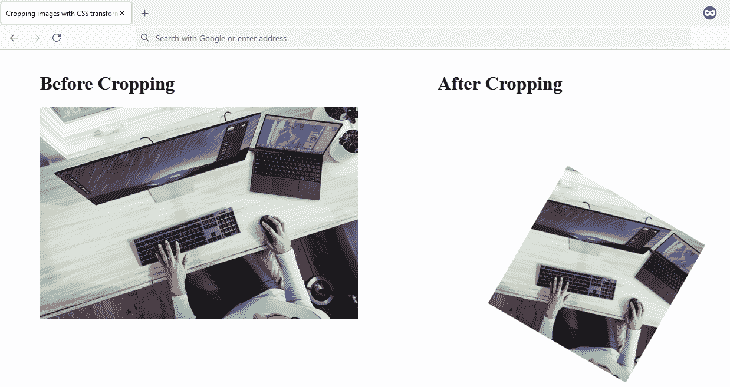
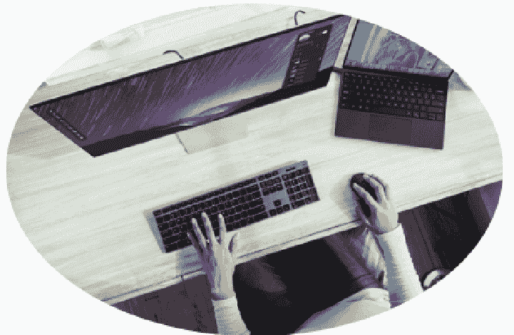
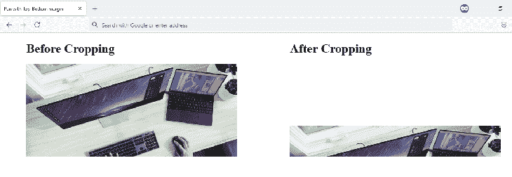
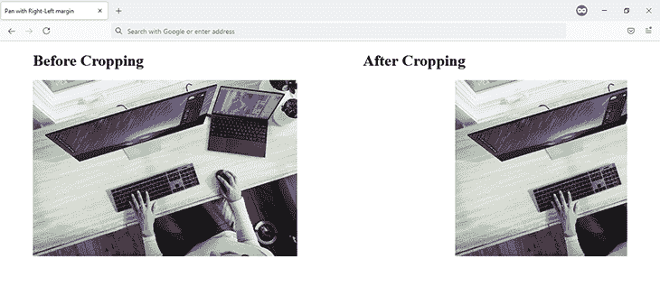

# 深入了解 CSS 中的裁剪图像

> 原文：<https://blog.logrocket.com/cropping-images-css-in-depth/>

## 介绍

假设您正在处理一个项目，需要裁剪一个图像以供显示，但是意识到您没有访问您最喜欢的图像编辑器的权限。不要烦恼。CSS 为您提供了一套属性，使您可以在浏览器中裁剪图像。

本文通过八个不同的例子解释了如何使用这些属性。最后，裁剪后的图像会显示在您的浏览器中，您将掌握以下八种使用 CSS 裁剪图像的技术。

### 现代图像标记

在我们开始切割图像之前，让我们回顾一下推荐的现代图像 HTML 标记。

在 HTML 中，图像被认为是由``标签定义的替换元素。像大多数 HTML 标签一样，``标签接受属性。这些属性决定了图像的渲染方式。其中两个属性是`width`和`height`，它们定义了图像的宽度和高度。

在现代 web 开发之前，您不需要在 HTML 中指定图像的宽度和高度，而是在 CSS 中指定。随着时间的推移，事情发生了变化。浏览器进化了，当然，推荐也变了。现在，这些建议是:

1.  通过 HTML ``标签中的`width`和`height`属性指定图像的宽度和高度
2.  通过值为`lazy`的`loading`属性延迟加载您的图像

这两个建议将在下一个代码块中描述，并解释为什么需要这样做。

```


```

当您在 HTML 中指定宽度和高度时，浏览器将在网页呈现期间下载图像之前为图像保留一个空间。

这一点在接下来的 GIF 中显而易见。很明显图片还没有下载，但是浏览器已经在页面上预留了空间。



如果您的 CSS 文件包含进一步修改图像宽度和高度的代码，浏览器将在不改变页面布局的情况下进行这些修改。

另一方面，如果在 HTML 中没有指定宽度和高度，浏览器在网页渲染时不会为图像预留空间。因此，当图像下载时，浏览器必须在它显示在指定位置之前计算它的尺寸。最终，由于您的文档层次结构，这会导致布局偏移，页面上的其他元素也会突然移动。

这一点在接下来的 GIF 中显而易见。请注意，当图像下载时，图像下方的文本突然被按下。



这被认为不利于用户体验。

在你开始切割之前，还有一件事你需要做，那就是:去掉图片下面的空间。

问题是:什么空间？

让我们找出答案。

### 移除图像下方的空间

在 HTML 中，默认情况下图像是内嵌的，这可能会导致一些奇怪的情况。当您将图像放入另一个容器时，您会注意到图像下方有一个空白。

下图显示了这一点。图像被放置在一个段落中，在浏览器 DevTools 中高亮显示。图像的底部与段落中的文本对齐，除非字母有额外的字形，如 q、y、p 或 g。



无论是填充还是边距都不会消除这个空间。

修复方法是将图像的属性值`display`更改为`block`——或者除了`inline` 之外的任何其他值——并且空间会得到处理。

```
img {
   display: block; /* This gets rid of the space beneath an image */
   width: 100%;
   height: auto;
}

```

本文后面的所有示例都会用到前面的代码块。

* * *

### 更多来自 LogRocket 的精彩文章:

* * *

现在，让我们开始一些切片和切块。

## 图像裁剪技术

### 使用`object-fit`和`object-position`裁剪图像

这种技术中使用的属性名称确切地说明了它们将做什么。`object-fit`允许你将一个像图像一样的物体放入给定的容器中。它接受以下值:

*   `contain`
*   `cover`
*   `fill`
*   `inherit`
*   `initial`
*   `none`
*   `revert`
*   `scale-down`
*   `unset`

另一方面，`object-position`允许您通过指定对象在水平和垂直平面上的位置，或者更好的是在 X 轴和 Y 轴上的位置，在容器中移动对象。

这允许您指定显示在屏幕上的图像部分，有效地裁剪图像。



下一个代码块描述了裁剪图像的基本代码。

```
.cropped-image {
   width: 100%;
   object-fit: cover;
   object-position: 200px 211px;
}

```

检查下面的代码笔以获得完整的代码。

参见 [CodePen](https://codepen.io) 上哈布杜尔·哈齐兹( [@ziizium](https://codepen.io/ziizium) )
的笔 [使用-object-fit-object-fit-with-object-position](https://codepen.io/ziizium/pen/poPKoVq)。

优势

#### 您只需要两行代码来裁剪图像

*   不足之处

#### 根据您通过`object-position`传递的值，裁剪后的图像可能会在较小的视窗中消失。您可以使用媒体查询来调整`object-position`的值，以避免这种情况

*   使用`calc()`和`padding-top`进行宽高比裁剪

### 您可以将图像裁剪成您想要的纵横比，但这需要一点额外的努力。

首先，你需要所谓的完美方形黑客。这个技巧允许您创建一个正方形图像，方法是将它放在一个具有以下特征的图像容器中:

其`height`被设置为`0`

*   `padding-top`值与容器的宽度相同
*   `position`属性值被设置为`relative`
*   之后，对图像执行以下操作:

将图像`width`和`height`设置为`100%`

*   用`0`的`top`值将图像`position`属性值设置为`absolute`
*   现在，使用`calc()`函数将您想要的纵横比指定为图像容器的`padding-top`值。

你可以在下面链接的 CodePen 中找到完整的实现。

```
.aspect-ratio-box {
    position: relative;
    width: 100%;
    height: 0;
    padding-top: calc(100% * (100 / 300));
}
​
.cropped-image {
    position: absolute;
    top: 0;
    width: 100%;
    height: 100%;
    object-fit: cover;
}

```

参见 [CodePen](https://codepen.io) 上哈布杜尔·哈泽兹( [@ziizium](https://codepen.io/ziizium) )
)用 calc()和 padding-top 的笔[。](https://codepen.io/ziizium/pen/yLbELqw)

优势

与`object-fit`相比，你会注意到这种方法创建了一个响应图像

#### 不足之处

*   与使用`object-fit`相比，需要更多的代码来实现这一点

#### 使用 CSS 变换裁剪图像

*   使用 CSS 变换进行裁剪建立在前面讨论的纵横比裁剪技术的基础上。这里的主要区别是我们将使用 CSS `transform`属性来缩放、移动和旋转图像。

### 

下面的代码块负责裁剪图像。

您也可以查看 CodePen 以了解完整的实现。

参见 [CodePen](https://codepen.io) 上哈布杜尔·哈泽兹( [@ziizium](https://codepen.io/ziizium) )
使用 CSS 变换的钢笔[。](https://codepen.io/ziizium/pen/QWvxWVZ)

```
.cropped-image {
    position: absolute;
    top: 0;
    width: 100%;
    height: 100%;
    object-fit: cover;
    object-position: 55%;
    transform: scale(0.5) translate(0, 5%) rotate(30deg);
}

```

优势

这种方法确保图像是响应性的

不足之处

#### 您仍然需要使用更多的代码来实现这一点

*   带有`border-radius`的圆形图像

#### 当您需要将图像裁剪成圆形时，这种技术是您的选择之一，另一种是`clip-path()`，我们将在本文后面讨论。

*   它的主要成分是值为`50%`的`border-radius`属性。

### 在你匆忙将这个`border-radius`值添加到你想要的圆角图像之前，观察下面链接的 CodePen 中的代码。你会注意到，为了得到我们需要的圆，我们必须使用我们在上一节中讨论过的正方技术。


全面实施:

参见 [CodePen](https://codepen.io) 上哈布杜尔·哈齐兹( [@ziizium](https://codepen.io/ziizium) )
的 [Crop-image-to-circle with-border-radius](https://codepen.io/ziizium/pen/dyWKygN)。


```
.cropped-image {
    position: absolute;
    height: 100%;
    width: 100%;
    top: 0;
    border-radius: 50%; /* This results in the circle */
}

```

没有这个黑客，你会得到一个椭圆形的蛋形结构，如下图所示。



优势

你可以得到一个完美的圆形，有反应的图像

不足之处

#### 与使用带有`circle()`值的`clip-path()`函数相比，这种方法使用了更多的代码，实际上只有一行代码

*   使用带有`overflow`和`width`的父尺寸和图像尺寸

#### 这种技术使用`width`、`height`和`margin`属性来有效地裁剪图像。

*   您在图像容器中和图像本身上指定一个`width`和`height`。

### 对于图像容器，这些属性的值被设计为分割图像的底部和最右边部分。应用于图像本身的`width`和`height`值用于缩放图像。最后，添加`margin`值，这将平移图像。

因此，图像被裁剪。


下面是负责的代码:

CodePen 包含完整的实现。

参见 [CodePen](https://codepen.io) 上哈布杜尔·哈齐兹( [@ziizium](https://codepen.io/ziizium) )
的 [Crop-image-using-parent-image-dimension-with overflow-and-margin](https://codepen.io/ziizium/pen/oNWyNQY)。

**优势**

```
.cropped {
    height: 200px;
}
​
.cropped-image {
    width: 400px;
    height: 300px;
    margin: 21px 0 0 -158px;
}

```

在裁剪图像时，你有更多的灵活性和精确性

不足之处

当您将图像的`width`和`height`指定为`100%`时，裁剪后的图像会隐藏在较小的视窗中

#### 用`margin-top`和`margin-bottom`平移至裁剪位置

*   这种技术利用顶部和底部的空白，并将它们应用到图像本身。这些也可以与父容器上的值设置为`hidden`的`overflow`属性一起使用。

#### 

*   参见 [CodePen](https://codepen.io) 上哈布杜尔·哈齐兹( [@ziizium](https://codepen.io/ziizium) )
    的笔 [平移-裁剪-图像-使用上下边距](https://codepen.io/ziizium/pen/ZEKREmd)。

### 优势

不足之处

这种裁剪技术不适合用于较小视窗的图像

```
.cropped-image {
    width: 100%;
    height: 100%;
    margin: 33.12% 0; /* This is responsible for the cropping */
}

```

较高的负边距值会模糊放置在裁剪图像之前的网页元素

用`margin-left`、`margin-right`和`width`进行平移裁剪

#### 这类似于前面讨论的技术，但是在这里，您使用右边距和左边距来裁剪图像。这使您能够指定裁剪图像的宽度。

#### 

*   下面是负责的代码:
*   CodePen 包含完整的实现。

### 参见 [CodePen](https://codepen.io) 上哈布杜尔·哈齐兹( [@ziizium](https://codepen.io/ziizium) )
的 [平移到作物](https://codepen.io/ziizium/pen/XWRYWQJ)。

优势

裁剪的图像是有响应的

不足之处

```
.cropped-image {
    width: 100%;
    margin: 0 34.88%;
}

```

您只能沿 X 轴(即水平线)进行裁剪

使用`clip-path()`功能进行裁剪

我把最好的留到了最后！有了`clip-path()`函数及其`polygon()`值的组合，您的裁剪能力只受您想象力的限制。

#### 

*   下一个代码块是负责前一幅图像中裁剪的`clip-path()`代码。

#### 如果你很难理解上面的`clip-path()`代码，这篇关于使用 clip-path() 的 [CSS 动画的文章将详细介绍如何阅读、理解和绘制你自己的`clip-path()`代码。](https://blog.logrocket.com/guide-to-css-animations-using-clip-path/)

*   下面的 CodePen 也包含了完整的实现。

### 参见 [CodePen](https://codepen.io) 上哈布杜尔·哈泽兹( [@ziizium](https://codepen.io/ziizium) )
的笔 [Crop-image-with-CSS-clip-path()](https://codepen.io/ziizium/pen/OJmEJGZ)。

易接近

如果图像包含的信息在裁剪时会丢失，那么无论浏览器视窗如何，最好不要裁剪图像。

建议您在使用本文中涉及的一些 CSS 属性之前检查浏览器支持。现代网络浏览器支持大多数技术，但是你应该注意到微软的 ie 浏览器不支持`object-fit`和`clip-path()`。

```
.cropped-image {
    height: 100%;
    clip-path: polygon(50% 0%, 0% 100%, 100% 100%);
}

```

如果你不确定某样东西是否受支持，你可以使用在线工具，比如[我可以使用](https://caniuse.com/)来查看最新版本吗？

表演

我在本文的 CodePen 演示中使用的图像非常大，1920 x 1282，459 kB。在您的项目中使用图像时，您应该确保不会向用户发送大文件并浪费他们的带宽。

如果你使用的是 PNG 图像文件，你可以使用类似于 [TinyPNG](https://tinypng.com/) 这样的工具来压缩它们。

## 结论

本文用八个不同的例子解释了如何用 CSS 裁剪图像，并快速讨论了每种方法的优缺点。大多数现代浏览器都支持这些示例，Internet Explorer 11 是一个明显的例外。

你的前端是否占用了用户的 CPU？

随着 web 前端变得越来越复杂，资源贪婪的特性对浏览器的要求越来越高。如果您对监控和跟踪生产环境中所有用户的客户端 CPU 使用、内存使用等感兴趣，

## .

LogRocket 就像是网络和移动应用的 DVR，记录你的网络应用或网站上发生的一切。您可以汇总和报告关键的前端性能指标，重放用户会话和应用程序状态，记录网络请求，并自动显示所有错误，而不是猜测问题发生的原因。

现代化您调试 web 和移动应用的方式— [开始免费监控](https://lp.logrocket.com/blg/css-signup)。

## Conclusion

This article explains how to crop images with CSS using eight different examples, and quickly discusses each method’s advantages and disadvantages. Most of these examples are supported in most modern browsers, with Internet Explorer 11 being a notable exception.

## Is your frontend hogging your users' CPU?

As web frontends get increasingly complex, resource-greedy features demand more and more from the browser. If you’re interested in monitoring and tracking client-side CPU usage, memory usage, and more for all of your users in production,

[try LogRocket](https://lp.logrocket.com/blg/css-signup)

.

[](https://lp.logrocket.com/blg/css-signup)[https://logrocket.com/signup/](https://lp.logrocket.com/blg/css-signup)

[LogRocket](https://lp.logrocket.com/blg/css-signup) is like a DVR for web and mobile apps, recording everything that happens in your web app or site. Instead of guessing why problems happen, you can aggregate and report on key frontend performance metrics, replay user sessions along with application state, log network requests, and automatically surface all errors.

Modernize how you debug web and mobile apps — [Start monitoring for free](https://lp.logrocket.com/blg/css-signup).